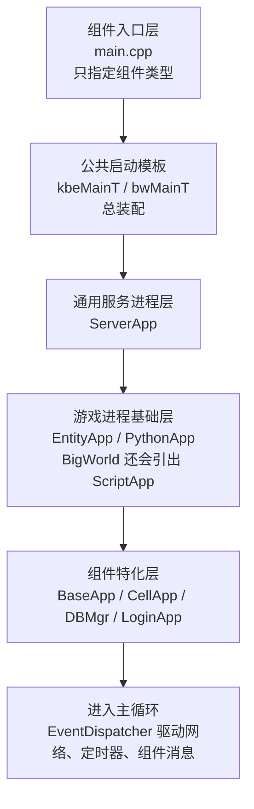
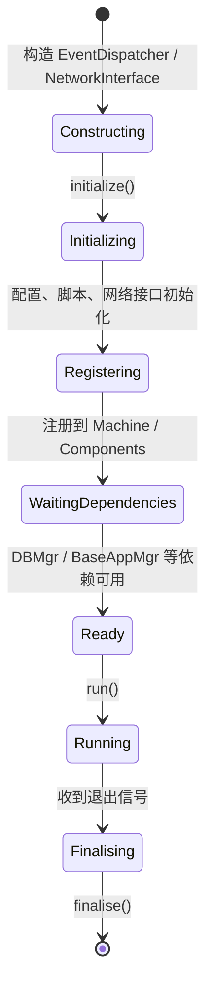
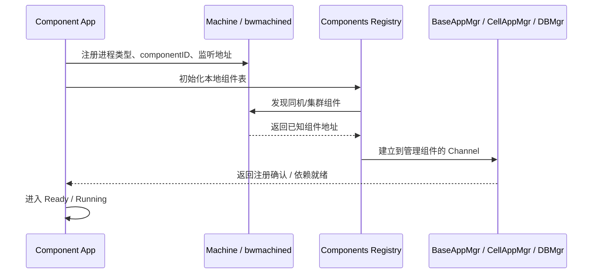

# 4. 启动流程与进程模型

> 这一章的目标是把"组件怎么跑起来"讲透。后面你读任何一个组件源码，都会不断回到这一章，因为所有差异都建立在共同启动骨架之上。

## 4.1 本章核心问题

- 一个 KBEngine / BigWorld 组件进程从 `main.cpp` 开始是怎样进入运行状态的？
- 公共初始化与组件特化逻辑分别落在哪里？
- "启动完成"和"准备好对外服务"为什么不是一回事？
- 主循环到底在做什么？

## 4.2 结论先行：大部分组件共享一条统一启动骨架

KBEngine 和 BigWorld 的启动流程都不是每个组件各写一套，而是四层分层模型：



这张图要强调的是：`main.cpp` 不是业务入口，真正决定组件行为的是最下层的组件特化逻辑。

## 4.3 main.cpp 为什么这么薄

### KBEngine

每个组件的 `main.cpp` 只做一件事：调 `kbeMainT<具体组件类型>(...)`。

```cpp
// 文件：kbe/src/server/baseapp/main.cpp（简化）
#include "baseapp.h"
// ... 大量 DEFINE_IN_INTERFACE 宏注册接口 ...

KBENGINE_MAIN(int argc, char* argv[])
{
    return kbeMainT<Baseapp>(argc, argv, COMPONENT_TYPE, ...);
}
```

`KBENGINE_MAIN` 宏展开后：

```cpp
// 文件：kbe/src/lib/server/kbemain.h（宏展开简化）
int main(int argc, char* argv[])
{
    loadConfig();
    g_componentID = genUUID64();
    parseMainCommandArgs(argc, argv);
    return kbeMain(argc, argv);
}
```

### BigWorld

同样模式，用 `BIGWORLD_MAIN` 宏 + `bwMainT<APP>`：

```cpp
// 文件：programming/bigworld/server/baseapp/main.cpp
int BIGWORLD_MAIN(int argc, char * argv[])
{
    if (isServiceApp(argc, argv))
        return bwMainT<ServiceApp>(argc, argv);
    else
        return bwMainT<BaseApp>(argc, argv);
}
```

```cpp
// 文件：programming/bigworld/lib/server/bwservice.hpp（宏展开简化）
int main(int argc, char * argv[])
{
    BWResource::init(argc, (const char**)argv);
    BWConfig::init(argc, argv);
    bwParseCommandLine(argc, argv);
    return bwMain(argc, argv);
}
```

**关键结论**：启动差异不在 `main.cpp`，而在 `BaseApp / CellApp / DBMgr` 自己的生命周期实现里。

## 4.4 kbeMainT / bwMainT：总装配点

### KBEngine kbeMainT

```cpp
// 文件：kbe/src/lib/server/kbemain.h（简化）
template<class SERVER_APP>
int kbeMainT(int argc, char* argv[], COMPONENT_TYPE componentType, ...)
{
    checkComponentID(componentType);     // 1. 确定 componentID
    setEvns();                           // 2. 环境变量
    DebugHelper::initialize();           // 3. 调试系统

    EventDispatcher dispatcher;          // 4. 事件分发器
    NetworkInterface ninterface(...);     // 5. 网络接口

    Components::getSingleton().initialize(...);  // 6. 组件管理器

    SERVER_APP app(dispatcher, ninterface, componentType, componentID); // 7. 构造组件
    Components::getSingleton().findLogger();  // 8. 查找日志组件
    START_MSG(SERVER_APP::getComponentName()); // 9. 打印启动信息

    app.initialize();                    // 10. 三阶段初始化
    app.run();                           // 11. 进入主循环
    app.finalise();                      // 12. 清理
    return 0;
}
```

### BigWorld bwMainT

```cpp
// 文件：programming/bigworld/lib/server/bwservice.hpp（简化）
template<class SERVER_APP>
int bwMainT(int argc, char* argv[], bool shouldLog = true)
{
    EventDispatcher dispatcher;

    // 通过 bwmachined 查询内部接口 IP
    MachineDaemon::queryForInternalInterface(ServerApp::discoveredInternalIP);

    NetworkInterface interface(&dispatcher, NETWORK_INTERFACE_INTERNAL, ...);

    return doBWMainT<SERVER_APP>(dispatcher, interface, argc, argv);
}

template<class SERVER_APP>
int doBWMainT(EventDispatcher& dispatcher, NetworkInterface& interface, ...)
{
    ServerAppConfig::init(SERVER_APP::Config::postInit);
    SERVER_APP serverApp(dispatcher, interface);
    return serverApp.runApp(argc, argv) ? EXIT_SUCCESS : EXIT_FAILURE;
}
```

**两者对比**：

| 步骤 | KBEngine | BigWorld |
|------|----------|----------|
| 确定身份 | `checkComponentID()` | 无（由 bwmachined 分配） |
| 内部 IP | 直接配置 | 查询 bwmachined |
| 配置初始化 | `loadConfig()` | `BWConfig::init()` |
| 资源初始化 | 无 | `BWResource::init()` |
| 组件管理 | `Components::initialize()` | 无（由注册机制替代） |
| 日志查找 | `findLogger()` | `BW_MESSAGE_FORWARDER3` 宏 |

BigWorld 多了一步"通过 bwmachined 查询内部 IP"——这和 BigWorld 更复杂的分布式注册中心设计一致。

## 4.5 为什么 componentID 必须最早确定

KBEngine 的 `checkComponentID()` 在所有业务初始化之前执行。

componentID 不是装饰信息，而是：
- 后续注册到 Machine / DBMgr 的身份标识
- 内部 Channel 路由的目标地址
- 日志中区分同类型不同实例的关键
- 实体 ID 分配的区间依据

**在组件还没开始跑业务前，"我是谁"就已经确定了。**

### 4.5.1 CID 在系统里的具体作用面（按调用链）

`componentID`（常写作 CID、`g_componentID`）不是“启动参数里的附加信息”，而是贯穿启动、注册、路由、运维的主键。

| 作用面 | 典型入口 | CID 的作用 |
|------|---------|-----------|
| 启动身份确定 | `kbe/src/lib/server/kbemain.h`：`parseMainCommandArgs()` / `checkComponentID()` / `setEvns()` | 确定本进程身份，并写入 `KBE_COMPONENTID` 环境变量 |
| 集群注册与冲突检测 | `kbe/src/lib/server/components.cpp`：`checkComponents()` / `addComponent()` | 检查同 UID 下 CID 是否冲突，维护组件注册表 |
| 身份冲突熔断 | `kbe/src/lib/server/serverapp.cpp`：`onIdentityillegal()` | 发现 CID 冲突时主动关停，避免“双身份进程”污染集群 |
| 通道发现与绑定 | `kbe/src/lib/server/components.cpp`：`findComponent(...)` / `connectComponent(...)` | 按 CID 找组件并拿到对应 `Channel` |
| RPC 路由 | `kbe/src/lib/entitydef/entitycallabstract.cpp`：`newCall_()` | `EntityCall` 按目标 CID 决定发往哪个组件接口 |
| EntityCall 序列化 | `kbe/src/lib/entitydef/datatype.cpp`：`EntityCallType::addToStream/createFromStream` | 把 CID 编进流，反序列化后恢复远端引用归属 |
| 本地实体归属判断 | `kbe/src/lib/server/entity_app.h`：`tryGetEntity(componentID, eid)` | 先比对 CID，再决定是否能本地命中实体 |
| 延迟转发缓冲 | `kbe/src/lib/server/forward_messagebuffer.cpp`：`push()` / `process()` | 以 CID 为 key 缓冲消息，组件就绪后按 CID 回放 |
| 回包目标校验 | `kbe/src/server/baseapp/baseapp.cpp`：`createToComponentID != g_componentID` 检查 | 防止异步回包投递到错误进程 |
| 运维定向控制 | `kbe/src/server/machine/machine.cpp`：`startserver()` / `stopserver()` | 可按 CID 精确启动、停止指定组件实例 |

因此，CID 在 KBEngine 里是“组件级路由主键”，不是仅用于日志展示的标识。

### 4.5.2 CID 是“手动优先”还是“自动生成”

答案不是二选一，而是**混合策略**：

1. 可以显式手动指定：启动参数 `--cid=...`
2. 不指定时可自动分配：通过 `IDComponentQuerier` 向 `machine` 请求
3. `machine/logger` 在特定自举场景下走本地公式生成（避免循环依赖）

对应源码链路：

- 入口先给一个随机初值：`g_componentID = genUUID64()`  
  `kbe/src/lib/server/kbemain.h`
- 解析命令行：有 `--cid` 就用；无 `--cid` 则置为 `-1` 表示“待分配”  
  `kbe/src/lib/server/kbemain.h:238`
- `checkComponentID()` 收束：
  - 普通组件：`g_componentID == -1` 时走 `IDComponentQuerier.query(...)`
  - `machine/logger`：按 `uid + macMD5 + componentType` 生成基础 CID
  `kbe/src/lib/server/kbemain.h:105`
- `machine` 端收到 `queryComponentID` 后做冲突消解（冲突则递增），并记录 `pidMD5 -> cid`  
  `kbe/src/server/machine/machine.cpp:334`

这解释了为什么模板启动脚本常直接写固定 `--cid`：这是运维上的“显式可控”，不是框架只能手动。

### 4.5.3 为什么不是“只按硬件自动生成”

看起来“按硬件自动”更省心，但在分布式运维里有几个硬约束：

| 约束 | 仅靠硬件自动的问题 | 混合策略的好处 |
|------|-------------------|---------------|
| 自举依赖 | 启动早期可能还未建立完整注册链路 | `machine/logger` 可本地生成，先活起来 |
| 同机多实例 | 同机同类型组件硬件指纹相同，难区分实例 | `machine` 端可按冲突递增分配 |
| 运维可控性 | 自动值不直观，定向停服/排障不方便 | 固定 `--cid` 可精确定位实例 |
| 环境稳定性 | 虚拟化/容器环境下硬件标识可能变化或重复 | 可回落到显式 CID，避免漂移 |

所以设计目标不是“完全自动”，而是“可自动、可显式、可收敛”。这比纯自动或纯手动都更稳健。

### 4.5.4 云/虚拟化环境下的 CID 实务建议

现在多数部署都在云厂商环境，CID 策略要按“可运维、可回放、可定位”设计，而不是仅靠硬件指纹。

常见漂移场景：

- 重建实例（Rebuild）后更换虚拟网卡，MAC 变化
- 热迁移或宿主机故障切换后，底层设备枚举顺序变化
- 模板克隆出多台实例，初始硬件标识重复
- 容器网络重建（CNI/Pod 重建）导致网卡名和地址变化

如果仅依赖“硬件编码 → CID”，会出现两类风险：

- 同一业务实例在重启/迁移后拿到新 CID，导致运维定位与路由认知断裂
- 不同实例在某些环境下拿到相同或冲突 CID，触发身份冲突和异常熔断

生产建议（推荐落地顺序）：

1. 管理/核心组件固定 CID：`machine`、`logger`、`dbmgr`、`baseappmgr`、`cellappmgr`
2. 可弹性工作组件用自动分配兜底：普通 `baseapp` / `cellapp` 扩缩容时由 `machine` 分配并冲突消解
3. 启动脚本或编排层显式传参：在 systemd、K8s、云主机启动器里统一下发 `--cid`
4. 监控 CID 异常信号：重点监控 `onIdentityillegal()`、重复注册、组件重连抖动
5. 把 CID 变更纳入发布流程：CID 调整需伴随变更单和回滚方案，避免“隐式漂移”

## 4.6 ServerApp：所有服务进程的通用生命周期

从运行态看，`ServerApp` 的生命周期不是“构造完就立刻对外服务”，而是下面这条状态链：



所以“进程启动了”和“可以接登录、接迁移、接脚本业务”不是同一个状态。后者通常还要等组件注册、脚本初始化和依赖组件回调完成。

### KBEngine ServerApp

```cpp
// 文件：kbe/src/lib/server/serverapp.h:44
class ServerApp :
    public SignalHandler,
    public TimerHandler,
    public ShutdownHandler,
    public Network::ChannelTimeOutHandler,
    public Network::ChannelDeregisterHandler,
    public Components::ComponentsNotificationHandler
{
    // ...
};

// 文件：kbe/src/lib/server/serverapp.cpp（简化）
bool ServerApp::initialize()
{
    installSignals();       // 信号处理
    initThreadPool();       // 线程池
    loadConfig();           // 配置加载
    initializeBegin();      // ← 阶段1：派生类覆写
    inInitialize();         // ← 阶段2：派生类覆写
    bool ret = initializeEnd();  // ← 阶段3：派生类覆写
    installSignals();       // 再次确保
    return ret && Network::initialize() && initializeWatcher();
}
```

### BigWorld ServerApp

```cpp
// 文件：programming/bigworld/lib/server/server_app.hpp
class ServerApp
{
    bool runApp(int argc, char* argv[]);
protected:
    virtual bool init(int argc, char* argv[]);
    virtual void fini() {}
    virtual bool run();
    // ...
};

// 文件：programming/bigworld/lib/server/server_app.cpp（简化）
bool ServerApp::runApp(int argc, char* argv[])
{
    if (this->init(argc, argv))        // 虚函数，派生类覆写
    {
        result = this->run();          // → processUntilBreak()
    }
    this->fini();
    return result;
}

bool ServerApp::run()
{
    mainDispatcher_.processUntilBreak();
    return true;
}
```

**共同点**：两者都遵循 `初始化 → 主循环 → 清理` 的生命周期，run 阶段的核心都是 `processUntilBreak()` 事件循环。

**差异**：KBEngine 用 `initializeBegin/inInitialize/initializeEnd` 三步细分初始化；BigWorld 只有一个 `init()` 虚函数，细分由继承链自己组织。

## 4.7 继承链的分层设计

### KBEngine

```
ServerApp                     ← 信号/线程池/配置/Watcher/主循环
  └── EntityApp<Entity>       ← + EntityDef + Python + Entity管理 + GameTick
        ├── Baseapp           ← + Proxy + Backup + Archive + Telnet
        └── Cellapp           ← + Space + AOI + Witness + Ghost + Telnet
  └── PythonApp               ← + Python 解释器
        ├── Loginapp          ← + 认证逻辑
        ├── Dbmgr             ← + DB操作 + globalData
        ├── Logger            ← + 日志汇聚
        └── Interfaces        ← + 外部接口网关
  └── ServerApp               ←（无额外能力）
        ├── Baseappmgr        ← 调度
        ├── Cellappmgr        ← 调度
        └── Machine           ← 注册中心
ClientApp                     ← 客户端 SDK 骨架
  └── Bots                    ← 压测机器人
```

### BigWorld

```
ServerApp                     ← 信号/Profiler/Watcher/主循环
  └── EntityApp              ← + 实体运行骨架
        └── ScriptApp        ← + Python解释器 + ScriptEvents
              ├── BaseApp    ← + 外部接口 + WorkerThread + BackupSender + Archiver
              ├── CellApp    ← + Cells/Spaces + GhostManager + Terrain
              └── DBApp      ← + 数据库操作 + BillingSystem
  └── ServerApp               ←（无额外能力）
        ├── LoginApp          ← + 外部TCP + 认证
        ├── BaseAppMgr        ← 调度
        └── CellAppMgr        ← 调度
```

**关键差异**：BigWorld 在 `EntityApp` 之上再加了一层 `ScriptApp`，专门处理 Python 解释器初始化和脚本事件系统。KBEngine 则把这部分能力拆散到 `EntityApp` 和 `PythonApp` 两支继承链里。

## 4.8 EntityApp：从"服务进程"变成"游戏进程"

```cpp
// 文件：kbe/src/lib/server/entity_app.h（简化）
template<class E>
class EntityApp : public ServerApp
{
    bool initialize() override
    {
        if (!ServerApp::initialize())
            return false;
        // 添加游戏主定时器（1秒/updateHertz 频率）
        gameTimer_ = dispatcher().addTimer(
            1000000 / updateHertz_, this, NULL);
        return true;
    }

    bool inInitialize() override
    {
        installPyScript();     // Python 解释器
        installPyModules();    // KBEngine 模块注册
        installEntityDef();    // 加载 .def 实体定义
        return true;
    }

    void handleGameTick()     // 每帧调用
    {
        ++g_kbetime;
        threadPool_.onMainThreadTick();
        handleTimers();
        networkInterface().processChannels(...);
    }
};
```

BigWorld 的 `EntityApp` 同样加了 TimeQueue 和 BgTaskManager：

```cpp
// 文件：programming/bigworld/lib/server/entity_app.cpp
EntityApp::EntityApp(EventDispatcher& mainDispatcher, NetworkInterface& interface) :
    ScriptApp(mainDispatcher, interface),
    timeQueue_(EntityAppConfig::updateHertz(), *this)
{
    ScriptTimers::init(timeQueue_);
}
```

**进入 EntityApp 层 = 进入实体驱动的游戏运行模型**。这不是一般的服务进程，而是有 EntityDef、Python 脚本、定时器系统的游戏进程。

## 4.9 三个核心组件的启动差异

### BaseApp 特化

KBEngine BaseApp 在 `initializeEnd()` 做了什么：

- 校验**账号实体必须继承自 `KBEngine.Proxy`**（不是普通 Entity）
- 创建 `Backuper` / `Archiver`（持久化编排能力）
- 启动 `TelnetServer`（运维接口）
- 安装 `InitProgressHandler`（启动进度追踪）

BigWorld BaseApp 的 `init()` 做了什么：

```cpp
// 文件：programming/bigworld/server/baseapp/baseapp.cpp（简化）
bool BaseApp::init(int argc, char* argv[])
{
    EntityApp::init(argc, argv);
    // ...
    findOtherProcesses();       // 查找 BaseAppMgr, CellAppMgr
    serveInterfaces();          // 注册接口
    bgTaskManager_.startThreads();  // 启动后台线程
    initScript();               // Python 初始化
    AddToBaseAppMgrHelper(...); // 异步注册到 BaseAppMgr
}
```

**BaseApp 启动完成的标志不只是"能处理实体"，还包括持久化编排能力就位、管理/运维接口就位。**

### CellApp 特化

KBEngine CellApp 在 `initializeEnd()` 做了什么：

- 创建 `GhostManager`（Ghost 消息管理）
- 启动 `WitnessedTimeoutHandler`（Witness 超时管理）
- 设置坐标系统 Y 轴开关
- 启动 `TelnetServer`

BigWorld CellApp 的 `init()` 做了什么：

```cpp
// 文件：programming/bigworld/server/cellapp/cellapp.cpp（简化）
bool CellApp::init(int argc, char* argv[])
{
    EntityApp::init(argc, argv);
    Entity::s_init();
    cellAppMgr_.init();         // 查找 CellAppMgr
    EntityType::init();         // 加载实体类型
    Terrain::Manager::instance(); // 地形管理
    AddToCellAppMgrHelper(...);  // 异步注册到 CellAppMgr
    preloadSpaces();            // 预加载空间
}
```

**CellApp 的特化重点在空间与 AOI 运行支撑、Ghost/Witness 机制就绪。**

### DBMgr 特化

KBEngine DBMgr 在初始化时做了什么：

- 配置实体 ID 递增范围
- 初始化 PythonApp + EntityDef
- 初始化数据库连接（MySQL / Redis）
- 启动 DB 主处理 timer
- 初始化 `globalData / baseAppData / cellAppData`
- 回调脚本 `onDBMgrReady`

BigWorld DBApp 的 `init()` 有**异步链式初始化**：

```cpp
// 文件：programming/bigworld/server/dbapp/dbapp.cpp（简化）
bool DBApp::init(int argc, char* argv[])
{
    return this->initNetwork() &&
           this->initBaseAppMgr() &&
           this->initScript(argc, argv) &&
           this->initEntityDefs() &&
           this->initExtensions() &&
           this->initDatabaseCreation() &&
           this->initDBAppMgrAsync();  // 异步注册
    // 后续还有 20+ 个异步初始化步骤...
}
```

BigWorld DBApp 的初始化是最复杂的：异步注册到 DBAppMgr → 获取 DB 锁 → 初始化 BillingSystem → 重置服务器状态 → 等待所有 App 就绪 → 自动加载实体 → 通知启动完成。**整个流程是异步链式回调**，不是同步阻塞。

## 4.10 集群注册：从"本地已启动"到"被集群看见"

组件启动不是各自孤立完成的。KBEngine 的 `InitProgressHandler` 展示了完整的启动收束过程：



这一步的核心不是“广播一下自己存在”，而是建立后续消息路由所需的组件身份和 `Channel`。

```cpp
// 文件：kbe/src/server/baseapp/initprogress_handler.cpp（简化）
// Baseapp 的 InitProgressHandler::process() 流程：
// 1. 检查错误状态
// 2. 等待 baseappmgr channel 可用
// 3. 等待 idClient 有可用 ID
// 4. 连接其他 EntityApp (sendRegisterNewApps)
// 5. 第一个 baseapp: 创建 EntityAutoLoader 从 DB 自动加载实体
// 6. 调用入口脚本的 onBaseAppReady(isFirstBaseapp)
// 7. 调用入口脚本的 onReadyForLogin(isFirstBaseapp)
// 8. 进度 >= 100% 时向 baseappmgr 报告完成
```

**三层启动状态**：

| 状态 | 含义 | 标志 |
|------|------|------|
| 进程已启动 | main → run | `processUntilBreak()` 开始循环 |
| 组件已注册进系统 | onRegisterNewApp | 其他组件能发现它 |
| 组件准备对外服务 | InitProgressHandler 完成并向管理组件汇报进度 | `onReadyForLogin` 已执行且 init progress 到达完成态 |

BigWorld 用 `AddToBaseAppMgrHelper` / `AddToCellAppMgrHelper` 做异步注册。DBApp 更复杂：`initDBAppMgrAsync()` 后有 20+ 个异步步骤。

## 4.11 主循环：EventDispatcher 驱动一切

两个项目的主循环本质相同：

```cpp
// KBEngine: kbe/src/lib/network/event_dispatcher.cpp
void EventDispatcher::processUntilBreak()
{
    breakProcessing_ = EVENT_DISPATCHER_STATUS_RUNNING;
    while (breakProcessing_ != EVENT_DISPATCHER_STATUS_BREAK_PROCESSING)
    {
        this->processOnce(true);
    }
}

int EventDispatcher::processOnce(bool shouldIdle)
{
    this->processTasks();       // 任务队列
    this->processTimers();      // 定时器（含 gameTick）
    this->processStats();       // 统计
    return this->processNetwork(shouldIdle);  // epoll/select 网络 I/O
}
```

```cpp
// BigWorld: programming/bigworld/lib/network/event_dispatcher.cpp
int EventDispatcher::processOnce(bool shouldIdle)
{
    this->processFrequentTasks();  // 高频任务
    this->processTimers();         // 定时器
    this->processStats();          // 统计
    return this->processNetwork(shouldIdle);  // 网络 I/O
}
```

**每一帧做了什么**：

```
processOnce()
  │
  ├── processTasks/processFrequentTasks  ← 非网络异步任务
  ├── processTimers                      ← 定时器（gameTick 在这里）
  │     └── handleGameTick()
  │           ├── ++g_kbetime            ← 时间推进
  │           ├── handleTimers()         ← 脚本定时器
  │           └── processChannels()      ← 处理网络消息
  ├── processStats                       ← 空闲统计
  └── processNetwork                     ← epoll/select 等待网络事件
```

对于 EntityApp，还有 `gameTimer_` 以 `updateHertz`（通常 10Hz）频率周期性触发 `handleGameTick()`。

## 4.12 关键源码入口

### KBEngine

| 层次 | 文件 | 关键方法 |
|------|------|---------|
| 入口 | `kbe/src/server/baseapp/main.cpp` | `KBENGINE_MAIN` |
| 模板 | `kbe/src/lib/server/kbemain.h` | `kbeMainT<SERVER_APP>` |
| 通用骨架 | `kbe/src/lib/server/serverapp.cpp` | `initialize()` / `run()` |
| 实体骨架 | `kbe/src/lib/server/entity_app.h` | `inInitialize()` / `handleGameTick()` |
| BaseApp 特化 | `kbe/src/server/baseapp/baseapp.h` | `initializeEnd()` |
| CellApp 特化 | `kbe/src/server/cellapp/cellapp.h` | `initializeEnd()` |
| DBMgr 特化 | `kbe/src/server/dbmgr/dbmgr.h` | `initializeBegin()` |
| 启动进度 | `kbe/src/server/baseapp/initprogress_handler.cpp` | `process()` |
| 主循环 | `kbe/src/lib/network/event_dispatcher.cpp` | `processUntilBreak()` / `processOnce()` |

### BigWorld

| 层次 | 文件 | 关键方法 |
|------|------|---------|
| 入口 | `server/baseapp/main.cpp` | `BIGWORLD_MAIN` |
| 模板 | `lib/server/bwservice.hpp` | `bwMainT<APP>` / `doBWMainT<APP>` |
| 通用骨架 | `lib/server/server_app.cpp` | `init()` / `run()` / `runApp()` |
| 脚本层 | `lib/server/script_app.cpp` | `initScript()` |
| 实体骨架 | `lib/server/entity_app.cpp` | `init()` + TimeQueue |
| 主循环 | `lib/network/event_dispatcher.cpp` | `processUntilBreak()` |

## 4.13 源码走读路径

### 路径一：跟踪 KBEngine BaseApp 启动全链

1. `kbe/src/server/baseapp/main.cpp` — 看 `KBENGINE_MAIN` 宏和 `DEFINE_IN_INTERFACE` 注册
2. `kbe/src/lib/server/kbemain.h` — `kbeMainT<Baseapp>` 的 12 步流程
3. `kbe/src/lib/server/serverapp.cpp` — `initialize()` 三阶段
4. `kbe/src/lib/server/entity_app.h` — `inInitialize()` 安装 Python + EntityDef
5. `kbe/src/server/baseapp/baseapp.h` / `baseapp.cpp` — 看 BaseApp 覆写了哪些阶段
6. `kbe/src/server/baseapp/initprogress_handler.cpp` — 从"启动完成"到"准备服务"

### 路径二：跟踪 BigWorld BaseApp 启动全链

1. `server/baseapp/main.cpp` — `BIGWORLD_MAIN`
2. `lib/server/bwservice.hpp` — `bwMainT<BaseApp>` + `doBWMainT<BaseApp>`
3. `lib/server/server_app.cpp` — `runApp()` → `init()` → `run()`
4. `lib/server/script_app.cpp` — `initScript()` Python 初始化
5. `server/baseapp/baseapp.cpp` — `init()` 的 10+ 步初始化

### 路径三：对比主循环

1. KBEngine: `kbe/src/lib/network/event_dispatcher.cpp` — `processOnce()`
2. BigWorld: `lib/network/event_dispatcher.cpp` — `processOnce()`
3. 对比：KBEngine 有 `processTasks()`，BigWorld 有 `processFrequentTasks()`

## 4.14 小结

- `main.cpp` 极薄，只负责把组件交给统一模板
- `kbeMainT / bwMainT` 负责总装配：创建 EventDispatcher + NetworkInterface + 组件实例
- `ServerApp` 负责通用服务进程生命周期：信号、线程池、配置、Watcher、主循环
- `EntityApp` 负责实体型组件骨架：EntityDef、Python 脚本、GameTick
- `BaseApp / CellApp / DBMgr` 在各自阶段补上差异化能力
- **启动分三层状态**：进程已启动 → 组件已注册 → 准备对外服务
- `componentID` 贯穿全链：启动身份 → 组件注册 → RPC 路由 → 运维定向控制
- 云环境应优先固定关键组件 CID，自动分配用于扩容兜底，降低虚拟化标识漂移风险
- 主循环 `processUntilBreak()` 本质是事件驱动：任务队列 → 定时器 → 网络 I/O
- BigWorld 多了 ScriptApp 层，DBApp 有最复杂的异步链式初始化
