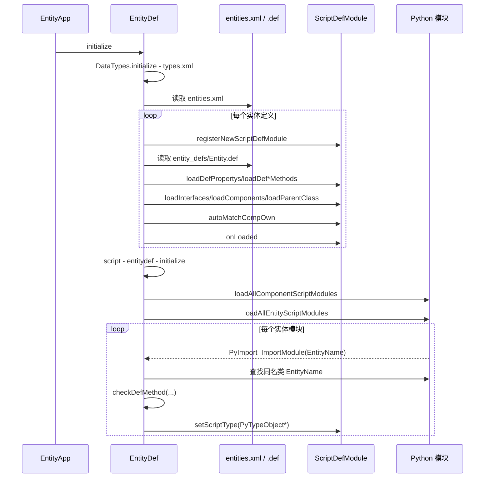
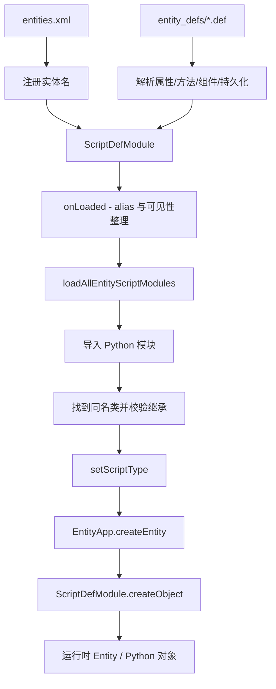
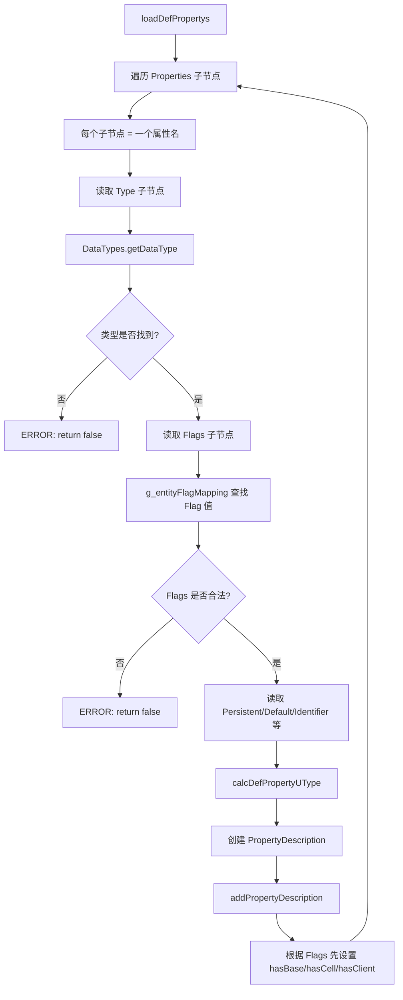
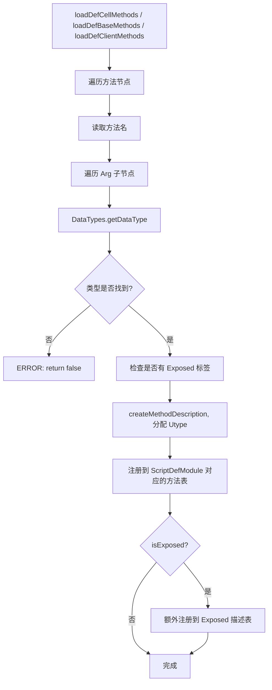
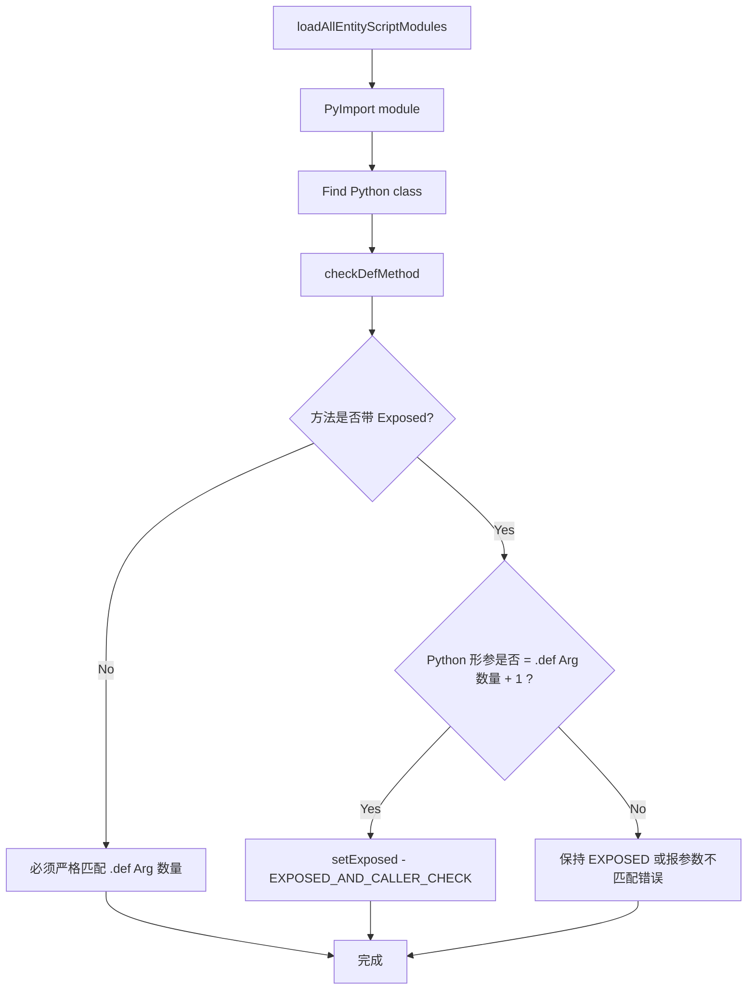
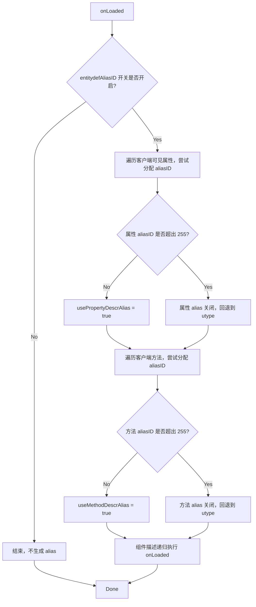
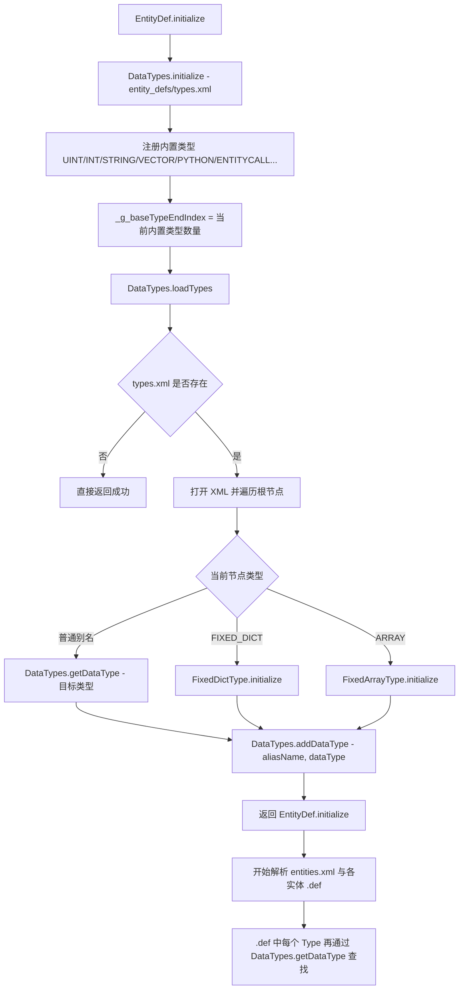
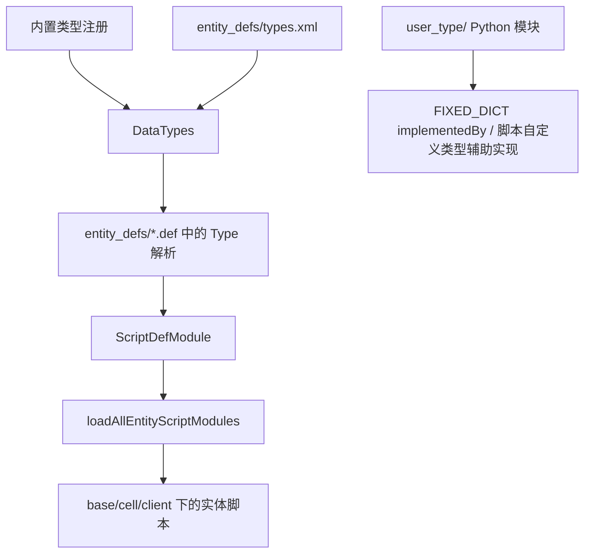
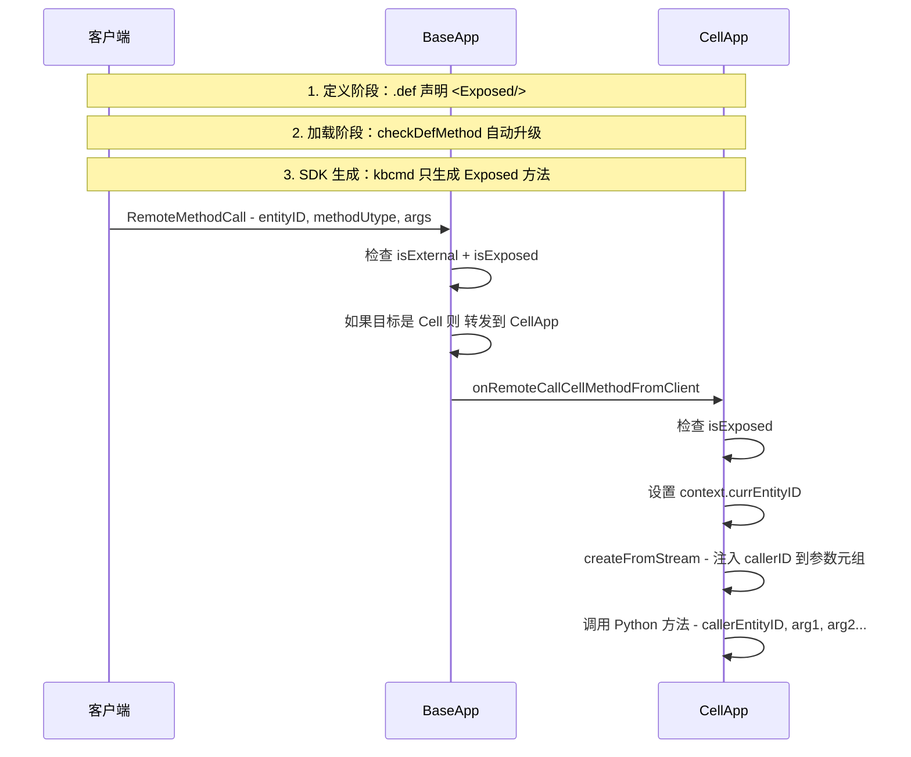
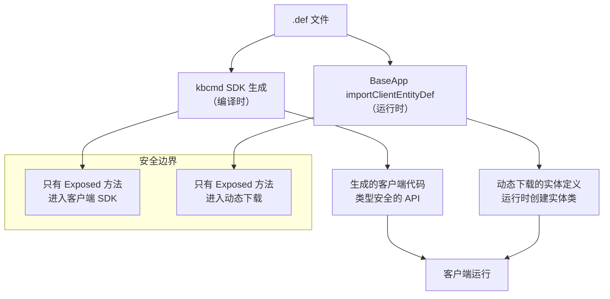

# 5. EntityDef 与实体定义系统

> EntityDef 不是配置文件解析器。它是脚本描述 + 网络协议描述 + 持久化描述的**三合一运行时骨架**。改一个 .def 文件，同时影响 Python 类型、网络消息格式和数据库表结构。

## 5.1 本章核心问题

- `.def` 文件到底是什么？它怎样同时驱动脚本层、网络层、持久化层？
- 一个属性有哪些"身份"？为什么理解这些身份是读懂源码的前提？
- `ScriptDefModule` / `EntityDescription` 怎样从 XML 变成运行时对象？
- EntityDef 的 alias 机制如何让属性同步包变小？
- 组件系统（Component）怎样让实体定义变成对象树？

## 5.2 .def 文件：不是配置，而是运行时骨架

### `.def` 和 Python 文件的关系

这一点很容易被误解：`.def` **不会自动生成**对应的 Python 实体脚本。源码里的真实关系是：

- `entities.xml` 先声明有哪些实体类型
- `entity_defs/<EntityName>.def` 定义这个实体的属性、方法、持久化和组件描述
- 运行时再按同一个 `EntityName` 去 `import` Python 模块，并要求模块里存在**同名类**

也就是说，`.def` 是**手写的结构定义**，Python 文件也是**手写的行为实现**，两者靠“同名约定 + 运行时校验”对上。

最小心智模型可以记成：

```text
scripts/
  entities.xml                                    ← 实体注册表
  entity_defs/
    Avatar.def                                    ← 手写，定义结构
    interfaces/
      AvatarCommon.def                            ← 接口定义（Mixin）
    components/
      Combat.def                                  ← 组件定义
  base/
    Avatar.py                                     ← 手写，Base 侧行为
    components/
      Combat.py                                   ← 组件 Base 侧行为
  cell/
    Avatar.py                                     ← 手写，Cell 侧行为
    components/
      Combat.py                                   ← 组件 Cell 侧行为
  client/
    Avatar.py                                     ← 手写，Client 侧行为（可选）
```

**命名规则**：

| 类型 | 定义文件 | 脚本目录 | 命名约束 |
|------|---------|---------|---------|
| 实体 | `entity_defs/<Name>.def` | `base/<Name>.py`、`cell/<Name>.py` | 模块名、类名、实体名三者一致 |
| 组件 | `entity_defs/components/<Name>.def` | `base/components/<Name>.py`、`cell/components/<Name>.py` | 组件类型名必须和定义名一致 |
| 接口 | `entity_defs/interfaces/<Name>.def` | 无独立脚本 | 纯定义级 Mixin，合并进宿主实体 |

### KBEngine .def 示例

```xml
<!-- 文件：scripts/entity_defs/Account.def -->
<root>
    <Properties>
        <playerName>
            <Type>      STRING          </Type>
            <Flags>     ALL_CLIENTS     </Flags>
            <Persistent>true            </Persistent>
        </playerName>
        <level>
            <Type>      INT32           </Type>
            <Flags>     BASE_AND_CLIENT </Flags>
            <Default>   1               </Default>
        </level>
    </Properties>
    <ClientMethods>
        <chatMessage>
            <Arg>   STRING  </Arg>
        </chatMessage>
    </ClientMethods>
    <CellMethods>  </CellMethods>
    <BaseMethods>  </BaseMethods>
</root>
```

### BigWorld .def 示例

```xml
<!-- 文件：scripts/entity_defs/ClientAvatar.def -->
<root>
    <Volatile>
        <position/>
        <yaw/>
        <pitch>    20    </pitch>
    </Volatile>
    <Properties>
        <playerName>
            <Type>            STRING                </Type>
            <Flags>           ALL_CLIENTS           </Flags>
            <Persistent>      true                  </Persistent>
            <Editable>        true                  </Editable>
            <Identifier>      true                  </Identifier>
        </playerName>
        <prop1>
            <Type>            INT32                 </Type>
            <Flags>           BASE_AND_CLIENT       </Flags>
            <Default>         1                     </Default>
        </prop1>
    </Properties>
    <ClientMethods>
        <chatMessage>
            <Arg>    STRING    </Arg>
        </chatMessage>
    </ClientMethods>
    <CellMethods>  </CellMethods>
    <BaseMethods>
        <logOff>
            <Exposed/>
        </logOff>
    </BaseMethods>
</root>
```

两者格式几乎相同——都源自 BigWorld 的设计。但 BigWorld 多了 `<Volatile>` 块（位置/朝向的实时属性）和 `<Exposed>` 标记（客户端可调用方法的安全边界）。

### entities.xml：实体入口声明

两个引擎都有 `entities.xml`，但格式不同。它是**实体注册表**——告诉引擎有哪些实体类型需要加载。

#### KBEngine 格式

```xml
<!-- KBEngine：文件 scripts/entities.xml -->
<root>
    <Account hasClient="true"></Account>
    <Avatar hasCell="true" hasBase="true" hasClient="true"></Avatar>
    <Space hasCell="true" hasBase="true"></Space>
    <Gate hasBase="true"></Gate>
</root>
```

KBEngine 的 `entities.xml` 节点上可以显式写 `hasCell`/`hasBase`/`hasClient`，但它们在源码里的角色更准确地说是**断言/覆盖项**，不是唯一来源：

| 属性 | 含义 | 默认值 | 效果 |
|------|------|--------|------|
| `hasCell` | 当前实体是否应当具备 Cell 部分 | 未声明时为“未指定” | 显式写了就覆盖自动判定 |
| `hasBase` | 当前实体是否应当具备 Base 部分 | 未声明时为“未指定” | 显式写了就覆盖自动判定 |
| `hasClient` | 当前实体是否应当具备 Client 部分 | 未声明时为“未指定” | 显式写了就覆盖自动判定 |

**真实判定规则**（源码 `scriptdef_module.cpp:302-528`，`autoMatchCompOwn()`）：

对普通实体，`autoMatchCompOwn()` 的顺序是：

1. 先读取 `entities.xml` 上的 `hasClient/hasCell/hasBase`，如果写了，就得到 0/1 断言值
2. 如果当前实体来自 `PyEntityDef`，还会读取 `DefContext.hasClient`
3. 再检查 `scripts/client/<Name>.py`、`scripts/base/<Name>.py`、`scripts/cell/<Name>.py` 是否存在
4. 如果某侧显式声明了 `hasX=true/false`，就以声明为准
5. 如果某侧没有显式声明，就以对应脚本文件是否存在为准

所以这里最重要的纠正是：

- **普通实体不是按“.def 里有没有某类属性/方法”直接决定 hasBase/hasCell/hasClient**
- **真正参与自动判定的是显式断言值和脚本文件存在性**

`.def` 在前面的加载过程中确实会先把 `ScriptDefModule` 标成有 Base/Cell/Client 属性或方法，但 `autoMatchCompOwn()` 会在后面按脚本存在性和 `entities.xml` 断言重新收束这三个布尔值。读源码时不能把这两步混成一条规则。

#### BigWorld 格式

BigWorld 的 `entities.xml` 使用分组方式，而非属性标记：

```xml
<!-- BigWorld：文件 scripts/entities.xml -->
<root>
    <ClientServerEntities>
        <Guard/>
        <ClientAvatar/>
        <Account/>
        <Space/>
    </ClientServerEntities>
    <ServerOnlyEntities/>
</root>
```

BigWorld 通过 `ClientServerEntities` vs `ServerOnlyEntities` 分组来区分实体是否需要在客户端存在，而不是通过 `hasCell/hasBase/hasClient` 三个独立属性。实体在 Cell/Base 上的存在与否由脚本目录（`cell/`、`base/`）自动判定。

#### 两种格式的核心区别

| 维度 | KBEngine | BigWorld |
|------|----------|---------|
| 客户端判定 | `hasClient="true"` 属性 | 放入 `ClientServerEntities` 分组 |
| Cell/Base 判定 | `hasCell`/`hasBase` 属性 + 自动推断 | 纯靠脚本目录自动判定 |
| 粒度 | 每个实体可独立声明三个属性 | 只有"客户端可见/不可见"两级 |
| 强制覆盖 | `hasClient="false"` 可禁止自动推断 | 分组即最终判定 |

### .def 文件的完整块结构

一个 `.def` 文件可以包含以下块：

```xml
<root>
    <!-- 1. 属性定义 -->
    <Properties>
        <propName> ... </propName>
    </Properties>

    <!-- 2. Cell 侧方法 -->
    <CellMethods>
        <methodName> ... </methodName>
    </CellMethods>

    <!-- 3. Base 侧方法 -->
    <BaseMethods>
        <methodName> ... </methodName>
    </BaseMethods>

    <!-- 4. Client 侧方法 -->
    <ClientMethods>
        <methodName> ... </methodName>
    </ClientMethods>

    <!-- 5. 接口复用 -->
    <Interfaces>
        <Interface> <SomeInterface/> </Interface>
    </Interfaces>

    <!-- 6. 组件 -->
    <Components>
        <compName> ... </compName>
    </Components>

    <!-- 7. 父类继承 -->
    <Parent> SomeParent </Parent>

    <!-- 8. LOD 级别 -->
    <DetailLevels>
        <NEAR>  <radius>30</radius>  <hyst>5</hyst>  </NEAR>
        <MEDIUM><radius>50</radius>  <hyst>5</hyst>  </MEDIUM>
        <FAR>   <radius>100</radius> <hyst>10</hyst> </FAR>
    </DetailLevels>

    <!-- 9. Volatile 属性 -->
    <Volatile>
        <position/>
        <yaw/>
        <pitch> 20 </pitch>
        <roll/>
    </Volatile>
</root>
```

所有块都是**可选的**。源码里 `loadDefInfo()` 按顺序依次尝试加载，某个块不存在时直接跳过。

### Properties 块：属性的所有子字段

```xml
<Properties>
    <playerName>
        <Type>            STRING          </Type>
        <Flags>           ALL_CLIENTS     </Flags>
        <Persistent>      true            </Persistent>
        <Default>         "NewPlayer"     </Default>
        <Identifier>      true            </Identifier>
        <DatabaseLength>  255             </DatabaseLength>
        <DetailLevel>     NEAR            </DetailLevel>
        <Index>           UNIQUE          </Index>
        <Utype>           100             </Utype>
    </playerName>
</Properties>
```

每个子字段的作用和源码出处：

| 字段 | 必填 | 类型 | 含义 | 引擎 | 源码位置 |
|------|------|------|------|------|---------|
| `<Type>` | 是 | 类型名 | 属性的数据类型，必须在 `DataTypes` 中已注册 | 两者 | `entitydef.cpp:loadDefPropertys()` |
| `<Flags>` | 是 | 枚举字符串 | 决定属性在哪个进程存在、同步给谁看 | 两者（BigWorld 叫 `DataFlags`） | `entitydef.cpp:loadDefPropertys()` |
| `<Persistent>` | 否 | bool | 是否持久化到数据库。默认 `false` | 两者 | `property.h:isPersistent_` |
| `<Default>` | 否 | 字符串 | 属性的默认值 | 两者 | `property.h:defaultValStr_` |
| `<Identifier>` | 否 | bool | 是否作为实体的标识字段（用于数据库查询）。默认 `false` | KBEngine | `property.h:identifier_` |
| `<DatabaseLength>` | 否 | int | 数据库字段长度（对 STRING 类型有效） | KBEngine | `property.h:databaseLength_` |
| `<DetailLevel>` | 否 | `NEAR` / `MEDIUM` / `FAR` | 属性所属的 LOD 档位；未写时按 `FAR` 处理 | KBEngine | `property.h:detailLevel_` |
| `<Index>` | 否 | 枚举 | 数据库索引类型：`UNIQUE`（唯一索引）/ 空（无索引）。默认无索引 | KBEngine | `entitydef.cpp:loadDefPropertys()` |
| `<Utype>` | 否 | uint16 | 手动指定属性定义的数值标识；不指定则自动递增分配 | KBEngine | `entitydef.cpp:calcDefPropertyUType()` |
| `<Editable>` | 否 | bool | 是否可在编辑器中修改 | BigWorld | `data_description.hpp` |

**Flags 的所有取值**（源码 `entitydef.cpp:160-174`，KBEngine 独有的命名方式，BigWorld 使用 `DataFlags` 位掩码但含义相同）：

| Flag | 值 | 含义 |
|------|-----|------|
| `BASE` | `ED_FLAG_BASE` | 只在 BaseApp 存在 |
| `CELL_PRIVATE` | `ED_FLAG_CELL_PRIVATE` | 只在 CellApp 本实体内部，不同步 |
| `CELL_PUBLIC` | `ED_FLAG_CELL_PUBLIC` | CellApp 内，可同步到 Ghost |
| `OWN_CLIENT` | `ED_FLAG_OWN_CLIENT` | 只同步给本实体的客户端 |
| `BASE_AND_CLIENT` | `ED_FLAG_BASE_AND_CLIENT` | Base 有 + 自己客户端也看到 |
| `ALL_CLIENTS` | `ED_FLAG_ALL_CLIENTS` | 所有能看到这个实体的客户端都看到 |
| `OTHER_CLIENTS` | `ED_FLAG_OTHER_CLIENTS` | 其他客户端看到，自己的不看到 |
| `CELL_AND_CLIENT` | `ED_FLAG_CELL_PUBLIC_AND_OWN` | Cell 有 + 自己客户端看到 |
| `CELL_AND_CLIENTS` | `ED_FLAG_ALL_CLIENTS` | Cell 有 + 所有客户端看到 |
| `CELL_AND_OTHER_CLIENTS` | `ED_FLAG_OTHER_CLIENTS` | Cell 有 + 其他客户端看到 |

这里也要特别纠正一处容易写错的规则：

- **`<Flags>` 在 KBEngine 的 XML 定义路径里是必填项**

`loadDefPropertys()` 缺少 `Flags` 会直接报错返回，不存在“默认 `CELL_PRIVATE`” 这一条 XML 规则。`CELL_PRIVATE` 是合法取值，但不是缺省值。

**`<Persistent>` 默认 `false`，`<DetailLevel>` 未写时按 `FAR`，`<Index>` 默认无索引，`<Utype>` 默认自动分配。**

Flag 本质上是位掩码，一个属性可以同时包含多个标志位。例如 `ALL_CLIENTS` 实际上是 `CELL_PUBLIC | OWN_CLIENT | OTHER_CLIENTS` 的组合。

**Flags 的判定规则**（源码 `scriptdef_module.cpp:846-861`）：

```cpp
int32 hasBaseFlags = flags & ENTITY_BASE_DATA_FLAGS;
if (hasBaseFlags > 0) pScriptModule->setBase(true);

int32 hasCellFlags = flags & ENTITY_CELL_DATA_FLAGS;
if (hasCellFlags > 0) pScriptModule->setCell(true);

int32 hasClientFlags = flags & ENTITY_CLIENT_DATA_FLAGS;
if (hasClientFlags > 0) pScriptModule->setClient(true);
```

属性 Flags 会在定义加载阶段先把 `ScriptDefModule` 标成有 Base/Cell/Client 相关内容，但最终 `hasBase_` / `hasCell_` / `hasClient_` 还会经过 `autoMatchCompOwn()` 结合脚本存在性和 `entities.xml` 断言再收束一次。

### CellMethods / BaseMethods / ClientMethods 块

三种方法块的结构相同，区别在于方法在哪个进程上执行：

```xml
<CellMethods>
    <onTakeDamage>
        <Arg>   INT32   </Arg>          <!-- 第1个参数 -->
        <Arg>   STRING  </Arg>          <!-- 第2个参数 -->
        <Utype> 200     </Utype>        <!-- 可选：手动指定方法ID -->
    </onTakeDamage>
    <onMove>
        <Arg> VECTOR3 </Arg>
    </onMove>
</CellMethods>

<BaseMethods>
    <login>
        <Exposed/>                     <!-- 标记为客户端可调用 -->
        <Arg> STRING </Arg>
        <Arg> STRING </Arg>
    </login>
</BaseMethods>

<ClientMethods>
    <onChatMessage>
        <Arg> STRING </Arg>
    </onChatMessage>
</ClientMethods>
```

方法块的子字段：

| 字段 | 必填 | 含义 | 引擎 |
|------|------|------|------|
| `<Arg>` | 可重复 | 方法参数的类型声明，按顺序对应参数列表。每个 `<Arg>` 必须是 `DataTypes` 中已注册的类型名 | 两者 |
| `<Exposed/>` | 否 | 仅用于 BaseMethods 和 CellMethods。标记此方法可被客户端调用（安全边界） | 两者（BigWorld 写法相同） |
| `<Utype>` | 否 | 手动指定方法定义的数值标识；不指定则自动递增分配 | KBEngine |
| `<ReturnValues>` | 否 | 方法返回值类型列表 | BigWorld（KBEngine 不支持方法返回值） |
| `<ReplayExposureLevel>` | 否 | 录制暴露级别 | BigWorld |

**三种方法域的区别**（两个引擎都有，BigWorld 对应 Client/Cell/Base Component）：

| 方法域 | 执行位置 | 谁能调用 | 网络消息（KBEngine） |
|--------|----------|----------|---------|
| `CellMethods` | CellApp | 服务端内部 EntityCall，或客户端经 BaseApp 中转 | `CellappInterface::onEntityCall` |
| `BaseMethods` | BaseApp | 服务端内部 EntityCall，或客户端直接调用 | `BaseappInterface::onRemoteMethodCall` |
| `ClientMethods` | 客户端 | 只有服务端 EntityCall 可调用（服务器→客户端） | `ClientInterface::onRemoteMethodCall` |

### `.def` 如何定义 RPC 规则

第 11 章会讲运行期的 `EntityCall` 发送链，但在第 5 章更应该先把**定义期规则**说清楚。就 KBEngine XML 路径而言，RPC 规则主要由这几条约束：

1. 方法必须写在 `CellMethods`、`BaseMethods`、`ClientMethods` 三个域之一  
   这决定了方法的 `methodDomain`，也决定了它会进入哪一张 `MethodDescription` 表
2. 参数列表只由重复的 `<Arg>` 定义，顺序就是序列化顺序  
   运行期编码和解码都依赖这个顺序
3. `BaseMethods` / `CellMethods` 可以带 `<Exposed/>`  
   这决定客户端是否有权限调用该方法
4. `ClientMethods` 是服务端→客户端方法，不存在客户端再去调用客户端方法这条规则
5. KBEngine XML 定义不支持返回值列表  
   `.def` 中的方法是单向调用定义；需要异步结果时走 CallbackMgr 之类的旁路机制
6. 同一实体模块里的方法 `Utype` 必须全局唯一  
   Base/Cell/Client 三个域之间也不能冲突

### Python 实现必须和 `.def` 方法签名对齐

这不是“最好一致”，而是 `checkDefMethod()` 的硬校验：

- 如果 `.def` 里声明了方法，Python 类里必须存在同名方法
- Python 实参个数必须和 `.def` 的 `<Arg>` 数量一致
- 唯一的特例是：如果这个方法带 `<Exposed/>`，并且 Python 形参比 `.def` 多 1 个，KBEngine 会把它升级为 `EXPOSED_AND_CALLER_CHECK`

也就是说，下面两种写法都可能合法：

```python
def login(self, name, password):
    ...
```

```python
def login(self, callerID, name, password):
    ...
```

第二种只有在该方法本来就是 `Exposed` 时才成立。此时多出来的第一个参数会被引擎解释成“调用者 ID”，用于脚本层自行做权限检查。

### 定义期到运行期的最短映射

可以把 `.def` 对 RPC 的约束压缩成这一张表：

| `.def` 中的东西 | 运行期对应物 | 作用 |
|----------------|-------------|------|
| 方法所在块：`BaseMethods` / `CellMethods` / `ClientMethods` | `MethodDescription::methodDomain_` | 决定调用目标域 |
| `<Arg>` 顺序 | `argTypes_` | 决定参数编码/解码顺序 |
| `<Exposed/>` | `exposedType_` | 决定客户端能否调用 |
| Python 同名方法 | `checkDefMethod()` | 决定脚本类是否合法 |
| `<Utype>` 或自动分配 | `utype_` | 方法描述的数值标识；RPC 编解码时据此定位 `MethodDescription` |

### DetailLevels 块：LOD 距离分级

#### 什么是 LOD

LOD（Level of Detail，细节级别）是游戏引擎中常见的优化手段。核心思想：**离得远的对象少同步数据，离得近的多同步数据**。

在 MMO 场景中，一个玩家周围可能有上百个可见实体。如果每个实体的所有属性都全量同步，带宽和 CPU 都撑不住。LOD 通过距离分级解决这个问题：

```
观察者（玩家）
    │
    ├── NEAR 半径内（30m）
    │     同步：血量、名字、装备列表、Buff 列表、动作状态 ...
    │
    ├── MEDIUM 半径内（80m）
    │     同步：血量、名字、动作状态 ...（去掉装备列表、Buff 列表）
    │
    └── FAR 半径内（180m）
          同步：名字、动作状态 ...（只保留最基本的信息）
```

属性通过 `<DetailLevel>` 子字段绑定到某个 LOD 级别。只有当观察者在该级别的半径内时，该属性才会被同步。

#### .def 中的声明方式

```xml
<DetailLevels>
    <NEAR>   <radius>30</radius>   <hyst>5</hyst>   </NEAR>
    <MEDIUM> <radius>50</radius>   <hyst>5</hyst>   </MEDIUM>
    <FAR>    <radius>100</radius>  <hyst>10</hyst>  </FAR>
</DetailLevels>
```

源码加载逻辑（`entitydef.cpp:403-466`）：

- **NEAR**：直接读取 radius 和 hyst
- **MEDIUM**：读取的 radius 会累加上 `NEAR.radius + NEAR.hyst`
- **FAR**：读取的 radius 会累加上 `MEDIUM.radius + MEDIUM.hyst`

也就是说，radius 是**增量**值，最终的实际半径是逐级累加的。以上面的配置为例：

| 级别 | 配置的 radius | 累加计算 | 实际半径 |
|------|-------------|---------|---------|
| NEAR | 30 | 直接取 | 30m |
| MEDIUM | 50 | 50 + 30 + 5 | 85m |
| FAR | 100 | 100 + 85 + 5 | 190m |

#### hyst 是什么：防止 LOD 边界抖动

hyst（hysteresis，滞后值）用于防止实体在 LOD 边界来回切换导致的属性同步抖动：

- **进入**某级：距离 < radius → 升级到更高级别（同步更多属性）
- **退出**某级：距离 > radius + hyst → 降级到更低级别（停止同步部分属性）

没有 hyst 的话，实体恰好在边界上徘徊时会不断触发属性同步/取消同步，造成带宽浪费和客户端闪烁。

### Volatile 块：位置/朝向的实时属性

```xml
<Volatile>
    <position/>
    <yaw/>
    <pitch> 20 </pitch>
    <roll/>
</Volatile>
```

Volatile 属性是高频更新的位置和朝向信息，不走普通属性同步通道。

源码加载逻辑（`entitydef.cpp:470-535`）：

| 子字段 | 格式 | 含义 |
|--------|------|------|
| `<position/>` | 自闭合或带值 | 空标签 = 始终同步；带数值 = 精度阈值 |
| `<yaw/>` | 同上 | 偏航角 |
| `<pitch>20</pitch>` | 带数值 | 俯仰角，20 表示变化超过 20 度时同步 |
| `<roll/>` | 同上 | 翻滚角 |

如果某个轴既没有值也没有空标签，则该轴不同步（`-1.f` 表示禁用）。

### Components 块：组件声明

```xml
<Components>
    <CombatComponent>
        <Type>      Combat      </Type>
        <Persistent> true        </Persistent>
    </CombatComponent>
</Components>
```

组件让实体定义变成对象树。这里的 `<Type>Combat</Type>` 会去加载 `entity_defs/components/Combat.def`，不是普通实体的 `entity_defs/Combat.def`。组件的所有属性和方法会被映射到宿主实体的属性空间。详见 5.11 节。

### Interfaces 块：定义级 Mixin

```xml
<Interfaces>
    <Interface>
        <AvatarCommon/>
    </Interface>
</Interfaces>
```

Interfaces 会将 `entity_defs/interfaces/AvatarCommon.def` 中的属性和方法**直接摊平合并**到当前实体的 ScriptDefModule 中，不产生独立组件实例。详见 5.10 节。

### 如果 Python 文件需要手动创建，规则是什么

按 KBEngine 当前加载逻辑，至少要满足下面几条：

1. `entities.xml` 里先有实体名，例如 `Avatar`
2. `entity_defs/Avatar.def` 存在，且定义合法
3. Python 可导入到模块 `Avatar`
4. 这个模块内部必须存在类 `Avatar`
5. 这个类必须继承自当前进程允许的 KBEngine 脚本基类，而不是任意普通 Python 类

也就是说，下面这种命名是对的：

```text
scripts/
  entities.xml
  entity_defs/
    Avatar.def
  base/
    Avatar.py
  cell/
    Avatar.py
```

真正被 `PyImport_ImportModule("Avatar")` 导入的是模块名 `Avatar`，不是文件名随便起、类名再另写一个别名。模块名、类名、实体名三者要统一。

如果缺了会发生什么：

- 缺 Python 模块：`EntityDef::initialize: Could not load EntityModule[Avatar]`
- 模块存在但类名不对：`Could not find EntityClass[Avatar]`
- 类存在但继承不对：`EntityClass Avatar is not derived from KBEngine.[...]`
- `.def` 里声明了方法但 Python 类没实现：`checkDefMethod(...)` 失败

## 5.3 三合一：一个 .def 文件驱动三层

```
.def 文件
  │
  ├──→ 脚本层：生成 Python 类的属性描述和方法签名
  │     Python 脚本可以 getattr/setattr 这些属性
  │     Python 脚本可以调用这些方法
  │
  ├──→ 网络层：生成属性/方法描述的数值标识和消息编解码规则
  │     属性同步时按属性 utype / aliasID 编码
  │     RPC 调用时按方法 utype 找到对应 MethodDescription 再编码参数
  │
  └──→ 持久化层：标记哪些属性需要写库（Persistent=true）
        决定数据库表结构（哪些列）
        决定写库/恢复流中属性的排列顺序
```

**改一个 .def 文件的影响链**：

- 加一个属性 → Python 类型多一个字段 → 属性描述多一个数值标识 → 如果 `Persistent=true`，持久化映射也要跟着变化
- 改一个属性的类型 → 网络编解码方式变 → 数据库存储类型和恢复逻辑可能都要调整 → 已有数据可能不兼容
- 加一个方法 → 网络消息多一个 ID → RPC 调用链多一条路径

这就是为什么 EntityDef 是整个系统的骨架——它不是"配置"，而是**运行时的元模型**。

## 5.4 属性的四层身份

理解属性不能只看名字。一个属性在系统里有四层身份：

### 身份一：Python 名

脚本里直接 `entity.playerName` 访问。这是开发者视角。

### 身份二：所属侧（Flags）

Flags 决定这个属性在哪一侧存在、谁能看到：

| Flag | 含义 |
|------|------|
| `BASE` | 只在 BaseApp 存在 |
| `CELL_PRIVATE` | 只在 CellApp 本实体内部 |
| `CELL_PUBLIC` | CellApp 内，可同步到 Ghost |
| `OWN_CLIENT` | 只同步给本实体的客户端 |
| `BASE_AND_CLIENT` | Base 有，自己的客户端也看到 |
| `ALL_CLIENTS` | 所有能看到这个实体的客户端都看到 |
| `OTHER_CLIENTS` | 其他客户端看到，自己的不看到 |

**一个属性可以同时属于多个侧**。比如 `ALL_CLIENTS` 意味着 Cell 侧存储 + 所有客户端可见。

### 身份三：定义系统编号（utype / aliasID）

运行期不会直接传属性名，而是传定义系统里的数值编号：

```cpp
// 文件：kbe/src/lib/entitydef/property.h（简化）
class PropertyDescription
{
    uint16 utype_;       // 属性定义的数值标识
    uint8  aliasID_;     // 面向客户端压缩传输时使用的局部别名
    // ...
};
```

这里要分清两层：

- `utype_` 是 EntityDef 给属性描述分配的稳定编号
- `aliasID_` 是面向客户端传输时的压缩别名

KBEngine 的 alias 优化不是简单的“属性数 < 255 就行”。它还受 `entitydefAliasID` 开关、保留 alias 区间以及客户端可见属性/方法数量的约束。满足条件时才会用 1 字节 `aliasID` 代替 `utype`。这在 Ch12 属性同步里会详细讲。

### 身份四：是否持久化（Persistent）

```cpp
// 文件：kbe/src/lib/entitydef/property.h
bool isPersistent_;   // 是否写库
```

`Persistent=true` 的属性：
- 写库时包含在 `addPersistentsDataToStream()` 的输出里
- 恢复时从 `createDictDataFromPersistentStream()` 重建
- 会进入数据库映射；如果表已存在，通常还需要显式迁移而不是只改 `.def`

`Persistent=false` 的属性：
- 纯运行时状态（如当前血量百分比、临时 buff 列表）
- 不写库，重启后丢失

## 5.5 ScriptDefModule / EntityDescription：从 XML 到运行时对象

### KBEngine ScriptDefModule

```cpp
// 文件：kbe/src/lib/entitydef/scriptdef_module.h（简化）
class ScriptDefModule : public RefCountable
{
    // 属性描述：按域分
    PROPERTYDESCRIPTION_MAP cellPropertyDescr_;      // Cell 侧属性
    PROPERTYDESCRIPTION_MAP basePropertyDescr_;      // Base 侧属性
    PROPERTYDESCRIPTION_MAP clientPropertyDescr_;    // Client 侧属性
    PROPERTYDESCRIPTION_MAP persistentPropertyDescr_; // 持久化属性

    // 方法描述：按域分
    METHODDESCRIPTION_MAP methodCellDescr_;          // Cell 方法
    METHODDESCRIPTION_MAP methodBaseDescr_;          // Base 方法
    METHODDESCRIPTION_MAP methodClientDescr_;        // Client 方法

    // 组件系统
    COMPONENTDESCRIPTION_MAP componentDescr_;        // 组件描述

    // 标志
    bool hasCell_, hasBase_, hasClient_;

    // 核心方法
    PyObject* createObject();       // 创建 Python 对象
    PyObject* getInitDict();        // 获取默认值字典
};
```

### BigWorld EntityDescription

```cpp
// 文件：programming/bigworld/lib/entitydef/entity_description.hpp（简化）
class EntityDescription : public BaseUserDataObjectDescription
{
    // 三组方法描述
    EntityMethodDescriptions cell_;    // Cell 方法
    EntityMethodDescriptions base_;    // Base 方法
    EntityMethodDescriptions client_;  // Client 方法

    // 属性（通过基类管理）
    // DataDescription 列表，按 DataFlags 过滤

    // 标志
    bool canBeOnCell_, canBeOnBase_, canBeOnClient_;
    bool hasComponents_, isPersistent_;

    // LOD 级别
    DataLoDLevels lodLevels_;

    // Volatile 信息
    VolatileInfo volatileInfo_;

    // 压缩
    internalNetworkCompressionType_, externalNetworkCompressionType_;

    // 流内容类型（不同场景用不同的属性子集）
    StreamContentType  // BACKUP / UNLOAD / CREATE / LOD 等
};
```

### 加载流程

这里最容易写错顺序。KBEngine 的真实流程不是“先加载 Python 实体脚本，再解析 `.def`”，而是先把定义系统建好，再去导入实体脚本模块。

`EntityDef::initialize()` 在 `kbe/src/lib/entitydef/entitydef.cpp` 里的主线更接近下面这样：

```text
DataTypes::initialize(types.xml)
  → 遍历 entities.xml
    → registerNewScriptDefModule(moduleName)
    → loadDefInfo(...)
      → loadAllDefDescriptions(...)
        → loadDefPropertys(...)
        → loadDefCellMethods(...)
        → loadDefBaseMethods(...)
        → loadDefClientMethods(...)
      → loadInterfaces(...)
      → loadComponents(...)
      → loadParentClass(...)
      → loadDetailLevelInfo(...)
      → loadVolatileInfo(...)
      → autoMatchCompOwn()
      → pScriptModule->onLoaded()
  → script::entitydef::initialize()
  → loadAllComponentScriptModules(...)
  → loadAllEntityScriptModules(...)
```

### 启动期时序图



这张图里最关键的先后关系只有一句话：

**先把 `.def` 变成 `ScriptDefModule`，再把 Python 类绑到 `ScriptDefModule::scriptType_` 上。**

### 从“定义文件”到“运行对象”的两阶段心智模型



可以把它压缩成两个阶段：

1. **定义构建阶段**：`entities.xml + .def -> ScriptDefModule`
2. **运行绑定阶段**：`Python 类 -> scriptType_ -> createEntity()`

几点要分清：

- `entities.xml` 和 `.def` 的解析发生在前面，这一步负责建立 `ScriptDefModule`、属性描述和方法描述。
- `loadAllEntityScriptModules(...)` 在后面，它负责导入 Python 实体模块、检查类是否存在、检查是否继承自合法的脚本基类，并把 `scriptType_` 绑回 `ScriptDefModule`。
- `onLoaded()` 是 alias 计算的关键收束点，不是简单“读完 XML 就结束”。

BigWorld 的加载主线同样是”先建立实体描述，再把脚本类挂上去”，只是它在 `EntityDescription` / `EntityDescriptionMap` 里组织得更完整，还多了更丰富的分布和 LOD 规则。

### 属性解析流程图



### 方法解析流程图



### Exposed 调用者检查的判定流程




### onLoaded alias 计算流程

`onLoaded()` 是 `.def` 加载的收束点，它负责 alias 计算，不负责脚本存在性检查，也不负责把 `Exposed` 升级成 `EXPOSED_AND_CALLER_CHECK`。



alias 优化的本质：当客户端可见的属性和方法总数小于 255 时，用 1 字节 aliasID 代替 2 字节 utype 传输，每个属性/方法节省 1 字节。对于 100 个玩家同时同步的场景，这意味着显著的带宽节省。

## 5.6 `types.xml` 与 `user_type`：类型系统从哪里来

前面的 `.def` 示例里直接写了 `STRING`、`INT32` 这类 `<Type>`，但源码里的真实问题是：

- 这些类型名字由谁注册？
- 自定义类型是写在 `.def` 里，还是写在别处？
- `user_type/` 目录到底干什么用？

如果这一层不讲清楚，后面看到 `FIXED_DICT`、`ARRAY`、别名类型时就会断掉。

### 真实加载顺序

`EntityDef::initialize()` 的顺序是：

```text
DataTypes::initialize(entity_defs/types.xml)
  → 先注册内置类型
  → 再加载 types.xml 里的别名 / FIXED_DICT / ARRAY
  → 然后才开始解析 entities.xml 和各个 .def
```

也就是说，`.def` 里 `<Type>` 能不能识别，前提不是“Python 里有没有这个类”，而是 **`DataTypes` 里是否已经有这个名字**。

### `types.xml` 的源码级加载流程

如果顺着源码读，`types.xml` 的主链其实很清晰：



可以把它压成四步：

1. `EntityDef::initialize()` 一上来先调用 `DataTypes::initialize(defFilePath + "types.xml")`
2. `DataTypes::initialize()` 先注册所有内置类型
3. 然后 `loadTypes()` 再把 `types.xml` 里的别名、`FIXED_DICT`、`ARRAY` 补进注册表
4. 之后实体 `.def` 才开始解析，并且每个 `<Type>` 都依赖这张已建好的类型表

### 每一步到底做了什么

#### 第一步：进入 `EntityDef::initialize()`

入口不在类型系统自己，而在实体定义总入口：

```cpp
// entitydef.cpp
if(!DataTypes::initialize(defFilePath + "types.xml"))
    return false;
```

这句的位置很关键，因为它发生在 `entities.xml` 遍历之前。换句话说：

- `types.xml` 是实体定义系统的前置输入
- 不是读到某个属性时才临时去加载
- 也不是 Python 脚本导入之后再反推类型

#### 第二步：注册内置类型

`DataTypes::initialize()` 先把一批基础类型直接塞进 `DataTypes`：

- `UINT8/16/32/64`
- `INT8/16/32/64`
- `STRING` / `UNICODE`
- `FLOAT` / `DOUBLE`
- `PYTHON` / `PY_DICT` / `PY_TUPLE` / `PY_LIST`
- `ENTITYCALL`
- `BLOB`
- `VECTOR2/3/4`

然后用 `_g_baseTypeEndIndex` 记录“内置类型到哪里为止”，后面加载的才算用户扩展类型。

这也是为什么文档里应该区分：

- **built-in type**
- **project-defined type alias / compound type**

#### 第三步：解析 `types.xml`

`loadTypes(std::string& file)` 先判断文件是否存在：

- 不存在：直接返回 `true`
- 存在：打开 XML，进入 `loadTypes(SmartPointer<XML>& xml)`

后面的逻辑是按根节点逐项遍历，每个子节点的键名就是“要注册的新类型名”。

判断规则有三类：

1. 节点值是普通类型名  
   例如 `ENTITY_ID -> UINT64`  
   处理方式：先 `getDataType("UINT64")`，查到后再 `addDataType("ENTITY_ID", ...)`

2. 节点值是 `FIXED_DICT`  
   处理方式：创建 `FixedDictType`，继续读它的 `Properties` 子结构，再注册为别名类型

3. 节点值是 `ARRAY`  
   处理方式：创建 `FixedArrayType`，继续读 `<of>` 指向的元素类型，再注册为别名类型

这一步做完之后，`DataTypes` 才真正拥有项目级的类型表。

#### 第四步：`.def` 消费类型表

后面不管是属性定义还是方法参数定义，本质上都会走到：

- `loadDefPropertys(...)`
- `loadDefCellMethods(...)`
- `loadDefBaseMethods(...)`
- `loadDefClientMethods(...)`

这些函数遇到 `<Type>` 时，都会按类型名去 `DataTypes` 查找。也就是说：

- `types.xml` 负责“先把类型名注册进系统”
- `.def` 负责“引用这些类型名去定义实体属性和方法”

两者不是平级关系，而是**先注册、后引用**。

### 失败会卡在哪

`types.xml` 加载阶段的失败点，实际都比较早：

- 别名名不合法，例如以下划线 `_` 开头
- 别名目标类型不存在
- `ARRAY` 没有 `<of>`
- `ARRAY` 的元素类型不存在
- `FIXED_DICT` 没有 `Properties`
- `FIXED_DICT` 某个键的 `<Type>` 不合法

一旦这里失败，`DataTypes::initialize()` 就返回 `false`，外层 `EntityDef::initialize()` 也直接失败，后续 `.def`、脚本模块、实体创建都不会继续。

### 读源码时最该盯的 3 个点

1. `entitydef.cpp` 里 `DataTypes::initialize(...)` 的调用位置  
   这决定了它是前置阶段，不是运行时补丁
2. `datatypes.cpp` 里 `initialize() -> loadTypes()`  
   这决定了内置类型和项目类型的合并方式
3. `entitydef.cpp` 里各类 `loadDef*()` 函数对 `DataTypes` 的依赖  
   这决定了 `.def` 只是消费者，不是类型注册源头

### `types.xml` 负责什么

`entity_defs/types.xml` 是 **类型注册表**，不是实体定义表。它主要负责三件事：

1. 给内置类型起业务别名
2. 声明复合类型，例如 `FIXED_DICT`
3. 声明数组类型，例如 `ARRAY`

最重要的约束是：`.def` 里的 `<Type>` 如果不是内置类型，就必须能在 `DataTypes::getDataType()` 里查到；查不到，属性或方法参数的定义会直接失败。

### `types.xml` 是可选的，但不是“可有可无”

这里容易被误写。源码里 `DataTypes::loadTypes(std::string& file)` 明确允许 `types.xml` 不存在：

- 文件不存在时，直接返回成功
- 这意味着“只用内置类型”的项目可以没有 `types.xml`
- 但**一旦你在 `.def` 里引用自定义别名、`FIXED_DICT`、`ARRAY` 组合类型，就必须先在 `types.xml` 或脚本定义里把它注册出来**

所以准确说法不是“`types.xml` 必须存在”，而是：

**只用内置类型时可以没有；一旦有自定义类型依赖，它就是前置输入。**

### `types.xml` 能定义哪些类型

#### 1. 内置类型别名

```xml
<root>
    <ENTITY_ID> UINT64 </ENTITY_ID>
    <PLAYER_NAME> STRING </PLAYER_NAME>
</root>
```

这种写法本质上是在 `DataTypes` 里注册一个别名，让 `.def` 里的 `<Type>ENTITY_ID</Type>` 最终仍解析到已有的基础类型。

#### 2. `ARRAY`

```xml
<root>
    <ITEM_LIST>
        <of> UINT32 </of>
    </ITEM_LIST>
</root>
```

这里的核心不是“名字叫 `ITEM_LIST`”，而是它最终会生成一个 `FixedArrayType`，内部元素类型由 `<of>` 指向。

#### 3. `FIXED_DICT`

```xml
<root>
    <AVATAR_BASE_INFO>
        <Properties>
            <name>
                <Type> STRING </Type>
            </name>
            <level>
                <Type> UINT32 </Type>
            </level>
        </Properties>
    </AVATAR_BASE_INFO>
</root>
```

它最终会生成一个 `FixedDictType`，每个键都有固定名字、固定顺序和固定子类型。这也是 KBEngine 在网络包和持久化流里保持结构稳定的关键前提。

### 命名规则和失败条件

源码里 `DataTypes::validTypeName()` 有一个非常具体的限制：

- **类型别名不能以下划线 `_` 开头**

原因不是风格问题，而是引擎内部会生成一些以下划线开头的临时结构名，用这个规则避免冲突和误判。

另外几种常见失败条件也要明确：

- `types.xml` 里别名指向了一个不存在的类型
- `FIXED_DICT` 里某个键没有合法的 `<Type>`
- `ARRAY` 的 `<of>` 指向了不存在的类型
- `.def` 里引用了尚未注册到 `DataTypes` 的类型名

这些都不是“运行时晚点报错”，而是在定义加载期就会失败。

### `user_type/` 目录是干什么的

`user_type/` 不是实体脚本目录，它会在组件启动时被加入 Python 搜索路径：

```text
common/
data/
user_type/
base/ 或 cell/ 或 client/ ...
```

这说明它的职责更接近 **类型相关的 Python 辅助实现**，而不是实体行为脚本。

对当前这一章最重要的点是：当 `FIXED_DICT` 使用 `implementedBy`，或者项目通过脚本方式声明额外类型时，运行时可以从这条 Python 路径里加载对应模块。也就是说：

- `entity_defs/types.xml` 负责声明“协议/持久化层看到的类型结构”
- `user_type/` 负责承载这类类型在 Python 侧的辅助实现或包装

不要把它和 `base/Avatar.py`、`cell/Avatar.py` 这种实体行为脚本混为一谈。

### `types.xml`、`.def`、Python 的依赖关系



这张图要表达的不是“所有项目都必须用 `user_type/`”，而是：

- **`.def` 的类型名解析依赖 `DataTypes`**
- **`DataTypes` 的扩展入口首先是 `types.xml`**
- **某些复合类型还可能再挂接到 `user_type/` 下的 Python 实现**

## 5.7 DataType 系统：属性的"类型"

### KBEngine

```cpp
// 文件：kbe/src/lib/entitydef/datatype.h（简化）
class DataType : public RefCountable
{
    virtual bool isSameType(PyObject* pyValue) = 0;
    virtual void addToStream(MemoryStream& mstream, PyObject* pyValue) = 0;
    virtual PyObject* createFromStream(MemoryStream& mstream) = 0;
    virtual PyObject* parseDefaultStr(const char* str) = 0;
};
```

内置类型：

| 类型 | 类 | 用途 |
|------|-----|------|
| INT8/16/32/64, UINT* | `IntType<T>` | 整数 |
| FLOAT, DOUBLE | `FloatType` | 浮点 |
| STRING, UNICODE | `StringType` / `UnicodeType` | 字符串 |
| VECTOR2/3/4 | `Vector*Type` | 向量（位置/方向） |
| PYTHON, PY_DICT/TUPLE/LIST | `PythonType` 等 | 任意 Python 对象 |
| FIXED_ARRAY, FIXED_DICT | `FixedArrayType` / `FixedDictType` | 固定结构 |
| ENTITYCALL | `EntityCallType` | 实体引用（可序列化到网络） |

### BigWorld

```cpp
// 文件：programming/bigworld/lib/entitydef/data_type.hpp（简化）
class DataType : public ReferenceCount
{
    virtual bool isSameType(PyObject* pyValue) = 0;
    virtual void addToStream(BinaryOStream& stream, PyObject* pyValue) = 0;
    virtual PyObject* createFromStream(BinaryIStream& stream) = 0;
    // BigWorld 独有：
    virtual void addToSection(DataSection* pSection, PyObject* pyValue) = 0;
    virtual PyObject* createFromSection(DataSection* pSection) = 0;
    virtual StreamElement* getStreamElement(size_t index) = 0;
};
```

BigWorld 多了 `DataSection` 接口（XML 格式读写）和 `StreamElement` 迭代器（流式遍历）。此外 BigWorld 用 `MetaDataType` 工厂模式注册类型：

```cpp
// 文件：programming/bigworld/lib/entitydef/meta_data_type.hpp（简化）
class MetaDataType
{
    static void addMetaType(MetaDataType* pMetaType, const char* name);
    static DataType* find(const char* name);
    virtual DataType* getType(DataTypeList& args) = 0;
};
```

## 5.8 MethodDescription：方法的元数据

### KBEngine

```cpp
// 文件：kbe/src/lib/entitydef/method.h（简化）
class MethodDescription
{
    uint16 utype_;               // 方法定义的数值标识；RPC 编解码时据此定位 MethodDescription
    uint8 aliasID_;              // 面向客户端压缩传输时使用的局部别名
    int methodDomain_;           // cell/base/client
    std::vector<DataType*> argTypes_; // 参数类型列表

    // 暴露类型
    enum EXPOSED_TYPE
    {
        NO_EXPOSED,                 // 内部调用
        EXPOSED,                    // 客户端可调用
        EXPOSED_AND_CALLER_CHECK    // 客户端可调用 + 校验调用者
    };
    EXPOSED_TYPE exposedType_;

    // 核心方法
    void addToStream(MemoryStream& mstream, PyObject* args);
    PyObject* createFromStream(MemoryStream& mstream);
};
```

### BigWorld

```cpp
// 文件：programming/bigworld/lib/entitydef/method_description.hpp（简化）
class MethodDescription : public MemberDescription
{
    Component component_;        // CLIENT/CELL/BASE
    MethodArgs args_;            // 参数列表
    MethodArgs returnValues_;    // 返回值列表（KBEngine 没有！）
    bool hasReturnValues_;
    int exposedSubMsgID_;        // 扩展消息 ID
    int priority_;               // 消息优先级
    ReplayExposureLevel replayExposureLevel_; // 录制暴露级别

    // 暴露标志
    enum
    {
        IS_EXPOSED_TO_ALL_CLIENTS,
        IS_EXPOSED_TO_OWN_CLIENT
    };
};
```

**关键差异**：BigWorld 方法支持返回值（`returnValues_`），这是 TwoWay RPC 的基础。KBEngine 的方法只有参数，没有返回值——因为 EntityCall 是纯单向的。

## 5.8.1 Exposed 机制：客户端可调用方法的安全边界

> 两个引擎都有 Exposed 概念，但 KBEngine 的三级 `EXPOSED_TYPE` 和自动升级机制是独有的。BigWorld 只有 `<Exposed/>` 二值标记（暴露/不暴露），没有 callerID 注入。

Exposed 是 `.def` 方法中最重要的安全标记。它决定了**哪些方法可以被客户端远程调用**。

### 三级 Exposed 类型

```cpp
// 文件：kbe/src/lib/entitydef/method.h:27-37
enum EXPOSED_TYPE
{
    NO_EXPOSED = 0,              // 内部方法，客户端不可调用
    EXPOSED = 1,                 // 客户端可调用，不注入调用者 ID
    EXPOSED_AND_CALLER_CHECK = 2 // 客户端可调用，自动注入 callerEntityID
};
```

三级之间的区别：

| 类型 | .def 声明 | 客户端可调用 | 脚本收到调用者 ID | 自动升级 |
|------|----------|------------|-----------------|---------|
| `NO_EXPOSED` | 无 `<Exposed/>` | 否 | 否 | - |
| `EXPOSED` | `<Exposed/>` | 是 | 否 | 可能升级为下一级 |
| `EXPOSED_AND_CALLER_CHECK` | `<Exposed/>` + Python 参数多一个 | 是 | 是（第一个参数） | 不降级 |

### 自动升级机制：checkDefMethod

源码中 `EntityDef::checkDefMethod()` 在加载 Python 实体脚本后执行检查。如果发现：

- `.def` 中声明了 `<Exposed/>`（即 `EXPOSED`）
- Python 方法的参数数量比 `.def` 中 `<Arg>` 数量**多 1 个**

则自动将 `EXPOSED` 升级为 `EXPOSED_AND_CALLER_CHECK`：

```cpp
// 文件：kbe/src/lib/entitydef/entitydef.cpp:1871-1873（简化）
if (pMethodDescription->isExposed() == MethodDescription::EXPOSED)
{
    if (pythonArgCount > defArgCount)
    {
        pMethodDescription->setExposed(MethodDescription::EXPOSED_AND_CALLER_CHECK);
    }
}
```

注意：升级是**单向的**。`EXPOSED_AND_CALLER_CHECK` 不会降级回 `EXPOSED`。

### 参数注入：addToStream / createFromStream

**发送端**（`method.cpp:165`）：

当 `EXPOSED_AND_CALLER_CHECK` + 当前组件是 CellApp + 方法域是 Cell 时，序列化时跳过第一个参数位置（因为 callerID 由引擎注入，不是脚本传的）：

```cpp
// method.cpp:165（简化）
if (isExposed() == EXPOSED_AND_CALLER_CHECK && g_componentType == CELLAPP_TYPE && isCell())
{
    offset = 1;  // 跳过第一个参数
}
```

**接收端**（`method.cpp:185-192`）：

反序列化时，引擎自动把调用者 EntityID 填入参数元组的第一个位置：

```cpp
// method.cpp:185-192（简化）
if (isExposed() == EXPOSED_AND_CALLER_CHECK && g_componentType == CELLAPP_TYPE && isCell())
{
    pyArgsTuple = PyTuple_New(argSize + 1);
    // 把 EntityDef::context().currEntityID 作为第一个参数
    PyTuple_SetItem(pyArgsTuple, 0,
        PyLong_FromLong(EntityDef::context().currEntityID));
}
```

### 接收端的安全检查

服务端收到客户端的方法调用时，会做 Exposed 安全校验：

**BaseApp 侧**（`baseapp/entity.cpp:944-960`）：

```cpp
// 只对外部通道（客户端连接）做检查
if (pChannel->isExternal())
{
    srcEntityID = pChannel->proxyID();  // 获取调用者身份

    if (!pMethodDescription->isExposed())
    {
        // 非 Exposed 方法被客户端调用 → 拒绝
        ERROR_MSG("not exposed method called by client");
        return;
    }
}
```

**CellApp 侧**（`cellapp/entity.cpp:963`）：

```cpp
if (!pMethodDescription->isExposed())
{
    // 非 Exposed 方法被客户端调用 → 拒绝
    return;
}
// 设置调用者上下文（供 createFromStream 注入 callerID）
EntityDef::context().currEntityID = srcEntityID;
```

### Exposed 完整数据流



### 一个完整示例

```xml
<!-- Avatar.def -->
<BaseMethods>
    <useItem>
        <Exposed/>
        <Arg> UINT32 </Arg>          <!-- itemID -->
    </useItem>
</BaseMethods>
```

```python
# base/Avatar.py
class Avatar(KBEngine.Entity):
    def useItem(self, callerEntityID, itemID):
        # 如果 .def 的 <Arg> 只有1个，但 Python 有2个参数
        # checkDefMethod 会自动升级为 EXPOSED_AND_CALLER_CHECK
        # callerEntityID 由引擎注入，不需要客户端传
        if callerEntityID != self.id:
            return  # 安全校验：只允许自己调用
        # ... 执行物品使用逻辑
```

## 5.8.2 Arg 参数编码规则（KBEngine）

> BigWorld 的 Arg 编码由 `StreamElement` 迭代器驱动，机制类似但实现不同。本节描述 KBEngine 的 `MethodDescription::addToStream()` / `createFromStream()` 流程。

`.def` 中的每个 `<Arg>` 标签声明一个方法参数的类型。参数的序列化和反序列化完全由 `DataType` 系统驱动。

### 编码流程

**发送端**（`MethodDescription::addToStream()`）：

```
Python 调用: entity.cell.onDamage(100, "fire")
  │
  ├── checkArgs(args)           ← 检查参数数量和类型
  │     args = (100, "fire")
  │     argTypes_ = [INT32, STRING]
  │     匹配成功
  │
  ├── addToStream(mstream, args)
  │     遍历 argTypes_，依次序列化：
  │       mstream << (int32)100
  │       mstream << (string)"fire"
  │     结果：[0x64,0x00,0x00,0x00, 0x04,0x00,0x00,0x00, 'f','i','r','e']
```

**接收端**（`MethodDescription::createFromStream()`）：

```
收到网络流 → 解析 utype → 找到 MethodDescription
  │
  ├── createFromStream(mstream)
  │     遍历 argTypes_，依次反序列化：
  │       PyObject* arg1 = INT32DataType::createFromStream(mstream) → PyLong(100)
  │       PyObject* arg2 = StringDataType::createFromStream(mstream) → PyUnicode("fire")
  │     构建参数元组：
  │       PyTuple = (100, "fire")
  │     （如果是 EXPOSED_AND_CALLER_CHECK，还会在前面插入 callerEntityID）
  │
  └── 调用 Python: entity.onDamage(100, "fire")
```

### Arg 数量限制和错误处理

```cpp
// method.cpp:83（简化）
int offset = (isExposed() == EXPOSED_AND_CALLER_CHECK &&
              g_componentType == CELLAPP_TYPE && isCell()) ? 1 : 0;

uint8 argsSize = (uint8)argTypes_.size();       // .def 中声明的参数数
uint8 giveArgsSize = (uint8)PyTuple_Size(args);  // Python 实际传入的参数数

if (giveArgsSize != argsSize + offset)
{
    // 参数数量不匹配 → 错误
    ERROR_MSG("args size error");
    return false;
}
```

关键点：

- `offset` 只在 `EXPOSED_AND_CALLER_CHECK + CellApp + Cell方法` 时为 1
- 其他情况下 offset = 0，参数数量必须精确匹配
- 如果是 `EXPOSED_AND_CALLER_CHECK`，Python 端的参数比 `.def` 多一个（callerID 由引擎注入），所以 checkArgs 允许 giveArgsSize 比 argsSize 多 1

## 5.8.3 客户端 .def 共享机制（KBEngine）

> BigWorld 的客户端定义共享方式不同：BigWorld 使用编译时的代码生成（`worldeditor` / `bw.xml` 中的 `clientServer` 段），客户端脚本直接引用生成的描述类。KBEngine 额外提供了运行时动态下载，这是 KBEngine 独有的设计。

一个关键问题：客户端怎么知道服务端的实体定义？答案是**双重机制**——编译时 SDK 生成 + 运行时动态下载。

### 机制一：kbcmd SDK 生成（编译时）

`kbcmd` 工具在编译期根据 `.def` 文件生成各平台的客户端 SDK 代码：

```
kbcmd --clientsdk <platform> --out <output_dir>
```

**关键规则**：SDK 只生成 **Exposed 方法**给客户端。

```cpp
// 文件：kbe/src/server/tools/kbcmd/client_sdk.cpp:849（简化）
for (auto& methodIter : pScriptModule->getBaseMethodDescriptions())
{
    MethodDescription* pMethodDescription = methodIter.second;
    if (!pMethodDescription->isExposed())
        continue;   // 非 Exposed 方法不生成到客户端 SDK
    // ... 生成客户端代码
}
```

Cell 方法同样：

```cpp
// client_sdk.cpp:948（简化）
for (auto& methodIter : pScriptModule->getCellMethodDescriptions())
{
    MethodDescription* pMethodDescription = methodIter.second;
    if (!pMethodDescription->isExposed())
        continue;   // 非 Exposed 方法不生成
    // ... 生成客户端代码
}
```

这意味着：**非 Exposed 的内部方法永远不会暴露给客户端，即使 SDK 被反编译也看不到**。

### 机制二：BaseApp 运行时动态下载（运行时）

客户端连接到 BaseApp 后，在登录之前会经历一个**实体定义下载**流程：

```
客户端连接时序：
1. TCP 连接到 BaseApp
2. importClientMessages          ← 下载消息协议
3. importClientEntityDef         ← 下载实体定义（关键步骤）
4. onImportEntityDefCompleted    ← 定义下载完成
5. login                         ← 现在才能登录
```

**客户端主动请求**（`kbengine.js:3550-3559`）：

```javascript
// kbengine.js:3550-3559
// 消息协议下载完成后，客户端主动请求实体定义
if(KBEngine.app.baseappMessageImported)
{
    if(!KBEngine.app.entitydefImported)
    {
        KBEngine.INFO_MSG("KBEngineApp::onImportClientMessagesCompleted: start importEntityDef ...");
        var bundle = KBEngine.Bundle.createObject();
        bundle.newMessage(KBEngine.messages.Baseapp_importClientEntityDef);
        bundle.send(KBEngine.app);
        KBEngine.Event.fire("Baseapp_importClientEntityDef");
    }
}
```

消息注册（`kbengine.js:1408`）：

```javascript
// kbengine.js:1408
KBEngine.messages["Baseapp_importClientEntityDef"] = new KBEngine.Message(
    208, "importClientEntityDef", 0, 0, new Array(), null);
```

BaseApp 接口声明（`baseapp_interface.h:39-40`）：

```cpp
// baseapp_interface.h:39-40
BASEAPP_MESSAGE_EXPOSED(importClientEntityDef)
BASEAPP_MESSAGE_DECLARE_ARGS0(importClientEntityDef, NETWORK_FIXED_MESSAGE)
```

**BaseApp 端发送逻辑**（`baseapp.cpp:4915-5087`）：

```cpp
// baseapp.cpp:4915-5087（完整逻辑，关键行标注）
void Baseapp::importClientEntityDef(Network::Channel* pChannel)
{
    if (!pBundleImportEntityDefDatas_)
    {
        pBundleImportEntityDefDatas_ = Network::Bundle::createPoolObject(OBJECTPOOL_POINT);

        // 第一步：写入固定的基础属性（position / direction / spaceID）
        ENTITY_PROPERTY_UID posuid = ENTITY_BASE_PROPERTY_UTYPE_POSITION_XYZ;
        ENTITY_PROPERTY_UID diruid = ENTITY_BASE_PROPERTY_UTYPE_DIRECTION_ROLL_PITCH_YAW;
        ENTITY_PROPERTY_UID spaceuid = ENTITY_BASE_PROPERTY_UTYPE_SPACEID;
        // ... 省略 FixedMessages 查找

        // 第二步：使用 ClientInterface::onImportClientEntityDef 消息
        pBundleImportEntityDefDatas_->newMessage(ClientInterface::onImportClientEntityDef);

        // 第三步：序列化所有 DataTypes
        const DataTypes::UID_DATATYPE_MAP& dataTypes = DataTypes::uid_dataTypes();
        uint16 aliassize = (uint16)dataTypes.size();
        (*pBundleImportEntityDefDatas_) << aliassize;

        DataTypes::UID_DATATYPE_MAP::const_iterator dtiter = dataTypes.begin();
        for(; dtiter != dataTypes.end(); ++dtiter)
        {
            const DataType* datatype = dtiter->second;
            (*pBundleImportEntityDefDatas_) << datatype->id();
            (*pBundleImportEntityDefDatas_) << datatype->getName();
            (*pBundleImportEntityDefDatas_) << datatype->aliasName();

            if(strcmp(datatype->getName(), "FIXED_DICT") == 0)
            {
                // FIXED_DICT：写入 key 数量 + implementedBy 模块名 + 每个 key 的名和类型
                FixedDictType* dictdatatype = const_cast<FixedDictType*>(
                    static_cast<const FixedDictType*>(datatype));
                FixedDictType::FIXEDDICT_KEYTYPE_MAP& keys = dictdatatype->getKeyTypes();
                uint8 keysize = (uint8)keys.size();
                (*pBundleImportEntityDefDatas_) << keysize;
                (*pBundleImportEntityDefDatas_) << dictdatatype->moduleName();
                FixedDictType::FIXEDDICT_KEYTYPE_MAP::const_iterator keyiter = keys.begin();
                for(; keyiter != keys.end(); ++keyiter)
                {
                    (*pBundleImportEntityDefDatas_) << keyiter->first;
                    (*pBundleImportEntityDefDatas_) << keyiter->second->dataType->id();
                }
            }
            else if(strcmp(datatype->getName(), "ARRAY") == 0)
            {
                // ARRAY：写入元素类型的 ID
                (*pBundleImportEntityDefDatas_) <<
                    const_cast<FixedArrayType*>(
                        static_cast<const FixedArrayType*>(datatype))->getDataType()->id();
            }
        }

        // 第四步：序列化所有实体模块（只有 hasClient 的模块）
        const EntityDef::SCRIPT_MODULES& modules = EntityDef::getScriptModules();
        EntityDef::SCRIPT_MODULES::const_iterator iter = modules.begin();
        for(; iter != modules.end(); ++iter)
        {
            // 只发送客户端可见的属性和方法
            const ScriptDefModule::PROPERTYDESCRIPTION_MAP& propers =
                iter->get()->getClientPropertyDescriptions();
            const ScriptDefModule::METHODDESCRIPTION_MAP& methods =
                iter->get()->getClientMethodDescriptions();
            const ScriptDefModule::METHODDESCRIPTION_MAP& methods1 =
                iter->get()->getBaseExposedMethodDescriptions();
            const ScriptDefModule::METHODDESCRIPTION_MAP& methods2 =
                iter->get()->getCellExposedMethodDescriptions();

            if(!iter->get()->hasClient())
                continue;

            // 写入模块头：模块名 + utype + 属性/方法数量
            uint16 size = (uint16)propers.size() + 3; // +3 for position, direction, spaceID
            uint16 size1 = (uint16)methods.size();
            uint16 size2 = (uint16)methods1.size();
            uint16 size3 = (uint16)methods2.size();
            (*pBundleImportEntityDefDatas_) << iter->get()->getName()
                << iter->get()->getUType() << size << size1 << size2 << size3;

            // 写入固定属性：position / direction / spaceID
            (*pBundleImportEntityDefDatas_) << posuid
                << ((uint32)ED_FLAG_ALL_CLIENTS) << aliasID << "position" << ""
                << DataTypes::getDataType("VECTOR3")->id();
            (*pBundleImportEntityDefDatas_) << diruid
                << ((uint32)ED_FLAG_ALL_CLIENTS) << aliasID << "direction" << ""
                << DataTypes::getDataType("VECTOR3")->id();
            (*pBundleImportEntityDefDatas_) << spaceuid
                << ((uint32)ED_FLAG_CELL_PRIVATE) << aliasID << "spaceID" << ""
                << DataTypes::getDataType("UINT32")->id();

            // 写入每个属性：utype, flags, aliasID, name, defaultVal, dataType ID
            ScriptDefModule::PROPERTYDESCRIPTION_MAP::const_iterator piter = propers.begin();
            for(; piter != propers.end(); ++piter)
            {
                (*pBundleImportEntityDefDatas_) << piter->second->getUType()
                    << piter->second->getFlags() << piter->second->aliasID()
                    << piter->second->getName() << piter->second->getDefaultValStr()
                    << piter->second->getDataType()->id();
            }

            // 写入三组方法（clientMethods / baseExposedMethods / cellExposedMethods）
            // 每个方法：methodUtype, aliasID, name, argsSize, [arg1_datatype_id, arg2_datatype_id, ...]
            // ... methods（ClientMethods）
            // ... methods1（BaseExposedMethods）
            // ... methods2（CellExposedMethods）
        }
    }

    // 第五步：拷贝预构建的 Bundle 并发送
    Network::Bundle* pNewBundle = Network::Bundle::createPoolObject(OBJECTPOOL_POINT);
    pNewBundle->copy((*pBundleImportEntityDefDatas_));
    pChannel->send(pNewBundle);
}
```

关键设计点：**Bundle 只构建一次**（`pBundleImportEntityDefDatas_` 非空则复用），所有客户端共享同一份预序列化的定义数据。

**客户端接收逻辑**（`kbengine.js:3641-3786`）：

```javascript
// kbengine.js:3641-3786（完整逻辑，关键行标注）
this.Client_onImportClientEntityDef = function(stream)
{
    // 第一步：反序列化所有 DataTypes
    KBEngine.app.createDataTypeFromStreams(stream, true);

    // 第二步：逐个读取实体模块
    while(stream.length() > 0)
    {
        var scriptmodule_name = stream.readString();
        var scriptUtype = stream.readUint16();
        var propertysize = stream.readUint16();
        var methodsize = stream.readUint16();
        var base_methodsize = stream.readUint16();
        var cell_methodsize = stream.readUint16();

        KBEngine.INFO_MSG("KBEngineApp::Client_onImportClientEntityDef: import("
            + scriptmodule_name + "), propertys(" + propertysize + "), "
            + "clientMethods(" + methodsize + "), baseMethods(" + base_methodsize
            + "), cellMethods(" + cell_methodsize + ")!");

        // 创建模块定义
        KBEngine.moduledefs[scriptmodule_name] = {};
        var currModuleDefs = KBEngine.moduledefs[scriptmodule_name];
        currModuleDefs["name"] = scriptmodule_name;
        currModuleDefs["propertys"] = {};
        currModuleDefs["methods"] = {};
        currModuleDefs["base_methods"] = {};
        currModuleDefs["cell_methods"] = {};
        KBEngine.moduledefs[scriptUtype] = currModuleDefs;

        // 读取属性列表
        while(propertysize > 0)
        {
            propertysize--;
            var properUtype = stream.readUint16();
            var properFlags = stream.readUint32();
            var aliasID = stream.readInt16();
            var name = stream.readString();
            var defaultValStr = stream.readString();
            var utype = KBEngine.datatypes[stream.readUint16()];

            var savedata = [properUtype, aliasID, name, defaultValStr, utype, setmethod, properFlags];
            currModuleDefs["propertys"][name] = savedata;

            // aliasID != -1 表示使用别名优化
            if(aliasID != -1)
            {
                currModuleDefs["propertys"][aliasID] = savedata;
                currModuleDefs["usePropertyDescrAlias"] = true;
            }
            else
            {
                currModuleDefs["propertys"][properUtype] = savedata;
                currModuleDefs["usePropertyDescrAlias"] = false;
            }
        }

        // 读取 ClientMethods
        while(methodsize > 0) { /* methodUtype, aliasID, name, args */ }

        // 读取 BaseExposedMethods
        while(base_methodsize > 0) { /* methodUtype, aliasID, name, args */ }

        // 读取 CellExposedMethods
        while(cell_methodsize > 0) { /* methodUtype, aliasID, name, args */ }
    }
}
```

DataType 反序列化（`kbengine.js:3588-3639`）：

```javascript
// kbengine.js:3588-3639
this.createDataTypeFromStream = function(stream, canprint)
{
    var utype = stream.readUint16();
    var name = stream.readString();
    var valname = stream.readString();

    // 匿名类型提供唯一名称
    if(valname.length == 0)
        valname = "Null_" + utype;

    if(name == "FIXED_DICT")
    {
        var datatype = new KBEngine.DATATYPE_FIXED_DICT();
        var keysize = stream.readUint8();
        datatype.implementedBy = stream.readString();
        while(keysize > 0)
        {
            keysize--;
            var keyname = stream.readString();
            var keyutype = stream.readUint16();
            datatype.dicttype[keyname] = keyutype;
        }
        KBEngine.datatypes[valname] = datatype;
    }
    else if(name == "ARRAY")
    {
        var uitemtype = stream.readUint16();
        var datatype = new KBEngine.DATATYPE_ARRAY();
        datatype.type = uitemtype;
        KBEngine.datatypes[valname] = datatype;
    }
    else
    {
        // 内置类型直接映射
        KBEngine.datatypes[valname] = KBEngine.datatypes[name];
    }

    // 用 utype 和 valname 双重注册
    KBEngine.datatypes[utype] = KBEngine.datatypes[valname];
    KBEngine.datatype2id[valname] = utype;
}
```

### 两种机制的关系



**为什么不只用一种**：

- **只用 SDK 生成**：每次改 `.def` 都要重新生成 SDK 并重新编译客户端，热更新困难
- **只用动态下载**：开发期没有类型提示，IDE 无法检查方法名拼写错误
- **双重机制的优势**：SDK 提供编译时类型安全 + 动态下载支持运行时热更新

### 一个重要细节：entitydefImported 标志

```javascript
// kbengine.js:2963
KBEngine.entitydefImported = false;

// kbengine.js:3834-3838
onImportEntityDefCompleted: function()
{
    KBEngine.entitydefImported = true;
    // 之后才能处理登录等后续流程
}
```

客户端在 `entitydefImported == true` 之前，不能创建任何实体、不能发送任何 EntityCall。这是一个**同步屏障**——确保客户端的实体定义和服务端完全一致后才开始业务逻辑。

## 5.9 EntityApp::createEntity：定义世界 → 运行世界

`ScriptDefModule` / `EntityDescription` 是“定义”，`Entity` 是“运行”。真正跨越这个边界的核心入口，是 `EntityApp::createEntity(...)` 及其内部调用的 `onCreateEntity(...)` / `initializeEntity(...)`。

```cpp
// 文件：kbe/src/lib/server/entity_app.h（简化）
template<class E>
class EntityApp : public ServerApp
{
    // 创建实体
    virtual Entity* onCreateEntity(PyObject* pyEntity, ScriptDefModule* sm, ENTITY_ID eid);

    // 脚本接口
    static PyObject* __py_createEntity(PyObject* self, PyObject* args);
};
```

创建流程：

```
脚本调用 `KBEngine.createEntity("Avatar", params)`
  │
  ├── `EntityDef::findScriptModule("Avatar")`
  │     找到对应 `ScriptDefModule`
  │
  ├── ScriptDefModule::createObject()     ← 分配 Python 对象
  │     构造 PyObject，设置属性默认值
  │
  ├── 分配 ENTITY_ID                      ← 从 idClient 获取
  │
  ├── 构造 C++ Entity 对象                 ← 绑定 Python 对象
  │     Entity(id, pScriptModule, pyType)
  │
  ├── initializeEntity()                  ← 定义驱动的数据装配
  │     从 ScriptDefModule 读取属性描述
  │     从 initDict 填充默认值
  │
  ├── 加入实体容器                         ← entities_.add(pEntity)
  │
  └── 视创建路径决定是否立即做脚本初始化
        常见路径会回调脚本 `onInit(isReload=false)`
```

**实体不是"先有脚本对象再外挂 C++ 句柄"，而是统一构造**——Python 对象和 C++ Entity 在同一个构造流程里绑定。

## 5.10 Interfaces：定义复用不只靠组件

这一章之前只讲了 `Components`，但就源码顺序而言，`Interfaces` 更早进入定义合并链。

`EntityDef::loadDefInfo()` 的主线不是：

```text
属性/方法 → 组件
```

而是：

```text
属性/方法 → Interfaces → Components → ParentClass
```

这意味着 `Interfaces` 不是“文档里可讲可不讲的补充项”，而是实体定义复用机制的一部分。

### `Interfaces` 在哪加载

源码里 `loadInterfaces(...)` 会读取：

```text
entity_defs/interfaces/<InterfaceName>.def
```

然后把这个接口定义里的：

- `Properties`
- `CellMethods`
- `BaseMethods`
- `ClientMethods`
- `DetailLevels`
- 以及接口内部继续声明的 `Interfaces`

继续合并进当前实体的 `ScriptDefModule`。

它的关键特征不是“生成一个子对象”，而是**把定义直接摊平合并到宿主实体**。

### 一个最小的阅读心智模型

```xml
<!-- Avatar.def -->
<root>
    <Interfaces>
        <Interface>
            <AvatarCommon/>
        </Interface>
    </Interfaces>
</root>
```

如果 `entity_defs/interfaces/AvatarCommon.def` 里定义了属性和方法，那么这些定义最终会进入 `Avatar` 对应的 `ScriptDefModule`，而不是在运行时额外生成一个独立组件实例。

### `Interfaces` 和 `Components` 的核心区别

| 机制 | 主要目的 | 加载结果 | 运行时形态 |
|------|----------|----------|------------|
| `Interfaces` | 复用一组属性/方法定义 | 直接合并到宿主 `ScriptDefModule` | 没有独立组件实例 |
| `Components` | 复用一整个组件定义模块 | 宿主新增一个组件属性，并挂一个组件 `ScriptDefModule` | 有组件描述，按组件名映射 |

可以把两者理解成：

- `Interfaces` 更像“定义级 mixin”
- `Components` 更像“实体内部挂一个子模块”

这也是为什么 `loadInterfaces(...)` 的实现核心是继续调用 `loadAllDefDescriptions(...)`，而 `loadComponents(...)` 则会额外创建/查找组件 `ScriptDefModule`、补组件属性、登记 `ComponentDescription`。

### 设计视角：`Interface` / `Parent` / `Component` 三分法

这一组机制不是同一个问题的不同写法，而是三种不同的建模关系：

| 机制 | 关系语义 | 定义加载效果 | 运行时对象形态 | 适用场景 |
|------|----------|--------------|----------------|----------|
| `Interfaces` | 横向拼装（mixin 风格） | 定义被摊平合并进宿主 | 无独立组件实例 | 复用一组属性/方法声明 |
| `Parent` | 纵向继承（is-a） | 父定义链继续加载到当前实体 | 仍是一个实体类型层级 | 共享主干实体能力与约束 |
| `Components` | 组合（has-a） | 宿主增加组件属性并关联组件模块 | 有独立组件描述/模块 | 可插拔业务模块（战斗、背包等） |

因此，这里不应理解为“mixin 和继承二选一”，而应理解为：

- `Interfaces` 解决“定义复用”的横切问题
- `Parent` 解决“类型层级”的纵向问题
- `Components` 解决“功能拆分与组装”的模块化问题

### `Mixin` 与组合：在实体定义系统里如何取舍

在这个系统里，可以按下面的工程标准做选择：

| 维度 | `Mixin`（`Interfaces`） | 组合（`Components`） |
|------|-------------------------|----------------------|
| 身份 | 不是独立对象 | 是独立组件模块 |
| 边界 | 摊平进宿主，边界弱 | 通过组件名隔离，边界清晰 |
| 状态归属 | 状态天然属于宿主 | 状态可按组件组织与演进 |
| 可替换性 | 较弱（改动影响宿主面） | 较强（可插拔） |
| 进程实现 | 无独立 `base/cell` 脚本要求 | 通常需要 `base/components`、`cell/components` 对应实现 |

经验上，若只是抽取一组公共定义并且不需要独立生命周期，用 `Interfaces`；若需要长期演进、分工开发、按模块插拔，用 `Components`。

### Python 动态能力与可维护性：`typing` 可以做什么

很多人读到这里会不适应：类里明明看不到某个方法定义，却可以直接调用。  
这在 KBEngine 里是“定义系统 + 运行时绑定”共同导致的正常现象，不等同于 C# 的分部类（partial class）。

常见来源有三类：

- `.def` 与脚本类在初始化阶段做一致性校验并绑定
- 引擎层（C++ 扩展）在运行时给实体对象提供额外能力
- 代理对象或转发机制（如 `EntityCall`）让调用点与实现点分离

这类动态能力可以保留，但建议用静态约束收敛“魔法调用面”：

1. 为引擎对象补充 `.pyi` stub（最优先）
2. 用 `Protocol` 描述动态对象最小接口
3. 在业务入口使用 `cast(...)` 与薄封装，避免全局散落动态调用
4. 在 CI 中启用 `pyright` 或 `mypy` 做增量校验（先核心目录，后全量）
5. 关键路径加 `hasattr` / `assert` 作为运行时兜底

最小示例：

```python
from typing import Protocol, cast

class CellCombatAPI(Protocol):
    def onDamage(self, amount: int, reason: str) -> None: ...

def cell_combat(self) -> CellCombatAPI:
    return cast(CellCombatAPI, self.cell)

def apply_fire_damage(self, amount: int) -> None:
    cell_combat(self).onDamage(amount, "fire")
```

这不是要把 Python 变成静态语言，而是给动态系统增加“可导航、可重构、可校验”的边界。

### `Interfaces` 为什么容易被忽略

因为它不像 `Components` 那样在概念上很显眼。组件有独立名字、独立 `.def`、独立描述对象；而接口的效果是“合并后看起来像原本就写在实体里”。但从源码阅读角度，它非常关键：

- 它决定了定义复用不只是继承和组件
- 它影响属性/方法冲突检查和最终 `utype` 分配
- 它会递归展开，所以读定义时不能只看当前实体的 `.def`

## 5.11 组件系统：实体定义是对象树，不是平面表

### KBEngine Component

```cpp
// 文件：kbe/src/lib/entitydef/scriptdef_module.h（简化）
class ScriptDefModule : public RefCountable
{
    // 组件描述 map
    COMPONENTDESCRIPTION_MAP componentDescr_;
    COMPONENTDESCRIPTION_UID_MAP componentDescr_uidmap_;

    // 组件描述
    class ComponentDescription
    {
        ScriptDefModule* pScriptModule_;  // 组件自身的定义模块
        // 组件的属性映射到宿主实体的属性空间
    };
};
```

一个实体的 .def 可以引用其他 ScriptDefModule 作为组件：

```xml
<root>
    <Components>
        <CombatComponent>
            <Type> Combat </Type>
            <Persistent> true </Persistent>
        </CombatComponent>
    </Components>
    <!-- Combat 组件的属性自动合并到宿主实体的属性空间 -->
</root>
```

组件系统的效果：**实体定义是对象树，不是平面表**。一个 Avatar 实体可能包含 Combat、Inventory、Quest 等组件，每个组件有自己的属性和方法。

## 5.12 持久化与定义系统的衔接

`Persistent=true` 的属性从定义系统流向持久化系统：

```
ScriptDefModule::persistentPropertyDescr_    ← 定义系统标记
        │
        ▼
EntityTable::addPersistentsDataToStream()   ← 序列化到写库流
        │
        ▼
DBMgr → DBTaskWriteEntity → MySQL/Redis     ← 实际写库
        │
        ▼
EntityTable::createDictDataFromPersistentStream()  ← 从库恢复
```

这就是为什么“改 `.def` 文件 → 影响持久化映射、写库流、恢复流、客户端同步”。如果系统已经在线运行，还要额外考虑表迁移和历史数据兼容。**定义系统是三合一的**。

## 5.13 关键源码入口

### KBEngine

| 概念 | 文件 | 关键类/方法 |
|------|------|------------|
| 全局管理 | `kbe/src/lib/entitydef/entitydef.h` | `EntityDef::initialize()` |
| 实体描述 | `kbe/src/lib/entitydef/scriptdef_module.h` | `ScriptDefModule` |
| 属性描述 | `kbe/src/lib/entitydef/property.h` | `PropertyDescription` |
| 方法描述 | `kbe/src/lib/entitydef/method.h` | `MethodDescription` |
| 类型系统 | `kbe/src/lib/entitydef/datatype.h` | `DataType` |
| 类型注册 | `kbe/src/lib/entitydef/datatypes.h` | `DataTypes` |
| Python 路径组装 | `kbe/src/lib/entitydef/common.cpp` | `getComponentPythonPaths()` |
| 接口合并 | `kbe/src/lib/entitydef/entitydef.cpp` | `loadInterfaces()` |
| 创建实体 | `kbe/src/lib/server/entity_app.h` | `createEntity()` / `__py_createEntity` |
| 组件 | `kbe/src/lib/entitydef/entity_component.h` | `EntityComponent` |

### BigWorld

| 概念 | 文件 | 关键类/方法 |
|------|------|------------|
| 全局管理 | `lib/entitydef/entity_description_map.hpp` | `EntityDescriptionMap` |
| 实体描述 | `lib/entitydef/entity_description.hpp` | `EntityDescription` |
| 属性描述 | `lib/entitydef/data_description.hpp` | `DataDescription` |
| 方法描述 | `lib/entitydef/method_description.hpp` | `MethodDescription` |
| 类型系统 | `lib/entitydef/data_type.hpp` | `DataType` / `MetaDataType` |
| 成员基类 | `lib/entitydef/member_description.hpp` | `MemberDescription` |

## 5.14 源码走读路径

### 路径一：跟踪 .def 加载全链

1. KBEngine: `kbe/src/lib/entitydef/entitydef.cpp` — `initialize()` → `loadAllDefDescriptions()`
2. KBEngine: `kbe/src/lib/entitydef/datatypes.cpp` — 看 `types.xml` 如何注册别名、`FIXED_DICT`、`ARRAY`
3. KBEngine: `kbe/src/lib/entitydef/scriptdef_module.h` — 看属性/方法描述的数据结构
4. BigWorld: `lib/entitydef/entity_description_map.hpp` — 对比加载方式

### 路径二：理解属性的四层身份

1. `kbe/src/lib/entitydef/property.h` — 看 `utype_`, `aliasID_`, `flags_`, `isPersistent_`
2. `kbe/res/sdk_templates/.../Account.def` — 对照 XML 中的 `<Flags>` 和 `<Persistent>`
3. BigWorld: `lib/entitydef/data_description.hpp` — 对比 `dataFlags_` 和 `DATA_GHOSTED`

### 路径三：理解方法与 Exposed

1. `kbe/src/lib/entitydef/method.h` — 看 `EXPOSED_TYPE` 枚举
2. BigWorld: `lib/entitydef/method_description.hpp` — 看 `IS_EXPOSED_TO_ALL_CLIENTS` + `returnValues_`
3. 对比：KBEngine 无返回值 vs BigWorld 有返回值

### 路径四：理解实体创建

1. `kbe/src/lib/server/entity_app.h` — `__py_createEntity`
2. `kbe/src/lib/entitydef/scriptdef_module.h` — `createObject()` + `getInitDict()`

### 路径五：理解 `Interfaces` 与 `Components`

1. `kbe/src/lib/entitydef/entitydef.cpp` — 看 `loadDefInfo()` 里 `loadInterfaces()` 与 `loadComponents()` 的先后关系
2. `kbe/src/lib/entitydef/entitydef.cpp` — 看 `loadInterfaces()` 如何递归展开 `entity_defs/interfaces/*.def`
3. `kbe/src/lib/entitydef/entitydef.cpp` — 看 `loadComponents()` 如何创建组件 `ScriptDefModule` 并补组件属性
4. `kbe/src/lib/entitydef/scriptdef_module.h` — 对照 `componentDescr_`、`componentPropertyDescr_`

### 路径六：理解 `types.xml` 与 `user_type`

1. `kbe/src/lib/entitydef/entitydef.cpp` — 看 `DataTypes::initialize(defFilePath + "types.xml")` 的调用位置
2. `kbe/src/lib/entitydef/datatypes.cpp` — 看 `initialize()` / `loadTypes()` / `validTypeName()`
3. `kbe/src/lib/entitydef/common.cpp` — 看 `user_type/` 为什么会进入 Python 搜索路径
4. `kbe/src/lib/entitydef/datatype.cpp` — 看 `FixedDictType::initialize()` 和 `implementedBy`

### 路径七：理解 Exposed 三级机制

1. `kbe/src/lib/entitydef/method.h:27-37` — 看 `EXPOSED_TYPE` 枚举（NO_EXPOSED / EXPOSED / EXPOSED_AND_CALLER_CHECK）
2. `kbe/src/lib/entitydef/method.cpp:83` — 看 `checkArgs()` 中 offset 的计算逻辑
3. `kbe/src/lib/entitydef/method.cpp:165` — 看 `addToStream()` 何时跳过 callerID 参数
4. `kbe/src/lib/entitydef/method.cpp:185` — 看 `createFromStream()` 何时注入 callerEntityID
5. `kbe/src/lib/entitydef/entitydef.cpp:1871` — 看 `checkDefMethod()` 的自动升级逻辑

### 路径八：理解客户端 .def 共享机制

1. `kbe/src/server/tools/kbcmd/client_sdk.cpp:849` — 看 SDK 生成时如何过滤 Exposed 方法
2. `kbe/src/server/baseapp/baseapp.cpp:4915-4969` — 看 `importClientEntityDef()` 的发送逻辑
3. `kbe/res/sdk_templates/client/js/kbengine.js:3641` — 看客户端 `Client_onImportClientEntityDef()` 的接收逻辑
4. `kbe/res/sdk_templates/client/js/kbengine.js:3553-3558` — 看连接时序中 `importClientEntityDef` 的触发点

### 路径九：理解接收端 Exposed 安全检查

1. `kbe/src/server/baseapp/entity.cpp:944` — 看 BaseApp 端 `isExternal()` + `isExposed()` 检查
2. `kbe/src/server/cellapp/entity.cpp:963` — 看 CellApp 端 Exposed 检查 + `currEntityID` 上下文设置
3. `kbe/src/lib/entitydef/entity_call.cpp:119` — 看客户端 EntityCall 的 `isExposed()` 过滤

## 5.15 设计取舍：三合一架构的优缺点

### 优点：单一真相源

`.def` 作为唯一的实体定义源，带来了几个关键优势：

1. **一致性保证**：属性类型、方法签名在网络层和持久化层完全一致，不会出现"协议里是 INT32 但数据库里是 STRING"的矛盾
2. **变更可追踪**：改一个 `.def` 文件，引擎自动同步影响网络协议和数据库映射，开发者不需要手动协调三个系统
3. **编译期错误**：类型不匹配、方法签名冲突在启动时就会报错，不会到运行时才发现

### 缺点：架构耦合

三合一设计也带来了显著的耦合问题：

**客户端必须了解服务端架构**。这是被讨论最多的问题。这里不是“KBEngine 的特例”，而是 **Base/Cell 分离模型本身** 的特征（BigWorld 同样如此）。当客户端脚本写 `entity.base.login()` 或 `entity.cell.useItem()` 时，客户端开发者必须知道：

- `base` 和 `cell` 是什么
- 某个方法是在 BaseApp 还是 CellApp 上执行
- BaseApp 和 CellApp 的通信延迟差异

```python
# 客户端代码必须区分 Base 和 Cell
entity.base.login(username, password)   # → 发到 BaseApp
entity.cell.move(position)              # → 经 BaseApp 中转到 CellApp
```

对比 Unity 的 RPC 设计，客户端只标注 `[Command]`（发给服务端）和 `[ClientRpc]`（服务端发到客户端），不需要知道服务端内部有几种进程类型。

**为什么会暴露这层架构（KBEngine/BigWorld 都一样）**：

这是一个有意的工程决策，不是设计缺陷。原因有三：

1. **延迟敏感**：Base 方法（登录、背包操作）和 Cell 方法（移动、战斗）的延迟特征完全不同。让客户端区分两者，可以在关键路径上选择更短的网络路径
2. **EntityCall 有状态**：客户端持有的不是无状态 RPC stub，而是带 `ENTITYCALL_TYPE` 的远端引用。`ENTITYCALL_TYPE_CELL_VIA_BASE`（经 BaseApp 中转到 CellApp）和 `ENTITYCALL_TYPE_BASE`（直连 BaseApp）走的网络路径不同，客户端必须知道这一点
3. **MMO 的特殊性**：普通游戏的客户端-服务端模型是 1:1，但 MMO 的客户端同时和 BaseApp、CellApp 交互。隐藏这种多进程架构反而会增加调试难度

> 补充说明：BigWorld 在部分客户端工作流中会通过工具链/代码生成降低“手写 Base/Cell 调用”的频率，但底层依然是 Mailbox + Cell/Base/Client 执行域，不是把这层架构消除了。

### 与其他引擎的设计对比

| 维度 | KBEngine .def | Unity Netcode | Photon Server | BigWorld .def |
|------|--------------|---------------|--------------|---------------|
| 定义方式 | XML 声明 | C# Attribute + 代码生成 | C# 接口 | XML 声明 |
| 协议描述 | 同一文件 | 自动生成 | 自动生成 | 同一文件 |
| 持久化 | 同一文件 | 分离（ECS/ORM） | 分离 | 同一文件 |
| 客户端感知架构 | 感知（base/cell） | 不感知 | 部分感知 | 感知（Cell/Base/Client） |
| 安全边界 | Exposed 三级 | [Command] 标记 | 服务端权威 | Exposed + ExposedMessageRange |
| 热更新 | 支持改 .def 重加载 | 不支持 | 部分支持 | 支持改 .def 重加载 |

避免误读：这里“KBEngine 暴露 base/cell”不是对 BigWorld 的反差描述；两者都继承了这套执行域模型。差别主要在脚本接口细节（如 KBEngine 的 `ENTITYCALL_TYPE` 变体、BigWorld 的 TwoWay/Deferred）和配套工具链上。

### Exposed 设计的安全模型

Exposed 机制的安全模型可以总结为**白名单 + 引擎强制**：

```
安全保证层次：

1. 编译时：kbcmd 只生成 Exposed 方法到客户端 SDK → 非 Exposed 方法客户端看不到
2. 连接时：BaseApp 只下载 Exposed 方法定义到客户端 → 非 Exposed 方法不可发现
3. 运行时：服务端检查 isExposed() → 即使伪造消息也无法调用非 Exposed 方法
4. 身份验证：EXPOSED_AND_CALLER_CHECK → 引擎自动注入 callerEntityID，脚本可校验
```

这是一个**纵深防御**的设计。即使客户端被修改或伪造消息，也只能调用 Exposed 方法，而 Exposed 方法内部还可以通过 callerEntityID 做业务级校验。

### 什么时候三合一变成负担

三合一设计在以下场景会变成负担：

1. **频繁变更属性类型**：改一个 INT32 为 INT64 → 网络协议变 + 数据库列类型变 + 可能需要数据迁移
2. **只想改网络同步频率**：想降低某个属性的同步频率，但不想影响持久化 → Flags 耦合了同步和存储
3. **多版本客户端共存**：新增一个属性 → 老客户端不认识这个 utype → 需要设计协议兼容策略
4. **测试隔离困难**：想单独测试网络序列化逻辑，但必须先有完整的 `.def` 和数据库环境

这些负担的本质是：**元模型的可观测性和可修改性被耦合在一起**。改一个 `.def` 字段同时影响三个系统，无法只改其中一个。

## 5.16 小结

- `.def` 不是配置文件，而是**脚本描述 + 网络协议 + 持久化描述的三合一运行时骨架**
- 属性有四层身份：Python 名、所属侧（Flags）、协议字段 ID（utype/aliasID）、是否持久化
- `types.xml` 是 `.def` 之前加载的类型注册表，负责别名、`FIXED_DICT`、`ARRAY`
- `user_type/` 是类型相关 Python 实现的搜索路径，不是实体行为脚本目录
- `Interfaces` 是定义合并机制，`Components` 是组件化组合机制，两者不要混为一谈
- `ScriptDefModule` / `EntityDescription` 把 XML 变成运行时元模型
- `createEntity` 是从"定义世界"跨越到"运行世界"的关键函数
- 组件系统让实体定义变成对象树
- BigWorld 的方法描述比 KBEngine 更丰富：支持返回值（TwoWay RPC 基础）、优先级、Ghost 同步标志
- 改一个 .def 文件同时影响 Python 类型、网络协议、数据库表结构
- Exposed 是三级安全边界：NO_EXPOSED → EXPOSED → EXPOSED_AND_CALLER_CHECK，支持自动升级
- 客户端 .def 共享是双重机制：kbcmd SDK 生成（编译时类型安全）+ BaseApp 动态下载（运行时灵活性）
- 三合一设计的优点是一致性保证，缺点是架构耦合——客户端必须了解 Base/Cell 区分
- Exposed 安全模型是纵深防御：编译时过滤 → 连接时过滤 → 运行时校验 → 脚本级身份验证
