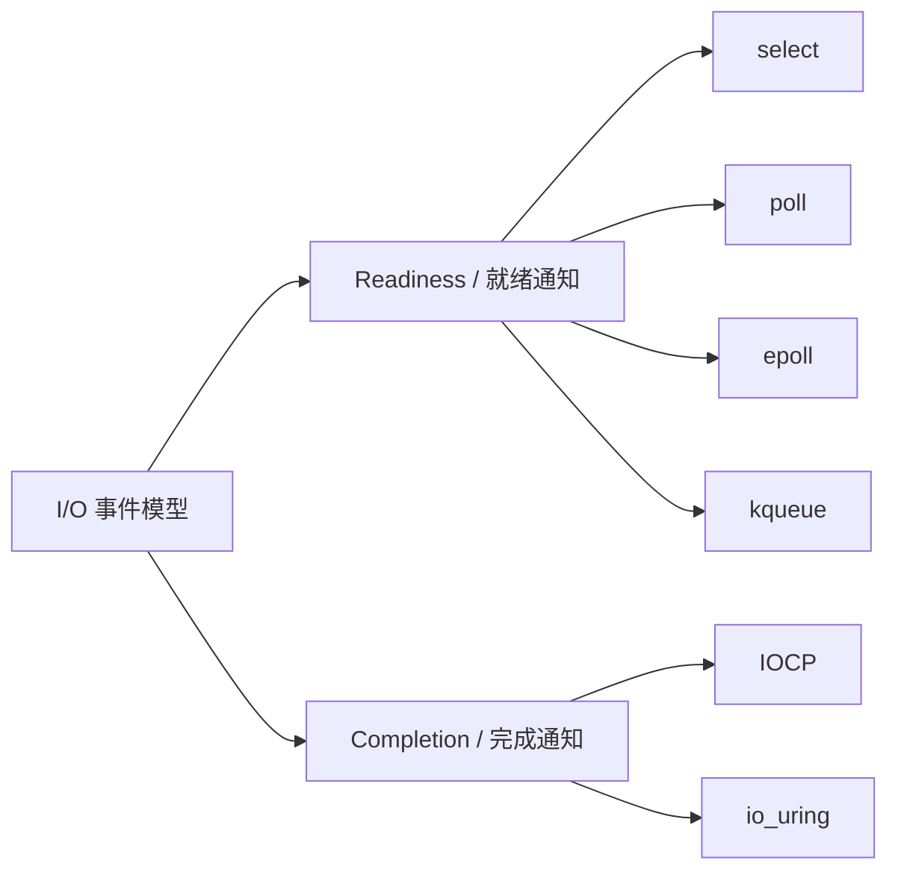
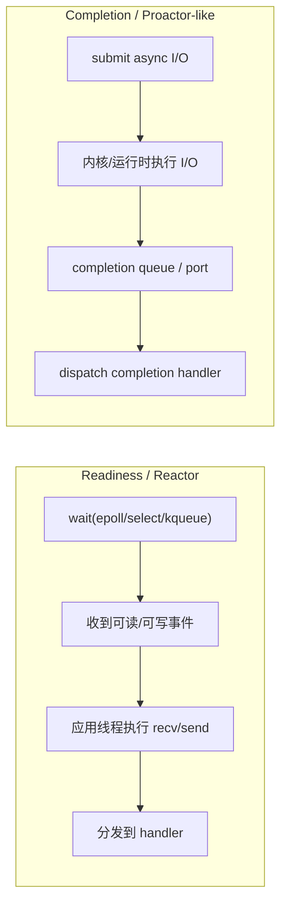
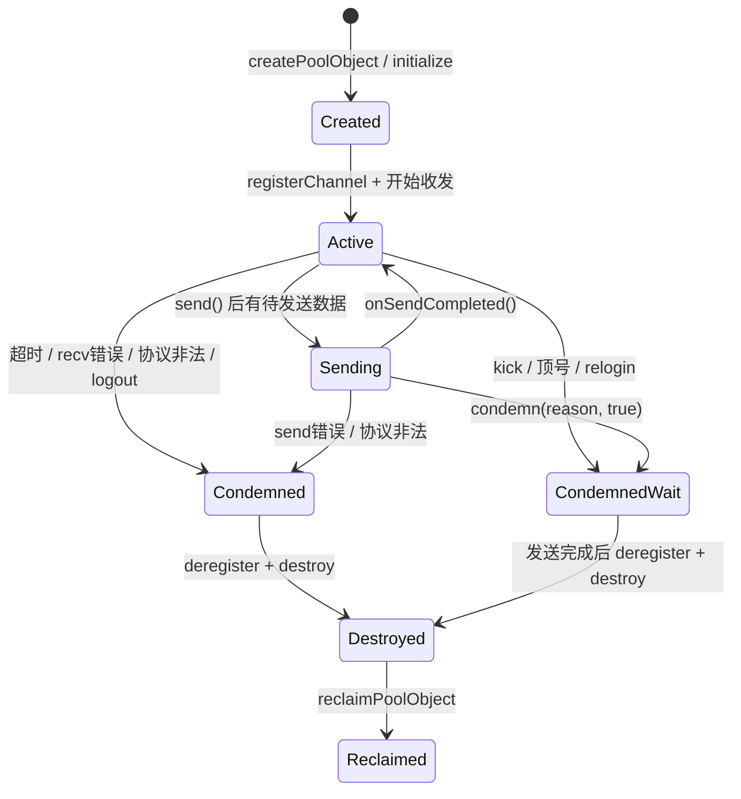
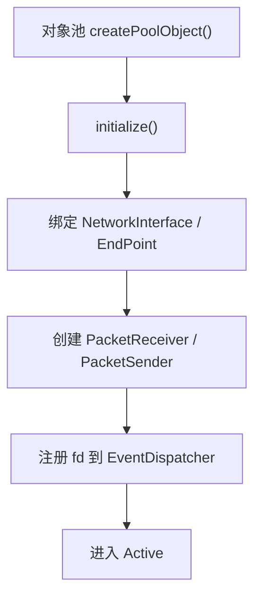
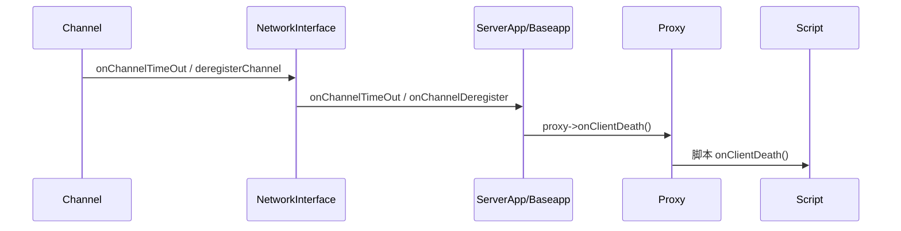
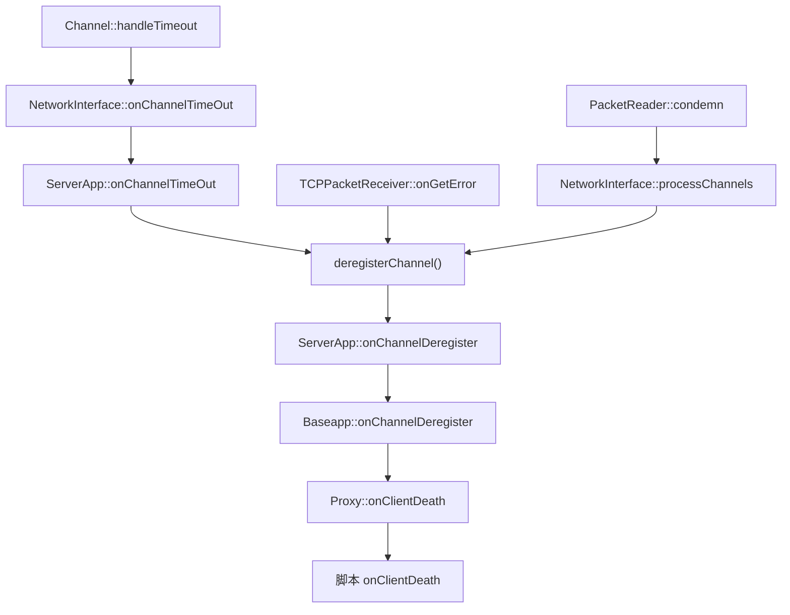
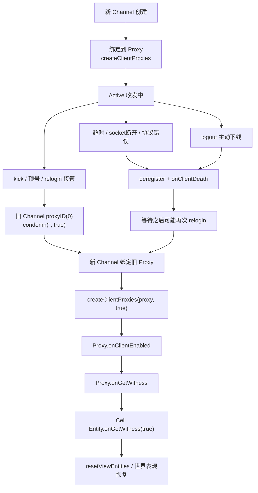
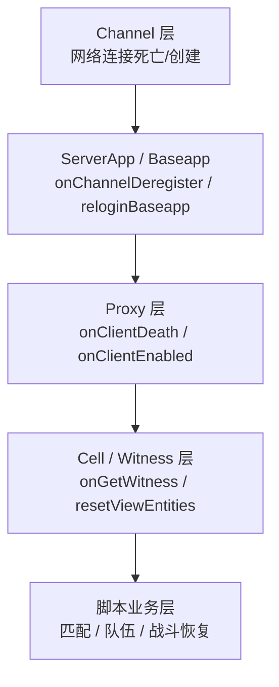

# 8. 网络基础设施：I/O 模型与进程间通信

> 这一章回答：游戏服务器的网络层为什么用 Reactor 而不是 Proactor？epoll 和 select 怎么选？Channel 和 Endpoint 是什么关系？两套项目的网络层有什么本质差异？

## 8.1 本章核心问题

- I/O 事件模型（select / poll / epoll / kqueue / IOCP / io_uring）各自的特点和选择依据？
- Reactor / Proactor 的关键参与者在代码里怎么对应？
- Channel 与 Endpoint 的职责划分？
- TCP vs UDP：两套项目为什么做了不同选择？
- InterfaceTable / MessageHandlers：消息路由怎么实现？

## 8.2 I/O 事件通知模型：为什么这两套引擎最终落在 epoll/select

先把一个容易混淆的点说清：

- `select / poll / epoll / kqueue` 主要属于 **readiness notification**，也就是“就绪通知”
- `IOCP / io_uring` 更接近 **completion notification**，也就是“完成通知”

所以严格说，`IOCP` 和 `io_uring` 不该被归进传统意义上的“I/O 多路复用”一类；它们和 `epoll` 不是同一层抽象，更接近 Proactor 一侧。但 `io_uring` 在 Linux 上也可以同时承载 `POLL_ADD` 这类 readiness 风格操作，因此工程上常表现为**偏 completion 的混合模型**，不能简单粗暴地把它等同成“Linux 版 IOCP”。

### 8.2.1 两大类模型先分开



如果压缩成一句话：

```text
epoll 告诉你“现在可以读/写了”
IOCP 告诉你“之前提交的读/写已经完成了”
io_uring 的主路径也是“提交 -> 完成”，但也能挂接 poll 类操作
```

### 8.2.2 select / poll / epoll / kqueue / IOCP / io_uring 对比

| 维度 | select | poll | epoll | kqueue | IOCP | io_uring |
|------|--------|------|-------|--------|------|----------|
| 核心模型 | 同步就绪通知 | 同步就绪通知 | 同步就绪通知 | 同步就绪通知 | 异步提交 + 完成端口 | 异步提交 + 完成队列 |
| 触发语义 | Readiness | Readiness | Readiness | Readiness | Completion | Completion |
| 最大 FD / 请求规模 | 1024（FD_SETSIZE） | 无限制 | 无限制 | 无限制 | 无固定上限（受系统资源限制） | 无固定上限（受 ring/资源限制） |
| 每次等待的代价 | 全量扫描 | 全量扫描 | 只取就绪事件 | 只取就绪事件 | 取完成结果 | 取 CQE 完成结果 |
| 应用读写时机 | 收到可读/可写后自己读写 | 收到可读/可写后自己读写 | 收到可读/可写后自己读写 | 收到可读/可写后自己读写 | 先投递异步 I/O，完成后取结果 | 先提交 SQE，完成后取 CQE |
| 主平台 | 全平台 | 全平台 | Linux | BSD/macOS | Windows | Linux（较新内核） |
| 更接近的模式 | Reactor | Reactor | Reactor | Reactor | Proactor | 偏 Proactor，也可做混合模型 |
| 适用场景 | 少量连接 | 中等连接 | Linux 大量长连接 | BSD/macOS 大量连接 | Windows 高并发异步服务器 | 极高并发 + 异步 I/O 深度优化 |

补充说明：

- `kqueue` 不是缺失项，它是 BSD/macOS 生态里的 `epoll` 对等方案；本章之前写得偏薄，这里补齐。
- `IOCP` 是 Windows 服务器领域非常经典的高并发模型，传统传奇类、网游后端大量使用它。
- `io_uring` 不只是“新一代 epoll”，它把模型从“就绪通知”推进到“提交/完成队列”这一层；其主路径更接近 Proactor，但在 Linux 上也能承载 readiness 风格操作，因此更准确的说法是“偏 Proactor 的混合模型”。

### 8.2.3 为什么很多传统 Windows 游戏服务器会选 IOCP

你提到的这点非常重要。很多传奇、棋牌、页游时代的服务端，历史包袱和部署习惯都偏 Windows，因此 `IOCP` 在工程上非常常见。

它流行的原因大致有四个：

1. **平台现实**
   - 当时大量国内商业游戏后端直接部署在 Windows Server
   - 团队的运维、工具链、监控链路也围绕 Windows 建立

2. **模型成熟**
   - `CreateIoCompletionPort / GetQueuedCompletionStatus` 这套接口很早就稳定
   - 对 Windows 平台的高并发 socket 来说，它长期是标准答案

3. **线程池友好**
   - IOCP 天然就是“提交异步请求 -> 工作线程取完成事件”
   - 很适合做高并发收发与工作线程池结合

4. **工程经验沉淀**
   - 大量成熟的 C++ 游戏网络库、商业框架、遗留项目都以 IOCP 为基础
   - 团队更容易复用经验和模板

所以如果讨论“传统传奇类游戏为什么常听到 IOCP”，答案很简单：

- **因为它们很多本来就是 Windows 生态下成长起来的**
- **而 IOCP 正是那个生态里最成熟的高并发网络模型之一**

### 8.2.4 那为什么本章最终还是讲 epoll

因为本书分析的这两套具体代码基线，不是“所有游戏服务器”，而是：

- `KBEngine`
- `BigWorld`

这两套代码的实际取向都是：

- 主部署平台偏 Linux
- 主事件循环偏 Reactor
- 代码里实际落地的是 `epoll / select / poll`
- 并没有采用 `IOCP` 这条 Windows Proactor 路线

所以这里更准确的说法不是“游戏服务器都选 epoll”，而是：

- **这两套引擎在自己的代码基线里，最终落在 epoll/select 这一侧**
- **不是因为 IOCP 不重要，而是因为它们的目标平台和架构取向不同**

### 8.2.5 这两套引擎为什么最终落在 epoll/select

**对这两套代码来说，为什么选 epoll**：
- CellApp / BaseApp 每个进程维护数百到数千个 Channel（客户端 + 内部进程）
- select 每次传全部 fd_set 内核 ↔ 用户态拷贝开销大
- epoll 只返回就绪事件，O(1) 通知，不受总连接数影响
- Linux 是两套引擎的主部署平台，`kqueue` 在该平台不可用
- 对既有 Reactor 架构而言，切到 `IOCP / io_uring` 这类 completion 模型，意味着重写 I/O 生命周期与回调收束方式，迁移成本高

### KBEngine EventPoller

```cpp
// 文件：kbe/src/lib/network/event_poller.h（简化）
class EventPoller
{
public:
    virtual int processPendingEvents(double maxWait) = 0;
    static EventPoller* create();   // 工厂方法

    bool registerForRead(int fd, InputNotificationHandler* handler);
    bool registerForWrite(int fd, OutputNotificationHandler* handler);

protected:
    FDReadHandlers fdReadHandlers_;   // map<int, InputNotificationHandler*>
    FDWriteHandlers fdWriteHandlers_; // map<int, OutputNotificationHandler*>
};
```

工厂方法自动选择：

```cpp
// 文件：kbe/src/lib/network/event_poller.cpp
EventPoller* EventPoller::create()
{
#ifdef HAS_EPOLL
    return new EpollPoller();   // Linux：epoll
#else
    return new SelectPoller();  // 其他：select
#endif
}
```

### BigWorld EventPoller

```cpp
// 文件：lib/network/event_poller.hpp（简化）
class EventPoller : public InputNotificationHandler  // 自身也实现回调
{
    static EventPoller* create();
};

// 工厂方法多了一个 poll 选项
EventPoller* EventPoller::create()
{
#if defined(HAS_POLL)
    return new PollPoller();      // Emscripten 平台
#elif defined(HAS_EPOLL)
    return new EPoller();         // Linux
#else
    return new SelectPoller();    // Windows/Mac
#endif
}
```

BigWorld 多了 `PollPoller`（用于 Emscripten/WebAssembly 平台）。

### epoll 实现：EPoller::processPendingEvents

```cpp
// 文件：lib/network/event_poller.cpp（BigWorld，简化）
int EPoller::processPendingEvents(double maxWait)
{
    static const int MAX_EVENTS = 10;
    struct epoll_event events[MAX_EVENTS];
    int maxWaitMs = int(ceil(maxWait * 1000));

    int nfds = epoll_wait(epfd_, events, MAX_EVENTS, maxWaitMs);

    for (int i = 0; i < nfds; ++i) {
        if (events[i].events & (EPOLLERR | EPOLLHUP))
            this->triggerError(events[i].data.fd);
        else {
            if (events[i].events & EPOLLIN)
                this->triggerRead(events[i].data.fd);
            if (events[i].events & EPOLLOUT)
                this->triggerWrite(events[i].data.fd);
        }
    }
    return nfds;
}
```

KBEngine 的 `EpollPoller::processPendingEvents` 逻辑相同。

## 8.3 Reactor vs Proactor：设计思想、组成部件与取舍

### 8.3.1 先看设计思想（两句话抓住本质）

- **Reactor（就绪通知）**：内核只告诉你“这个 fd 现在可读/可写”，真正的 `recv/send` 由应用线程执行。
- **Proactor（完成通知）**：应用先提交异步 I/O，请求完成后内核/运行时再通知“读写已经完成”。`IOCP` 是典型代表；`io_uring` 的主路径也更接近这种模式，但工程上可组合出混合形态。

核心差别是：**通知的是“可以做”还是“已经做完”**。

| 维度 | Reactor | Proactor |
|------|---------|----------|
| 通知语义 | Readiness（就绪） | Completion（完成） |
| 谁执行真正读写 | 应用线程 | 内核/异步运行时 + 完成队列 |
| 代码主循环 | `poll -> dispatch -> read/write` | `submit -> complete -> callback` |
| 典型实现 | epoll/kqueue + 事件循环 | IOCP；`io_uring` 主路径也更接近这一侧 |

### 8.3.2 Reactor 的关键组成与职责（含本项目映射）

| 组件 | 作用 | KBEngine / BigWorld 映射 |
|------|------|--------------------------|
| Handle（资源句柄） | 标识 I/O 资源 | `fd`（socket） |
| Sync Demultiplexer（同步多路分离器） | 阻塞等待就绪事件并批量返回 | `EventPoller`（`epoll_wait/select`） |
| Reactor（反应器） | 注册/注销 handler，驱动事件循环 | `EventDispatcher` |
| Event Handler（事件处理器） | 真正处理读写事件 | `InputNotificationHandler` / `OutputNotificationHandler` |
| Acceptor（接入处理器） | 接受新连接并创建会话对象 | `ListenerTcpReceiver` / `ListenerUdpReceiver` |
| Concrete Handler（具体业务处理） | 拆包、路由、发送、超时控制 | `PacketReceiver` / `PacketSender` / `Channel` |

在这套设计里，职责边界非常清晰：

1. `EventPoller` 只负责“等事件”，不做业务。
2. `EventDispatcher` 只负责“调度”，不直接读写协议。
3. `Channel/Packet*` 负责消息边界和连接生命周期。

这就是 Reactor 的核心设计思想：**事件循环和业务处理解耦**，并通过统一调度点保持系统可观测。

### 8.3.3 Reactor 控制流（为什么容易调试）

```
EventDispatcher::processOnce()
  │
  ├── processTasks()            ← 非网络异步任务
  ├── processTimers()           ← 定时器
  ├── processStats()            ← 统计
  └── processNetwork()
        │
        └── EventPoller::processPendingEvents(maxWait)
              │
              └── epoll_wait/select
                    │
                    ├── triggerRead(fd)
                    │     └── handler->handleInputNotification(fd)
                    └── triggerWrite(fd)
                          └── handler->handleOutputNotification(fd)
```

优势在于：网络事件、定时器、任务队列在同一主循环中可统一观测和限流。

如果把 readiness 和 completion 两类模型并排画出来，会更直观：



把它翻译成人话就是：

- `epoll` 这一类先告诉你“现在可以操作了”，真正的 `recv/send` 还得你自己做
- `IOCP` 这一类先让你把请求投出去，后面等“结果完成”再处理
- `io_uring` 的主路径更接近右边，但在 Linux 上也能组合出带 poll 的混合风格

### 8.3.4 Proactor 的关键组成与职责（概念对照）

当前两套引擎未采用 Proactor，但要理解它的组件才能看清取舍：

| 组件 | 作用 | 常见实现语义 |
|------|------|-------------|
| Asynchronous Operation Processor | 提交异步读写请求 | `async read/write/accept` |
| Completion Queue | 收集完成事件 | IOCP Completion Port / io_uring CQ |
| Proactor（完成事件分发器） | 从完成队列取结果并分发 | `get completion -> dispatch` |
| Completion Handler | 处理“已完成”结果 | `onReadDone/onWriteDone` |
| Buffer/Context Manager | 管理缓冲区和请求上下文生命周期 | request context、引用计数、取消控制 |

Proactor 的设计思想是：**把 I/O 执行外包给异步引擎，应用主要处理完成事件**。需要补一句现实世界的工程判断：`IOCP` 几乎是教科书式 Proactor；`io_uring` 虽然有明显的 submission/completion 结构，但由于还能组合 poll、timeout、link 等操作，工程上经常被用成偏 Proactor 的混合事件框架。

### 8.3.5 优缺点对照（工程视角）

| 维度 | Reactor | Proactor |
|------|---------|----------|
| 复杂度 | 低到中，模型直观 | 中到高，状态机/上下文管理更重 |
| 可移植性 | 高（epoll/kqueue/select 通用） | 中（强依赖 IOCP/io_uring 等能力） |
| 调试可见性 | 好（主循环统一） | 一般（提交点与完成点分离） |
| 缓冲区管理 | 简单（读写点集中） | 复杂（异步期间生命周期难控） |
| 高并发吞吐潜力 | 高 | 很高（成熟实现下） |
| 时序确定性（游戏 tick） | 好（容易与主循环对齐） | 需要额外收束（完成回调可能分散） |

### 8.3.6 为什么本书这两套引擎都选 Reactor

不是“Proactor 不好”，而是当时与场景下 Reactor 成本收益更优：

1. **时代约束**：两项目设计年代（约 2002-2008）Linux 侧缺少成熟通用的网络 Proactor 方案。
2. **业务约束**：MMO 服务器重视 tick 时序可控，Reactor 更容易把网络、定时器、逻辑帧收敛到同一循环。
3. **工程约束**：Reactor 更容易做故障定位、压测回放、运维观测（统一入口）。
4. **团队约束**：Proactor 对缓冲区生命周期、取消语义、异常传播要求更高，维护门槛更高。

一句话结论：**在这两套代码基线里，Reactor 是“可控性优先”的架构选择。**

## 8.4 Channel 与 Endpoint

### Endpoint：对 socket fd 的封装

```cpp
// 文件：kbe/src/lib/network/endpoint.h（简化）
class EndPoint : public PoolObject
{
    void socket(int type);                    // SOCK_STREAM / SOCK_DGRAM
    int setnonblocking(bool nonblocking);
    int bind(uint16_t port, uint32_t addr);
    int listen(int backlog = 5);
    EndPoint* accept(uint16_t* port, uint32_t* addr);
    int send(const void* data, int size);
    int recv(void* data, int size);
    // ...
};
```

Endpoint 只做一件事：**封装操作系统的 socket API**。

### Channel：Endpoint + 消息处理 + 生命周期

```cpp
// 文件：kbe/src/lib/network/channel.h（简化）
class Channel : public TimerHandler, public PoolObject
{
    // 关键成员
    NetworkInterface& networkInterface_;
    EndPoint endpoint_;
    PacketReader packetReader_;
    Bundle* pBundle_;
    MessageHandlers* pMessageHandlers_;

    // 生命周期
    void destroy();
    void send(Bundle* pBundle);
    void onPacketReceived(Packet* pPacket);
};
```

**Channel = Endpoint + PacketReader + Bundle + MessageHandlers**。它不只是 socket 的封装，而是：

- 管理消息的**分包/组包**（PacketReader）
- 管理消息的**发送缓冲**（Bundle）
- 管理消息的**路由分发**（MessageHandlers）
- 管理**连接生命周期**（超时/断线/重连）

<a id="channel-complete-lifecycle"></a>

### 8.4.1 Channel 的完整生命周期

前面说 `Channel` 负责“连接生命周期”，但这里最容易犯的错误，就是把两个不同层次的生命周期混在一起：

1. **单个 `Channel` 对象本身的技术生命周期**
   - 创建、注册、收发、失效、注销、销毁、回收
2. **同一个玩家连接控制权的生命周期**
   - 首次绑定、连接丢失、等待重连、新连接接管旧 `Proxy`、恢复 `Witness`

如果不先把这两层拆开，就很容易误读成：

```text
旧 Channel 断了
  = 玩家生命周期结束
  = 后面的重连是在让旧 Channel 复活
```

这两个结论其实都不对。
**KBEngine 里更常见的模型是：旧 `Channel` 退场，新 `Channel` 接管旧 `Proxy`。**

下面先讲**单个 `Channel` 对象**本身的生命周期：



如果换成一句更工程化的话：

```text
Channel 先被创建并接入 NetworkInterface，
在活跃态里负责收包、拆包、组包、发包；
一旦被标记为 condemn，就不再是合法会话；
随后在 processChannels() 中真正 destroy 并回收到对象池。
```

#### 第 1 阶段：创建与初始化

`Channel` 不是普通 `new/delete` 风格对象，而是对象池对象。它会先通过对象池创建，再初始化底层 endpoint、协议类型、收发器等。

对应入口：

- [channel.cpp:41](/D:/workspaces/kbengine/kbe/src/lib/network/channel.cpp#L41) `Channel::createPoolObject`
- [channel.cpp:182](/D:/workspaces/kbengine/kbe/src/lib/network/channel.cpp#L182) `Channel::initialize`

这一阶段做的事主要是：

- 绑定 `NetworkInterface`
- 绑定 `EndPoint`
- 根据协议类型安装 `PacketReceiver` / `PacketSender`
- 注册读事件
- 准备进入可收发状态

可以画成：



#### 第 2 阶段：活跃态

进入活跃态后，`Channel` 就成了这一条连接的真实运行态。它至少维护以下几类东西：

- 地址和 endpoint
- 收包解析状态：`PacketReader`
- 发包缓冲：`bundles_`
- 协议状态：TCP / KCP / WebSocket / Filter
- 超时状态：`startInactivityDetection()`
- 统计信息：收发字节数、包数
- 会话附着信息：例如 `proxyID`

这一层最关键的不是“它能发包”，而是：

- 它知道当前还剩多少待发数据
- 它知道这个连接是否超时
- 它知道这个连接是不是已经进入待销毁状态

#### 第 3 阶段：发送中

当逻辑层调用 `Channel::send()` 后，`Bundle` 会被挂到发送队列里；如果当前不在发送中，就启动 `PacketSender`，必要时把写事件注册到 `EventDispatcher`。

对应代码：

- [channel.cpp:747](/D:/workspaces/kbengine/kbe/src/lib/network/channel.cpp#L747) `Channel::send`
- [channel.cpp:888](/D:/workspaces/kbengine/kbe/src/lib/network/channel.cpp#L888) `Channel::stopSend`
- [channel.cpp:910](/D:/workspaces/kbengine/kbe/src/lib/network/channel.cpp#L910) `Channel::onSendCompleted`

这个阶段可以理解成：

```text
Bundle 已经进入 Channel 的发送窗口
  -> PacketSender 持续 flush 到 socket
  -> flush 完成后 onSendCompleted()
  -> 回到 Active
```

#### 第 4 阶段：被 condemn

这是最容易误解的一步。

`condemn()` 不是普通的“马上 close”，而是：

- 把 `Channel` 标记为**已经不合法**
- 阻止它继续作为正常会话参与收发
- 交给后续主循环统一销毁

对应实现见 [channel.cpp:1033](/D:/workspaces/kbengine/kbe/src/lib/network/channel.cpp#L1033)：

```cpp
void Channel::condemn(const std::string& reason, bool waitSendCompletedDestroy)
{
    if (condemnReason_.size() == 0)
        condemnReason_ = reason;

    flags_ |= (waitSendCompletedDestroy ? FLAG_CONDEMN_AND_WAIT_DESTROY : FLAG_CONDEMN);
}
```

这里有两种语义：

- `condemn(reason)`
  - 立即进入待销毁状态
- `condemn(reason, true)`
  - 如果还有发送中的数据，先等发送完成，再销毁

这也是为什么在重连挤旧连接时，常见写法是：

```cpp
pOldChannel->condemn("", true);
```

意思不是“永远保留旧连接”，而是：

- 旧连接已经作废
- 但允许其发送窗口尽量收尾
- 然后再统一销毁

#### 第 5 阶段：统一销毁

真正执行销毁的地方不是 `condemn()` 本身，而是 `NetworkInterface::processChannels()`。

关键逻辑见 [network_interface.cpp:432](/D:/workspaces/kbengine/kbe/src/lib/network/network_interface.cpp#L432)：

```cpp
if (pChannel->condemn() == FLAG_CONDEMN_AND_WAIT_DESTROY && pChannel->sending())
{
    pChannel->updateTick(pMsgHandlers);
}
else
{
    deregisterChannel(pChannel);
    pChannel->destroy();
    Channel::reclaimPoolObject(pChannel);
}
```

也就是说，主循环对 `condemn` channel 的处理规则是：

1. 如果只是 `WAIT_DESTROY`，并且仍有待发数据
   - 继续让它跑一个发送收尾流程
2. 否则
   - 从 `NetworkInterface` 注销
   - 调用 `destroy()`
   - 回收到对象池

所以从设计上看：

```text
condemn = 宣告这条连接已经无效
destroy = 真正关闭底层资源
reclaimPoolObject = 把对象放回池中复用
```

#### 第 6 阶段：destroy 清理了什么

`Channel::destroy()` 本身很薄，真正的清理在 `clearState()`，见 [channel.cpp:533](/D:/workspaces/kbengine/kbe/src/lib/network/channel.cpp#L533)。

它会收束的内容包括：

- 清空发送队列 `bundles_`
- 清零统计数据
- 清掉 `proxyID`、`extra`、`condemnReason`
- 停止发送
- 注销读事件
- 停止 inactivity timer
- 关闭底层 `EndPoint`
- 重置 `PacketReader`
- 结束 KCP/SSL 等附着状态

这一步很关键，因为它说明 `destroy()` 不是业务层“掉线通知”，而是网络运行时层面的**彻底资源收束**。

#### 常见失效来源：并不只有超时

如果只把 `Channel` 生命周期理解成“超时断线”，那其实只看到了一个入口。
真实项目里更常见的是下面几大类：

```mermaid
flowchart TD
    A["Active Channel"] --> B["超时未收到数据"]
    A --> C["对端主动断开 / recv 返回 0"]
    A --> D["socket 读写错误"]
    A --> E["协议异常 / 非法包 / WebSocket frame error"]
    A --> F["业务主动下线 logout"]
    A --> G["踢线 / 顶号 / relogin 接管"]

    B --> H["onChannelTimeOut"]
    C --> I["TCPPacketReceiver::onGetError"]
    D --> J["TCPPacketSender / Receiver::onGetError"]
    E --> K["condemn(reason)"]
    F --> L["condemn(\"\")"]
    G --> M["proxyID(0) + condemn(\"\", true)"]

    H --> N["deregisterChannel / destroy"]
    I --> N
    J --> N
    K --> O["processChannels()"]
    L --> O
    M --> O
    O --> N
    N --> P["回收对象池"]
```

分别对应：

- **超时**
  - `Channel::handleTimeout()` 调 `networkInterface().onChannelTimeOut(this)`，见 [channel.cpp](D:/workspaces/kbengine/kbe/src/lib/network/channel.cpp#L660)
- **对端主动断开 / recv 读到 EOF**
  - `TCPPacketReceiver::processRecv()` 中 `len == 0`，随后进入 `onGetError(pChannel, "disconnected")`，见 [tcp_packet_receiver.cpp](D:/workspaces/kbengine/kbe/src/lib/network/tcp_packet_receiver.cpp#L105)
- **socket 读写错误**
  - 读错误走 `TCPPacketReceiver::onGetError()`，见 [tcp_packet_receiver.cpp](D:/workspaces/kbengine/kbe/src/lib/network/tcp_packet_receiver.cpp#L118)
  - 发错误先走 `TCPPacketSender::onGetError()` 做 `condemn(err)`，再由后续主循环统一收束，见 [tcp_packet_sender.cpp](D:/workspaces/kbengine/kbe/src/lib/network/tcp_packet_sender.cpp#L79)
- **协议异常 / 非法包**
  - 例如未知 MessageID、消息长度超限、packet invalid、WebSocket frame error
  - 典型入口见 [packet_reader.cpp](D:/workspaces/kbengine/kbe/src/lib/network/packet_reader.cpp#L85)、[channel.cpp](D:/workspaces/kbengine/kbe/src/lib/network/channel.cpp#L1198)、[websocket_packet_filter.cpp](D:/workspaces/kbengine/kbe/src/lib/network/websocket_packet_filter.cpp#L207)
- **业务主动下线**
  - `Baseapp::logoutBaseapp()` 中直接对当前连接 `condemn("")`，见 [baseapp.cpp](D:/workspaces/kbengine/kbe/src/server/baseapp/baseapp.cpp#L3950)
- **踢线 / 顶号 / 重连接管**
  - 这类不是“简单断线”，而是**旧连接退场，新连接接管**
  - 典型入口见 [baseapp.cpp](D:/workspaces/kbengine/kbe/src/server/baseapp/baseapp.cpp#L4048) `kickChannel()` 和 [baseapp.cpp](D:/workspaces/kbengine/kbe/src/server/baseapp/baseapp.cpp#L3974) `reloginBaseapp()`

如果再把“是否会上抛到玩家层”压缩成一张矩阵，会更容易把边界看清楚：

| 场景 | 典型入口 | 会走 `onChannelTimeOut` 吗 | 会走 `deregisterChannel` 吗 | 一定触发 `Proxy::onClientDeath()` 吗 | 是否可能进入重连接管 |
|------|----------|---------------------------|-----------------------------|--------------------------------------|----------------------|
| inactivity 超时 | `Channel::handleTimeout()` | 会 | 会 | 通常会 | 会 |
| 对端断开 / recv EOF | `TCPPacketReceiver::onGetError()` | 不会 | 会 | 通常会 | 会 |
| socket 读写错误 | `TCPPacketReceiver/TCPPacketSender::onGetError()` | 不一定 | 会或后续主循环会处理 | 通常会 | 会 |
| 协议错误 / 非法包 | `PacketReader::condemn()` / `Channel::processPackets()` | 不会 | 会 | 通常会 | 一般不作为正常重连入口 |
| 主动 logout | `Baseapp::logoutBaseapp()` | 不会 | 后续主循环会处理 | 通常会 | 可以之后重新登录 |
| kick / 顶号 / relogin 接管 | `kickChannel()` / `reloginBaseapp()` | 不会 | 会 | **不一定** | **是** |

表里最重要的一格是最后一行：

- `kick / 顶号 / relogin` 的旧连接退场
- **不应该简单等同于“玩家离线事件”**
- 因为这类流程常常会先把旧连接 `proxyID(0)`，再让它退出

#### 连接死亡后，如何把事件通知到上层

前面几段已经说明了 `Channel` 会超时、会被 `condemn`、最终会被 `deregister + destroy`。
但对玩法层来说，真正重要的问题其实是：

```text
连接死了以后，Baseapp / Proxy / 脚本层到底是怎么知道的？
```

答案是：**不是 `Channel` 直接通知玩法层，而是 `NetworkInterface` 先把连接死亡事件向上抛给 `ServerApp`，再由 `Baseapp` 翻译成 `Proxy::onClientDeath()`。**

这一层抽象在源码里有三处固定锚点：

1. `ChannelTimeOutHandler / ChannelDeregisterHandler` 接口定义
   见 [interfaces.h](D:/workspaces/kbengine/kbe/src/lib/network/interfaces.h#L27)
2. `NetworkInterface` 持有这两个 handler 指针
   见 [network_interface.h](D:/workspaces/kbengine/kbe/src/lib/network/network_interface.h#L46)
3. `ServerApp` 继承并注册这两个 handler
   见 [serverapp.h](D:/workspaces/kbengine/kbe/src/lib/server/serverapp.h#L37) 和 [serverapp.cpp](D:/workspaces/kbengine/kbe/src/lib/server/serverapp.cpp#L57)

先把总链路看清楚：



上面这张图里，最容易被忽略的一点是：

- `condemn()` 只是“宣判这个连接不再可用”
- **真正把事件抛给上层的边界，是 `onChannelTimeOut()` 或 `deregisterChannel()`**

### 先看源码骨架：handler 是怎么挂上的

`ServerApp` 本身同时实现了 `ChannelTimeOutHandler` 和 `ChannelDeregisterHandler`：

```cpp
class ServerApp :
    public Network::ChannelTimeOutHandler,
    public Network::ChannelDeregisterHandler
{
    virtual void onChannelTimeOut(Network::Channel * pChannel);
    virtual void onChannelDeregister(Network::Channel * pChannel);
};
```

对应源码见 [serverapp.h](D:/workspaces/kbengine/kbe/src/lib/server/serverapp.h#L37)。

然后在构造函数里，`ServerApp` 显式把自己挂到 `NetworkInterface` 上：

```cpp
networkInterface_.pChannelTimeOutHandler(this);
networkInterface_.pChannelDeregisterHandler(this);
```

对应源码见 [serverapp.cpp](D:/workspaces/kbengine/kbe/src/lib/server/serverapp.cpp#L57)。

所以从这一刻开始：

- 连接超时，`NetworkInterface` 会回调 `ServerApp::onChannelTimeOut()`
- 连接注销，`NetworkInterface` 会回调 `ServerApp::onChannelDeregister()`

### 第一类入口：超时断线

这一条链是最标准、也最容易读懂的。

#### 1. `Channel` 自己发现“长期没收到数据”

`Channel::handleTimeout()` 里如果发现超过 `inactivityExceptionPeriod_`，就会调用：

```cpp
this->networkInterface().onChannelTimeOut(this);
```

见 [channel.cpp](D:/workspaces/kbengine/kbe/src/lib/network/channel.cpp#L660)。

这里很关键，因为 `Channel` 到这里为止只是说了一句话：

```text
这个连接超时了
```

它还没有直接去找 `Proxy`，也没有直接调脚本。

#### 2. `NetworkInterface` 把“超时”抛给上层 handler

`NetworkInterface::onChannelTimeOut()` 的实现非常薄，只做一件事：

```cpp
if (pChannelTimeOutHandler_)
{
    pChannelTimeOutHandler_->onChannelTimeOut(pChannel);
}
```

见 [network_interface.cpp](D:/workspaces/kbengine/kbe/src/lib/network/network_interface.cpp#L417)。

也就是说，**`NetworkInterface` 只是事件中转站，它不做玩家逻辑。**

#### 3. `ServerApp` 执行默认超时收尾

`ServerApp::onChannelTimeOut()` 的默认实现是：

```cpp
pChannel->condemn("timedout");
networkInterface_.deregisterChannel(pChannel);
pChannel->destroy();
Network::Channel::reclaimPoolObject(pChannel);
```

见 [serverapp.cpp](D:/workspaces/kbengine/kbe/src/lib/server/serverapp.cpp#L286)。

注意这里的顺序：

1. 先 `condemn`
2. 再 `deregisterChannel`
3. 再 `destroy`
4. 最后回收到对象池

这说明“超时”只是死亡原因，而“真正把连接从网络层摘掉”的动作是 `deregisterChannel()`。

### 第二类入口：socket 正常断开或底层读错误

如果不是 inactivity timeout，而是 TCP 读包时发现对端断开或 socket 出错，链路会从 `TCPPacketReceiver` 进来。

#### 1. `recv()` 返回 0，表示对端已经断开

`TCPPacketReceiver::processRecv()` 中：

```cpp
else if(len == 0)
{
    TCPPacket::reclaimPoolObject(pReceiveWindow);
    onGetError(pChannel, "disconnected");
    return false;
}
```

见 [tcp_packet_receiver.cpp](D:/workspaces/kbengine/kbe/src/lib/network/tcp_packet_receiver.cpp#L100)。

#### 2. 读错误统一走 `onGetError()`

`TCPPacketReceiver::onGetError()` 会直接执行：

```cpp
pChannel->condemn(err);
pChannel->networkInterface().deregisterChannel(pChannel);
pChannel->destroy();
Network::Channel::reclaimPoolObject(pChannel);
```

见 [tcp_packet_receiver.cpp](D:/workspaces/kbengine/kbe/src/lib/network/tcp_packet_receiver.cpp#L118)。

可以看到，这条链**不会先经过 `onChannelTimeOut()`**，但依然会进入：

```text
deregisterChannel()
  -> onChannelDeregister()
```

所以对上层来说：

- 超时断线和 socket 断开，来源不同
- 但最后都会在 `deregisterChannel()` 这个边界汇合

### 第三类入口：协议错误、非法消息、长度异常

如果连接还活着，但包本身已经非法，路径又不一样。

例如 `PacketReader::processMessages()` 里发现未知消息号或消息长度异常时，会做：

```cpp
pChannel_->condemn("PacketReader::processMessages: not found msgID");
```

见 [packet_reader.cpp](D:/workspaces/kbengine/kbe/src/lib/network/packet_reader.cpp#L85)。

这里先只有 `condemn()`，还没有立刻通知上层。
真正的清理发生在 `NetworkInterface::processChannels()`：

```cpp
else if(pChannel->condemn() > 0)
{
    ...
    deregisterChannel(pChannel);
    pChannel->destroy();
    Network::Channel::reclaimPoolObject(pChannel);
}
```

见 [network_interface.cpp](D:/workspaces/kbengine/kbe/src/lib/network/network_interface.cpp#L443)。

所以这一类错误说明得更清楚一点就是：

- 解析层先把连接标记为“应当死亡”
- 网络层主循环在稳定边界统一做 `deregister + destroy`
- 上层依旧是通过 `onChannelDeregister()` 感知死亡

### 不同来源，最终汇合到同一个“上抛边界”

把三种来源合在一起看，就很清楚了：



这张图就是本节最关键的结论：

- **断线原因可能很多**
- **上层真正稳定依赖的通知边界是 `onChannelDeregister()`**

不过这里还有一个现实限制：虽然 `Channel` 内部有 `condemnReason()`，网络层也有 `Network::Reason` 这类枚举，但 KBEngine 默认并没有把这些原因继续传到脚本层 `onClientDeath`。
也就是说，底层能记录一些原因，业务脚本默认只收到“客户端绑定消失了”这个结果。更细粒度的玩家断线原因控制，见 [22.10.4 从 Channel 生命周期延伸出来的 hook 链](22-player-complete-lifecycle.md#connection-events-to-player-lifecycle)。

### `Baseapp` 是如何把“连接死亡”翻译成“玩家掉线”的

`Baseapp::onChannelDeregister()` 里先处理内部组件通道，然后再看这条外部连接是否绑定了某个 `proxyID`：

```cpp
ENTITY_ID pid = pChannel->proxyID();
...
if(pid > 0)
{
    Proxy* proxy = static_cast<Proxy*>(this->findEntity(pid));
    if(proxy)
    {
        proxy->onClientDeath();
    }
}
```

见 [baseapp.cpp](D:/workspaces/kbengine/kbe/src/server/baseapp/baseapp.cpp#L797)。

这一步的意义是：

- `NetworkInterface` 只知道“某条连接被注销了”
- `Baseapp` 负责把它翻译成“这个连接原来属于哪个 `Proxy`”
- `Proxy` 才继续把它翻译成玩家业务事件

但这里必须补一句很重要的限制条件：

```text
不是所有 onChannelDeregister 都一定会变成 Proxy::onClientDeath()
```

因为 `Baseapp::onChannelDeregister()` 是否继续找到 `Proxy`，取决于这条 `Channel` 退场时是否还保留 `proxyID`。
在 `kick / 顶号 / relogin` 这类接管型流程里，旧连接往往会先做：

```cpp
pOldChannel->proxyID(0);
pOldChannel->condemn("", true);
```

见 [baseapp.cpp](D:/workspaces/kbengine/kbe/src/server/baseapp/baseapp.cpp#L4008) 和 [baseapp.cpp](D:/workspaces/kbengine/kbe/src/server/baseapp/baseapp.cpp#L4061)。

这意味着旧连接之后即使完成 `deregister`，也不会再被翻译成“这个玩家离线了”。
它更准确的语义其实是：

```text
这个旧连接已经失去对 Proxy 的所有权
```

### `Proxy::onClientDeath()` 才是脚本层常用的断线 hook

最终进入 `Proxy::onClientDeath()`：

```cpp
Py_DECREF(clientEntityCall());
clientEntityCall(NULL);
addr(Network::Address::NONE);

clientEnabled_ = false;
CALL_ENTITY_AND_COMPONENTS_METHOD(this,
    SCRIPT_OBJECT_CALL_ARGS0(pyTempObj, const_cast<char*>("onClientDeath"), GETERR));
```

见 [proxy.cpp](D:/workspaces/kbengine/kbe/src/server/baseapp/proxy.cpp#L217)。

这说明 `Proxy` 层做了几件上层真正关心的事：

1. 解绑旧的 `clientEntityCall`
2. 清掉旧客户端地址
3. 标记 `clientEnabled_ = false`
4. 调脚本层 `onClientDeath`

所以真正值得玩法逻辑依赖的，不是 `Channel::condemn()`，而是：

```text
NetworkInterface.deregisterChannel()
  -> Baseapp.onChannelDeregister()
  -> Proxy.onClientDeath()
  -> 脚本 onClientDeath()
```

如果把它压缩成一句最短记忆链，可以这样背：

```text
连接死亡来源很多
  -> 最终进入 deregisterChannel
  -> Baseapp.onChannelDeregister
  -> Proxy.onClientDeath
  -> 脚本 onClientDeath
```

#### 为什么要分成 timeout 和 deregister 两个通知

这里还有一个细节很重要：上层不是只收到一个“断开了”的事件，而是有两类通知：

- `onChannelTimeOut`
  - 表示“连接因超时进入死亡流程”
  - 更接近**原因**
- `onChannelDeregister`
  - 表示“连接已经从网络层注册表里移除”
  - 更接近**状态边界**

这两个事件的价值不同：

- 做统计、日志、超时原因分析时，更关心 `onChannelTimeOut`
- 做实体解绑、玩法收束时，更关心 `onChannelDeregister`

也正因为如此，`Baseapp` 主要接的是 **deregister 这一层**，而不是直接在 `Channel` 里做玩家逻辑。

#### 为什么要分成 condemn 和 destroy 两步

这是一个很典型的运行时设计点。

如果在任意读包/发包/回调现场直接 `destroy()`，很容易破坏：

- 当前正在遍历的连接表
- 发送队列状态
- 正在进行中的回调栈
- poller / dispatcher 注册状态

所以 KBEngine 选择：

- 先 `condemn`
- 再由 `processChannels()` 在统一边界做真正销毁

这和前面讲的游戏逻辑分层是同一种思路：**先标记状态，再在稳定时机收束资源**。

#### 和玩家断线重连的关系

把 `Channel` 生命周期放回玩家模型里看，会更容易理解：

```text
Channel 死亡
  != Proxy 死亡
  != Avatar 业务状态丢失
```

也就是说：

- `Channel` 是网络会话层对象
- `clientEntityCall` 是客户端绑定层引用
- `Proxy / Avatar` 是玩家业务对象

所以玩家掉线时，通常应该：

1. 废弃旧 `Channel`
2. 清理或重绑 `clientEntityCall`
3. 保留 `Proxy / Avatar`
4. 等新连接重连回来再绑定

这也是为什么 PvP、队伍、跨服匹配状态不能绑在 `Channel` 上，而应该绑在 `Avatar.databaseID` 或玩法服务状态上。

但这里还要进一步强调一件事：

```text
“连接生命周期完整” 不等于 “只把旧连接怎么死讲明白”
```

如果从玩家视角看，一个完整周期至少应包括：

1. 新 `Channel` 创建并绑定到 `Proxy`
2. 正常活跃收发
3. 因某种原因失效或被替换
4. 旧 `Channel` 退场
5. 新 `Channel` 重新接管旧 `Proxy`
6. `Proxy` / `Witness` / 视野 / 脚本状态恢复

所以更完整的图应该是这样：



这张图里的关键结论有两个：

- **旧 `Channel` 死亡，不代表玩家业务对象死亡**
- **重连不是让旧 `Channel` 复活，而是让新 `Channel` 接管旧 `Proxy`**

### 首次绑定：新连接如何接入 `Proxy`

无论是首次登录，还是某些“在线但需要换连接”的流程，本质上都要走“把 `Channel` 绑定到 `Proxy`”这一步。

`Baseapp::createClientProxies()` 里做的核心动作是：

```cpp
Network::Channel* pChannel = pEntity->clientEntityCall()->getChannel();
pChannel->proxyID(pEntity->id());
pEntity->addr(pChannel->addr());
...
pEntity->onClientEnabled();
```

见 [baseapp.cpp](D:/workspaces/kbengine/kbe/src/server/baseapp/baseapp.cpp#L3142)。

这意味着首次接入至少完成了三件事：

1. 把 `Channel.proxyID` 绑到目标 `Proxy`
2. 把 `Proxy.addr` 更新成当前客户端地址
3. 触发 `Proxy::onClientEnabled()`，把“客户端已可用”上抛到脚本层

### 旧连接退场：为什么 kick / 顶号 / relogin 不等于普通断线

这类场景和“对端掉线”最大的区别在于：

- 不是简单把旧连接判死就结束了
- 而是要**保证控制权平滑切到新连接**

先看 `Baseapp::kickChannel()`：

```cpp
pChannel->send(onKickedBundle);
pChannel->proxyID(0);
pChannel->condemn("", true);
```

见 [baseapp.cpp](D:/workspaces/kbengine/kbe/src/server/baseapp/baseapp.cpp#L4048)。

这里先把 `proxyID` 清成 `0` 很关键，因为这表示：

- 这个旧 `Channel` 之后即使再走 `onChannelDeregister()`
- `Baseapp::onChannelDeregister()` 也不会再把它翻译成某个 `Proxy` 的 `onClientDeath()`

这正是“接管型重连”和“普通断线”最本质的区别。
在接管流程里，系统并不希望把旧连接的退场再次解释成“玩家真的离线了”。

### 重连：不是旧 Channel 复活，而是新 Channel 接管旧 Proxy

`Baseapp::reloginBaseapp()` 就是最典型的源码入口：

```cpp
if(pMBChannel)
{
    pMBChannel->proxyID(0);
    pMBChannel->condemn("", true);
}

entityClientEntityCall->addr(pChannel->addr());
proxy->addr(pChannel->addr());
pChannel->proxyID(proxy->id());
proxy->rndUUID(KBEngine::genUUID64());

createClientProxies(proxy, true);
proxy->onGetWitness();
```

见 [baseapp.cpp](D:/workspaces/kbengine/kbe/src/server/baseapp/baseapp.cpp#L3974)。

这一段代码已经把“重连恢复”说得非常清楚了：

1. 旧连接如果还活着，先取消它对 `Proxy` 的所有权
2. 旧连接进入 `condemn("", true)`，等待平滑退场
3. 把 `clientEntityCall` / `Proxy.addr` 改成新连接地址
4. 把**新 `Channel`** 的 `proxyID` 绑回原 `Proxy`
5. 重新发一轮完整客户端初始化数据
6. 再通知 Cell 侧恢复 `Witness`

所以这里的抽象不是：

```text
旧 Channel 断了 -> 旧 Channel 重新连上 -> 旧 Channel 继续用
```

而是：

```text
旧 Channel 退场
  -> 新 Channel 建立
  -> 新 Channel 接管旧 Proxy
  -> 重新恢复客户端与世界表现
```

### 重连成功后，哪些 hook 才算进入“恢复阶段”

重连成功后，脚本真正关心的不是一个单独的“reconnect success”回调，而是一串分层恢复动作：

1. `createClientProxies(proxy, true)`
   - 重发 `onCreatedProxies`
   - 内部会调用 `Proxy::onClientEnabled()`
   - 见 [baseapp.cpp](D:/workspaces/kbengine/kbe/src/server/baseapp/baseapp.cpp#L3142)
2. `Proxy::onClientEnabled()`
   - 设置 `clientEnabled_ = true`
   - 调脚本层 `onClientEnabled`
   - 见 [proxy.cpp](D:/workspaces/kbengine/kbe/src/server/baseapp/proxy.cpp#L174)
3. `Proxy::onGetWitness()`
   - 向 Cell 发送 `onGetWitnessFromBase`
   - 见 [proxy.cpp](D:/workspaces/kbengine/kbe/src/server/baseapp/proxy.cpp#L423)
4. `Entity::onGetWitness(true)`
   - 如果已有 witness，则执行 `pWitness_->onAttach(this)` 和 `resetViewEntities()`
   - 见 [entity.cpp](D:/workspaces/kbengine/kbe/src/server/cellapp/entity.cpp#L2092)

也就是说，真正完整的“重连恢复”不是一个 hook，而是下面这一串：

```text
新 Channel 接管 Proxy
  -> onClientEnabled
  -> onGetWitness
  -> resetViewEntities
```

这就是为什么说，`Channel` 生命周期如果只讲“旧连接怎么失效”，那其实还没讲完。

如果要继续看这些连接事件如何落到玩家生命周期、匹配状态、断线宽限期和重连恢复策略上，可以接着看 [22.10.4 从 Channel 生命周期延伸出来的 hook 链](22-player-complete-lifecycle.md#connection-events-to-player-lifecycle)。

#### 为什么 Channel 生命周期里没有“断线重连 hook”

这也是一个特别容易误解的点。

很多人第一次看这里会直觉地问：

- 连接断了，不就是 `Channel` 的事情吗？
- 那为什么没有在 `Channel` 里直接提供 `onDisconnect / onReconnect` 这种玩家级 hook？

答案是：**因为 `Channel` 层只知道“这条网络连接死了/活了”，它不知道“这个连接在业务上代表哪个玩家、哪个实体、哪个玩法状态”。**

也就是说，`Channel` 层负责的是：

- socket / endpoint 生命周期
- 读写状态
- timeout / condemn / destroy
- 连接注册与回收

而“玩家掉线重连”这件事，已经不是纯网络问题了，它至少还涉及：

- 当前 `Channel` 绑定的是不是某个 `Proxy`
- 这个 `Proxy` 是否仍然活着
- `clientEntityCall` 是否需要清理或重绑
- `Cell` 侧控制权是否需要恢复
- 视野/Witness 是否需要重建
- 脚本层是否要收到 `onClientDeath / onClientEnabled`

所以真正的分层应该画成：



这就是为什么：

- **`Channel` 没有玩家级 hook**
- **玩家级 hook 在 `Proxy`**
- **重连恢复的真正入口在 `Baseapp`**

对应源码链路也很清楚：

1. **断线**
   - `Channel` 被 `condemn/destroy`
   - `Baseapp::onChannelDeregister()` 被调用，见 [baseapp.cpp](D:/workspaces/kbengine/kbe/src/server/baseapp/baseapp.cpp#L797)
   - 如果 `proxyID > 0`，则找到对应 `Proxy` 并调用 `proxy->onClientDeath()`，见 [baseapp.cpp](D:/workspaces/kbengine/kbe/src/server/baseapp/baseapp.cpp#L816)
   - `Proxy::onClientDeath()` 再清理 `clientEntityCall`、清地址、调脚本 hook，见 [proxy.cpp](D:/workspaces/kbengine/kbe/src/server/baseapp/proxy.cpp#L217)

2. **重连**
   - 新 `Channel` 进来后走 `Baseapp::reloginBaseapp()`，见 [baseapp.cpp](D:/workspaces/kbengine/kbe/src/server/baseapp/baseapp.cpp#L3974)
   - 这里不是让旧 `Channel` 复活，而是把**新连接重新绑定到原 `Proxy`**
   - 然后执行 `createClientProxies(proxy, true)`、`proxy->onGetWitness()`，让客户端与 Cell 表现层重建
   - `onClientEnabled()` 也在 `createClientProxies()` 中被触发

所以更准确的抽象是：

```text
Channel 层：连接断了
Baseapp 层：这个断开的连接原来属于哪个 Proxy
Proxy 层：玩家客户端死了 / 玩家客户端重新可用了
Cell/Witness 层：世界表现需要重新恢复
```

如果把“断线重连 hook”强塞进 `Channel`，会立刻遇到两个问题：

1. **职责污染**
   - `Channel` 将不得不理解 `Proxy / Avatar / Cell / Witness`
   - 网络层和实体层耦合会急剧上升

2. **一对多映射问题**
   - 不是所有 `Channel` 都代表玩家客户端
   - 很多 `Channel` 是 BaseApp ↔ CellApp、BaseApp ↔ DBMgr 的内部连接
   - 对这些内部通道，玩家级 hook 根本没有意义

所以从架构上看，当前这种分层是合理的：

- `Channel` 管连接
- `Baseapp` 把连接事件翻译成实体事件
- `Proxy` 再把实体事件翻译成脚本/玩法事件

### BigWorld Channel：抽象基类

```cpp
// 文件：lib/network/channel.hpp（简化）
class Channel : public ReferenceCount
{
    virtual Bundle* newBundle() = 0;
    virtual bool hasUnsentData() const = 0;
    virtual bool isExternal() const = 0;
    virtual bool isTCP() const = 0;
    virtual void setEncryption(BlockCipherPtr pBlockCipher) = 0;
    virtual double roundTripTimeInSeconds() const = 0;
    // ...
};
```

BigWorld 的 Channel 是抽象的——有 `UDPChannel`、`TCPChannel` 等子类。KBEngine 的 `Channel` 则是一个具体实现类，但它并不等于“只有 TCP”：同一个类里还能挂 `ProtocolType`、`ProtocolSubType`、`ikcp` 和 `PacketFilter`，因此它更像“统一连接对象”，而不是只服务于单一传输协议。

## 8.5 TCP vs UDP：不同路径的不同选择

### KBEngine

- **内部通信（进程间）**：TCP
- **外部通信（客户端）**：TCP / UDP / KCP（可配置）

TCP 的优势：实现简单、调试方便、天然有序可靠。

### BigWorld

- **内部通信（进程间）**：UDP + 自建可靠性层
- **外部通信（客户端）**：TCP

BigWorld 选择内部 UDP 的原因：
- **延迟敏感**：Cell ↔ Base 的实时同步，UDP 延迟更低
- **自定义可靠性**：通过 `ReliableType` 控制哪些消息需要可靠传输

```cpp
// 文件：lib/network/bundle.hpp（BigWorld）
enum ReliableTypeEnum {
    RELIABLE_NO = 0,        // 完全不可靠（位置更新）
    RELIABLE_DRIVER = 1,    // 可靠驱动消息
    RELIABLE_PASSENGER = 2, // 搭便车（随驱动消息一起可靠传输）
    RELIABLE_CRITICAL = 3   // 关键消息（必须可靠）
};
```

**KBEngine 没有 `ReliableType`**——因为内部用 TCP，所有消息天然可靠。

### 与 Aeron 的对比

Aeron 也是 "UDP + 自建可靠性"，和 BigWorld 的思路类似：
- Aeron 提供**背压感知**（back-pressure awareness）——消费者来不及处理时通知生产者减速
- BigWorld 没有显式背压机制，通过 Channel 缓冲和超时丢弃处理

## 8.6 进程间通信深度对比：Mercury vs KBEngine

> 这一节回答：BigWorld 的进程间通信到底有没有用共享内存？Mercury 的 UDP 可靠性层怎么实现的？同机进程通信有没有特殊优化？

### 8.6.1 澄清：BigWorld 开源版没有使用共享内存

社区中流传"BigWorld 在同机进程间使用共享内存优化通信"的说法，但对 `BigWorld-Engine-14.4.1` 全量源码的扫描结果如下：

| 搜索范围 | 搜索关键词 | 结果 |
|----------|-----------|------|
| `lib/network/` | `shared_memory`, `SharedMem`, `shm_`, `mmap` | **无匹配** |
| `server/` | 同上 | **无匹配**（匹配项均为 boost::interprocess 第三方库） |
| `lib/network/` | `isLocalMachine`, `sameMachine` | **无匹配** |
| `docs/pdf/` | `shared memory`, `IPC` | **无匹配** |

Mercury 网络层的 `NetworkInterface` 构造函数明确使用 UDP socket：

```cpp
// 文件：lib/network/network_interface.cpp:335
udpSocket_.socket( SOCK_DGRAM );  // 所有内部通信走 UDP
```

**可能的原因**：

1. **Wargaming 内部版本**在收购 BigWorld 后可能增加了共享内存优化，但这不在开源版本（OSE 14.4.1）中
2. UDP 在 `loopback`（127.0.0.1）上不经网卡，内核直接在 socket 缓冲区间拷贝数据，延迟极低，实际性能损失不大
3. 共享内存需要自建序列化/反序列化和同步机制，复杂度远高于 socket 通信，对于 MMO 场景收益有限

### 8.6.2 Mercury 的 UDP 可靠性层架构

BigWorld 在 UDP 之上构建了完整的可靠性传输层，核心类是 `UDPChannel`：

```
                    Mercury 网络层架构

┌─────────────────────────────────────────────────┐
│                  NetworkInterface                │
│  ┌──────────┐  ┌──────────────┐  ┌───────────┐ │
│  │ Endpoint │  │ ChannelMap   │  │ Packet    │ │
│  │ (UDP)    │  │ (addr→chan)  │  │ Receiver  │ │
│  └──────────┘  └──────────────┘  └───────────┘ │
│  ┌──────────────────────────────────────────────┐│
│  │           UDPChannel（每个远程地址一个）       ││
│  │  ┌───────────┐ ┌─────────┐ ┌──────────────┐ ││
│  │  │ SendWindow│ │RecvWin  │ │ IrregularCh  │ ││
│  │  │ (unacked) │ │(buffer) │ │ (resend mgr) │ ││
│  │  └───────────┘ └─────────┘ └──────────────┘ ││
│  │  ┌───────────┐ ┌─────────┐ ┌──────────────┐ ││
│  │  │SeqNumAlloc│ │RTT est  │ │Bundle + Frag │ ││
│  │  │ (seq_id)  │ │(round-  │ │(消息打包)    │ ││
│  │  │           │ │ trip)   │ │              │ ││
│  │  └───────────┘ └─────────┘ └──────────────┘ ││
│  └──────────────────────────────────────────────┘│
└─────────────────────────────────────────────────┘
```

**关键机制详解**：

**a) 序列号与 ACK**

```cpp
// 文件：lib/network/udp_channel.hpp
SeqNum       smallOutSeqAt_;       // 下一个发送序列号
SeqNum       oldestUnackedSeq_;    // 最老未确认序列号
uint32       highestAck_;          // 收到的最高 ACK
Acks         acksToSend_;          // 待发送的 ACK 集合
```

每个发出的 Packet 带递增序列号，接收方通过累积 ACK（cumulative ack）确认。未确认的 Packet 存放在 `unackedPackets_` 环形数组中等待重传。

**b) 发送窗口控制**

```cpp
// 文件：lib/network/udp_channel.hpp
uint32          windowSize_;           // 基础窗口大小
CircularArray<UnackedPacket*> unackedPackets_;  // 已发未确认
static uint     s_maxOverflowPackets_[3];       // 溢出上限（按类型区分）

int sendWindowUsage() const {
    return this->hasUnackedPackets() ?
        seqMask(largeOutSeqAt_ - oldestUnackedSeq_) : 0;
}
```

窗口满后进入 overflow 状态，超过上限会触发 dev assert——这是生产环境的保护机制。

**c) 分片与重组**

大于 MTU 的 Bundle 会被拆分为多个 Packet 分片发送，接收端通过 `FragmentedBundle` 重组：

```cpp
// 文件：lib/network/udp_channel.hpp
FragmentedBundlePtr pFragments_;  // 正在重组的分片链
```

**d) 四级可靠性控制**

Mercury 的 `ReliableType` 允许同一通道内不同消息有不同可靠性：

| 级别 | 含义 | 重传 | 典型用途 |
|------|------|------|----------|
| `RELIABLE_NO` | 不需要可靠传输 | 否 | 高频位置更新 |
| `RELIABLE_DRIVER` | 可靠驱动消息 | 是 | RPC 调用 |
| `RELIABLE_PASSENGER` | 搭便车 | 随驱动消息 | 普通属性同步 |
| `RELIABLE_CRITICAL` | 关键消息，必须可靠 | 是+紧急重传 | 实体创建/销毁 |

**这是 TCP 做不到的**——TCP 要么全可靠，要么全不可靠（换 UDP），不能在同一连接内混用。

### 8.6.3 isLocalRegular / isRemoteRegular：Mercury 的发送优化

Mercury 没有通过共享内存优化同机通信，而是用 **`isLocalRegular`** 标志实现了一种"发送节奏感知"优化：

```cpp
// 文件：lib/network/udp_channel.hpp
bool isLocalRegular_;    // 本端是否定期发送
bool isRemoteRegular_;   // 对端是否定期发送
```

**含义**：

- `isLocalRegular = true`：本端会**周期性主动发送数据**（如 CellApp 的 tick 驱动），因此 ACK 可以"捎带"在正常发送的数据包上，无需额外的超时重传驱动
- `isLocalRegular = false`：本端不定期发送，必须加入 `IrregularChannels` 集合，由全局定时器周期性检查未确认包并触发重传

```cpp
// 文件：lib/network/udp_channel.cpp:1702-1708
void UDPChannel::isLocalRegular( bool isLocalRegular ) {
    isLocalRegular_ = isLocalRegular;
    // 不定期发送的通道加入 irregular 集合做周期性重发检查
    pNetworkInterface_->irregularChannels().addIfNecessary( *this );
}
```

**延迟发送优化**：

```cpp
// 文件：lib/network/udp_channel.cpp:785-791
void UDPChannel::delayedSend() {
    if (!this->isLocalRegular()) {
        // 不定期发送的通道立即投递到延迟队列
        this->networkInterface().delayedSend( *this );
    }
    // 定期发送的通道不需要 delayedSend——下次 tick 自然会发
}
```

**服务器间通道的默认配置**：

```cpp
// 文件：server/cellapp/cell_app_channel.cpp
CellAppChannel::CellAppChannel( const Mercury::Address & addr ) :
    Mercury::ChannelOwner( CellApp::instance().interface(), addr )
{
    this->channel().isLocalRegular( true );    // 我会定期发
    this->channel().isRemoteRegular( false );  // 对方不一定会定期发
}
```

这个设计的精髓是：**避免不必要的定时器开销**。服务器间通道本身就是 tick 驱动的（每个 tick 都有数据要发），所以不需要额外的重传定时器——ACK 自然会随下一次发送捎带出去。

### 8.6.4 进程发现：bwmachined 与同机注册

BigWorld 的进程发现通过 `bwmachined` 守护进程实现，使用 UDP 通信：

```cpp
// 文件：lib/network/machined_utils.cpp:50-84
Reason registerWithMachined( const Address & srcAddr,
        const BW::string & name, int id, bool isRegister )
{
    ProcessMessage pm;
    pm.param_ = (isRegister ? pm.REGISTER : pm.DEREGISTER) | pm.PARAM_IS_MSGTYPE;
    pm.category_ = ProcessMessage::SERVER_COMPONENT;
    pm.port_ = srcAddr.port;
    pm.name_ = name;
    pm.id_ = id;
    // ...
    const uint32 destAddr = LOCALHOST;  // 127.0.0.1
    return pm.sendAndRecv( srcAddr.ip, destAddr, &pmh );
}
```

**同机识别机制**：

- `bwmachined` 在每台物理机上运行，绑定 `LOCALHOST`（127.0.0.1）
- 各组件进程启动时通过 UDP 向 `LOCALHOST:PORT_MACHINED` 注册
- 跨机器发现通过 **广播（BROADCAST）**：`pm.sendAndRecv(0, BROADCAST, pHandler)`

```cpp
// 文件：lib/network/machined_utils.cpp:339-410
Reason findInterface( const char * name, int id,
        Address & addr, int retries, ... )
{
    // ...
    Reason reason = pm.sendAndRecv( 0, BROADCAST, pHandler );  // 广播查找
    // ...
}
```

**注意**：BigWorld **没有**"检测是否同机然后切换到共享内存"的逻辑。同机和跨机通信走的是同一条 UDP 路径，区别只是目的 IP 是 `LOCALHOST` 还是远程地址。

### 8.6.5 KBEngine 的进程间通信：TCP 直连

KBEngine 的进程间通信更直接：

```
┌──────────────┐         TCP          ┌──────────────┐
│   CellApp    │◄────────────────────►│   BaseApp    │
│  (Channel)   │                      │  (Channel)   │
└──────────────┘                      └──────────────┘
        │                                     │
        │ UDP broadcast                       │ UDP broadcast
        ▼                                     ▼
┌──────────────┐                      ┌──────────────┐
│   Machine    │                      │   Machine    │
│  (发现注册)   │                      │  (发现注册)   │
└──────────────┘                      └──────────────┘
```

- **发现阶段**：UDP 广播，各组件向本机 Machine 注册（类似 bwmachined）
- **通信阶段**：找到目标进程地址后，建立 TCP 直连 Channel
- **无同机优化**：无论同机还是跨机，都走 TCP socket

KBEngine 的 `Channel` 区分 `INTERNAL`（进程间）和 `EXTERNAL`（客户端），但协议层没有差异化——都是 TCP（或可选 KCP）。

### 8.6.6 两种方案的取舍分析

| 维度 | BigWorld Mercury (UDP) | KBEngine (TCP) |
|------|----------------------|----------------|
| 延迟 | 低（无 TCP 握手/拥塞控制/HOL blocking） | 较高（TCP 固有开销） |
| 可靠性 | 分级可控（四级 ReliableType） | 全可靠（TCP 天然保证） |
| 带宽效率 | 高（Piggyback 捎带 ACK、不重传不可靠消息） | 中（TCP 重传所有丢失数据） |
| 实现复杂度 | 高（自建序列号/ACK/窗口/重传/分片） | 低（操作系统 TCP 栈处理一切） |
| 调试难度 | 高（需自建丢包/重传统计和观测工具） | 低（系统级 tcpdump/ss 可用） |
| 同机性能 | UDP loopback 性能优异 | TCP loopback 性能也优异 |
| 扩展性 | 可在同一通道混用可靠/不可靠消息 | 必须全可靠或另开 UDP 连接 |

**为什么 MMO 内部通信偏好 UDP**：

CellApp ↔ BaseApp 之间每秒可能有数千条位置更新消息（`RELIABLE_NO`），这些消息：
- 丢失一两条无所谓（下一帧会覆盖）
- TCP 会因为重传丢失的包而阻塞后续所有包（HOL blocking）
- Mercury 可以直接丢弃过期的位置更新，只保留最新的

**为什么 KBEngine 选 TCP 也能用**：

- 目标规模千级 CCU，内部消息量相对可控
- TCP 的调试和运维便利性是巨大的工程优势
- 现代 Linux 内核的 TCP 栈已经高度优化，loopback 性能非常好

## 8.7 InterfaceTable / MessageHandlers：消息路由表

### KBEngine MessageHandlers

```cpp
// 文件：kbe/src/lib/network/message_handler.h（简化）
class MessageHandler
{
    std::string name;
    MessageID msgID;
    MessageArgs* pArgs;
    int32 msgLen;
    bool exposed;           // 是否客户端可调用
    MessageHandlers* pMessageHandlers;

    // 统计
    volatile uint32 send_size, send_count, recv_size, recv_count;

    virtual void handle(Channel* pChannel, MemoryStream& s) {
        pArgs->createFromStream(s);
    }
};

class MessageHandlers
{
    typedef std::map<MessageID, MessageHandler*> MessageHandlerMap;
    MessageHandler* find(MessageID msgID);
private:
    MessageHandlerMap msgHandlers_;
};
```

**消息路由 = 静态 map 查找**：MessageID → MessageHandler。组件启动时通过 `DEFINE_IN_INTERFACE` 宏注册所有消息。

### BigWorld InterfaceTable

```cpp
// 文件：lib/network/interface_table.hpp（简化）
class InterfaceTable : public TimerHandler
{
    void serve(const InterfaceElement& ie, InputMessageHandler* pHandler);
    void onBundleStarted(Channel* pChannel);
    void onBundleFinished(Channel* pChannel);

    const char* msgName(MessageID msgID) const { return table_[msgID].name(); }
private:
    typedef BW::vector<InterfaceElementWithStats> Table;
    Table table_;
    BundleEventHandler* pBundleEventHandler_;
};
```

BigWorld 用 vector（不是 map），消息 ID 直接作为索引。还多了：
- **Bundle 事件回调**：`onBundleStarted` / `onBundleFinished`——用于追踪消息边界
- **统计定时器**：定期收集每个消息的收发统计
- **与 bwmachined 集成**：`registerWithMachined` 向注册中心宣告接口

## 8.8 两套项目的网络层架构对比

| 维度 | KBEngine | BigWorld |
|------|----------|----------|
| 内部传输 | TCP | UDP + 自建可靠性 |
| 外部传输 | TCP / UDP / KCP | TCP |
| EventPoller | Epoll / Select | EPoll / Poll / Select |
| Channel | 具体类（统一承载 TCP/UDP/KCP 连接态） | 抽象类（UDP/TCP 子类） |
| 可靠性分级 | 无（TCP 天然可靠） | `ReliableType` 四级 |
| 消息路由 | `MessageHandlers`（map） | `InterfaceTable`（vector） |
| Bundle 事件 | 无 | `BundleEventHandler` 回调 |
| Dispatcher 分层 | 无 | `attach`/`detach` 父子分层 |
| 加密支持 | 无内置 | `BlockCipher` 加密接口 |
| 回复处理 | 无内置请求-回复 | `ReplyMessageHandler` + 超时异常 |
| 进程发现 | `Machine` 进程（UDP 广播） | `bwmachined` 守护进程（UDP 广播） |

## 8.9 进程发现与协调：Machine 的角色

两个项目都不是"DBMgr 集中协调"。**Machine 进程**才是组件发现和进程协调的核心。

### KBEngine Machine

```cpp
// 文件：kbe/src/server/machine/machine.h（简化）
class Machine : public ServerApp, public Singleton<Machine>
{
    // 组件广播地址 → 注册到本机 Machine
    void onBroadcastInterface(Network::Channel* pChannel,
        COMPONENT_TYPE componentType, COMPONENT_ID componentID, ...);

    // 某进程想找另一类进程的地址
    void onFindInterfaceAddr(Network::Channel* pChannel,
        COMPONENT_TYPE findComponentType, ...);

    // 查询所有组件信息
    void onQueryAllInterfaceInfos(Network::Channel* pChannel, ...);

    // 查询所有 Machine 进程
    void onQueryMachines(Network::Channel* pChannel, ...);

    // 远程启动/停止进程
    void startserver(Network::Channel* pChannel, KBEngine::MemoryStream& s);
    void stopserver(Network::Channel* pChannel, KBEngine::MemoryStream& s);
};
```

**通信方式**：UDP 广播 + 单播。每台物理机运行一个 Machine 实例，各组件启动时向本机 Machine 广播自己的地址和类型（`onBroadcastInterface`），Machine 收集后供其他组件查询（`onFindInterfaceAddr`）。

**职责**：

| 职责 | 方法 | 说明 |
|------|------|------|
| 组件注册 | `onBroadcastInterface` | 收集本机所有组件的地址/类型/状态 |
| 组件查找 | `onFindInterfaceAddr` | 按 componentType 查找目标进程地址 |
| 全量查询 | `onQueryAllInterfaceInfos` | 返回所有已注册组件信息 |
| 远程启停 | `startserver` / `stopserver` | 跨机器远程启动/停止进程 |
| 进程创建 | `startLinuxProcess` / `startWindowsProcess` | fork 或 CreateProcess 新进程 |

### BigWorld bwmachined

```cpp
// 文件：programming/bigworld/server/tools/bwmachined/（目录结构）
bwmachined/
  ├── bwmachined.cpp          ← 主入口
  ├── cluster.hpp/cpp         ← 集群发现和协调
  ├── machine_guard.hpp       ← 进程守护
  ├── linux_machine_guard.cpp ← Linux 进程管理
  └── daemon/                  ← 守护进程逻辑
```

BigWorld 的 `bwmachined` 职责类似但更重：

| 职责 | KBEngine Machine | BigWorld bwmachined |
|------|-----------------|-------------------|
| 组件注册 | `onBroadcastInterface` | 类似的广播注册 |
| 组件查找 | `onFindInterfaceAddr` | 类似的查找机制 |
| 远程启停 | `startserver` / `stopserver` | Machine Guard 进程管理 |
| 集群协调 | 无 | `Cluster` 类，机器发现与健康监控 |
| 进程守护 | 无 | `MachineGuard`，SIGCHLD 处理和重启 |
| 资源监控 | 无（Watcher 独立实现） | 内置 CPU/内存/磁盘监控 |
| 跨平台进程创建 | `startLinuxProcess` / `startWindowsProcess` | `linux_machine_guard.cpp` |

### 进程发现的时序

```text
1. Machine/bwmachined 先于所有组件启动
2. 各组件启动时：
   a. 向本机 Machine 广播自己的身份（componentType + componentID + 地址）
   b. 通过 Machine 查找依赖的远程组件地址（如 Baseapp 查找 Dbmgr）
3. Machine 维护本机组件注册表，响应查询请求
4. 跨机器通信时：先查目标组件所在机器的 Machine，再建立直连
```

**关键区别**：KBEngine 的 Machine 是一个独立的 kbe 进程（`kbe/bin/server/machine`），BigWorld 的 bwmachined 是独立的系统守护进程。两者都不做业务逻辑，只做"进程发现和生命周期管理"。

## 8.10 关键源码入口

### KBEngine

| 概念 | 文件 |
|------|------|
| EventDispatcher | `kbe/src/lib/network/event_dispatcher.h` |
| EventPoller | `kbe/src/lib/network/event_poller.h` |
| EpollPoller | `kbe/src/lib/network/poller_epoll.h` |
| SelectPoller | `kbe/src/lib/network/poller_select.h` |
| NetworkInterface | `kbe/src/lib/network/network_interface.h` |
| Channel | `kbe/src/lib/network/channel.h` |
| Endpoint | `kbe/src/lib/network/endpoint.h` |
| Bundle | `kbe/src/lib/network/bundle.h` |
| MessageHandler | `kbe/src/lib/network/message_handler.h` |
| Machine（进程发现） | `kbe/src/server/machine/machine.h` |
| Components（组件管理） | `kbe/src/lib/server/components.h` |

### BigWorld

| 概念 | 文件 |
|------|------|
| EventDispatcher | `lib/network/event_dispatcher.hpp` |
| EventPoller | `lib/network/event_poller.hpp` |
| NetworkInterface | `lib/network/network_interface.hpp` |
| Channel | `lib/network/channel.hpp` |
| Endpoint | `lib/network/endpoint.hpp` |
| Bundle | `lib/network/bundle.hpp` |
| InterfaceTable | `lib/network/interface_table.hpp` |
| 消息回调 | `lib/network/interfaces.hpp` |
| bwmachined（进程发现） | `server/tools/bwmachined/` |
| Cluster（集群协调） | `server/tools/bwmachined/cluster.hpp` |
| MachineGuard（进程守护） | `server/tools/bwmachined/linux_machine_guard.cpp` |

## 8.11 源码走读路径

### 路径一：理解 Reactor 模式的代码映射

1. `kbe/src/lib/network/event_dispatcher.cpp` — `processOnce()` → `processNetwork()`
2. `kbe/src/lib/network/event_poller.cpp` — `create()` 工厂方法
3. `kbe/src/lib/network/poller_epoll.h` — `processPendingEvents()` 里的 `epoll_wait`
4. 对比 BigWorld: `lib/network/event_dispatcher.cpp` — 多了 `processFrequentTasks()`

### 路径二：理解 Channel 的消息收发

1. `kbe/src/lib/network/endpoint.h` — 底层 socket 操作
2. `kbe/src/lib/network/channel.h` — Channel = Endpoint + PacketReader + Bundle
3. `kbe/src/lib/network/bundle.h` — `newMessage()` / `finiMessage()` 消息边界
4. `kbe/src/lib/network/message_handler.h` — msgID → handler 查找

### 路径三：对比 TCP vs UDP 架构

1. KBEngine: Channel 是具体类，内部路径以 TCP 为主，也可挂 UDP/KCP 扩展
2. BigWorld: `lib/network/channel.hpp` — 抽象基类，有 `UDPChannel` 子类
3. BigWorld: `lib/network/bundle.hpp` — `ReliableType` 四级可靠性

### 路径四：深入 Mercury UDP 可靠性层

1. BigWorld: `lib/network/udp_channel.hpp` — `isLocalRegular_`/`isRemoteRegular_` 发送节奏优化
2. BigWorld: `lib/network/udp_channel.cpp:1702` — `isLocalRegular()` 切换时加入 `IrregularChannels`
3. BigWorld: `lib/network/irregular_channels.cpp` — 全局定时器管理不定期通道的重传检查
4. BigWorld: `lib/network/machined_utils.cpp:80` — `LOCALHOST` 注册到 bwmachined
5. BigWorld: `server/cellapp/cell_app_channel.cpp` — 服务器间通道的 regular 配置示例
6. 对比 KBEngine: `kbe/src/lib/network/channel.h` — 无 regular 机制，TCP 天然保证

### 路径五：理解进程发现与协调

1. KBEngine: `kbe/src/server/machine/machine.h` — `onBroadcastInterface` 组件注册、`onFindInterfaceAddr` 组件查找
2. KBEngine: `kbe/src/lib/server/components.h` — `Components` 单例，收集所有已知组件
3. BigWorld: `server/tools/bwmachined/` — `cluster.hpp` 集群发现、`linux_machine_guard.cpp` 进程守护
4. 对比：KBEngine Machine 只做发现和启停；BigWorld bwmachined 额外负责进程守护（崩溃重启）和资源监控

## 8.12 小结

- **Reactor 模式**是两套项目共同的 I/O 模型：EventDispatcher（反应器）→ EventPoller（多路分离器）→ Handler（回调）
- **Reactor vs Proactor 的关键差别**是”就绪通知”与”完成通知”；本书这两套引擎选 Reactor 是可控性优先
- **epoll** 是 Linux 上的最佳选择——O(1) 事件通知，不受连接数影响
- **Channel = Endpoint + PacketReader + Bundle + Handlers**，不只是 socket 封装
- **KBEngine 选 TCP**（简单可靠），**BigWorld 选 UDP + 自建可靠性**（低延迟可控）
- BigWorld 的网络层更完善：Dispatcher 父子分层、消息可靠性分级、Bundle 事件回调、加密接口、请求-回复超时
- BigWorld 用 `ReliableType` 实现”同一条通道内不同消息不同可靠性”——这是 TCP 做不到的
- **进程发现不是 DBMgr 的职责**——两套项目都用独立的 Machine 进程（KBEngine `machine` / BigWorld `bwmachined`）通过 UDP 广播实现组件注册和查找
- **BigWorld 开源版没有使用共享内存**——同机和跨机通信走同一条 UDP 路径，Mercury 通过 `isLocalRegular` 机制优化发送节奏而非切换传输方式
- **Mercury 的核心优化**是”发送节奏感知”：定期发送的通道无需额外重传定时器，ACK 捎带在正常数据包上；不定期发送的通道加入 `IrregularChannels` 由全局定时器管理
