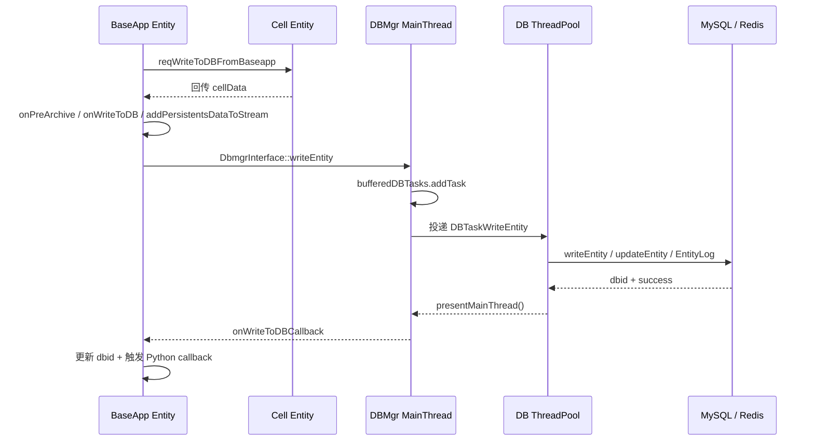
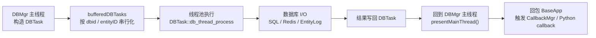

# 13. 数据库、DBMgr 与持久化

> 这一章不只是"怎么写库"，而是回答：在线实体的运行态和数据库的持久态之间，引擎到底做了哪些抽象和保障？

## 13.1 本章核心问题

- DBMgr 是什么？为什么不让 Base 或 Cell 直接写库？
- 一次 writeToDB 的完整链路（Base → DBMgr → DB）是怎样的？
- EntityTable 如何把 .def 定义映射到数据库表结构？
- DBTask 线程池怎么实现异步写库 + 主线程回调？
- EntityLog 在线检出表解决什么问题？
- BigWorld 的 PropertyMapping 比 KBEngine 的 EntityTable 做了哪些更多的事？
- MySQL vs Redis vs XML：存储后端的选择逻辑

## 13.2 DBMgr 不是 SQL 代理，是在线/离线边界管理者

### 为什么不让 Base 或 Cell 直接写库

1. **集中仲裁**：同一个实体可能被多个进程访问（Base 在线、Ghost 在 Cell 上），如果各自写库会产生冲突。DBMgr 是唯一的写入口
2. **连接池管理**：数据库连接是有限资源，集中管理比每个进程各自连接更高效
3. **ID 分配**：EntityID 由 DBMgr 的 IDServer 集中分配，保证全局唯一
4. **在线状态追踪**：EntityLog 表记录"谁在线上"，防止重复创建和非法恢复
5. **事务保证**：创建账号 + 创建实体需要在同一个事务内，DBMgr 统一管理

### KBEngine DBMgr

```cpp
// 文件：kbe/src/server/dbmgr/dbmgr.h（简化）
class Dbmgr : public PythonApp, public Singleton<Dbmgr>
{
public:
    // 实体操作
    void writeEntity(Network::Channel* pChannel, MemoryStream& s);
    void removeEntity(Network::Channel* pChannel, MemoryStream& s);
    void queryEntity(Network::Channel* pChannel, uint16 dbInterfaceIndex,
        COMPONENT_ID componentID, int8 queryMode, DBID dbid,
        std::string& entityType, CALLBACK_ID callbackID, ENTITY_ID entityID);

    // 账号操作
    void reqCreateAccount(Network::Channel* pChannel, MemoryStream& s);
    void onAccountLogin(Network::Channel* pChannel, MemoryStream& s);

    // ID 分配
    void onReqAllocEntityID(Network::Channel* pChannel,
        COMPONENT_ORDER componentType, COMPONENT_ID componentID);

    // 原始 SQL
    void executeRawDatabaseCommand(Network::Channel* pChannel, MemoryStream& s);

private:
    IDServer<ENTITY_ID> idServer_;                     // 实体 ID 分配服务
    BUFFERED_DBTASKS_MAP bufferedDBTasksMaps_;          // 任务缓冲区
    GlobalDataServer* pGlobalData_;                     // 全局数据
    GlobalDataServer* pBaseAppData_;                    // BaseApp 共享数据
    GlobalDataServer* pCellAppData_;                    // CellApp 共享数据

    uint32 numWrittenEntity_;
    uint32 numRemovedEntity_;
    uint32 numQueryEntity_;
};
```

### BigWorld：DBApp + DBAppMgr

BigWorld 把数据库职责拆成了两个进程：

- **DBApp**：实际执行数据库操作（一个或多个）
- **DBAppMgr**：集群协调，管理多个 DBApp 的分工

KBEngine 合并为单个 DBMgr。BigWorld 拆分的好处：多 DBApp 可以水平扩展数据库操作。

## 13.3 一次 writeToDB 的完整链路

### KBEngine：三段式

先把三段式边界画清楚，后面的源码列表就是这张图的展开：



```
脚本调用: entity.writeToDB(callback)
  │
  === 第一段：BaseApp ===
  │
  ├── Base::writeToDB(callback)
  │     ├── 先把 Python callback 存进 CallbackMgr
  │     ├── 如果实体有 Cell 部分
  │     │     → 先发 CellappInterface::reqWriteToDBFromBaseapp
  │     │     → 等 Cell 把 cellData 回传给 Base
  │     │
  │     └── Entity::onCellWriteToDBCompleted(...)
  │           ├── onPreArchive / onWriteToDB
  │           ├── addPersistentsDataToStream() 序列化 Base 持久化属性
  │           ├── 构造 DbmgrInterface::writeEntity
  │           └── 发送：componentID + entityID + dbid + dbInterfaceIndex + sid/callback/autoLoad + 数据流
  │
  === 第二段：DBMgr ===
  │
  ├── Dbmgr::writeEntity(channel, stream)
  │     ├── 先解包：componentID + eid + dbid + dbInterfaceIndex
  │     ├── 投递到任务缓冲区
  │     │     bufferedDBTasks.addTask(new DBTaskWriteEntity(...))
  │     │
  │     └── DBMgr 主线程不做实际 I/O
  │
  === 第三段：DB 线程池 ===
  │
  ├── DBTaskWriteEntity::db_thread_process()
  │     ├── 再从流里读取 sid / callbackID / shouldAutoLoad
  │     ├── EntityTables::writeEntity(...)
  │     │     dbid == 0  → 新建实体
  │     │     dbid != 0  → 更新实体
  │     ├── 如果是首次写库成功
  │     │     → 额外写 KBEEntityLogTable
  │     │       记录 componentID / entityID / ip / port / serverGroupID
  │     │
  │     └── 返回结果（dbid + success）
  │
  ├── DBTaskWriteEntity::presentMainThread()
  │     ├── 回到 DBMgr 主线程
  │     ├── 通知 BaseApp 写库结果
  │     │     BaseappInterface::onWriteToDBCallback
  │     │     包含：entityID + dbid + 成功/失败
  │     │
  │     └── 如果有回调函数，触发 Python callback
  │
  └── BaseApp 收到回调
        → 更新实体的 dbid
        → 执行脚本回调
```

### BigWorld：Base → DBApp

```
脚本调用: base.writeToDB(flags, handler)
  │
  ├── Base::writeToDB(WriteDBFlags, WriteToDBReplyHandler*)
  │     ├── 序列化 Base 属性
  │     │     DataDescription::addToStream(isPersistentOnly=true)
  │     │
  │     ├── 如果有 Cell 数据
  │     │     → 请求 Cell 数据并合并
  │     │
  │     ├── 通过 Mercury 发送到 DBApp
  │     │     Bundle::startRequest(writeEntity, replyHandler)
  │     │     TwoWay：等待回复
  │     │
  │     └── WriteToDBReplyHandler 处理结果
  │
  ├── DBApp MySqlDatabase::putEntity()
  │     ├── EntityTypeMapping::update(dbID, stream)  或
  │     ├── EntityTypeMapping::insertNew(stream)
  │     │
  │     └── 回复到 BaseApp
  │
  └── BaseApp 收到回复
        → 更新 databaseID_
        → 触发 PyDeferred callback
```

BigWorld 和 KBEngine 的共同点是"异步写库后再回调脚本"，只是前者更偏 reply handler / Deferred 风格，后者直接靠 CallbackMgr 保存 Python 回调。

## 13.4 DBTask：线程池异步执行 + 主线程回调

### 为什么需要线程池

数据库操作（SQL 查询）是阻塞 I/O。如果在 DBMgr 主线程执行，会阻塞消息处理。KBEngine 用线程池把 DB I/O 移到工作线程：



如果不把这条边界看清楚，就会误以为 `writeToDB()` 是同步 SQL 调用。实际上同步的是“发起写库请求”，不是“等数据库返回”。

```cpp
// 通用基类：kbe/src/lib/db_interface/db_tasks.h
class DBTaskBase : public thread::TPTask
{
public:
    virtual bool process();
    virtual bool db_thread_process() = 0;
    virtual thread::TPTask::TPTaskState presentMainThread();
};

// DBMgr 专用实体任务：kbe/src/server/dbmgr/dbtasks.h
class EntityDBTask : public DBTaskBase
{
    // 额外带 entityID / dbid / 回包地址
};

class DBTaskWriteEntity : public EntityDBTask
{
    bool db_thread_process();
    TPTaskState presentMainThread();
};
```

**生命周期**：

```
DBMgr 主线程
  │
  ├── 收到 writeEntity 消息
  │     new DBTaskWriteEntity(...)
  │     bufferedDBTasks.addTask(task)
  │
  ├── DB 线程池取出 task
  │     task->db_thread_process()        ← 执行 SQL（阻塞）
  │     返回 TPTaskState
  │
  ├── DBMgr 主线程 tick
  │     task->presentMainThread()         ← 处理结果，发回调
  │
  └── 任务完成，销毁
```

**Buffered_DBTasks**：DBMgr 不是直接把任务扔给线程池，而是先按 `dbid` 或 `entityID` 把同一实体的任务串行化。前一个任务没完成时，后续任务先挂在 multimap 里，等 `tryGetNextTask()` 再继续投递。重点是"避免同一实体并发落库"，而不是在这里做值级合并。

### BigWorld 的对应机制

BigWorld 使用 `BackgroundTaskManager`（`lib/cstdmf/bgtask_manager.hpp`），每个线程有独立的 MySQL 连接（`ThreadData`），任务按优先级排序。机制类似，但 BigWorld 多了优先级控制。

## 13.5 EntityTable：.def 定义到数据库表的映射

### KBEngine EntityTable

```cpp
// 文件：kbe/src/lib/db_interface/entity_table.h（简化）
class EntityTable
{
public:
    virtual bool initialize(ScriptDefModule* sm, std::string name) = 0;
    virtual bool syncToDB(DBInterface* pdbi) = 0;          // 同步表结构到 DB
    virtual bool syncIndexToDB(DBInterface* pdbi) = 0;     // 同步索引

    DBID writeTable(DBInterface* pdbi, DBID dbid,
        int8 shouldAutoLoad, MemoryStream* s, ScriptDefModule* pModule);
    bool removeEntity(DBInterface* pdbi, DBID dbid, ScriptDefModule* pModule);
    bool queryTable(DBInterface* pdbi, DBID dbid,
        MemoryStream* s, ScriptDefModule* pModule);

    // 序列化/反序列化
    void addPersistentsDataToStream(MemoryStream* s, ...);
    void createDictDataFromPersistentStream(MemoryStream* s, ...);

protected:
    std::string name_;                    // 表名
    TABLE_ITEM_MAP tableItems_;           // 列描述
    uint32 uid_;                          // 表 UID
};
```

**数据类型映射**：

```cpp
// 每个 .def 属性类型对应一个 EntityTableItem
#define TABLE_ITEM_TYPE_FIXEDARRAY   1   // → MySQL TEXT/BLOB
#define TABLE_ITEM_TYPE_FIXEDDICT    2   // → MySQL TEXT/BLOB
#define TABLE_ITEM_TYPE_STRING       3   // → MySQL VARCHAR/TEXT
#define TABLE_ITEM_TYPE_DIGIT        4   // → MySQL INT/BIGINT
#define TABLE_ITEM_TYPE_BLOB         5   // → MySQL BLOB
#define TABLE_ITEM_TYPE_VECTOR2      6   // → MySQL FLOAT, FLOAT
#define TABLE_ITEM_TYPE_VECTOR3      7   // → MySQL FLOAT, FLOAT, FLOAT
#define TABLE_ITEM_TYPE_VECTOR4      8   // → MySQL FLOAT, FLOAT, FLOAT, FLOAT
#define TABLE_ITEM_TYPE_UNICODE      9   // → MySQL TEXT
#define TABLE_ITEM_TYPE_PYTHON      11   // → MySQL BLOB（pickle）
```

**MySQL 特化的 EntityTable**：

```cpp
// 文件：kbe/src/lib/db_mysql/entity_table_mysql.h（简化）
class EntityTableMysql : public EntityTable
{
    DBID writeTable(DBInterface* pdbi, DBID dbid,
        int8 shouldAutoLoad, MemoryStream* s, ScriptDefModule* pModule);
    bool removeEntity(DBInterface* pdbi, DBID dbid, ScriptDefModule* pModule);
    bool queryTable(DBInterface* pdbi, DBID dbid,
        MemoryStream* s, ScriptDefModule* pModule);
};

class EntityTableItemMysql_VECTOR3 : public EntityTableItemMysqlBase
{
    uint8 type() const { return TABLE_ITEM_TYPE_VECTOR3; }
    void getWriteSqlItem(DBInterface* pdbi, MemoryStream* s,
        mysql::DBContext& context);
    // VECTOR3 拆成 sm_x FLOAT, sm_y FLOAT, sm_z FLOAT 三列
};
```

**Redis 特化的 EntityTable**：

```cpp
// 文件：kbe/src/lib/db_redis/entity_table_redis.h（简化）
// Redis 没有真正的"表"
// 用 Hash 存实体属性：tbl_Account:1 = {name: "foo", level: 10, ...}
// 用 Sorted Set 做索引
// Key 设计：dbname:entityType:entityID:field
```

### BigWorld PropertyMapping：属性级映射策略

```cpp
// 文件：BigWorld-Engine-14.4.1/programming/bigworld/lib/db_storage_mysql/mappings/property_mapping.hpp（简化）
class PropertyMapping : public SafeReferenceCount
{
public:
    static PropertyMappingPtr create(const Namer& namer,
        const BW::string& propName, const DataType& type,
        int databaseLength, DataSectionPtr pDefaultValue,
        DatabaseIndexingType indexingType);

    virtual void fromStreamToDatabase(StreamToQueryHelper& helper,
        BinaryIStream& strm, QueryRunner& queryRunner) const = 0;
    virtual void fromDatabaseToStream(ResultToStreamHelper& helper,
        ResultStream& results, BinaryOStream& strm) const = 0;
};
```

BigWorld 有 15+ 种 PropertyMapping 子类：

| 映射类 | 用途 |
|--------|------|
| `BlobPropertyMapping` | 二进制大对象 |
| `SequenceMapping` | 列表/数组 → 子表 |
| `StringPropertyMapping` | 字符串 |
| `ClassMapping` | 嵌套对象 → 子表 |
| `CompositePropertyMapping` | 复合属性 |
| `UserTypeMapping` | 自定义类型 |
| `PythonMapping` | Python 对象 → pickle |
| `SinglePropertyMapping` | 单值属性 |
| `VectorMapping` | 向量 |

**比 KBEngine 多了什么**：每个属性可以有独立的存储策略。KBEngine 的 EntityTableItem 是类型级映射（所有 INT32 属性用同一种策略），BigWorld 是属性级映射（同一类型的两个属性可以有不同的映射策略）。

### EntityTypeMapping：实体的数据库 CRUD

```cpp
// 文件：BigWorld-Engine-14.4.1/programming/bigworld/lib/db_storage_mysql/mappings/entity_type_mapping.hpp（简化）
class EntityTypeMapping : public EntityMapping
{
public:
    DatabaseID getDbID(MySql& connection, const BW::string& name) const;
    bool getName(MySql& connection, DatabaseID dbID, BW::string& name) const;
    bool checkExists(MySql& connection, DatabaseID dbID) const;

    DatabaseID insertNew(MySql& connection, BinaryIStream& strm) const;
    DatabaseID insertExplicit(MySql& connection, DatabaseID dbID,
        BinaryIStream& strm) const;
    bool update(MySql& connection, DatabaseID dbID,
        BinaryIStream& strm, GameTime* pGameTime) const;
    bool getStreamByID(MySql& connection, DatabaseID dbID,
        BinaryOStream& strm) const;
    bool deleteWithID(MySql& connection, DatabaseID dbID) const;
};
```

## 13.6 addPersistentsDataToStream / createDictDataFromPersistentStream

这两个函数是"运行态 ↔ 持久态"的序列化桥梁：

```
运行态 → 持久态（写库）：
  EntityTable::addPersistentsDataToStream(MemoryStream* s, ...)
    遍历 persistentPropertyDescr_：
      对每个 Persistent 属性：
        获取 Python 属性值
        PropertyDescription::getDataType()->addToStream(s, pyValue)
    结果：一个 MemoryStream 包含所有持久化属性的值

持久态 → 运行态（恢复）：
  EntityTable::createDictDataFromPersistentStream(MemoryStream* s, ...)
    遍历 persistentPropertyDescr_：
      对每个 Persistent 属性：
        DataType::createFromStream(s) → PyObject
        加入结果字典 {propName: value}
    结果：一个 Python 字典，可直接设置到实体
```

**这就是 Ch5 说的"改 .def 文件影响写库流和恢复流"的具体机制**——新增 Persistent 属性意味着这两条序列化链路都要更新。

## 13.7 EntityLog：在线实体检出与恢复

EntityLog 不是普通业务数据，而是"实体在线日志"——记录哪些实体正在线上。

### KBEngine KBEEntityLogTable

```
EntityLog 的核心字段：
  entityDBID    → 数据库 ID
  entityType    → 实体脚本类型 UID
  entityID      → 在线实体 ID
  componentID   → 当前承载它的 BaseApp
  ip / port     → 对应进程地址
  serverGroupID → 服务器组标识
```

**用途**：

```
实体上线时：
  DBMgr 在 EntityLog 写入记录
  → 标记"这个实体在 BaseApp X 上"

实体下线时：
  DBMgr 删除记录

实体恢复/重连时：
  DBMgr 检查 EntityLog
  → 有记录？→ 上次非正常下线 → 走恢复流程（找回 BaseApp）
  → 无记录？→ 纯离线 → 从数据库加载

账号重复登录：
  DBMgr 检查 EntityLog
  → 有记录？→ 该账号已在线 → 踢掉旧连接 或 拒绝登录
```

没有这层，`createEntityFromDBID` / 账号恢复 / 重检出都会变得脆弱——不知道实体是"纯离线"还是"在线上某个进程里"。

## 13.8 Entity Auto-Loading：服务器启动时自动恢复

DBMgr 启动时扫描需要自动加载的实体：

```cpp
// KBEngine EntityTable 中的 auto-load 逻辑
void EntityTable::queryAutoLoadEntities(DBInterface* pdbi,
    ScriptDefModule* pModule, ENTITY_ID start, ENTITY_ID end,
    std::vector<DBID>& outs);
```

这里不要和 `.def` 元信息混淆。当前实现真正持久化到数据库的是保留列 `sm_autoLoad`，`writeTable()` 在 `shouldAutoLoad > -1` 时更新它，`queryAutoLoadEntities()` 再按这列筛出要恢复的实体。也就是说，auto-load 是写库时带上的持久化状态，不是 `.def` 里的一个静态开关。

BigWorld 的对应实现在 `entity_auto_loader.cpp`。

## 13.9 本章边界：DB 持久化不等于完整容灾体系

本章聚焦当前仓库里可以直接追踪的 `writeToDB / queryEntity / EntityLog / auto-load` 链路。  
BigWorld 的 Backup / Archive、Cell 宕机恢复、Base 互备等机制属于更大的容灾主题，更适合放到后面的运维与容错章节统一展开，而不是在这里把"写数据库"和"跨进程备份"混成同一件事。

### `writeToDB` 的语义

| 模式 | 优势 | 劣势 |
|------|------|------|
| 显式 `writeToDB` | 调用点清晰，语义明确 | 需要业务自己决定何时落库 |
| 首次创建顺带写 EntityLog | 把"新建 + 在线检出"收束成一次完整流程 | 首次写库路径比普通 update 更重 |
| `sm_autoLoad` 持久化标志 | 支持重启后自动拉起关键实体 | 需要业务显式维护开关 |

## 13.10 存储后端对比

### KBEngine：MySQL + Redis 双后端

```cpp
// 统一接口
class DBInterface
{
    virtual bool query(const char* strCommand, uint32 size, ...) = 0;
    virtual EntityTable* createEntityTable(EntityTables* pEntityTables) = 0;
    virtual bool dropEntityTableFromDB(const char* tableName) = 0;
};
```

| 后端 | 实现 | 用途 |
|------|------|------|
| MySQL | `lib/db_mysql/` | 实体持久化主存储（关系型、事务、复杂查询） |
| Redis | `lib/db_redis/` | 另一套实体持久化后端，实现与 MySQL 平行的 `DBInterface` / `EntityTable` |

**Redis 的"表"**：不是关系表，而是用 key/hash 组织实体数据；源码里也有对应的 `EntityTableRedis` 与 `KBEEntityLogTableRedis`。

### BigWorld：MySQL + XML 双后端（无 Redis）

| 后端 | 实现 | 用途 |
|------|------|------|
| MySQL | `lib/db_storage_mysql/` | 生产环境主存储 |
| XML | `lib/db_storage_xml/` | 开发/测试用轻量存储 |

BigWorld 这一节更安全的说法是：它的主线实现集中在 MySQL / XML 存储层，没有像 KBEngine 这样在同一抽象层里再提供一套 Redis `DBInterface`。

### BigWorld 主从支持

BigWorld 支持 `PrimaryDatabase` / `SecondaryDatabase` 分离——写走主库，读可以走从库。KBEngine 没有原生主从支持。

## 13.11 关键源码入口

### KBEngine

| 概念 | 文件 |
|------|------|
| DBMgr | `kbe/src/server/dbmgr/dbmgr.h` |
| writeEntity | `kbe/src/server/dbmgr/dbmgr.cpp` |
| DBInterface 基类 | `kbe/src/lib/db_interface/db_interface.h` |
| EntityTable 基类 | `kbe/src/lib/db_interface/entity_table.h` |
| MySQL EntityTable | `kbe/src/lib/db_mysql/entity_table_mysql.h` |
| MySQL DBInterface | `kbe/src/lib/db_mysql/db_interface_mysql.h` |
| Redis DBInterface | `kbe/src/lib/db_redis/db_interface_redis.h` |
| DBTask 基类 | `kbe/src/lib/db_interface/db_tasks.h` |

### BigWorld

| 概念 | 文件 |
|------|------|
| IDatabase 接口 | `BigWorld-Engine-14.4.1/programming/bigworld/lib/db_storage/idatabase.hpp` |
| MySqlDatabase | `BigWorld-Engine-14.4.1/programming/bigworld/lib/db_storage_mysql/mysql_database.hpp` |
| EntityMapping | `BigWorld-Engine-14.4.1/programming/bigworld/lib/db_storage_mysql/mappings/entity_mapping.hpp` |
| EntityTypeMapping | `BigWorld-Engine-14.4.1/programming/bigworld/lib/db_storage_mysql/mappings/entity_type_mapping.hpp` |
| PropertyMapping | `BigWorld-Engine-14.4.1/programming/bigworld/lib/db_storage_mysql/mappings/property_mapping.hpp` |
| EntityKey | `BigWorld-Engine-14.4.1/programming/bigworld/lib/db_storage/entity_key.hpp` |
| Base writeToDB | `BigWorld-Engine-14.4.1/programming/bigworld/server/baseapp/base.hpp` |
| WriteDB flags | `BigWorld-Engine-14.4.1/programming/bigworld/lib/server/writedb.hpp` |
| DATA_PERSISTENT | `BigWorld-Engine-14.4.1/programming/bigworld/lib/entitydef/data_description.hpp` |

## 13.12 源码走读路径

### 路径一：跟踪一次完整的实体写入链路

1. `kbe/src/server/dbmgr/dbmgr.cpp` — `writeEntity()` 接收消息并投递任务
2. `kbe/src/lib/db_interface/db_tasks.h` — `DBTaskWriteEntity` 异步执行
3. `kbe/src/lib/db_mysql/entity_table_mysql.h` — `writeTable()` 构造并执行 SQL

### 路径二：理解 EntityDef → 数据库表的映射

1. `kbe/src/lib/db_interface/entity_table.h` — `EntityTable` 基类，TABLE_ITEM_TYPE 枚举
2. `kbe/src/lib/db_mysql/entity_table_mysql.h` — MySQL 特化，看 VECTOR3 如何拆成三列
3. `BigWorld-Engine-14.4.1/programming/bigworld/lib/db_storage_mysql/mappings/` — 15+ 种 PropertyMapping

### 路径三：理解 EntityLog 和在线状态管理

1. `kbe/src/server/dbmgr/dbmgr.cpp` — `onEntityOffline()` / EntityLog 操作
2. 对比 BigWorld 的 `shouldGetBaseEntityLocation` 参数（IDatabase::getEntity 中）

## 13.13 小结

- **DBMgr 是在线/离线边界管理者**：集中仲裁写库、ID 分配、在线状态追踪
- **writeToDB 是三段式链路**：BaseApp 序列化 → DBMgr 投递任务 → DB 线程池执行 SQL → 回调
- **EntityTable 把 .def 映射到数据库表**：属性类型 → 列类型，Persistent=true → 列存在
- **DBTask 线程池实现异步写库**：db_thread_process() 执行 SQL，presentMainThread() 回调结果
- **EntityLog 追踪在线实体**：防止重复创建、支持宕机恢复、账号重连
- **BigWorld 的 PropertyMapping 是属性级映射**：每个属性可以有独立的存储策略，比 KBEngine 更灵活
- **KBEngine 支持 MySQL + Redis**：MySQL 做主存储，Redis 做缓存和共享数据
- **BigWorld 支持 MySQL + XML + 主从**：生产用 MySQL，开发用 XML，读写分离
