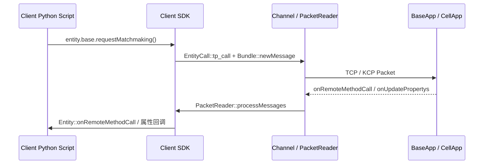
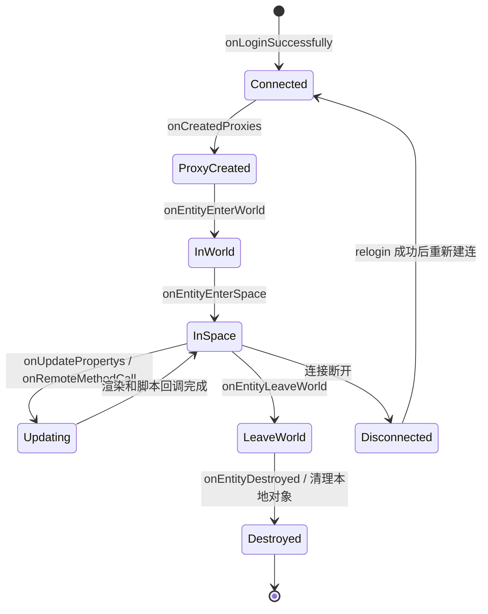
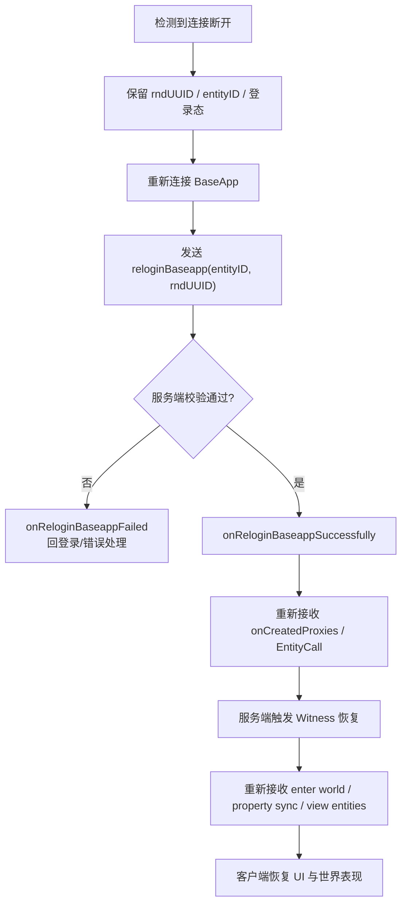

# 19. 客户端协议与前后端交互

> 这一章回答：从客户端的视角看，实体是怎么被创建、更新、销毁的？服务器发来的字节流怎么变成 Python 对象？断线重连时世界状态怎么恢复？

## 相关 API 回查

- 客户端接口：[KBEngine(client)](/api/client/KBEngine.md)、[Entity(client)](/api/client/Entity.md)
- 机器人客户端接口：[KBEngine(bots)](/api/bots/KBEngine.md)、[Entity(bots)](/api/bots/Entity.md)、[PyClientApp(bots)](/api/bots/PyClientApp.md)
- 数据类型补充：[基本数据类型](/api/basetypes.md)

## 19.1 本章核心问题

- 客户端 SDK 怎么收发消息？ClientInterface 定义了哪些消息？
- 客户端视角的实体生命周期是怎样的？（创建→属性初始化→进入空间→更新→离开→销毁）
- 收到 onUpdatePropertys 后客户端做什么？位置/朝向怎么插值平滑？
- detailLevel 在客户端怎么表现？
- 断线重连的客户端侧怎么工作？
- TCP vs KCP 的可靠性有什么区别？
- 客户端 EntityCall 调用 Exposed 方法的信任边界是什么？

## 19.2 客户端 SDK 的协议层

### KBEngine ClientInterface 消息定义

```cpp
// 文件：kbe/src/lib/client_lib/client_interface.h（简化）
NETWORK_INTERFACE_DECLARE_BEGIN(ClientInterface)

    // === 连接与认证 ===
    CLIENT_MESSAGE_DECLARE_STREAM(onHelloCB, NETWORK_VARIABLE_MESSAGE)
    CLIENT_MESSAGE_DECLARE_STREAM(onLoginSuccessfully, NETWORK_VARIABLE_MESSAGE)

    // === 实体创建 ===
    CLIENT_MESSAGE_DECLARE_ARGS3(onCreatedProxies, NETWORK_VARIABLE_MESSAGE,
        uint64, rndUUID, ENTITY_ID, eid, std::string, entityType)

    // === 实体生命周期 ===
    CLIENT_MESSAGE_DECLARE_STREAM(onEntityEnterWorld, NETWORK_VARIABLE_MESSAGE)
    CLIENT_MESSAGE_DECLARE_ARGS1(onEntityLeaveWorld, NETWORK_FIXED_MESSAGE,
        ENTITY_ID, eid)
    CLIENT_MESSAGE_DECLARE_STREAM(onEntityEnterSpace, NETWORK_VARIABLE_MESSAGE)
    CLIENT_MESSAGE_DECLARE_ARGS1(onEntityLeaveSpace, NETWORK_FIXED_MESSAGE,
        ENTITY_ID, eid)
    CLIENT_MESSAGE_DECLARE_ARGS1(onEntityDestroyed, NETWORK_FIXED_MESSAGE,
        ENTITY_ID, eid)

    // === 远程方法调用 ===
    CLIENT_MESSAGE_DECLARE_STREAM(onRemoteMethodCall, NETWORK_VARIABLE_MESSAGE)

    // === 属性同步 ===
    CLIENT_MESSAGE_DECLARE_STREAM(onUpdatePropertys, NETWORK_VARIABLE_MESSAGE)

    // === 断线重连 ===
    CLIENT_MESSAGE_DECLARE_ARGS1(onReloginBaseappFailed, NETWORK_FIXED_MESSAGE,
        SERVER_ERROR_CODE, failedcode)
    CLIENT_MESSAGE_DECLARE_STREAM(onReloginBaseappSuccessfully, NETWORK_VARIABLE_MESSAGE)

NETWORK_INTERFACE_DECLARE_END()
```

### BigWorld ClientInterface

```cpp
// 文件：BigWorld-Engine-14.4.1/programming/bigworld/lib/connection/client_interface.hpp（简化）

// 实体进入 AOI
MF_BEGIN_CLIENT_MSG(enterAoI)
    EntityID id;
    IDAlias idAlias;
END_STRUCT_MESSAGE()

// 实体离开 AOI
MF_VARLEN_CLIENT_MSG(leaveAoI)

// 创建实体（完整数据）
MF_VARLEN_CLIENT_MSG(createEntity)
MF_VARLEN_CLIENT_MSG(createEntityDetailed)

// 实体属性/方法
MF_CALLBACK_MSG(entityProperty)
MF_CALLBACK_MSG(entityMethod)

// 控制权
MF_BEGIN_CLIENT_MSG(controlEntity)
    EntityID id;
    bool on;
END_STRUCT_MESSAGE()

// 设置游戏时间
MF_BEGIN_CLIENT_MSG(setGameTime)
    GameTime gameTime;
END_STRUCT_MESSAGE()
```

### 消息收发的完整路径



```
客户端发送（脚本调用 → 网络）：
  Python: entity.base.requestMatchmaking()
    │
    ├── EntityCall::tp_call()
    │     → newCall(bundle)
    │     → 序列化参数到 bundle
    │
    ├── Channel::send(bundle)
    │     → Bundle 拆分为 Packet
    │     → TCP/KCP 发送
    │
    └── 到达服务器

客户端接收（网络 → 脚本回调）：
  网络层收到 Packet
    │
    ├── PacketReader::processMessages()
    │     → 解析消息 ID
    │     → 查找 MessageHandler
    │
    ├── ClientInterface::onRemoteMethodCall handler
    │     → 反序列化 ENTITY_ID + 方法 utype + 参数
    │     → 找到目标 Entity
    │     → Entity::onRemoteMethodCall(stream)
    │
    └── Python 回调被触发
          entity.onMatchmakingResult(result)
```

## 19.3 客户端视角的实体生命周期

### 完整生命周期

先用一张图看客户端侧状态变化，下面的文本再按消息逐段展开：



```
                  服务器                           客户端
                    │                                │
  1. 登录成功        │── onLoginSuccessfully ──────→ │ 建立连接
                    │                                │
  2. 创建玩家实体    │── onCreatedProxies ──────────→ │ 创建 Entity
                    │    (uuid, eid, entityType)      │ 初始化属性
                    │                                │
  3. 进入世界        │── onEntityEnterWorld ────────→ │ entity.onEnterWorld()
                    │    (eid, scriptType, ...)       │ 绑定 cellEntityCall
                    │                                │
  4. 进入空间        │── onEntityEnterSpace ────────→ │ entity.onEnterSpace()
                    │    (eid, spaceID, ...)          │ 设置当前 spaceID
                    │                                │
  5. 其他实体进入AOI │── onEntityEnterWorld ────────→ │ 创建其他 Entity
                    │── onUpdatePropertys ──────────→ │ 设置初始属性
                    │                                │
  6. 属性更新        │── onUpdatePropertys ──────────→ │ entity.onUpdatePropertys()
                    │    (eid, prop1=val1, ...)       │ 更新显示
                    │                                │
  7. 远程方法调用    │── onRemoteMethodCall ─────────→ │ entity.onMethod(args)
                    │                                │
  8. 实体离开世界    │── onEntityLeaveWorld ────────→ │ entity.onLeaveWorld()
                    │    (eid)                       │ 非玩家实体通常随即销毁
                    │                                │
  9. 玩家离开空间    │── onEntityLeaveSpace ────────→ │ entity.onLeaveSpace()
                    │    (eid)                       │
 10. 预进入世界即销毁 │── onEntityDestroyed ──────────→ │ destroyEntity()
                    │    (eid)                       │ 典型是尚未 enterWorld 的实体
                    │                                │
 11. 玩家下线        │── 断开连接 ──────────────────→ │ 清理所有实体
```

### onCreatedProxies：玩家实体的创建

```cpp
// 文件：kbe/src/lib/client_lib/clientobjectbase.cpp（简化）
void ClientObjectBase::onCreatedProxies(Network::Channel* pChannel,
    uint64 rndUUID, ENTITY_ID eid, std::string& entityType)
{
    entityID_ = eid;
    rndUUID_ = rndUUID;
    connectedBaseapp_ = true;

    // 创建玩家的 baseEntityCall
    EntityCall* entityCall = new EntityCall(
        EntityDef::findScriptModule(entityType.c_str()),
        NULL, appID(), eid, ENTITYCALL_TYPE_BASE);

    client::Entity* pEntity = createEntity(entityType.c_str(), NULL,
        !hasBufferedMessage, eid, true, entityCall, NULL);

    // 如果实体属性先于创建消息到达，则先回放属性流再初始化脚本对象
    if (hasBufferedMessage)
    {
        this->onUpdatePropertys(pChannel, *iter->second.get());
        pEntity->initializeEntity(NULL);
        pEntity->isInited(true);
        pEntity->callPropertysSetMethods();
    }
}
```

这里的缓冲发生在 `ClientObjectBase::onUpdatePropertys_()`：如果目标实体还不存在，就把该实体的属性流放进 `bufferedCreateEntityMessage_`。等 `onCreatedProxies()` 或 `onEntityEnterWorld()` 真正创建出实体后，再回放这段流。

### onEntityEnterWorld：进入世界

```cpp
// 文件：kbe/src/lib/client_lib/clientobjectbase.cpp（简化）
void ClientObjectBase::onEntityEnterWorld(Network::Channel* pChannel,
    MemoryStream& s)
{
    ENTITY_ID eid;
    ENTITY_SCRIPT_UID scriptType;
    // 真实实现还会读取 alias/scriptType/isOnGround 等字段
    // 如果实体不存在，会在这里创建其他玩家/NPC 的客户端实体
    // 如果是玩家本人，则补齐 cellEntityCall 并触发 onBecomePlayer/onEnterWorld
}
```

对客户端来说，`onEntityEnterWorld()` 才是“进入世界对象集合”的关键事件；`onEntityEnterSpace()` 只是补充 `spaceID_`、位置缓存和 `onEnterSpace()` 回调。

### onEntityDestroyed：实体销毁

```cpp
void ClientObjectBase::onEntityDestroyed(Network::Channel* pChannel, ENTITY_ID eid)
{
    client::Entity* entity = pEntities_->find(eid);
    if (entity == NULL)
        return;

    // 如果还在世界中，先离开
    if (entity->inWorld())
    {
        if (entityID_ == eid)
            clearSpace(false);         // 玩家自身被销毁 → 清空整个空间
        entity->onLeaveWorld();
    }

    // 从实体表移除并销毁
    pEntities_->erase(eid);
    entity->destroy();
}
```

### BigWorld 实体生命周期

```cpp
// 文件：BigWorld-Engine-14.4.1/programming/bigworld/client/entity.cpp（简化）
void Entity::onEnterWorld()
{
    MF_ASSERT(this->spaceID() != NULL_SPACE_ID);
    this->onEnterSpace(false);

    // 调用 Python 回调
    if (pPyEntity_.hasAttribute("onEnterWorld"))
    {
        pPyEntity_.callMethod("onEnterWorld", args, ScriptErrorPrint());
    }
}

void Entity::onLeaveWorld()
{
    if (pPyEntity_.hasAttribute("onLeaveWorld"))
    {
        pPyEntity_.callMethod("onLeaveWorld", ScriptErrorPrint());
    }

    // 清理资源
    resourceRefs_.clear();
    traps_.clear();
}

void Entity::onDestroyed()
{
    // 断开所有引用
    pPyEntity_.onEntityDestroyed();
}
```

**BigWorld 的进入 AOI 机制**：

```
服务器发送 enterAoI(id, idAlias)
  → 客户端创建 Entity shell（空壳）
  → 服务器发送 createEntity / createEntityDetailed（属性数据）
  → Entity 填充属性
  → onEnterWorld() 被调用

离开 AOI：
  → 服务器发送 leaveAoI(id)
  → onLeaveWorld() 被调用
  → 实体被销毁
```

## 19.4 属性同步的客户端侧

### onUpdatePropertys 处理

```cpp
// 文件：kbe/src/lib/client_lib/entity.cpp（简化）
void Entity::onUpdatePropertys(MemoryStream& s)
{
    while (s.length() > 0)
    {
        ENTITY_PROPERTY_UID uid;
        s >> uid;

        if (uid > 0)
        {
            // 查找属性描述
            PropertyDescription* pPropDesc =
                pScriptModule_->findClientPropertyDescription(uid);

            if (pPropDesc)
            {
                // 从流中创建 Python 对象
                PyObject* pyData = pPropDesc->createFromStream(&s);

                // 设置到实体属性
                pPropDesc->setToObj(this, pyData);
                Py_DECREF(pyData);
            }
        }
    }
}
```

**关键**：客户端这一层没有服务器那种 dirty 收束逻辑。`ClientObjectBase::onUpdatePropertys_()` 找到实体后就直接调用 `entity->onUpdatePropertys(s)`；如果实体还没创建，只缓存流。

### 位置/朝向的插值与平滑

直接覆盖位置会导致实体"瞬移"——从上一帧的位置跳到新位置。客户端需要**插值**来平滑移动。

```
服务器每 tick（100ms）发送一次位置：
  t=0.0s: pos = (0, 0, 0)
  t=0.1s: pos = (1, 0, 0)
  t=0.2s: pos = (2, 0, 0)

客户端渲染帧率 60fps（~16.7ms/帧）：

  无插值：
    frame 0: (0,0,0)  frame 1: (0,0,0)  ...  frame 6: (1,0,0)  ← 突然跳了一格
    frame 7: (1,0,0)  ...  frame 12: (2,0,0) ← 又跳了一格

  线性插值：
    frame 0: (0, 0, 0)
    frame 1: (0.17, 0, 0)
    frame 2: (0.33, 0, 0)
    ...
    frame 6: (1.0, 0, 0)     ← 平滑到达
    frame 7: (1.17, 0, 0)
    ...
    frame 12: (2.0, 0, 0)    ← 平滑到达
```

**BigWorld 的 Velocity-based 插值**：

```cpp
// BigWorld 客户端使用 velocity 属性做预测性插值
// Entity 有 PY_DEFERRED_ATTRIBUTE(velocity)
// 客户端收到新位置后，根据 velocity 预测中间帧的位置

// 如果 velocity 足够准确，客户端可以在两次服务器更新之间
// 用 velocity * deltaTime 预测位置，减少插值延迟
```

### detailLevel 在客户端的表现

服务器根据距离选择同步哪些属性（Ch12）。客户端也需要知道当前实体在哪个 detailLevel：

```
detailLevel=0（近处）：全部属性都同步
  → 客户端显示完整模型、装备、buff 图标、名称...

detailLevel=1（中距离）：部分属性
  → 客户端显示简化模型、名称...

detailLevel=2（远处）：只有位置和朝向
  → 客户端只显示一个点/简化图标

客户端不需要显式知道 detailLevel——
服务器已经按 detailLevel 过滤了属性，
客户端只需要渲染收到的属性。
```

## 19.5 断线重连的客户端侧

### KBEngine 重连流程

客户端侧看，重连不是“继续使用旧 socket”，而是重新建连后让服务端把世界状态补回来：



```
客户端检测到断线
  │
  ├── 1. 使用上次 onLoginSuccessfully 保存的 baseappIP_ / baseappPort_
  │
  ├── 2. 重新连接 BaseApp
  │     → 发送 BaseappInterface::reloginBaseapp
  │     → 携带 name / password / rndUUID / entityID
  │
  ├── 3a. 重连成功
  │     BaseApp 回复 onReloginBaseappSuccessfully
  │       → createClientProxies(proxy, true)
  │       → Proxy::onGetWitness()
  │       → 重新推送 onCreatedProxies / 属性 / world / space 消息
  │       → 客户端重建实体和视野
  │
  └── 3b. 重连失败
        BaseApp 回复 onReloginBaseappFailed(failedcode)
          → rndUUID 不匹配 / 实体不存在 / 会话非法
```

### 重连时客户端如何重建世界状态

```
重连成功后，服务器会重推完整状态：

1. onCreatedProxies(uuid, eid, entityType)
     → 重建玩家实体并拿回 baseEntityCall

2. onUpdatePropertys(stream)
     → 填充玩家实体的所有属性

3. onEntityEnterWorld(...)
     → 重建 world / cell 侧状态

4. onEntityEnterSpace(spaceID, eid, ...)
     → 玩家进入空间

5. [对视野内每个实体]
     onEntityEnterWorld → onUpdatePropertys → onEntityEnterSpace
     → 重建所有可见实体
```

客户端不依赖本地快照恢复世界；重连成功后的主路径是服务端重新推送当前状态。

### BigWorld 的重连

BigWorld 的重连类似，但有一个额外的**控制权恢复**步骤：

```
重连成功
  │
  ├── 恢复网络连接
  ├── 服务器发送 controlEntity(id, true)
  │     → 客户端重新获得实体的控制权
  ├── 服务器推送完整世界状态
  └── 客户端恢复渲染
```

## 19.6 消息的顺序性与可靠性

### Channel 语义：可靠有序，底层可切到 KCP

KBEngine 客户端最终面对的是 `Channel` 提供的可靠有序消息流；默认常见部署是 TCP，也可以切到底层 KCP 封装。

TCP 场景下：

1. **可靠传输**：每个包都会被确认，丢失则重传
2. **有序到达**：包按发送顺序到达
3. **流量控制**：滑动窗口控制发送速率

```
TCP 下的消息顺序保证：

BaseApp 发送：
  msg1: onUpdatePropertys(health=80)
  msg2: onRemoteMethodCall(onDamage, 50)
  msg3: onUpdatePropertys(health=30)

客户端收到顺序一定是 msg1 → msg2 → msg3
  → health 先变成 80，然后收到 onDamage 调用，最后 health 变成 30
  → 逻辑正确
```

### KCP：低延迟的可靠传输实现

KBEngine 也提供 KCP 的发送/接收实现，但这里不要把它和 BigWorld Mercury 混成一类：

```
1. KCP 是在 UDP 之上提供“可靠、有序”交付，不是按消息级别选择可靠性。
2. KBEngine 当前客户端协议语义不因为切到 KCP 就变成“不可靠属性同步”。

KCP 的价值主要在于：
  1. 更积极的重传与 RTT 估计
  2. 避开 TCP 某些额外等待
  3. 保持业务消息的顺序交付

KBEngine KCP 集成：
  kbe/src/lib/network/kcp_packet_sender.h
  kbe/src/lib/network/kcp_packet_receiver.h
```

### BigWorld Mercury：自建 UDP 可靠性

```cpp
// 文件：BigWorld-Engine-14.4.1/programming/bigworld/lib/network/udp_channel.hpp（简化）
class UDPChannel : public Channel
{
    // 可靠性机制
    void checkResendTimers(UDPBundle& bundle);
    bool resend(SeqNum seq, UDPBundle& bundle);
    bool handleCumulativeAck(SeqNum seq);

    // 发送窗口
    int windowSize() const;
    int numOutstandingPackets() const;
};
```

BigWorld 的 Mercury 不是 KCP，而是自建的 UDP 可靠性层（Ch10 讲过的 ReliableType）：

```
Mercury 可靠性级别：
  RELIABLE_NO：不保证送达（位置更新，丢了也无所谓）
  RELIABLE_DRIVER：保证送达的驱动消息
  RELIABLE_PASSENGER：随驱动消息一起可靠传输
  RELIABLE_CRITICAL：关键消息，必须可靠

TCP vs KCP vs Mercury：
  TCP：所有消息可靠有序，延迟较高
  KCP：所有消息可靠有序，延迟较低
  Mercury：按消息选择可靠性，最低延迟但实现最复杂
```

## 19.7 客户端 EntityCall：Exposed 方法的信任边界

### 客户端调用服务端方法

```
Python（客户端）: entity.base.requestBuyItem(itemId=1001, count=5)
  │
  ├── EntityCall::tp_call()
  │     → newCall(bundle)
  │     → bundle << BaseappInterface::onRemoteMethodCall
  │     → bundle << entityID << ENTITYCALL_TYPE_BASE
  │     → bundle << methodUtype
  │     → 序列化参数 (itemId=1001, count=5)
  │
  ├── 通过 Channel 发送到 BaseApp
  │
  └── BaseApp 收到 onRemoteMethodCall
        → Entity::onRemoteMethodCall(channel, stream)
        → 检查方法是否标记为 Exposed
        → 如果不是 Exposed → 拒绝（安全边界）
        → 如果是 Exposed → 执行方法
```

### Exposed 方法的信任边界

```cpp
// 文件：kbe/src/lib/entitydef/method.h（简化）
class MethodDescription
{
    enum EXPOSED_TYPE
    {
        NO_EXPOSED,                  // 客户端不可调用
        EXPOSED,                     // 客户端可调用
        EXPOSED_AND_CALLER_CHECK     // 客户端可调用 + 传入调用者 EntityID
    };
};
```

```
信任边界示意图：

客户端                    服务器
  │                        │
  │  只有 Exposed 方法     │
  │  可以被调用 ────────→  │  验证：方法是否 Exposed？
  │                        │  验证：调用者身份（Channel 绑定）
  │                        │
  │  非 Exposed 方法       │  拒绝！
  │  无法调用 ────────→    │  → condemn channel
  │                        │
  │  Exposed + CallerCheck │  额外验证：调用者 EntityID
  │  ───────────────────→  │  → 脚本层可以检查 callerID 是否合法
```

**安全模型**：

1. **方法级白名单**：只有 `Exposed` 标记的方法可以被客户端调用
2. **身份绑定**：Channel 和 Entity 绑定——客户端只能调用自己的 base/cell 方法
3. **CallerCheck**：脚本层额外验证调用者身份（防止客户端伪造）
4. **消息 ID 隐藏**：非 Exposed 方法的消息 ID 不暴露给客户端

```
攻击场景：
  恶意客户端发送 onRemoteMethodCall(entityID=其他玩家ID, method=heal, args=100)
    │
    └── 服务器检查：
          1. Channel 绑定的 EntityID ≠ 请求中的 entityID → 拒绝
          2. 或者 method 不是 Exposed → 拒绝
          3. 或者 entityID 根本不存在 → 忽略
```

### 客户端→Cell 的间接调用

```
客户端不能直接与 CellApp 通信！

entity.cell.onMove(x, y, z)
  │
  ├── 客户端发送到 BaseApp
  │     BaseappInterface::onRemoteCallCellMethodFromClient
  │     bundle << entityID << methodUtype << args
  │
  ├── BaseApp 收到后转发到 CellApp
  │     CellappInterface::onEntityCall
  │     bundle << entityID << ENTITYCALL_TYPE_CELL << methodUtype << args
  │
  └── CellApp 收到后执行方法
        Entity::onRemoteMethodCall(channel, stream)

间接调用的原因：
  1. 安全：BaseApp 作为中间层可以验证客户端身份
  2. 简化：客户端只需要与 BaseApp 建立一个连接
  3. 灵活：BaseApp 可以在转发前/后添加逻辑
```

## 19.8 两套项目的客户端协议对比

| 维度 | KBEngine | BigWorld |
|------|----------|----------|
| 传输协议 | TCP（默认）/ KCP（可选） | UDP（Mercury 自建可靠性） |
| 消息定义 | ClientInterface 宏 | ClientInterface + MF_BEGIN_CLIENT_MSG |
| 实体创建 | onCreatedProxies / onEntityEnterWorld → createEntity | enterAoI → createEntity → onEnterWorld |
| 实体销毁 | onEntityLeaveWorld / onEntityDestroyed | leaveAoI → onLeaveWorld → onDestroyed |
| 属性更新 | onUpdatePropertys（流式） | entityProperty（按属性） |
| 方法调用 | onRemoteMethodCall（流式） | entityMethod（按方法） |
| 控制权 | controlledBy（脚本层） | controlEntity（协议层显式通知） |
| 重连方式 | onReloginBaseappSuccessfully → 全量重推 | 类似 |
| 客户端调用服务端 | Exposed 方法 + Channel 身份验证 | Exposed 标签 + ExposedMessageRange |
| 位置插值 | 脚本层实现 | Velocity-based 预测插值 |
| ID 别名 | aliasID（属性 ID 压缩） | IDAlias（实体 ID 压缩） |
| 可靠性选择 | 全可靠（TCP/KCP） | 按消息选择（ReliableType 四级） |

**核心差异**：

1. **传输层**：KBEngine 默认 TCP（全可靠），BigWorld 用 UDP + 按消息可靠性选择。BigWorld 的方案延迟更低但实现更复杂

2. **实体生命周期粒度**：KBEngine 同时有 `onEntityEnterWorld` / `onEntityLeaveWorld` / `onEntityDestroyed` 三层消息；其中 `onEntityDestroyed` 更像补偿路径。BigWorld 也明确区分 AOI 进入离开和实体最终销毁

3. **控制权协议**：BigWorld 有显式的 `controlEntity` 消息通知客户端获得/失去控制权。KBEngine 在脚本层处理

4. **属性更新粒度**：KBEngine 用流式 onUpdatePropertys（一次消息可以包含多个属性）。BigWorld 用 entityProperty（一次消息一个属性）

## 19.9 关键源码入口

### KBEngine

| 概念 | 文件 |
|------|------|
| ClientInterface | `kbe/src/lib/client_lib/client_interface.h` |
| ClientApp | `kbe/src/lib/client_lib/clientapp.h` |
| 客户端 Entity | `kbe/src/lib/client_lib/entity.h` |
| ClientObjectBase | `kbe/src/lib/client_lib/clientobjectbase.h` |
| onCreatedProxies | `kbe/src/lib/client_lib/clientobjectbase.cpp` |
| onUpdatePropertys | `kbe/src/lib/client_lib/entity.cpp` |
| onEntityDestroyed | `kbe/src/lib/client_lib/clientobjectbase.cpp` |
| KCP 集成 | `kbe/src/lib/network/kcp_packet_sender.h` |

### BigWorld

| 概念 | 文件 |
|------|------|
| ClientInterface | `BigWorld-Engine-14.4.1/programming/bigworld/lib/connection/client_interface.hpp` |
| 客户端 Entity | `BigWorld-Engine-14.4.1/programming/bigworld/client/entity.hpp` |
| PyEntity | `BigWorld-Engine-14.4.1/programming/bigworld/client/py_entity.hpp` |
| EntityManager | `BigWorld-Engine-14.4.1/programming/bigworld/client/entity_manager.hpp` |
| UDPChannel | `BigWorld-Engine-14.4.1/programming/bigworld/lib/network/udp_channel.hpp` |
| ExposedMessageRange | `BigWorld-Engine-14.4.1/programming/bigworld/lib/network/exposed_message_range.hpp` |

## 19.10 源码走读路径

### 路径一：跟踪客户端实体的完整生命周期

1. `kbe/src/lib/client_lib/client_interface.h` — ClientInterface 消息定义
2. `kbe/src/lib/client_lib/clientobjectbase.cpp` — onCreatedProxies / onEntityEnterWorld / onEntityLeaveWorld / onEntityDestroyed
3. `kbe/src/lib/client_lib/entity.cpp` — onUpdatePropertys / onRemoteMethodCall

### 路径二：对比 BigWorld 的 AOI 进入/离开

1. `BigWorld-Engine-14.4.1/programming/bigworld/lib/connection/client_interface.hpp` — enterAoI / leaveAoI
2. `BigWorld-Engine-14.4.1/programming/bigworld/client/entity.cpp` — onEnterWorld / onLeaveWorld
3. `BigWorld-Engine-14.4.1/programming/bigworld/client/entity_manager.hpp` — EntityManager

### 路径三：理解客户端→服务端的 Exposed 调用

1. `kbe/src/lib/client_lib/client_interface.h` — onRemoteMethodCall 消息
2. `kbe/src/server/baseapp/proxy.h` — 客户端消息接收和验证
3. `kbe/src/lib/entitydef/method.h` — EXPOSED_TYPE 枚举

## 19.11 小结

- **ClientInterface 定义了客户端收发的所有消息**：创建/销毁/进入空间/属性更新/方法调用/重连
- **实体生命周期主线是 `onCreatedProxies` / `onEntityEnterWorld` / `onEntityEnterSpace` / 更新 / `onEntityLeaveWorld` / `onEntityLeaveSpace`**：`onEntityDestroyed` 更多是补偿性销毁路径
- **客户端属性更新是直接覆盖**：收到新值立即应用到 Entity，不做 dirty 标记
- **位置插值在客户端脚本层实现**：服务器每 tick 发一次位置，客户端在两次更新之间插值平滑
- **detailLevel 在客户端是隐式的**：服务器已按距离过滤了属性，客户端只需渲染收到的属性
- **断线重连通过全量重推恢复世界状态**：服务器重新发送所有实体的创建和属性数据
- **TCP 天然可靠有序，KCP 延迟更低**：KBEngine 两种都支持，BigWorld 用自建 Mercury UDP 可靠性
- **Exposed 方法是客户端→服务端的信任边界**：只有标记为 Exposed 的方法才能被客户端调用
- **客户端不直接与 CellApp 通信**：通过 BaseApp 中转，BaseApp 负责身份验证和消息路由
- **BigWorld 有显式的 controlEntity 协议**：通知客户端获得/失去实体控制权
