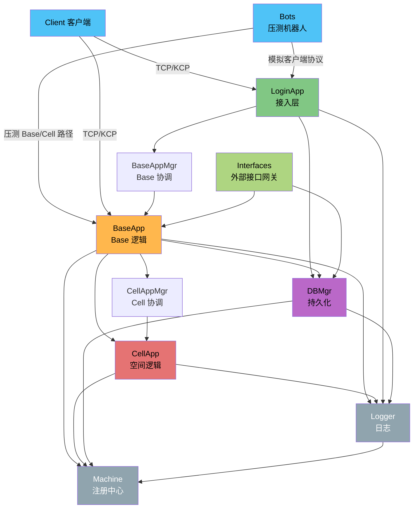
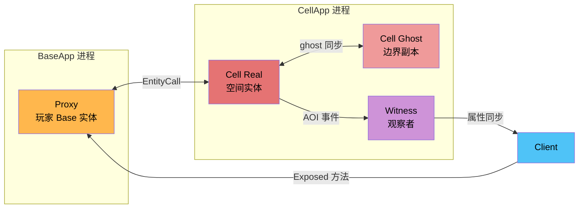
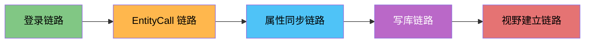
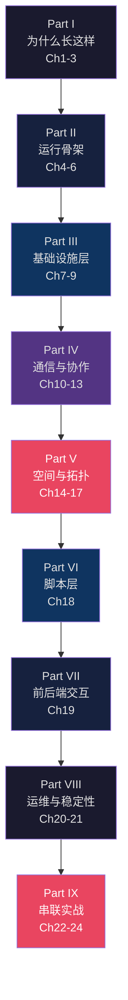

> 这是本站唯一的源码学习主线。建议先按章节顺序读完整本书，再回到 `architecture` 或 `api` 做专题回查。

> 入口关系：这里是主首页；[详细目录](./table-of-contents.md) 用来按 Part 浏览；3 个附录放在正文之后，作为查表和延伸阅读。

## 系统架构总览

上图现在明确区分了两层：

- `LoginApp / BaseApp / CellApp / DBMgr` 是玩家业务主线。
- `BaseAppMgr / CellAppMgr / Machine / Logger / Interfaces / Bots` 是调度、注册、日志、外部接入与压测辅助进程。

其中 `Client → BaseApp` 这条线表示两种情况：

- 首次登录时，客户端先连 `LoginApp`，拿到目标 `BaseApp` 地址后再连过去。
- 重连或已有会话恢复时，客户端会直接向目标 `BaseApp` 发 `loginBaseapp / reloginBaseapp`。

## 实体模型

## 五条实战走读链路

## 推荐阅读路径

