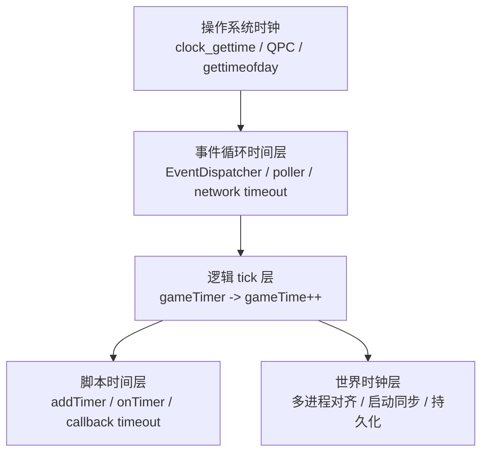
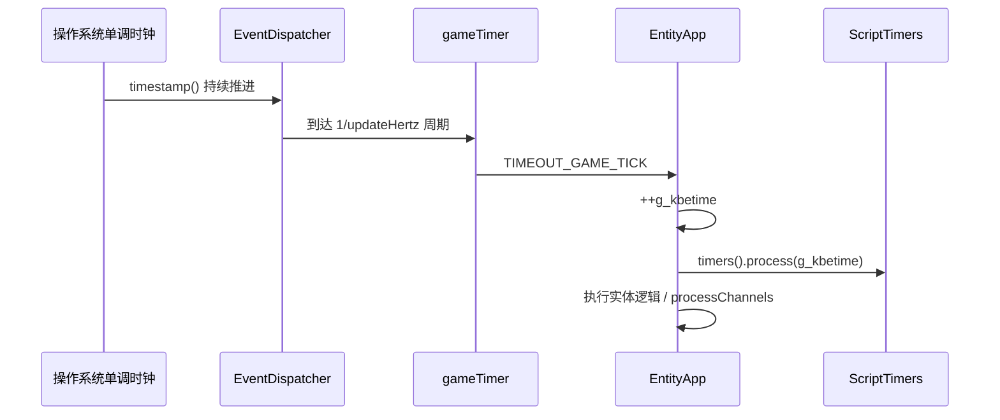
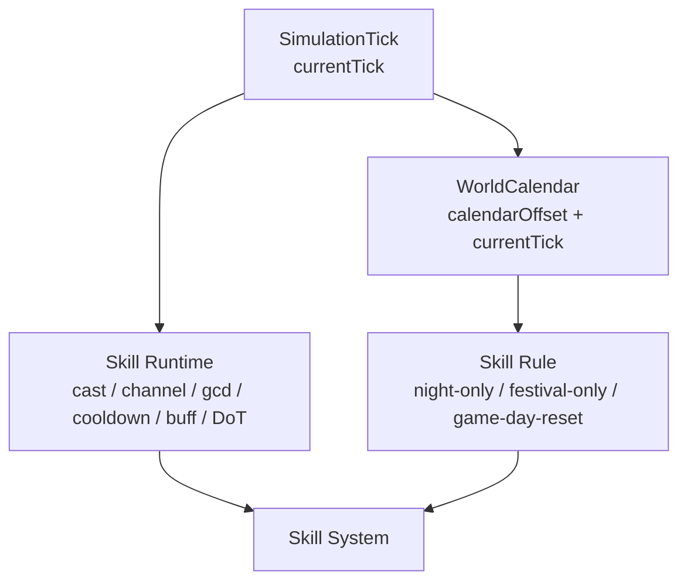
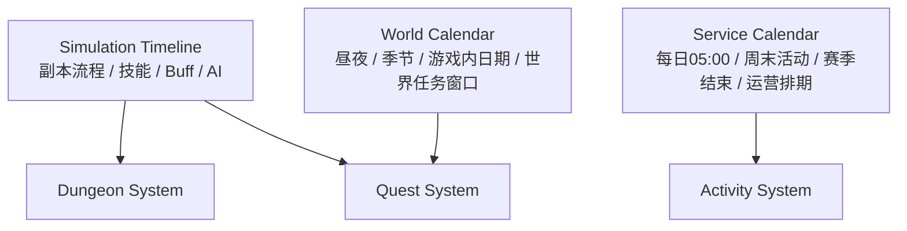
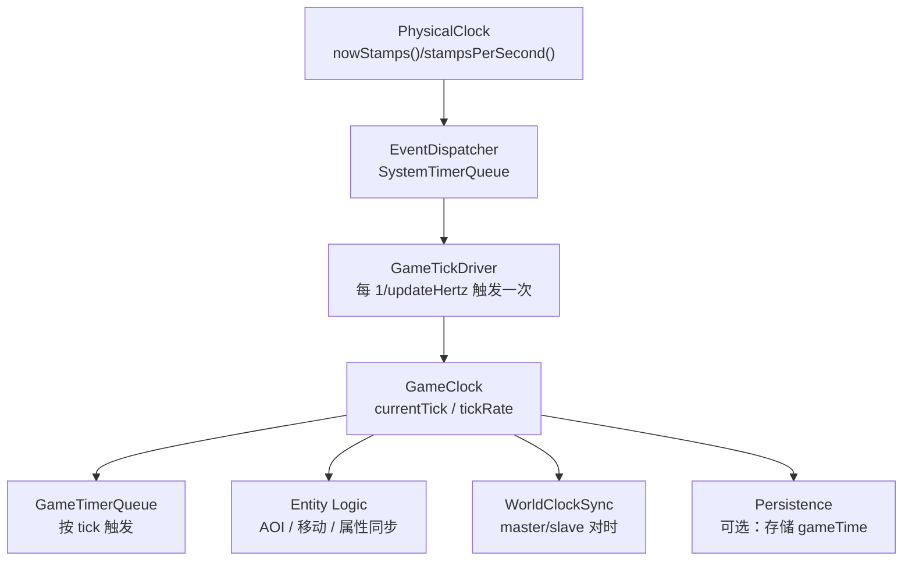
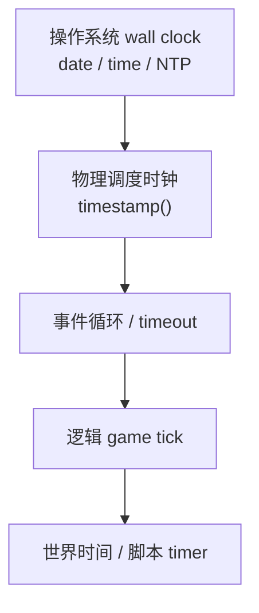
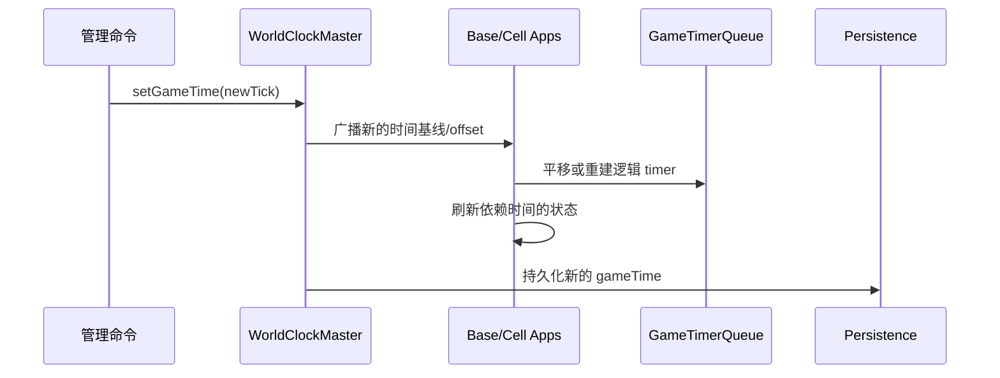
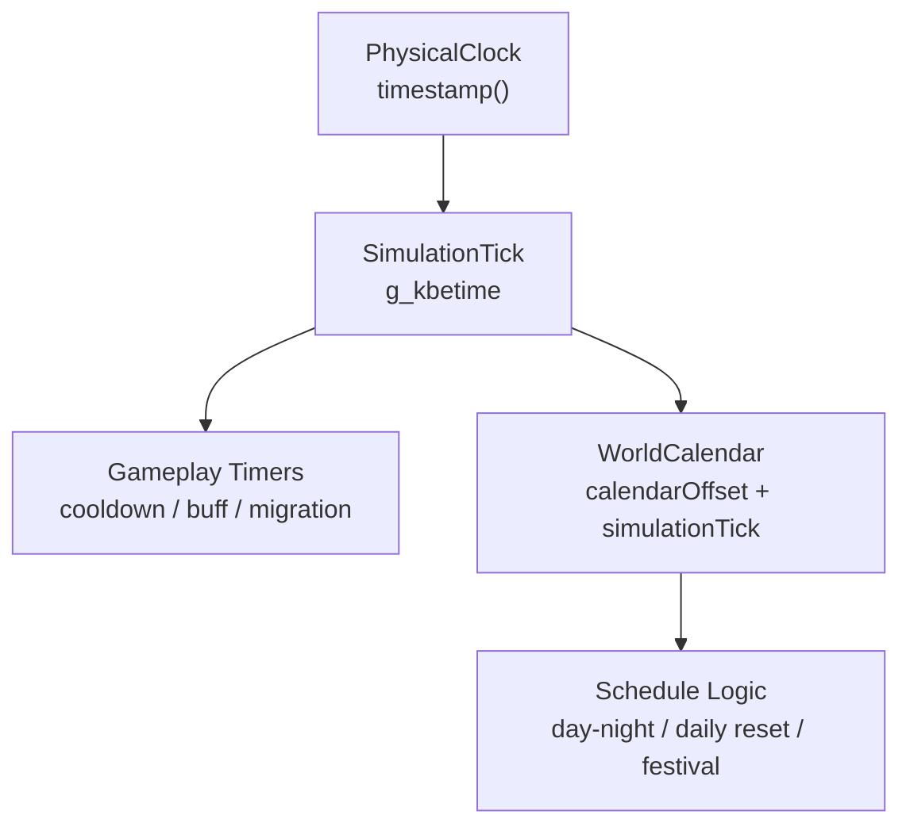
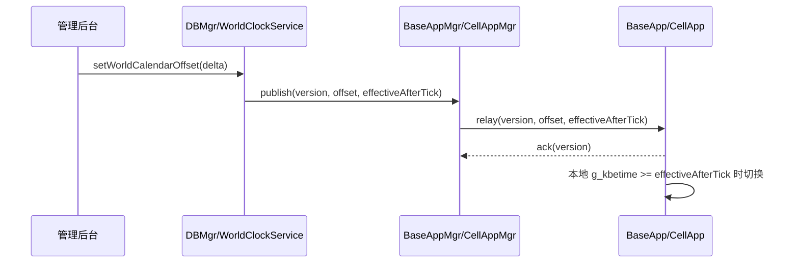

# 附录 G 服务器时间管理与世界时钟

> **核心问题**：`KBEngine` 和 `BigWorld` 的服务器时间到底是什么？它们只是直接用操作系统时间吗？为什么还要再做一层 `game tick / world clock`？如果自己要设计一套 MMO 服务器时间系统，应该怎么分层实现？

很多人第一次看源码时，会把下面三种东西混在一起：

- `time(NULL)` / `gettimeofday()` / `clock_gettime()` 这种**真实世界时间**
- `EventDispatcher` 的 timer / timeout 使用的**物理单调时间**
- `BaseApp.time()` / `CellApp.time()` / `KBEngine.time()` 这种**游戏逻辑时间**

如果这三者不分清，后面很多设计都会看起来“像是重复造轮子”：

- 为什么明明有 `timestamp()`，还要再维护 `g_kbetime`？
- 为什么脚本定时器不用 wall clock，而要换算成 tick？
- 为什么 `BigWorld` 还要搞 `TimeKeeper`，甚至做集群间的时钟同步？

本附录就是把这一套讲透。

---

## G.1 结论先行：两套引擎都不是“直接用系统时间”

先给结论：

- `KBEngine` 和 `BigWorld` 都不是直接把 `time(NULL)` 暴露给游戏逻辑
- 它们都同时维护了**至少两层时间**
  - 一层给事件循环、网络超时、I/O 等基础设施使用
  - 一层给实体逻辑、脚本定时器、AOI、同步协议使用
- `BigWorld` 比 `KBEngine` 更进一步：它把“逻辑时间”做成了**跨进程同步的世界时钟**

可以先建立下面这个心智模型：

```text
┌──────────────────────────────────────────────┐
│ 第 1 层：真实世界时间 / 单调物理时间         │
│ 例：clock_gettime(CLOCK_MONOTONIC)           │
│ 用途：事件循环、网络超时、poll/epoll 等待     │
└──────────────────────────────────────────────┘
                    ↓
┌──────────────────────────────────────────────┐
│ 第 2 层：逻辑 tick 时间                      │
│ 例：g_kbetime / ServerApp::time_             │
│ 用途：实体逻辑、脚本定时器、AOI、协议时间戳   │
└──────────────────────────────────────────────┘
                    ↓
┌──────────────────────────────────────────────┐
│ 第 3 层：世界时钟同步（BigWorld 更完整）      │
│ 用途：让多个进程的逻辑 tick 尽量保持同一节拍   │
└──────────────────────────────────────────────┘
```

---

## G.2 为什么不能直接用真实世界时间

### 真实世界时间的问题

如果游戏逻辑直接依赖 wall clock，会立刻遇到几个问题：

1. **不稳定**
   - `time(NULL)` 精度太粗
   - `gettimeofday()` 可能受系统校时影响
   - NTP 回拨、手动改系统时间都会让逻辑出现跳变

2. **不可控**
   - 逻辑更新应该按固定节拍推进，例如 10Hz
   - 真实时间是连续流逝的，但 MMO 大量逻辑是按“离散帧”思考的

3. **难以跨进程对齐**
   - 即便每个进程都用本机 wall clock，它们的相位、漂移、调度延迟也不一致
   - “这个 tick 的世界状态”很难定义

4. **脚本语义不稳定**
   - 如果脚本 `addTimer(5.0)` 直接绑定 wall clock，那么引擎卡顿、tick 堆积、回放恢复、实体迁移时都很难保证语义一致

所以 MMO 服务器通常会做一个非常关键的抽象：

- **基础设施层使用物理时间**
- **游戏逻辑层使用逻辑 tick 时间**

这不是重复造轮子，而是把“底层运行时”与“世界推进语义”分离。

---

## G.3 先分清三种时间

### G.3.1 真实世界时间

这是你日常理解的“现在几点”：

- `time(NULL)`
- `localtime()`
- `tm`
- 日志时间
- 数据库记录创建时间

它的特点是：

- 可映射到日历
- 会受时区、NTP、人工改时影响
- 适合日志和审计，不适合驱动高频游戏逻辑

### G.3.2 物理单调时间

这是引擎内部拿来做“经过了多久”的时间：

- `clock_gettime(CLOCK_MONOTONIC)`
- `QueryPerformanceCounter`
- `timestamp()`
- `stampsPerSecond()`

它的特点是：

- 不关心“现在是几点”
- 只关心“距离上次过了多久”
- 适合定时器、超时、poll 等待、性能分析

### G.3.3 逻辑世界时间

这是游戏服务器真正关心的“世界走到了第几个 tick”：

- `g_kbetime`
- `ServerApp::time_`
- `KBEngine.time()`
- `CellApp.time()`

它的特点是：

- 通常是整数 tick 计数器
- 不直接等于 wall clock
- 会驱动脚本定时器、AOI、属性同步、实体状态推进

---

## G.4 一个合格的 MMO 时间系统应该怎么分层

如果抽象成设计图，一套比较合理的服务器时间系统大致是这样：



设计原则非常直接：

- **底层必须用单调时间**
  - 否则定时器和 timeout 会受系统时钟跳变影响
- **逻辑层必须用离散 tick**
  - 否则“同一 tick 内”的顺序边界会变得模糊
- **跨进程集群最好再加世界时钟同步**
  - 否则每个进程都只是“本地看起来 10Hz”，但它们并不真的同拍

---

## G.5 KBEngine：物理时间 + 本地逻辑 tick

先看 `KBEngine`。

### G.5.1 底层物理时间：`timestamp()`

`KBEngine` 的底层时间抽象在 [timestamp.h](/D:/workspaces/kbengine/kbe/src/lib/common/timestamp.h#L64)：

- Unix 下支持 `clock_gettime(CLOCK_MONOTONIC)`、`gettimeofday()`、`RDTSC`
- 通过 `timestamp()` 返回一个“stamp”
- 通过 `stampsPerSecond()` / `stampsPerSecondD()` 把 stamp 转成秒

这说明引擎基础设施并不直接用 `time(NULL)` 驱动超时，而是优先使用更适合“测经过时间”的时间源。

### G.5.2 事件循环时间：`EventDispatcher`

`EventDispatcher` 的系统 timer 走的是物理时间，不是游戏 tick 时间：

- `addTimerCommon()` 会把微秒换算成 stamps，然后用 `timestamp() + interval` 注册到底层队列
- `processTimers()` 每轮拿 `timestamp()` 驱动到期判断

关键位置：

- [event_dispatcher.cpp:85](/D:/workspaces/kbengine/kbe/src/lib/network/event_dispatcher.cpp#L85)
- [event_dispatcher.cpp:151](/D:/workspaces/kbengine/kbe/src/lib/network/event_dispatcher.cpp#L151)
- [event_dispatcher.cpp:177](/D:/workspaces/kbengine/kbe/src/lib/network/event_dispatcher.cpp#L177)

对应关系可以画成这样：

```text
timestamp()
  -> EventDispatcher.addTimer()
  -> Timers64(绝对到期时间)
  -> process(timestamp())
  -> 触发网络/系统层 timeout
```

这层主要负责：

- 网络 inactivity timeout
- HTTP 请求 timeout
- KCP update timer
- 组件存活检查
- 主循环等待时长计算

换句话说，它是**运行时调度时间**，不是**世界逻辑时间**。

### G.5.3 逻辑世界时间：`g_kbetime`

`KBEngine` 真正的逻辑时间核心是全局 `g_kbetime`：

- 定义在 [serverapp.cpp:34](/D:/workspaces/kbengine/kbe/src/lib/server/serverapp.cpp#L34)
- `ServerApp::time()` 返回它，[serverapp.h:84](/D:/workspaces/kbengine/kbe/src/lib/server/serverapp.h#L84)
- `gameTimeInSeconds()` 只是 `g_kbetime / gameUpdateHertz`，[serverapp.cpp:239](/D:/workspaces/kbengine/kbe/src/lib/server/serverapp.cpp#L239)

这已经说明一个关键点：

- `KBEngine.time()` 语义不是“当前系统时间”
- 而是“当前世界走到第几个逻辑 tick”

### G.5.4 逻辑时间如何推进

实体型进程的推进点在 [entity_app.h:698](/D:/workspaces/kbengine/kbe/src/lib/server/entity_app.h#L698)：

```cpp
void EntityApp<E>::handleGameTick()
{
    ++g_kbetime;
    threadPool_.onMainThreadTick();
    handleTimers();
    networkInterface().processChannels(...);
}
```

也就是说：

1. 事件循环底层 timer 到点
2. 触发 `TIMEOUT_GAME_TICK`
3. 进入 `handleGameTick()`
4. `g_kbetime` 加一
5. 处理脚本 timer、实体逻辑、消息队列

这就是非常典型的“**物理时间触发离散世界帧**”。

图示如下：



### G.5.5 脚本定时器为什么也用 tick

`KBEngine` 的脚本定时器在 [script_timers.cpp:40](/D:/workspaces/kbengine/kbe/src/lib/server/script_timers.cpp#L40)：

```cpp
int initialTicks = GameTime( g_pApp->time() + initialOffset * hertz );
TimerHandle timerHandle = g_pApp->timers().add(
        initialTicks, repeatTicks, ... );
```

它不是“5 秒后按 wall clock 回调”，而是：

- 先取当前逻辑时间 `g_pApp->time()`
- 再把 `seconds * hertz` 转成 tick
- 最后把 timer 注册到脚本时间队列

所以 `addTimer(5.0)` 的真实含义更接近：

```text
在当前世界时间 + 5 秒对应的 tick 处触发
```

这套设计的价值是：

1. **和实体逻辑统一**
   - timer 在 tick 边界触发，不会插进半个逻辑帧中间

2. **和迁移/恢复统一**
   - 只要序列化剩余 tick，就能在别的进程重建

3. **和调试统计统一**
   - 脚本定时器、AOI、属性同步都在同一时间域

### G.5.6 `KBEngine.time()` 暴露给脚本的是什么

`BaseApp` 和 `CellApp` 的脚本模块都注册了 `time` 方法：

- [baseapp.cpp:430](/D:/workspaces/kbengine/kbe/src/server/baseapp/baseapp.cpp#L430)
- [baseapp.cpp:504](/D:/workspaces/kbengine/kbe/src/server/baseapp/baseapp.cpp#L504)
- [cellapp.cpp:172](/D:/workspaces/kbengine/kbe/src/server/cellapp/cellapp.cpp#L172)
- [cellapp.cpp:225](/D:/workspaces/kbengine/kbe/src/server/cellapp/cellapp.cpp#L225)

返回的都是 `Baseapp::getSingleton().time()` / `Cellapp::getSingleton().time()`。

所以脚本里的：

```python
KBEngine.time()
```

拿到的是：

- 当前逻辑世界 tick

不是：

- Unix 时间戳
- 北京时间
- UTC 秒数

### G.5.7 `KBEngine` 有没有“世界时钟同步”

有，但比较轻。

启动时，`DBMgr` 会把当前 `g_kbetime` 随初始化消息发给 `BaseApp/CellApp`：

- [sync_app_datas_handler.cpp:126](/D:/workspaces/kbengine/kbe/src/server/dbmgr/sync_app_datas_handler.cpp#L126)
- [entity_app.h:1230](/D:/workspaces/kbengine/kbe/src/lib/server/entity_app.h#L1230)
- [entity_app.h:1247](/D:/workspaces/kbengine/kbe/src/lib/server/entity_app.h#L1247)

也就是说，`KBEngine` 至少保证：

- 新起来的实体进程不会从 0 tick 开始乱跑
- 它会从当前集群已知的逻辑时间点起步

但从现有源码看，没有看到 `BigWorld::TimeKeeper` 那种：

- 运行期主从对时
- 测 RTT
- 动态调节 tick interval
- 长期漂移纠偏

所以 `KBEngine` 更接近：

```text
启动时对齐一次
运行时各进程靠各自本地 gameTimer 按 updateHertz 推进
```

### G.5.8 `KBEngine` 的设计取舍是什么

优点：

- 简单
- 调试成本低
- 脚本层容易理解
- 不需要额外的时钟同步协议

代价：

- 多进程之间更偏“近似同拍”，不是严格对拍
- 长时间运行后，各进程 tick 相位可能存在细微差异
- 更像“每个进程各自维护的逻辑时钟”，而不是“强语义的集群世界时钟”

---

## G.6 BigWorld：物理时间 + 逻辑 tick + 集群世界时钟

`BigWorld` 的分层和 `KBEngine` 类似，但明显更完整。

### G.6.1 基础逻辑时间：`ServerApp::time_`

`BigWorld` 的核心逻辑时间在 `ServerApp::time_`：

- 定义与访问在 [server_app.hpp](/D:/workspaces/kbengine/BigWorld-Engine-14.4.1/programming/bigworld/lib/server/server_app.hpp)
- 推进逻辑在 [server_app.cpp:311](/D:/workspaces/kbengine/BigWorld-Engine-14.4.1/programming/bigworld/lib/server/server_app.cpp#L311)

`advanceTime()` 的关键步骤是：

1. 统计上一个 tick 间隔
2. `onEndOfTick()`
3. `++time_`
4. `onStartOfTick()`
5. `callUpdatables()`
6. `onTickProcessingComplete()`

这说明 `BigWorld` 从抽象层面就把“时间推进”做成了显式生命周期，而不是只在某个 `handleTimeout` 里顺手加一。

### G.6.2 `EntityApp` 的脚本时间队列

`BigWorld` 的 `EntityApp` 有一个专门的 `EntityAppTimeQueue`：

- [entity_app.hpp](/D:/workspaces/kbengine/BigWorld-Engine-14.4.1/programming/bigworld/lib/server/entity_app.hpp)
- [entity_app.cpp](/D:/workspaces/kbengine/BigWorld-Engine-14.4.1/programming/bigworld/lib/server/entity_app.cpp)

几个关键点：

1. `timeQueue().process( time_ )`
   - 说明脚本 timer 直接绑定逻辑 game time

2. `onSetStartTime(oldTime, newTime)` 时会 `adjustBy(newTime - oldTime)`
   - 说明如果世界时钟被调整，已存在的 timer 也会整体平移

这点很重要。它意味着 `BigWorld` 不是“把逻辑时间塞进一堆散落逻辑里”，而是让 timer queue 明确成为世界时钟的下游。

### G.6.3 `TimeKeeper`：BigWorld 的关键差异

真正拉开差距的是 `TimeKeeper`：

- 类型定义在 [time_keeper.hpp:13](/D:/workspaces/kbengine/BigWorld-Engine-14.4.1/programming/bigworld/lib/server/time_keeper.hpp#L13)
- 构造和核心逻辑在 [time_keeper.cpp:24](/D:/workspaces/kbengine/BigWorld-Engine-14.4.1/programming/bigworld/lib/server/time_keeper.cpp#L24)

`TimeKeeper` 干的事可以概括成一句：

> 用物理单调时间估算“当前世界时间读数”，再通过和 master 的读数比较，动态调节本地 tick timer 的间隔，让整个集群尽量同拍。

关键方法：

- `readingNow()`：[time_keeper.cpp:240](/D:/workspaces/kbengine/BigWorld-Engine-14.4.1/programming/bigworld/lib/server/time_keeper.cpp#L240)
  - 不是直接返回整数 tick
  - 而是结合“下一次 tick 送达时间”和当前 `timestamp()` 计算一个连续读数

- `synchroniseWithMaster()`：[time_keeper.cpp:283](/D:/workspaces/kbengine/BigWorld-Engine-14.4.1/programming/bigworld/lib/server/time_keeper.cpp#L283)
  - 发请求向 master 询问当前世界时间读数

- `inputMasterReading()`：[time_keeper.cpp:110](/D:/workspaces/kbengine/BigWorld-Engine-14.4.1/programming/bigworld/lib/server/time_keeper.cpp#L110)
  - 收到 master 读数后，根据 RTT 估算偏移
  - 如果本地跑快了，就把 tick interval 稍微拉长
  - 如果本地跑慢了，就把 tick interval 稍微缩短

这已经是“逻辑时钟同步器”，不是普通 timer 工具了。

### G.6.4 谁是 master，谁是 slave

从源码看：

- `CellAppMgr` 创建的是 master `TimeKeeper`
  - [cellappmgr.cpp:1781](/D:/workspaces/kbengine/BigWorld-Engine-14.4.1/programming/bigworld/server/cellappmgr/cellappmgr.cpp#L1781)

- `BaseApp`、`CellApp`、`BaseAppMgr` 创建的是指向 `CellAppMgr` 的 slave `TimeKeeper`
  - [baseapp.cpp:2049](/D:/workspaces/kbengine/BigWorld-Engine-14.4.1/programming/bigworld/server/baseapp/baseapp.cpp#L2049)
  - [cellapp.cpp:816](/D:/workspaces/kbengine/BigWorld-Engine-14.4.1/programming/bigworld/server/cellapp/cellapp.cpp#L816)
  - [baseappmgr.cpp:2469](/D:/workspaces/kbengine/BigWorld-Engine-14.4.1/programming/bigworld/server/baseappmgr/baseappmgr.cpp#L2469)

这个设计背后的思路非常清楚：

- 世界里最需要“统一空间节拍”的是 `Cell` 侧
- 因此 `CellAppMgr` 作为空间调度中枢，天然适合成为世界时钟主参考

### G.6.5 启动同步与运行期同步

`BigWorld` 的世界时间同步不是只有一种方式，而是两段式：

#### 启动同步

- `BaseApp` / `CellApp` 启动时先接收当前 `gameTime`
- 然后 `setStartTime(initData.time)` 或 `setGameTime(...)`

关键位置：

- [baseapp.cpp:759](/D:/workspaces/kbengine/BigWorld-Engine-14.4.1/programming/bigworld/server/baseapp/baseapp.cpp#L759)
- [cellapp.cpp:674](/D:/workspaces/kbengine/BigWorld-Engine-14.4.1/programming/bigworld/server/cellapp/cellapp.cpp#L674)
- [cellapp.cpp:1603](/D:/workspaces/kbengine/BigWorld-Engine-14.4.1/programming/bigworld/server/cellapp/cellapp.cpp#L1603)
- [cellapps.cpp:540](/D:/workspaces/kbengine/BigWorld-Engine-14.4.1/programming/bigworld/server/cellappmgr/cellapps.cpp#L540)

#### 运行期同步

- 周期性向 master 发 `gameTimeReading`
- 根据偏移微调本地 tick interval

这一层是 `KBEngine` 当前没看到的。

### G.6.6 世界时间持久化

`BigWorld` 甚至会把 game time 写入 DB：

- `CellAppMgr::writeGameTimeToDB()`：[cellappmgr.cpp:2492](/D:/workspaces/kbengine/BigWorld-Engine-14.4.1/programming/bigworld/server/cellappmgr/cellappmgr.cpp#L2492)
- `DBApp::writeGameTime()`：[dbapp.cpp:2732](/D:/workspaces/kbengine/BigWorld-Engine-14.4.1/programming/bigworld/server/dbapp/dbapp.cpp#L2732)

这意味着它把“世界时钟”当成了需要恢复和延续的系统状态，而不是单纯的运行期计数器。

### G.6.7 BigWorld 的设计取舍是什么

优点：

- 多进程更容易保持统一节拍
- 定时器、controller、实体迁移与世界时钟语义更一致
- 容错、恢复、录制/回放、DB 持久化更容易闭环

代价：

- 实现复杂度更高
- 时钟协议和漂移修正更难调
- 需要维护 master/slave 同步链路

---

## G.7 两套系统的核心差异

### 一张总对比表

| 维度 | KBEngine | BigWorld |
|------|----------|----------|
| 物理时间基座 | `timestamp()` / `stampsPerSecond()` | 同样有物理 stamp 与 `EventDispatcher` |
| 逻辑时间表示 | `g_kbetime` | `ServerApp::time_` |
| 逻辑时间推进 | 本地 `gameTimer` 触发 `++g_kbetime` | `advanceTime()` 驱动 `++time_` |
| 脚本定时器 | tick 域 `ScriptTimers` | tick 域 `ScriptTimeQueue` / `TimerController` |
| 启动时钟对齐 | 有，`DBMgr` 下发当前 `gametime` | 有，mgr/initData 下发 `gameTime` |
| 运行期跨进程纠偏 | 源码中未见明显统一纠偏层 | 有 `TimeKeeper` |
| 世界时间持久化 | 当前主链未见完整持久化链路 | 有 `writeGameTimeToDB()` |
| 整体风格 | 本地逻辑 tick | 集群世界时钟 |

### 一句话理解

- `KBEngine`：**逻辑 tick 是一等公民，但世界时钟更偏轻量化**
- `BigWorld`：**逻辑 tick 不只是本地计数器，而是整个集群共享的世界节拍**

---

## G.8 为什么游戏逻辑一定更适合 tick，而不是 wall clock

这一点值得单独强调。

假设你在 `CellApp` 里做移动和 AOI：

- 速度单位：米/秒
- 更新频率：10Hz
- 每 tick 位移：`velocity / hertz`

这时你真正想要的不是“北京时间 13:04:21.315 到了”，而是：

- “第 123456 个逻辑帧到了”
- “这一帧里我该处理移动、视野、属性同步和脚本 timer”

这是一个**确定性优先**的问题，而不是**真实时间优先**的问题。

如果逻辑直接绑定 wall clock，会出现一堆麻烦：

- 同一帧里事件边界不清晰
- 多进程更难说“谁先谁后”
- 脚本 timer 难以迁移
- 回放系统难以做 tick 对齐

所以 MMO 服务器更自然的设计是：

```text
真实时间负责“多久之后该唤醒一次”
逻辑 tick 负责“世界推进到哪一帧”
```

### G.8.1 技能时间和世界时钟，到底是什么关系

这个补充是有必要的，而且很重要。

因为“技能时间”表面上也叫时间，但它和“世界时钟”并不是一类语义。

很多人第一次设计战斗系统时，容易把下面几件事混在一起：

- 技能冷却 `30` 秒
- 技能吟唱 `2` 秒
- `DoT` 每 `1` 秒跳一次
- 技能只能在夜晚释放
- 技能次数按游戏内次日刷新
- 技能商店按服务器每天 `05:00` 重置

它们都和“时间”有关，但实际上分属不同层次：

| 时间语义 | 典型例子 | 应绑定哪一层 | 原因 |
| --- | --- | --- | --- |
| 技能运行时间 | 前摇、后摇、吟唱、引导、公共 CD、技能 CD、buff 持续、`DoT/HoT` 跳点 | `Simulation tick` / `GameTimerQueue` | 需要确定性、可回放、可迁移，不能因为调系统时间或改昼夜就跳变 |
| 技能可用规则时间 | 仅夜晚可释放、仅节日开放、按游戏内日历刷新次数 | `World calendar` / 世界时钟 | 这是游戏内日历语义，和“世界里现在是什么时段”相关 |
| 现实世界业务时间 | 封禁到明天 8 点、邮件 7 天过期、支付超时 15 分钟、按服务器每天 `05:00` 重置 | `Wall clock` / 系统 timer | 这是现实服务日历，不属于战斗模拟链 |

所以技能系统通常不是“只读一种时间”，而是同时读多种时间语义：

- 用 `simulation tick` 推进技能本身
- 用 `world calendar` 判断游戏内规则是否开放
- 用 `wall clock` 处理现实服务日历规则

可以把它理解成下面这张关系图：



这张图表达的是：

- 技能**运行过程**应该挂在 `tick` 域
- 技能**开放条件**可以挂在世界日历域

这是一个非常关键的边界。

### G.8.2 一个完整例子：夜晚限定技能

假设有一个技能 `MoonStrike`，规则如下：

- 只能在夜晚释放
- 吟唱 `2` 秒
- 冷却 `30` 秒
- 命中后附加一个 `10` 秒灼烧
- 灼烧每 `1` 秒结算一次

如果服务器 `updateHertz = 10`，那么这个技能的时间数据应该写成：

```text
castFinishTick   = nowTick + 2   * 10 = nowTick + 20
cooldownEndTick  = nowTick + 30  * 10 = nowTick + 300
burnEndTick      = hitTick + 10  * 10 = hitTick + 100
burnIntervalTick = 1 * 10 = 10
```

而不是写成：

```text
castFinishUnixTime  = now + 2 seconds
cooldownUnixTime    = now + 30 seconds
burnNextUnixTime    = now + 1 second
```

技能释放判断也应该拆成两部分：

```cpp
bool canCastMoonStrike(const SkillState & state,
                       GAME_TIME nowTick,
                       int64 worldCalendarTick)
{
    return isNight(worldCalendarTick) &&
           nowTick >= state.cooldownEndTick &&
           !state.isCasting &&
           !state.isSilenced;
}
```

这里有个非常关键的工程结论：

- `isNight(worldCalendarTick)` 属于**世界时钟判断**
- `cooldownEndTick` / `castFinishTick` / `burnEndTick` 属于**技能运行时间**

两者不能混用。

#### 如果管理员把世界时间拨快 3 小时，会发生什么

假设管理员调整的是 `WorldCalendar.offset`，而不是 `g_kbetime`。

那么结果应该是：

- `MoonStrike` 是否“当前允许释放”可能立刻变化
- 如果夜晚到了，技能现在可能可以按规则释放
- 但一个已经在冷却中的 `MoonStrike`，**不应该因此提前结束 CD**
- 一个已经挂上的 `10` 秒灼烧，**也不应该因此瞬间结算完**

也就是说：

```text
世界时钟改变 -> 改变技能规则
simulation tick 推进 -> 推进技能运行
```

这是技能系统和世界时钟最合理的关系。

#### 哪些技能效果应该看世界时钟，哪些不该看

推荐这样划分：

- 应看世界时钟：
  - 夜晚增伤
  - 白天禁用
  - 节日限定技能
  - 游戏内每日技能次数刷新
- 不应看世界时钟：
  - 技能 CD
  - 公共 CD
  - 吟唱/引导时长
  - 控制效果持续时间
  - `DoT/HoT` 跳点
  - 子弹/投射物飞行时间

如果把后者也绑定到世界时钟，会出现非常反直觉的问题：

- 调整一次昼夜
- 所有战斗中的技能时序全部被打乱

这通常是错误设计。

#### 进一步落地时，最好给技能系统一个统一的时间视图

例如：

```cpp
struct SkillTimeContext
{
    GAME_TIME simulationTick;
    int64 worldCalendarTick;
};
```

然后约定：

- 技能状态机只存 `simulationTick` 域的 deadline
- 技能规则判断按需读取 `worldCalendarTick`

这样接口职责会非常清晰：

- `state.cooldownEndTick` 是模拟时间
- `isNight(worldCalendarTick)` 是世界日历判断

从长期维护看，这种分层比“所有东西都叫 time”要稳得多。

### G.8.3 任务、副本、活动时间和世界时钟是什么关系

这部分和技能系统非常像，本质上也是在回答一个问题：

> 某个业务里的“时间”，到底是在描述模拟推进，还是在描述世界日历，还是在描述现实服务日历？

如果这三类时间不拆开，任务系统和活动系统最后一定会变得很难维护。

可以先看总分类：

| 业务对象 | 典型时间语义 | 更适合绑定哪一层 | 说明 |
| --- | --- | --- | --- |
| 副本内战斗流程 | 波次间隔、刷怪延迟、Boss 狂暴倒计时、关门倒计时、结算延迟 | `Simulation tick` | 这是实例内运行时语义，需要稳定、可同步、可重放 |
| 游戏内世界任务 | 仅夜晚可接、仅雨天出现、按游戏内次日刷新 | `World calendar` | 这是游戏世界语义，和“世界里现在是什么时段/日期”相关 |
| 运营活动与服务日历 | 每天 `05:00` 重置、周末开放、赛季截止到真实日期 | `Wall clock` | 这是现实运营语义，应和服务器现实日历一致 |

最容易犯的错误是把它们都写成“某个 time 字段”，然后：

- 副本倒计时跟着每日重置一起跳
- 调一次昼夜，副本 Boss 狂暴计时也变了
- 只是服务器跨天，游戏世界里的昼夜和任务阶段也被硬切

这些通常都不是你想要的结果。

#### 副本时间：本质上是 simulation timeline

副本系统里的大多数时间，应该和技能 CD 属于同一类：

- 副本开始后 `30` 秒刷第一波怪
- 第 `3` 波结束后 `10` 秒刷 Boss
- Boss 在进入战斗后 `180` 秒狂暴
- 玩家全灭后 `5` 秒结算失败

这些时间都不应该看：

- 当前是不是夜晚
- 今天是不是周末
- 服务器现实时间几点了

它们描述的是**实例内部流程推进**，因此最适合直接绑定到副本自己的模拟 tick 时间线：

```cpp
struct DungeonTimeline
{
    GAME_TIME instanceStartTick;
    GAME_TIME nextWaveTick;
    GAME_TIME bossEnrageTick;
    GAME_TIME failSettleTick;
};
```

这里的核心原则和技能系统完全一样：

- 副本流程用 `simulation tick`
- 世界日历只能影响“能不能进入副本”或“副本皮肤/规则”
- 不应该直接影响已经在运行中的副本计时

#### 世界任务时间：本质上是 game-world calendar

有一类任务，本来就是围绕游戏世界时段设计的，例如：

- 只有夜晚 NPC 才出现
- 只有满月时才能接隐藏任务
- 雨天刷新特殊采集点
- 游戏内每过一天，世界委托刷新一次

这类任务如果不用 `world calendar`，反而会很别扭，因为它们说的不是现实世界时间，而是“游戏世界现在是什么状态”。

这时更合理的判断方式是：

```cpp
bool canAcceptQuest(const QuestDef & def,
                    int64 worldCalendarTick,
                    GAME_TIME nowTick)
{
    return isQuestWindowOpen(def, worldCalendarTick) &&
           !isQuestOnLocalCooldown(def, nowTick);
}
```

这里又是两层时间同时存在：

- `worldCalendarTick` 决定任务窗口是否开放
- `nowTick` 决定本地冷却、接取保护、重试间隔

两者职责不同。

#### 运营活动时间：本质上是 service calendar

再看另一类活动：

- 每天服务器 `05:00` 重置日常活跃度
- 每周六 `20:00-22:00` 开跨服战场
- 赛季在 `2026-05-01 00:00` 结束
- 限时礼包在真实世界 `7` 天后下架

这类逻辑一般不应该绑定到 `world calendar`。

因为这里表达的是：

- 运营排期
- 玩家现实预期
- 公告与活动文案里的真实日期时间

所以它们更适合走服务日历：

```text
serviceNow = real wall clock in server timezone
```

否则会出现严重的语义错位：

- 你只是把游戏世界从白天切到夜晚
- 结果跨服战场也被错误提前开放了

#### 最稳的设计：任务/副本/活动分三条时间线

推荐直接把系统设计成三条明确时间线：



这张图背后的建议很简单：

- `Dungeon System` 主要依赖 `Simulation Timeline`
- `Quest System` 往往同时依赖 `Simulation Timeline` 和 `World Calendar`
- `Activity System` 主要依赖 `Service Calendar`

这比“所有业务统一读一个 time()”健壮得多。

#### 一个容易落地的接口设计

如果要把这套理念落到代码里，可以给上层业务一个统一但分域的时间上下文：

```cpp
struct GameplayTimeContext
{
    GAME_TIME simulationTick;   // 副本流程、技能、Buff、AI
    int64 worldCalendarTick;    // 昼夜、季节、游戏内日期
    int64 serviceUnixSeconds;   // 运营活动、每日05:00、赛季结束
};
```

然后约束业务读取方式：

- 副本/Boss/战斗状态机只能存 `simulationTick` deadline
- 世界任务窗口读取 `worldCalendarTick`
- 运营活动、赛季和真实跨天重置读取 `serviceUnixSeconds`

如果一个系统同时需要两种时间，也必须在接口层显式写出来，而不是偷偷混用。

#### 一句话总结这块关系

任务、副本、活动并不是都“跟世界时钟有关”。

更准确的说法是：

- 副本流程主要跟**模拟时间**有关
- 世界任务主要跟**游戏内日历**有关
- 运营活动主要跟**现实服务日历**有关

把这三者拆开，时间系统才会长期稳定。

### G.8.4 Python 脚本层的时间分层：为什么 `time.time = kbe_time` 风格不好

这一点值得单独讲，因为很多 `KBEngine` 项目最终的问题，不是在 C++ 内核层，而是在 Python 业务层把时间语义混脏了。

先说一个关键事实：

- `KBEngine` 的网络循环、`EventDispatcher`、底层 timeout、`timestamp()` 这些核心运行时，大多在 C++ 里实现
- Python 层就算做了 `time.time = kbe_time` 这样的 monkey patch，也**不会直接改掉 C++ 内核里的物理时间实现**

也就是说：

- 它不会直接把底层网络调度“整体改坏”
- 真正会受影响的，主要是 **Python 脚本层的时间语义**

所以问题的重点不是“引擎内核会不会炸”，而是：

> 你是否把 Python 层里原本表示“真实 Unix 时间戳”的接口，偷偷改成了“游戏逻辑时间”。

这就是为什么这种风格通常不推荐。

#### 先明确：游戏里至少有四层时间

到了脚本层，时间最好明确拆成下面四层：

| 时间层 | 典型来源 | 适合做什么 | 不适合做什么 |
| --- | --- | --- | --- |
| 物理单调时间 | C++ `timestamp()` / `EventDispatcher` | 底层 timeout、I/O、调度、性能计时 | 直接暴露给业务脚本做游戏语义 |
| 模拟时间 | `KBEngine.time()` / `g_kbetime` | 技能 CD、Buff、AI、任务冷却、副本流程 | 日志、邮件过期、真实跨天重置 |
| 世界日历时间 | `worldCalendarTick` 这类自定义层 | 昼夜、季节、游戏内日期、世界任务窗口 | 技能 CD、战斗持续时间 |
| 现实服务时间 | `time.time()` / Unix 时间戳 | 每天 `05:00`、活动截止、支付超时、日志审计 | 技能/副本流程的主时间轴 |

这四层里，最容易被误伤的是最后一层：

- `time.time()` 在 Python 生态里默认语义是**真实 Unix 时间戳**

如果你把它 monkey patch 成 `kbe_time`，那你改变的不是一个普通函数，而是整个脚本层对“time”的公共语义。

#### 这种写法为什么有人会用

很多项目里会看到类似：

```python
import time

def kbe_time():
    return KBEngine.time()

time.time = kbe_time
```

这么写通常是为了：

- 兼容老代码
- 让大量已有 `time.time()` 自动变成“游戏时间”
- 避免全项目重构成 `KBEngine.time()`

短期看，这种方式确实“省改动”。

但长期代价通常更大。

#### 主要弊端一：标准库语义被全局污染

在 Python 世界里，大家默认理解的是：

```python
time.time()  # Unix 时间戳秒
```

你把它改成 `kbe_time` 之后，同样这行代码在项目里就可能表示：

- 真实 Unix 时间戳
- 游戏逻辑 tick
- 游戏逻辑秒数

这会导致最典型的问题：

- 读代码时无法一眼判断“这里到底拿的是什么时间”
- 新同事会按标准 Python 语义理解，结果踩坑
- 一部分代码按真实时间写，一部分代码按虚拟时间写，名字却完全一样

这本质上是**语义污染**问题。

#### 主要弊端二：第三方库和通用脚本会被误导

很多 Python 代码天然假设 `time.time()` 是 Unix 时间戳。

一旦你全局覆盖它，下面这些逻辑都可能变得很危险：

- `datetime.fromtimestamp(time.time())`
- token / session 过期判断
- 缓存过期时间
- 任务调度器
- 审计日志
- 只想拿真实时间做打印或统计的工具脚本

也就是说，**你本来只是想让 gameplay 用虚拟时间，结果把所有通用时间 API 一起改语义了。**

#### 主要弊端三：不同导入方式下行为还可能不一致

Python 的 monkey patch 还有一个隐蔽问题：

```python
from time import time as now
import time

time.time = kbe_time
```

这时：

- `time.time()` 变了
- `now()` 不一定变

也就是说，同一个进程里，不同模块可能看到不同版本的“time”。

这种问题非常难排查，因为它不是稳定的“全局统一行为”，而是跟导入时机有关。

#### 主要弊端四：会掩盖时间分层设计本该显式暴露的边界

前面我们一直强调：

- `KBEngine.time()` 是模拟时间
- `worldCalendarTick` 是游戏内日历时间
- `time.time()` 是现实服务时间

如果你直接把：

```python
time.time = kbe_time
```

做成全局风格，那么业务层就更容易继续写出这种代码：

```python
deadline = time.time() + 30
```

表面上看很方便，但实际没人知道这里的 `30` 是：

- 30 秒真实时间
- 30 tick
- 30 秒游戏逻辑时间

这会让系统越来越难演进。

#### 你刚刚说的判断为什么成立

你前面说：

> `KBEngine` 网络部分其实是 C++ 实现的，C++ 中获取的是真实世界时钟，所以影响没有那么严重，只是这种风格真的不好。

这个判断是对的，而且应该写进结论里。

更准确地说：

- **对 C++ 内核层影响没那么严重**
  - 因为内核调度时间不靠 Python 的 `time.time()`
- **对 Python 业务层影响很严重**
  - 因为它污染了脚本层“真实时间 API”的公共语义

所以这是一个典型的：

- 不是“马上炸”
- 但会持续积累技术债

的问题。

#### 最佳实践：不要覆盖标准库时间接口，应该显式分层

更稳的做法是：

1. 保持 `time.time()` 的标准语义不变
2. 显式封装 `game_time()` / `world_calendar_time()` / `service_time()`
3. 在代码规范里明确不同场景该用哪一个

例如：

```python
import time
import KBEngine


def game_tick():
    return KBEngine.time()


def service_unix_seconds():
    return int(time.time())


def game_seconds(update_hertz):
    return KBEngine.time() / float(update_hertz)
```

如果再加上世界日历层，可以这样组织：

```python
class TimeContext:
    def __init__(self, simulation_tick, world_calendar_tick, service_unix_seconds):
        self.simulation_tick = simulation_tick
        self.world_calendar_tick = world_calendar_tick
        self.service_unix_seconds = service_unix_seconds
```

然后业务层按规则使用：

- 技能 CD / Buff / 副本流程：读 `simulation_tick`
- 昼夜 / 季节 / 游戏内每日刷新：读 `world_calendar_tick`
- 每天 `05:00` / 运营活动截止 / 邮件过期：读 `service_unix_seconds`

#### 一个更现实的折中策略

如果项目历史包袱很重，短期内确实还不能彻底清掉 `time.time = kbe_time`，那么至少应该做到：

1. 不再新增新的 monkey patch 依赖
2. 新代码禁止再把 `time.time()` 当游戏时间使用
3. 先引入显式接口：

```python
def game_time():
    return KBEngine.time()

def real_time():
    import time
    return int(time.time())
```

4. 再逐步把老逻辑从 `time.time()` 迁移到明确接口

也就是说：

- 可以接受“历史兼容”
- 但不应该继续把它当推荐风格

#### 最终建议

如果目标是“正确使用 KBEngine 的时间体系”，那么推荐约束很简单：

- `KBEngine.time()`：游戏模拟时间
- 自定义 `worldCalendarTick`：游戏内日历时间
- 标准库 `time.time()`：现实服务时间
- 不要覆盖 `time.time()` 的标准语义

一句话总结这节：

> `time.time = kbe_time` 不会轻易破坏 `KBEngine` 的 C++ 内核调度，但会污染 Python 业务层的时间语义边界；短期可作为历史兼容，长期不是好的工程风格，最佳实践是显式分层而不是 monkey patch 标准库。

---

## G.9 如果自己设计一套世界时钟，应该怎么做

下面给出一个实用的设计分层。这个设计不是照搬某个文件，而是把 `KBEngine` 和 `BigWorld` 的经验抽象出来。

### G.9.1 第一步：先分离物理时间和逻辑时间

不要一上来就把 `time(NULL)` 暴露给逻辑层。

最小抽象：

```text
PhysicalClock
  - nowStamps()
  - stampsPerSecond()

GameClock
  - currentTick
  - tickRate
  - advanceOneTick()
  - gameTimeInSeconds()
```

### G.9.2 第二步：所有逻辑 timer 全部挂到 tick 域

脚本 timer、controller、超时状态机都尽量使用：

```text
deadlineTick = currentTick + seconds * tickRate
```

而不是：

```text
deadlineUnixTime = now + 5 seconds
```

因为前者天然适合：

- 迁移
- 回放
- 序列化
- 同步分析

### G.9.3 第三步：把系统 timeout 和逻辑 timer 分开

推荐做两类 timer queue：

```text
SystemTimerQueue
  - 用物理单调时间驱动
  - 给网络、I/O、系统服务用

GameTimerQueue
  - 用 currentTick 驱动
  - 给实体、脚本、AOI、控制器用
```

如果把这两类混用，后面一定会出语义污染。

### G.9.4 第四步：集群里选一个 master world clock

如果是多进程 MMO，建议：

- 选一个调度中枢做 master，例如 `CellAppMgr`
- 其他进程只把本地 tick 当作“近似世界时钟”
- 周期性向 master 做读数同步

同步方式不需要一开始就非常复杂，最小可以做：

1. 发送本地当前读数
2. master 返回它的读数
3. 估算 RTT
4. 得到 offset
5. 用微调 interval 的方式慢慢追平

重点是：

- **不要粗暴跳 tick**
- **优先用微调 tick 间隔的方式纠偏**

否则会打乱逻辑帧语义。

### G.9.5 第五步：决定是否持久化世界时钟

如果系统有这些能力：

- 世界恢复
- 跨进程恢复
- replay / recording
- 数据库恢复后继续推进

那么 game time 通常值得持久化。

如果只是单区、轻量、简化实现：

- 启动时统一设为 0
- 或仅运行时广播

也能接受，但要明确这是能力取舍。

---

## G.10 一套可落地的实现框架

下面是把上面设计翻译成工程结构后的样子。



如果换成伪代码，可以写成这样：

```python
class GameClock:
    def __init__(self, tick_rate):
        self.tick_rate = tick_rate
        self.current_tick = 0

    def advance(self):
        self.current_tick += 1

    def now_seconds(self):
        return self.current_tick / self.tick_rate


class World:
    def __init__(self, tick_rate):
        self.clock = GameClock(tick_rate)
        self.timers = GameTimerQueue()

    def on_game_tick(self):
        self.clock.advance()
        self.timers.process(self.clock.current_tick)
        self.process_entities()
        self.flush_updates()
```

如果再往上加集群同步：

```python
class WorldClockSync:
    def sync_with_master(self, local_reading, remote_reading, rtt):
        offset = (remote_reading + rtt / 2) - local_reading
        self.adjust_tick_interval(offset)
```

这就是 `BigWorld::TimeKeeper` 的核心思想，只是实际实现更细。

---

## G.11 如果修改系统时间，会发生什么

这个问题一定要先拆成两类：

1. 修改**操作系统时间**，例如手工改 Windows/Linux 系统日期时间，或者 NTP 校时让 wall clock 跳变。
2. 修改**引擎内部世界时间**，例如把 `gameTime` / `g_kbetime` 人工拨快、拨慢、重置。

这两件事，在 `KBEngine` 和 `BigWorld` 里不是一回事。

### G.11.1 先看结论

| 场景 | KBEngine | BigWorld |
| --- | --- | --- |
| 修改 OS 系统时间，但底层 `timestamp()` 走 `CLOCK_MONOTONIC` / `RDTSC` | 主 tick、`EventDispatcher` timeout、脚本 timer 通常**不直接跳变** | 主 tick、`TimeKeeper`、timeout 通常**不直接跳变** |
| 修改 OS 系统时间，但底层强制走 `gettimeofday()` | timeout/调度可能跳变，甚至可能倒退 | timeout/调度可能跳变，`TimeKeeper` 读数计算也会受影响 |
| 修改引擎逻辑世界时间 | 现有源码只明显看到**启动时同步**，没看到完整运行期全局校时层 | 有显式 `setStartTime()` / `setGameTime()` / `TimeKeeper` / DB 持久化体系 |
| 日志、本地时间显示、依赖 `time()`/`localtime()` 的逻辑 | 会受系统时间修改影响 | 会受系统时间修改影响 |

一句话概括：

- **改系统时间，不一定会影响世界时钟。**
- **真正决定是否受影响的，是运行时物理时间基座到底是不是 monotonic。**

### G.11.2 修改操作系统时间：影响的是 wall clock，不一定影响 tick

两套引擎都有类似的时间分层：



但这里有个关键点：

- `A -> B` 这条链**不是固定直接绑定**
- `timestamp()` 可以有不同实现

如果 `timestamp()` 走的是：

- `clock_gettime(CLOCK_MONOTONIC)`
- `QueryPerformanceCounter`
- `RDTSC`

那么修改系统 wall clock 后，`timestamp()` 一般仍然单调前进，因此：

- 事件循环不会突然整体快进或倒退
- timeout 不会因为“现在几点”被改了而全部重排
- 逻辑 tick 仍然按原来的节拍继续推进

如果 `timestamp()` 走的是：

- `gettimeofday()`

那么修改系统时间后，可能出现：

- 当前时间突然向前跳，导致 timeout 提前大量触发
- 当前时间突然向后跳，导致 timeout 延迟甚至看起来“卡住”
- 依赖“当前时间差值”的逻辑出现异常

所以核心不是“有没有改系统时间”，而是“引擎主调度链到底绑定的是哪种时间源”。

### G.11.3 KBEngine：修改系统时间时会怎样

`KBEngine` 的 `timestamp()` 支持三种来源：

- `timestamp_gettimeofday()`：[timestamp.h:52](/D:/workspaces/kbengine/kbe/src/lib/common/timestamp.h#L52)
- `timestamp_gettime()`，底层是 `CLOCK_MONOTONIC`：[timestamp.h:64](/D:/workspaces/kbengine/kbe/src/lib/common/timestamp.h#L64)
- `timestamp_rdtsc()`：[timestamp.h:34](/D:/workspaces/kbengine/kbe/src/lib/common/timestamp.h#L34)

当前这个分支还有一个很重要的实现细节：

- [timestamp.cpp:8](/D:/workspaces/kbengine/kbe/src/lib/common/timestamp.cpp#L8) 定义了 `KBE_USE_RDTSC`
- [timestamp.cpp:11](/D:/workspaces/kbengine/kbe/src/lib/common/timestamp.cpp#L11) 把 `g_timingMethod` 直接初始化成 `RDTSC_TIMING_METHOD`

这意味着在当前 fork 上，Linux 下默认主链路很可能更偏向 `RDTSC`，而不是 `gettimeofday()`。

而 `EventDispatcher` 的 timer 调度直接依赖 `timestamp()`：

- 注册 timer 时用 `timestamp() + interval`：[event_dispatcher.cpp:98](/D:/workspaces/kbengine/kbe/src/lib/network/event_dispatcher.cpp#L98)
- 处理 timer 时按 `timestamp()` 判断到期：[event_dispatcher.cpp:154](/D:/workspaces/kbengine/kbe/src/lib/network/event_dispatcher.cpp#L154)

因此：

#### 情况 A：`KBEngine` 用 `RDTSC` 或 `CLOCK_MONOTONIC`

如果你在运行中修改操作系统时间：

- `EventDispatcher` 主循环通常不会直接跳
- `gameTimer` 的节拍通常不会直接跳
- `g_kbetime` 不会因为系统日历时间被改而自动跳变
- 挂在 `g_kbetime` 上的脚本 timer 也不会自动整体漂移

因为 `g_kbetime` 是逻辑 tick：

- 全局时间变量定义在 [serverapp.cpp:34](/D:/workspaces/kbengine/kbe/src/lib/server/serverapp.cpp#L34)
- 每次 game tick 自增一次：[entity_app.h:703](/D:/workspaces/kbengine/kbe/src/lib/server/entity_app.h#L703)
- 脚本 timer 按 `g_kbetime` 处理：[serverapp.cpp:253](/D:/workspaces/kbengine/kbe/src/lib/server/serverapp.cpp#L253)

也就是说，**系统时间改了，但世界 tick 语义本身没变。**

#### 情况 B：`KBEngine` 走 `gettimeofday()` 路径

如果某个构建或改造版本让 `KBEngine` 实际走到 `gettimeofday()` 路径：

- timeout 可能提前或延后
- 某些“等 3 秒”“等 30 秒”的系统 timer 可能表现异常
- 极端情况下还可能出现时间回拨后的调度问题

源码里确实保留了 `KBE_TIMING_METHOD` 的解析逻辑：

- [timestamp.cpp:102](/D:/workspaces/kbengine/kbe/src/lib/common/timestamp.cpp#L102)

但要注意当前这个 fork 的实现细节：

- [timestamp.cpp:8](/D:/workspaces/kbengine/kbe/src/lib/common/timestamp.cpp#L8) 在 `.cpp` 内直接定义了 `KBE_USE_RDTSC`
- [timestamp.cpp:90](/D:/workspaces/kbengine/kbe/src/lib/common/timestamp.cpp#L90) 在这个分支下会直接返回 `calcStampsPerSecond_rdtsc()`

也就是说，**当前 fork 里不能简单把“设置环境变量”视为一定能切到 `gettimeofday()` 的现成能力**。

更准确的说法应是：

- 原版设计上支持 timing method 分支
- 当前 fork 默认实现固定偏向 `RDTSC`
- 除非额外改初始化逻辑或直接改源码，否则不能把 `KBE_TIMING_METHOD=gettimeofday` 当作已验证可用的运行时切换手段

#### `KBEngine` 里真正会受系统时间修改影响的部分

即使主调度不受影响，这些地方通常仍会受影响：

- 日志打印时间
- 文件时间戳
- 显式调用 `time()` / `gettimeofday()` / 本地时间格式化的代码
- 任何把“现实日期”当业务语义的逻辑

所以不能简单说“改系统时间完全没影响”，更准确的说法是：

> 如果主调度链走 monotonic / rdtsc，那么**运行节拍**影响很小；但所有 wall clock 语义仍然会变。

### G.11.4 BigWorld：修改系统时间时会怎样

`BigWorld` 也是同样的三选一设计：

- `timestamp_gettimeofday()`：[timestamp.hpp:74](/D:/workspaces/kbengine/BigWorld-Engine-14.4.1/programming/bigworld/lib/cstdmf/timestamp.hpp#L74)
- `timestamp_gettime()`，底层 `CLOCK_MONOTONIC`：[timestamp.hpp:82](/D:/workspaces/kbengine/BigWorld-Engine-14.4.1/programming/bigworld/lib/cstdmf/timestamp.hpp#L82)
- `timestamp_rdtsc()`：[timestamp.hpp:56](/D:/workspaces/kbengine/BigWorld-Engine-14.4.1/programming/bigworld/lib/cstdmf/timestamp.hpp#L56)

Linux 下默认常量是 `GET_TIME_TIMING_METHOD`：

- [timestamp.cpp:35](/D:/workspaces/kbengine/BigWorld-Engine-14.4.1/programming/bigworld/lib/cstdmf/timestamp.cpp#L35)

也就是默认更偏向 `clock_gettime(CLOCK_MONOTONIC)`，并且 `bwmachined` 会把 timing method 传给子进程：

- [linux_machine_guard.cpp:413](/D:/workspaces/kbengine/BigWorld-Engine-14.4.1/programming/bigworld/server/tools/bwmachined/linux_machine_guard.cpp#L413)

`BigWorld` 的主逻辑 tick 也是通过 `timestamp()` 驱动推进：

- `advanceTime()` 里用 `timestamp() - lastAdvanceTime_` 计算 tick period：[server_app.cpp:313](/D:/workspaces/kbengine/BigWorld-Engine-14.4.1/programming/bigworld/lib/server/server_app.cpp#L313)
- 然后 `++time_`：[server_app.cpp:324](/D:/workspaces/kbengine/BigWorld-Engine-14.4.1/programming/bigworld/lib/server/server_app.cpp#L324)

而 `TimeKeeper` 也是基于 `timestamp()` 去估算当前世界时钟读数：

- 接收 master 读数时记录 `timestamp()`：[time_keeper.cpp:114](/D:/workspaces/kbengine/BigWorld-Engine-14.4.1/programming/bigworld/lib/server/time_keeper.cpp#L114)
- `readingNow()` 里按当前 `timestamp()` 估算连续读数：[time_keeper.cpp:240](/D:/workspaces/kbengine/BigWorld-Engine-14.4.1/programming/bigworld/lib/server/time_keeper.cpp#L240)
- 周期同步 master：[time_keeper.cpp:283](/D:/workspaces/kbengine/BigWorld-Engine-14.4.1/programming/bigworld/lib/server/time_keeper.cpp#L283)

因此结论也很直接：

#### 情况 A：`BigWorld` 默认 monotonic

修改操作系统时间后：

- 主 tick 一般不会直接跳
- `TimeKeeper` 的读数一般不会直接跟着 wall clock 跳
- 世界时钟同步不会因为改了“现在几点”就整体失真

#### 情况 B：强制 `BW_TIMING_METHOD=gettimeofday`

这时 wall clock 跳变就会传导到：

- timer 调度
- tick 周期估算
- `TimeKeeper` 的 reading 计算

也就是说，`BigWorld` 也不是天然免疫，而是因为它默认更合理地选择了 monotonic 物理时钟。

### G.11.5 修改“世界时间”时，两套引擎有什么本质差异

这部分才是真正区分两套引擎设计深度的地方。

#### KBEngine：更像“本地 tick 时钟”

目前源码里能明确看到的，是启动时由 `DBMgr` 下发当前 `g_kbetime`：

- `DBMgr` 初始化完成后发送 `gametime`：[sync_app_datas_handler.cpp:126](/D:/workspaces/kbengine/kbe/src/server/dbmgr/sync_app_datas_handler.cpp#L126)
- `EntityApp` 收到后直接设置 `g_kbetime`：[entity_app.h:1247](/D:/workspaces/kbengine/kbe/src/lib/server/entity_app.h#L1247)

但从现有源码没有看到类似 `BigWorld::TimeKeeper` 这样的完整运行期全局校时层，也没看到一个通用的“运行中安全改世界时间”的框架。

这意味着如果你想在运行中直接改 `g_kbetime`：

- 不是完全不能做
- 但更像是“你自己要对整条 tick 语义负责”

需要自己额外处理的问题通常包括：

- 已注册脚本 timer 是否整体平移
- 多进程是否同步改
- 实体状态机是否允许时间突跳
- 存档与恢复是否需要带上新时间基线

#### BigWorld：显式支持 world/game time 体系

`BigWorld` 在这方面明显更完整：

- `ServerApp` 有 `setStartTime()`：[server_app.hpp:101](/D:/workspaces/kbengine/BigWorld-Engine-14.4.1/programming/bigworld/lib/server/server_app.hpp#L101)
- `CellApp` 启动时可显式 `setGameTime()`：[cellapp.cpp:1603](/D:/workspaces/kbengine/BigWorld-Engine-14.4.1/programming/bigworld/server/cellapp/cellapp.cpp#L1603)
- `BaseApp` / `CellApp` / `CellAppMgr` 都挂了 `TimeKeeper`
- `CellAppMgr` 会 `writeGameTimeToDB()` 持久化：[cellappmgr.cpp:2492](/D:/workspaces/kbengine/BigWorld-Engine-14.4.1/programming/bigworld/server/cellappmgr/cellappmgr.cpp#L2492)
- `DBApp` 最终写入数据库：[dbapp.cpp:2732](/D:/workspaces/kbengine/BigWorld-Engine-14.4.1/programming/bigworld/server/dbapp/dbapp.cpp#L2732)

所以在 `BigWorld` 里，修改世界时间更接近一个**系统级能力**：

- 可以启动时设置
- 可以在集群里传播
- 可以在运行期持续校准
- 可以落库，下次恢复接着跑

### G.11.6 工程上应该怎么设计“改时间”

如果你自己实现 MMO 服务器，建议强制分成两条操作：

#### 操作一：修改系统时间

目标：

- 只影响 wall clock 语义
- 不影响主 tick、调度器、逻辑 timer

做法：

- 主调度统一使用 monotonic clock
- 禁止核心运行时直接依赖 `gettimeofday()` 计算 timeout

#### 操作二：修改世界时间

目标：

- 显式修改逻辑时间语义
- 让 timer、状态机、跨进程同步都知道这次变更

做法：



不要把这两种操作混在一起。否则很容易出现一种危险设计：

- 运维只是想把机器时间调准
- 结果整个游戏世界跳了 3 小时

这在 MMO 里通常是不可接受的。

### G.11.7 如果要在 KBEngine 里安全实现“改世界时间”，最佳方案是什么

如果目标是给 `KBEngine` 增加“管理员可以调整世界时间”的能力，**最佳方案不是运行中直接改 `g_kbetime`**，而是：

1. 把 `g_kbetime` 固定为**模拟时间 / simulation tick**
2. 再额外引入一层**世界日历时间 / world calendar**
3. 只允许管理员调整这层“世界日历偏移量”

这是因为在现有 `KBEngine` 里，`g_kbetime` 已经被大量逻辑当成“底层模拟时钟”：

- 脚本 timer 注册时直接把当前 `time()` 换算成绝对 tick：[script_timers.cpp:54](/D:/workspaces/kbengine/kbe/src/lib/server/script_timers.cpp#L54)
- 脚本 timer 每帧按 `g_kbetime` 处理：[serverapp.cpp:253](/D:/workspaces/kbengine/kbe/src/lib/server/serverapp.cpp#L253)
- 实体位置/朝向变化时间也记录的是 `g_kbetime`：[entity.cpp:2012](/D:/workspaces/kbengine/kbe/src/server/cellapp/entity.cpp#L2012)、[entity.cpp:2059](/D:/workspaces/kbengine/kbe/src/server/cellapp/entity.cpp#L2059)

如果运行中直接把 `g_kbetime` 从 `100000` 改成 `200000`，你会立即遇到一类系统性问题：

- 已注册 timer 可能瞬间全部到期
- 冷却、buff、AOI 附加更新窗口可能整体错位
- 不同进程如果不是同一 tick 生效，会出现短时间语义不一致

所以更合理的设计是：



这张图的含义是：

- `g_kbetime` 继续负责**运行时推进**
- `WorldCalendar` 负责“今天几号、现在是白天还是黑夜、每日任务是否刷新”

以后管理员要“把世界时间拨快 3 小时”，改的是 `WorldCalendar.offset`，不是 `g_kbetime`。

#### 第一原则：不要让 gameplay timer 跟着世界日历一起跳

最好把 timer 明确分成两个域：

| 域 | 推荐用途 | 修改世界时间时怎么处理 |
| --- | --- | --- |
| `SimulationTimerQueue` | 技能 CD、buff、迁移重试、实体生命周期 | **不跳**，继续跟 `g_kbetime` 走 |
| `CalendarTimerQueue` | 每日重置、节日开启、昼夜切换、整点事件 | 跟世界日历一起重算或平移 |

这是最重要的边界。

如果不分域，你会得到一种非常糟糕的效果：

- 管理员只是想把游戏里的太阳调到傍晚
- 结果所有技能 CD 也一起快进了 3 小时

#### 第二原则：世界时间不要存成“当前绝对值”，而要存成“基线 + 偏移”

推荐的状态模型是：

```cpp
struct WorldCalendarState
{
    GAME_TIME simTick;          // 仍然使用 g_kbetime 推进
    int64 calendarOffsetTicks;  // 世界时间相对 simulation tick 的偏移
    uint64 version;             // 用于跨进程一致性
};

inline int64 worldCalendarTick(const WorldCalendarState & s)
{
    return int64(s.simTick) + s.calendarOffsetTicks;
}
```

这样做有几个直接好处：

- 逻辑上更清楚：模拟时间和日历时间没有混淆
- 持久化更简单：只要存 `calendarOffsetTicks` 和 `version`
- 调时间更安全：只改 offset，不碰底层 tick 主链
- 避免 `GAME_TIME` 作为 `uint32` 时的截断、回绕和负偏移丢失问题

如果你需要人类可读时间，还可以再封一层：

```cpp
inline double worldCalendarSeconds(const WorldCalendarState & s, double hertz)
{
    return double(worldCalendarTick(s)) / hertz;
}
```

#### 第三原则：集群里不要“谁先收到谁先改”，要做版本化发布

`KBEngine` 现状没有 `BigWorld::TimeKeeper` 那种运行期世界时钟主从校时层，所以如果你要把“改世界时间”做成正式能力，建议补一个**版本化发布协议**。

一个比较稳的设计是：

1. `DBMgr` 保存 `calendarOffsetTicks` 和 `version`
2. `DBMgr` 或独立 `WorldClockService` 作为权威源
3. `BaseAppMgr` / `CellAppMgr` 负责向各自子进程扇出
4. 所有 worker 进程只接受“带版本号”的 world clock 更新

推荐消息结构：

```cpp
struct WorldClockUpdate
{
    uint64 version;
    int64 calendarOffsetTicks;
    GAME_TIME effectiveAfterTick;
};
```

然后按“准备 -> 生效”两段做：



这里的关键点不是“协议多复杂”，而是：

- **必须有 `version`**
- **必须有延后生效点 `effectiveAfterTick`**
- **不能收到消息就立刻改本地状态**

否则不同进程会在不同 tick 切换世界日历，事件触发就会出现毛刺。

#### 第四原则：世界时间调整后，只重算“日历语义”，不要重放整条模拟链

收到 world calendar 更新后，最合理的处理通常是：

- 重新计算当前昼夜状态
- 重新判断哪些每日/每周活动窗口已进入或离开
- 重建或平移 `CalendarTimerQueue`
- 广播一个明确的 `onWorldCalendarAdjusted(oldTick, newTick, version)` 事件

但不要做这些事：

- 不要补跑所有错过的 gameplay tick
- 不要强行重放过去几小时的实体逻辑
- 不要把所有已有模拟 timer 都按新的 world tick 重算

这是因为管理员“调世界时间”通常是**业务语义操作**，不是要求服务器补做几小时真实模拟。

#### 第五原则：如果真的需要“绝对世界时间跳变”，也要做成独立能力

有些系统确实需要“把世界时间整体跳到某个绝对刻度”，比如：

- 开测试服时直接跳到夜晚
- 手工校正季节/节日阶段
- 恢复某个录制环境

这种能力也不应该直接暴露成“写 `g_kbetime`”。

更合理的接口应该像这样：

```cpp
enum class WorldClockAdjustMode
{
    AddOffset,
    SetAbsoluteCalendarTick
};

struct AdjustWorldClockRequest
{
    WorldClockAdjustMode mode;
    int64 value;
    bool rebuildCalendarTimers;
};
```

这样接口语义是可审计的，也更容易做权限控制和操作日志。

#### 一个完整例子：把世界时间拨快 3 小时，但不影响技能 CD

假设：

- `updateHertz = 10`
- 当前 `g_kbetime = 1,000,000`
- 当前 `calendarOffsetTicks = 0`

管理员想把世界时间拨快 3 小时：

```text
3 小时 = 3 * 3600 = 10800 秒
10800 秒 * 10 tick/秒 = 108000 tick
```

此时正确做法是：

1. 发布 `calendarOffsetTicks = 108000`
2. 约定在 `effectiveAfterTick = 1,000,100` 生效
3. 所有进程在本地 `g_kbetime >= 1,000,100` 时切换 offset
4. 重建“日落、每日刷新、节日窗口”这类 calendar timer
5. 技能 CD、buff timer、实体迁移 timer 完全不变

切换前后：

- `simulation tick`：`1,000,099 -> 1,000,100`
- `world calendar tick`：`1,000,099 -> 1,108,100`

也就是说：

- 世界里的“时间显示”前进了 3 小时
- 但底层模拟没有被暴力快进

这才是更适合 `KBEngine` 的做法。

---

## G.12 常见误区

### 误区一：`KBEngine.time()` 就是 Unix 时间戳

不是。

它返回的是逻辑 tick 时间，或者说世界时间读数，而不是 wall clock 秒数。

### 误区二：有了 `timestamp()` 就不需要 `gameTime`

不对。

`timestamp()` 适合运行时调度，`gameTime` 适合世界逻辑推进。两者职责不同。

### 误区三：世界时钟同步就是所有进程直接对齐系统时间

不对。

`BigWorld` 的 `TimeKeeper` 同步的是**逻辑时钟读数**，不是简单做 NTP。

### 误区四：脚本 timer 直接按 wall clock 更简单

表面简单，长期复杂。

一旦涉及：

- 实体迁移
- 进程恢复
- replay
- 世界时间调整

wall clock timer 会迅速变得难以维护。

---

## G.13 最后总结

把整件事压缩成最重要的几句话：

1. `KBEngine` 和 `BigWorld` 都不是直接用“现在几点”驱动游戏世界。
2. 它们都把**物理时间**和**逻辑时间**分层了。
3. `KBEngine` 的重点是“用本地逻辑 tick 驱动世界”。
4. `BigWorld` 更进一步，把逻辑 tick 提升成“集群级世界时钟”。
5. 真正成熟的 MMO 时间系统，不是把 wall clock 到处传，而是：

   - 用单调时间驱动运行时
   - 用逻辑 tick 驱动世界
   - 用主从同步维护集群节拍

如果只记一句：

> 游戏服务器的“世界时间”本质上不是日历时间，而是一个被物理时间驱动、又独立于物理时间语义的逻辑时钟；`BigWorld` 在这之上进一步把它做成了可同步、可持久化的集群世界时钟。
