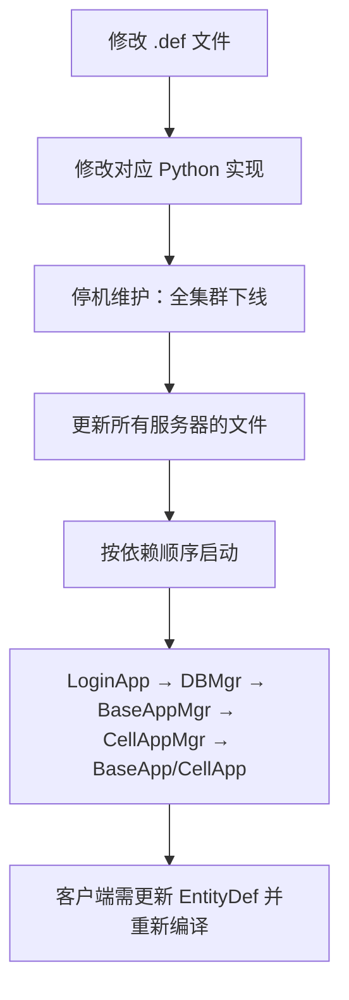

# 基本数据类型

KBEngine 的 `.def` 文件中，属性（`<Type>`）和方法参数（`<Arg>`）必须使用系统中已注册的数据类型。

## ⚠️ 重要：Type 定义的是 KBEngine 统一类型，不是数据库类型

`.def` 文件中的 `<Type>` 定义的是 **KBEngine 抽象类型**，引擎会根据用途自动映射到不同的底层表示：

```
┌─────────────────────────────────────────────────────────────┐
│                    KBEngine Type System                      │
│                                                               │
│   <Type> INT32 </Type>  <Type> STRING </Type>  <Type> ...   │
└──────────────┬──────────────────────┬───────────────────────┘
               │                      │
       ┌───────▼──────────┐    ┌─────▼──────────────┐
       │  Memory (Python) │    │ Database (MySQL)   │
       ├──────────────────┤    ├────────────────────┤
       │ INT32  → int     │    │ INT32  → INT       │
       │ STRING → str     │    │ STRING → VARCHAR   │
       │ FLOAT  → float   │    │ FLOAT  → FLOAT     │
       │ VECTOR3 → tuple  │    │ VECTOR3 → 3×FLOAT  │
       └──────────────────┘    └────────────────────┘

┌─────────────────────────────────────────────────────────────┐
│               Network (Binary Stream)                        │
│  INT32 → 4 bytes big-endian                                 │
│  STRING → length prefix + bytes                             │
│  VECTOR3 → 12 bytes (3×FLOAT)                               │
└─────────────────────────────────────────────────────────────┘
```

| KBEngine Type | Python 内存 | MySQL 数据库 | 网络传输 |
|--------------|-------------|--------------|----------|
| `INT32` | `int` | `INT` | 4 bytes |
| `INT64` | `int` | `BIGINT` | 8 bytes |
| `FLOAT` | `float` | `FLOAT` | 4 bytes |
| `DOUBLE` | `float` | `DOUBLE` | 8 bytes |
| `STRING` | `str` | `VARCHAR(N)` | 长度+字节 |
| `UNICODE` | `str` | `VARCHAR(N) UTF8` | 长度+UTF8字节 |
| `VECTOR3` | `tuple(x,y,z)` | 3 个 `FLOAT` 列 | 12 bytes |
| `BLOB` | `bytes` | `BLOB` | 长度+字节 |

**关键点**：
- **`.def` 中定义的是抽象类型**，不直接对应数据库类型
- **自动映射**：系统根据 Type 自动选择合适的数据库列类型
- **Persistent 标志控制**：只有标记 `<Persistent>true</Persistent>` 的属性才会写入数据库
- **DATABASE_LENGTH**：字符串类型可用 `<DatabaseLength>255</DatabaseLength>` 控制 VARCHAR 长度

详见：[类型系统与实体定义文件](/architecture/source-analysis/entitydef-type-system.md)

## 类型总览

| 类型 | 字节数 | 数值范围 | Python 对应 | 用途 |
|------|--------|----------|-------------|------|
| `UINT8` | 1 | 0 ~ 255 | `int` | 小范围非负整数（枚举、标志位） |
| `UINT16` | 2 | 0 ~ 65,535 | `int` | 较小非负整数（计数器、ID） |
| `UINT32` | 4 | 0 ~ 4,294,967,295 | `int` | 通用非负整数（最常用） |
| `UINT64` | 8 | 0 ~ 18,446,744,073,709,551,615 | `int` | 大整数（时间戳、大ID） |
| `INT8` | 1 | -128 ~ 127 | `int` | 小范围有符号整数 |
| `INT16` | 2 | -32,768 ~ 32,767 | `int` | 较小有符号整数 |
| `INT32` | 4 | -2,147,483,648 ~ 2,147,483,647 | `int` | **通用整数（推荐默认）** |
| `INT64` | 8 | ±9,223,372,036,854,775,807 | `int` | 大整数（时间戳、大ID） |
| `FLOAT` | 4 | ±3.4E38（7位精度） | `float` | 单精度浮点数 |
| `DOUBLE` | 8 | ±1.7E308（15位精度） | `float` | 双精度浮点数 |
| `VECTOR2` | 12 | (x, y) | `tuple` | 二维向量 |
| `VECTOR3` | 16 | (x, y, z) | `tuple` | 三维向量（最常用） |
| `VECTOR4` | 20 | (x, y, z, w) | `tuple` | 四维向量 |
| `STRING` | N | ASCII 字符串 | `str` | 普通字符串 |
| `UNICODE` | N | UTF-8/UTF-16 字符串 | `str` | 国际化字符串 |
| `PYTHON` | N | 任意 Python 对象 | `any` | 通用 Python 对象（需可序列化） |
| `PY_DICT` | N | Python 字典 | `dict` | 字典类型 |
| `PY_TUPLE` | N | Python 元组 | `tuple` | 元组类型 |
| `PY_LIST` | N | Python 列表 | `list` | 列表类型 |
| `ENTITYCALL` | N | 实体调用句柄 | `EntityCall` | 跨实体/跨进程调用 |
| `BLOB` | N | 二进制数据 | `bytes` | 原始二进制数据 |

## 详细说明

### 整数类型

#### 无符号整数 (UINT)

| 类型 | 推荐场景 | 避免使用 |
|------|----------|----------|
| `UINT8` | 枚举值、标志位、百分比（0-100） | 可扩展的数量 |
| `UINT16` | 小型计数器、临时ID | 可能超过 65K 的数量 |
| `UINT32` | **默认无符号整数**、实体ID | 可能超过 40 亿的数量 |
| `UINT64` | 数据库自增ID、Unix时间戳 | 一般情况（浪费空间） |

#### 有符号整数 (INT)

| 类型 | 推荐场景 | 避免使用 |
|------|----------|----------|
| `INT8` | 小范围配置值、属性修正值 | 可能溢出的数值 |
| `INT16` | 伤害值、坐标偏移 | 大数值 |
| `INT32` | **默认整数类型** | 超过 20 亿的数值 |
| `INT64` | 金币数、积分、时间戳 | 一般情况 |

**选型建议**：
- 传递整数时，优先使用 `INT32` 作为默认选择
- 确认数值范围不会溢出后再考虑 smaller 类型
- 金币、积分等累积性数值务必使用 `INT64`

### 浮点类型

| 类型 | 精度 | 推荐场景 |
|------|------|----------|
| `FLOAT` | 7位有效数字 | 坐标、3D计算、一般小数 |
| `DOUBLE` | 15位有效数字 | 精确计算、金融数值 |

**注意事项**：
- 浮点数不应直接用 `==` 比较，应使用 `abs(a - b) < epsilon`
- 金币等精确数值应使用 `INT64` 而非 `FLOAT`/`DOUBLE`

### 向量类型

```xml
<Properties>
    <position>
        <Type> VECTOR3 </Type>
        <Flags> BASE_AND_CLIENT </Flags>
        <Default> 0,0,0 </Default>
    </position>
</Properties>
```

| 类型 | Python 表示 | 用途 |
|------|-------------|------|
| `VECTOR2` | `(x, y)` | 2D 坐标、UI 位置 |
| `VECTOR3` | `(x, y, z)` | **3D 坐标、位置、方向** |
| `VECTOR4` | `(x, y, z, w)` | 四元数、颜色 RGBA |

### 字符串类型

| 类型 | 编码 | 推荐场景 |
|------|------|----------|
| `STRING` | ASCII | 纯英文、数字、内部标识 |
| `UNICODE` | UTF-8/UTF-16 | **多语言文本、用户输入** |

**注意事项**：
- 客户端显示的文本应使用 `UNICODE`
- 数据库字段长度需配合 `<DatabaseLength>` 设置

### 特殊类型

#### PYTHON - 通用 Python 对象

```xml
<Properties>
    <userData>
        <Type> PYTHON </Type>
        <Flags> BASE </Flags>
    </userData>
</Properties>
```

**特点**：
- 可传递任意可 pickle 序列化的 Python 对象
- 占用字节数不固定，取决于对象大小

**限制**：
- 对象必须可序列化（不可包含线程、锁、文件句柄等）
- 网络传输开销较大
- 不能用于 `CELL` 和 `CLIENT` 间同步

**适用场景**：
- 服务端内部临时数据存储
- 复杂配置对象（非高频传输）

#### PY_DICT / PY_LIST / PY_TUPLE

这些是 `PYTHON` 的特化版本，更明确的类型约束：

| 类型 | Python 类型 | 推荐场景 |
|------|-------------|----------|
| `PY_DICT` | `dict` | 键值对数据 |
| `PY_LIST` | `list` | 可变列表 |
| `PY_TUPLE` | `tuple` | 固定长度序列 |

**注意**：推荐使用 `types.xml` 中定义的 `FIXED_DICT` 和 `ARRAY` 替代这些类型，性能更好。

#### ENTITYCALL - 实体调用句柄

```xml
<Properties>
    <targetEntity>
        <Type> ENTITYCALL </Type>
        <Flags> BASE </Flags>
    </targetEntity>
</Properties>
```

**用途**：存储对另一个实体的引用，用于跨实体调用方法。

```python
# 使用示例
self.targetEntity = otherEntity.base  # 存储 base 的 ENTITYCALL
if self.targetEntity:
    self.targetEntity.someMethod()    # 远程调用
```

**限制**：
- 只能在服务端内部使用，不能同步到客户端
- 跨进程调用（如 Base → Cell）会产生网络消息

#### BLOB - 二进制数据

```xml
<Properties>
    <thumbnail>
        <Type> BLOB </Type>
        <Flags> BASE </Flags>
    </thumbnail>
</Properties>
```

**用途**：图片、压缩数据、加密数据等二进制内容。

**Python 对应**：`bytes`

## 选型指南

### 传递整数

```
需要传 int → 用 INT32（默认）
数值可能很大 → 用 INT64
确认是小正整数（0-255）→ 用 UINT8 节省空间
```

### 传递字符串

```
英文/数字 → STRING
多语言/用户输入 → UNICODE
```

### 传递结构化数据

```
固定结构 → 使用 types.xml 定义 FIXED_DICT
动态结构 → PY_DICT（性能较差）或 implementedBy + pickle
数组类型 → 使用 types.xml 定义 ARRAY
动态 Key → 必须转换为 ARRAY 或使用 implementedBy + BLOB
```

#### FIXED_DICT vs ARRAY vs PY_DICT

| 类型 | 适用场景 | 是否支持客户端同步 | 性能 |
|------|----------|-------------------|------|
| `FIXED_DICT` | 字段固定的结构（邮件、战斗结算） | ✅ | ⭐⭐⭐⭐⭐ |
| `ARRAY` | 同构重复项（背包列表、路径点） | ✅ | ⭐⭐⭐⭐⭐ |
| `PY_DICT` | 服务端临时数据 | ❌ | ⭐⭐ |
| `implementedBy + pickle` | 复杂动态数据（大规模背包） | ❌ | ⭐⭐⭐⭐ |

#### 动态 Key 的处理

**问题**：FIXED_DICT 不支持动态 Key（如 `{10001: value, 10002: value}`）

**解决方案**：

1. **转换为 ARRAY**（推荐，小规模数据）
```xml
<Item>
    <Type> FIXED_DICT </Type>
    <Properties>
        <id><Type> UINT32 </Type></id>
        <count><Type> UINT16 </Type></count>
    </Properties>
</Item>
<ItemList>
    <Type> ARRAY of Item </Type>
</ItemList>
```

2. **使用 implementedBy + BLOB**（大规模数据）
```xml
<DynamicData>
    <Type> FIXED_DICT </Type>
    <implementedBy> data_types.wrapper </implementedBy>
    <Properties>
        <data><Type> BLOB </Type></data>
    </Properties>
</DynamicData>
```

详见：[类型系统详解](/architecture/source-analysis/entitydef-type-system.md)

## ⚠️ .def 文件修改的版本兼容性

### 核心警告

**修改 .def 文件后，新旧服务器混合运行会导致严重问题！**

### 问题根源

KBE 的服务器之间（BaseApp、CellApp、LoginApp 等）**没有版本检查机制**。

当不同版本的服务器交互时：

```
新 BaseApp (def v2)   ──RPC──→   老 CellApp (def v1)
                              ↓
                         方法ID (utype) 不匹配
                         参数类型/数量不同
                         序列化/反序列化失败
                         ↓
                         崩溃 / 数据错乱 / 内存越界
```

### 具体问题场景

| 修改类型 | 后果 | 原因 |
|---------|------|------|
| 新增属性 | 阅读越界 | 老服务器不知道要读这个字段 |
| 删除属性 | 字段错位 | 老服务器继续读，读到了后续字段的数据 |
| 修改属性类型 | 反序列化失败 | `int32` 变 `string`，内存布局完全不同 |
| 新增方法 | 调用失败 | utype 冲突或找不到目标方法 |
| 修改方法签名 | 参数解析错乱 | 参数数量/类型变了，解码越界 |
| 修改 Persistent 标志 | 数据库不一致 | 有的写库，有的不写 |

### 客户端 ↔ 服务端

这部分**有版本检查**：

```cpp
// loginapp.cpp:1354-1413
void Loginapp::onHello(Channel* pChannel,
                       const string& verInfo,      // 客户端引擎版本
                       const string& scriptVerInfo) // 客户端脚本版本
{
    // 版本不匹配会拒绝连接
    void onVersionNotMatch(Channel* pChannel);
    void onScriptVersionNotMatch(Channel* pChannel);
}
```

### 正确的升级流程



### 升级检查清单

- [ ] 所有 BaseApp/CellApp 使用相同版本的 .def 文件
- [ ] 所有服务器上的 Python 脚本已同步
- [ ] 数据库 schema 已迁移（如涉及 Persistent 属性变更）
- [ ] 客户端 SDK 已重新生成并更新
- [ ] 灰度验证：先在测试环境完整验证后再上线生产

### ❌ 不存在"兼容层"方案

**重要澄清**：以下方案在 KBEngine 中**不可行**：

1. ~~保留旧方法 + 新方法实现兼容~~ → 新方法的 utype 在老服务器上找不到
2. ~~方法重载实现不同版本参数~~ → RPC 系统按 utype 查找，不涉及重载

**原因**：RPC 调用按 `utype` 查找方法，不是按方法名。新老服务器混合运行时，utype 映射不一致会导致调用失败。

```cpp
// entity.cpp:922 - 按utype查找方法
MethodDescription* pMethodDescription = pScriptModule->findCellMethodDescription(utype);
if (pMethodDescription == NULL)
{
    ERROR_MSG("can't found method. utype=%d\n", utype);
    return;  // 找不到就报错返回
}
```

## 源码位置

类型注册：`kbe/src/lib/entitydef/datatypes.cpp:56-79`

```cpp
addDataType("UINT8",   new IntType<uint8>);
addDataType("UINT16",  new IntType<uint16>);
addDataType("UINT32",  new UInt32Type);
addDataType("UINT64",  new UInt64Type);
addDataType("INT8",    new IntType<int8>);
addDataType("INT16",   new IntType<int16>);
addDataType("INT32",   new IntType<int32>);
addDataType("INT64",   new Int64Type);
addDataType("STRING",  new StringType);
addDataType("UNICODE", new UnicodeType);
addDataType("FLOAT",   new FloatType);
addDataType("DOUBLE",  new DoubleType);
addDataType("PYTHON",  new PythonType);
addDataType("PY_DICT", new PyDictType);
addDataType("PY_TUPLE",new PyTupleType);
addDataType("PY_LIST", new PyListType);
addDataType("ENTITYCALL", new EntityCallType);
addDataType("BLOB",    new BlobType);
addDataType("VECTOR2", new Vector2Type);
addDataType("VECTOR3", new Vector3Type);
addDataType("VECTOR4", new Vector4Type);
```
