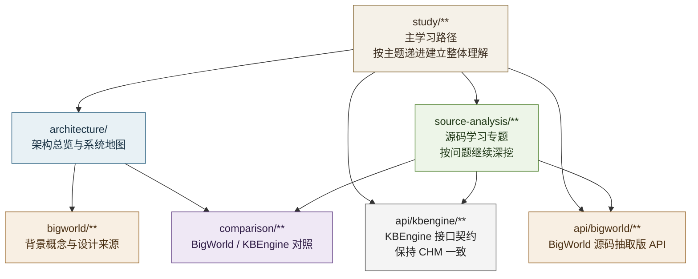

# 架构总览

> 这一页只做“地图型”工作：先把文档站里几条主线之间的关系摆清楚，再决定应该从哪里进入、遇到具体问题时跳到哪里继续读。

## 系统地图



## 目录定位

- `BigWorld` 用来建立概念模型，回答“这套架构为什么会这样设计”。
- `KBEngine 源码学习` 用来追具体问题，回答“当前代码到底怎么实现”。
- `对照分析` 用来回答“哪些思想继承了 BigWorld，哪些地方变成了 KBEngine 自己的实现”。
- `重设计方案` 是附录性质的工程草案，不作为源码分析主线。

## 推荐阅读顺序

1. [BigWorld 学习入口](/architecture/bigworld/)
2. [KBEngine 源码学习总览](/architecture/source-analysis/)
3. [BigWorld / KBEngine 对照](/architecture/comparison/)
4. [KBEngine 2.0 重设计方案](/architecture/redesign.md)

## 设计后的目录结构

```text
architecture/
├── README.md                         # 架构首页与阅读路线
├── bigworld/                         # BigWorld 概念学习
│   ├── README.md
│   ├── concepts.md                   # 核心术语与基本对象
│   ├── process-model.md              # Login/Base/Cell/DB 等进程模型
│   └── entity-space.md               # Entity、Space、Cell、Witness
├── source-analysis/                  # KBEngine 源码学习主目录
│   ├── README.md
│   ├── entry-and-bootstrap.md        # 启动入口、进程初始化、组件注册
│   ├── process-model.md              # 多进程职责、组件协作、管理进程
│   ├── entity-system.md              # Entity 定义、脚本绑定、生命周期
│   ├── space-aoi.md                  # Space、Cell、AOI、Witness、Ghost
│   ├── networking.md                 # 网络层、Bundle、Channel、消息分发
│   ├── persistence.md                # DBMgr、数据库、序列化、恢复流程
│   └── scripting.md                  # Python 运行时、脚本接口、热更新
├── comparison/                       # BigWorld 与 KBEngine 的映射与差异
│   ├── README.md
│   ├── terminology.md                # 术语映射
│   ├── architecture.md               # 架构对应关系
│   └── implementation-differences.md # 实现差异与取舍
└── redesign.md                       # 人工整理的重构草案
```

## 当前编写原则

- `architecture/` 负责系统地图、目录边界和阅读路线，不承担问题驱动的源码细节展开。
- `source-analysis` 负责具体问题的源码学习，正文以源码路径、调用链、关键类为中心展开。
- `bigworld` 目录提供概念背景，不替代对 KBEngine 代码的实际阅读。
- `comparison` 目录只写有依据的对应关系，不写想当然的“继承关系”。
- `redesign` 明确属于工程草案，与原始资料转写分开。

## 资料边界

- 当前 `architecture` 目录不属于 CHM/PDF 的逐页转写结果。
- 该目录中的分析结论应以仓库源码为主，BigWorld 仅作为参考框架。
