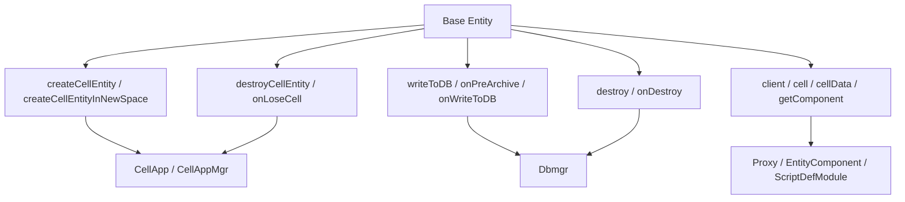
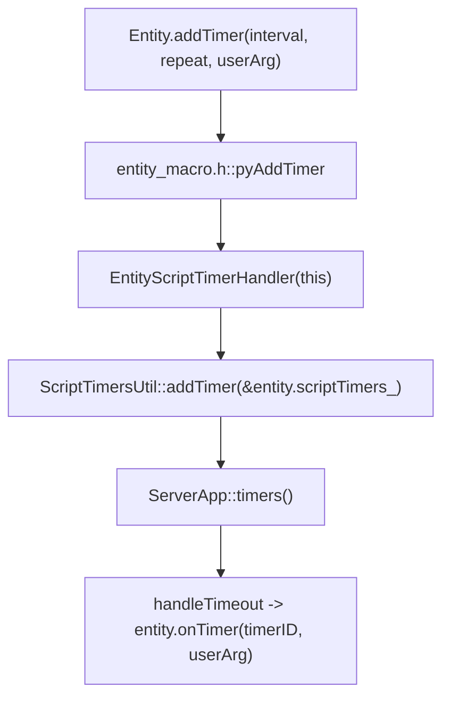

# Base 实体生命周期

> 这一页只回答一个问题：`baseapp/Entity` 在源码里到底承担什么角色。  
> 它不是 Cell 的简化版，也不是单纯“持久化前台”。更准确地说，它是 Base 侧把 `建 Cell / 失 Cell / 写库 / 归档 / 销毁 / 客户端会话` 这些边界收束到一起的生命周期枢纽。

## 先给结论

`baseapp/Entity` 最值得建立的心智模型不是“业务实体”，而是：

- 长期逻辑持有者
- Cell 生命周期发起者
- 持久化总入口
- 销毁和在线态收束点



所以读 `baseapp/Entity` 时，最准确的问题不是“这个 API 属于哪个分类”，而是：

- **它在 Base 这条生命周期总线上处于哪一个收束点**

## 第一层：`createCellEntityInNewSpace()` 不是本地建 Space，而是向 `CellAppMgr` 发起建空间请求

`createCellEntity()` 已经在实体系统页讲过，它是把当前 Base 实体挂到某个现成 Cell 空间里。  
`createCellEntityInNewSpace()` 则是另一条链：它先请求创建 Space，再把当前实体的 Cell 放进去。

脚本入口在 `kbe/src/server/baseapp/entity.cpp`：

```cpp
// 文件：kbe/src/server/baseapp/entity.cpp
PyObject* Entity::createCellEntityInNewSpace(PyObject* args)
{
    if(isDestroyed())
        PyErr_Format(..., "createCellEntityInNewSpace: is destroyed!");

    if(this->spaceID() > 0 || this->cellEntityCall())
        PyErr_Format(..., "createCellEntityInNewSpace: in space!");

    Baseapp::getSingleton().createCellEntityInNewSpace(this, args);
}
```

真正发消息的地方在 `kbe/src/server/baseapp/baseapp.cpp`：

```cpp
// 文件：kbe/src/server/baseapp/baseapp.cpp
(*pBundle).newMessage(CellappmgrInterface::reqCreateCellEntityInNewSpace);

(*pBundle) << entityType;
(*pBundle) << id;
(*pBundle) << cellappIndex;
(*pBundle) << componentID_;
(*pBundle) << hasClient;

pEntity->addCellDataToStream(CELLAPP_TYPE, ED_FLAG_ALL, s);
(*pBundle).append(*s);
```

这段代码说明得非常直接：

- `createCellEntityInNewSpace()` 不会在 Base 侧本地创建 Space
- 它发给的是 `CellAppMgr`，不是具体某个 `CellApp`
- Base 侧真正提供的是：
  - `entityType`
  - 当前实体 ID
  - `cellappIndex`
  - `hasClient`
  - 完整的 `cellData` 启动快照

### `cellappIndex` 的真实语义

源码注释已经写清楚了：

- `0` 表示不强制指定 CellApp，让负载均衡决定
- `1..N` 表示按预期 CellApp 序号做映射
- 超出实际运行数量时会循环映射

因此 `createCellEntityInNewSpace(cellappIndex)` 更准确的理解是：

- **请求 CellAppMgr 帮我找一个 CellApp 建 Space，并把当前实体的 Cell 一起落进去**

不是：

- “在这个 Base 里直接 new 一个 Space”
- “立即同步得到一个可用 `cell`”

## 第二层：`destroyCellEntity()` / `onLoseCell()` 是 Base 主动拆 Cell 链的入口与回执

Base 侧主动销毁 Cell 的入口很轻：

```cpp
// 文件：kbe/src/server/baseapp/entity.cpp
bool Entity::destroyCellEntity(void)
{
    if(cellEntityCall_  == NULL || cellEntityCall_->getChannel() == NULL)
    {
        isArchiveing_ = false;
        return false;
    }

    (*pBundle).newMessage(CellappInterface::onDestroyCellEntityFromBaseapp);
    (*pBundle) << id_;
    sendToCellapp(pBundle);
    return true;
}
```

所以 `destroyCellEntity()` 的真实语义不是“Base 把 Cell 本地删掉”，而是：

- Base 侧向当前 `cellEntityCall` 所在 Cell 发出销毁请求

Python 包装层还明确限制：

```cpp
// 文件：kbe/src/server/baseapp/entity.cpp
if(cellEntityCall_ == NULL)
    PyErr_Format(..., "destroyCellEntity: no cell!");
```

因此这不是一个“可忽略失败”的空操作接口，而是要求当前必须已经确实持有 Cell。

回执点在 `onLoseCell()`：

```cpp
// 文件：kbe/src/server/baseapp/entity.cpp
S_RELEASE(cellEntityCall_);

isArchiveing_ = false;
isGetingCellData_ = false;
createdSpace_ = false;

CALL_COMPONENTS_AND_ENTITY_METHOD(this, ..., "onLoseCell", ...);
```

这里可以直接读出几个状态变化：

- `cellEntityCall_` 被释放，说明 Base 不再持有直接 Cell mailbox
- 归档中状态结束
- 获取 CellData 的状态结束
- `createdSpace_` 也被清掉

所以 `onLoseCell()` 不是单纯“通知脚本 cell 没了”，而是：

- **Base 侧正式结束与当前 Cell 的那条运行态关系**

### 自动销毁链：为什么文档说“也许在 `onLoseCell` 里调用 `destroy()` 更合适”

源码里其实已经体现了这种设计：

```cpp
// 文件：kbe/src/server/baseapp/entity.cpp
if (!isDestroyed() && hasFlags(ENTITY_FLAGS_DESTROY_AFTER_GETCELL))
{
    ...
    destroy();
}
```

这说明：

- 如果 Base 之前已经决定“拿到/失去 Cell 后就继续 destroy”
- 真正继续销毁 Base 的安全时机，是 `onLoseCell()` 之后

因此 API 页那句建议是有源码依据的。

## 第三层：`destroy()` / `onDestroy()` 是 Base 侧生命周期最终收束，不允许越过 Cell 直接删

`destroy()` 的脚本入口里有一个非常硬的约束：

```cpp
// 文件：kbe/src/server/baseapp/entity.cpp
if (pobj->cellEntityCall() != NULL)
{
    PyErr_Format(PyExc_Exception, "%s::destroy: id:%i has cell, please destroyCellEntity() first!\n",
        pobj->scriptName(), pobj->id());
    return NULL;
}
```

这意味着：

- Base 侧销毁自己前，必须先结束 Cell 关系
- Base 不允许“带着活跃 Cell 直接自杀”

如果当前还在 `creatingCell_`，源码也不会立刻 destroy，而是挂标记：

```cpp
// 文件：kbe/src/server/baseapp/entity.cpp
if (pobj->creatingCell())
{
    pobj->addFlags(ENTITY_FLAGS_DESTROY_AFTER_GETCELL);
    S_Return;
}
```

所以 `destroy()` 的真实语义不是“马上删”，而是：

- **沿着 Base 生命周期边界，按正确顺序完成 Cell 收束、DB 收束和自身销毁**

`onDestroy(bool callScript)` 则是最终销毁阶段的脚本钩子：

```cpp
// 文件：kbe/src/server/baseapp/entity.cpp
if(callScript)
{
    CALL_ENTITY_AND_COMPONENTS_METHOD(this, ..., "onDestroy", ...);
}

if(this->hasDB())
{
    onCellWriteToDBCompleted(0, -1, -1);
}

eraseEntityLog();

if(clientEntityCall_)
    static_cast<Proxy*>(this)->kick();
```

这里有三个关键点：

1. 如果实体还有 DB，销毁时会再走一次最终归档收束
2. `eraseEntityLog()` 会通知 `Dbmgr` 擦除在线态记录
3. 如果它本质上是 `Proxy`，还会踢掉客户端连接

因此 `baseapp/Entity.onDestroy()` 比 `cellapp/Entity.onDestroy()` 更偏：

- 在线态
- DB 状态
- 客户端会话

### `deleteFromDB` / `writeToDB` 的边界

`destroy(deleteFromDB, writeToDB)` 的参数最终落在 `onDestroyEntity()`：

```cpp
// 文件：kbe/src/server/baseapp/entity.cpp
if(deleteFromDB && hasDB())
{
    (*pBundle).newMessage(DbmgrInterface::removeEntity);
    ...
    this->hasDB(false);
    return;
}

if(writeToDB)
{
    // 这个行为默认会处理
}
else
{
    this->hasDB(false);
}
```

它的语义可以压缩成：

- `deleteFromDB=True`：直接请求 `Dbmgr` 删除实体存档
- `writeToDB=True`：保留 DB 关系，后续走归档收束
- 两者都否：Base 销毁但不再认为自己持有 DB 持久态

因此这个接口不是一个普通 bool 组合，而是 Base 销毁策略的三种分支。

## 第四层：`writeToDB()` / `onPreArchive()` / `onWriteToDB()` / `onRestore()` 组成 Base 侧持久化闭环

Base 写库入口在：

```cpp
// 文件：kbe/src/server/baseapp/entity.cpp
void Entity::writeToDB(void* data, void* extra1, void* extra2)
{
    ...
    if(this->cellEntityCall() == NULL)
    {
        onCellWriteToDBCompleted(callbackID, shouldAutoLoad, -1);
    }
    else
    {
        (*pBundle).newMessage(CellappInterface::reqWriteToDBFromBaseapp);
        (*pBundle) << this->id();
        (*pBundle) << callbackID;
        (*pBundle) << shouldAutoLoad;
        sendToCellapp(pBundle);
    }
}
```

这说明 Base 的写库入口本身就是总入口：

- 没有 Cell：直接本地进入归档收束
- 有 Cell：先向 Cell 请求收束 Cell 态，再回到 Base 完成最终写库

真正开始归档的点是 `onCellWriteToDBCompleted()`：

```cpp
// 文件：kbe/src/server/baseapp/entity.cpp
CALL_ENTITY_AND_COMPONENTS_METHOD(this, ..., "onPreArchive", ...);
...
onWriteToDB();
...
addPersistentsDataToStream(ED_FLAG_ALL, s);
...
(*pBundle).newMessage(DbmgrInterface::writeEntity);
```

顺序很重要：

1. 先 `onPreArchive()`
2. 再 `onWriteToDB(cellData)`
3. 再把 persistent data 打进流
4. 最后发给 `DbmgrInterface::writeEntity`

这几个回调不该混为一谈：

- `onPreArchive()`：归档开闸前的最后一道业务判定点
- `onWriteToDB(cellData)`：真正把当前 `cellData` 一并纳入持久化内容前的脚本钩子
- `onWriteToDBCallback(...)`：DB 结果回到 Base 后，恢复 Python callback

而 `onRestore()` 对应的是恢复链重新接管：

```cpp
// 文件：kbe/src/server/baseapp/entity.cpp
void Entity::onRestore()
{
    if(!inRestore_)
        return;

    CALL_ENTITY_AND_COMPONENTS_METHOD(this, ..., "onRestore", ...);

    inRestore_ = false;
    isArchiveing_ = false;
    removeFlags(ENTITY_FLAGS_INITING);
}
```

它不是普通初始化回调，而是：

- **Base 侧恢复路径完成后，脚本重新接管实体状态的入口**

## 第五层：`getComponent()` 在 Base 实体上也不是手写函数，而是实体宏统一注入

`baseapp/entity.cpp` 自己没有单独声明 `getComponent()` 的实现函数。  
原因和 Cell 侧一样，它来自实体宏统一注入：

```cpp
// 文件：kbe/src/lib/entitydef/entity_macro.h
SCRIPT_METHOD_DECLARE("getComponent", pyGetComponent, METH_VARARGS | METH_KEYWORDS, 0)
```

底层依然会落到统一组件描述系统：

- `EntityComponent::getComponents(...)`
- `ScriptDefModule::getComponentDescrs()`

因此 Base 侧 `getComponent(componentName, all)` 的准确语义也和 Cell 一样：

- 按组件描述名，从当前实体已绑定的组件属性中查找实例
- `all=False` 取第一个
- `all=True` 取全部

它不是 `baseapp/Entity` 手写出来的特殊逻辑，而是实体组件系统给所有实体注入的共通能力。

## 第六层：`addTimer()` / `delTimer()` / `onTimer()` 在 Base 实体上走的是实体级脚本定时器

这一组接口在名字上很容易和 `KBEngine.addTimer()` 混淆，但源码里它们不是同一套实现。

### Base 实体定时器来自实体宏统一注入

`kbe/src/lib/entitydef/entity_macro.h` 里能直接看到：

```cpp
SCRIPT_METHOD_DECLARE("addTimer", pyAddTimer, METH_VARARGS, 0)
SCRIPT_METHOD_DECLARE("delTimer", pyDelTimer, METH_VARARGS, 0)
```

而 `ENTITY_CPP_IMPL(...)` 里又展开了真正实现：

- `CLASS::pyAddTimer(float interval, float repeat, int32 userArg)`
- `__py_pyDelTimer(...)`
- `EntityScriptTimerHandler`

这说明 `baseapp/Entity.addTimer()` 不是 `baseapp/entity.cpp` 自己手写的一套私有逻辑，而是：

- Base / Cell / 客户端实体共用的实体定时器模板

### 实体定时器挂在“当前实体自己的 `scriptTimers_`”上

宏展开后的 `pyAddTimer(...)` 会：

1. 创建 `EntityScriptTimerHandler(this)`
2. 取当前实体的 `scriptTimers_`
3. 调 `ScriptTimersUtil::addTimer(&pTimers, interval, repeat, userArg, pHandler)`

底层真正的 ID 分配、取消、释放落在 `kbe/src/lib/server/script_timers.cpp`：

- `ScriptTimers::addTimer(...)`
- `ScriptTimers::delTimer(...)`
- `ScriptTimers::cancelAll()`

这里最值得记住的边界是：

- 它底下借用的是 `ServerApp::timers()`
- 但 ID 映射和生命周期归属的是“这个实体自己的 `ScriptTimers` 容器”

所以我现在更愿意把 `Entity.addTimer()` 理解成：

- 由进程定时器设施承载
- 但作用域属于当前实体

### `onTimer(timerID, userArg)` 才是 Base 实体这组接口的最终回调

`kbe/src/server/baseapp/entity.cpp` 里的触发点很直接：

```cpp
void Entity::onTimer(ScriptID timerID, int useraAgs)
{
    CALL_ENTITY_AND_COMPONENTS_METHOD(this, ..., "onTimer", ..., timerID, useraAgs, ...);
}
```

这说明 Base 实体这套接口和 API 页描述是一致的：

- `addTimer(initialOffset, repeatOffset, userArg)`
- 最终脚本层收到 `onTimer(timerID, userArg)`

这里和前面 [通用运行时工具 API](/architecture/source-analysis/runtime-utility-api.md) 里讲过的 `KBEngine.addTimer()` 要明确区分：

- `KBEngine.addTimer()`
  - 来自 `PythonApp`
  - 是进程级脚本宿主能力
  - 回调签名是 `callback(timerID)`
- `Entity.addTimer()`
  - 来自实体宏和实体自己的 `scriptTimers_`
  - 是实体级脚本定时器
  - 回调签名是 `onTimer(timerID, userArg)`



### `delTimer("All")` 也是这套实体定时器的边界之一

宏展开后的 `__py_pyDelTimer(...)` 支持两种输入：

- 整数：删除指定 `timerID`
- 字符串 `"All"`：调用 `scriptTimers().cancelAll()`

所以 Base 实体这组接口维护的不是一个“单个底层句柄”，而是：

- 当前实体自己的定时器集合

### 什么时候更适合用 Base 实体定时器

如果按源码边界来选，我会这样分：

- 用 `Entity.addTimer()`：
  - 定时任务显式依附某个实体
  - 希望回调自然回到实体和组件方法
  - 需要 `userArg`
- 用 `KBEngine.addTimer()`：
  - 定时任务属于组件进程，而不是某个实体
  - 例如 LoginApp / Interfaces / DBMgr 的后台轮询和超时巡检

## 读源码的最短路径

如果你准备在 IDE 里把 Base 实体主线走一遍，建议顺序是：

1. `kbe/src/server/baseapp/entity.cpp` → `createCellEntity` / `onGetCell`
2. `kbe/src/server/baseapp/baseapp.cpp` → `createCellEntityInNewSpace`
3. `kbe/src/server/baseapp/entity.cpp` → `destroyCellEntity` / `onLoseCell`
4. `kbe/src/server/baseapp/entity.cpp` → `writeToDB` / `onCellWriteToDBCompleted`
5. `kbe/src/server/baseapp/entity.cpp` → `destroy` / `onDestroyEntity` / `onDestroy`
6. `kbe/src/lib/entitydef/entity_macro.h` + `kbe/src/lib/server/script_timers.cpp` → `addTimer / delTimer / onTimer`
7. `kbe/src/lib/entitydef/entity_macro.h` + `entity_component.cpp` → `getComponent`

这样读能把“Base 是怎样收束 Cell、DB 和客户端边界”的主线一次走通。

## 与其他专题的关系

- `createCellEntity / onGetCell` 的创建主线，放在 [实体系统](/architecture/source-analysis/entity-system.md#base-entity-create-cell)
- 持久化线程与 Dbmgr 侧，放在 [持久化与数据库](/architecture/source-analysis/persistence.md)
- Space / Cell 侧的 AOI、Witness、Teleport，放在 [空间与 AOI](/architecture/source-analysis/space-aoi.md)

这一页的职责不是重复它们，而是把这些分散在别处的链路重新收束回：

- **Base 实体自己是怎样管理这些边界的**
