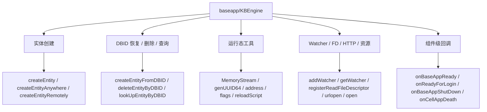
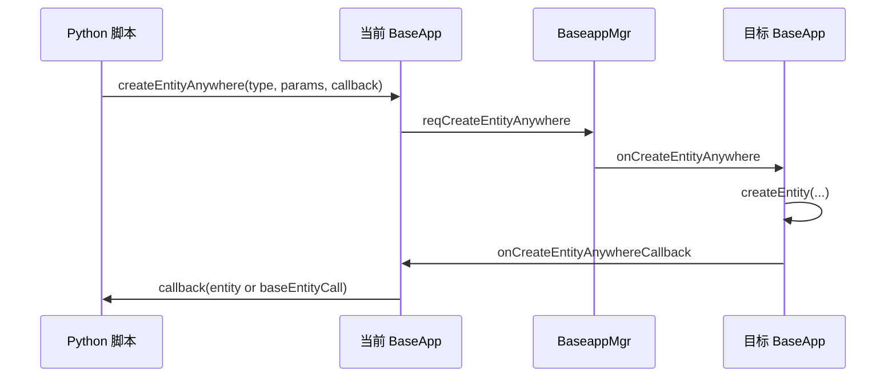
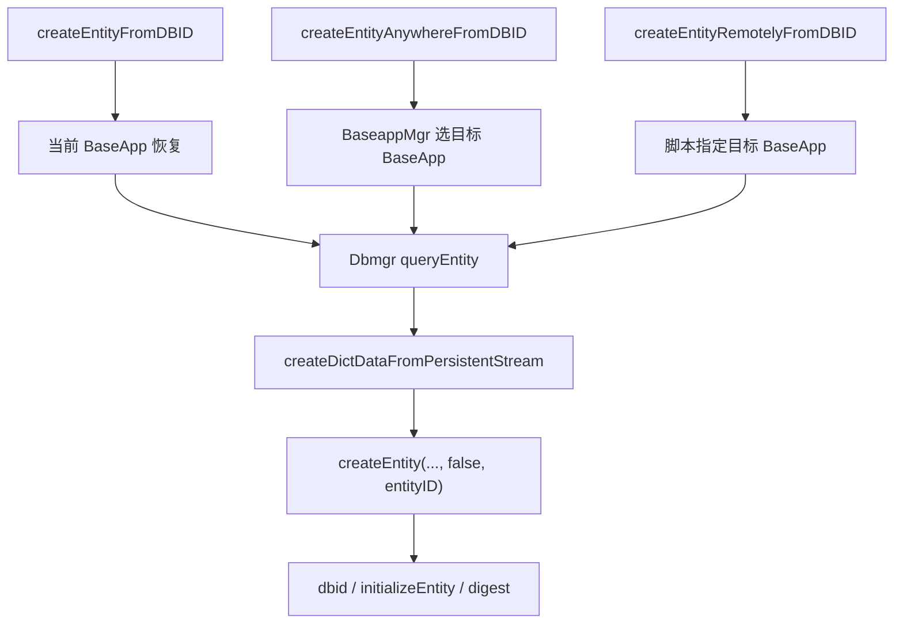
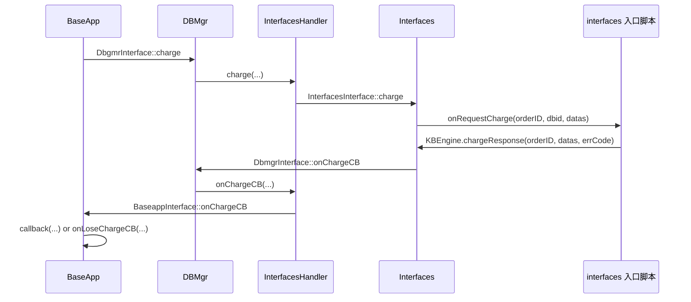
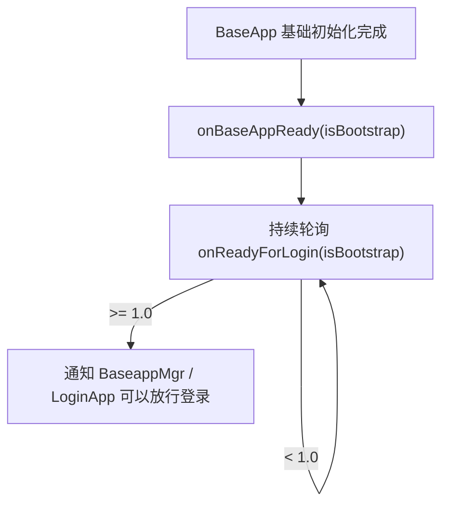

# BaseApp 运行时 API

> 这一页只回答一个问题：`baseapp/KBEngine` 模块里那些高频脚本 API，源码里到底落在哪里。  
> 它不是再讲一遍“BaseApp 是什么”，而是把实体创建、DBID 恢复、运行态工具、Watcher、文件描述符、HTTP、组件回调这些零散入口，收束成一张可追源码的运行时地图。

## 先给结论

`baseapp/KBEngine` 更适合被理解成两层能力：

- 一层是 Base 侧实体工厂与恢复入口
- 一层是 Base 侧脚本宿主与运行时工具箱



所以读这一组 API 时，最准确的问题不是“它属于哪个模块”，而是：

- **它到底是在发起实体链路**
- **还是在给脚本层暴露 BaseApp 宿主能力**

## 第一层：实体创建 API 分成三类，不要混成一个“createEntity”

先看脚本模块注册点，`kbe/src/server/baseapp/baseapp.cpp` 把这组方法直接挂进了 `KBEngine` 模块：

```cpp
APPEND_SCRIPT_MODULE_METHOD(getScript().getModule(), createEntity, __py_createEntity, METH_VARARGS, 0);
APPEND_SCRIPT_MODULE_METHOD(getScript().getModule(), createEntityLocally, __py_createEntity, METH_VARARGS, 0);
APPEND_SCRIPT_MODULE_METHOD(getScript().getModule(), createEntityAnywhere, __py_createEntityAnywhere, METH_VARARGS, 0);
APPEND_SCRIPT_MODULE_METHOD(getScript().getModule(), createEntityRemotely, __py_createEntityRemotely, METH_VARARGS, 0);
```

这几行已经把关系写死了：

- `createEntity` 只是 `createEntityLocally` 的别名
- `createEntityLocally` 走本地 BaseApp 直接创建
- `createEntityAnywhere` 先问 `BaseappMgr` 选哪个 BaseApp
- `createEntityRemotely` 直接指定目标 BaseApp

### `createEntity()` / `createEntityLocally()`：本地直接创建

脚本入口：

```cpp
PyObject* Baseapp::__py_createEntity(PyObject* self, PyObject* args)
{
    ...
    PyObject* e = Baseapp::getSingleton().createEntity(entityType, params);
    ...
}
```

这里没有经过 `BaseappMgr`，也没有异步回调，说明它的语义非常直接：

- 在当前 BaseApp 进程上直接创建一个 Base 实体

因此它适合：

- 当前逻辑明确要求实体就在本进程
- 当前脚本立刻就要拿到本地实体对象继续做事

它不适合：

- 需要让系统帮你做 Base 负载均衡

### `createEntityAnywhere()`：先选 BaseApp，再回调实体引用

Python 包装只做校验，真正分发在 `Baseapp::createEntityAnywhere(...)`：

```cpp
(*pBundle).newMessage(BaseappmgrInterface::reqCreateEntityAnywhere);
(*pBundle) << entityType;
(*pBundle) << initDataLength;
(*pBundle).append(strInitData.data(), initDataLength);
(*pBundle) << componentID_;
(*pBundle) << callbackID;
```

这条链的结构很清楚：

1. 当前 BaseApp 把实体类型、初始化参数、发起方组件 ID、回调 ID 发给 `BaseappMgr`
2. `BaseappMgr` 选一个合适的 BaseApp
3. 目标 BaseApp 收到 `onCreateEntityAnywhere(...)` 后本地创建实体
4. 再把结果通过 `onCreateEntityAnywhereCallback(...)` 回给发起方



最需要注意的是回调参数不是固定一种形态。

`_onCreateEntityAnywhereCallback(...)` 里分了两支：

- 如果实体就在当前进程创建，回调拿到的是本地 `Entity*`
- 如果实体在别的 BaseApp 创建，回调拿到的是 `EntityCall`

所以这个 API 的准确语义是：

- **请系统在某个合适的 BaseApp 上创建实体，然后把“可用的 Base 引用”回给我**

### `createEntityRemotely()`：跳过选举，直接指定目标 BaseApp

`__py_createEntityRemotely(...)` 强制要求第二个参数是 `ENTITYCALL_TYPE_BASE`，然后取它的 `componentID()`：

```cpp
EntityCallAbstract* baseEntityCall = static_cast<EntityCallAbstract*>(pyEntityCall);
...
Baseapp::getSingleton().createEntityRemotely(entityType, baseEntityCall->componentID(), params, pyCallback);
```

真正发包时直接把目标组件 ID 塞进 `BaseappMgrInterface::reqCreateEntityRemotely`：

```cpp
(*pBundle).newMessage(BaseappmgrInterface::reqCreateEntityRemotely);
(*pBundle) << componentID;
(*pBundle) << entityType;
...
```

这说明它和 `createEntityAnywhere()` 的差别不是“是否异步”，而是：

- `Anywhere` 由系统选目标
- `Remotely` 由脚本显式指定目标

因此它常见的使用场景是：

- 已经有某个 Base 实体引用
- 希望新实体和它落在同一个 BaseApp
- 需要把一段业务状态刻意放到某个 Base 分区上

## 第二层：DBID 恢复不是一个 API，而是一整组“查库 + 检出 + 建实体”的链

`baseapp/KBEngine` 的 DBID 相关 API 其实有两类：

- 从 DBID 恢复实体
- 对 DBID 做在线态查询或删除

### `createEntityFromDBID()`：在当前 BaseApp 上恢复

回调处理点在 `onCreateEntityFromDBIDCallback(...)`：

```cpp
PyObject* pyDict = createDictDataFromPersistentStream(s, entityType.c_str());
PyObject* e = Baseapp::getSingleton().createEntity(entityType.c_str(), pyDict, false, entityID);
...
static_cast<Entity*>(e)->dbid(dbInterfaceIndex, dbid);
static_cast<Entity*>(e)->initializeEntity(pyDict);
...
static_cast<Entity*>(e)->setDirty((uint32*)&digest[0]);
```

这个函数说明恢复链真正做了四件事：

1. 从持久化流里反序列化出属性字典
2. 以指定 `entityID` 创建 Base 实体
3. 重新挂回 `dbid`
4. 用持久化内容重新初始化实体，并计算当前 digest

所以 `createEntityFromDBID()` 的本质不是“返回一个数据库对象”，而是：

- **把一份持久化状态重新接回 Base 实体运行时**

### `createEntityAnywhereFromDBID()`：先选目标 BaseApp，再恢复

这条链是两跳：

1. `createEntityAnywhereFromDBID(...)`
   发给 `BaseappMgrInterface::reqCreateEntityAnywhereFromDBIDQueryBestBaseappID`
2. `onGetCreateEntityAnywhereFromDBIDBestBaseappID(...)`
   选出目标 BaseApp 后，再向 `Dbmgr` 发 `queryEntity`

随后结果会进入 `onCreateEntityAnywhereFromDBIDCallback(...)`，再转发到目标 BaseApp 的 `createEntityAnywhereFromDBIDOtherBaseapp(...)`。

最终目标 BaseApp 里还是会走同样的恢复动作：

```cpp
PyObject* pyDict = createDictDataFromPersistentStream(s, entityType.c_str());
PyObject* e = Baseapp::getSingleton().createEntity(entityType.c_str(), pyDict, false, entityID);
...
static_cast<Entity*>(e)->dbid(dbInterfaceIndex, dbid);
```

所以它的准确语义不是：

- “任意 BaseApp 去数据库里拿一份对象给我”

而是：

- **系统先决定应该在哪个 BaseApp 恢复，再把那份持久化状态落成那个 BaseApp 上的活体实体**

### `createEntityRemotelyFromDBID()`：恢复到指定 BaseApp

它和 `createEntityAnywhereFromDBID()` 的差别，仍然在于目标 BaseApp 是谁来定：

- `AnywhereFromDBID` 先问 `BaseappMgr`
- `RemotelyFromDBID` 直接把 `createToComponentID` 带进 `DbmgrInterface::queryEntity`

因此这组三兄弟可以压缩成一张图：



### 失败分支和 `wasActive` 才是这组 API 最容易漏读的边界

这组回调都不是“失败就给 `None`”这么简单。

源码里统一有一条判断：

- 如果实体已经被检出，`wasActive == true`
- 回调会尽量返回已有实体引用，或者返回一个远端 `EntityCall`

也就是说，这组回调的真实含义是：

- `baseRef` 可能是新恢复出来的实体
- 也可能是已经在线的那个实体引用
- `wasActive` 才告诉你“这次到底是不是新检出”

这也是它常见的业务使用场景：

- 登录时通过 DBID 取玩家
- 自动加载实体恢复
- 通过 DBID 接管离线业务对象

如果业务代码忽略 `wasActive`，很容易把“已在线实体”误判成“刚恢复出来的实体”。

## 第三层：`lookUpEntityByDBID()` / `deleteEntityByDBID()` 是在线态与持久态边界探针

这两个接口都不创建实体，但都要问 `Dbmgr`。

### `lookUpEntityByDBID()`：查“这个 DBID 现在是不是已经被检出”

它走的是：

```cpp
(*pBundle).newMessage(DbmgrInterface::lookUpEntityByDBID);
```

所以它更像一个在线态探针：

- 如果目标 DBID 没被检出，返回 `False`
- 如果已被检出，回调里拿到实体引用或 `EntityCall`

适合的场景是：

- 恢复前先探测是否已经在线
- 业务上避免重复恢复同一个 DB 实体

### `deleteEntityByDBID()`：只删离线持久态，不强杀在线实体

它走的是：

```cpp
(*pBundle).newMessage(DbmgrInterface::deleteEntityByDBID);
```

而回调里会区分两种结果：

- 没有检出，删除成功，回调 `True`
- 已经检出，不删库，回调那个在线实体引用

所以它的准确语义不是“删掉这个实体”，而是：

- **尝试删除这个 DBID 对应的持久化数据；如果它已经在线，就把在线实体交还给你处理**

这也解释了为什么它常和 `destroy()` 不是一回事：

- `destroy()` 处理的是当前运行时实体
- `deleteEntityByDBID()` 处理的是持久层记录及其在线态冲突

## 第四层：`executeRawDatabaseCommand()` 和 `charge()` 都是“把 BaseApp 当脚本宿主”，不是实体能力

### `executeRawDatabaseCommand()`：BaseApp 只是转发者与结果解包者

发起点：

```cpp
(*pBundle).newMessage(DbmgrInterface::executeRawDatabaseCommand);
(*pBundle) << eid;
(*pBundle) << (uint16)dbInterfaceIndex;
(*pBundle) << componentID_ << componentType_;
(*pBundle) << callbackID;
```

回包点：

```cpp
void Baseapp::onExecuteRawDatabaseCommandCB(Network::Channel* pChannel, KBEngine::MemoryStream& s)
```

这里做的事主要是把 DB 返回结果重组为 Python 友好的四元组：

- `resultSet`
- `affectedRows`
- `lastInsertID`
- `errorMsg`

如果查出了字段，源码会把每个 cell 包成 `bytes`，`NULL` 则映射成 `None`。

因此这个 API 的准确定位是：

- BaseApp 代脚本层把原始 DB 命令发给 `Dbmgr`
- 再把 `Dbmgr` 的原始结果翻译成 Python 参数

它适合：

- 做引擎实体体系之外的辅助 SQL
- 查一些不需要实体检出的小表、旁路表

它不适合：

- 直接修改已经可能被检出的实体数据

这个限制不是文档保守，而是源码设计本身就把实体持久化的权威链路放在实体归档上。

### `charge()`：BaseApp 发起订单请求，完整链路是 `BaseApp -> DBMgr -> Interfaces -> DBMgr -> BaseApp`

发起点：

```cpp
(*pBundle).newMessage(DbmgrInterface::charge);
(*pBundle) << chargeID;
(*pBundle) << dbid;
(*pBundle).appendBlob(datas);
(*pBundle) << callbackID;
```

回包点：

```cpp
void Baseapp::onChargeCB(Network::Channel* pChannel, KBEngine::MemoryStream& s)
```

如果只看 BaseApp 这两段代码，很容易误以为 `Dbmgr` 自己就完成了支付处理。继续往下追源码，完整回路其实是：

1. `Baseapp::charge(...)`
   - 把 `chargeID / dbid / datas / callbackID` 发给 `DbmgrInterface::charge`
2. `Dbmgr::charge(...)`
   - 继续交给 `InterfacesHandler_Interfaces::charge(...)`
3. `InterfacesHandler_Interfaces::charge(...)`
   - 转发成 `InterfacesInterface::charge`
4. `Interfaces::charge(...)`
   - 调入口脚本 `onRequestCharge(orderID, dbid, datas)`
5. 脚本层后续调用 `KBEngine.chargeResponse(...)`
6. `Interfaces::chargeResponse(...)`
   - 再发回 `DbmgrInterface::onChargeCB`
7. `InterfacesHandler_Interfaces::onChargeCB(...)`
   - 再路由到目标 `BaseappInterface::onChargeCB`
8. `Baseapp::onChargeCB(...)`
   - 最后才回到原 callback，或者落到 `onLoseChargeCB(...)`



这里最关键的不是“充值成功失败”，而是最后两条回流分支：

- 如果原 callback 还在，直接调这个 callback
- 如果订单回包时 callback 丢了，就回调入口脚本 `onLoseChargeCB(...)`

因此它的业务边界很清楚：

- `charge()` 负责把订单请求送进后端链路
- `onLoseChargeCB()` 负责兜底处理“找不到原始回调”的丢单场景

继续看 `Interfaces::chargeResponse(...)` 和 `InterfacesHandler_Interfaces::onChargeCB(...)` 还能看到两个更细的边界：

- 如果 `Interfaces` 已经找不到原订单，也会尽量把结果广播回 `Dbmgr`
- 如果原 BaseApp 不存在，`InterfacesHandler_Interfaces::onChargeCB(...)` 会尝试找任意可用 BaseApp 去执行 `onLoseChargeCB`

所以 `onLoseChargeCB()` 不是“偶尔才会用到的备用接口”，而是这条支付链在异常回流场景下的正式兜底面。

## 第五层：运行态工具 API 本质上都是“脚本宿主状态查询”

### `MemoryStream`：不是 BaseApp 特有能力，而是通用脚本二进制容器

`MemoryStream` 的 Python 对象实现在 `kbe/src/lib/pyscript/py_memorystream.cpp`。

它支持的核心动作是：

- `append(type, value)`
- `pop(type)`
- `fill(bytes_or_stream)`
- `bytes()`
- `rpos / wpos`

它的意义不是“给你一个 Python bytes 包装器”，而是：

- **让脚本层可以按引擎自己的二进制规则做序列化和反序列化**

适合的场景：

- 自定义二进制协议拼包
- 存储一段需要按引擎基本类型规则编码的临时数据
- 和底层网络/DB 流格式保持一致

### `address / isShuttingDown / quantumPassedPercent / getAppFlags / setAppFlags`

这组 API 都直接落在 `baseapp.cpp`：

```cpp
PyObject* Baseapp::__py_quantumPassedPercent(...) { return PyLong_FromLong(Baseapp::getSingleton().tickPassedPercent()); }
PyObject* Baseapp::__py_isShuttingDown(...) { return PyBool_FromLong(Baseapp::getSingleton().isShuttingdown() ? 1 : 0); }
PyObject* Baseapp::__py_address(...) { ... intEndpoint().addr() ... }
PyObject* Baseapp::__py_getFlags(...) { return PyLong_FromUnsignedLong(Baseapp::getSingleton().flags()); }
PyObject* Baseapp::__py_setFlags(...) { ... Baseapp::getSingleton().flags(flags); ... }
```

所以它们都不是业务 API，而是：

- 查询当前 BaseApp 自己的运行态

最常见的使用场景：

- `address()`：把当前 BaseApp 地址暴露给日志、诊断、外部回调参数
- `isShuttingDown()`：在异步逻辑里快速判断是否还接受新任务
- `quantumPassedPercent()`：观测当前 tick 占用百分比
- `getAppFlags / setAppFlags()`：对 BaseApp 的负载均衡参与标志做动态调整

### `genUUID64 / publish / scriptLogType / time / reloadScript / debugTracing`

这组 API 分布在不同宿主文件里：

- `genUUID64` 在 `kbe/src/lib/pyscript/script.cpp`
- `publish / scriptLogType` 在 `kbe/src/lib/server/entity_app.h`
- `time / reloadScript` 在 `baseapp.cpp`
- `debugTracing` 在 `kbe/src/lib/pyscript/py_gc.cpp`

这里最值得记住的是两点：

1. `genUUID64` 不是纯随机，它依赖 `globalOrder`
2. `reloadScript()` 最终会再次触发入口脚本 `onInit(True)`

`EntityApp<E>::reloadScript(...)` 很直接：

```cpp
EntityDef::reload(fullReload);
onReloadScript(fullReload);
PyObject* pyResult = PyObject_CallMethod(getEntryScript().get(), "onInit", "i", 1);
```

因此 `reloadScript()` 的准确语义是：

- 先重载实体定义与相关脚本
- 再让入口脚本重新执行一轮“重载后的初始化”

这也是它常见的使用场景：

- 开发态调试热更新
- 脚本修改后重新初始化全局状态

而正常启动完成后的第一次 `onInit(False)`，是在 `baseapp.cpp` 的 `onDbmgrInitCompleted(...)` 里显式调用的：

```cpp
PyObject* pyResult = PyObject_CallMethod(getEntryScript().get(), "onInit", "i", 0);
```

所以 `onInit` 的完整语义应当连起来理解：

- `onInit(False)`：BaseApp 首次启动初始化完成
- `onInit(True)`：热更新后重新初始化

`debugTracing()` 则不是 BaseApp 私有实现，而是统一挂到 `script::PyGC::__py_debugTracing`：

```cpp
APPEND_SCRIPT_MODULE_METHOD(getScript().getModule(), debugTracing, script::PyGC::__py_debugTracing, METH_VARARGS, 0);
```

它的用途不是业务逻辑，而是：

- 主动打印当前 KBEngine 封装 Python 对象的跟踪计数
- 用来排查 `Entity`、`EntityCall`、`FixedArray` 等扩展对象泄漏

## 第六层：关闭链真正可追的是 `onReadyForShutDown` 与 `onBaseAppShutDown`，不是 `onFini`

`baseapp/KBEngine` 里和关闭相关的 API 名字有三个：

- `onReadyForShutDown`
- `onBaseAppShutDown`
- `onFini`

但如果按当前源码树继续往下追，真正能明确落地的只有前两者。

### `onReadyForShutDown()` 是关闭前闸门

`kbe/src/server/baseapp/baseapp.cpp` 的 `Baseapp::canShutdown()` 里有一段非常关键：

```cpp
if (getEntryScript().get() && PyObject_HasAttrString(getEntryScript().get(), "onReadyForShutDown") > 0)
{
    PyObject* pyResult = PyObject_CallMethod(getEntryScript().get(), "onReadyForShutDown", "");
    ...
    if (!isReady)
        return ShutdownHandler::CAN_SHUTDOWN_STATE_USER_FALSE;
}
```

这说明 `onReadyForShutDown()` 的真实语义是：

- BaseApp 进入关闭判定期时，脚本还能投一次“现在还不能关”

它不是结束通知，而是关闭前闸门。

### `onBaseAppShutDown(state)` 才是当前源码里真正持续可追的关闭通知

同一个文件里还能看到三次显式调用：

- `onShutdownBegin()` 里调用一次，参数是 `0`
- `onShutdown(first)` 首次进入时调用一次，参数是 `1`
- `onShutdownEnd()` 里调用一次，参数是 `2`

也就是说，当前版本里 `onBaseAppShutDown(state)` 更接近一个分阶段关闭通知：

- `0`：开始进入关闭阶段
- `1`：正式进入销毁流程
- `2`：关闭流程结束

这也是为什么我现在更愿意把关闭主线理解成：

- `onReadyForShutDown()` 负责“能不能关”
- `onBaseAppShutDown(state)` 负责“关到哪一步了”

### `onFini()`：当前源码树里没有查到明确触发点

我继续搜了：

- `PyObject_HasAttrString(..., "onFini")`
- `PyObject_CallMethod(..., "onFini")`
- 以及其他显式 `onFini` 调用

当前源码树里没有命中 BaseApp 入口脚本 `onFini` 的实际触发点。

而 `Baseapp::finalise()`、`EntityApp::finalise()`、`PythonApp::finalise()` 做的事情都是：

- 停定时器
- 清理回调管理器
- 卸脚本
- 再走 `ServerApp::finalise()`

没有看到在这条链上主动去 call Python `onFini()`。

所以这条 API 我现在只能保守地记成：

- API 页保留 `onFini()` 这个契约名
- 但按当前源码树阅读，没有查到它在 BaseApp 关闭链上的明确触发点

## 第七层：Watcher、文件描述符、HTTP、资源 API 都是“外挂在脚本宿主上的工具接口”

### Watcher：脚本层自定义监视变量，路径自动挂到 `root/scripts/`

`addWatcher` / `delWatcher` 在 `kbe/src/lib/pyscript/pywatcher.cpp`。

最关键的一行是：

```cpp
path = std::string("root/scripts/") + path;
```

这说明你在脚本里写：

```python
KBEngine.addWatcher("players", "UINT32", countPlayers)
```

真正注册的 watcher 路径是：

- `root/scripts/players`

`getWatcher` / `getWatcherDir` 则是在 `EntityApp<E>` 里统一提供：

- `getWatcher(path)`：拿当前 watcher 的值
- `getWatcherDir(path)`：列出某个 watcher 目录下的子项

因此这组 API 的准确定位是：

- **让脚本层动态把业务指标接入引擎的 Watcher 树**

常见场景：

- 在线人数
- 队列长度
- 某类实体数量
- 某种缓存命中率

### 文件描述符回调：不是轮询循环，而是接进引擎 dispatcher

`registerReadFileDescriptor` / `registerWriteFileDescriptor` 都在 `py_file_descriptor.cpp`。

注册时会直接 new 一个 `PyFileDescriptor`：

```cpp
new PyFileDescriptor(fd, pycallback, false);
```

构造函数里马上挂进 dispatcher：

```cpp
dispatcher().registerReadFileDescriptor(fd_, this);
```

回调触发时，最终调用的是 Python callback，并把 `fd` 作为唯一参数传回去：

```cpp
PyObject_CallFunction(pyCallback_.get(), "i", fd_);
```

这说明这组 API 的准确语义是：

- 把一个现成文件描述符挂到引擎事件循环里
- 当它可读/可写时，让 Python 回调接管

适合的场景：

- 接外部 socket
- 自定义轮询器
- 和非引擎 FD 资源做事件桥接

### `urlopen()`：异步 HTTP 包装，不阻塞脚本调用点

`urlopen` 的实现位于 `kbe/src/lib/pyscript/pyurl.cpp`。

它支持三种输入形态：

- `url + callback`
- `url + callback + postData`
- `url + callback + postData + headers`

请求完成后，`onHttpCallback(...)` 会把结果回给 Python：

- `httpcode`
- `data`
- `headers`
- `success`
- `url`

因此它的准确定位是：

- **把 HTTP/HTTPS 异步请求接进引擎脚本宿主**

适合的场景：

- 调第三方 Web 服务
- 打外部登录、支付、风控接口
- 发简单 webhook 或 HTTP 探测

### 资源 API：统一受 `KBE_RES_PATH` 约束

资源相关方法都由 `EntityApp<E>` 统一挂入模块：

- `getResFullPath`
- `hasRes`
- `open`
- `listPathRes`
- `matchPath`

这些实现最终都会落到 `Resmgr::getSingleton()`：

- `getResFullPath()` 先 `hasRes` 再 `matchRes`
- `matchPath()` 直接返回匹配结果
- `listPathRes()` 先 `matchPath` 再列目录
- `open()` 先把相对路径转换成全路径，再调用 Python `io.open`

这组 API 的真实边界不是“方便读文件”，而是：

- **脚本只能按资源路径体系访问引擎认可的资源**

适合的场景：

- 读配置片段
- 查资源是否存在
- 列某个资源目录下的脚本或数据文件

## 第七层：组件回调真正回答的是“BaseApp 何时算 ready，何时开始 shutdown，何时要接管故障恢复”

### `onBaseAppReady()` 和 `onReadyForLogin()`：不是同一时机

这一组最容易混。

`initprogress_handler.cpp` 里先调的是 `onBaseAppReady(...)`：

```cpp
PyObject* pyResult = PyObject_CallMethod(
    Baseapp::getSingleton().getEntryScript().get(),
    "onBaseAppReady",
    "O",
    PyBool_FromLong((g_componentGroupOrder == 1) ? 1 : 0));
```

然后才在后续循环里持续问 `onReadyForLogin(...)`：

```cpp
PyObject* pyResult = PyObject_CallMethod(
    Baseapp::getSingleton().getEntryScript().get(),
    "onReadyForLogin",
    "O",
    PyBool_FromLong((g_componentGroupOrder == 1) ? 1 : 0));
```

这两个回调的关系可以压缩成：

- `onBaseAppReady`：BaseApp 启动流程、自动加载、组件连接都已经走完，可以开始做脚本收尾初始化
- `onReadyForLogin`：登录闸门是否已经可以打开；如果没准备好，就持续返回进度值



常见使用场景：

- `onBaseAppReady`：建全局缓存、预热线程、恢复业务索引
- `onReadyForLogin`：等待外部依赖、预热数据、风控或缓存同步完成

### `onReadyForShutDown()`：BaseApp 退出前最后一道脚本门闸

`Baseapp::canShutdown()` 里会显式检查入口脚本是否实现了它：

```cpp
if (getEntryScript().get() && PyObject_HasAttrString(getEntryScript().get(), "onReadyForShutDown") > 0)
{
    PyObject* pyResult = PyObject_CallMethod(getEntryScript().get(), "onReadyForShutDown", "");
    ...
}
```

如果返回不是 `True`，就会继续等待。

所以它的准确语义不是“通知你要关了”，而是：

- **问脚本层：现在是否允许正式进入退出流程**

适合的场景：

- 等异步落盘完成
- 等第三方状态回写完成
- 等关键业务把收尾动作做完

### `onBaseAppShutDown(state)`：退出流程被明确切成三段

`baseapp.cpp` 里对应三个调用点：

- `onShutdownBegin()` 调 `onBaseAppShutDown(0)`
- `onShutdown(first)` 调 `onBaseAppShutDown(1)`
- `onShutdownEnd()` 调 `onBaseAppShutDown(2)`

所以这不是一个“单次关机通知”，而是一条三阶段回调链：

- `0`：断开所有客户端之前
- `1`：写库收尾阶段
- `2`：写库完成后，最终结束前

这组分段很重要，因为它直接决定脚本层哪些收尾动作应该放在哪一拍。

### `onCellAppDeath(addr)`：不仅是通知，还会启动实体恢复链

`Baseapp::onCellAppDeath(...)` 做了三件事：

1. 调入口脚本 `onCellAppDeath(addr)`
2. 遍历当前所有实体，找出挂在这个 CellApp 上的实体
3. 对这些实体执行 `onCellAppDeath()` 并推入 `RestoreEntityHandler`

所以这个回调的真实意义不是“某个 CellApp 掉了，告诉脚本一声”，而是：

- **Cell 侧故障恢复链开始启动时，Base 侧给脚本层的入口通知**

### `onAutoLoadEntityCreate(entityType, dbID)`：自动加载实体的插手点

`entity_autoloader.cpp` 里写得非常直白：

- 如果入口脚本实现了 `onAutoLoadEntityCreate`
  就先回调脚本
- 否则默认走：

```cpp
Baseapp::getSingleton().createEntityAnywhereFromDBID(...)
```

这说明它的准确语义是：

- **自动加载实体时，是否由脚本层接管“怎么恢复、恢复到哪”这一决策**

适合的场景：

- 自动加载时做业务筛选
- 指定恢复策略
- 先恢复某些关键实体，再放开后续逻辑

## 第八层：这一页适合怎样使用

如果你是从业务问题倒着找源码，最常见的入口可以这样选：

1. 想知道“这个实体为什么跑到了别的 BaseApp 上”  
   先看 `createEntityAnywhere / createEntityRemotely`
2. 想知道“通过 DBID 恢复时到底有没有新建实体”  
   先看 `createEntity*FromDBID` 和 `wasActive`
3. 想知道“为什么登录还没放开”  
   先看 `onBaseAppReady / onReadyForLogin`
4. 想知道“关机时脚本到底在哪一拍被调用”  
   先看 `onReadyForShutDown / onBaseAppShutDown`
5. 想知道“Watcher / urlopen / FD / 资源路径这些工具到底归谁管”  
   先看 `EntityApp<E>`、`pywatcher.cpp`、`py_file_descriptor.cpp`、`pyurl.cpp`

## 与其他专题的关系

- Base 实体自己的生命周期收束，看 [Base 实体生命周期](/architecture/source-analysis/base-entity-lifecycle.md)
- 实体主线与 Base/Cell 交接，看 [实体系统](/architecture/source-analysis/entity-system.md)
- 持久化主线与 Dbmgr 归档，看 [持久化与数据库](/architecture/source-analysis/persistence.md)
- 脚本宿主、热更新、定时器背景，看 [脚本运行时与热更新](/architecture/source-analysis/scripting.md)

这一页只负责把这些分散机制重新收束回一句话：

- **`baseapp/KBEngine` 既是 Base 实体工厂入口，也是 Base 脚本宿主的运行时工具面**
