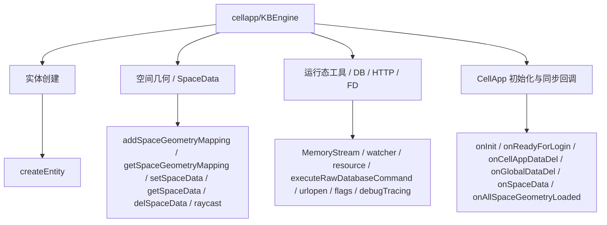
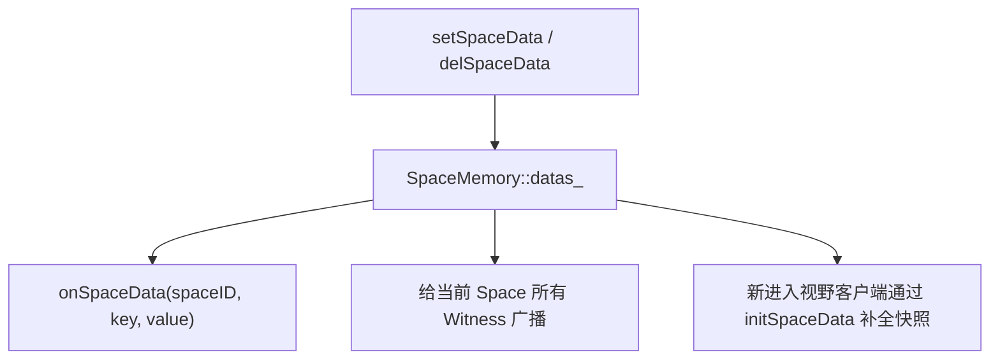

# CellApp 空间运行时 API

> 这一页只回答一个问题：`cellapp/KBEngine` 模块里那些高频 API，在源码里到底分别落到哪里。  
> 它不是在重复 `cellapp/Entity` 的实体行为，而是在回答：Cell 侧脚本宿主怎样管理空间几何、SpaceData、运行态工具、DB/HTTP/FD 工具，以及 CellApp 自己的初始化闸门。

## 先给结论

`cellapp/KBEngine` 最适合被理解成四层能力：

- Cell 侧实体工厂
- 空间运行时控制面
- 通用脚本宿主工具
- CellApp 组件级初始化与同步回调



所以读这组 API 时，最准确的问题不是“它是工具接口还是空间接口”，而是：

- **它到底是在改空间本身**
- **还是在给 CellApp 脚本宿主暴露运行态能力**

## 第一层：`createEntity()` 是在当前 CellApp 当前 Space 中直接落一个 Cell 实体

脚本注册点在 `kbe/src/server/cellapp/cellapp.cpp`：

```cpp
APPEND_SCRIPT_MODULE_METHOD(getScript().getModule(), createEntity, __py_createEntity, METH_VARARGS, 0);
```

真正的入口 `Cellapp::__py_createEntity(...)` 会强制要求：

- `entityType`
- `spaceID`
- `position`
- `direction`
- 可选 `params`

而且它先校验空间是否存在：

```cpp
SpaceMemory* space = SpaceMemorys::findSpace(spaceID);
if(space == NULL || !space->isGood())
{
    PyErr_Format(PyExc_TypeError, "KBEngine::createEntity: spaceID %ld not found.", spaceID);
    ...
}
```

创建主线随后很直接：

```cpp
Entity* pEntity = Cellapp::getSingleton().createEntity(entityType, params, false, 0);
...
pEntity->spaceID(space->id());
pEntity->createNamespace(params);
pEntity->pySetPosition(position);
pEntity->pySetDirection(direction);
pEntity->initializeScript();
space->addEntityAndEnterWorld(pEntity);
```

这说明它的准确语义不是：

- “向某个 Space 请求生成一个实体”

而是：

- **在当前 CellApp 进程里，直接创建一个 Cell 实体，然后立刻把它挂进指定 Space 并进入世界**

适合的场景：

- Cell 脚本在本地空间里创建机关、掉落、临时实体
- 已经明确知道目标 Space 就在当前 CellApp 上

它不适合：

- 需要跨 CellApp 选路或跨 Base/Cell 协调的创建链

## 第二层：`addSpaceGeometryMapping()` 管的不是“读资源目录”，而是把 Space 变成可导航、可碰撞的空间

这一组的核心不在 `cellapp.cpp`，而在 `spacememory.cpp`。

### Python 入口先做参数与资源校验

`SpaceMemory::__py_AddSpaceGeometryMapping(...)` 先校验：

- 参数个数必须是 3 到 5
- `params` 如果给了，必须是 `dict<int, string>`
- `spaceID` 对应的 `SpaceMemory` 必须存在
- `path` 必须能在 `Resmgr` 里匹配到

然后才进入真正的空间逻辑：

```cpp
if(!space->addSpaceGeometryMapping(path, shouldLoadOnServer, params))
{
    PyErr_Format(...);
    return 0;
}
```

这说明脚本层 `addSpaceGeometryMapping()` 不是无条件记一个字符串，而是：

- **显式请求某个已存在 Space 绑定一份几何映射，并在需要时启动服务端加载**

### `_mapping` 是保留的 SpaceData 键

空间几何路径最终落在：

```cpp
void SpaceMemory::setGeometryPath(const std::string& path)
{
    return setSpaceData("_mapping", path);
}
```

这很关键，因为它解释了两件事：

- `getSpaceGeometryMapping()` 本质上是在读保留键 `_mapping`
- 为什么普通 `setSpaceData / delSpaceData` 不允许操作 `_mapping`

源码里也明确禁止了这件事：

```cpp
if(kbe_stricmp(key, "_mapping") == 0)
{
    PyErr_Format(..., "key{_mapping} is protected!");
    ...
}
```

所以更准确的理解是：

- **空间几何映射本质上是 SpaceData 体系里的保留系统键**

### 真正的加载是在后台线程里完成

`SpaceMemory::addSpaceGeometryMapping(...)` 做完路径登记后，如果 `shouldLoadOnServer` 为真，会调用：

```cpp
loadSpaceGeometry(params);
```

而 `loadSpaceGeometry(...)` 又是：

```cpp
Cellapp::getSingleton().threadPool().addTask(new LoadNavmeshTask(getGeometryPath(), this->id(), params));
```

也就是说这不是主线程里直接读导航网格，而是：

- **把几何加载任务丢给线程池**

这也是它适合大场景导航数据加载的原因。

### `onSpaceGeometryLoaded()` 和 `onAllSpaceGeometryLoaded()` 当前源码里的真实触发关系

加载完成后的入口在：

```cpp
void SpaceMemory::onLoadedSpaceGeometryMapping(NavigationHandlePtr pNavHandle)
{
    pNavHandle_ = pNavHandle;
    ...
    SCRIPT_OBJECT_CALL_ARGS2(..., "onSpaceGeometryLoaded", "Is", this->id(), getGeometryPath().c_str(), false);
    onAllSpaceGeometryLoaded();
}
```

随后：

```cpp
void SpaceMemory::onAllSpaceGeometryLoaded()
{
    SCRIPT_OBJECT_CALL_ARGS3(..., "onAllSpaceGeometryLoaded", "Iis", this->id(), true, getGeometryPath().c_str(), false);
}
```

这意味着在**当前源码**里：

- `onSpaceGeometryLoaded(spaceID, mapping)`：某个空间几何加载成功时触发
- `onAllSpaceGeometryLoaded(spaceID, isBootstrap, mapping)`：当前实现里会紧跟着触发，而且 `isBootstrap` 这里直接传 `true`

这里要特别注意：

- API 原文描述了“多 Cell 共同负载时的 bootstrap 语义”
- 但当前这一条本地触发链里，`isBootstrap` 在这里没有做更复杂的多分片判定，而是直接给了 `true`

所以源码学习页更准确的结论应当是：

- **当前能明确看到的是本地空间几何加载完成后的回调链；更复杂的多 Cell 分片解释，不能仅凭这一段代码直接下结论**

### `getSpaceGeometryMapping()` 其实就是读当前 Space 的 geometry path

实现非常直接：

```cpp
return PyUnicode_FromString(space->getGeometryPath().c_str());
```

因此它不是去扫资源目录，也不是查外部管理器，而是：

- **读取当前 `SpaceMemory` 里登记的几何映射路径**

## 第三层：`setSpaceData()` / `getSpaceData()` / `delSpaceData()` 管的是 Space 的脚本级共享键值，而不是实体属性

### 这组数据直接挂在 `SpaceMemory::datas_`

底层实现很清楚：

```cpp
void SpaceMemory::setSpaceData(const std::string& key, const std::string& value)
{
    ...
    onSpaceDataChanged(key, value, false);
}

const std::string& SpaceMemory::getSpaceData(const std::string& key)
{
    ...
}

void SpaceMemory::delSpaceData(const std::string& key)
{
    ...
    onSpaceDataChanged(key, "", true);
}
```

这说明它不是属性系统，也不是持久化字段，而是：

- **挂在 SpaceMemory 上的一份字符串键值表**

### 变更后会同时通知脚本层和客户端 Witness

最重要的逻辑在 `onSpaceDataChanged(...)`：

1. 先回调入口脚本 `onSpaceData(spaceID, key, value)`
2. 再遍历空间里所有有 `Witness` 的实体
3. 把 `setSpaceData / delSpaceData` 转发给对应客户端

```cpp
SCRIPT_OBJECT_CALL_ARGS3(..., "onSpaceData", ...);
...
if(!isdel)
    pEntity->pWitness()->sendToClient(ClientInterface::setSpaceData, pSendBundle);
else
    pEntity->pWitness()->sendToClient(ClientInterface::delSpaceData, pSendBundle);
```

这就把它和普通服务端临时字典区分开了：

- **SpaceData 不是只给服务端脚本看的**
- **它会成为空间级客户端同步数据的一部分**

### 新进视野的客户端会补全一份当前 SpaceData 快照

`SpaceMemory::_addSpaceDatasToEntityClient(...)` 会在实体进入有 Witness 的空间时，把现有全部 `datas_` 通过 `ClientInterface::initSpaceData` 一次性补给客户端：

```cpp
ENTITY_MESSAGE_FORWARD_CLIENT_BEGIN(pSendBundle, ClientInterface::initSpaceData, init);
(*pSendBundle) << this->id();
for(; iter != datas_.end(); ++iter)
{
    (*pSendBundle) << iter->first;
    (*pSendBundle) << iter->second;
}
```

所以这组 API 的准确语义应该压缩成：

- `setSpaceData`：改空间共享键值并广播增量
- `getSpaceData`：读当前 Cell 上这份空间键值
- `delSpaceData`：删空间共享键值并广播删除
- `onSpaceData`：脚本层看见这次空间数据改动



常见使用场景：

- 当前场景天气、阶段、机关状态
- 场景 UI 所需的全局标记
- 某个 Space 对客户端公开的运行态信息

## 第四层：`raycast()` 不是通用物理查询，而是对 Space 当前导航句柄发射射线

脚本入口在 `Cellapp::__py_raycast(...)`，真正落到：

```cpp
int Cellapp::raycast(SPACE_ID spaceID, int layer, const Position3D& start, const Position3D& end, std::vector<Position3D>& hitPos)
{
    ...
    return pSpace->pNavHandle()->raycast(layer, start, end, hitPos);
}
```

这说明它有一个很硬的前提：

- 这个 Space 必须已经有 `pNavHandle()`
- 也就是几何映射和导航数据已经加载完成

因此它的准确语义不是：

- “对整个场景做通用碰撞检测”

而是：

- **对当前 Space 已加载的导航/几何句柄按指定 layer 发射一条射线**

常见使用场景：

- 判断某个点是否可落地
- 做地形高度探测
- 基于 navmesh layer 做不同地表检测

## 第五层：运行态工具 API 这边和 BaseApp 很像，但宿主是 CellApp 自己

### `MemoryStream / publish / scriptLogType / debugTracing / 资源 API`

这些都不是 CellApp 私有重新实现，而是沿用通用宿主：

- `MemoryStream` 在 `py_memorystream.cpp`
- `publish / scriptLogType / getWatcher / getWatcherDir / debugTracing / getResFullPath / hasRes / listPathRes / matchPath / open`
  都由 `EntityApp<E>` 统一挂载
- `addWatcher / delWatcher` 仍然来自 `pywatcher.cpp`
- `urlopen` 仍然来自 `pyurl.cpp`
- `registerReadFileDescriptor / registerWriteFileDescriptor / deregister*`
  仍然来自 `py_file_descriptor.cpp`

所以这组 API 在 CellApp 侧的准确理解不是：

- “CellApp 自己单独实现了一套工具”

而是：

- **CellApp 这个脚本宿主复用了整个服务端通用工具面**

这组前面在 [BaseApp 运行时 API](/architecture/source-analysis/baseapp-kbengine-runtime-api.md) 已经详细拆过，这里不重复展开原理，只强调一点：

- 同样的工具 API，放到 CellApp 上时，语义是“作用于当前 CellApp 进程”

### `address / isShuttingDown / getAppFlags / setAppFlags`

这组在 `cellapp.cpp` 自己有包装：

```cpp
APPEND_SCRIPT_MODULE_METHOD(getScript().getModule(), isShuttingDown, __py_isShuttingDown, ...);
APPEND_SCRIPT_MODULE_METHOD(getScript().getModule(), address, __py_address, ...);
APPEND_SCRIPT_MODULE_METHOD(getScript().getModule(), setAppFlags, __py_setFlags, ...);
APPEND_SCRIPT_MODULE_METHOD(getScript().getModule(), getAppFlags, __py_getFlags, ...);
```

因此它们的含义也很直接：

- `address()`：当前 CellApp 内部地址
- `isShuttingDown()`：当前 CellApp 是否进入关闭态
- `getAppFlags / setAppFlags()`：当前 CellApp 的运行标志

### `executeRawDatabaseCommand()`：CellApp 只是 DB 命令发起方与回包翻译器

这条链和 BaseApp 几乎同构：

```cpp
(*pBundle).newMessage(DbmgrInterface::executeRawDatabaseCommand);
(*pBundle) << eid;
(*pBundle) << (uint16)dbInterfaceIndex;
(*pBundle) << componentID_ << componentType_;
(*pBundle) << callbackID;
```

回包里也同样会组装四元组：

- `resultSet`
- `affectedRows`
- `lastInsertID`
- `errorMsg`

所以它的准确定位也是：

- **让 Cell 脚本层可以发原始 DB 命令，但 CellApp 本身不是 DB 权威方**

### `urlopen()` 和 FD 回调的适用场景

这两组 API 在 CellApp 的常见使用场景一般比 BaseApp 更偏运行时工具：

- `urlopen()`：对接外部配置中心、监控、旁路 HTTP 服务
- `register*FileDescriptor()`：把外部 fd 接进 CellApp 事件循环

## 第六层：`onInit(False/True)` 和 `onReadyForLogin()` 才是 CellApp 的启动闸门

### `onInit(False)` 并不是在 `onDbmgrInitCompleted()` 里直接调的

CellApp 的 `onDbmgrInitCompleted(...)` 做的事情是：

- 完成基础 EntityApp 初始化
- 更新环境变量
- 启动 `InitProgressHandler`

真正第一次调用入口脚本 `onInit(0)` 的地方，在 `cellapp/initprogress_handler.cpp`：

```cpp
if (!cellappReady_)
{
    cellappReady_ = true;
    PyObject* pyResult = PyObject_CallMethod(
        Cellapp::getSingleton().getEntryScript().get(),
        "onInit",
        "i",
        0);
    ...
}
```

所以更准确的理解是：

- `onDbmgrInitCompleted()`：引擎底层准备就绪
- `InitProgressHandler`：开始执行脚本层初始化阶段
- `onInit(False)`：脚本层第一次正式接管

### `reloadScript()` 最终会再次走 `onInit(True)`

`Cellapp::reloadScript(bool fullReload)` 最终还是走：

```cpp
EntityApp<Entity>::reloadScript(fullReload);
```

而 `EntityApp<E>::reloadScript(...)` 里会：

```cpp
EntityDef::reload(fullReload);
onReloadScript(fullReload);
PyObject* pyResult = PyObject_CallMethod(getEntryScript().get(), "onInit", "i", 1);
```

因此 `onInit` 在 CellApp 侧要连起来看：

- `onInit(False)`：首次启动初始化完成
- `onInit(True)`：热更新后重新初始化

### `onReadyForLogin()`：CellApp 自己的就绪进度也会参与登录闸门

在 `cellapp/initprogress_handler.cpp` 里，`onReadyForLogin(...)` 会被持续轮询：

```cpp
PyObject* pyResult = PyObject_CallMethod(
    Cellapp::getSingleton().getEntryScript().get(),
    "onReadyForLogin",
    "i",
    g_componentGroupOrder);
```

随后结果会通过：

```cpp
(*pBundle).newMessage(CellappmgrInterface::onCellappInitProgress);
(*pBundle) << g_componentID << v << g_componentGlobalOrder << g_componentGroupOrder;
```

上报给 `CellappMgr`。

这说明它不是一个“仅供本地脚本参考”的回调，而是：

- **CellApp 向系统声明：我现在离可接受登录还有多远**

这里还有一个和 API 文本需要区分的小点：

- API 文本把参数写成 `isBootstrap`
- 当前这条实现里传进去的是 `g_componentGroupOrder`

所以源码学习页更准确的说法应该是：

- **当前实现中，脚本实际拿到的是 CellApp 组内顺序值；是否把它当成 bootstrap 语义来解释，要以脚本层约定为准**

## 第七层：`onCellAppDataDel` / `onGlobalDataDel` / `onSpaceData` 的定位不同，不要混成一个“数据同步回调”

### `onCellAppDataDel`

在 `Cellapp::onBroadcastCellAppDataChanged(...)` 里，删除分支会：

```cpp
if(pCellAppData_->del(pyKey))
{
    SCRIPT_OBJECT_CALL_ARGS1(getEntryScript().get(), "onCellAppDataDel", "O", pyKey, false);
}
```

它对应的是：

- **CellApp 进程级共享字典 `cellAppData` 的删除广播**

### `onGlobalDataDel`

在 `EntityApp<E>::onBroadcastGlobalDataChanged(...)` 里，删除分支会：

```cpp
SCRIPT_OBJECT_CALL_ARGS1(getEntryScript().get(), "onGlobalDataDel", "O", pyKey, false);
```

它对应的是：

- **`BaseApp + CellApp` 共享的 `globalData` 删除广播**

### `onSpaceData`

这一个完全不走 `dbmgr` 全局字典，而是直接来自 `SpaceMemory::onSpaceDataChanged(...)`。

所以这三类数据回调的边界可以压缩成：

| 回调 | 面向的数据域 |
| --- | --- |
| `onCellAppDataDel` | 所有 CellApp 之间的进程级字典 |
| `onGlobalDataDel` | BaseApp 与 CellApp 共享的进程级字典 |
| `onSpaceData` | 当前 Space 的脚本级共享键值 |

## 第八层：这组 API 适合怎样使用

如果你是从问题倒着找源码，可以这样选入口：

1. 想知道“为什么某个 Space 设置了数据，客户端马上就能收到”  
   先看 `setSpaceData / onSpaceDataChanged / _addSpaceDatasToEntityClient`
2. 想知道“为什么 `raycast` 有时返回不了结果”  
   先看 `addSpaceGeometryMapping / pNavHandle / raycast`
3. 想知道“场景几何加载完到底会回调哪几个函数”  
   先看 `onLoadedSpaceGeometryMapping / onSpaceGeometryLoaded / onAllSpaceGeometryLoaded`
4. 想知道“CellApp 什么时候才算真正 ready”  
   先看 `InitProgressHandler` 里的 `onInit(False)` 和 `onReadyForLogin()`
5. 想知道“CellApp 这边的 watcher、fd、http、资源 API 归谁管”  
   先看 `EntityApp<E>`、`pywatcher.cpp`、`py_file_descriptor.cpp`、`pyurl.cpp`

## 与其他专题的关系

- Cell 实体自身的移动、AOI、Witness，看 [空间与 AOI](/architecture/source-analysis/space-aoi.md)
- Cell 实体定时器与热更新背景，看 [脚本运行时与热更新](/architecture/source-analysis/scripting.md)
- 全局字典同步链，看 [网络与消息系统](/architecture/source-analysis/networking.md#global-data-dicts-sync)
- 通用脚本宿主工具，看 [BaseApp 运行时 API](/architecture/source-analysis/baseapp-kbengine-runtime-api.md)

这一页只负责把这些动作收束回一句话：

- **`cellapp/KBEngine` 管的不是单个 Cell 实体行为，而是 CellApp 脚本宿主如何驱动 Space 运行时与组件级控制面**
