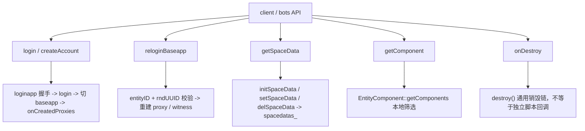
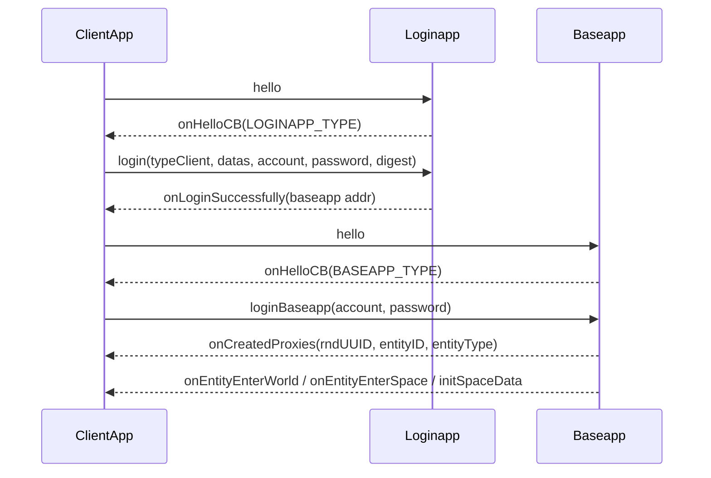
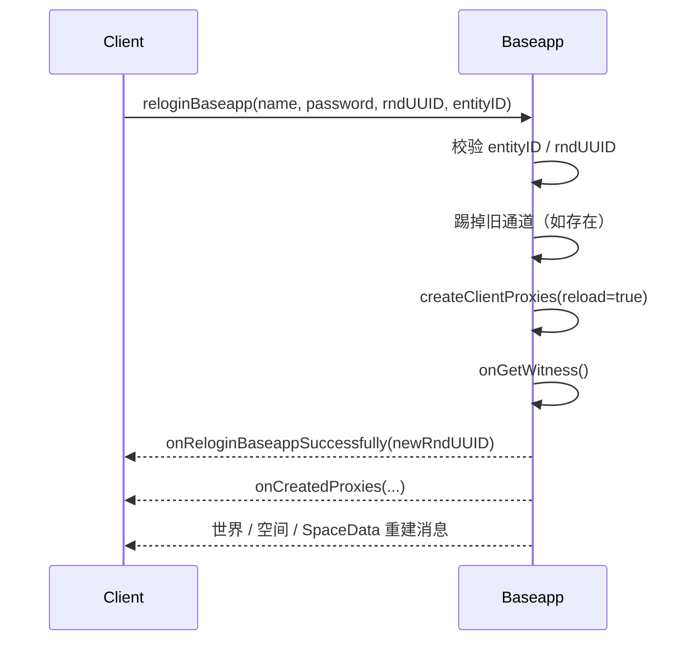
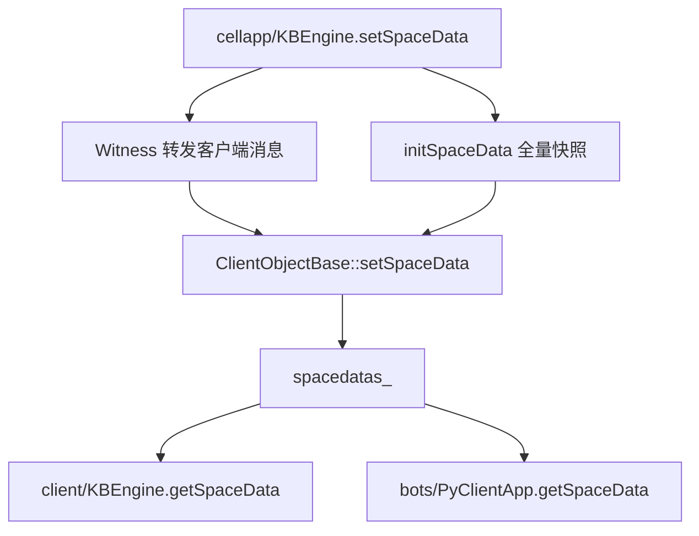
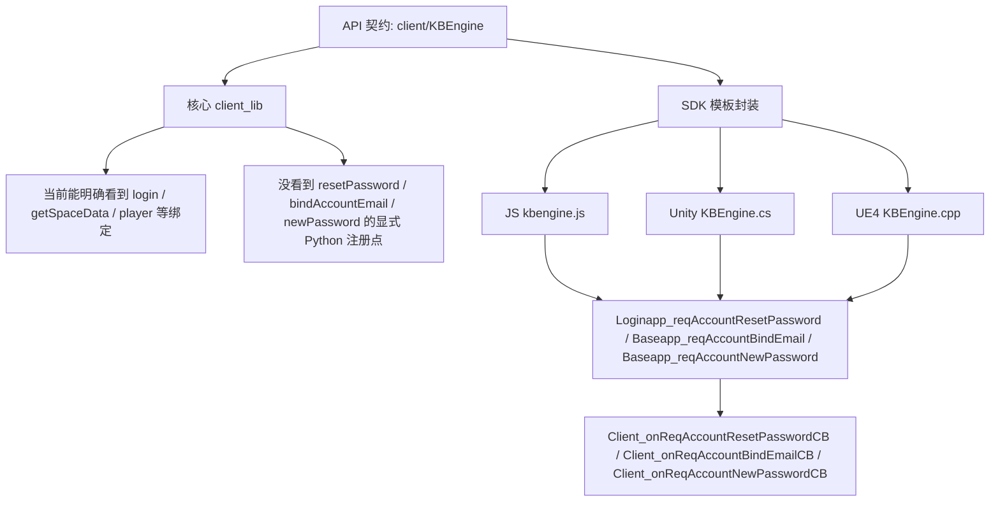

# 客户端登录、重登录与 SpaceData API

> 这一页只回答一个问题：`client/KBEngine`、`client/Entity`、`bots/PyClientApp`、`bots/Entity` 这一批高频接口，在源码里到底落在哪条客户端运行时主线上。
>
> 它不是在重复 API 原文，而是把“登录成功到底算到哪一步”“为什么 `getSpaceData()` 读到的是本地缓存”“`getComponent()` 会不会额外发网络”“`onDestroy()` 在当前源码里到底靠不靠谱”这些最容易混的边界收束起来。

## 先给结论

这批 API 最适合拆成五条主线理解：

- 登录链
- 重登录链
- 账号辅助链
- SpaceData 本地缓存链
- 客户端实体组件与销毁链



更准确地说：

- `login()` 不是“一次调用直接进世界”，而是至少三段式
- `reloginBaseapp()` 的关键不是“重新连上”，而是 `entityID + rndUUID`
- `getSpaceData()` 不是远程查询，而是读当前客户端保存的 `spacedatas_`
- `getComponent()` 不是 RPC，而是本地组件对象筛选
- `client/Entity.onDestroy()` 在当前源码里要谨慎理解，不能把 API 文本直接等同于一个明确可见的 `client_lib` 独立触发点

## 第一层：`client` 和 `bots` 共用同一条客户端运行时骨架

先把 API 和源码宿主对齐：

| API | 当前源码里的主要落点 |
| --- | --- |
| `client/KBEngine.getSpaceData` | `ClientObjectBase::__py_GetSpaceData()` |
| `bots/PyClientApp.getSpaceData` | 同样复用 `ClientObjectBase::__py_GetSpaceData()` |
| `client/Entity.getComponent` | `entity_macro.h` 里的 `pyGetComponent()` -> `EntityComponent::getComponents()` |
| `bots/Entity.getComponent` | 同样复用 `client_lib` 的实体组件访问链 |
| `client/KBEngine.login / createAccount` | `ClientApp` + `ClientObjectBase` 登录状态机 |
| `bots` 登录/建号 | `server/tools/bots/ClientObject` 的自动状态机，但底层消息链仍复用 `client_lib` 思路 |

所以这里最重要的架构结论不是“client 和 bots 不一样”，而是：

- `bots` 多出来的是自动推进状态机
- 真正的登录、实体表、SpaceData、句柄、组件访问主链，仍然围绕同一套客户端运行时模型

## 第二层：`login()` 不是一次成功，而是三段式

`ClientApp::login()` 做的第一件事不是直接发登录包，而是：

1. `updateChannel(true, ...)` 建立到 `loginapp` 的连接
2. 先发 `LoginappInterface::hello`
3. 等 `onHelloCB_()` 根据对端组件类型把状态切到 `C_STATE_LOGIN`
4. 再由 `ClientObjectBase::login()` 发真正的 `LoginappInterface::login`

真正的登录包内容里除了账号密码，还有：

- `typeClient_`
- `clientDatas_`
- entitydef 摘要 / digest

这说明 `login()` 从一开始就不是“纯账号密码校验”，而是：

- 先做协议握手
- 再做登录请求
- 再准备切换到目标 `baseapp`

### `onLoginSuccessfully()` 还不等于“已经进世界”

`ClientObjectBase::onLoginSuccessfully()` 只拿到了：

- `accountName`
- `baseappIP`
- `tcp_port`
- `udp_port`
- `serverDatas_`

`ClientApp::onLoginSuccessfully()` 随后只是把状态推进到 `C_STATE_LOGIN_BASEAPP_CHANNEL`。接下来客户端还要：

1. `updateChannel(false, ...)` 切到 `baseapp`
2. 再发一次 `BaseappInterface::hello`
3. 等 `onHelloCB_()` 把状态切到 `C_STATE_LOGIN_BASEAPP`
4. 再由 `ClientObjectBase::loginBaseapp()` 发 `BaseappInterface::loginBaseapp`

只有 `baseapp` 侧执行 `createClientProxies()` 并下发 `ClientInterface::onCreatedProxies` 之后，客户端才真正拿到：

- `entityID_`
- `rndUUID_`
- 当前连接对应的玩家实体类型



所以把 `login()` 的语义压缩成一句话就是：

- `onLoginSuccessfully()` 只代表账号登录链已经拿到 `baseapp` 入口
- `onCreatedProxies()` 才代表当前客户端会话已经真正绑定到 `Proxy`
- `onEntityEnterWorld()` / `onEntityEnterSpace()` / `initSpaceData()` 才代表玩家实体和当前空间上下文开始就绪

### 使用场景

- `login()`：正常首次进入游戏
- `onCreatedProxies()` 之后：才适合把“当前连接对应玩家实体”当成已建立对象来用
- `onEntityEnterSpace()` 之后：才适合读取当前空间上下文相关 UI / 玩法状态

## 第三层：`createAccount()` 只是建号请求，不自动等于登录完成

`ClientApp::createAccount()` 的主线比 `login()` 短：

1. `updateChannel(true, ...)`
2. `ClientObjectBase::createAccount()`
3. 发 `LoginappInterface::reqCreateAccount(name, password, datas)`

`ClientObjectBase::onCreateAccountResult()` 只负责：

- 解析 `retcode`
- 读取 `serverDatas_`
- 记录成功/失败

它本身不会像 `login()` 那样继续推进完整世界初始化链。

这里 `bots` 和普通 `client` 有一个很重要的差异：

- `ClientObject` 在 `server/tools/bots/clientobject.cpp` 里有自动状态机
- 建号成功或失败后，它会继续切到后续登录状态
- `ClientApp` 这边更像运行时底座，本身不替你做完整业务编排

所以如果你是从业务问题倒着找源码：

- 想看“建号成功后为什么 bots 会继续登录”
  先看 `ClientObject::onCreateAccountResult()`
- 想看“普通客户端建号只是发请求，后续怎么接”
  先看 `ClientObjectBase::onCreateAccountResult()`

## 第四层：`reloginBaseapp()` 的关键是 `entityID + rndUUID`

客户端侧的实现非常直接：

```cpp
(*pBundle).newMessage(BaseappInterface::reloginBaseapp);
(*pBundle) << name_;
(*pBundle) << password_;
(*pBundle) << rndUUID();
(*pBundle) << entityID_;
```

也就是说，重登录不是“拿账号再登一遍”。

它要求客户端带上：

- 当前认为自己对应的 `entityID`
- 当前会话随机标识 `rndUUID`

`Baseapp::reloginBaseapp(...)` 这边会严格校验：

1. `entityID` 对应的实体必须存在
2. 该实体必须还是 `Proxy`
3. 传入 `rndUUID` 必须和 `proxy->rndUUID()` 一致

如果旧通道还在，源码会先把旧通道踢掉，但这里特意没有走 `onClientDeath()`，因为注释已经说明：

- 避免脚本层在这个时点立刻销毁实体，影响后续重建流程

随后 `baseapp` 会：

1. 刷新 `clientEntityCall` 地址
2. 刷新 `proxyID`
3. 重新生成新的 `rndUUID`
4. `createClientProxies(proxy, true)`
5. `proxy->onGetWitness()`
6. 给客户端发 `onReloginBaseappSuccessfully(newRndUUID)`

### 需要特别记住的点

客户端侧 `ClientObjectBase::onReloginBaseappSuccessfully()` 只做了一件事：

- 更新本地 `rndUUID_`

它没有在这个回调里直接重建世界。

真正把客户端状态重新铺回来的，还是后面的：

- `onCreatedProxies`
- Witness / AOI 同步消息
- `onEntityEnterWorld`
- `onEntityEnterSpace`
- `initSpaceData`



### 使用场景

- 短时掉线后，希望尽快恢复同一个玩家实体控制权
- 不希望走完整账号重新选择 / 重新建号流程

## 第五层：`getSpaceData()` 读的是当前空间本地缓存，不是远程查询

`client/KBEngine.getSpaceData()` 和 `bots/PyClientApp.getSpaceData()` 的底层都收束到同一条链：

- `ClientObjectBase::initSpaceData()`
- `ClientObjectBase::setSpaceData()`
- `ClientObjectBase::delSpaceData()`
- `ClientObjectBase::getSpaceData()`

客户端保存这份数据的容器是：

- `spacedatas_`

### `initSpaceData()` 会先清旧空间，再灌当前空间快照

源码顺序很明确：

1. `clearSpace(false)`
2. 更新当前 `spaceID_`
3. 如果当前玩家实体已经存在，同步 `player->spaceID(spaceID_)`
4. 遍历收到的全部 `key/value`
5. 逐项调用 `setSpaceData(...)`

这意味着 `initSpaceData` 不是一个“小修小补”消息，而是：

- 当前空间上下文的完整快照初始化点

### `setSpaceData()` / `delSpaceData()` 是增量更新

`setSpaceData()` 会先校验：

- 收到的 `spaceID` 必须等于当前客户端记录的 `spaceID_`

然后才更新 `spacedatas_`。

这里还有一个特别重要的保留键：

- `_mapping`

当 key 是 `_mapping` 时，客户端会额外触发：

- `addSpaceGeometryMapping(spaceID, value)`

所以 `getSpaceData("_mapping")` 本质上就是：

- 当前空间几何映射路径的客户端侧缓存视图

### `getSpaceData()` 不是“没有就返回空串”

Python 包装层 `__py_GetSpaceData()` 在 key 不存在时会直接报错，而不是静默返回空值。

所以业务上更准确的用法是：

- 只在确认该 key 会被服务端设置时读取
- 或者先在更高层做存在性约定



### 使用例子

```python
phase = KBEngine.getSpaceData("phase")
if phase == "battle":
    showBossHud()
```

```python
weather = self.clientapp.getSpaceData("weather")
if weather == "rain":
    self.enableRainAI()
```

更适合放进 `SpaceData` 的内容：

- 当前场景阶段
- 当前场景天气
- 当前场景 UI 所需的全局标记

不适合放进去的内容：

- 单个实体私有状态
- 需要实时 RPC 查询才可靠的会话级数据

## 第六层：`getComponent()` 是本地组件访问，不会额外发网络

`client/Entity.getComponent()` 和 `bots/Entity.getComponent()` 最终都走 `entity_macro.h` 里的通用实现：

1. `pyGetComponent(componentName, all)`
2. `EntityComponent::getComponents(componentName, this, pScriptModule_)`

`EntityComponent::getComponents(...)` 做的事情很简单：

- 遍历当前实体 `.def` 里的组件描述
- 只保留名字匹配的组件类型
- 在 `client / bots` 域只保留 `hasClient()` 的组件
- 直接从当前实体对象上取对应组件属性

所以这条 API 的真实语义是：

- 在本地已创建好的实体对象上，筛出“当前客户端域可见”的组件对象

不是：

- 额外向服务端查组件
- 临时创建一个远端组件代理

### 返回规则

- `all=False`
  返回第一个匹配组件；没有就返回 `None`
- `all=True`
  返回包含全部匹配组件的 `tuple`

### 使用例子

```python
weapon = entity.getComponent("Weapon")
if weapon:
    weapon.reload()
```

```python
buff_slots = entity.getComponent("BuffSlot", True)
for slot in buff_slots:
    slot.refreshClientView()
```

### 这里最容易误解的边界

即使某个组件在服务端实体上存在，只要它没有暴露 `client` 域：

- `getComponent()` 这里也不会返回它

所以这个接口回答的问题不是：

- “这个实体有没有这种组件”

而是：

- “这个实体在当前客户端脚本域里，是否可见这种组件”

## 第七层：`onDestroy()` 在当前源码里要谨慎理解

客户端实体销毁的主入口是：

- `ClientObjectBase::destroyEntity(eid, callScript)`

它会先把实体从 `pEntities_` 实体表里移除，然后调用：

- `entity->destroy(callScript)`

而真正的销毁顺序来自通用实体宏：

1. 标记 `isDestroyed_`
2. `EntityComponent::onEntityDestroy(..., beforeDestroy=true)`
3. `onDestroy(callScript)`
4. 清空脚本定时器
5. `EntityComponent::onEntityDestroy(..., beforeDestroy=false)`
6. 清空事件表

问题在于：

- `client::Entity::onDestroy(bool callScript)` 在当前 `client_lib` 源码里是空实现

也就是说，按当前这份源码能明确看到的是：

- 销毁链本身存在
- 组件 detach / destroyed 清理存在
- 定时器与事件清理存在

但我**没有在当前 `client_lib` 里看到一个与 `docs/api/client/Entity.md#onDestroy` 对应的独立脚本回调触发点**，能像 `onLeaveWorld()` 那样明确落在源码里。

因此更稳妥的源码结论应该是：

- 当前客户端侧可稳定依赖的“销毁前通知”主线，还是 `onLeaveWorld()` 与 `onEntityDestroyed()` 这两条
- API 中的 `onDestroy()` 契约保留，但在当前源码实现里不能把它简单当成一个已经明确落地的独立 `client_lib` 回调点

### 客户端实体最常见的两条销毁路径

1. `onEntityLeaveWorld()`
   非玩家实体通常会在 `onLeaveWorld()` 之后继续 `destroyEntity(eid, false)`
2. `onEntityDestroyed()`
   某些还没进世界或已经脱离世界集合的实体，会直接走这条显式销毁消息链

所以如果你的业务目标是“做客户端清理”，当前源码里更稳妥的挂点通常是：

- `onLeaveWorld()`
- 以及更高层的实体表变更感知

而不是先假设 `onDestroy()` 一定像 API 文本那样单独可靠地触发。

## 第八层：`resetPassword / bindAccountEmail / newPassword` 的当前源码差异

这一组接口要单独说，因为它们和前面的 `login / createAccount / getSpaceData` 不一样。

在当前开源仓库的 `ClientApp::installEntityDef()` 里，能明确看到注册进 `KBEngine` 模块的有：

- `player`
- `getSpaceData`
- `callback / cancelCallback`
- `disconnect`
- `getWatcher / getWatcherDir`
- 资源路径相关接口

但**我没有在当前 `client_lib` 代码树里找到 `resetPassword / bindAccountEmail / newPassword` 这三个客户端 `KBEngine.*` 入口的直接脚本注册点**。

不过这里还不能直接下结论说“接口不存在”，因为在 SDK 模板里，这三条客户端能力是明确实现了的：

- JS：`kbe/res/sdk_templates/client/js/kbengine.js`
- Unity：`kbe/res/sdk_templates/client/unity/KBEngine.cs`
- UE4：`kbe/res/sdk_templates/client/ue4/Source/KBEnginePlugins/Engine/KBEngine.cpp`

也就是说，当前更准确的边界不是：

- “这三个接口在工程里根本没有实现”

而是：

- 开源核心 `client_lib` 里暂时没有看到直接暴露给 Python `KBEngine` 模块的显式注册点
- 但官方 SDK 模板已经把这三条请求链和客户端回包封装好了
- 所以它们更像“SDK 侧已明确提供，当前核心 Python 客户端源码树里缺直观绑定落点”的一组接口

这意味着按当前源码能稳定追到的是：

- 服务端处理链
- 客户端回包消息语义

而不是一个明确的 `client_lib` Python 绑定实现。

### 先看 SDK 模板对照

这一层很重要，因为它回答的是“如果不是 `client_lib` 明注册，那客户端这一头到底谁在发消息、谁在收回包”。



三套模板的共同点很一致：

- `resetPassword` 都是向 `loginapp` 发 `reqAccountResetPassword`
- `bindAccountEmail` 都是向 `baseapp` 发 `reqAccountBindEmail`
- `newPassword` 都是向 `baseapp` 发 `reqAccountNewPassword`
- 回包都收束到对应的 `Client_onReqAccount*CB`

所以如果你站在“怎么用”这个角度看，这三条链并没有缺；缺的是“当前开源 Python 客户端运行时里，这三个入口是在哪个模块注册给脚本层”的那一跳显式源码落点。

### `resetPassword`

当前能明确追到的主线是：

1. `Loginapp::reqAccountResetPassword(accountName)`
2. 转发给 `Dbmgr`
3. `Loginapp::onReqAccountResetPasswordCB(...)`
4. 成功时投递发送重置邮件任务

这里要注意一个边界：

- `Loginapp::reqAccountResetPassword()` 在把请求交给 `Dbmgr` 后，会先给客户端回一个 `onReqAccountResetPasswordCB(SERVER_SUCCESS)`
- 这更像“请求已受理”
- 不等于“邮件已经真正发送完成”

SDK 模板侧对应得也很直接：

- JS 模板里 `resetPassword(username)` 会发 `Loginapp_reqAccountResetPassword`
- Unity 模板里 `resetPassword(string username)` 也是同一条消息
- UE4 模板里 `resetPassword(const FString& username)` 也是同一条消息

所以这条接口更像：

- 客户端发起“找回密码申请”
- 服务端确认“请求已受理”
- 邮件发送是后续异步任务，不应在业务上把回包等同于“邮箱已收到邮件”

### `bindAccountEmail`

当前能明确追到的主线是：

1. `Baseapp::reqAccountBindEmail(entityID, password, email)`
2. 先校验在线实体和 `__ACCOUNT_NAME__`
3. 转发 `Dbmgr`
4. `Baseapp::onReqAccountBindEmailCBFromDBMgr(...)`
5. 再经 `BaseappMgr` 分配回调 `loginapp`
6. `loginapp` 侧异步投递发送绑定邮件任务
7. 最后客户端收到 `ClientInterface::onReqAccountBindEmailCB`

所以它不是纯 `baseapp -> client` 的短链，而是：

- `baseapp -> dbmgr -> baseappmgr -> loginapp -> client`

SDK 模板侧也都把它封装成当前在线会话上的请求：

- JS 模板 `bindAccountEmail(emailAddress)` 发 `Baseapp_reqAccountBindEmail`
- Unity 模板 `bindAccountEmail(string emailAddress)` 发同名消息
- UE4 模板 `bindAccountEmail(const FString& emailAddress)` 也是同名消息

所以这条接口的真实使用前提不是“只要知道账号名就能调”，而是：

- 当前客户端已经连在一个在线 `Proxy` 会话上
- `baseapp` 能通过当前实体拿到 `__ACCOUNT_NAME__`

### `newPassword`

当前能明确追到的主线是：

1. `Baseapp::reqAccountNewPassword(entityID, oldpassword, newpassword)`
2. 依赖在线账号实体的 `__ACCOUNT_NAME__`
3. 转发给 `Dbmgr`
4. `Baseapp::onReqAccountNewPasswordCB(...)`
5. 客户端收到 `ClientInterface::onReqAccountNewPasswordCB`

这条链比绑定邮箱短，不需要再借 `loginapp` 做邮件回调分配。

SDK 模板侧也和服务端链保持一致：

- JS 模板 `newPassword(old_password, new_password)` 发 `Baseapp_reqAccountNewPassword`
- Unity 模板 `newPassword(string old_password, string new_password)` 发同名消息
- UE4 模板 `newPassword(const FString& old_password, const FString& new_password)` 也是同名消息

所以它的使用边界也更清楚：

- 这不是离线账号接口
- 它依赖当前在线账号实体上下文

### 当前更准确的源码结论

- API 契约里有这三项客户端接口
- 当前源码树里我没有找到对应的 `client_lib` 直接模块注册点
- 但服务端处理链和客户端回包消息语义是可以明确追出来的

因此这一组在覆盖矩阵里更适合记成：

- `createAccount / getSpaceData`：已深入解析
- `resetPassword / bindAccountEmail / newPassword`：已解释服务端链、客户端回包和 SDK 模板对照
- 但若标准要求“必须在当前核心 `client_lib` 里找到直连 Python 模块注册点”，那这三项更适合记成“部分覆盖”

## 第九层：这组 API 适合怎样使用

1. 想判断“账号登录成功后为什么还不能立刻拿当前玩家 `cell`”
   先看 `onLoginSuccessfully()`、`onCreatedProxies()`、`onEntityEnterWorld()` 这三段边界
2. 想判断“掉线重连为什么要带 `rndUUID`”
   先看 `reloginBaseapp()` 与 `Baseapp::reloginBaseapp()`
3. 想判断“某个场景标记为什么客户端读不到”
   先看 `initSpaceData()`、`setSpaceData()`、`spaceID_` 校验
4. 想判断“`getComponent()` 会不会触发网络请求”
   先看 `EntityComponent::getComponents()`
5. 想做客户端清理
   当前源码里优先看 `onLeaveWorld()` 和显式销毁链，不要先假设 `client/Entity.onDestroy()` 一定有独立稳定触发点

## 与其他专题的关系

- 代理会话、`createClientProxies()`、客户端接管边界，看 [Proxy 会话与流式传输 API](/architecture/source-analysis/proxy-client-session-api.md)
- `baseapp` 侧重登录实现，看 [BaseApp 运行时 API](/architecture/source-analysis/baseapp-kbengine-runtime-api.md)
- `cellapp` 侧 `SpaceData` 生产端，看 [CellApp 空间运行时 API](/architecture/source-analysis/cellapp-kbengine-space-runtime-api.md)
- 客户端句柄表、世界/空间回调主线，看 [网络与消息系统](/architecture/source-analysis/networking.md)

这一页只负责把这批接口重新收束回一句话：

- `client / bots` 这组 API 的核心不是“提供多少工具函数”，而是把客户端会话、玩家实体、当前空间上下文和本地组件视图连成一条可追源码的运行时主线
