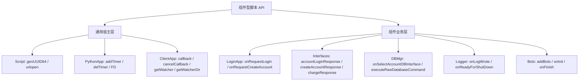
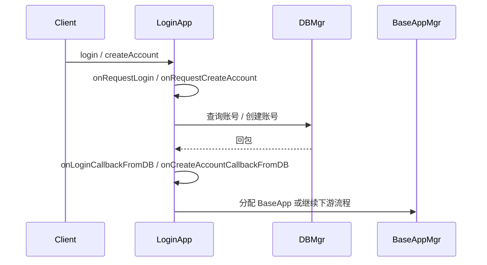
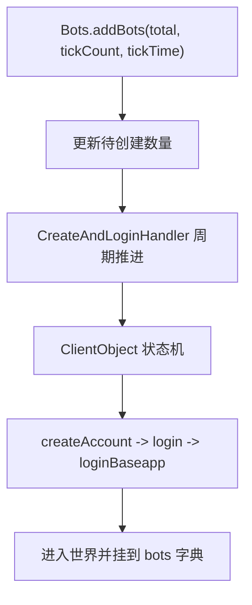

# 组件型脚本 API：LoginApp、Interfaces、DBMgr、Logger 与 Bots

> 这一页只回答一个问题：`loginapp / interfaces / dbmgr / logger / bots` 这批**非实体组件型**脚本 API，在源码里到底落在哪些宿主层上，以及它们分别负责哪一段业务链。
>
> 这页不再重复 `api/kbengine/**` 原文，而是把最容易混在一起的几类问题拆开：
>
> - 哪些能力是所有组件共享的通用宿主能力
> - 哪些能力是某个组件自己额外挂出来的
> - 登录、建号、充值、账号库选择、日志转储、机器人批量接入这些链路分别在哪一层结束

## 先给结论

这批 API 不能混成一个“脚本工具箱”，它们至少分成两层：

- 通用脚本宿主层
- 组件业务控制面



最重要的架构结论是：

- `loginapp / interfaces / dbmgr / logger` 这四类组件，脚本宿主底座更接近 `Script + PythonApp`
- `bots` 不属于这条线，它复用了客户端运行时底座 `ClientApp`
- 所以 `bots/KBEngine.callback`、`getWatcher`、`cancelCallback` 这类接口，不应该和服务端组件的 `addTimer`、`delTimer` 混为同一套实现

## 第一层：先分清谁在给脚本模块挂接口

### `Script` 这一层挂的是全局工具

`kbe/src/lib/pyscript/script.cpp` 里直接给 `KBEngine` 模块注册了：

- `genUUID64`

而 `kbe/src/lib/pyscript/pyurl.cpp` 则通过 `PyUrl::initialize()` 给脚本模块统一挂入：

- `urlopen`

`script.cpp` 初始化顺序里也能明确看到：

1. `PyProfile::initialize(this)`
2. `PyStruct::initialize()`
3. `Copy::initialize()`
4. `PyUrl::initialize(this)`
5. `PyPlatform::initialize()`

这说明 `urlopen` 不是 `loginapp`、`dbmgr`、`logger` 自己分别实现的，而是：

- **所有脚本宿主都共享的通用 HTTP 异步接口**

同理，`genUUID64` 也是：

- **全局脚本模块级能力，不属于某个具体组件独占**

### `PythonApp` 这一层挂的是服务端组件共有运行时能力

`kbe/src/lib/server/python_app.cpp` 里统一给所有 `PythonApp` 宿主注册了：

- `addTimer`
- `delTimer`
- `registerReadFileDescriptor`
- `registerWriteFileDescriptor`
- `deregisterReadFileDescriptor`
- `deregisterWriteFileDescriptor`

所以 `loginapp / interfaces / dbmgr / logger` 这几类组件里的：

- `addTimer / delTimer`
- 文件描述符回调

都不是各自重新造了一套，而是：

- **共享 `PythonApp` 这层通用脚本宿主**

### `ClientApp` 这一层挂的是客户端运行时能力

`bots` 这边不走 `PythonApp`，而是继承 `ClientApp`。

`kbe/src/lib/client_lib/clientapp.cpp` 里能明确看到注册进 `KBEngine` 模块的有：

- `callback`
- `cancelCallback`
- `getWatcher`
- `getWatcherDir`
- `player`
- `getSpaceData`
- `disconnect`
- 资源路径相关接口

而 `kbe/src/server/tools/bots/bots.cpp` 自己额外挂出来的只有两类：

- `addBots`
- `scriptLogType`

所以 `bots/KBEngine` 的准确理解应该是：

- `addBots` 是 Bots 自己的控制面
- `callback / cancelCallback / getWatcher / getWatcherDir / urlopen / genUUID64` 这类更多是从 `ClientApp + Script` 宿主继承下来的

## 第二层：LoginApp 管的是“外部登录入口前半段”，不是完整账号闭环

`loginapp` 侧最核心的不是工具函数，而是四个脚本回调：

- `onLoginAppReady`
- `onRequestLogin`
- `onLoginCallbackFromDB`
- `onRequestCreateAccount`
- `onCreateAccountCallbackFromDB`
- `onLoginAppShutDown`

### `onLoginAppReady()` / `onLoginAppShutDown()`

`kbe/src/server/loginapp/loginapp.cpp` 里：

- `initializeEnd()` 会在脚本加载完成后调用 `onLoginAppReady()`
- `onShutdownBegin()` 会调用 `onLoginAppShutDown()`

所以这两个回调的定位很直接：

- `onLoginAppReady()`：LoginApp 已完成脚本与网络宿主初始化
- `onLoginAppShutDown()`：LoginApp 进入关闭流程前的脚本通知

### `onRequestCreateAccount()`：它是“建号前置过滤器”

`Loginapp::_createAccount(...)` 里会先把请求交给脚本：

```cpp
PyObject_CallMethod(getEntryScript().get(),
    "onRequestCreateAccount",
    "ssy#",
    accountName.c_str(),
    password.c_str(),
    datas.c_str(), datas.length());
```

源码要求这段回调返回的不是任意对象，而是：

- 一个错误码
- 或一个四元组：`(errorno, accountName, password, datas)`

这说明 `onRequestCreateAccount()` 的真实语义不是“建号已经完成”，而是：

- **把客户端提交的建号请求交给入口脚本做改名、拒绝、补充数据、接第三方前置校验**

### `onCreateAccountCallbackFromDB()`：它是 DB 返回后的后置观察点

DBMgr 回包回来之后，`loginapp` 会调用：

- `onCreateAccountCallbackFromDB(accountName, failedcode, datas)`

随后才会继续取出 pending create 里的请求，并把结果回给客户端。

所以这条回调的准确定位是：

- **建号链路从 DB 返回后的脚本后置回调**

它适合做：

- 记录建号结果
- 给建号失败做埋点
- 把 DB 回来的附加数据再做业务观察

### `onRequestLogin()`：它是登录入口过滤器，不是 DB 结果回调

`Loginapp::login(...)` 在真正走后续登录链之前，会先调：

- `onRequestLogin(loginName, password, clientType, datas)`

源码要求它返回：

- 一个错误码
- 或一个五元组：`(errorno, loginName, password, clientType, datas)`

所以这条回调的本质是：

- **登录请求进入 DB / baseapp 分配之前的入口过滤与改写点**

它适合做：

- 白名单 / 黑名单 / 排队
- 第三方 token 转真实账号
- 改写 `datas`
- 改写客户端类型

### `onLoginCallbackFromDB()`：它是账号核验后的后置观察点

当 DB 登录结果回来之后，`loginapp` 再调用：

- `onLoginCallbackFromDB(loginName, accountName, retcode, datas)`

随后才继续决定：

- 是直接失败返回客户端
- 还是继续去找 `baseappmgr` 分配目标 `baseapp`

所以它的准确语义是：

- **账号校验结果已经出来，但当前会话还没真正切到目标 BaseApp**



### 使用场景

- `onRequestLogin()`：做入口风控、排队、第三方票据换真实账号
- `onLoginCallbackFromDB()`：做登录成功/失败观测、结果修正
- `onRequestCreateAccount()`：做建号白名单、账号名规范化、第三方建号接入
- `onCreateAccountCallbackFromDB()`：做建号结果追踪

## 第三层：Interfaces 管的是“引擎把业务判定外包给脚本”的异步控制面

如果说 `loginapp` 更像“入口过滤器”，那 `interfaces` 更像：

- **引擎把登录、建号、充值这三类业务决策交给外部脚本，然后等待脚本回填结果**

它最重要的不是单个回调，而是“请求回调 + 响应提交”成对出现。

### `onInterfaceAppReady()` / `onInterfaceAppShutDown()`

`kbe/src/server/tools/interfaces/interfaces.cpp` 里：

- 初始化结束时调 `onInterfaceAppReady()`
- `onShutdownBegin()` 时调 `onInterfaceAppShutDown()`

所以这两个回调仍然是：

- 组件宿主生命周期挂点

### `onRequestCreateAccount()` + `createAccountResponse()`

当外部建号请求进入 `interfaces` 后，源码会：

1. 保存 `reqCreateAccount_requests_`
2. 回调脚本 `onRequestCreateAccount(registerName, password, datas)`
3. 等脚本随后调用 `KBEngine.createAccountResponse(...)`

`createAccountResponse(...)` 会：

1. 从 `reqCreateAccount_requests_` 里取出对应 task
2. 组装 `DbmgrInterface::onCreateAccountCBFromInterfaces`
3. 把 `baseappID / commitName / realAccountName / password / errorCode / datas` 发回引擎下游

这说明它不是同步 return 模式，而是：

- **脚本先接到请求，后续再显式提交结果**

### `onRequestAccountLogin()` + `accountLoginResponse()`

登录链和建号链同构：

1. 保存 `reqAccountLogin_requests_`
2. 回调脚本 `onRequestAccountLogin(loginName, password, datas)`
3. 脚本后续调用 `KBEngine.accountLoginResponse(...)`
4. `interfaces` 再把结果转成 `DbmgrInterface::onLoginAccountCBBFromInterfaces`

所以这条链最适合的理解是：

- **Interfaces 不是自己决定登录是否成功，而是承接一个“外部异步账号系统”的判定结果**

### `onRequestCharge()` + `chargeResponse()`

充值链也是同样模式：

1. 订单进入 `interfaces`
2. 回调 `onRequestCharge(ordersID, entityDBID, datas)`
3. 脚本后续调用 `KBEngine.chargeResponse(orderID, extraDatas, errorCode)`
4. 引擎把结果转回 `DbmgrInterface::onChargeCB`

这里还有个很重要的边界：

- 如果订单在本地 `orders_` 里找不到，源码仍然会尽量把失败回包广播给相关下游，避免 `baseapp` 一侧完全收不到 `onLoseChargeCB`

### `executeRawDatabaseCommand()`：Interfaces 只是 DB 命令代理

`interfaces` 也挂了 `executeRawDatabaseCommand()`。

它的做法和 `baseapp / cellapp / dbmgr` 类似：

1. 保存 Python callback
2. 组装 `DbmgrInterface::executeRawDatabaseCommand`
3. 由 DBMgr 执行
4. 回包后再把 `(resultSet, affectedRows, lastInsertID, errorMsg)` 回调给 Python

所以这里更准确的理解是：

- **Interfaces 可以发原始 DB 命令，但它不是 DB 权威方**

### 使用场景

- `onRequestAccountLogin()`：接第三方账号系统
- `accountLoginResponse()`：第三方鉴权完成后把结果回灌给引擎
- `onRequestCreateAccount()`：接第三方建号平台
- `createAccountResponse()`：提交真实账号名与附加数据
- `onRequestCharge()`：接支付平台
- `chargeResponse()`：把支付结果回灌给引擎和 BaseApp

## 第四层：DBMgr 管的是“数据库执行与账号库路由”

`dbmgr` 这层不负责登录入口过滤，也不负责第三方业务判定。

它更像：

- **数据库执行中枢**

### `onDBMgrReady()` / `onDBMgrShutDown()` / `onReadyForShutDown()`

`dbmgr.cpp` 里能明确看到：

- 初始化完成后调 `onDBMgrReady()`
- `onShutdownBegin()` 调 `onDBMgrShutDown()`
- `canShutdown()` 会反复询问 `onReadyForShutDown()`

而且 `canShutdown()` 不只是简单看脚本返回值，它还会继续检查：

- DB 线程池里是否还有任务
- `cellapp` 是否都已销毁
- `baseapp` 是否都已销毁

所以 `onReadyForShutDown()` 的准确语义不是：

- “脚本说能关就立刻关”

而是：

- **脚本层的关闭闸门 + 引擎内部 DB/组件收尾条件的联合判定**

### `onSelectAccountDBInterface()`：账号库路由点

`Dbmgr::selectAccountDBInterfaceName(...)` 里会调用：

- `onSelectAccountDBInterface(accountName)`

然后检查脚本返回的数据库接口名是否存在。

如果不存在，就回退到：

- `default`

所以这条 API 的真实职责是：

- **根据账号名，把账号相关操作路由到某个数据库接口**

这正是 `dbmgr/KBEngine.md` 里最有组件特色的一项接口，它不属于通用工具，而是：

- DBMgr 作为多数据库路由层的职责入口

### `executeRawDatabaseCommand()`：DBMgr 自己也能在本地执行原始命令

DBMgr 自己挂的 `executeRawDatabaseCommand()` 与 Interfaces 一样，也支持：

- Python callback
- `dbInterfaceName`
- `eid`

但差别在于：

- `dbmgr` 自己就是执行方
- 它最终会在本地把结果解包后，再回调 Python

所以从架构上说：

- `interfaces.executeRawDatabaseCommand()` 更像远程代理
- `dbmgr.executeRawDatabaseCommand()` 更像本地数据库宿主能力

### 使用场景

- `onSelectAccountDBInterface()`：按账号名前缀、分区规则、平台来源路由数据库
- `executeRawDatabaseCommand()`：做管理表、审计表、旁路查询
- `onReadyForShutDown()`：等待批量 DB 任务、安全下线

## 第五层：Logger 管的是“日志落库/落盘前后的脚本观察与筛选”

`logger` 这层最关键的不是定时器，也不是 `urlopen`，而是：

- `onLogWrote(datas)`

### `onLoggerAppReady()` / `onLoggerAppShutDown()` / `onReadyForShutDown()`

`logger.cpp` 里：

- 初始化结束后调 `onLoggerAppReady()`
- `onShutdownBegin()` 里调 `onLoggerAppShutDown()`
- `canShutdown()` 里询问 `onReadyForShutDown()`

它们和 `dbmgr` 的生命周期挂点相似，但职责更偏：

- 日志系统准备就绪
- 日志系统关闭前清理

### `onLogWrote(datas)`：它不是“读日志文件”，而是接实时日志事件

`logger.cpp` 里在处理新日志时，会先拼出完整日志字符串 `sLog`，然后：

1. 如果脚本实现了 `onLogWrote`
2. 就把日志 bytes 传进去
3. 根据脚本返回值，决定当前日志是否继续持久化
4. 如果脚本返回了字符串，还会替换最终输出内容

这说明 `onLogWrote(datas)` 的真实语义不是：

- “收到一份已经最终写完的日志文件内容”

而是：

- **Logger 进程在处理每条新日志时，给脚本一个实时干预点**

它可做的事情包括：

- 日志转储
- 脱敏
- 过滤某类日志不落持久层
- 改写最终输出文本

### 使用场景

- 只持久化 ERROR/WARNING
- 对账号、手机号、token 做脱敏
- 把特定日志转发到外部日志系统
- 给运营/审计日志做旁路归档

## 第六层：Bots 管的是“批量创建客户端会话”，不是服务端组件 API 的简单镜像

`bots` 要单独看，因为它的运行时底座和前四类不同。

### `onInit()` / `onFinish()`

`bots.cpp` 里：

- `initializeEnd()` 调 `onInit(0)`
- `finalise()` 先调 `onFinish()`

这里的风格更像客户端运行时，而不是 `PythonApp` 风格的 `onXxxReady / onXxxShutDown`。

所以 `bots/KBEngine.onInit` 与 `onFinish` 更准确的理解是：

- **Bots 客户端运行时入口与结束钩子**

### `addBots()`：它只是调高“待创建待登录”的机器人数量，不是瞬时完成

`Bots::__py_addBots(...)` 并不是立刻循环 new 完所有机器人，而是更新：

- `reqCreateAndLoginTotalCount_`
- 可选的 `reqCreateAndLoginTickCount_`
- 可选的 `reqCreateAndLoginTickTime_`

随后真正的批量推进，是在 `CreateAndLoginHandler` 和 `ClientObject` 自动状态机里逐步完成。

所以它的准确语义是：

- **向 Bots 运行时提交一份批量创建/登录计划**

而不是：

- “同步地创建完所有机器人”

### `callback / cancelCallback / getWatcher / getWatcherDir`

这几项并不是 `bots.cpp` 自己注册的，而是：

- `Bots -> ClientApp -> ClientObjectBase`

这条链继承下来的客户端运行时能力。

所以文档上更准确的说法是：

- `bots/KBEngine.callback`：本地客户端脚本回调调度
- `bots/KBEngine.getWatcher*`：读本地 Watcher 树

而不是：

- Bots 自己额外实现的组件级脚本 API

### `urlopen` / `genUUID64`

这两项也要谨慎表述：

- `urlopen` 来自 `Script -> PyUrl::initialize()`
- `genUUID64` 来自 `Script::install()`

所以它们在 `bots/KBEngine` 里可用，更准确地说是：

- **脚本模块全局能力被 Bots 运行时复用**

并不是 `bots.cpp` 单独显式注册的接口。

### `genUUID64` 的当前源码边界

当前源码里能明确看到：

- `genUUID64` 确实被 `Script` 统一挂进 `KBEngine` 模块
- `bots` 内部的 `create_and_login_handler.cpp` 也在 C++ 里直接用它生成账号后缀

所以这项可以看作：

- API 契约与当前源码一致
- 它属于全局脚本宿主能力，不属于 Bots 私有实现

### 使用场景

- `addBots()`：压测、批量建号登录、批量连线
- `callback()`：为单个 bots 脚本安排一次延迟逻辑
- `getWatcher()`：在 bots 侧观测本地运行态
- `onFinish()`：压测结束后统一清理



## 第七层：这五类组件最容易混淆的边界

### `loginapp` 和 `interfaces` 的区别

- `loginapp`：更靠近引擎入口校验和 DB 结果回流
- `interfaces`：更靠近“把业务决策外包给第三方/脚本，然后异步回填结果”

### `interfaces` 和 `dbmgr` 的区别

- `interfaces`：业务适配器
- `dbmgr`：数据库执行中枢与账号库路由器

### `logger` 和其他组件的区别

- `logger`：不是业务流组件，而是日志事件处理组件

### `bots` 和前四类的区别

- `bots`：不是 `PythonApp` 型服务端宿主
- `bots`：本质上是一个带批量控制面的 `ClientApp`

## 第八层：这组 API 适合怎样读

1. 想知道“登录前脚本到底能拦哪一步”
   先看 `loginapp.onRequestLogin / onRequestCreateAccount`
2. 想知道“为什么 interfaces 这边是回调后还要再调一个 response”
   先看 `onRequestAccountLogin / accountLoginResponse` 这种成对设计
3. 想知道“账号该落哪个数据库接口”
   先看 `dbmgr.onSelectAccountDBInterface`
4. 想知道“logger 能不能在写日志前先脱敏”
   先看 `logger.onLogWrote`
5. 想知道“addBots 为什么不是一下子就全部创建完”
   先看 `Bots::__py_addBots` 和 `CreateAndLoginHandler`

## 与其他专题的关系

- 登录、重登录、客户端 SpaceData，看 [客户端登录、重登录与 SpaceData API](/architecture/source-analysis/client-login-and-space-data-api.md)
- BaseApp 发起充值、DB 原始命令、运行时工具，看 [BaseApp 运行时 API](/architecture/source-analysis/baseapp-kbengine-runtime-api.md)
- 持久化主线与 DB 任务背景，看 [持久化与数据库](/architecture/source-analysis/persistence.md)
- 脚本宿主、热更新、定时器机制，看 [脚本运行时与热更新](/architecture/source-analysis/scripting.md)

这一页只负责把这批组件型 API 收束成一句话：

- **它们不是实体行为接口，而是引擎不同组件把“入口过滤、外部业务判定、数据库执行、日志处理、批量客户端接入”暴露给脚本层的控制面。**
