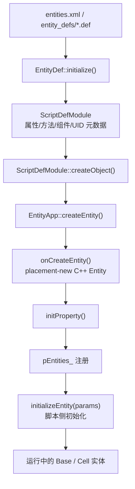
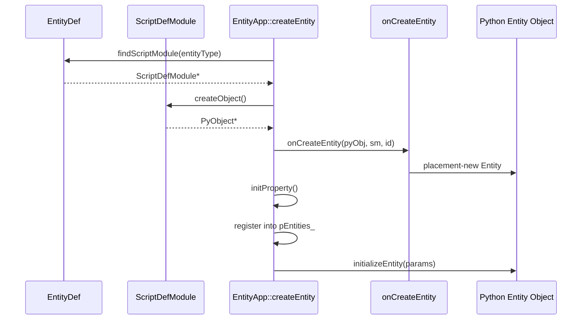

# 实体系统

> 这一页回答的不是“Entity 是什么”这种概念题，而是源码题：`.def` 文件怎样变成 `ScriptDefModule`，`ScriptDefModule` 又怎样变成一个真正运行中的 C++/Python 双栈实体。

## 实体系统的三层结构

从源码看，KBEngine 的实体系统至少分成三层：

- 定义层：`EntityDef` + `ScriptDefModule`
- 构造层：`EntityApp::createEntity()`
- 运行层：Base / Cell 两侧具体 `Entity` 子系统

这三层分别对应三个问题：

- 这个实体“允许有什么属性和方法”？
- 这个实体“怎样被实例化”？
- 这个实体“实例化后由谁托管、怎么参与网络和脚本运行时”？



## 第一步：EntityDef 先把 `.def` 读成运行时元数据

最关键的入口是：

- `kbe/src/lib/entitydef/entitydef.h`
- `kbe/src/lib/entitydef/entitydef.cpp`
- `kbe/src/lib/entitydef/scriptdef_module.h`
- `kbe/src/lib/entitydef/scriptdef_module.cpp`

`EntityDef::initialize()` 做的事情并不是“读配置”，而是建立整个实体运行时的元数据世界。

在 `kbe/src/lib/entitydef/entitydef.cpp` 中，这个初始化流程很清楚：

1. 记录当前加载组件类型
2. 初始化 `DataTypes`
3. 打开 `entities.xml`
4. 为每个实体名注册一个 `ScriptDefModule`
5. 读取 `entity_defs/<Entity>.def`
6. 加载属性、方法、detailLevel、volatileInfo、组件定义
7. 调用 `script::entitydef::initialize()`
8. 对非 `DBMGR_TYPE` 组件继续加载 Python 实体脚本

也就是说，`.def` 并不是给编辑器看的静态描述文件，而是后续 RPC、属性同步、持久化、客户端 SDK 生成的共同基础。

## 第二步：ScriptDefModule 是实体定义的真正承载体

`ScriptDefModule` 是理解实体系统时最该先读的类。

在 `kbe/src/lib/entitydef/scriptdef_module.h` 里，它内部维护了几组核心映射：

- `PROPERTYDESCRIPTION_MAP`
- `METHODDESCRIPTION_MAP`
- `COMPONENTDESCRIPTION_MAP`
- 各种 UID / alias 映射表

这说明一个实体定义并不是“属性列表 + 方法列表”这么简单，而是一整套运行时协议描述：

- 哪些属性属于 Base / Cell / Client
- 哪些方法可以从哪一侧调用
- 属性和方法的 UID / alias 是多少
- 这个实体是否持久化
- detailLevel / volatileInfo 如何影响同步
- 它是否还包含组件型子定义

因此 `ScriptDefModule` 更像“实体协议模块”，而不是简单的脚本类反射对象。

## 第三步：实体对象不是先 Python 再 C++，而是统一构造

很多读者第一次看会误以为：

- 先 new 一个 C++ Entity
- 再给它挂一个 Python 脚本对象

源码正好说明不是这样。

在 `kbe/src/lib/entitydef/scriptdef_module.cpp`：

```cpp
PyObject* ScriptDefModule::createObject(void)
{
    PyObject * pObject = PyType_GenericAlloc(scriptType_, 0);
    // ...
    return pObject;
}
```

先分配的是 Python 对象外壳，但它还没真正成为一个“可运行实体”。

真正把 Python 对象和 C++ 实体绑成一个东西的，是 `EntityApp::createEntity()`：

```cpp
// 文件：kbe/src/lib/server/entity_app.h
ScriptDefModule* sm = EntityDef::findScriptModule(entityType);
PyObject* obj = sm->createObject();
E* entity = onCreateEntity(obj, sm, id);
```

而 `onCreateEntity()` 的默认实现是：

```cpp
return new(pyEntity) E(eid, sm);
```

这里的关键点在于：C++ `Entity` 直接 placement-new 到 Python 对象持有的那块对象内存上。它不是两个对象互相引用，而是一体化构造。

## 数据流架构：C++ 负责加载，Python 负责存储

虽然实体是 C++/Python 一体化构造，但**数据加载**和**数据存储**的职责是分开的：

### 各层职责分工

| 层 | 职责 | 说明 |
|---|---|---|
| **C++ 层** | 数据加载、解析、序列化 | 从数据库读取流，解析属性值，执行IO操作 |
| **Python 层** | 数据存储、业务逻辑 | 属性最终存储在 Python 对象上，脚本直接访问和修改 |

### 数据流向

```
┌─────────────────────────────────────────────────────────────────┐
│                    KBEngine 数据流架构                           │
├─────────────────────────────────────────────────────────────────┤
│                                                                  │
│  ┌──────────────┐    ┌──────────────┐    ┌──────────────┐       │
│  │   数据库      │ →  │  C++ 层      │ →  │  Python 层   │       │
│  │  (MySQL等)   │    │ (数据加载)    │    │ (数据存储)   │       │
│  └──────────────┘    └──────────────┘    └──────────────┘       │
│                                                                  │
│  数据流向：                                                       │
│  1. 数据库 → C++ MemoryStream (读取、解析)                       │
│  2. MemoryStream → Python字典 (createCellDataFromStream)        │
│  3. Python字典 → Python对象属性 (createNamespace → PyObject_SetAttr) │
│                                                                  │
└─────────────────────────────────────────────────────────────────┘
```

### 源码证据

在 `entity_macro.h` 的 `createNamespace` 中，数据最终通过 `PyObject_SetAttr` 设置到 Python 对象上：

```cpp
while(PyDict_Next(dictData, &pos, &key, &value))
{
    // 直接设置到Python对象上！
    PyObject_SetAttr(this, key, value);  // ← 数据最终存储在Python层
}
```

### 为什么这样设计？

1. **C++ 负责性能敏感操作**：
   - 网络IO、数据库读写
   - 数据序列化/反序列化
   - 内存管理、流操作

2. **Python 负责业务逻辑**：
   - 属性访问和修改（`self.hp = 200`）
   - 游戏逻辑实现（`self.attack()`）
   - 脚本回调（`onTimer()`、`onDeath()`）

3. **一体化构造的优势**：
   - 避免 C++/Python 对象互相引用的开销
   - 属性访问直接在 Python 层完成，无需跨层调用
   - 脚本开发者无需关心底层实现

### 脚本层访问示例

```python
class Avatar(KBEngine.Entity):
    def __init__(self):
        KBEngine.Entity.__init__(self)
        # 这些属性已经在C++层从数据库加载完毕
        # 现在可以直接访问（数据存储在Python层）
        print(f"HP: {self.hp}")  # 读取已加载的属性
        self.hp = 200  # 修改属性（直接在Python层操作）
    
    def attack(self, target):
        # 业务逻辑在Python层实现
        damage = self.hp * 0.1
        target.hp -= damage
```

## 第四步：EntityApp::createEntity() 才是实例化总入口

真正值得逐行跟读的代码在 `kbe/src/lib/server/entity_app.h`：

- `EntityApp<E>::createEntity()`
- `EntityApp<E>::onCreateEntity()`

这条路径的逻辑非常典型：

1. 检查实体 ID 是否可分配
2. 通过 `EntityDef::findScriptModule(entityType)` 找到定义
3. 检查当前组件是否允许承载该实体
4. 用 `ScriptDefModule::createObject()` 分配 Python 对象
5. 分配或使用现有 `ENTITY_ID`
6. 调 `onCreateEntity()` 完成 C++ 实体构造
7. `initProperty()`
8. 放入 `pEntities_`
9. `initializeEntity(params)` 做脚本侧初始化

这说明实体创建并不是某个单点 API，而是一个“定义校验 → 对象分配 → 运行态注册 → 脚本初始化”的四阶段流程。



## 第五步：Base / Cell 两侧共用骨架，但语义不同

Base 和 Cell 都继承 `EntityApp<Entity>`，但并不意味着它们承载同一种实体语义。

在源码里可以直接看到：

- `kbe/src/server/baseapp/baseapp.h`
- `kbe/src/server/cellapp/cellapp.h`

两边都覆盖了：

- `onCreateEntity(PyObject* pyEntity, ScriptDefModule* sm, ENTITY_ID eid)`

共享的部分是：

- 实体定义查找
- Python / C++ 统一构造
- 实体 ID 分配
- 实体容器管理

不同的部分是：

- Base 侧增加会话、Proxy、DB 协作、非空间逻辑
- Cell 侧增加空间、AOI、Witness、ghost、实时同步

所以“Base Entity”和“Cell Entity”不是两个完全独立的体系，而是建立在同一创建骨架上的两种运行时语义。

<a id="base-entity-create-cell"></a>
## `Entity.createCellEntity()` 不是本地建对象，而是一次 Base -> Cell 交接

Base 侧 API 里的 `createCellEntity()` 很容易让人脑补成：

- Base 进程里直接 new 一个 Cell 实体
- 然后本地把 `cell` 属性补上

源码实际走的是一条明确的跨组件消息链。

### 第一层：脚本入口先校验“当前 Base 实体是否允许发起创建”

入口在：

- `kbe/src/server/baseapp/entity.cpp`

关键实现：

```cpp
// 文件：kbe/src/server/baseapp/entity.cpp
PyObject* Entity::createCellEntity(PyObject* pyobj)
{
    if(isDestroyed()) ...
    if(Baseapp::getSingleton().findEntity(id()) == NULL) ...
    if(creatingCell_ || this->cellEntityCall()) ...
    if(!PyObject_TypeCheck(pyobj, EntityCall::getScriptType())) ...

    EntityCallAbstract* cellEntityCall = static_cast<EntityCallAbstract*>(pyobj);
    if(cellEntityCall->type() != ENTITYCALL_TYPE_CELL) ...

    creatingCell_ = true;
    Baseapp::getSingleton().createCellEntity(cellEntityCall, this);
}
```

这段代码把几个真实限制写得很清楚：

- 当前实体必须还活着，而且仍然注册在本 BaseApp 上
- 不能在“正在创建 cell”或“已经有 cell”时重复调用
- 参数必须是**直接的** `ENTITYCALL_TYPE_CELL`

这也是为什么文档里一直强调：

- 可以传“直接的 CellEntityCall”
- 不能把 `baseEntityCall.cell` 这种间接路径直接拿来用

### 第二层：Base 侧真正做的是把 Cell 启动数据打包发给目标 CellApp

真正发消息的实现不在 `Entity`，而在：

- `kbe/src/server/baseapp/baseapp.cpp`

```cpp
// 文件：kbe/src/server/baseapp/baseapp.cpp
void Baseapp::createCellEntity(EntityCallAbstract* createToCellEntityCall, Entity* pEntity)
{
    (*pBundle).newMessage(CellappInterface::onCreateCellEntityFromBaseapp);

    (*pBundle) << createToCellEntityCall->id();
    (*pBundle) << entityType;
    (*pBundle) << id;
    (*pBundle) << componentID_;
    (*pBundle) << hasClient;
    (*pBundle) << pEntity->inRestore();

    pEntity->addCellDataToStream(CELLAPP_TYPE, ED_FLAG_ALL, s);
    (*pBundle).append(*s);
    ...
    createToCellEntityCall->getChannel()->send(pBundle);
}
```

这里最关键的结论是：

- `createCellEntity()` 本质上是一次 **Base -> Cell 的异步创建请求**
- `cellData` 不是共享引用，而是被序列化成一份启动快照发往对端
- 消息里除了属性快照，还明确带了 `entityType`、Base 侧 `componentID`、`hasClient`、`inRestore`

因此 Base 侧发起创建时做的不是“建对象”，而是“准备建模数据并发起远程创建”。

### 第三层：Cell 侧会按目标 CellEntityCall 所在空间真正创建实体

Cell 侧入口在：

- `kbe/src/server/cellapp/cellapp.cpp`

```cpp
// 文件：kbe/src/server/cellapp/cellapp.cpp
void Cellapp::onCreateCellEntityFromBaseapp(Network::Channel* pChannel, KBEngine::MemoryStream& s)
{
    s >> createToEntityID;
    s >> entityType;
    s >> entityID;
    s >> componentID;
    s >> hasClient;
    s >> inRescore;
    ...
}
```

继续往下看 `_onCreateCellEntityFromBaseapp()`：

```cpp
// 文件：kbe/src/server/cellapp/cellapp.cpp
Entity* pCreateToEntity = pEntities_->find(createToEntityID);
spaceID = pCreateToEntity->spaceID();
SpaceMemory* space = SpaceMemorys::findSpace(spaceID);
...
Entity* e = createEntity(entityType.c_str(), cellData, false, entityID, false);
e->baseEntityCall(new EntityCall(..., componentID, entityID, ENTITYCALL_TYPE_BASE));
cellData = e->createCellDataFromStream(pCellData);
e->createNamespace(cellData, true);
```

这说明 `createCellEntity(cellEntityCall)` 的真正语义是：

- 先找到你传入的那个 `CellEntityCall` 对应的目标实体
- 取它所在的 `spaceID`
- 再在那个空间里创建当前 Base 实体对应的 Cell 实体

也就是说，参数真正承担的是“提供目标空间锚点”的职责。

### 第四层：带客户端的实体还会继续接上 Witness/进入世界流程

同一段 Cell 侧代码里，`hasClient` 会直接影响后续链路：

```cpp
// 文件：kbe/src/server/cellapp/cellapp.cpp
if(hasClient)
{
    e->clientEntityCall(client);
    e->setWitness(Witness::createPoolObject(OBJECTPOOL_POINT));
}

space->addEntity(e);
...
space->addEntityToNode(e);

if(hasClient)
{
    e->onGetWitness();
}
else
{
    space->onEnterWorld(e);
}
```

所以 `createCellEntity()` 不只是“创建出一个 cell 实例”：

- 对普通实体，它会把 Cell 实体加入空间并进入世界
- 对带客户端的实体，它还会继续补上 `clientEntityCall`、`Witness`，再进入后续客户端同步链

### 第五层：Base 侧拿到 `cell` 的真正时机在 `onGetCell()`

Base 侧的完成回调在：

- `kbe/src/server/baseapp/entity.cpp`

```cpp
// 文件：kbe/src/server/baseapp/entity.cpp
void Entity::onGetCell(Network::Channel* pChannel, COMPONENT_ID componentID)
{
    creatingCell_ = false;
    destroyCellData();

    if(cellEntityCall_ == NULL)
        cellEntityCall_ = new EntityCall(pScriptModule_, NULL, componentID, id_, ENTITYCALL_TYPE_CELL);

    if (!inRestore_)
    {
        CALL_ENTITY_AND_COMPONENTS_METHOD(this, ..., "onGetCell", ...);
    }
}
```

这里说明：

- `creatingCell_` 直到收到 Base 回调才会结束
- `cellData` 只是创建期的启动数据，成功后会被销毁
- 从这一刻开始，Base 脚本层才真正拿到可用的直接 `cellEntityCall`
- `restoreCell()` 路径不会回调脚本侧 `onGetCell()`

所以脚本里最稳妥的理解是：

- `createCellEntity()` = 发起异步创建请求
- `onGetCell()` = Base 侧已经拿到可用的 `cell` mailbox

## 属性、方法、持久化为什么都依赖实体定义

实体系统最容易被低估的点是：它不只是创建对象，也定义了协议。

具体来说：

- 属性同步依赖 `PropertyDescription`
- RPC 依赖 `MethodDescription`
- 持久化依赖 persistent property 映射
- 客户端 SDK 生成依赖 client property / client method 描述

从 `ScriptDefModule` 的成员就能看出这一点：

- `getCellPropertyDescriptions()`
- `getBasePropertyDescriptions()`
- `getClientPropertyDescriptions()`
- `getPersistentPropertyDescriptions()`
- `getBaseMethodDescriptions()`
- `getCellMethodDescriptions()`
- `getClientMethodDescriptions()`

因此如果没先理解 `EntityDef` / `ScriptDefModule`，后面网络层、DB 层、客户端协议层都会看得像“魔法字符串”。

## 这一层和脚本桥接的关系

实体系统和脚本运行时不是两页无关内容。

它们的依赖顺序是：

1. `EntityDef` 先确定这个实体长什么样
2. `ScriptDefModule` 绑定到 Python `PyTypeObject`
3. `EntityApp::createEntity()` 用这个定义创建实例
4. `initializeEntity()` 把脚本初始数据灌进实例

也就是说，脚本桥接不是独立系统，而是实体定义系统的后半段。

## `__init__` 的执行时机与设计原则

### 执行顺序：先加载数据，后调用 `__init__`

在 `entity_macro.h` 中，`initializeEntity()` 的实现揭示了关键的执行顺序：

```cpp
void initializeEntity(PyObject* dictData, bool persistentData = false)
{
    createNamespace(dictData, persistentData);  // 步骤1: 先加载持久化数据
    initializeScript();                          // 步骤2: 后调用__init__
}
```

其中 `initializeScript()` 会调用 Python 脚本的 `__init__` 方法：

```cpp
void initializeScript()
{
    // ... 组件初始化 ...
    
    if(PyObject_HasAttrString(this, "__init__"))
    {
        PyObject* pyResult = PyObject_CallMethod(this, "__init__", "");
        // ...
    }
    
    onInitializeScript();
}
```

### 为什么这样设计？

这个设计解决了**持久化数据恢复**与**运行时初始化**的冲突问题。

考虑以下场景：

```
1. 玩家下线，数据库保存了 hp=50, level=10
2. 玩家重新登录，从数据库加载数据
3. 如果 __init__ 先执行，设置 hp=100, level=1
4. 然后加载数据库数据，覆盖 hp=50, level=10
5. 问题：__init__ 中的初始化逻辑被跳过了
```

KBEngine 的设计是**反过来**：

```
1. 先执行 createNamespace()，从数据库加载 hp=50, level=10
2. 后执行 __init__()，此时数据已经加载完毕
3. __init__() 中不应该设置持久化属性，只做运行时初始化
```

### 持久化属性 vs 运行时属性

| 类型 | 定义位置 | 初始化时机 | 是否会被数据库加载覆盖 |
|------|----------|------------|----------------------|
| **持久化属性** | EntityDef (`.def` 文件) | EntityDef 默认值 → 数据库加载 | ✅ 会覆盖 |
| **运行时属性** | `__init__()` | `__init__` 执行时 | ❌ 不会覆盖 |

#### 持久化属性：在 EntityDef 中定义默认值

```xml
<!-- entity_defs/Avatar.def -->
<Properties>
    <hp>
        <Type> UINT32 </Type>
        <Default> 100 </Default>  <!-- 默认值在这里定义 -->
    </hp>
    <level>
        <Type> UINT32 </Type>
        <Default> 1 </Default>
    </level>
</Properties>
```

这些属性会被 `createNamespace()` 从数据库加载的数据覆盖。

#### 运行时属性：在 `__init__` 中创建

```python
class Avatar(KBEngine.Entity):
    def __init__(self):
        KBEngine.Entity.__init__(self)
        
        # ✅ 正确：创建运行时状态对象（非持久化）
        self.matchState = MatchState()
        self.aiController = AIController()
        self.tempData = {}
        
        # ❌ 错误：设置持久化属性会覆盖已加载的数据！
        # self.hp = 200  # 这会覆盖数据库加载的 hp 值！
```

### 正确的使用方式

```python
# ❌ 错误做法：在 __init__ 中设置持久化属性
class Avatar(KBEngine.Entity):
    def __init__(self):
        KBEngine.Entity.__init__(self)
        self.hp = 200  # 会覆盖数据库加载的值！
        self.level = 1  # 会覆盖数据库加载的值！

# ✅ 正确做法：只创建运行时对象
class Avatar(KBEngine.Entity):
    def __init__(self):
        KBEngine.Entity.__init__(self)
        
        # 运行时状态（数据库中没有这些属性）
        self.matchState = MatchState()
        self.aiController = AIController()
        
        # 如果需要修改持久化属性，应该调用方法
        # self.addHP(10)  # 通过方法修改，而不是直接赋值
```

### 设计原则总结

1. **持久化属性**：在 EntityDef 中定义，默认值也在那里设置，数据库加载时会覆盖
2. **运行时属性**：在 `__init__` 中创建，不会被数据库加载覆盖（因为数据库中没有这些属性）
3. **`__init__` 职责**：只做运行时初始化，不设置持久化属性
4. **数据修改**：通过方法（如 `addHP()`）修改持久化属性，而不是在 `__init__` 中直接赋值

### 相关源码

- `kbe/src/lib/entitydef/entity_macro.h` → `initializeEntity()`, `initializeScript()`, `createNamespace()`
- `kbe/src/server/cellapp/entity.cpp` → `initializeEntity()` 调用位置
- `kbe/src/server/baseapp/entity.cpp` → `initializeEntity()` 调用位置

## 读源码的最短路径

如果你准备在 IDE 里走一遍实体系统，建议只跟下面这条链：

1. `kbe/src/lib/entitydef/entitydef.cpp` → `EntityDef::initialize`
2. `kbe/src/lib/entitydef/scriptdef_module.cpp` → `ScriptDefModule::createObject`
3. `kbe/src/lib/server/entity_app.h` → `EntityApp::createEntity`
4. `kbe/src/server/baseapp/baseapp.cpp` / `kbe/src/server/cellapp/cellapp.cpp` → `onCreateEntity`
5. `kbe/src/lib/entitydef/entity_macro.h` → `initializeEntity`

这样读能把“定义”和“实例化”一次性串起来。

## 与主线章节的关系

如果你要看完整叙事和更多上下文，主线仍然在：

- `/study/05-entitydef-and-entity-definition.html`
- `/study/06-python-runtime-and-script-bridge.html`

这一页的目标不是替代主线，而是给 `architecture/source-analysis/` 补上一张真正可落到源码的实体阅读地图。
