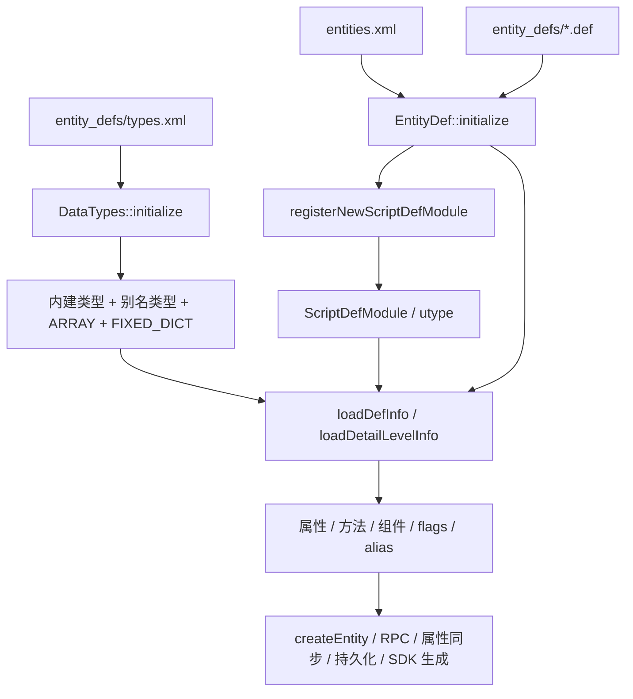
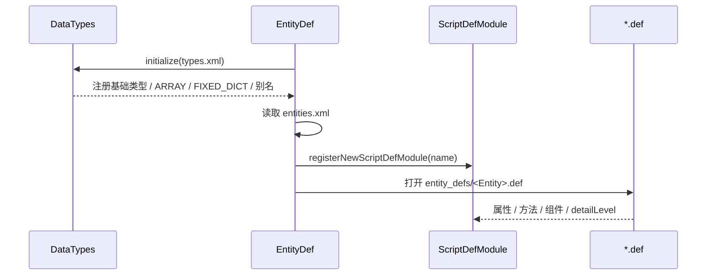
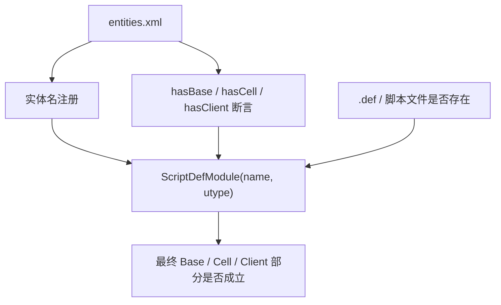
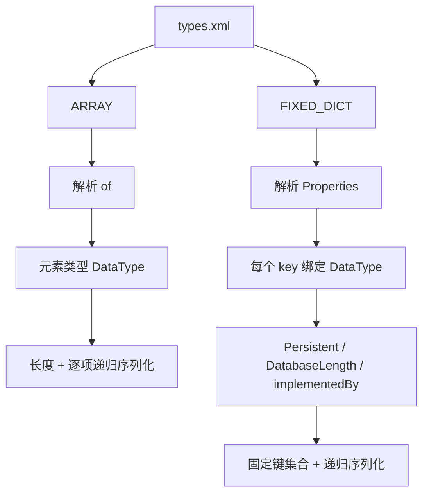

# 类型系统与实体定义文件：`types.xml`、`entities.xml`、`.def` 与 `ENTITYCALL`

> 这一页我想把一组经常混在一起的问题拆开：
>
> - `entities.xml` 到底只是“实体清单”，还是还承担别的运行时语义
> - `.def` 里的 `<Type>` 为什么不是随便写一个字符串
> - `types.xml`、`ARRAY`、`FIXED_DICT` 是怎么真正进入实体系统的
> - `ENTITYCALL` 到底是“实体对象引用”还是“远程 mailbox”
>
> 前面的 [实体系统](/architecture/source-analysis/entity-system.md) 和 [脚本运行时与热更新](/architecture/source-analysis/scripting.md) 已经把主线搭起来了；这一页继续把“类型系统”和“实体定义文件”这半边补成可落源码的专题。

## 先给结论

我现在更愿意把这一组文件拆成四层来看：

- `types.xml`
  负责把“类型名字”注册成真正的 `DataType`
- `entities.xml`
  负责把“有哪些实体”注册成真正的 `ScriptDefModule`
- `<Entity>.def`
  负责把“这个实体有哪些属性、方法、组件”挂到对应 `ScriptDefModule`
- `ENTITYCALL`
  负责把“跨实体调用句柄”接到远程方法和组件调用链



先压成几句结论：

- `types.xml` 不是注释性配置，而是实体类型系统真正的注册入口。
- `entities.xml` 不只是列名字，它还影响实体 `utype` 分配，以及 `hasBase / hasCell / hasClient` 的断言边界。
- `.def` 解析时，属性和方法用到的类型都必须已经能在 `DataTypes` 里找到。
- `ENTITYCALL` 不是普通持久化字段；它更接近”可序列化的远程调用句柄”。
- **`.def` 中的 `<Type>` 定义的是 KBEngine 统一类型系统，不是直接定义数据库类型**。

## 第零层：`.def` 中的 Type 定义的是”统一类型”，自动映射到三种底层表示

### 一个 Type，三种用途

`.def` 文件中的 `<Type>` 定义的是 **KBEngine 抽象类型**，引擎会根据用途自动映射到不同的底层表示：

```mermaid
flowchart LR
    A[“<Type> INT32 </Type>”]

    B1[“内存 (Python)”]
    B2[“数据库 (MySQL)”]
    B3[“网络 (Binary Stream)”]

    A --> B1
    A --> B2
    A --> B3

    B1 --> B1V[“int”]
    B2 --> B2V[“INT”]
    B3 --> B3V[“4 bytes big-endian”]

    A2[“<Type> STRING </Type>”]
    A2 --> C1V[“str”]
    A2 --> C2V[“VARCHAR”]
    A2 --> C3V[“长度 + 字节”]
```

### 完整映射表

| KBEngine Type | Python 内存 | MySQL 数据库 | 网络传输 |
|--------------|-------------|--------------|----------|
| `UINT8` | `int` | `TINYINT UNSIGNED` | 1 byte |
| `UINT16` | `int` | `SMALLINT UNSIGNED` | 2 bytes |
| `UINT32` | `int` | `INT UNSIGNED` | 4 bytes |
| `UINT64` | `int` | `BIGINT UNSIGNED` | 8 bytes |
| `INT8` | `int` | `TINYINT` | 1 byte |
| `INT16` | `int` | `SMALLINT` | 2 bytes |
| `INT32` | `int` | `INT` | 4 bytes |
| `INT64` | `int` | `BIGINT` | 8 bytes |
| `FLOAT` | `float` | `FLOAT` | 4 bytes |
| `DOUBLE` | `float` | `DOUBLE` | 8 bytes |
| `STRING` | `str` | `VARCHAR(N)` | 长度+字节 |
| `UNICODE` | `str` | `VARCHAR(N) UTF8` | 长度+UTF8字节 |
| `VECTOR3` | `tuple(x,y,z)` | 3 个 `FLOAT` 列 | 12 bytes |
| `BLOB` | `bytes` | `BLOB` | 长度+字节 |
| `ARRAY<of>` | `list` | 多行关联表 / 序列化 | 长度+元素 |
| `FIXED_DICT` | `PyFixedDictDataInstance` | 多列 / BLOB | 字段序列 |

### 源码证据

**数据库映射** - `property_mapping.cpp:231-304`:

```cpp
// KBEngine Type → MySQL 映射
if (strcmp( metaName, “UINT8” ) == 0)
    pResult = new NumMapping< uint8 >( ... );      // → TINYINT UNSIGNED
else if (strcmp( metaName, “UINT32” ) == 0)
    pResult = new NumMapping< uint32 >( ... );    // → INT UNSIGNED
else if (strcmp( metaName, “INT32” ) == 0)
    pResult = new NumMapping< int32 >( ... );     // → INT
else if (strcmp( metaName, “FLOAT32” ) == 0)
    pResult = new NumMapping< float >( ... );     // → FLOAT
else if (strcmp( metaName, “STRING” ) == 0)
    pResult = new StringMapping( ... );           // → VARCHAR
else if (strcmp( metaName, “UNICODE_STRING” ) == 0)
    pResult = new UnicodeStringMapping( ... );    // → VARCHAR (UTF8)
```

### 关键点

1. **`.def` 中定义的是抽象类型**，不直接对应数据库类型
2. **自动映射**：系统根据 Type 自动选择合适的数据库列类型
3. **Persistent 标志控制**：只有标记 `<Persistent>true</Persistent>` 的属性才会写入数据库
4. **DATABASE_LENGTH**：字符串类型可用 `<DatabaseLength>255</DatabaseLength>` 控制 VARCHAR 长度

```xml
<!-- 示例：Type 是 KBEngine 类型，不是 MySQL 类型 -->
<Properties>
    <!-- 这里的 STRING 是 KBEngine 类型，会自动映射到 MySQL VARCHAR -->
    <playerName>
        <Type> UNICODE </Type>
        <Flags> BASE_AND_CLIENT </Flags>
        <Persistent> true </Persistent>
        <DatabaseLength> 64 </DatabaseLength>  <!-- 控制 VARCHAR 长度 -->
    </playerName>
</Properties>
```

## 第一层：真正的加载顺序是 `types.xml -> entities.xml -> .def`

`EntityDef::initialize(...)` 在当前源码树里的顺序很明确：

1. 先初始化 `DataTypes`
2. 再打开 `entities.xml`
3. 按 `entities.xml` 顺序为每个实体注册 `ScriptDefModule`
4. 再读取对应的 `entity_defs/<Entity>.def`
5. 最后才进入 `script::entitydef::initialize()` 和实体脚本模块加载

关键入口在：

- `kbe/src/lib/entitydef/entitydef.cpp`
- `kbe/src/lib/entitydef/datatypes.cpp`

这意味着我现在不再把这些文件理解成“并列配置”：

- `types.xml` 先回答“类型系统里有哪些合法名字”
- `entities.xml` 再回答“有哪些实体模块”
- `.def` 最后才能安全地引用这些类型和实体定义



这一层最容易忽略的点是：

- `.def` 里 `<Type>` 能不能解析，不是看脚本里有没有类，而是看 `DataTypes` 里有没有这个名字。
- `entities.xml` 里的顺序也不是无关紧要的展示顺序，它会影响后面的 `utype` 分配。

## 第二层：`entities.xml` 不只是清单，它还决定实体注册顺序和部分断言

### `entities.xml` 里的顺序会进入 `ScriptDefModule` 的 `utype`

`EntityDef::initialize(...)` 遍历 `entities.xml` 时，会对每个实体调用：

- `registerNewScriptDefModule(moduleName)`

而 `EntityDef::registerNewScriptDefModule(...)` 的实现会继续做：

- `__scriptTypeMappingUType[moduleName] = g_scriptUtype`
- `new ScriptDefModule(moduleName, g_scriptUtype++)`

所以这里更准确的理解是：

- `entities.xml` 决定了哪些实体会被注册
- 同时也决定了这些实体拿到的脚本 `utype` 顺序

这件事为什么重要：

- `EntityCallType::addToStream()` 会把实体的 `utype` 一起写进流
- 远端收到后需要靠 `utype` 找回对应 `ScriptDefModule`

也就是说，`entities.xml` 的顺序不是纯展示信息，它已经进入协议层。

### `hasBase / hasCell / hasClient` 不是只看 `.def`

`ScriptDefModule` 在判断实体某一部分是否存在时，源码里明确有两条依据：

1. `.def` 和脚本实现里是否真的有这一部分
2. `entities.xml` 里是否显式写了 `hasBase / hasCell / hasClient`

`kbe/src/lib/entitydef/scriptdef_module.cpp` 里还有一段注释把这件事说得很直白：

- 一种是实体定义和脚本里本来就存在这一部分
- 另一种是用户在 `entities.xml` 里显式声明存在，为了 Unity、HTML5 这类前端场景保留

所以我现在更愿意把 `entities.xml` 理解成：

- 不只是“注册表”
- 还是“实体分部断言表”



### 使用场景

- 新增一个实体时，先确认它已经进了 `entities.xml`，再谈 `.def` 和脚本是否会生效。
- 调试某个实体“为什么客户端部分明明有定义却没被当成 hasClient”时，先回头看 `entities.xml` 的显式属性和脚本文件是否存在。
- 如果要调整实体顺序，最好把它当成协议层变更看待，而不是普通排版修改。

## 第三层：`types.xml` 先注册内建类型，再扩展别名、`ARRAY`、`FIXED_DICT`

### 内建类型不是从 XML 读出来的，而是 C++ 先注册

`DataTypes::initialize(...)` 的前半段会先把基础类型直接注册进来：

- `UINT8 / UINT16 / UINT32 / UINT64`
- `INT8 / INT16 / INT32 / INT64`
- `STRING / UNICODE / FLOAT / DOUBLE`
- `PYTHON / PY_DICT / PY_TUPLE / PY_LIST`
- `ENTITYCALL / BLOB`
- `VECTOR2 / VECTOR3 / VECTOR4`

然后才调用：

- `loadTypes(file)`

也就是说，`types.xml` 不是把整套类型系统从零建起来，而是在“内建类型已存在”的前提下继续扩展。

### `types.xml` 的三种主要扩展方式

`DataTypes::loadTypes(...)` 里能看到三种分支：

1. `FIXED_DICT`
2. `ARRAY`
3. 普通别名

对应地，我现在会这样理解：

- `SomeAlias = UINT32`
  是普通类型别名
- `SomeList = ARRAY`
  是固定元素类型数组
- `SomeStruct = FIXED_DICT`
  是固定键集合的结构体类型

`DataTypes::addDataType(name, dataType)` 还会把名字同时写进：

- 原始名字映射
- 小写名字映射
- `uid -> DataType` 映射

所以类型查找不是单一表，而是一组并行索引。

## 第四层：`ARRAY` 和 `FIXED_DICT` 的关键不是“像不像 Python 容器”，而是“有没有固定协议”

### `ARRAY` 真正固定的是元素类型

`FixedArrayType::initialize(...)` 会先找：

- `<of>`

然后把数组元素类型继续解析成：

- 已存在的基础类型
- 或者嵌套的 `ARRAY`

写流时：

- 先写长度
- 再逐项递归调用元素类型的 `addToStream`

读流时：

- 先读长度
- 再逐项递归调用元素类型的 `createFromStream`

所以这里的重点不是“它像 list”，而是：

- 元素协议是固定的
- 网络序列化和持久化时可递归展开

### `FIXED_DICT` 真正固定的是键集合和每个键的类型

`FixedDictType::initialize(...)` 会读取：

- `<Properties>`
- 每个 key 的 `<Type>`
- 可选的 `<Persistent>`
- 可选的 `<DatabaseLength>`
- 可选的 `<implementedBy>`

当前源码里有两个特别值得记的边界：

1. 如果某个 key 的数据类型是 `ENTITYCALL`
   - 持久化会被强制降成 `false`
2. `implementedBy`
   - 会把这个固定结构额外挂到一个 Python 实现模块

所以 `FIXED_DICT` 更接近：

- 一个固定 schema 的结构化类型
- 而不是“任意 dict 都能塞进去”



### 使用场景

- `ARRAY`
  适合”同构重复项”，例如背包格子列表、路径点列表。
- `FIXED_DICT`
  适合”字段固定的结构”，例如一条邮件头、一个战斗结算块。
- 如果只是想临时塞任意对象，`PYTHON / PY_DICT / PY_LIST` 更自由，但协议边界会更弱。

---

## 4.5 层：`FIXED_DICT` 的本质是二进制格式，Dict 只是外层接口

### FIXED_DICT = 固定字段的二进制打包 + Dict-like 接口

```
┌─────────────────────────────────────────────────────────────┐
│                    FIXED_DICT 本质                           │
│                                                               │
│   在网络/数据库中：二进制流（按字段顺序）                     │
│   ┌─────────────────────────────────────────────────────┐   │
│   │ [field1_value][field2_value][field3_value]...       │   │
│   │ (按类型定义顺序，字段名不传输)                       │   │
│   └─────────────────────────────────────────────────────┘   │
│                         △                                    │
│                         │                                    │
│   在 Python 中：PyFixedDictDataInstance（实现 Mapping 协议）│
│   ┌─────────────────────────────────────────────────────┐   │
│   │ obj[“field1”]  ─────▶  fieldValues_[0]              │   │
│   │ obj[“field2”]  ─────▶  fieldValues_[1]              │   │
│   │ obj.keys()    ─────▶  [“field1”, “field2”, ...]     │   │
│   └─────────────────────────────────────────────────────┘   │
└─────────────────────────────────────────────────────────────┘
```

### 源码证据

**内部存储是数组，不是哈希表** - `fixed_dict_data_instance.hpp:89-90`:
```cpp
typedef BW::vector<ScriptObject> FieldValues;
FieldValues fieldValues_;  // ← 数组，按字段索引访问
```

**字段访问是 O(1) 数组索引** - `fixed_dict_data_instance.cpp:271-293`:
```cpp
PyObject* getFieldByKey( const char * keyString )
{
    // 先通过字段名查索引
    int idx = pDataType_->getFieldIndex( keyString );
    if (idx >= 0) {
        // 然后直接数组访问
        pValue = fieldValues_[idx].get();  // ← O(1) 数组访问
    }
}
```

### 对比：Python Dict vs FIXED_DICT

| 特性 | Python `dict` | FIXED_DICT |
|------|--------------|------------|
| **内部存储** | 哈希表 | **数组** (`vector<ScriptObject>`) |
| **字段顺序** | 无序（Python 3.7+ 有序但非保证） | **固定顺序**（定义时确定） |
| **序列化** | pickle（递归对象图） | **扁平二进制**（按字段类型） |
| **字段添加** | 运行时动态添加 | **编译时固定** |
| **网络传输** | 需要完整 pickle 支持 | **类型精确，无需反射** |

### 为什么这样设计？

```
如果用普通 dict：
序列化需要：{“field1”: 123, “field2”: “abc”}
              ↑字段名  ↑值   ↑字段名  ↑值

用 FIXED_DICT：
序列化需要：<INT32><123><STRING><abc>
              ↑类型  ↑值   ↑类型  ↑值
              （字段名在编译时已确定，不需要传输）
```

---

## 4.6 层：`implementedBy` 钩子系统详解

`implementedBy` 不是简单的”类名”，而是一组**双向转换钩子**。

### 完整钩子列表

| 钩子方法 | 必需/可选 | 调用时机 | 作用 |
|----------|----------|----------|------|
| `getDictFromObj(self, obj)` | **必需** | 序列化时 | 自定义对象 → FIXED_DICT 格式 |
| `createObjFromDict(self, dict)` | **必需** | 反序列化时 | FIXED_DICT 格式 → 自定义对象 |
| `isSameType(self, obj)` | 可选 | 类型检查时 | 判断对象是否匹配此类型 |
| `addToStream(self, obj)` | 可选（需成对） | 网络传输时 | 完全自定义序列化 |
| `createFromStream(self, stream)` | 可选（需成对） | 网络接收时 | 完全自定义反序列化 |

### 钩子调用流程

```
┌─────────────────────────────────────────────────────────────────────┐
│                        implementedBy 钩子流程                        │
└─────────────────────────────────────────────────────────────────────┘

                              ┌─────────────────┐
                              │  属性赋值/读取   │
                              └────────┬────────┘
                                       │
                       ┌───────────────┼───────────────┐
                       ▼               ▼               ▼
              ┌─────────────┐ ┌─────────────┐ ┌─────────────┐
              │  内存访问   │ │ 网络传输   │ │ 数据库持久化 │
              └──────┬──────┘ └──────┬──────┘ └──────┬──────┘
                     │                │                │
    ┌────────────────┼────────────────┼────────────────┼────────────────┐
    │                │                │                │                │
    ▼                ▼                ▼                ▼                ▼
┌─────────┐    ┌─────────┐    ┌─────────┐    ┌─────────┐    ┌─────────┐
│isSameType│    │getDict  │    │addToStrm│    │getDict  │    │createObj│
│         │    │FromObj  │    │         │    │FromObj  │    │FromDict │
└─────────┘    └─────────┘    └─────────┘    └─────────┘    └─────────┘
 类型检查    自定义对象→dict    自定义序列化    自定义对象→dict    dict→自定义对象
```

### 完整示例：邮件系统

```python
# data_types.py
import cPickle

class Mail:
    “””业务对象：完全自定义的 Python 类”””
    def __init__(self, mail_id, sender, title, attachment_id=0, is_read=False):
        self.id = mail_id
        self.sender = sender
        self.title = title
        self.attachment_id = attachment_id
        self.is_read = is_read

    def mark_read(self):
        self.is_read = True

class MailWrapper:
    “””FIXED_DICT 的序列化适配器”””

    # ========== 必需钩子 ==========
    def getDictFromObj(self, obj):
        “””业务对象 → FIXED_DICT 格式”””
        return {
            “mailId”: obj.id,
            “sender”: obj.sender,
            “title”: obj.title,
            “attachmentId”: obj.attachment_id,
            “isRead”: int(obj.is_read)
        }

    def createObjFromDict(self, dict):
        “””FIXED_DICT 格式 → 业务对象”””
        return Mail(
            mail_id=dict[“mailId”],
            sender=dict[“sender”],
            title=dict[“title”],
            attachment_id=dict[“attachmentId”],
            is_read=bool(dict[“isRead”])
        )

    # ========== 可选钩子 ==========
    def isSameType(self, obj):
        “””类型检查”””
        return isinstance(obj, Mail)

    # 如果想要自定义序列化（如 pickle，覆盖默认行为）：
    # def addToStream(self, obj):
    #     return cPickle.dumps(obj)
    #
    # def createFromStream(self, stream):
    #     return cPickle.loads(stream)

# 导出实例供 types.xml 使用
mailWrapper = MailWrapper()
```

```xml
<!-- types.xml -->
<Mail>
    <Type> FIXED_DICT </Type>
    <implementedBy> data_types.mailWrapper </implementedBy>
    <Properties>
        <mailId><Type> UINT64 </Type></mailId>
        <sender><Type> UNICODE </Type></sender>
        <title><Type> UNICODE </Type></title>
        <attachmentId><Type> UINT32 </Type></attachmentId>
        <isRead><Type> UINT8 </Type></isRead>
    </Properties>
</Mail>
```

---

## 4.7 层：动态 Key 的处理方案

### 问题：FIXED_DICT 无法处理动态 Key

```python
# 想要传递的数据（动态 ID 作为 key）
{
    10001: {“count”: 5, “expire”: 1234567890},
    10002: {“count”: 3, “expire”: 1234567891},
    # ... ID 是动态的，无法预先定义
}

# FIXED_DICT 要求 key 必须是预定义的固定字符串
# <Properties>
#     <10001> ← ❌ 不支持，key 必须是合法的变量名
# </Properties>
```

### 解决方案对比

| 方案 | 适用场景 | 优点 | 缺点 |
|------|----------|------|------|
| **ARRAY** | 小规模数据（<1000项） | 类型安全，性能好，可同步客户端 | 需要遍历查找 |
| **implementedBy + pickle** | 大规模/复杂数据 | 开发快，支持任意结构 | 版本兼容性差，不能同步客户端 |
| **PY_DICT** | 临时数据/服务端内部 | 最简单 | 性能差，不安全，不推荐 |

### 方案 1：使用 ARRAY（推荐）

把 `dict[id] → value` 转换为 `list of [id, value]`

```xml
<Item>
    <Type> FIXED_DICT </Type>
    <Properties>
        <itemId><Type> UINT32 </Type></itemId>
        <count><Type> UINT16 </Type></count>
        <expire><Type> UINT64 </Type></expire>
    </Properties>
</Item>

<ItemList>
    <Type> ARRAY of Item </Type>
</ItemList>
```

```python
# 服务端
self.inventory = [
    {“itemId”: 10001, “count”: 5, “expire”: 1234567890},
    {“itemId”: 10002, “count”: 3, “expire”: 1234567891},
]

# 客户端访问
def get_item_count(item_id):
    for item in self.inventory:
        if item[“itemId”] == item_id:
            return item[“count”]
    return 0
```

### 方案 2：使用 implementedBy + pickle

```xml
<DynamicInventory>
    <Type> FIXED_DICT </Type>
    <implementedBy> InventoryWrapper </implementedBy>
    <Properties>
        <data><Type> BLOB </Type></data>
    </Properties>
</DynamicInventory>
```

```python
class InventoryWrapper:
    def getDictFromObj(self, obj):
        return {“data”: cPickle.dumps(obj.items)}

    def createObjFromDict(self, dict):
        obj = Inventory()
        obj.items = cPickle.loads(dict[“data”])
        return obj
```

### 实际游戏中的选择建议

| 数据类型 | 推荐方案 | 理由 |
|----------|----------|------|
| 背包（<1000物品） | `ARRAY of Item` | 类型安全，可同步客户端 |
| 背包（>1000物品） | `implementedBy + pickle` | 性能更好 |
| 临时缓存数据 | `PY_DICT` | 仅服务端用，简单 |
| 玩家属性（力量/敏捷等） | `FIXED_DICT` | 字段固定 |

---

## 第五层：`ENTITYCALL` 不是实体本身，而是远程调用句柄

### 类型判定时，它接受两类东西

`EntityCallType::isSameType(...)` 当前接受：

- 真正的 `EntityCall`
- 或者一个实体脚本对象
- 另外也允许 `None`

这意味着脚本层写：

```python
self.target = otherEntity.base
```

和某些场景下直接把实体对象交给 `ENTITYCALL` 类型，底层都能接住。

### 序列化时，真正写进去的是四元组

`EntityCallType::addToStream(...)` 写流时会写入：

- `ENTITY_ID`
- `COMPONENT_ID`
- `ENTITYCALL_TYPE`
- `ENTITY_SCRIPT_UID`

如果传入的是实体对象，底层会先把它折算成当前组件上的：

- `base`
- `cell`
- 或 `client`

对应的调用句柄信息。

所以 `ENTITYCALL` 本质上不是“把整个实体对象序列化”，而是：

- 把能够重新定位远程实体的 mailbox 信息写进流

### 反序列化时，会优先尝试本地实体，再退回远程 mailbox

`EntityCallType::createFromStream(...)` 的顺序是：

1. 先读 `id / cid / type / utype`
2. 如果目标组件类型和当前组件相同
   - 先尝试 `EntityDef::tryGetEntity(cid, id)`
3. 本地拿不到，再 new 一个 `EntityCall`

也就是说，收到 `ENTITYCALL` 后，脚本层最后拿到的可能是：

- 本地已存在实体对象
- 或一个远程 `EntityCall`

这也是为什么我更愿意把它理解成：

- “可反解的实体调用句柄”
- 不是“保证一定是远端对象”

### `ENTITYCALL` 不能持久化

这里源码边界非常明确：

- `property.cpp` 在构造 `PropertyDescription` 时，如果数据类型是 `ENTITYCALL` 且标记了 persistent，就会强制关掉持久化。
- `FixedDictType::initialize(...)` 里，如果某个 key 的类型是 `ENTITYCALL`，同样会把这个 key 的 persistent 降成 `false`。

所以更准确的理解是：

- `ENTITYCALL` 适合运行时引用
- 不适合数据库持久化

## 第六层：脚本里看到的 `base / cell / client` 链，其实都挂在 `EntityCall` 的属性分发上

`EntityCall::onScriptGetAttribute(...)` 这一段很关键，它把三件事接到一起了：

1. 远程方法调用
2. 组件调用
3. `base / cell / client` 继续跳转

具体来说：

- 如果属性名命中方法描述
  - 返回 `RemoteEntityMethod`
- 如果属性名命中组件属性
  - 返回 `EntityComponentCall`
- 如果属性名是 `base / cell / client`
  - 再按当前 `ENTITYCALL_TYPE` 派生出下一跳 mailbox

所以脚本里这些写法：

```python
avatar.base.doSomething()
avatar.cell.moveToPoint(...)
avatar.client.onMatchSuccess()
```

背后不是语法糖，而是一条明确的属性分发链。

这里还有一个客户端边界：

- 在 `CLIENT_TYPE / BOTS_TYPE` 上，只允许访问 `isExposed()` 的方法。

所以客户端拿到 `ENTITYCALL` 后，也不是“什么方法都能调”，而是还要过 exposed 检查。

### 使用例子

```python
self.friendRef = other.base
if self.friendRef:
    self.friendRef.invite(self.id)
```

```python
mailbox = self.target.cell
mailbox.teleport(spaceID, position)
```

更适合 `ENTITYCALL` 的场景：

- 在线运行时跨实体调方法
- 暂存一个会话期引用

不适合它的场景：

- 想把目标实体引用安全写进数据库长期保存

## 第七层：`.def` 真正做的是“把已注册类型挂到属性和方法描述上”

前面几层都准备好之后，`EntityDef::initialize(...)` 才会继续：

- 打开每个 `<Entity>.def`
- `loadDefInfo(...)`
- `loadDetailLevelInfo(...)`

这时候 `.def` 里的 `<Type>` 才能被安全解析成真正的 `DataType*`。

所以 `.def` 在这一页里最重要的角色不是“再介绍实体系统一遍”，而是：

- 消费前面已经注册好的类型系统
- 把这些类型绑定到属性描述、方法参数、组件描述

这一层也解释了为什么：

- 改 `types.xml`
- 改 `entities.xml`
- 改 `.def`

这三件事我现在都把它们看成“协议层变更”，而不是普通脚本改动。

## 第八层：当前源码树还支持一条 Python 版 entitydef 路径，但底层仍复用同一套 `DataTypes`

这一点在 `py_entitydef.cpp` 里能直接看到。

如果走 Python 版定义路径，`DefContext` 最终仍会把：

- `FIXED_ARRAY`
- `FIXED_DICT`
- rename alias

继续注册回 `DataTypes`。

也就是说，当前源码里其实有两条入口：

- XML 入口
- Python entitydef 入口

但它们最后仍然汇合到同一套：

- `DataTypes`
- `ScriptDefModule`
- `EntityDef` 元数据

所以我现在更愿意把它记成：

- 入口可以不同
- 协议层核心容器还是同一套

## 这一页适合怎样使用

1. 想判断“为什么 `.def` 里这个 `<Type>` 报找不到”
   先看 `types.xml` 和 `DataTypes::loadTypes(...)`。
2. 想判断“为什么改了 `entities.xml` 后一些远程调用或 SDK 行为异常”
   先回头看实体注册顺序和 `utype`。
3. 想判断“`ENTITYCALL` 到底能不能写库”
   直接看 `property.cpp` 和 `FixedDictType::initialize(...)` 的强制降级逻辑。
4. 想判断“脚本里 `avatar.base.cell.client` 这种链为什么能工作”
   直接看 `EntityCall::onScriptGetAttribute(...)`。
5. 想给项目设计结构化数据类型
   优先考虑 `FIXED_DICT / ARRAY`，而不是先把一切都塞进 `PYTHON`。

## 使用场景

- `entities.xml`
  适合做实体注册和实体分部断言，不适合随意改顺序做排版整理。
- `types.xml`
  适合沉淀可复用的结构类型和别名。
- `FIXED_DICT`
  适合“字段稳定、协议明确”的结构。
- `ARRAY`
  适合“元素同构”的重复序列。
- `ENTITYCALL`
  适合运行期跨实体通信，不适合长期持久化。

## 与其他专题的关系

- 想看实体怎样被真正实例化，接着看 [实体系统](/architecture/source-analysis/entity-system.md)
- 想看脚本宿主、热更新和实体脚本类型怎样接起来，接着看 [脚本运行时与热更新](/architecture/source-analysis/scripting.md)
- `vector3`、配置路径、环境变量这条线，继续看 [运行时配置与基础类型](/architecture/source-analysis/runtime-config-and-types.md)
- 远程消息、RPC、`EntityCall` 最后怎么走到网络层，继续看 [网络与消息系统](/architecture/source-analysis/networking.md)

这一页最后我只想把边界收成一句话：

- `types.xml` 负责把“类型”注册好，
- `entities.xml` 负责把“实体模块”注册好，
- `.def` 负责把“这些类型挂到实体协议上”，
- `ENTITYCALL` 则把“跨实体调用句柄”接进运行时。
