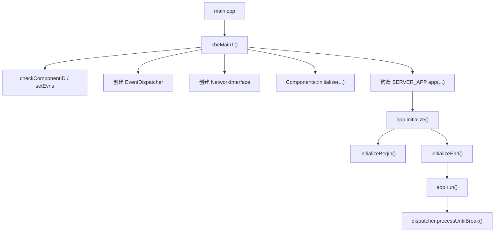
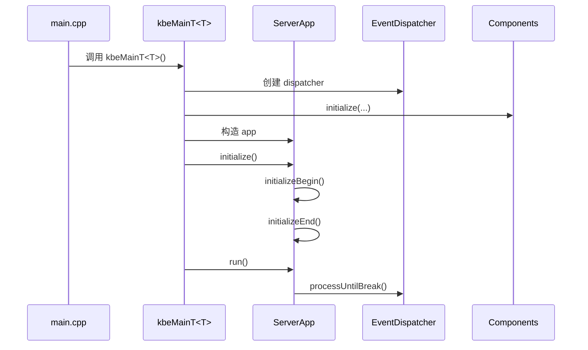
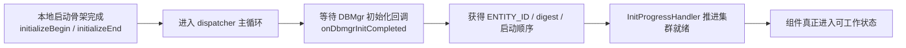

# 启动入口与引导流程

> 这一页回答的不是“main 在哪”这么简单，而是启动链的完整骨架：组件进程从可执行入口进入 `kbeMainT<T>` 后，怎样建立 `EventDispatcher`、`NetworkInterface`、组件实例、初始化阶段，以及最终的主循环。

## 先给结论

KBEngine 各个服务端组件虽然有各自的 `main.cpp`，但真正的启动逻辑几乎都收敛到一套模板化骨架里：

```text
main.cpp
  → kbeMainT<SERVER_APP>()
    → 构建 EventDispatcher / NetworkInterface / Components
    → app.initialize()
      → initializeBegin()
      → initializeEnd()
    → app.run()
      → dispatcher.processUntilBreak()
```

也就是说：

- 每个组件的 `main.cpp` 主要负责把接口表和组件类型接进来
- 真正的启动差异体现在 `SERVER_APP` 的派生类实现里



## 第一步：组件自己的 `main.cpp` 其实很薄

以 BaseApp 为例：

- `kbe/src/server/baseapp/main.cpp`

这个文件做的事情主要有两类：

1. 把当前组件会用到的接口表编译进来
2. 调 `kbeMainT<Baseapp>(...)`

真正的入口是：

```cpp
int KBENGINE_MAIN(int argc, char* argv[])
{
    ENGINE_COMPONENT_INFO& info = g_kbeSrvConfig.getBaseApp();
    return kbeMainT<Baseapp>(argc, argv, BASEAPP_TYPE, ...);
}
```

所以组件入口文件并不承载业务初始化逻辑，它更像“把这个组件实例接到公共启动模板上”。

## 第二步：`kbeMainT<T>` 才是统一启动模板

核心文件：

- `kbe/src/lib/server/kbemain.h`

`kbeMainT<T>` 这条链是理解所有组件启动的总入口。

它至少做了这些事：

1. `checkComponentID(componentType)` 解决组件 ID 与 UID
2. `setEvns()` 写入环境变量，例如 `KBE_COMPONENTID`
3. 创建 `EventDispatcher`
4. 创建 `NetworkInterface`
5. `Components::getSingleton().initialize(...)`
6. 构造实际组件对象 `SERVER_APP app(...)`
7. 调 `app.initialize()`
8. 调 `app.run()`

这条模板的意义非常大，因为它说明：

- 组件差异是通过模板参数注入的
- 运行骨架、网络骨架、组件注册骨架是统一的

所以你看 `Baseapp`、`Cellapp`、`Dbmgr`、`Loginapp` 时，不能把它们理解成几套独立服务器程序，而是同一骨架上的不同特化。

## 第三步：在构造组件前，运行时基础设施已经先准备好了

在 `kbeMainT<T>` 里，组件实例创建前就已经有：

- `EventDispatcher`
- `NetworkInterface`
- `Components`
- 全局配置 `g_kbeSrvConfig`

这意味着组件对象从构造函数开始就运行在一个“骨架已存在”的环境里。

因此像：

- 网络监听地址
- 组件 ID
- 外部/内部端口
- 消息摘要

这些东西并不是组件内部临时生成的，而是启动模板先打好的底座。

## 第四步：`ServerApp::initialize()` 是初始化阶段的公共分水岭

核心文件：

- `kbe/src/lib/server/serverapp.h`
- `kbe/src/lib/server/serverapp.cpp`

`ServerApp::initialize()` 这一步最值得记住的不是细节，而是它明确把初始化拆成了两段：

- `initializeBegin()`
- `initializeEnd()`

在 `serverapp.cpp` 里也能看到：

```text
if (!initializeBegin()) ...
bool ret = initializeEnd();
```

这层拆分非常关键，因为很多组件都要在“基础设施搭好以后，但还没完全对外可用以前”做分阶段初始化。

所以启动不是一个原子动作，而是：

- 先把本地运行环境拉起来
- 再完成与其他组件、DBMgr、Manager 的握手和注册

## 第五步：`ServerApp::run()` 真正进入主循环

同一个公共类里，`run()` 也很简单但很重要：

```text
dispatcher_.processUntilBreak();
```

这说明所有组件最后都回到同一个主循环模型：

- 事件驱动
- 单线程调度
- 网络、定时器、任务共同挂在 dispatcher 上

因此“组件启动完成”与“进入主循环”之间的边界是明确的：

- 初始化阶段负责搭环境、注册组件、建立连接
- `run()` 之后就是正常运行态



## 第六步：`EntityApp` 组件比 `ServerApp` 多一层实体初始化

核心文件：

- `kbe/src/lib/server/entity_app.h`

对 `Baseapp` 和 `Cellapp` 来说，只有 `ServerApp` 还不够，它们还要补上：

- Python 脚本运行时
- `EntityDef`
- 实体容器 `Entities<E>`
- `callbackMgr`
- `EntityIDClient`

这也是为什么 `EntityApp` 继承层级如此重要：

- `ServerApp` 负责公共骨架
- `EntityApp` 负责把“实体世界”装进这个骨架

所以你在 `Baseapp::initializeBegin()`、`Cellapp::initializeBegin()` 里看到的很多差异，其实都是建立在 `EntityApp` 已经先完成实体层准备的基础上。

## 第七步：真正的“可以开始工作”通常要等 DBMgr 回调

仅仅执行完 `initializeBegin/End`，并不意味着 EntityApp 组件已经拥有完整运行条件。

最关键的同步消息之一是：

- `EntityApp::onDbmgrInitCompleted(...)`

这一步来自 DBMgr，带回来的是：

- 游戏时间
- `ENTITY_ID` 分配区间
- 全局 / 组内启动顺序
- 协议摘要 `digest`

在源码里这一步非常关键，因为它把本组件真正接进了集群的一致性世界：

- ID 分配从此可用
- 协议摘要可以校验是否一致
- 组件启动顺序可以确定

所以对 `Baseapp` / `Cellapp` 来说，“本地初始化完成”不等于“集群初始化完成”。



## 第八步：InitProgressHandler 说明初始化是“渐进完成”的

如果只看 `Baseapp` / `Cellapp`，还有一个非常重要的对象：

- `InitProgressHandler`

相关文件：

- `kbe/src/server/baseapp/initprogress_handler.cpp`
- `kbe/src/server/cellapp/initprogress_handler.cpp`

它负责：

- 维护当前初始化进度
- 等待待连接组件补齐
- 发送 `onRegisterNewApp`
- 向 `Baseappmgr` / `Cellappmgr` 上报进度

这说明 KBEngine 的启动设计并不是“所有东西同步阻塞好再进入运行”，而是：

- 先进入可调度主循环
- 再通过进度处理器逐步完成集群级就绪

这也是为什么你会在源码里看到：

- `onBaseappInitProgress`
- `onCellappInitProgress`
- `onRegisterNewApp`

这些消息在初始化阶段频繁出现。

## 第九步：组件注册本身就是启动流程的一部分

很多人会把 `onRegisterNewApp` 当成“运行时动态发现”的附加功能，其实它也是启动链的一部分。

核心文件：

- `kbe/src/lib/server/components.cpp`
- `kbe/src/lib/server/serverapp.cpp`

组件启动后，需要把自己注册给：

- `Baseappmgr`
- `Cellappmgr`
- `Dbmgr`
- `Logger`
- 其他相关组件

因此启动流程不仅是本地构造对象，还包括：

- 建立到关键组件的连接
- 把自己的地址、组件 ID、顺序号广播出去
- 接收别人对自己的注册信息

这一步完成后，组件间的消息拓扑才真正建立起来。

## 第十步：不同组件的差异主要体现在“初始化后半段”

虽然前面的骨架统一，但不同组件在后半段仍然差异明显：

### Loginapp

- 继承 `PythonApp`
- 重点在登录接入、账号接口、与 DBMgr 的早期握手

### Baseapp / Cellapp

- 继承 `EntityApp`
- 要等 `onDbmgrInitCompleted`
- 还要处理 `InitProgressHandler`

### Baseappmgr / Cellappmgr

- 继承 `ServerApp`
- 主要负责接收下游组件进度、更新负载与调度状态

### Dbmgr

- 初始化 DBInterface、线程池、EntityDef、ID 分配
- 再向 EntityApp 组件广播初始化完成

也就是说，组件差异不是体现在入口，而是体现在“公共启动模板执行到组件特化阶段以后”。

## 读源码的最短路径

如果你准备在 IDE 里走一遍启动流程，建议顺序是：

1. `kbe/src/server/baseapp/main.cpp`
2. `kbe/src/lib/server/kbemain.h` → `kbeMainT<T>`
3. `kbe/src/lib/server/serverapp.cpp` → `initialize()` / `run()`
4. `kbe/src/lib/server/entity_app.h` → `initialize()` / `onDbmgrInitCompleted()`
5. `kbe/src/server/baseapp/baseapp.cpp` → `initializeBegin()` / `initializeEnd()`
6. `kbe/src/server/baseapp/initprogress_handler.cpp`
7. 再横向对照 `cellapp.cpp` / `dbmgr.cpp` / `loginapp.cpp`

这样读的好处是：先抓统一骨架，再抓组件差异，不会一开始就淹没在某个组件的细节里。

## 与主线章节的关系

这一页适合做“启动地图”。

如果你要看完整叙事版，请回到：

- `/study/04-startup-and-process-model.html`

主线解释“为什么这样分阶段启动”，这一页则告诉你这些阶段在源码里具体落到哪些公共函数和哪些组件回调上。
