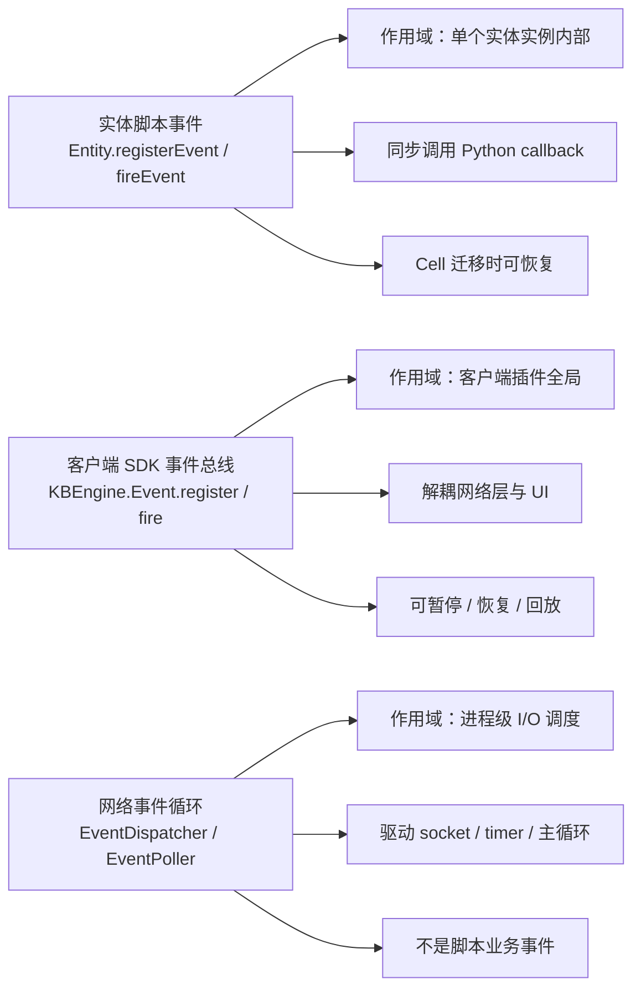
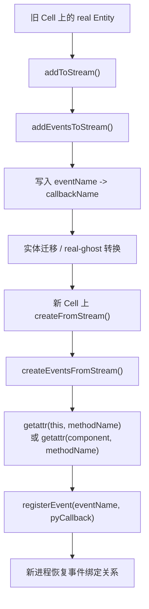

# 事件系统：`fireEvent`、实体事件与客户端事件总线

> 这一页是对 `fireEvent/registerEvent/deregisterEvent` 的继续深挖。主线学习先放在 [18. 钩子、回调、定时器与事件](/study/18-hooks-callbacks-timers-and-events.md)，这里单独把事件系统拆出来，集中记录源码入口、运行时边界、BigWorld 对照和使用场景。

## 先收一版当前判断

KBEngine 里至少有三类容易混用的“事件”：

| 名称 | 作用域 | 典型入口 | 核心用途 |
| --- | --- | --- | --- |
| 实体脚本事件 | 单个实体实例内部 | `Entity.registerEvent()` / `Entity.fireEvent()` | 在一个实体内部做运行时发布订阅 |
| 客户端 SDK 事件总线 | 客户端插件全局 | `KBEngine.Event.fire()` / `KBEngine.Event.register()` | 把网络、登录、实体进入世界等 SDK 状态通知给 UI/表现层 |
| 网络事件循环 | 进程级 I/O 调度 | `EventDispatcher` / `EventPoller` | 驱动 socket、timer、主循环，不是脚本业务事件 |

这三类都叫“event”，但不是同一个系统。源码阅读时最容易犯的错误，就是把 `Entity.fireEvent()` 理解成跨进程消息，或者把客户端模板里的 `KBEngine.Event.fire()` 理解成服务端实体事件。

最核心的结论是：

- `Entity.fireEvent()` 是本地同步调用，不发网络包，不跨实体，不跨进程。
- `Entity.registerEvent()` 保存的是 Python callable 引用，事件名只是字符串 key。
- Cell 实体迁移时，事件注册关系会被写入迁移流；恢复时用方法名重新 `getattr`。
- BigWorld 存在类似机制，叫 `ScriptEvents`，但它是组件级全局事件总线，主要服务 `BWPersonality` 回调，不是实体级事件表。
- 客户端 SDK 的 `KBEngine.Event` 是另一个系统，用来解耦插件层和 UI/表现层。



## API 契约引用

`docs/api/**` 保持和 CHM 原文一致，只在确认原文或迁移有误时修正。本文不改写 API 语义，只引用 API 页作为接口契约，再从源码解释这些接口如何实现。

| API 页面 | `fireEvent` | `registerEvent` | `deregisterEvent` |
| --- | --- | --- | --- |
| BaseApp `Entity` | [fireEvent](/api/baseapp/Entity.md#fireEvent) | [registerEvent](/api/baseapp/Entity.md#registerEvent) | [deregisterEvent](/api/baseapp/Entity.md#deregisterEvent) |
| CellApp `Entity` | [fireEvent](/api/cellapp/Entity.md#fireEvent) | [registerEvent](/api/cellapp/Entity.md#registerEvent) | [deregisterEvent](/api/cellapp/Entity.md#deregisterEvent) |
| Client `Entity` | [fireEvent](/api/client/Entity.md#fireEvent) | [registerEvent](/api/client/Entity.md#registerEvent) | [deregisterEvent](/api/client/Entity.md#deregisterEvent) |
| Bots `Entity` | [fireEvent](/api/bots/Entity.md#fireEvent) | [registerEvent](/api/bots/Entity.md#registerEvent) | [deregisterEvent](/api/bots/Entity.md#deregisterEvent) |

API 层给出的公共语义是：

- `fireEvent(self, eventName, *args)`：触发实体事件，并携带可变参数。
- `registerEvent(self, eventName, callback)`：注册实体事件监听回调。
- `deregisterEvent(self, eventName, callback)`：注销实体事件监听回调。

下面的源码分析重点回答 API 没有展开的部分：事件表放在哪里、回调如何持有、是否跨进程、Cell 迁移时如何恢复，以及它和 BigWorld `ScriptEvents` 的边界差异。

## 架构层：KBEngine 为什么需要实体事件

实体脚本里已经有生命周期钩子、定时器、异步回调，为什么还需要 `registerEvent/fireEvent`？

因为它解决的是另一类问题：**同一个实体实例内部，不同业务模块之间的运行时响应关系**。

生命周期钩子是引擎决定何时调用：

```text
引擎状态变化
  -> onEnterWorld / onTimer / onDestroy / onWriteToDB
  -> 脚本响应
```

定时器是时间驱动：

```text
addTimer
  -> game tick 到期
  -> onTimer(timerID, userArg)
```

异步回调是结果驱动：

```text
发起数据库/跨组件请求
  -> 保存 callbackID
  -> 结果返回
  -> take(callbackID) 后调用
```

实体事件则是业务内部主动触发：

```text
某个业务模块完成一件事
  -> entity.fireEvent("levelUp", newLevel)
  -> 当前实体上订阅 levelUp 的回调同步执行
```

它本质上是实体内部的观察者模式，用来避免把所有逻辑硬编码在一个生命周期函数里。

## 实体事件的数据结构

实体事件的核心结构定义在 `kbe/src/lib/entitydef/entity_macro.h`：

```cpp
typedef KBEUnordered_map<
    std::string,
    std::vector<PyObjectPtr>
> ENTITY_EVENTS;

ENTITY_EVENTS events_;
```

这说明它非常直接：

- key 是事件名字符串。
- value 是一组 Python 回调。
- 每个实体实例自己持有 `events_`。
- 不存在全局事件中心，也不存在按实体类型共享的事件表。

因此两个同类型实体各自注册同名事件时，互不影响：

```text
Avatar#1001.events_["levelUp"] -> [callbackA]
Avatar#1002.events_["levelUp"] -> [callbackB]
```

`Avatar#1001.fireEvent("levelUp")` 不会触发 `Avatar#1002` 上的回调。

## 脚本接口如何暴露

服务端实体和客户端实体的脚本接口都由宏暴露：

```cpp
SCRIPT_METHOD_DECLARE("registerEvent", pyRegisterEvent, ...)
SCRIPT_METHOD_DECLARE("deregisterEvent", pyDeregisterEvent, ...)
SCRIPT_METHOD_DECLARE("fireEvent", pyFireEvent, ...)
```

对应位置：

- `kbe/src/lib/entitydef/entity_macro.h`

这也解释了为什么上面的四类 `Entity` API 页都能看到这三个方法：它们来自统一的实体宏，不是分别手写出来的四套实现。

## `registerEvent()`：注册的是 callable 引用

核心逻辑仍在 `entity_macro.h`：

```cpp
bool registerEvent(const std::string& evnName, PyObject* pyCallback)
{
    if (!PyCallable_Check(pyCallback))
        return false;

    std::vector<PyObjectPtr>& evnVecs = events_[evnName];
    for (auto iter = evnVecs.begin(); iter != evnVecs.end(); ++iter)
    {
        if ((*iter).get() == pyCallback)
            return false;
    }

    events_[evnName].push_back(pyCallback);
    return true;
}
```

这里有几个关键点：

- 只接受可调用对象。
- 同一个 callable 指针不能重复注册到同一个事件。
- 判断重复用的是 `PyObject*` 指针相等，不是函数名字符串。
- `PyObjectPtr` 会持有回调引用，避免注册后对象立刻被释放。

脚本侧常见用法：

```python
class Avatar(KBEngine.Entity):
    def onInitializeScript(self):
        self.registerEvent("levelUp", self.onLevelUp)
        self.registerEvent("levelUp", self.refreshTitle)

    def onLevelUp(self, newLevel):
        self.level = newLevel

    def refreshTitle(self, newLevel):
        # 刷新称号、战力、任务状态等派生逻辑
        pass
```

## `fireEvent()`：本地同步调用，不发网络消息

核心逻辑：

```cpp
void fireEvent(const std::string& evnName, PyObject* pyArgs = NULL)
{
    std::vector<PyObjectPtr>& evnVecs = events_[evnName];
    for (auto iter = evnVecs.begin(); iter != evnVecs.end(); ++iter)
    {
        PyObject* pyResult = NULL;
        if (pyArgs == NULL)
            pyResult = PyObject_CallObject((*iter).get(), NULL);
        else
            pyResult = PyObject_CallObject((*iter).get(), pyArgs);

        if (pyResult == NULL)
            SCRIPT_ERROR_CHECK();
        else
            Py_DECREF(pyResult);
    }
}
```

这段代码给出几个明确边界：

- `fireEvent()` 只是遍历当前实体的回调数组。
- 每个回调通过 `PyObject_CallObject` 直接同步调用。
- 回调返回值会被释放，不参与后续逻辑。
- 某个回调报错时会走 `SCRIPT_ERROR_CHECK()`，但事件机制本身不是事务。
- 访问 `events_[evnName]` 会在事件不存在时创建一个空 vector。

脚本侧参数处理也在宏里完成：

```text
fireEvent("name")
  -> callback()

fireEvent("name", oneArg)
  -> callback(oneArg)

fireEvent("name", a, b, c)
  -> callback(a, b, c)
```

所以它不是“传一个 args 列表”，而是把 `eventName` 之后的参数切成 Python tuple 再传给回调。

## `deregisterEvent()`：按 callable 指针移除

取消注册也很直接：

```cpp
bool deregisterEvent(const std::string& evnName, PyObject* pyCallback)
{
    std::vector<PyObjectPtr>& evnVecs = events_[evnName];
    for (auto iter = evnVecs.begin(); iter != evnVecs.end(); ++iter)
    {
        if ((*iter).get() == pyCallback)
        {
            evnVecs.erase(iter);
            return true;
        }
    }

    return false;
}
```

注意它也是按 `PyObject*` 匹配。因此实践中建议：

- 注册和注销使用同一个实例方法引用。
- 不要临时构造 lambda 后再期待能按另一个 lambda 注销。
- 长生命周期实体在 `onDestroy` 或业务模块卸载时主动注销不再需要的回调。

## Cell 迁移时为什么事件还能恢复

KBEngine 的事件系统最有价值的地方不只是“能注册回调”，而是 Cell 实体迁移时能恢复事件关系。



Cell 实体迁移/real-ghost 转换时，会走：

```text
Entity::changeToGhost()
  -> addToStream()
  -> addEventsToStream()

Entity::changeToReal()
  -> createFromStream()
  -> createEventsFromStream()
```

真实顺序在 `kbe/src/server/cellapp/entity.cpp`：

```cpp
addMovementHandlerToStream(s);
addControllersToStream(s);
addWitnessToStream(s);
addTimersToStream(s);
addEventsToStream(s);
pyCallbackMgr_.addToStream(s);
```

恢复时：

```cpp
createMovementHandlerFromStream(s);
createControllersFromStream(s);
createWitnessFromStream(s);
createTimersFromStream(s);
createEventsFromStream(s);
pyCallbackMgr_.createFromStream(s);
```

这说明事件注册关系被视为实体运行态的一部分，和 controller、witness、timer、callback 一样参与迁移恢复。

### 序列化时保存的不是 Python 对象

`addEventsToStream()` 不会直接 pickle callable，而是读取回调对象的 `__qualname__`：

```cpp
PyObject* pyObj = PyObject_GetAttrString(callback, "__qualname__");
```

然后根据限定名判断是实体方法还是组件方法：

- 普通实体方法保存 `methodName`
- 组件方法保存 `componentName.methodName`
- 无法确认的回调保存 `"None"`，迁移时跳过

也就是说，这种事件恢复更适合下面这种注册：

```python
self.registerEvent("questAccepted", self.onQuestAccepted)
self.inventory.registerEvent("itemChanged", self.inventory.onItemChanged)
```

不适合依赖匿名闭包或动态函数对象：

```python
# 不推荐：迁移恢复时无法稳定通过方法名找回
self.registerEvent("levelUp", lambda level: self.doSomething(level))
```

### 恢复时通过 `getattr` 重建引用

`createEventsFromStream()` 会按字符串重新找回方法：

```cpp
if (callbackName contains ".")
{
    pyObj = PyObject_GetAttrString(this, componentName);
    pyCallback = PyObject_GetAttrString(pyObj, methodName);
}
else
{
    pyCallback = PyObject_GetAttrString(this, methodName);
}

registerEvent(eventName, pyCallback);
```

这就是为什么推荐把事件回调写成实体方法或实体组件方法。这样实体迁移后，只要新进程上脚本类和组件仍然存在，事件注册关系就能重建。

## BaseApp 与 CellApp 的差异

`Entity.fireEvent/registerEvent/deregisterEvent` 是通用实体宏暴露的，所以 Base 实体和 Cell 实体都能用。

但迁移恢复能力主要体现在 Cell 实体：

- Cell 实体有 `addEventsToStream()` / `createEventsFromStream()`。
- 这些函数挂在 `cellapp/entity.cpp` 的 `addToStream()` / `createFromStream()` 链上。
- Base 实体事件也能本地触发，但不走同一套 Cell real/ghost 迁移流。

因此可以这样理解：

- Base 侧事件：更适合实体内部业务模块解耦。
- Cell 侧事件：除了业务解耦，还要考虑空间迁移后的恢复语义。

## 客户端 SDK 的 `KBEngine.Event` 是另一套系统

客户端模板里也大量出现 `KBEngine.Event.fire(...)`，例如 JS 模板：

```javascript
KBEngine.Event.register("onConnectionState", this, "onConnectionState")
KBEngine.Event.fire("login", username, password, "kbengine_demo")
```

对应实现：

- `kbe/res/sdk_templates/client/js/kbengine.js`
- `kbe/res/sdk_templates/client/unity/*`
- `kbe/res/sdk_templates/client/ue4/*`
- `kbe/src/lib/client_lib/event.h`
- `kbe/src/lib/client_lib/clientobjectbase.cpp`

它的架构意图不同：

```text
网络插件层
  -> 登录成功 / 失败
  -> 实体进入世界 / 离开世界
  -> 属性、位置、控制权变化
  -> KBEngine.Event.fire(...)
  -> UI / 表现层监听并刷新界面
```

客户端事件总线解决的是插件层和游戏表现层解耦，不是实体运行态迁移。

JS 模板里的事件对象支持：

- `register(evtName, classinst, strCallback)`
- `deregister(evtName, classinst)`
- `fire(evtName, ...args)`
- `pause()`
- `resume()`
- `clear()`

它甚至会在暂停时缓存 fired events，`resume()` 后再依次回放。这和服务端 `Entity.fireEvent()` 的同步调用模型不同。

## BigWorld 是否有类似机制

BigWorld 有类似机制，叫 `ScriptEvents`，核心文件：

- `BigWorld-Engine-14.4.1/programming/bigworld/lib/pyscript/script_events.cpp`
- `BigWorld-Engine-14.4.1/programming/bigworld/lib/pyscript/script_events.hpp`

但它和 KBEngine 的实体事件作用域不同。

BigWorld 的结构大致是：

```cpp
class ScriptEvents
{
public:
    void createEventType(const char* eventName);
    bool triggerEvent(const char* eventName, PyObject* pArgs, ScriptList resultsList);
    bool triggerTwoEvents(const char* event1, const char* event2, PyObject* pArgs);
    bool addEventListener(const char* eventName, PyObject* pListener, int level = 0);
    bool removeEventListener(const char* eventName, PyObject* pListener);
    void initFromPersonality(ScriptModule personality);
};
```

并通过 Python 模块暴露：

```python
BigWorld.addEventListener("onInit", callback, level=0)
BigWorld.removeEventListener("onInit", callback)
```

BigWorld 的事件类型由组件在启动时注册。例如：

- `ScriptApp` 创建 `onInit`、`onFini`
- `BaseApp` 创建 `onAppReady`、`onBaseAppReady`、`onGlobalData` 等
- `CellApp` 创建 `onCellAppReady`、`onSpaceGeometryLoaded`、`onSpaceData` 等
- `DBApp` 创建 `onAppReady`、`onDBAppReady`

触发时由引擎内部调用：

```text
组件状态变化
  -> scriptEvents().triggerEvent(...)
  -> ScriptEventList.triggerEvent(...)
  -> Script::ask(callback, args)
```

### BigWorld 的几个关键特性

BigWorld 的 `ScriptEventList::triggerEvent()` 会先复制监听列表：

```cpp
ScriptEventList copy(*this);
```

这避免了回调执行过程中增删 listener 影响当前遍历。

它还支持 listener level：

```cpp
addEventListener(eventName, callback, level)
```

插入时按 level 排序，level 高的更晚执行。这个能力适合组件级生命周期事件，因为不同系统可能需要明确初始化/清理顺序。

它还可以收集回调结果：

```cpp
triggerEvent(eventName, args, resultsList)
```

KBEngine 的实体 `fireEvent()` 则直接忽略回调返回值。

## KBEngine 与 BigWorld 的事件模型对比

| 维度 | KBEngine 实体事件 | KBEngine 客户端事件 | BigWorld ScriptEvents |
| --- | --- | --- | --- |
| 作用域 | 单个实体实例 | 客户端插件全局 | 单个组件进程的脚本全局 |
| 注册入口 | `entity.registerEvent` | `KBEngine.Event.register` | `BigWorld.addEventListener` |
| 触发入口 | `entity.fireEvent` | `KBEngine.Event.fire` | 引擎内部 `triggerEvent` |
| 是否跨进程 | 否 | 否 | 否 |
| 是否发网络包 | 否 | 否 | 否 |
| 回调返回值 | 忽略 | 忽略 | 可收集到 `resultsList` |
| 顺序控制 | 注册顺序 | 注册顺序 | 支持 `level` |
| 迁移恢复 | Cell 实体支持 | 不涉及 | 不涉及实体迁移 |
| 主要用途 | 实体内部业务解耦 | SDK 与 UI 解耦 | 组件生命周期/Personality 扩展 |

BigWorld 的事件机制更像“组件级生命周期扩展点”，KBEngine 的实体事件更像“实体内部业务事件表”。

## 使用场景建议

适合使用 `Entity.registerEvent/fireEvent` 的场景：

- 同一个实体内多个系统响应同一业务事件，例如升级、接任务、装备变化。
- 实体组件之间解耦，例如背包组件变化后通知任务、成就、战力组件。
- Cell 实体上需要迁移后继续保留的运行时订阅关系。
- 业务脚本内部的轻量同步观察者模式。

不适合的场景：

- 跨实体通信：应使用 EntityCall、显式方法调用或管理器实体。
- 跨进程通知：应使用引擎消息、EntityCall、全局数据或组件接口。
- 需要返回值聚合：`fireEvent()` 忽略返回值，应该显式调用并汇总。
- 复杂异步流程：应使用回调、状态机或任务系统，不要把异步链塞进事件回调。
- 大量高频事件：每次都是 Python 同步调用，高频循环里滥用会增加脚本开销。

## 服务端示例：实体内部事件

```python
class Avatar(KBEngine.Entity):
    def onInitializeScript(self):
        self.registerEvent("levelUp", self.onLevelUp)
        self.registerEvent("levelUp", self.quest.onAvatarLevelUp)
        self.registerEvent("levelUp", self.achievement.onAvatarLevelUp)

    def addExp(self, value):
        self.exp += value
        if self.exp >= self.nextLevelExp:
            self.level += 1
            self.fireEvent("levelUp", self.level)

    def onLevelUp(self, level):
        self.refreshCombatPower()
        self.client.onLevelUp(level)

    def onDestroy(self):
        self.deregisterEvent("levelUp", self.onLevelUp)
```

这个例子里，升级这件事发生后，任务、成就、战力等模块都能响应，但 `addExp()` 不需要直接知道所有订阅者。

## 客户端示例：SDK 与 UI 解耦

```javascript
KBEngine.Event.register("onLoginBaseapp", this, "onLoginBaseapp")
KBEngine.Event.register("onEnterWorld", this, "onEnterWorld")

function onLoginButtonClicked(username, password) {
  KBEngine.Event.fire("login", username, password, "demo")
}

function onLoginBaseapp() {
  this.showLoading("正在进入世界")
}

function onEnterWorld(entity) {
  this.bindPlayer(entity)
}
```

这里 UI 不直接调用底层网络包发送逻辑，而是向 SDK 事件总线发一个 `login` 事件。SDK 内部已经把 `login` 注册到 `KBEngine.app.login`。

## 阅读源码时的检查清单

看 `fireEvent` 相关代码时，建议按下面顺序：

1. `kbe/src/lib/entitydef/entity_macro.h`：看 `events_`、`registerEvent`、`fireEvent`、`deregisterEvent` 的真实逻辑。
2. `kbe/src/server/cellapp/entity.cpp`：看 `addEventsToStream` / `createEventsFromStream` 如何参与 Cell 迁移。
3. `kbe/src/lib/client_lib/event.h`：看客户端 C++ SDK 的 `EventHandler` / `EventData`。
4. `kbe/res/sdk_templates/client/js/kbengine.js`：看 JS SDK 的 `KBEngine.Event` 实现。
5. `BigWorld-Engine-14.4.1/programming/bigworld/lib/pyscript/script_events.cpp`：对照 BigWorld 的全局脚本事件。
6. `BigWorld-Engine-14.4.1/programming/bigworld/server/baseapp/baseapp.cpp`、`cellapp/cellapp.cpp`、`dbapp/dbapp.cpp`：看 BigWorld 事件类型在哪里注册、在哪里触发。

## 小结

- `Entity.fireEvent` 是实体实例内部的同步发布订阅，不是网络消息。
- KBEngine 实体事件保存 Python callable，迁移时保存方法名并通过 `getattr` 恢复。
- Cell 实体事件是运行态的一部分，和 timer、controller、witness、callback 一起进入迁移流。
- 客户端 `KBEngine.Event.fire` 是 SDK/UI 解耦总线，不等同于实体事件。
- BigWorld 的 `ScriptEvents` 是组件级全局事件机制，主要承载 Personality 生命周期扩展点。
- 如果要跨实体、跨进程、需要返回值或异步编排，不应该用 `fireEvent` 硬做。
