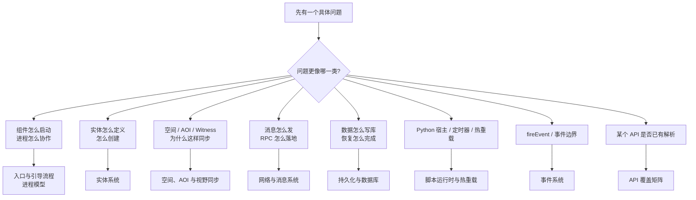

# KBEngine 源码学习总览

> 这组页面记录的是围绕具体问题展开的源码学习过程：先带着问题进入源码，再把能确认的文件、类、函数和调用链整理出来。
>
> 它不是独立于 `study/**` 的第二套主线，也不试图替代架构总览。更合适的理解是：`study/**` 负责按主题递进地学习，`source-analysis/**` 负责把其中值得深挖的问题拆成专题继续往下读。

如果你还没有建立全局地图，建议先回到 [架构总览](/architecture/) 看系统地图；那里负责回答“这些目录各自承担什么角色”，这里再继续回答“某个具体问题在源码里怎么落地”。

## 从问题进入专题

## 学习主线

1. [启动入口与引导流程](/architecture/source-analysis/entry-and-bootstrap.md)
2. [进程模型与组件协作](/architecture/source-analysis/process-model.md)
3. [实体系统](/architecture/source-analysis/entity-system.md)
4. [空间、AOI 与视野同步](/architecture/source-analysis/space-aoi.md)
5. [网络与消息系统](/architecture/source-analysis/networking.md)
6. [持久化与数据库](/architecture/source-analysis/persistence.md)
7. [脚本运行时与热重载](/architecture/source-analysis/scripting.md)
8. [事件系统：fireEvent 与事件总线](/architecture/source-analysis/events.md)
9. [API 到源码解析覆盖矩阵](/architecture/source-analysis/api-coverage.md)

## 内容归属

- `study/**`：主学习路径，负责主题递进、章节串联和阅读顺序。
- `source-analysis/**`：源码学习专题，负责沿着具体问题继续深挖实现和边界。
- `api/**`：接口契约，保持和 CHM 一致，只在确认错误时修正。
- `comparison/**` 与 `bigworld/**`：负责对照和背景，不重复展开 KBEngine 的源码细节。

## API 覆盖追踪

[API 到源码解析覆盖矩阵](/architecture/source-analysis/api-coverage.md) 用来维护 `docs/api/**` 和源码学习专题之间的对应关系。API 页保持和 CHM 一致，覆盖矩阵只记录解析状态、源码落点和后续缺口。

## 阅读原则

- 优先记“代码怎么走”，其次才补“为什么这样设计”。
- 记录尽量落到文件、类、函数、调用路径，而不是只停留在概念层。
- 同一个问题只保留一个详细展开点，主线章节里以摘要和链接为主，避免重复写两遍。
- BigWorld 只作为参考系，不替代对 KBEngine 源码本身的阅读记录。
