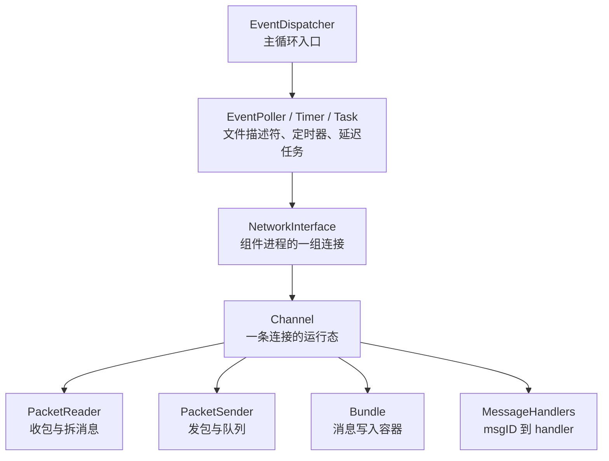
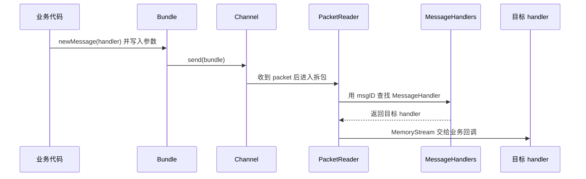
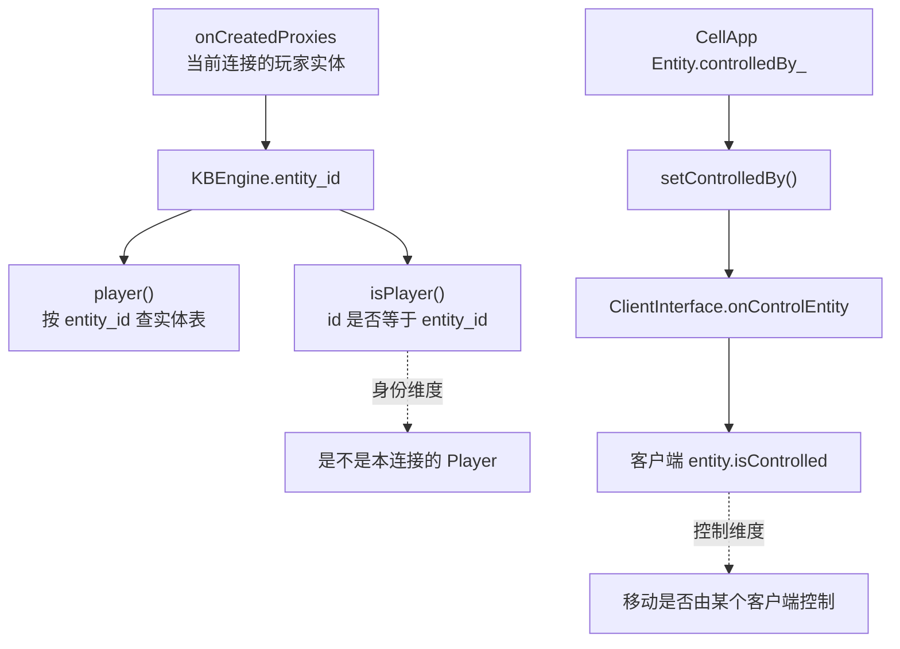
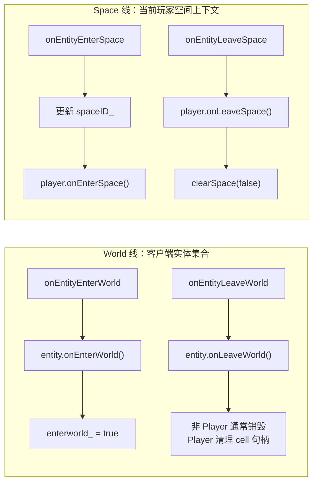
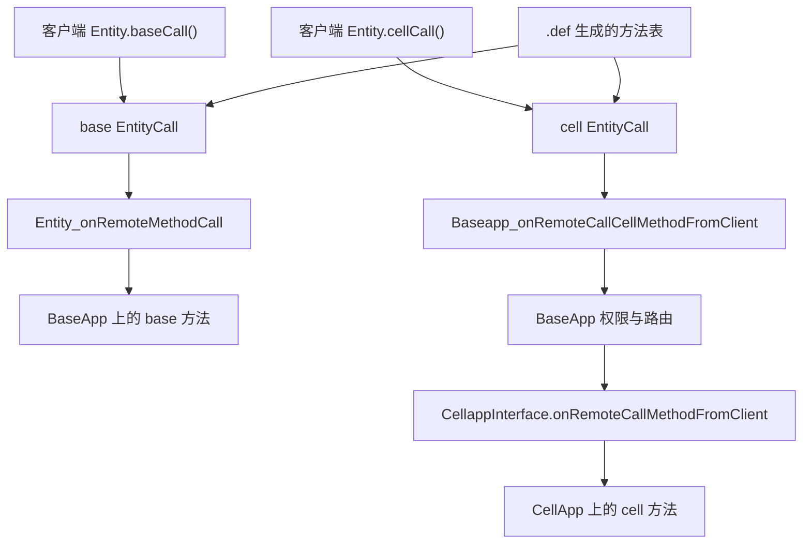
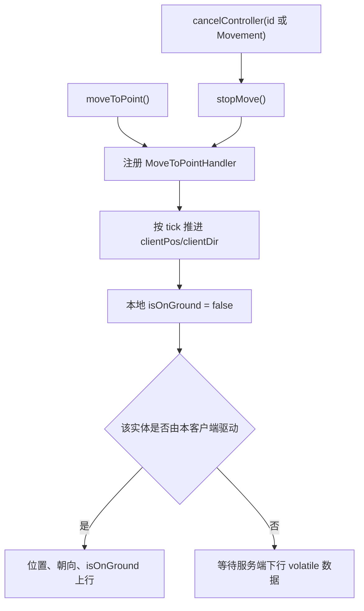
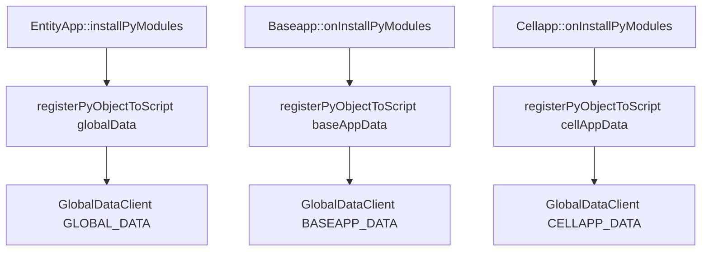
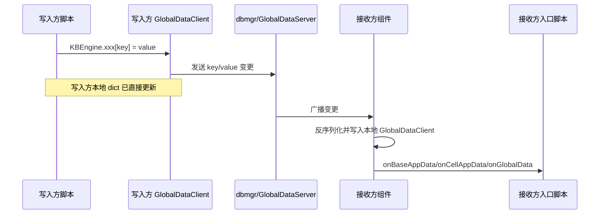

# 网络与消息系统

> 这一页聚焦源码里的真正网络骨架：事件循环怎样驱动所有连接，`Channel` 怎样持有收发状态，`Bundle` 怎样把“消息”落成“包”，以及一条消息最终怎样找到处理函数。

## 先建立一个分层图

KBEngine 的网络层不是一个“大 socket 类”，而是几层配合：

```text
EventDispatcher
  └── EventPoller / Timer / Task
        └── NetworkInterface
              └── Channel
                    ├── PacketReader / PacketSender
                    ├── Bundle
                    └── MessageHandlers
```

换成源码阅读时更容易定位职责的图，就是：



这几层分别解决不同问题：

- `EventDispatcher` 负责主循环
- `NetworkInterface` 负责维护一组通道
- `Channel` 负责一条连接的收发状态
- `Bundle` 负责把多条逻辑消息编码进 packet 流
- `MessageHandlers` 负责 `msgID -> handler` 映射

## 第一层：EventDispatcher 是总驱动器

最基础的入口是：

- `kbe/src/lib/network/event_dispatcher.h`

从接口就能看出它的职责不是”只跑网络”，而是统一调度：

- `processOnce()`
- `processUntilBreak()`
- `addTimer()`
- `addTask()`
- `registerReadFileDescriptor()`
- `registerWriteFileDescriptor()`

这意味着 KBEngine 的主线程模型本质上是：

- 文件描述符事件
- 定时器
- 延迟任务

三者统一挂在一个事件循环里，而不是”网络线程 + 逻辑线程 + 定时器线程”三套独立框架。

因此游戏逻辑、网络回调、定时 tick 在主线程上能天然保持串行语义，这也是实体侧大量代码不依赖锁的前提。

**关于 EventDispatcher 的详细定时器机制，见**：[[非实体定时器#EventDispatcher 是总驱动器]]

## 第二层：NetworkInterface 管的不是一个连接，而是一组连接

核心文件：

- `kbe/src/lib/network/network_interface.h`

`NetworkInterface` 最值得记住的成员和方法：

- `channelMap_`
- `registerChannel()`
- `deregisterChannel()`
- `findChannel()`
- `processChannels()`
- `sendIfDelayed()` / `delayedSend()`

它的角色更接近“某个组件进程的连接总线”。

比如 `Baseapp`、`Cellapp`、`Loginapp` 都会各自持有一个 `NetworkInterface`，其上同时管理：

- 对客户端的外部通道
- 对其他组件的内部通道

所以当你看到某个组件里 `networkInterface().processChannels(...)`，你要理解成“处理该进程当前所有活跃连接”，而不是单个 socket 行为。

## 第三层：Channel 才是一条连接的真正运行态

核心文件：

- `kbe/src/lib/network/channel.h`
- `kbe/src/lib/network/channel.inl`

`Channel` 内部同时持有很多状态：

- 地址与 endpoint
- `PacketReader` / `PacketSender`
- `Bundles`
- KCP / WebSocket / 加密过滤器
- 收发统计
- inactivity 检测
- `MessageHandlers*`

从接口看，最值得优先理解的是：

- `send()`
- `sendto()`
- `createSendBundle()`
- `onPacketReceived()`
- `processPackets()`
- `updateTick()`
- `condemn()`

这说明 `Channel` 不只是一个“可写 socket 包装器”，它还负责：

- 连接收发队列
- 包级解析状态
- 超时与销毁状态
- 协议子类型切换（TCP / KCP / WebSocket）

所以网络层真正的“会话对象”其实是 `Channel`。

## 第四层：Bundle 不是消息本身，而是消息容器

核心文件：

- `kbe/src/lib/network/bundle.h`

`Bundle` 最关键的接口就两个：

- `newMessage(const MessageHandler& msgHandler)`
- `finiMessage()`

加上一组 `operator<<` 用于逐字段写入。

这层设计要点是：

- 一条逻辑消息先通过 `newMessage()` 选择消息定义
- 再把参数序列化进当前 packet
- 如果一个 packet 不够，`Bundle` 会自动跨多个 packet 续写

因此 `Bundle` 承担的是“消息打包器”角色，不是“协议 schema”本身；schema 在 `MessageHandlers / Interface` 宏生成结果里。

这也是为什么源码里高频出现这种模式：

```cpp
Bundle* pBundle = Network::Bundle::createPoolObject(OBJECTPOOL_POINT);
(*pBundle).newMessage(LoginappInterface::onLoginAccountQueryResultFromDbmgr);
(*pBundle) << value1 << value2;
pChannel->send(pBundle);
```

网络消息在 KBEngine 里就是这样落地的：先选消息 handler，再序列化字段，再交给 channel 发送。

## 第五层：MessageHandlers 决定“收到 msgID 后调用谁”

`MessageHandlers` 本身的定义分散在接口宏和网络公共代码里，但从使用方式已经很清楚：

- 每个组件会设置自己的主消息表
- 同一个进程收到消息后，会按当前消息表查 handler

例如：

- `LoginappInterface::messageHandlers`
- `BaseappInterface::messageHandlers`
- `CellappInterface::messageHandlers`
- `ClientInterface::messageHandlers`

在启动时可以看到类似代码：

- `Loginapp` 把 `pMainMessageHandlers` 指向 `LoginappInterface::messageHandlers`
- `Baseapp` 指向 `BaseappInterface::messageHandlers`
- `Cellapp` 指向 `CellappInterface::messageHandlers`

所以消息分发的本质不是反射，而是：

1. 读出 `msgID`
2. 在对应接口表中查 handler
3. 把 `MemoryStream` 交给该 handler

## PacketReader：消息分发真正发生的地方

如果你只想跟一次“收到包以后到底怎么拆”的路径，直接看：

- `kbe/src/lib/network/packet_reader.cpp`

这里最重要的函数是：

- `PacketReader::processMessages()`

它做的事包括：

- 从 packet 中不断取出 `msgID`
- 查对应 `MessageHandler`
- 检查消息长度是否合法
- 处理分片消息
- 找到目标 handler 后执行业务回调

这层的意义非常重要：

- `Bundle` 解决发送端“怎么写”
- `PacketReader` 解决接收端“怎么拆”

两边合起来，才是完整消息协议栈。

把发送端和接收端合在一起看，一条普通网络消息大致是：



## 典型链路一：登录响应怎样从 Loginapp 发给客户端

从源码能直接看到这一模式：

- `kbe/src/server/loginapp/loginapp.cpp`

高频写法是：

```text
(*pBundle).newMessage(ClientInterface::onLoginSuccessfully)
→ pChannel->send(pBundle)
```

这条链路的关键含义是：

- `Loginapp` 不直接操作底层 socket
- 它只负责选择 `ClientInterface` 中的消息类型并写参数
- 真正的发送由 `Channel` / `PacketSender` / `EndPoint` 完成

所以组件逻辑层和底层收发层是分开的。

## 典型链路二：客户端远程调用怎样到达 Cell

另一条很值得跟的是：

- `kbe/src/server/baseapp/baseapp.cpp`
- `kbe/src/server/cellapp/cellapp.cpp`

客户端消息先由 Base 侧接住，然后通常转发到 Cell：

```text
Baseapp
  → newMessage(CellappInterface::onRemoteCallMethodFromClient)
  → pChannel->send(pBundle)
  → Cellapp::onRemoteCallMethodFromClient(...)
```

这条链路说明了一个关键事实：

- 网络层并不知道“这是技能释放”还是“移动请求”
- 对网络层来说，这只是某个 `msgID` 命中某个 `CellappInterface` handler

业务语义是在 handler 落地之后才开始的。

## 客户端侧也复用同一套思路

不要把服务端和客户端协议栈想成两套完全不同系统。

在客户端库里：

- `kbe/src/lib/client_lib/clientapp.cpp`
- `kbe/src/lib/client_lib/clientobjectbase.cpp`
- `kbe/src/lib/client_lib/client_interface.h`

可以看到完全一致的模式：

- `processChannels(...)`
- `ClientInterface::messageHandlers`
- `onCreatedProxies`
- `onUpdatePropertys`

也就是说，客户端收到包后同样是：

1. packet reader 拆消息
2. 按 `ClientInterface` 查 handler
3. 进入 `ClientObjectBase::onCreatedProxies()` 或 `onUpdatePropertys()`

所以 KBEngine 的“客户端 SDK”并不是另一门协议，而是同一消息系统在客户端侧的镜像实现。

<a id="client-entity-isplayer-control"></a>
## `isPlayer()`、`player()` 和 `controlledBy()` 其实不是一回事

客户端 API 里最容易让人误读的一条就是 `Entity.isPlayer()`。

先用一张图把三条来源分开：



如果只看接口名，很容易把它理解成：

- 这个实体现在是不是“被当前客户端控制”
- 这个实体是不是“当前客户端拥有操作权”

源码说明这两个理解都不精确。

### 第一层：`isPlayer()` 只是“身份判断”，不是“控制权判断”

在客户端 SDK 里，`isPlayer()` 的实现非常直接：

```csharp
// 文件：kbe/res/sdk_templates/client/unity/Entity.cs
public bool isPlayer()
{
    return id == KBEngineApp.app.entity_id;
}
```

```cpp
// 文件：kbe/res/sdk_templates/client/ue4/Source/KBEnginePlugins/Engine/Entity.cpp
bool Entity::isPlayer()
{
    return id() == KBEngineApp::getSingleton().entity_id();
}
```

也就是说，它只判断一件事：

- **当前这个实体的 `id`，是不是本次客户端连接记录下来的 `entity_id`**

这本质上是一个“身份比对”，而不是“控制状态比对”。

### 第二层：`entity_id` 是在哪里来的

这个 `entity_id` 不是随便填进去的，它是在服务端通知“你这个连接对应的玩家代理实体创建好了”时写入的。

Unity 客户端里这条链路很清楚：

```csharp
// 文件：kbe/res/sdk_templates/client/unity/KBEngine.cs
public void Client_onCreatedProxies(UInt64 rndUUID, Int32 eid, string entityType)
{
    entity_uuid = rndUUID;
    entity_id = eid;
    entity_type = entityType;
    ...
}
```

随后 `player()` 也只是按这个 `entity_id` 去实体表里查：

```csharp
// 文件：kbe/res/sdk_templates/client/unity/KBEngine.cs
public Entity player()
{
    Entity e;
    if(entities.TryGetValue(entity_id, out e))
        return e;

    return null;
}
```

因此客户端语义上：

- `player()` = 当前连接对应的玩家实体
- `isPlayer()` = “我是不是这个玩家实体”

它们都不直接回答“当前是不是我在控制移动”。

### 第三层：真正的“控制”来自 `controlledBy()`

“控制”这件事在源码里是另一条链，源头在 CellApp 侧实体的 `controlledBy_`：

```cpp
// 文件：kbe/src/server/cellapp/entity.inl
INLINE EntityCall* Entity::controlledBy() const
{
    return controlledBy_;
}
```

CellApp API 文档里 `controlledBy` 也写得很明确：

- 它表示该实体由哪个客户端关联的服务端实体来控制移动
- 如果为 `None`，则实体由服务端移动

所以这里的“控制”，更准确地说是：

- **移动/驱动权限**
- 而不是“这个实体是不是当前连接自己的 player 身份”

### 第四层：服务端如何把“控制状态变化”通知给客户端

CellApp 改变控制者时，走的是 `Entity::setControlledBy()`：

```cpp
// 文件：kbe/src/server/cellapp/entity.cpp
bool Entity::setControlledBy(EntityCall* controllerBaseEntityCall)
{
    ...
    controlledBy(controllerBaseEntityCall);
    ...
    sendControlledByStatusMessage(controllerBaseEntityCall, 1 or 0);
}
```

真正发给客户端的是 `ClientInterface::onControlEntity`：

```cpp
// 文件：kbe/src/server/cellapp/entity.cpp
void Entity::sendControlledByStatusMessage(EntityCall* baseEntityCall, int8 isControlled)
{
    ...
    (*pForwardBundle).newMessage(ClientInterface::onControlEntity);
    (*pForwardBundle) << id();
    (*pForwardBundle) << isControlled;
    ...
}
```

客户端收到后，再把这个状态写到实体对象上：

```csharp
// 文件：kbe/res/sdk_templates/client/unity/KBEngine.cs
public void Client_onControlEntity(Int32 eid, sbyte isControlled)
{
    ...
    var isCont = isControlled != 0;
    ...
    entity.isControlled = isCont;
    entity.onControlled(isCont);
}
```

所以“控制权”在客户端真正对应的是：

- `entity.isControlled`
- `entity.onControlled(...)`
- 以及客户端内部的 `_controlledEntities`

而不是 `isPlayer()`。

### 第五层：为什么这两个概念一定要分开

客户端实现里专门把这两种状态拆开了。

当收到 `Client_onControlEntity()` 时，如果目标实体不是当前玩家自身，才会进入 `_controlledEntities`：

```csharp
// 文件：kbe/res/sdk_templates/client/unity/KBEngine.cs
if (isCont)
{
    // 如果被控制者是玩家自己，那表示玩家自己被其它人控制了
    // 所以玩家自己不应该进入这个被控制列表
    if (player().id != entity.id)
    {
        _controlledEntities.Add(entity);
    }
}
```

这段代码直接说明了两件事：

1. **玩家自己也可能处于 `isControlled == true`**
   这表示“我这个 player 实体现在被别人控制”
2. **`isPlayer()` 仍然可能为 `true`**
   因为它只看 `id == entity_id`

所以至少会有这几种不同状态：

| 状态 | `isPlayer()` | `isControlled` | 含义 |
|------|--------------|----------------|------|
| 自己的玩家实体，自己正常操作 | `true` | `false` | 当前连接的 player，本地自己驱动 |
| 自己的玩家实体，被别人接管控制 | `true` | `true` | 仍然是自己的 player，但移动控制权不在本地 |
| 不是自己的玩家实体，但被我控制 | `false` | `true` | 当前连接额外控制了另一个可见实体 |
| 普通旁观实体 | `false` | `false` | 只是视野中的普通实体 |

也就是说：

- `isPlayer()` 回答“**这是不是我的 player 身份实体**”
- `isControlled` 回答“**这个实体当前是否处于 controlEntity 控制态**”

它们是两个维度，不是同一个维度。

### 第六层：为什么引擎需要 `isPlayer()`

`isPlayer()` 在客户端不只是一个便利函数，它还影响 `ownerOnly` 客户端属性的处理。

`kbcmd` 生成客户端代码时，会明确生成类似判断：

```cpp
if (pProp_xxx->isOwnerOnly() && !entity->isPlayer())
{
}
else
{
    onXxxChanged(oldVal);
}
```

这说明引擎需要先知道：

- 这个实体是不是“当前连接自己的 player 实体”

只有这样，客户端才能正确区分：

- 哪些属性只有 owner/player 自己能看到
- 哪些属性所有观察者都能看到

因此 `isPlayer()` 的意义首先是**身份识别**，其次才是给业务层提供一个便捷 API。

### 结论：如何正确理解 API 文档里的“当前客户端的 Player”

对 `Entity.isPlayer()` 最准确的理解应该是：

- **它返回当前实体是否就是本次客户端连接对应的 player 实体**

而不是：

- “当前客户端正在控制的实体”
- “当前客户端拥有移动控制权的实体”

如果你要继续追“控制权”这条链，最短源码路径是：

1. `kbe/src/server/cellapp/entity.h` / `entity.inl` → `controlledBy()`
2. `kbe/src/server/cellapp/entity.cpp` → `setControlledBy()` / `sendControlledByStatusMessage()`
3. `kbe/res/sdk_templates/client/unity/KBEngine.cs` 或 `ue4/KBEngine.cpp` → `Client_onControlEntity()`
4. `kbe/res/sdk_templates/client/unity/Entity.cs` 或 `ue4/Entity.cpp` → `isPlayer()`

<a id="client-entity-world-space-callbacks"></a>
## 客户端的 `onEnterWorld()` / `onLeaveWorld()` / `onEnterSpace()` / `onLeaveSpace()` 也不是同一层事件

这四个回调名字很像，但源码里它们分属两条不同语义：

- `World`：实体是否进入了当前客户端维护的“世界对象集合”
- `Space`：当前连接对应的玩家实体是否进入或离开了当前空间

如果把这两个层次混在一起，API 文档就很容易把“AOI 可见性”写成“进入空间”，或者把“玩家空间切换”写成“所有实体都能触发”。

先把两条线拆开：



### 第一层：`onEntityEnterWorld` 才是“进入客户端世界对象集合”

客户端主链在：

- `kbe/src/lib/client_lib/clientobjectbase.cpp`

关键代码是：

```cpp
// 文件：kbe/src/lib/client_lib/clientobjectbase.cpp
void ClientObjectBase::onEntityEnterWorld(Network::Channel * pChannel, MemoryStream& s)
{
    ...
    if(entityID_ == eid)
    {
        entity->onBecomePlayer();
    }

    entity->onEnterWorld();
}
```

这说明：

- 无论是玩家实体还是普通可见实体，真正触发 `Entity::onEnterWorld()` 的入口都是 `onEntityEnterWorld`
- 对非玩家实体来说，它的含义通常是“进入当前客户端的 AOI / View 可见集合”
- 对玩家实体来说，它表示“这个连接对应的玩家实体已经进入客户端当前世界对象集合”，并且在回调前会先补齐 `cellEntityCall`

所以 `onEnterWorld()` 更准确的解释是：

- **实体进入了当前客户端正在维护的世界对象集合**

而不是简单地说“进入了 space”。

### 第二层：玩家进入世界时，客户端会先补齐运行时状态

对当前连接对应的玩家实体，`onEntityEnterWorld()` 里还会做几件额外的事：

```cpp
// 文件：kbe/src/lib/client_lib/clientobjectbase.cpp
if(!entity->inWorld())
{
    spaceID_ = entity->spaceID();
    entity->isOnGround(isOnGround > 0);
    entity->clientPos(entity->position());
    entity->clientDir(entity->direction());
    entity->serverPosition(entity->position());

    EntityCall* entityCall = new EntityCall(entity->pScriptModule(),
        NULL, appID(), eid, ENTITYCALL_TYPE_CELL);

    entity->cellEntityCall(entityCall);
    ...
}
```

因此玩家自己的 `onEnterWorld()` 不只是“我能看见自己了”，它还意味着：

- 当前客户端已经拿到了这个玩家实体对应的 `cellEntityCall`
- 客户端当前位置、朝向、服务端位置基线已经初始化
- 随后会触发 `onBecomePlayer()`，再触发 `onEnterWorld()`

### 第三层：`onEntityEnterSpace` 是“当前玩家进入空间”，不是普通实体 AOI 事件

同一个文件里，`onEntityEnterSpace()` 是另一条链：

```cpp
// 文件：kbe/src/lib/client_lib/clientobjectbase.cpp
void ClientObjectBase::onEntityEnterSpace(Network::Channel * pChannel, MemoryStream& s)
{
    s >> eid;
    s >> spaceID_;
    ...
    entity->onEnterSpace();
}
```

这条消息会直接更新客户端全局 `spaceID_`，然后再调用 `entity->onEnterSpace()`。

这里最关键的一点是：

- 它描述的是**当前连接对应的玩家实体进入了一个新的空间**
- 它不是“某个普通可见实体进入了我的视野”

普通可见实体进入/离开视野，走的是 `onEntityEnterWorld` / `onEntityLeaveWorld`，不是 `onEntityEnterSpace`。

### 第四层：`onEntityLeaveWorld` 后，非玩家实体通常会立刻销毁

离开世界的链路同样在 `clientobjectbase.cpp`：

```cpp
// 文件：kbe/src/lib/client_lib/clientobjectbase.cpp
void ClientObjectBase::onEntityLeaveWorld(Network::Channel * pChannel, ENTITY_ID eid)
{
    ...
    entity->onLeaveWorld();

    if(entityID_ != eid)
    {
        destroyEntity(eid, false);
    }
    else
    {
        clearSpace(false);
        Py_DECREF(entity->cellEntityCall());
        entity->cellEntityCall(NULL);
    }
}
```

这段代码把两个语义分得很清楚：

- 非玩家实体：`onLeaveWorld()` 之后通常会被客户端立刻销毁
- 玩家实体：`onLeaveWorld()` 之后不会马上销毁，而是清空当前空间状态并移除 `cellEntityCall`

所以 API 文档里如果写“实体离开了 space”，就不够准确。

更精确的说法应该是：

- **非玩家实体离开了当前客户端世界对象集合，通常意味着离开 AOI/可见范围**
- **玩家实体离开了当前客户端世界对象集合，客户端会清理当前空间上下文**

### 第五层：`onLeaveSpace()` 是当前玩家离开空间时的单独通知

`onEntityLeaveSpace()` 也不是普通实体通用事件：

```cpp
// 文件：kbe/src/lib/client_lib/clientobjectbase.cpp
void ClientObjectBase::onEntityLeaveSpace(Network::Channel * pChannel, ENTITY_ID eid)
{
    ...
    entity->onLeaveSpace();
    clearSpace(false);
}
```

可以看到：

- 它发生在当前客户端空间上下文将被清空的时候
- 回调后会直接 `clearSpace(false)`
- 语义仍然是“当前玩家离开当前空间”

### 第六层：全局 `spaceID_` 看的是当前玩家空间上下文，不是任意实体的共享状态

如果继续往下看客户端运行时对象，会发现 `KBEngine.spaceID` 对应的并不是某个实体字段，而是 `ClientObjectBase` 自己维护的全局运行时状态：

```cpp
// 文件：kbe/src/lib/client_lib/clientobjectbase.cpp
void ClientObjectBase::onEntityEnterSpace(Network::Channel * pChannel, MemoryStream& s)
{
    s >> eid;
    s >> spaceID_;
    ...
}
```

离开当前空间或清理空间时，它也会被直接重置：

```cpp
// 文件：kbe/src/lib/client_lib/clientobjectbase.cpp
void ClientObjectBase::clearSpace(bool isAll)
{
    ...
    spaceID_ = 0;
    ...
}
```

初始化空间数据时，这个全局状态还会先被重建，再同步到当前玩家实体：

```cpp
// 文件：kbe/src/lib/client_lib/clientobjectbase.cpp
void ClientObjectBase::initSpaceData(Network::Channel* pChannel, MemoryStream& s)
{
    clearSpace(false);

    s >> spaceID_;

    client::Entity* player = pPlayer();
    if(player)
    {
        player->spaceID(spaceID_);
    }
    ...
}
```

这说明 `KBEngine.spaceID` 更准确的语义是：

- **当前连接对应玩家的空间上下文 ID**
- 它由玩家空间进入/离开流程和 `spaceData` 初始化流程维护
- 它不是“实体表里所有实体当前都处在这个空间”的断言

### 第七层：脚本侧的真正状态变化在哪里

`Entity` 自身的实现更直接：

```cpp
// 文件：kbe/src/lib/client_lib/entity.cpp
void Entity::onEnterWorld()
{
    enterworld_ = true;
    ...
}

void Entity::onLeaveWorld()
{
    enterworld_ = false;
    spaceID(0);
    ...
}

void Entity::onLeaveSpace()
{
    spaceID(0);
    ...
    this->stopMove();
}
```

这说明：

- `onEnterWorld()` 对应的是 `enterworld_ = true`
- `onLeaveWorld()` 会把实体标记为不在世界中，并清空 `spaceID`
- `onLeaveSpace()` 也会清空 `spaceID`，并停止移动

因此：

- `World` 更偏向“实体是否处于客户端世界对象集合中”
- `Space` 更偏向“当前玩家所在空间上下文变化”

### 结论：这四个回调应该怎么读

最稳妥的理解方式如下：

| 回调 | 更准确的语义 |
| --- | --- |
| `onEnterWorld()` | 实体进入当前客户端的世界对象集合；非玩家多半表示进入 AOI，可见；玩家则表示玩家实体 world/cell 侧已经就绪 |
| `onLeaveWorld()` | 实体离开当前客户端的世界对象集合；非玩家通常随后销毁，玩家则清理当前空间上下文 |
| `onEnterSpace()` | 当前连接对应的玩家实体进入一个新的空间 |
| `onLeaveSpace()` | 当前连接对应的玩家实体离开当前空间 |

如果只想记一句话：

- **`World` 看“实体是否在客户端世界对象集合里”**
- **`Space` 看“当前玩家是否进入/离开当前空间”**

<a id="client-entity-remote-calls"></a>
## `baseCall()` / `cellCall()` 真正依赖的是 `EntityCall`，不是接口名字本身

客户端 API 里还有一组很容易被一句“只有玩家实体可以调”带偏的接口：

- `Entity.baseCall(...)`
- `Entity.cellCall(...)`

源码表明，这两个接口的真实限制条件不是“名字上看起来像玩家”，而是：

- 当前实体有没有拿到对应的 `base entityCall`
- 当前实体有没有拿到对应的 `cell entityCall`
- `.def` 里有没有声明对应的客户端可调用方法

先看调用路径：



### 第一层：`baseCall()` 本身并不检查 `isPlayer()`

Unity 客户端模板里的实现非常直接：

```csharp
// 文件：kbe/res/sdk_templates/client/unity/Entity.cs
public void baseCall(string methodname, params object[] arguments)
{
    ...
    Method method = module.base_methods[methodname];
    ...
    EntityCall baseEntityCall = getBaseEntityCall();
    baseEntityCall.newCall();
    ...
    baseEntityCall.sendCall(null);
}
```

它做的检查是：

- 当前不在 `loginapp` 连接阶段
- 当前实体类能在 `EntityDef.moduledefs` 里找到
- `base_methods` 里存在该方法
- 参数个数和参数类型匹配

它**没有**直接判断：

- `entity.isPlayer()`

所以 `baseCall()` 的真正前提是：

- **当前实体确实持有 `base entityCall`**

### 第二层：为什么 `baseCall()` 通常只有当前玩家实体能成功

因为客户端拿到 `base entityCall` 的入口通常只有 `onCreatedProxies()`。

Unity 模板里：

```csharp
// 文件：kbe/res/sdk_templates/client/unity/KBEngine.cs
public void Client_onCreatedProxies(UInt64 rndUUID, Int32 eid, string entityType)
{
    ...
    entity.onGetBase();
}
```

也就是说，常规流程下：

- 当前连接对应的 Player 实体在 `onCreatedProxies()` 时拿到 `base entityCall`
- 普通 AOI 可见实体不会走这条链，因此通常没有 `base`

所以文档里把它简化成“通常只有当前玩家实体能调”是可以的，但更准确的表述应该是：

- **通常只有当前连接对应的 Player 实体持有 `base entityCall`，因此通常只有它能成功调用 `baseCall()`**

### 第三层：`cellCall()` 的限制比 `baseCall()` 宽

`cellCall()` 走的是另一条获取链。

Unity 模板：

```csharp
// 文件：kbe/res/sdk_templates/client/unity/Entity.cs
public void cellCall(string methodname, params object[] arguments)
{
    ...
    EntityCall cellEntityCall = getCellEntityCall();
    if(cellEntityCall == null)
    {
        ...
    }
    ...
    cellEntityCall.sendCall(null);
}
```

它要求的是：

- 当前实体存在 `cell entityCall`

而 `cell entityCall` 是在实体 `enterWorld` 时建立的：

```csharp
// 文件：kbe/res/sdk_templates/client/unity/KBEngine.cs
public void Client_onEntityEnterWorld(MemoryStream stream)
{
    ...
    entity.onGetCell();
    ...
}
```

这意味着：

- 当前玩家实体进入世界后会拿到 `cell entityCall`
- 普通可见实体进入当前客户端世界对象集合后，通常也会拿到 `cell entityCall`

所以 `cellCall()` 的语义更准确地说是：

- **只要该客户端实体当前持有 `cell entityCall`，并且 `.def` 里声明了客户端可调用的 cell 方法，就可以调用**

它并不天然等价于“只有玩家实体能调”。

### 第四层：`cellCall()` 仍然不是“客户端直连 CellApp”

即使名字叫 `cellCall()`，客户端也不是直接和 CellApp 通信。

JS 模板里 `EntityCall.newCall()` 很清楚：

```javascript
// 文件：kbe/res/sdk_templates/client/js/kbengine.js
if(this.type == KBEngine.ENTITYCALL_TYPE_CELL)
    this.bundle.newMessage(KBEngine.messages.Baseapp_onRemoteCallCellMethodFromClient);
else
    this.bundle.newMessage(KBEngine.messages.Entity_onRemoteMethodCall);
```

也就是说：

- `baseCall()` 走的是面向 Base 的远程调用消息
- `cellCall()` 先发给 Base，再由 Base 转发到 Cell

所以真正的安全边界仍在服务端：

- 是否是 `.def` 中允许客户端调用的方法
- 当前 channel 是否有权限调用这个实体
- 是否需要 `EXPOSED_AND_CALLER_CHECK`

### 第五层：为什么 API 文档里必须写“依赖 `.def` 方法表”

模板里不只是查方法名，还会做参数个数和参数类型校验：

```csharp
// 文件：kbe/res/sdk_templates/client/unity/Entity.cs
if(arguments.Length != method.args.Count)
{
    ...
}

if(method.args[i].isSameType(arguments[i]))
{
    method.args[i].addToStream(...);
}
```

所以 `baseCall()` / `cellCall()` 不是“任意字符串 RPC”。

它们依赖的是：

- `kbcmd` 根据 `.def` 生成的客户端方法表
- 每个参数类型的 `isSameType()` 与 `addToStream()` 序列化逻辑

这也是为什么文档里必须明确写：

- 方法必须在 `.def` 里声明为客户端可调用
- 参数个数、顺序、类型都按生成后的方法表校验

### 结论：该怎么理解这两个 API

最准确的读法如下：

| API | 更准确的语义 |
| --- | --- |
| `baseCall()` | 调用当前实体持有的 `base entityCall` 对应的服务端 base 方法；常规流程下通常只有当前连接对应的 Player 实体持有它 |
| `cellCall()` | 调用当前实体持有的 `cell entityCall` 对应的服务端 cell 方法；只要实体已经拿到 `cell entityCall`，通常不限于 Player 实体 |

两者共同点：

- 都依赖 `.def` 生成出来的方法表
- 都会校验方法名、参数个数、参数类型
- 都是单向发送，不阻塞等待返回

<a id="client-entity-move-ground-sync"></a>
## `moveToPoint()` / `cancelController()` / `isOnGround` 在客户端侧其实是一套本地控制器

`bots/Entity.moveToPoint()`、`cancelController()` 和客户端侧的 `isOnGround` 也容易被 CHM 里的服务端表述误导。

在客户端/ bots 侧，它们不是 CellApp 的 real controller，而是一套本地运动与同步机制。

这条链最容易记成下面这张图：



### 第一层：`moveToPoint()` 在客户端创建的是本地回调处理器

`client_lib` 里真正的实现是：

```cpp
// 文件：kbe/src/lib/client_lib/entity.cpp
uint32 Entity::moveToPoint(const Position3D& destination, float velocity, float distance,
                           PyObject* userData, bool faceMovement, bool moveVertically)
{
    stopMove();
    ...
    pMoveHandlerID_ = pClientApp_->scriptCallbacks().addCallback(
        0.0f, 0.1f,
        new MoveToPointHandler(...));
    return pMoveHandlerID_;
}
```

这说明：

- 它先取消已有的本地移动 handler
- 再注册一个新的 `MoveToPointHandler`
- 返回的是**客户端本地控制器 ID**

所以客户端/bots 里的 `moveToPoint()` 更准确地说是：

- **在本地模拟一个持续更新位置/朝向的移动控制器**

而不是服务端 CellApp 上那种 real entity controller。

### 第二层：`cancelController()` 在客户端实际只取消本地移动 handler

客户端实现也很直接：

```cpp
// 文件：kbe/src/lib/client_lib/entity.cpp
void Entity::cancelController(uint32 id)
{
    if(id == (uint32)pMoveHandlerID_)
        this->stopMove();
}
```

以及：

```cpp
// 文件：kbe/src/lib/client_lib/entity.cpp
if(strcmp(PyUnicode_AsUTF8AndSize(pyargobj, NULL), "Movement") == 0)
{
    pobj->stopMove();
}
```

所以客户端侧 `cancelController()` 的真实语义是：

- 支持按本地 controller ID 取消
- 也支持用 `"Movement"` 取消当前本地移动
- 当前主要对应的就是客户端本地移动 handler

它不是服务端 cell controller 管理入口。

### 第三层：本地 `moveToPoint()` 过程中会主动把 `isOnGround` 置为 `false`

`MoveToPointHandler` 的更新逻辑里有一条非常关键：

```cpp
// 文件：kbe/src/lib/client_lib/moveto_point_handler.cpp
pEntity_->clientPos(currpos);
pEntity_->clientDir(direction);

// 非navigate都不能确定其在地面上
pEntity_->isOnGround(false);
```

这说明：

- 客户端本地 `moveToPoint()` 推进位置时，会同时推进本地 `clientPos/clientDir`
- 由于这类本地移动无法保证实体一定贴地，底层会把 `isOnGround` 设为 `false`

所以 `isOnGround` 不是一个“纯展示属性”。

它会被客户端运动逻辑直接改写。

### 第四层：`isOnGround` 是否会上行，取决于“本客户端是否持有移动控制权”

客户端把位置、朝向和 `isOnGround` 上行到服务端的逻辑在：

```cpp
// 文件：kbe/src/lib/client_lib/clientobjectbase.cpp
if(pEntity == NULL || !connectedBaseapp_ ||
   pServerChannel_ == NULL || pEntity->cellEntityCall() == NULL || pEntity->isControlled())
    return;

...
(*pBundle) << pEntity->isOnGround();
```

以及对额外 controlled entity 的同步：

```cpp
// 文件：kbe/src/lib/client_lib/clientobjectbase.cpp
(*tempBundle) << entity->isOnGround();
```

这几段代码说明：

- 当前玩家实体只有在“本地仍然持有控制权”时，位置/朝向/`isOnGround` 才会上行
- 如果当前玩家实体已经处于 `isControlled == true`，则本地不会再上行自己的运动状态
- 对当前客户端额外控制的那些实体，客户端也会同步它们的位置/朝向/`isOnGround`

因此真正决定 `isOnGround` 同步方向的不是：

- “它是不是 Player 实体”

而是：

- **当前这个实体的移动是否由本客户端驱动**

### 第五层：不由本客户端驱动时，`isOnGround` 是服务端下行状态

同一个客户端内核里，`isOnGround` 也会在这些时机被服务端消息更新：

- `onEntityEnterWorld`
- `onEntityEnterSpace`
- 易变属性位置同步 `_updateVolatileData(...)`

例如：

```cpp
// 文件：kbe/src/lib/client_lib/clientobjectbase.cpp
entity->isOnGround(isOnGround > 0);
```

所以大体上可以这样理解：

- 本地驱动时：`isOnGround` 可能被本地移动逻辑修改，并随同步包上行
- 非本地驱动时：`isOnGround` 主要由服务端同步下行

### 结论：客户端侧这三个概念要一起看

最稳妥的理解方式如下：

| API/属性 | 更准确的语义 |
| --- | --- |
| `moveToPoint()` | 创建一个客户端/ bots 本地移动控制器，按 tick 推进位置与朝向 |
| `cancelController()` | 取消当前客户端本地移动控制器，不是服务端 cell controller 管理接口 |
| `isOnGround` | 表示引擎当前认为实体是否贴地；本地是否会上行，取决于该实体当前是否由本客户端驱动 |

<a id="client-entity-handles-table"></a>
## `base` / `cell` / `clientapp` / `entities` / `findEntity()` 本质上是一套客户端运行时句柄表

客户端 API 里还有一组名字看起来很“直白”，但实际很容易误读的成员：

- `Entity.base`
- `Entity.cell`
- `Entity.clientapp`
- `Entity.inWorld`
- `KBEngine.findEntity()`
- `KBEngine.entities`
- `PyClientApp.entities`

如果只看名字，很容易误以为：

- `entities` 就是“当前场景里可见的实体”
- `findEntity()` 找到的一定是已经 `inWorld` 的实体
- `base` / `cell` 是实体天然一直都有的两个固定句柄

源码实际并不是这样。

先看对象和句柄的生命周期关系：

```mermaid
flowchart TD
    A["onCreatedProxies"] --> B["创建或拿到 Player 实体"]
    B --> C["挂 base EntityCall"]
    B --> D["放入 entities 表"]
    D --> E["findEntity(entityID) 可找到"]
    E --> F{"是否收到 onEntityEnterWorld"}
    F -- "否" --> G["实体存在<br/>但 inWorld = false"]
    F -- "是" --> H["挂 cell EntityCall"]
    H --> I["entity.onEnterWorld()<br/>inWorld = true"]
    J["onEntityLeaveWorld"] --> K{"是否 Player"}
    K -- "否" --> L["destroyEntity<br/>移出 entities"]
    K -- "是" --> M["保留 Player<br/>清理 cell 与 space"]
```



### 第一层：`base` 是在 `onCreatedProxies()` 时接上的

客户端真正拿到 `base entityCall` 的入口在：

- `kbe/src/lib/client_lib/clientobjectbase.cpp`

```cpp
// 文件：kbe/src/lib/client_lib/clientobjectbase.cpp
void ClientObjectBase::onCreatedProxies(..., ENTITY_ID eid, std::string& entityType)
{
    ...
    EntityCall* entityCall = new EntityCall(
        EntityDef::findScriptModule(entityType.c_str()),
        NULL, appID(), eid, ENTITYCALL_TYPE_BASE);

    client::Entity* pEntity = createEntity(
        entityType.c_str(), NULL, !hasBufferedMessage, eid, true, entityCall, NULL);
    ...
}
```

也就是说：

- `base` 不是实体天生就有的
- 它是客户端在收到 `onCreatedProxies()` 后，为当前连接对应的玩家代理实体接上的 `base entityCall`

因此常规流程下：

- **当前 Player 实体通常有 `base`**
- **普通 AOI 可见实体通常没有 `base`**

### 第二层：`cell` 是在 `onEntityEnterWorld()` 时接上的

`cell entityCall` 的接入点是另一条链：

```cpp
// 文件：kbe/src/lib/client_lib/clientobjectbase.cpp
void ClientObjectBase::onEntityEnterWorld(Network::Channel * pChannel, MemoryStream& s)
{
    ...
    EntityCall* entityCall = new EntityCall(..., ENTITYCALL_TYPE_CELL);
    entity = createEntity(..., NULL, entityCall);
    ...
}
```

对于当前 Player 实体，则是在已存在实体上补齐：

```cpp
// 文件：kbe/src/lib/client_lib/clientobjectbase.cpp
if(!entity->inWorld())
{
    ...
    EntityCall* entityCall = new EntityCall(entity->pScriptModule(),
        NULL, appID(), eid, ENTITYCALL_TYPE_CELL);

    entity->cellEntityCall(entityCall);
    ...
}
```

所以：

- `cell` 对应的是“该客户端当前是否已经拿到了这个实体的 `cell entityCall`”
- 它通常发生在实体进入客户端世界对象集合时，而不是登录一开始就有

同时它也会在玩家离开世界时被移除：

```cpp
// 文件：kbe/src/lib/client_lib/clientobjectbase.cpp
Py_DECREF(entity->cellEntityCall());
entity->cellEntityCall(NULL);
```

因此 `cell` 是**运行时可变句柄**，不是恒定存在的固定属性。

### 第三层：`clientapp` 指向拥有该实体的客户端运行时对象

实体创建时，客户端内核会把所属 `ClientObjectBase` 记录到实体上：

```cpp
// 文件：kbe/src/lib/client_lib/clientobjectbase.cpp
client::Entity* ClientObjectBase::createEntity(...)
{
    ...
    entity->pClientApp(this);
    ...
}
```

而 `Entity.clientapp` 只是把这个指针暴露给脚本层：

```cpp
// 文件：kbe/src/lib/client_lib/entity.cpp
PyObject* Entity::pyGetClientApp()
{
    ClientObjectBase* app = pClientApp();
    ...
    return app;
}
```

所以 `clientapp` 的语义不是“拥有这个实体的玩家”，而是：

- **拥有这个客户端实体实例的本地客户端运行时对象**

在 bots 侧，这个对象就是对应的 `PyClientApp`。

### 第四层：`player()` / `findEntity()` / `entities` 其实都围绕同一张实体表

客户端底层真正保存实体实例的是 `pEntities_`：

```cpp
// 文件：kbe/src/lib/client_lib/clientobjectbase.h
Entities<client::Entity>* pEntities() const{ return pEntities_; }
```

`player()` 本质上只是按 `entityID_` 去这张表里查：

```cpp
// 文件：kbe/src/lib/client_lib/clientobjectbase.cpp
client::Entity* ClientObjectBase::pPlayer()
{
    return pEntities_->find(entityID_);
}
```

模板客户端里的 `findEntity()` 也是同一个语义：

```csharp
// 文件：kbe/res/sdk_templates/client/unity/KBEngine.cs
public Entity findEntity(Int32 entityID)
{
    Entity entity = null;
    if(!entities.TryGetValue(entityID, out entity))
        return null;
    return entity;
}
```

所以：

- `player()` = 按当前连接记录的 `entity_id` 查实体表
- `findEntity()` = 按传入 `entityID` 查实体表
- `entities` = 客户端当前维护的实体实例表

它们的区别不在“底层查不同容器”，而只在查找键不同。

### 第五层：实体“在表里”不等于“已经 `inWorld`”

这是最容易误读的一点。

Player 实体在 `onCreatedProxies()` 时就可能先被创建并放进实体表：

```cpp
// 文件：kbe/src/lib/client_lib/clientobjectbase.cpp
client::Entity* pEntity = createEntity(..., entityCall, NULL);
```

但真正把 `enterworld_` 置为 `true` 的，是后面的 `onEnterWorld()`：

```cpp
// 文件：kbe/src/lib/client_lib/entity.cpp
void Entity::onEnterWorld()
{
    enterworld_ = true;
    ...
}
```

因此会存在这种状态：

- 实体已经能被 `findEntity()` 或 `entities[entityID]` 找到
- 但 `entity.inWorld` 仍然是 `false`

最典型的就是：

- 当前连接对应的 Player 实体刚收到 `onCreatedProxies()`，但还没收到 `onEntityEnterWorld()`

所以：

- **“实体存在于实体表”** 和 **“实体已经进入客户端世界对象集合”** 是两件不同的事

### 第六层：`inWorld` 看的是 world 状态，不是容器存在性

Python 客户端内核里，`inWorld()` 本质上直接读 `enterworld_`：

```cpp
// 文件：kbe/src/lib/client_lib/entity.h
bool inWorld() const{ return enterworld_; }
```

而这个标志只在 world 相关回调里切换：

```cpp
// 文件：kbe/src/lib/client_lib/entity.cpp
void Entity::onEnterWorld()
{
    enterworld_ = true;
}

void Entity::onLeaveWorld()
{
    enterworld_ = false;
    spaceID(0);
}
```

所以最准确的理解是：

- `inWorld` 表示该实体当前是否属于客户端维护的世界对象集合
- 它不是“这个实体对象现在是否还存在于 `entities` 映射里”

### 第七层：`clearSpace(false)` 会保留 Player 实体，但清掉其他实体

这也是容器语义里特别重要的一点：

```cpp
// 文件：kbe/src/lib/client_lib/clientobjectbase.cpp
void ClientObjectBase::clearSpace(bool isAll)
{
    ...
    std::vector<ENTITY_ID> excludes;
    excludes.push_back(entityID_);
    pEntities_->clear(true, excludes);
    ...
}
```

这意味着在常规“清当前空间”场景下：

- 当前 Player 实体会被保留在实体表中
- 其他实体会被移出实体表
- Player 的 `spaceID` 会被置回 `0`

所以 `entities` 也不是单纯的“当前 AOI 快照”。

它更像：

- **客户端当前保留的实体运行时对象表**

### 第八层：`Entities` 自己还有一层 `garbages`

客户端底层 `Entities<T>` 不是普通 `dict`，还有一层已移出映射但尚未析构的暂存区：

```cpp
// 文件：kbe/src/lib/entitydef/entities.h
PyObjectPtr Entities<T>::erase(ENTITY_ID id)
{
    ...
    _pGarbages->add(id, entity);
    _entities.erase(iter);
    return entity;
}
```

以及：

```cpp
// 文件：kbe/src/lib/client_lib/clientapp.cpp
registerPyObjectToScript("entities", pEntities_);
```

这说明：

- `entities` 暴露给脚本层的是“当前实体表”
- 某个实体从 `entities` 里移除后，不一定代表其脚本对象已经立即析构
- 如果脚本层还有引用，它可能先进入 `garbages` 暂存

这也是为什么“从表里删掉”和“对象生命周期真正结束”要区分开看。

### 结论：这些 API 应该怎么读

最稳妥的理解方式如下：

| 成员 | 更准确的语义 |
| --- | --- |
| `Entity.base` | 当前实体持有的 `base entityCall`；常规流程下通常只有当前 Player 实体会有 |
| `Entity.cell` | 当前实体持有的 `cell entityCall`；在实体进入客户端世界对象集合后通常才建立，离开时可能移除 |
| `Entity.clientapp` | 拥有该客户端实体实例的本地客户端运行时对象 |
| `Entity.inWorld` | 该实体当前是否属于客户端世界对象集合 |
| `KBEngine.findEntity()` | 直接按 `entityID` 在客户端实体表里查实例，不额外保证其已 `inWorld` |
| `KBEngine.entities` / `PyClientApp.entities` | 客户端当前维护的实体实例表，不等于“当前 AOI 可见实体列表” |

<a id="global-data-dicts-sync"></a>
## `baseAppData` / `globalData` / `cellAppData` 的同步链

这三个名字看上去像普通 `dict`，但源码里它们不是“多个进程共享一份 Python 对象”，而是 `GlobalDataClient` / `GlobalDataServer` 这套跨进程同步通道。

先给一个总图：

```mermaid
flowchart LR
    A["Python 脚本<br/>KBEngine.globalData[key] = value"] --> B["Map::mp_ass_subscript"]
    B --> C["GlobalDataClient::onDataChanged"]
    C --> D["Pickler::pickle key/value"]
    D --> E["DbmgrInterface::onBroadcastGlobalDataChanged"]
    E --> F["dbmgr<br/>GlobalDataServer 权威副本"]
    F --> G["广播给关注组件"]
    G --> H["Baseapp/Cellapp 接收处理"]
    H --> I["本地 GlobalDataClient 落地"]
    I --> J["入口脚本回调<br/>onGlobalData/onBaseAppData/onCellAppData"]
```



这个模型里最容易被误解的三点是：

- Python 层看到的是“像 dict 一样的对象”，但权威副本不在本地，而在 `dbmgr`
- 写入方本地不会收到自己的回环广播
- 新进程启动后不是只等后续增量，而是会先收到一次当前快照回放

### 第一层：三者分别同步到谁

源码把这三类数据拆得很明确：

| 名称 | 暴露位置 | 权威副本 | 同步到谁 |
| --- | --- | --- | --- |
| `globalData` | `EntityApp<E>::installPyModules()` | `dbmgr` 的 `GlobalDataServer::GLOBAL_DATA` | 所有 `BaseApp` + `CellApp` |
| `baseAppData` | `Baseapp::onInstallPyModules()` | `dbmgr` 的 `GlobalDataServer::BASEAPP_DATA` | 所有 `BaseApp` |
| `cellAppData` | `Cellapp::onInstallPyModules()` | `dbmgr` 的 `GlobalDataServer::CELLAPP_DATA` | 所有 `CellApp` |

对应注册点分别在：

- `kbe/src/lib/server/entity_app.h`
- `kbe/src/server/baseapp/baseapp.cpp`
- `kbe/src/server/cellapp/cellapp.cpp`

也就是说：

- `globalData` 是 `BaseApp` 和 `CellApp` 共同关注的进程级共享字典
- `baseAppData` 只在 `BaseApp` 集群内同步
- `cellAppData` 只在 `CellApp` 集群内同步

如果只看注册点，可以把它们理解成：



这也解释了为什么：

- `baseapp` 能同时看到 `globalData` 和 `baseAppData`
- `cellapp` 能同时看到 `globalData` 和 `cellAppData`
- 三者不是同一个对象实例，只是底层类型都叫 `GlobalDataClient`

### 第二层：本地脚本写入后，真正的广播链怎么走

先看脚本侧入口：

```cpp
// 文件：kbe/src/lib/pyscript/map.cpp
int Map::mp_ass_subscript(PyObject* self, PyObject* key, PyObject* value)
{
    Map* lpScriptData = static_cast<Map*>(self);

    if (value == NULL)
    {
        lpScriptData->onDataChanged(key, value, true);
        return PyDict_DelItem(lpScriptData->pyDict_, key);
    }

    lpScriptData->onDataChanged(key, value);
    return PyDict_SetItem(lpScriptData->pyDict_, key, value);
}
```

所以脚本执行：

```python
KBEngine.globalData[key] = value
del KBEngine.baseAppData[key]
```

并不是某个后台线程自动扫描变化，而是直接走 `Map::mp_ass_subscript()` 这条赋值/删除路径。

对这三个字典来说，`onDataChanged()` 被 `GlobalDataClient` 重写：

```cpp
// 文件：kbe/src/lib/server/globaldata_client.cpp
void GlobalDataClient::onDataChanged(PyObject* key, PyObject* value, bool isDelete)
{
    std::string skey = script::Pickler::pickle(key, 0);
    std::string sval = "";
    ...
    (*pBundle).newMessage(DbmgrInterface::onBroadcastGlobalDataChanged);
    (*pBundle) << dataType;
    (*pBundle) << isDelete;
    ...
    (*pBundle) << g_componentType;
    lpChannel->send(pBundle);
}
```

也就是说，本地进程会把顶层 `key/value` pickle 后发给 `dbmgr`，并显式带上：

- 当前是哪一类数据：`GLOBAL_DATA` / `BASEAPP_DATA` / `CELLAPP_DATA`
- 当前写入方是哪种组件：`BaseApp` 或 `CellApp`

`dbmgr` 收到后按 `dataType` 路由到对应的权威副本：

```cpp
// 文件：kbe/src/server/dbmgr/dbmgr.cpp
switch(dataType)
{
case GlobalDataServer::GLOBAL_DATA:
    ...
case GlobalDataServer::BASEAPP_DATA:
    ...
case GlobalDataServer::CELLAPP_DATA:
    ...
}
```

然后 `GlobalDataServer::write()` / `del()` 会在 `dbmgr` 侧维护权威 `dict_`，并把变化广播给关注该数据类型的组件。
这里还要注意一个实现细节：`write()` 的代码顺序是“先广播、再写入 `dict_`”，而 `del()` 是“先删除、再广播”，所以更稳妥的概括方式不是强调顺序，而是强调这一步由 `dbmgr` 统一裁决并扩散。

```cpp
// 文件：kbe/src/lib/server/globaldata_server.cpp
bool GlobalDataServer::write(...)
{
    broadcastDataChanged(...);
    ...
    dict_[key] = value;
}
```

广播时还有一个很关键的细节：

```cpp
if(pChannel == lpChannel)
    continue;
```

这意味着：

- **写入方不会再收到一次“回环广播”**
- 写入方本地字典会在这次脚本赋值/删除流程里完成更新
- 其他进程才通过 `dbmgr` 的广播把状态跟上

这里要再补一个一致性边界：

- 这套实现没有版本号、CAS、冲突检测
- `dbmgr` 只是按消息到达顺序更新 `dict_`
- 所以如果多个进程并发写同一个 `key`，本质上是“最后到达 `dbmgr` 的那次写覆盖前者”

更准确地说，它是：

- 单权威副本
- 异步广播复制
- 最后写入生效

而不是：

- 事务型共享内存
- 强一致分布式字典

因此它适合：

- 配置开关
- 跨进程公告
- 低频状态同步

不适合：

- 高频计数器
- 多写者并发竞争同一 key
- 需要比较交换语义的共享状态

### 第三层：接收方如何落地并触发 Python 回调

接收侧不是直接把原始字节塞回脚本，而是分别进入三条组件回调：

- `EntityApp<E>::onBroadcastGlobalDataChanged()`
- `Baseapp::onBroadcastBaseAppDataChanged()`
- `Cellapp::onBroadcastCellAppDataChanged()`

它们的模式完全一致：

1. 从消息里取出 `isDelete`、pickle 后的 `key`、`value`
2. 反序列化成 Python 对象
3. 更新本地 `GlobalDataClient` 持有的 map
4. 调入口脚本里的对应回调

例如 `BaseApp` 侧：

```cpp
// 文件：kbe/src/server/baseapp/baseapp.cpp
if(pBaseAppData_->write(pyKey, pyValue))
{
    SCRIPT_OBJECT_CALL_ARGS2(getEntryScript().get(), "onBaseAppData",
        "OO", pyKey, pyValue, false);
}
```

`CellApp` 侧和 `globalData` 侧分别对应：

- `onCellAppData()` / `onCellAppDataDel()`
- `onGlobalData()` / `onGlobalDataDel()`

所以这些 Python 回调的真实语义是：

- 当前进程收到别的进程广播后的“同步通知”
- 或者启动阶段收到历史快照后的“回放通知”

而不是“我自己刚执行了 `KBEngine.xxx[key] = value`，于是本进程再额外回调一次”。

如果把接收侧时序画出来，会更直观：



所以回调不是“赋值成功回调”，而是“同步落地通知”。

### 第四层：新进程加入时，不是只收增量，而是先补一份快照

这三个数据字典不是“只对已经在线的进程做后续广播”。

当新的 `BaseApp` / `CellApp` 完成初始化时，`SyncAppDatasHandler` 会调用：

```cpp
// 文件：kbe/src/server/dbmgr/sync_app_datas_handler.cpp
Dbmgr::getSingleton().onGlobalDataClientLogon(cinfos->pChannel, BASEAPP_TYPE);
Dbmgr::getSingleton().onGlobalDataClientLogon(cinfos->pChannel, CELLAPP_TYPE);
```

然后 `Dbmgr::onGlobalDataClientLogon()` 再把请求分发给对应 `GlobalDataServer`：

```cpp
// 文件：kbe/src/server/dbmgr/dbmgr.cpp
if(BASEAPP_TYPE == componentType)
{
    pBaseAppData_->onGlobalDataClientLogon(...);
    pGlobalData_->onGlobalDataClientLogon(...);
}
else if(CELLAPP_TYPE == componentType)
{
    pGlobalData_->onGlobalDataClientLogon(...);
    pCellAppData_->onGlobalDataClientLogon(...);
}
```

`GlobalDataServer::onGlobalDataClientLogon()` 会把当前 `dict_` 里的所有键值逐条重放给新连接组件。

所以这三类数据的同步模型应该读成：

- `dbmgr` 持有权威副本
- 新进程启动时先收一份当前快照
- 之后再接收增量广播

这意味着一个很实用的设计结论：

- 如果你的 `baseapp` / `cellapp` 逻辑依赖某个共享开关，不需要担心“新进程错过了早先那次写入”
- 只要它能正常走完启动同步，`dbmgr` 会把当前快照补给它

但也要注意：

- 快照回放是“逐条重放已有 key/value”
- 不是脚本层原子切换一个完整版本

所以如果你把很多互相关联的数据拆成多个 key，新进程启动回放过程中，脚本短暂看到的可能是“部分 key 已到，部分 key 未到”的过渡状态。更稳妥的办法通常是：

- 要么把一组强关联状态压成一个顶层值
- 要么在业务层自己再加一个“版本/ready 标记”

### 第五层：为什么“只改列表里的一个元素”不会同步

这条规则的根源不是 `FIXED_DICT`，也不是文档层面的约定，而是写入入口本身决定的。

`GlobalDataClient` 只能感知 `Map::mp_ass_subscript()` 这一层，也就是：

- `KBEngine.xxx[key] = newValue`
- `del KBEngine.xxx[key]`

它并不能感知 `value` 内部的局部原地修改。

例如：

```python
KBEngine.globalData["list"] = [1, 2, 3]
KBEngine.globalData["list"][1] = 7
```

第二行改的是列表对象内部元素，不会再次经过 `KBEngine.globalData` 这层 `Map::mp_ass_subscript()`，因此不会触发 `GlobalDataClient::onDataChanged()`，也就不会发广播。

正确做法是整体重写顶层值：

```python
items = list(KBEngine.globalData["list"])
items[1] = 7
KBEngine.globalData["list"] = items
```

再进一步，实践里建议直接把“读-改-写顶层值”封装成函数，避免团队成员忘记重写：

```python
import KBEngine

def set_global_list_item(key, index, new_value):
    items = list(KBEngine.globalData.get(key, []))
    items[index] = new_value
    KBEngine.globalData[key] = items
```

### 结论：这三个 API 应该怎么理解

最稳妥的读法如下：

| API | 更准确的语义 |
| --- | --- |
| `KBEngine.baseAppData` | 只在 `BaseApp` 集群内同步的顶层 map，权威副本在 `dbmgr` |
| `KBEngine.globalData` | 在 `BaseApp` 与 `CellApp` 间同步的顶层 map，权威副本在 `dbmgr` |
| `KBEngine.cellAppData` | 只在 `CellApp` 集群内同步的顶层 map，权威副本在 `dbmgr` |
| `onBaseAppData*` / `onCellAppData*` / `onGlobalData*` | 接收侧在“广播落地或启动快照回放完成后”的脚本通知，不是写入方本地自触发 |

### 最佳实践：什么时候该用，什么时候不该用

适合放进这三类共享字典的内容：

- 进程级公告
- 低频切换开关
- 少量跨进程共享配置
- 启动后需要自动回放给新进程的状态

不适合放进去的内容：

- 玩家高频实时状态
- 高频递增计数
- 需要严格并发控制的共享变量
- 很大的嵌套对象树

一个比较稳妥的经验法则是：

- 共享字典更像“跨进程配置总线”
- 不是“通用状态数据库”

### 一个完整例子：跨 BaseApp 和 CellApp 共享维护公告

假设你要在运营时动态下发一个全服公告，让所有 `baseapp` 和 `cellapp` 都能拿到。

写入侧：

```python
# scripts/base/maint_notice.py
import KBEngine

def publish_maint_notice(title, begin_ts, end_ts):
    KBEngine.globalData["maint_notice"] = {
        "title": title,
        "begin_ts": begin_ts,
        "end_ts": end_ts,
    }
```

`baseapp` 接收侧：

```python
# scripts/base/kbemain.py
def onGlobalData(key, value):
    if key != "maint_notice":
        return

    INFO_MSG("baseapp got maint_notice: %s" % value)
```

`cellapp` 接收侧：

```python
# scripts/cell/kbemain.py
def onGlobalData(key, value):
    if key != "maint_notice":
        return

    INFO_MSG("cellapp got maint_notice: %s" % value)
```

删除公告：

```python
del KBEngine.globalData["maint_notice"]
```

这个例子适合 `globalData`，因为它满足：

- 低频
- 所有 `BaseApp/CellApp` 都关心
- 新进程启动后也应该拿到当前公告

### 一个反例：不要把在线人数计数器直接做成 `globalData`

坏例子：

```python
# 多个进程都可能这么写
count = KBEngine.globalData.get("online_count", 0)
KBEngine.globalData["online_count"] = count + 1
```

这个写法的问题是：

- 读和写之间没有原子性
- 多个进程并发执行时会丢增量
- 最终值只是谁最后写到 `dbmgr` 就算谁

更合理的设计通常是：

- 每个 `baseapp` 自己维护本地人数
- 汇总时走明确的 RPC / watcher / 周期采集
- 或者由单一权威组件独占写这个 key

## 内部通信和外部通信的共同点与差异

共同点：

- 都走 `Channel`
- 都走 `Bundle`
- 都用 `MessageHandlers` 查 handler

差异：

- 外部连接要处理 handshake、版本校验、脚本协议摘要
- 内部连接更多依赖组件接口表和固定消息流
- 外部连接可能启用 KCP / WebSocket / 加密过滤器
- 内部连接更偏向组件间 RPC 与状态同步

因此“内部消息系统”和“客户端协议”在抽象层面是同一体系，在具体接口表和握手流程上不同。

## 读源码的最短路径

如果你现在准备在 IDE 里跟一遍网络栈，建议按这个顺序：

1. `kbe/src/lib/network/event_dispatcher.h`
2. `kbe/src/lib/network/network_interface.h`
3. `kbe/src/lib/network/channel.h`
4. `kbe/src/lib/network/bundle.h`
5. `kbe/src/lib/network/packet_reader.cpp`
6. `kbe/src/server/loginapp/loginapp.cpp`
7. `kbe/src/server/baseapp/baseapp.cpp`
8. `kbe/src/server/cellapp/cellapp.cpp`
9. `kbe/src/lib/client_lib/clientobjectbase.cpp`

这样读的价值在于：先建立共用网络骨架，再看服务端组件如何用它，最后看客户端如何对称消费它。

## 与主线章节的关系

如果你想看更完整的叙事版讲解，主线仍在：

- `/study/08-network-infrastructure.html`
- `/study/10-serialization-bundle-and-messages.html`
- `/study/11-rpc-entitycall-and-communication-patterns.html`

这一页的职责是把这些章节背后的共用源码骨架压缩成一张“网络阅读地图”。
