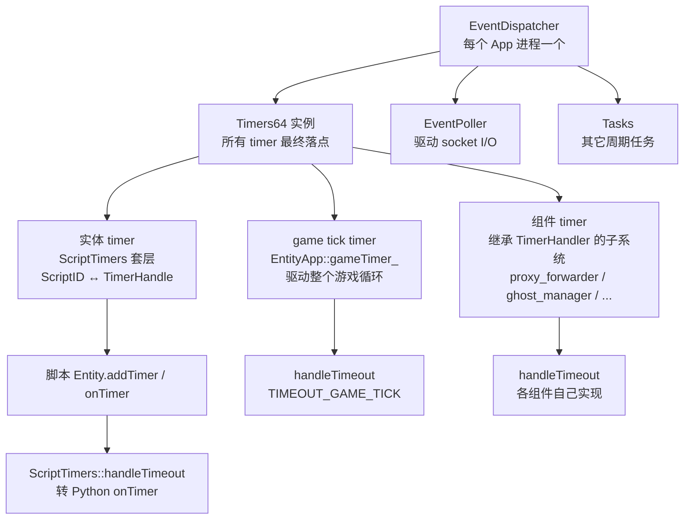

# 非实体定时器：EventDispatcher 与全局节拍

> 这一页是对"非实体周期任务怎么做"的继续深挖。主线学习先放在 [18. 钩子、回调、定时器与事件](/study/18-hooks-callbacks-timers-and-events.md)，这里专门把 KBEngine 的"不绑定实体"的 timer 机制拆出来，集中记录源码入口、注册方式、运行时边界和脚本层变通方案。

## 先收一版当前判断

KBEngine 里至少有三套经常被混在一起的"timer"：

| 名称 | 作用域 | 典型入口 | 谁注册 | 可序列化 | 可随实体迁移 |
| --- | --- | --- | --- | --- | --- |
| **进程级 EventDispatcher timer** | 单个 App 进程全局 | `EventDispatcher::addTimer` | C++ 组件 / App 自身 | 否 | 否 |
| **App game tick** | 单个 App 进程全局 | `EntityApp::initialize` 注册的 `gameTimer_` | 引擎 | 否 | 否 |
| **实体 ScriptTimers** | 单个实体实例 | `Entity.addTimer`（脚本）/ `ScriptTimers::addTimer`（C++） | 脚本 | 是 | 是（迁移时重建） |

最常见的误解有两个：

1. 把脚本侧 `Entity.addTimer` 当成 KBEngine 唯一的 timer。实际上它只是套在 `EventDispatcher` 上的一层（`ScriptTimers` 负责 `ScriptID ↔ TimerHandle` 映射），底层走的是同一套 `Timers64`。
2. 以为脚本可以调到全局 `KBEngine.addTimer`。脚本侧没有任何模块级 timer 入口，`addTimer/delTimer/onTimer` 只暴露在 `Entity` 上。

最核心的几个结论：

- 每个 App 进程的 `EventDispatcher`（`kbe/src/lib/network/event_dispatcher.h:18`）持有一个 `Timers64` 实例，是进程内**所有** timer 的最终落点——既包括实体的，也包括组件级的。
- 注册全局 timer 的方式：实现 `TimerHandler`，调 `dispatcher().addTimer(microseconds, this)`。
- 析构时必须 `TimerHandle::cancel()`，否则 `numTimesRegistered_` 断言失败（`common/timer.h:48`）。
- 全局 timer 不参与实体迁移、不参与 `addTimersToStream` 序列化、不能被脚本直接调用，**生命周期等于 App 进程或注册对象**。
- 脚本侧要做"非实体周期任务"，标准做法是挂到一个长期存活的实体上；扩展模块级 timer 需要改 C++ 源码。



## API 契约引用

`docs/api/kbengine/**` 保持和 CHM 一致，本文不改写 API 语义，只引用作为接口契约。脚本侧只有实体 timer 接口：

| API 页面 | `addTimer` | `delTimer` | `onTimer` |
| --- | --- | --- | --- |
| BaseApp `Entity` | [addTimer](/api/kbengine/baseapp/Entity.md#addTimer) | [delTimer](/api/kbengine/baseapp/Entity.md#delTimer) | [onTimer](/api/kbengine/baseapp/Entity.md#onTimer) |
| CellApp `Entity` | [addTimer](/api/kbengine/cellapp/Entity.md#addTimer) | [delTimer](/api/kbengine/cellapp/Entity.md#delTimer) | [onTimer](/api/kbengine/cellapp/Entity.md#onTimer) |
| Client `Entity` | [addTimer](/api/kbengine/client/Entity.md#addTimer) | [delTimer](/api/kbengine/client/Entity.md#delTimer) | [onTimer](/api/kbengine/client/Entity.md#onTimer) |
| Bots `Entity` | [addTimer](/api/kbengine/bots/Entity.md#addTimer) | [delTimer](/api/kbengine/bots/Entity.md#delTimer) | [onTimer](/api/kbengine/bots/Entity.md#onTimer) |

各组件 `KBEngine.md`（loginapp/baseapp/cellapp/dbmgr/...）里出现的 timer 描述，属于 C++ 组件运行时，不在脚本 Python 模块上暴露。

## 架构层：为什么 KBEngine 同时需要三套 timer

KBEngine 是多进程的，每个 App（BaseApp、CellApp、LoginApp、DBMgr、Interfaces、Logger、Bots、Machine、CellAppMgr、BaseAppMgr）都有独立的主循环。主循环既要：

- 周期性驱动整个游戏循环（一个固定的 game tick）；
- 周期性驱动子系统的清理、上报、心跳；
- 支持脚本侧每个实体各自的周期回调。

如果所有周期任务都挂在 App 全局对象上，会失去"实体迁移"这个能力——CellApp 之间搬实体时，timer 必须能跟着搬。所以 KBEngine 把"会随实体迁移的 timer"和"只属于进程的 timer"分开：

- 进程级 timer：直接挂在 `EventDispatcher` 上，回调进 `TimerHandler`。
- 实体级 timer：通过 `ScriptTimers` 间接挂在 `EventDispatcher` 上，回调转回 Python `onTimer`，并且 timer 表会被写入迁移流。

[events.md](/architecture/source-analysis/events.md) 里强调过"事件循环 ≠ 脚本业务事件"，timer 也一样：`EventDispatcher` 是**网络/调度层**的，先于任何脚本逻辑存在。

## 源码层：关键类与文件

### `EventDispatcher`

```cpp
// kbe/src/lib/network/event_dispatcher.h:18
class EventDispatcher
{
public:
    int  processOnce(bool shouldIdle = false);
    void processUntilBreak();

    void addTask(Task * pTask);
    bool cancelTask(Task * pTask);

    // 注册全局 timer，单位：微秒
    INLINE TimerHandle addTimer(int64 microseconds,
                    TimerHandler * handler, void* arg = NULL);

    EventPoller* pPoller(){ return pPoller_; }
    // ...
private:
    TimerHandle addTimerCommon(int64 microseconds,
        TimerHandler * handler, void * arg, bool recurrent);

    void processTasks();
    void processTimers();
    void processStats();

    Timers64* pTimers_;       // 所有 timer 的最终容器
    EventPoller* pPoller_;    // socket I/O 多路复用
    Tasks* pTasks_;           // 其它周期任务
};
```

`EventDispatcher` 是 `NetworkInterface` 的成员，每个 App 进程只有一个：

```cpp
// 拿到 dispatcher 的标准路径
Baseapp::getSingleton().dispatcher();
Cellapp::getSingleton().dispatcher();
Baseapp::getSingleton().networkInterface().dispatcher();
pApp_->dispatcher();
```

`addTimer` 内部走 `addTimerCommon`（`event_dispatcher.cpp:85`）：

```cpp
TimerHandle EventDispatcher::addTimerCommon(int64 microseconds,
    TimerHandler * handler, void * arg, bool recurrent)
{
    KBE_ASSERT(handler);
    if (microseconds <= 0)
        return TimerHandle();

    uint64 interval = int64((((double)microseconds) / 1000000.0) * stampsPerSecondD());
    TimerHandle handle = pTimers_->add(timestamp() + interval,
            recurrent ? interval : 0,
            handler, arg);
    return handle;
}
```

`recurrent=0` 表示只触发一次；非零值表示按该周期重复触发。**公共 `addTimer` 接口默认是周期触发**——这是 KBEngine 的设计选择，单次任务可以通过 `delTimer` 或者析构时 `cancel` 实现。

### `TimerHandler`

```cpp
// kbe/src/lib/common/timer.h:42
class TimerHandler
{
public:
    TimerHandler() : numTimesRegistered_( 0 ) {}
    virtual ~TimerHandler()
    {
        assert( numTimesRegistered_ == 0 );  // 析构前必须 cancel
    };

    virtual void handleTimeout(TimerHandle handle, void * pUser) = 0;

protected:
    virtual void onRelease( TimerHandle handle, void * pUser ) {}

private:
    void incTimerRegisterCount() { ++numTimesRegistered_; }
    void decTimerRegisterCount() { --numTimesRegistered_; }

    int numTimesRegistered_;
};
```

实现 `handleTimeout` 即可接收回调。`pUser` 是注册时传入的 `void*`，通常用作 enum 标识（见下文 `TIMEOUT_GAME_TICK` / `TIMEOUT_ACTIVE_TICK`）。

### `TimerHandle`

```cpp
// kbe/src/lib/common/timer.h:15
class TimerHandle
{
public:
    explicit TimerHandle(TimeBase * pTime = NULL) : pTime_( pTime ) {}
    void cancel();
    void clearWithoutCancel()	{ pTime_ = NULL; }
    bool isSet() const		{ return pTime_ != NULL; }
private:
    TimeBase * pTime_;
};
```

`cancel()` 是核心：把底层 `Time` 标记为 `TIME_CANCELLED`，下次 `processTimers` 时跳过。`clearWithoutCancel()` 只清本地指针，不影响底层——只用于"这个 handle 不再被持有，但 timer 该响响"的边界场景。

### `Timers64`

`TimersT<uint64>` 的实例（`timer.h:225`），内部是一个优先队列（按到期时间排序）。`EventDispatcher::processTimers` 每个 tick 调用 `Timers64::process(now)`，弹出所有已到期的 `Time` 并执行 `triggerTimer()`。

### `ScriptTimers`：实体 timer 是怎么套上去的

```cpp
// kbe/src/lib/server/script_timers.h:14
class ScriptTimers
{
public:
    ScriptID addTimer(float initialOffset, float repeatOffset, int userArg,
            TimerHandler * pHandler);
    bool delTimer(ScriptID timerID);
    void releaseTimer(TimerHandle handle);
    void cancelAll();

    ScriptID getIDForHandle(TimerHandle handle) const;
    typedef std::map<ScriptID, TimerHandle> Map;
private:
    Map map_;   // ScriptID ↔ TimerHandle
};
```

每个实体持有一个 `ScriptTimers`（通过 `EntityApp` 静态管理），脚本调用 `Entity.addTimer(initialOffset, repeatOffset, userArg)` 时：

1. `ScriptTimers::addTimer` 分配一个 `ScriptID`；
2. 调 `EventDispatcher::addTimer` 拿到 `TimerHandle`；
3. 把 `ScriptID → TimerHandle` 存进 `map_`；
4. `ScriptTimers` 自身是 `TimerHandler`，回调时根据 `TimerHandle` 反查 `ScriptID` 和 `userArg`，再调实体上的 Python `onTimer(timerID, userArg)`。

实体迁移时，`map_` 里的 `ScriptID + userArg + 周期 + 偏移`会被写入流；恢复时新进程的实体重新调 `EventDispatcher::addTimer` 拿到新的 `TimerHandle`，再 `directAddTimer` 进 `map_`。

## 注册方式：完整最小样例

`baseapp/proxy_forwarder.cpp` 是最干净的非实体 timer 样例——20 行说明全部要素：

```cpp
// kbe/src/server/baseapp/proxy_forwarder.h:11
class ProxyForwarder : public TimerHandler
{
    // ...
    virtual void handleTimeout(TimerHandle handle, void * arg);
    Proxy * pProxy_;
    TimerHandle timerHandle_;
};

// kbe/src/server/baseapp/proxy_forwarder.cpp:11
ProxyForwarder::ProxyForwarder(Proxy * pProxy) : pProxy_(pProxy)
{
    // 1000000 / gameUpdateHertz → 每个 tick 触发一次
    timerHandle_ = Baseapp::getSingleton().dispatcher().addTimer(
        1000000 / g_kbeSrvConfig.gameUpdateHertz(), this, NULL);
}

ProxyForwarder::~ProxyForwarder()
{
    timerHandle_.cancel();  // 必须主动 cancel
}

void ProxyForwarder::handleTimeout(TimerHandle, void * arg)
{
    pProxy_->sendToClient(false);
}
```

四件事：

1. 继承 `TimerHandler`；
2. 构造时拿 `dispatcher()`，调 `addTimer(微秒, this, 可选 arg)`；
3. 实现 `handleTimeout`；
4. 析构时 `handle.cancel()`。

## 真实样例分类

仓库里 8 个非实体 `TimerHandler` 子类，按用途分四类：

| 类别 | 文件 | 节拍 | 用途 |
| --- | --- | --- | --- |
| **进程 game tick** | `kbe/src/lib/server/entity_app.h:296` | `1000000 / gameUpdateHertz` | 每个 App 一个，驱动整个游戏循环（实体 tick、网络、定时器处理） |
| **进程 game tick（客户端）** | `kbe/src/lib/client_lib/clientapp.cpp:114` | `1000000 / gameUpdateHertz` | 客户端 SDK 自己的 tick |
| **组件活跃心跳** | `kbe/src/lib/server/component_active_report_handler.cpp:45` | `period * 1000000`（秒级） | 各 App 周期上报自己存活 |
| **日志 flush** | `kbe/src/lib/helper/debug_helper.cpp:228` | `1000000 / 10`（100ms） | 日志缓冲周期 flush |
| **代理转发** | `kbe/src/server/baseapp/proxy_forwarder.cpp:14` | game tick | Proxy 每帧把消息打包发客户端 |
| **ghost 同步** | `kbe/src/server/cellapp/ghost_manager.cpp:81` | `ghostUpdateHertz` | ghost 边界周期同步 |
| **空间查看器限流** | `kbe/src/server/cellapp/space_viewer.cpp:39`（cellappmgr 也有同名） | `1000000 / 10`（100ms） | 限流快照上报 |
| **witnessed 超时清理** | `kbe/src/server/cellapp/witnessed_timeout_handler.cpp:86` | `TICKSECS * 1000000`（秒级） | 见证列表超时清理 |
| **create space 重试** | `kbe/src/server/baseapp/space.cpp:43` | 自定义 | 创建空间失败后的重试 |
| **bots 登录节流** | `kbe/src/server/tools/bots/create_and_login_handler.cpp` | 自定义 | 压测客户端分批登录 |
| **dblog 更新** | `kbe/src/server/dbmgr/update_db_log_handler.cpp` | 自定义 | 数据库日志周期更新 |

> 注意 `entity_app.h:296` 的 `gameTimer_`——这是 KBEngine 真正的"全局心跳"。它通过 `arg = reinterpret_cast<void*>(TIMEOUT_GAME_TICK)` 标识，每个 tick 走 `EntityApp::handleTimeout`，触发 `handleGameTick()`，进而驱动实体更新、网络、定时器、callback、心跳上报等一切。所有其它 timer 都是在这个 tick 的间隙里跑的。

## `arg` 标识约定：一个 handler 多种触发

如果一个类要响应多种周期事件，最经济的做法是用 `arg` 当 enum 标识：

```cpp
// kbe/src/lib/server/entity_app.h:296（简化）
gameTimer_ = this->dispatcher().addTimer(
    1000000 / g_kbeSrvConfig.gameUpdateHertz(),
    this,
    reinterpret_cast<void *>(TIMEOUT_GAME_TICK));

// kbe/src/lib/server/component_active_report_handler.cpp:45
pActiveTimerHandle_ = pApp_->dispatcher().addTimer(
    int(period * 1000000),
    this,
    (void *)TIMEOUT_ACTIVE_TICK);

// 回调时按 arg 分支
void ComponentActiveReportHandler::handleTimeout(TimerHandle handle, void * arg)
{
    switch (reinterpret_cast<uintptr>(arg))
    {
        case TIMEOUT_ACTIVE_TICK: { /* ... */ break; }
        // ...
    }
}
```

这是为什么 `addTimer` 第三个参数保留 `void* arg`——它让一个 `TimerHandler` 子类可以同时挂在多种节拍上，省下"为每种节拍写一个子类"的开销。

## 生命周期与线程边界

### 必须主动 cancel

```cpp
// kbe/src/lib/common/timer.h:48
virtual ~TimerHandler()
{
    assert( numTimesRegistered_ == 0 );
};
```

`numTimesRegistered_` 在每次 `addTimer` 时 +1，`cancel` 后被 dispatcher 在 purge 时 -1。如果析构时还没 cancel，调试版会断言失败。

正确做法：

```cpp
class MyHandler : public TimerHandler {
public:
    MyHandler() {
        handle_ = SomeApp::getSingleton().dispatcher().addTimer(100000, this, NULL);
    }
    ~MyHandler() {
        handle_.cancel();   // 必须有
    }
    void handleTimeout(TimerHandle, void*) override { /* ... */ }
private:
    TimerHandle handle_;
};
```

### 单线程假设

`EventDispatcher` 在 App 主线程跑 `processOnce`，所有 `handleTimeout` 都在主线程。这意味着：

- 不要在 `handleTimeout` 里做阻塞 I/O；
- 跨线程数据要回主线程处理（KBEngine 大量用 `mail box` + 主线程轮询的方式做跨线程投递，不在 timer 回调里直接锁）。

### 不参与实体迁移

进程级 timer 的状态完全在 `EventDispatcher` 内部，不会被任何序列化流携带。即使你把 timer 关联的对象参与迁移（比如某个 `ProxyForwarder` 持有 `Proxy*`，`Proxy` 迁移到另一个 BaseApp 时），timer 本身不会过去——新进程上的对应对象要自己重新注册。

这是为什么 `addTimersToStream` / `createTimersFromStream`（见 `events.md` 末尾的实体运行态序列化）只序列化实体上的 `ScriptTimers`，不序列化进程级 timer。

### 不会回调进 Python

进程级 timer 的 `handleTimeout` 走 C++，不经过 `ScriptTimers`，自然也不会触发 Python `onTimer`。Python 想被周期触发，必须走 `Entity.addTimer` 或某个引擎回调（如 `onTimer` 是实体的）。

## 脚本侧如何做"非实体周期任务"

KBEngine 没有提供脚本级的全局 timer，但实际项目里有"周期任务不属于任何具体实体"的诉求（例如全服广播、定时清理全局缓存、定时拉外部接口）。仓库里没有标准答案，可参考三种变通方案：

| 方案 | 实现 | 取舍 |
| --- | --- | --- |
| **A. 挂长期存活实体** | 选一个全局唯一实体（BaseApp 上的 `Account` 管理器、CellApp 上的 `Space` 管理实体、或自建 `TimerService` 实体），让它 `addTimer` 并把任务写在它的 `onTimer` 里 | 最常用、零改造、能复用容错与持久化；缺点是要起一个或多个实体槽位，且 timer 跟随该实体的迁移语义 |
| **B. 用引擎回调** | 把任务挂在引擎预定义的回调点上（如 `onBaseAppInit`、`onReadyForLogin`、`onGlobalData` 改变等），靠事件而非周期触发 | 不占实体槽位；但只能响应引擎事件，不能"每 N 秒跑一次" |
| **C. 扩展 C++ 模块** | 在 C++ 写一个 `TimerHandler` 子类挂到 `dispatcher()`，再用 `PY_AUTO_MODULE_FUNCTION` 把触发点暴露成 `KBEngine.xxx()` | 真正的全局 timer；但属于源码改造，需要重新编译所有组件，且要自己处理线程安全和容错 |

### 方案 A：最小样例

`scripts/baseapp/TimerService.py`（示意，仓库里不存在此文件，仅作样例）：

```python
import KBEngine
from KBEDebug import DEBUG_MSG

class TimerService(KBEngine.Entity):
    def __init__(self):
        KBEngine.Entity.__init__(self)
        # 每 60 秒触发一次
        self.addTimer(60, 60, 0)

    def onTimer(self, timerID, userArg):
        # 周期任务：清理全局缓存、同步外部数据等
        DEBUG_MSG('TimerService: tick, timerID=%i' % timerID)
        # 业务逻辑...
```

启动时由 BaseApp 单例化（具体方式看 `baseapp.cpp` 里的全局实体管理），即可作为"全局定时任务"载体。

### 方案 C：最小样例

```cpp
// kbe/src/server/baseapp/my_global_timer.h
class MyGlobalTimer : public TimerHandler
{
public:
    MyGlobalTimer() {
        handle_ = Baseapp::getSingleton().dispatcher().addTimer(
            60 * 1000000, this, NULL);  // 60 秒
    }
    ~MyGlobalTimer() { handle_.cancel(); }

    void handleTimeout(TimerHandle, void*) override {
        // 在这里做事，或者通过 Python C API 调用某个脚本函数
    }
private:
    TimerHandle handle_;
};
```

在 BaseApp 初始化时 `new MyGlobalTimer()`，析构时 `delete`。如果想让脚本也能 `addTimer` 这种全局任务，需要在 `KBEngine` Python 模块上注册新接口，再让它走类似 `ScriptTimers` 的桥接——这是一个不小的改造，建议先评估必要性。

## BigWorld 对照

BigWorld 也有类似三层结构：

- 进程级 `Mercury::EventDispatcher`（`BigWorld-Engine-14.4.1/programming/bigworld/lib/network/event_dispatcher.cpp`），承担和 KBEngine `EventDispatcher` 一样的职责。
- 实体级 `PyEntity::addTimer` / `onTimer`（`server/baseapp/entity.cpp`、`server/cellapp/entity.cpp`），语义和 KBEngine 一致。
- 全局组件 timer：BigWorld 在 `BaseApp::ServerApp::start` 等位置注册进程级 timer，处理 tick、上报、清理。

KBEngine 的 `EventDispatcher` 设计直接继承自 BigWorld 这一支（命名空间虽是 `KBEngine::Network`，但接口形态几乎一致）。详细的 BigWorld 入口可以查 `docs/api/bigworld/bigworld-module.md`、`docs/api/bigworld/base.md`、`docs/api/bigworld/entity.md`。

阅读 BigWorld 时注意：BigWorld 的 `Personality`（见 `docs/api/bigworld/bwpersonality.md`）是另一种"挂全局回调"的方式，承载应用层级的生命周期扩展点。KBEngine 没有直接对应物，但概念上接近"全局回调表"。

## 阅读顺序索引

想完全掌握 KBEngine 的 timer 机制，建议按这个顺序：

1. **主线**：[18. 钩子、回调、定时器与事件](/study/18-hooks-callbacks-timers-and-events.md)——先建立四类驱动机制的边界。
2. **事件边界**：[事件系统、fireEvent 与事件总线](/architecture/source-analysis/events.md)——区分"网络事件循环"和"脚本业务事件"，timer 也遵循同样边界。
3. **本文**：非实体 timer 的源码落点。
4. **运行时工具**：[通用运行时工具 API](/architecture/source-analysis/runtime-utility-api.md)——`timestamp()`、`stampsPerSecond()` 等时间相关工具。
5. **进程模型**：[启动入口与引导流程](/architecture/source-analysis/entry-and-bootstrap.md)、[进程模型与组件协作](/architecture/source-analysis/process-model.md)——`EventDispatcher` 在哪里被构造、被谁驱动。
6. **热更风险**：[21. 热更新、容错与运维](/study/21-hotupdate-fault-tolerance-and-ops.md)——App 级 timer / callback 表热更时必须手工重绑。
7. **时间附录**：[服务器时间管理与世界时钟](/study/appendix-server-time-management-and-world-clock.md)——`gameUpdateHertz` 怎么决定 timer 节拍。

### 关键源码位置速查

| 主题 | 文件 | 行 |
| --- | --- | --- |
| `EventDispatcher` 类定义 | `kbe/src/lib/network/event_dispatcher.h` | 18 |
| `EventDispatcher::addTimerCommon` | `kbe/src/lib/network/event_dispatcher.cpp` | 85 |
| `TimerHandler` 抽象类 | `kbe/src/lib/common/timer.h` | 42 |
| `TimerHandle` | `kbe/src/lib/common/timer.h` | 15 |
| `Timers64` = `TimersT<uint64>` | `kbe/src/lib/common/timer.h` | 225 |
| `gameTimer_` 注册点 | `kbe/src/lib/server/entity_app.h` | 296 |
| 客户端 game tick | `kbe/src/lib/client_lib/clientapp.cpp` | 114 |
| 组件活跃心跳 | `kbe/src/lib/server/component_active_report_handler.cpp` | 45 |
| 日志 flush timer | `kbe/src/lib/helper/debug_helper.cpp` | 228 |
| Proxy 每帧转发 | `kbe/src/server/baseapp/proxy_forwarder.cpp` | 14 |
| ghost 周期同步 | `kbe/src/server/cellapp/ghost_manager.cpp` | 81 |
| space viewer 限流 | `kbe/src/server/cellapp/space_viewer.cpp` | 39 |
| witnessed 超时清理 | `kbe/src/server/cellapp/witnessed_timeout_handler.cpp` | 86 |
| create space 重试 | `kbe/src/server/baseapp/space.cpp` | 43 |
| bots 登录节流 | `kbe/src/server/tools/bots/create_and_login_handler.cpp` | 13 |
| dblog 周期更新 | `kbe/src/server/dbmgr/update_db_log_handler.cpp` | 12 |
| 实体 ScriptTimers | `kbe/src/lib/server/script_timers.h` | 14 |
| ScriptTimers 注册到 App | `kbe/src/lib/server/entity_app.h` | 261 |

## 小结

- KBEngine 没有脚本级全局 timer；脚本侧 `addTimer/delTimer/onTimer` 只在 `Entity` 上。
- 进程级 timer 存在于每个 App 的 `EventDispatcher` 内部 `Timers64`，由 `TimerHandler` 子类接收回调，是真实存在的"全局定时器"。
- 每个 App 还有一个最核心的 `gameTimer_`（`entity_app.h:296`），它就是该进程的 game tick，驱动整个游戏循环。
- 实体 timer（`ScriptTimers`）是套在 `EventDispatcher` 上的一层，提供 `ScriptID ↔ TimerHandle` 映射和迁移序列化，不是独立机制。
- 脚本侧要做非实体周期任务，最贴近现有设计的方式是**挂到一个长期存活的实体上**；扩展模块级 timer 需要改 C++ 源码。
- 进程级 timer 的核心边界：必须主动 `cancel`、单线程假设、不参与实体迁移、不回调进 Python。
