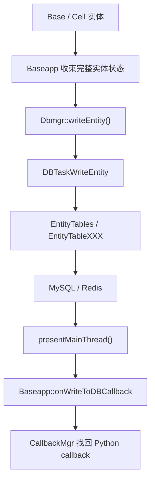
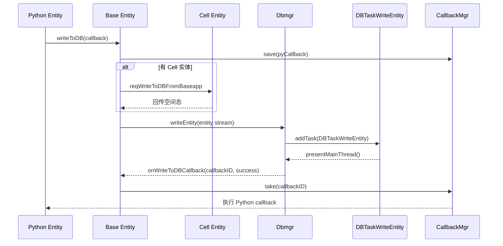
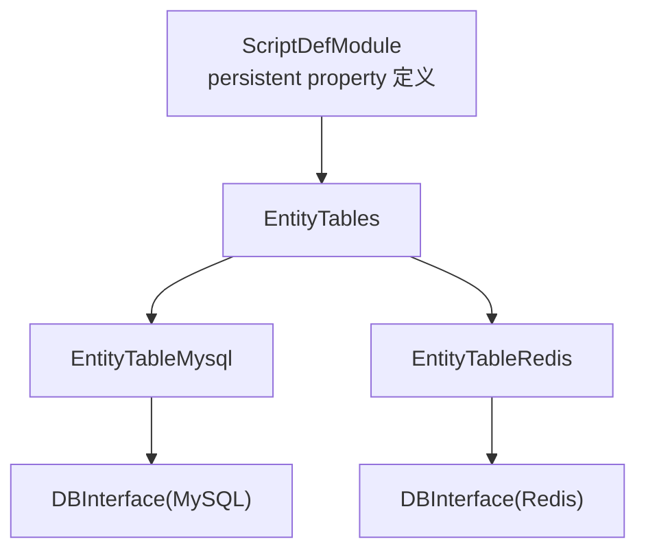

# 持久化与数据库

> 这一页要回答四个源码问题：为什么写库入口通常在 Base 侧，`Dbmgr` 到底是不是单纯数据库代理，实体数据怎样从内存流落到具体表里，以及“查询 / 检出 / 恢复”为什么和账号在线态纠缠在一起。

## 先给结论

KBEngine 的持久化链路不是“Entity 直接连 MySQL”，而是四段式：

```text
Base / Cell 实体
  → Baseapp 侧收束
  → Dbmgr 投递 DBTask
  → EntityTables / EntityTableXXX
  → MySQL / Redis
```

这条链路里，`Dbmgr` 的职责远不止执行 SQL：

- 账号状态查询
- 实体在线态裁定
- 写库任务编排
- `ENTITY_ID` 分配
- 不同 DBInterface 的任务路由

所以 `Dbmgr` 更接近“持久化仲裁层”，而不是简单的数据库连接池。



## 为什么写库入口大多从 Base 侧发起

先看最直接的入口：

- `kbe/src/server/baseapp/entity.cpp`

`Entity::writeToDB()` 的逻辑非常能说明问题：

1. 解析 Python 回调与 `shouldAutoLoad`
2. 校验目标 DB interface
3. 用 `callbackMgr().save(pyCallback)` 保存回调
4. 如果当前没有 Cell，则直接进入本地收束
5. 如果有 Cell，则发 `CellappInterface::reqWriteToDBFromBaseapp`

这里最关键的设计点是：

- Cell 侧如果存在权威空间态，必须先把空间态收束回来
- 真正决定“何时把完整实体快照交给 DBMgr”的一侧是 Base

因此写库入口通常设计在 Base，不是因为 Base 更“懂数据库”，而是因为它是会话、长期逻辑和持久化边界的收束点。

## 写库不是一步，而是“Cell 收束 + Base 发起”

从 `Entity::writeToDB()` 的实现可以看到一个常被忽略的前提：

- 如果实体有 `cellEntityCall()`，Base 不能直接把自己当前的局部状态写库

原因很简单：

- 空间权威状态在 Cell
- Base 只持有长期逻辑和一部分镜像态

所以写库链路实际上是：

```text
Python: entity.writeToDB(callback)
  → Base Entity::writeToDB()
  → 如果有 Cell，先发 reqWriteToDBFromBaseapp
  → Cell 侧整理空间态并回传
  → Base 侧形成完整实体流
  → Dbmgr::writeEntity()
```



这也是为什么你在 `study/13` 里看到“三段式写库”，在源码层面仍然成立。

## Cell 侧的 `writeToDB()` / `onWriteToDB()` 不是直接写库，而是“打包 Cell 态并回交 Base”

如果只看 API 名，`cellapp/Entity.writeToDB()` 很容易被理解成“Cell 实体自己写数据库”。  
源码里它真正做的事情其实是：

- 校验 DB interface 目标
- 先调用 Cell 脚本 `onWriteToDB()`
- 备份当前 Cell 权威态
- 把“Cell 已经收束完成”的结果回发给 Base

关键代码在 `kbe/src/server/cellapp/entity.cpp`：

```cpp
// 文件：kbe/src/server/cellapp/entity.cpp
void Entity::writeToDB(void* data, void* extra1, void* extra2)
{
    ...
    onWriteToDB();
    backupCellData();

    (*pBundle).newMessage(BaseappInterface::onCellWriteToDBCompleted);
    (*pBundle) << this->id();
    (*pBundle) << callbackID;
    (*pBundle) << shouldAutoLoad;
    (*pBundle) << dbInterfaceIndex;

    if(this->baseEntityCall())
    {
        this->baseEntityCall()->sendCall(pBundle);
    }
}
```

这段代码直接说明：

- Cell 侧 `writeToDB()` 不会直接连到 `Dbmgr::writeEntity()`
- 它先把 Cell 权威态通过 `backupCellData()` 收束进 Base 可写出的状态
- 然后只把“收束完成”的消息告诉 Base

因此更准确的语义是：

- **Cell 侧 `writeToDB()` 是持久化前的空间态收束入口，不是最终写库入口**

### `onWriteToDB()` 在 Cell 侧的作用：给脚本一个“收束前最后修改 Cell 态”的钩子

```cpp
// 文件：kbe/src/server/cellapp/entity.cpp
void Entity::onWriteToDB()
{
    CALL_ENTITY_AND_COMPONENTS_METHOD(this, SCRIPT_OBJECT_CALL_ARGS0(pyTempObj, const_cast<char*>("onWriteToDB"), GETERR));
}
```

它的位置很关键：

1. 先调用 `onWriteToDB()`
2. 再 `backupCellData()`
3. 再通知 Base `onCellWriteToDBCompleted`

因此 Cell 侧这个回调最准确的理解是：

- 在 Cell 权威态被打包回 Base 之前，给脚本最后一次修正持久化数据的机会

它不是：

- DB 线程写成功后的回调
- Base 最终收到写库结果后的回调

回调发生时机要比真正落库更早。

## Dbmgr::writeEntity() 只做接入，不在主线程里直接落库

关键入口：

- `kbe/src/server/dbmgr/dbmgr.cpp`

`Dbmgr::writeEntity()` 的行为很克制：

1. 先从消息流里读出 `componentID / eid / entityDBID / dbInterfaceIndex`
2. 根据 `dbInterfaceIndex` 找到对应的 `Buffered_DBTasks`
3. `addTask(new DBTaskWriteEntity(...))`

也就是说，`Dbmgr` 主线程本身并不直接操作后端存储。

它真正做的是：

- 识别这次写库应该投递给哪个 DBInterface
- 把这次请求封装成 `DBTaskWriteEntity`
- 交给后台任务队列

所以 `Dbmgr` 的价值一半在网络面，一半在任务编排面。

## `onRestore()` 也不是普通初始化回调，而是 Cell 恢复链上的“脚本重新接管点”

`cellapp/Entity.onRestore()` 的位置也容易被看轻，像是“恢复后通知一下脚本”。  
实际上它对应的是 Cell 恢复链中非常具体的一个阶段。

先看 `Entity::onRestore()`：

```cpp
// 文件：kbe/src/server/cellapp/entity.cpp
void Entity::onRestore()
{
    bufferOrExeCallback(const_cast<char*>("onRestore"), NULL);
}
```

单看这一段很轻，但把它放回 `cellapp.cpp` 的恢复路径里就清楚了。

恢复已有空间时：

```cpp
// 文件：kbe/src/server/cellapp/cellapp.cpp
cellData = e->createCellDataFromStream(pCellData);
e->createNamespace(cellData, true);
...
if(!inRescore)
{
    e->initializeScript();
}
else
{
    e->onRestore();
}
```

恢复整块空间时：

```cpp
// 文件：kbe/src/server/cellapp/cellapp.cpp
e->spaceID(space->id());
e->createNamespace(cellData);
...
e->onRestore();
space->addEntityAndEnterWorld(e, true);
```

这两段代码连起来后，`onRestore()` 的真实位置就很明确了：

- Cell 数据流已经反序列化回来
- 脚本 namespace 已经建立
- 但这不是普通首次初始化，而是“恢复路径重新接管”

因此更准确的理解是：

- **`onRestore()` 是 Cell 恢复链里脚本重新接管实体状态的入口**

### `onRestore()` 和 `initializeScript()` 是两条不同语义的链

从上面的分支也能看出：

- 首次创建更接近 `initializeScript()`
- 恢复已有 Cell 状态更接近 `onRestore()`

所以不能把 `onRestore()` 简化成“和 `__init__` 差不多的另一个回调”。  
它强调的是：

- 这份实体状态不是刚生成的
- 而是从已有 Cell 数据、空间数据或跨组件恢复出来的

这也是为什么 API 页把它单独列出来是有意义的。

## DBTaskWriteEntity：真正把“内存流”变成“写库任务”

最该读的文件：

- `kbe/src/server/dbmgr/dbtasks.h`
- `kbe/src/server/dbmgr/dbtasks.cpp`

`DBTaskWriteEntity` 这类任务说明了 DB 层分工：

- `db_thread_process()` 在线程池里执行真实持久化逻辑
- `presentMainThread()` 再把结果切回主线程，回发 `onWriteToDBCallback`

在 `presentMainThread()` 里可以直接看到：

```text
newMessage(BaseappInterface::onWriteToDBCallback)
→ staticAddToBundle(eid, entityDBID, dbIndex, callbackID, success)
→ send(bundle)
```

这说明 DB 任务层的职责不是只写库，它还要负责把异步结果重新接回游戏主线程。

因此 `writeToDB(callback)` 的脚本体验背后，其实是：

- Base 侧保存 callbackID
- DB 线程池执行写库
- 主线程把结果发回 Base
- Base 再通过 `CallbackMgr` 找回 Python 回调

## EntityTables：DB 后端之上的一层实体表抽象

核心文件：

- `kbe/src/lib/db_interface/entity_table.cpp`

`EntityTables::writeEntity()` 的逻辑非常简单，但它的重要性很大：

```cpp
EntityTable* pTable = this->findTable(pModule->getName());
return pTable->writeTable(pdbi, dbid, shouldAutoLoad, s, pModule);
```

这意味着：

- `EntityDef` 决定实体类型与持久化字段
- `EntityTables` 根据实体名选具体逻辑表
- 具体后端表实现再决定如何生成 SQL / Redis 命令

因此持久化系统的抽象层次是：

```text
ScriptDefModule
  → EntityTables
    → EntityTableMysql / EntityTableRedis
      → DBInterface
```



## MySQL / Redis 后端为什么都依赖 ScriptDefModule

看 `EntityTableMysql::writeTable()` 就能明白：

- 它从 `MemoryStream` 中不断读取属性 UID
- 根据表项定义找 `EntityTableItem`
- 再把具体字段写成 SQL 片段

而 `EntityTableItem` 的组织方式，本质上是从实体定义系统导出来的。

换句话说：

- 没有 `ScriptDefModule`
- DB 层就不知道某个实体有哪些 persistent property
- 也不知道这些字段该映射到哪张表、哪种列类型

这就是为什么“实体定义系统”和“持久化系统”必须放在同一阅读主线上，而不是两个孤立章节。

## 查询 / 检出不是纯数据读取，而是在线态判断

除了写库，更值得重视的是“查库”路径：

- `Dbmgr::queryAccount()`
- `Dbmgr::queryEntity()`
- `Dbmgr::lookUpEntityByDBID()`

从源码上看，账号查询和实体查询都不是纯 SELECT：

- 账号查询会结合在线状态、componentID、entityID、dbid 一起判断
- 实体检出会查询实体日志表与实体表，决定它是否已在线、是否允许恢复

所以 `Dbmgr` 不只是“数据库代理”，它还掌握：

- 当前账号是否已在线
- 某个实体是否被别的组件持有
- 是否允许新的 Base 把它恢复出来

这就是持久化链路和在线态管理纠缠在一起的原因。

## 回调为什么一定要回 Base

写库任务完成后，`DBTaskWriteEntity::presentMainThread()` 会发：

- `BaseappInterface::onWriteToDBCallback`

这意味着结果回调固定回到 Base，而不是 Cell。

设计原因很直接：

- Python 业务层发起写库通常在 Base 侧
- CallbackMgr 也通常挂在 Base 侧实体运行环境
- 持久化边界由 Base 收束，回调自然回 Base

所以“写库结果回调”本质上也是会话与长期逻辑边界的一部分。

## 账号库与实体库的关系

从 `Dbmgr::queryAccount()` 可以看出，账号路径和实体路径在 `Dbmgr` 汇合，但语义不同：

- 账号路径回答“这个账号能否登录、属于谁、是否已在线”
- 实体路径回答“这个 DBID 对应的实体能否恢复、怎样恢复、当前是不是在线实体”

这两条路径共享 DB task 框架，但不是同一类数据访问。

所以在阅读源码时，不要把：

- `queryAccount`
- `queryEntity`
- `writeEntity`

看成同一层级的 CRUD 包装。它们分别服务于登录编排、实体恢复和状态持久化三条不同主线。

## 读源码的最短路径

如果你现在准备在 IDE 里走一遍持久化主线，建议顺序是：

1. `kbe/src/server/baseapp/entity.cpp` → `Entity::writeToDB`
2. `kbe/src/server/dbmgr/dbmgr.cpp` → `Dbmgr::writeEntity`
3. `kbe/src/server/dbmgr/dbtasks.cpp` → `DBTaskWriteEntity`
4. `kbe/src/lib/db_interface/entity_table.cpp` → `EntityTables::writeEntity`
5. `kbe/src/lib/db_mysql/entity_table_mysql.cpp` → `EntityTableMysql::writeTable`
6. 再回看 `Dbmgr::queryAccount / queryEntity / lookUpEntityByDBID`

这样读能把“写库路径”和“恢复路径”分开，不会混成一团。

## 与主线章节的关系

如果你需要完整叙事版，请回到：

- `/study/13-database-dbmgr-and-persistence.html`
- `/study/22-player-complete-lifecycle.html`

这一页的作用，是把主线里的持久化章节压缩成一张真正可对源码下钻的阅读地图。
