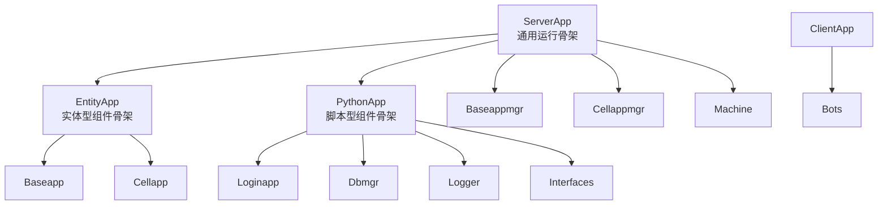
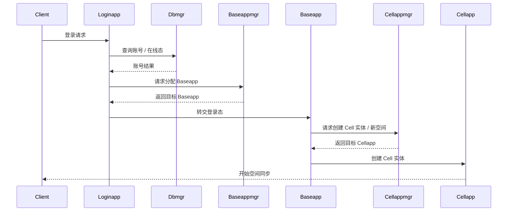

# 进程模型与组件协作

> 这一页不再停留在“有哪些进程”这个目录层面，而是直接回答三个源码问题：组件各自继承了什么骨架、谁负责调度谁、一次玩家主线怎样跨组件流动。

## 核心判断

KBEngine 的多进程模型不是把功能“平均拆分”到多个进程，而是围绕三条边界做分工：

- 接入边界：`Loginapp` 负责第一跳连接、认证与登录态过渡。
- 逻辑边界：`Baseapp` 持有玩家长期逻辑、会话锚点与非空间行为。
- 空间边界：`Cellapp` 负责实时世界、AOI、Witness 与 ghost。

在这三条主边界之外，还有一组协调与基础设施组件：

- `Baseappmgr` / `Cellappmgr` 负责“选谁来承载”。
- `Dbmgr` 负责账号查询、实体持久化与 ID 分配。
- `Machine` 负责服务发现与组件注册。
- `Logger` / `Interfaces` / `Bots` 分别负责集中日志、外围接口与压测客户端。



## 关键源码入口

先记住下面这几组头文件，后面读调用链时会不断回到这里：

- `kbe/src/server/loginapp/loginapp.h`
- `kbe/src/server/baseapp/baseapp.h`
- `kbe/src/server/cellapp/cellapp.h`
- `kbe/src/server/dbmgr/dbmgr.h`
- `kbe/src/server/baseappmgr/baseappmgr.h`
- `kbe/src/server/cellappmgr/cellappmgr.h`
- `kbe/src/lib/server/serverapp.h`
- `kbe/src/lib/server/entity_app.h`
- `kbe/src/lib/server/python_app.h`

从继承骨架看，KBEngine 的组件不是平铺的：

```text
ServerApp
  ├── EntityApp<Entity>
  │     ├── Baseapp
  │     └── Cellapp
  ├── PythonApp
  │     ├── Loginapp
  │     ├── Dbmgr
  │     ├── Logger
  │     └── Interfaces
  ├── Baseappmgr
  ├── Cellappmgr
  └── Machine

ClientApp
  └── Bots
```

这条继承链本身已经说明了分层意图：

- `ServerApp` 提供通用运行骨架、网络接口、组件注册与生命周期。
- `EntityApp` 在通用骨架之上再加实体容器、`EntityDef`、ID 分配与脚本实体安装。
- `PythonApp` 则给不直接承载实体的组件提供 Python 运行时与脚本模块能力。
- `Bots` 不走 `ServerApp`，而是挂在 `ClientApp` 这条客户端 SDK 骨架上，所以它更像压测工具进程，不是服务端业务组件。

## 组件职责不是对称的

### Loginapp：只做接入，不做长期玩家态

`Loginapp` 继承自 `PythonApp`，而不是 `EntityApp`。这说明它不维护实体容器，也不承载玩家长期逻辑。

在 `kbe/src/server/loginapp/loginapp.h` 里，最值得先看的接口是：

- `reqCreateAccount`
- `onHello`
- `onClientActiveTick`
- `onLoginAccountQueryResultFromDbmgr`

它的真正职责是：

- 接收客户端第一跳连接
- 把账号校验请求转给 `Dbmgr`
- 通过 `Baseappmgr` 选择目标 `Baseapp`
- 把合法登录态交给后续会话锚点

因此 `Loginapp` 更像“登录编排器”，不是玩家对象的宿主。

### Baseapp：玩家长期逻辑与会话锚点

`Baseapp` 继承自 `EntityApp<Entity>`。这意味着它不仅跑在统一主循环里，还直接拥有实体容器、脚本实体创建能力和 EntityDef 元数据。

`kbe/src/server/baseapp/baseapp.h` 里最关键的几类入口：

- 实体创建：`__py_createEntity`、`__py_createEntityFromDBID`
- 会话管理：`loginBaseapp`、`reloginBaseapp`
- 跨空间协作：`createCellEntityInNewSpace`
- 灾备处理：`handleBackup`、`handleArchive`

Base 侧最重要的一点是：它既接客户端会话，又接 DB 与 Cell 的协作请求，所以它是“玩家主线的收束点”。

### Cellapp：实时世界与 AOI 主体

`Cellapp` 同样继承 `EntityApp<Entity>`，但关注点完全不同。

`kbe/src/server/cellapp/cellapp.h` 里的高频入口包括：

- `handleGameTick`
- `onCreateCellEntityInNewSpaceFromBaseapp`
- `onRestoreSpaceInCellFromBaseapp`
- `onExecuteRawDatabaseCommandCB`

Cell 侧实体是空间权威实体，典型职责有：

- 空间内实体组织
- AOI 计算
- Witness 建立与销毁
- real / ghost 协作
- 客户端可见状态同步

所以 Base 和 Cell 不是“主备关系”，而是“非空间长期逻辑”和“实时空间逻辑”的分工。

### Dbmgr：不仅是数据库驱动层

`Dbmgr` 继承 `PythonApp`，不持有实体容器，但它绝不是单纯 SQL 代理。

`kbe/src/server/dbmgr/dbmgr.h` 里的核心入口说明了它的双重身份：

- 账号路径：`reqCreateAccount`、`queryAccount`、`onAccountLogin`
- 数据路径：`onReqAllocEntityID`、写库相关 DBTask 流程

它至少做三件事：

- 账号/实体状态查询
- 持久化任务编排与线程池落库
- `ENTITY_ID` 段分配

所以 `Dbmgr` 是“在线状态裁判 + 持久化仲裁层”，不是纯粹的 DB client wrapper。

### Baseappmgr / Cellappmgr：调度器，不是业务组件

这两个 manager 最容易被误读成“可有可无的中间层”，但源码恰好反过来说明它们是集群调度的中心。

在 `kbe/src/server/baseappmgr/baseappmgr.h` 里：

- `findFreeBaseapp`
- `updateBestBaseapp`
- `registerPendingAccountToBaseapp`
- `updateBaseapp`

在 `kbe/src/server/cellappmgr/cellappmgr.h` 里：

- `findFreeCellapp`
- `updateBestCellapp`
- `reqCreateCellEntityInNewSpace`
- `updateCellapp`

这意味着 manager 的职责不是执行业务，而是维护“当前谁最适合接活”的全局视图。

## 一次玩家主线怎样经过这些组件

只看登录主线，可以把职责边界看得很清楚：



```text
Client
  → Loginapp
  → Dbmgr（查账号、查在线态）
  → Baseappmgr（选承载进程）
  → Baseapp（建立 Proxy / Base 实体）
  → Cellappmgr（选空间承载）
  → Cellapp（创建 Cell 实体 / Witness）
  → Client（开始接收空间同步）
```

这条链路里最容易忽略的事实有两个：

- `Loginapp` 并不直接“把玩家放进游戏”，它只是把登录资格移交给真正的承载组件。
- `Baseappmgr` / `Cellappmgr` 的价值不在转发，而在于维护负载与组件状态，从而让“该落到谁身上”成为运行时决策。

## 为什么普通逻辑在 Base，空间逻辑在 Cell

这不是 BigWorld 遗产式的机械照搬，而是运行时约束的直接结果。

普通逻辑放在 `Baseapp` 的原因：

- 大量逻辑不依赖空间位置
- 会话、账号、交易、任务等对象更适合长期稳定承载
- 与客户端连接、DB 回调、热更新配合更自然

空间逻辑放在 `Cellapp` 的原因：

- AOI、视野、位置、ghost 都需要统一的空间权威
- 高频 tick 与空间内邻域计算不能分散到会话层
- 同一个空间内的权威状态需要保持局部一致

从源码角度看，`Baseapp` 和 `Cellapp` 共享 `EntityApp` 骨架，但各自覆盖 `onCreateEntity()`、各自扩展不同的运行态结构，这正是“共用实体骨架、分离运行语义”。

## 读这组代码时的建议顺序

如果你准备从 `architecture/source-analysis/` 继续深挖，建议顺序是：

1. `kbe/src/lib/server/serverapp.h`
2. `kbe/src/lib/server/entity_app.h`
3. `kbe/src/server/loginapp/loginapp.h`
4. `kbe/src/server/baseappmgr/baseappmgr.h`
5. `kbe/src/server/baseapp/baseapp.h`
6. `kbe/src/server/cellappmgr/cellappmgr.h`
7. `kbe/src/server/cellapp/cellapp.h`
8. `kbe/src/server/dbmgr/dbmgr.h`

这样读的好处是：先看公共骨架，再看调度，再看承载组件，最后看持久化仲裁层，依赖关系最顺。

## 与 `study/` 主线的关系

这页更适合作为“组件地图”。

- 如果你要看完整叙事，主线请回到 `/study/03-kbengine-system-panorama.html`
- 如果你要继续沿着实体落地，下一页应该看 `/architecture/source-analysis/entity-system.html`
