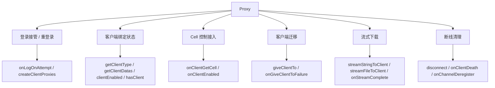
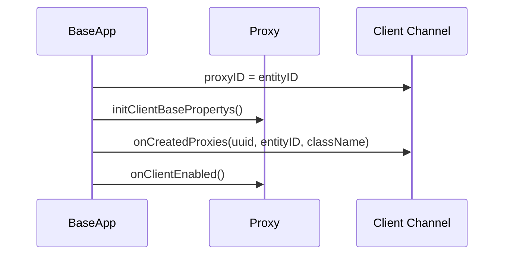
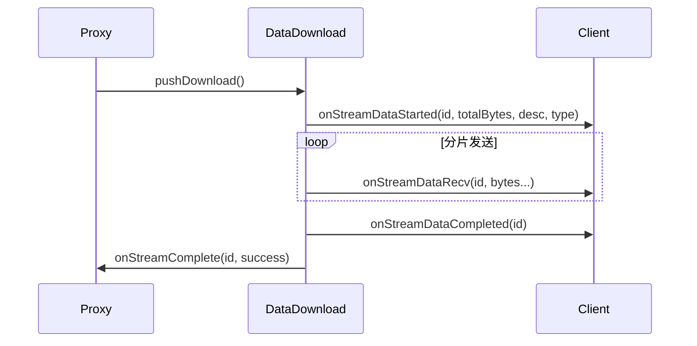

# Proxy 会话与流式传输 API

> 这一页只回答一个问题：`baseapp/Proxy` 这组接口在源码里到底管什么。  
> 它不是“带客户端的 Entity”这么简单。更准确地说，`Proxy` 是 Base 侧的**客户端会话锚点**，负责把账号登录、客户端通道、Cell 控制、流式下载、断线清理这些边界收束到一起。

## 先给结论

`Proxy` 最值得建立的心智模型不是“玩家实体”，而是：

- 客户端连接所有权
- Base 侧会话状态
- Client <-> Base <-> Cell 控制桥
- 面向客户端的流式下发宿主



所以读 `Proxy` 这组 API 时，最准确的问题不是“它能不能给客户端发东西”，而是：

- **当前这条客户端通道到底绑在谁身上**
- **现在是不是已经进入“客户端可通讯”阶段**

## 第一层：`Proxy` 本身就是“客户端通道所有者”

`Proxy` 的构造里就已经把会话相关状态准备好了：

```cpp
Proxy::Proxy(...)
    : Entity(...),
      rndUUID_(KBEngine::genUUID64()),
      addr_(Network::Address::NONE),
      clientEnabled_(false),
      clientComponentType_(UNKNOWN_CLIENT_COMPONENT_TYPE),
      loginDatas_(),
      createDatas_()
{
    pProxyForwarder_ = new ProxyForwarder(this);
}
```

这里至少能直接看出四件事：

- 每个 `Proxy` 都有一份会话级随机标识 `rndUUID`
- 它记录客户端地址 `addr_`
- 它区分“有没有客户端”和“客户端是否已可用”这两个阶段
- 它还缓存登录附带数据和注册附带数据

所以 `Proxy` 不是普通实体多了几个属性，而是从构造起就被当成：

- **一条客户端会话的拥有者**

## 第二层：真正让客户端“接到这个 Proxy 上”的不是 `Proxy` 自己，而是 `Baseapp::createClientProxies()`

`Proxy` 虽然持有客户端通道，但把“客户端正式切换到某个 Proxy”这件事收口在 `Baseapp::createClientProxies(...)`：

```cpp
bool Baseapp::createClientProxies(Proxy* pEntity, bool reload)
{
    Network::Channel* pChannel = pEntity->clientEntityCall()->getChannel();
    pChannel->proxyID(pEntity->id());
    pEntity->addr(pChannel->addr());

    if(reload)
        pEntity->rndUUID(genUUID64());

    pEntity->initClientBasePropertys();

    (*pBundle).newMessage(ClientInterface::onCreatedProxies);
    (*pBundle) << pEntity->rndUUID();
    (*pBundle) << pEntity->id();
    (*pBundle) << pEntity->ob_type->tp_name;
    pEntity->sendToClient(ClientInterface::onCreatedProxies, pBundle);

    pEntity->onClientEnabled();
}
```

这条链说明客户端绑定的真正完成动作有四步：

1. 把网络通道的 `proxyID` 绑定到实体 ID
2. 刷新 `Proxy.addr`
3. 先把 Base 属性下发给客户端
4. 通知客户端“你的代理实体已经创建完成”
5. 最后才调 `onClientEnabled()`



所以 `onClientEnabled()` 的语义不是：

- “有客户端连上了”

而是：

- **客户端代理实体已经建立完毕，脚本层现在可以安全和客户端通讯**

这也解释了为什么 `giveClientTo()` 之后，目标 `Proxy` 也会再次触发它。

## 第三层：`disconnect()` 只是断开通道，不是销毁 `Proxy`

`disconnect()` 的脚本包装非常轻：

```cpp
PyObject* Proxy::pyDisconnect()
{
    Network::Channel* pChannel = Baseapp::getSingleton().networkInterface().findChannel(addr_);
    if (pChannel && !pChannel->isDestroyed())
    {
        pChannel->condemn("");
    }
    S_Return;
}
```

这说明它做的事情只有一件：

- 让当前客户端通道进入关闭流程

它没有：

- 销毁 `Proxy`
- 删除数据库记录
- 主动销毁 Cell

所以 `disconnect()` 更准确的理解是：

- **只断会话，不断实体生命周期**

适合的场景：

- 强制踢客户端下线，但保留账号实体在线态
- 需要让客户端重新建立连接

## 第四层：`onClientDeath()` 是通道解绑，不是实体销毁

客户端断线的真正入口通常不是脚本主动调用，而是 `Baseapp::onChannelDeregister(...)`：

```cpp
void Baseapp::onChannelDeregister(Network::Channel * pChannel)
{
    ENTITY_ID pid = pChannel->proxyID();
    ...
    if(pid > 0)
    {
        Proxy* proxy = static_cast<Proxy*>(this->findEntity(pid));
        if(proxy)
        {
            proxy->onClientDeath();
        }
    }
}
```

而 `Proxy::onClientDeath()` 自己做的事也很明确：

```cpp
Py_DECREF(clientEntityCall());
clientEntityCall(NULL);
addr(Network::Address::NONE);
clientEnabled_ = false;
CALL_ENTITY_AND_COMPONENTS_METHOD(this, ..., "onClientDeath", ...);
```

它不是在“销毁 Proxy”，而是在做一轮会话解绑：

- 释放 `clientEntityCall`
- 清空客户端地址
- 把 `clientEnabled_` 置回 `false`
- 再通知脚本层

所以这个回调的准确语义是：

- **这个 `Proxy` 失去了当前绑定的客户端通道**

它常见的使用场景是：

- 记录掉线时间
- 清理需要在线时才存在的临时状态
- 标记等待重连

## 第五层：`getClientType()` / `getClientDatas()` 读到的是会话附带信息，不是运行时推断

### `getClientType()`：直接读 `clientComponentType_`

实现非常直接：

```cpp
INLINE COMPONENT_CLIENT_TYPE Proxy::getClientType() const
{
    return clientComponentType_;
}
```

它返回的不是根据当前通道推断出来的结果，而是登录/迁移时明确写进去的会话类型。

在登录接管和迁移链里都能看到它被显式设置：

- 首次登录时 `setClientType(ptinfos->ctype)`
- `giveClientTo()` 时目标 `Proxy` 继承源 `Proxy` 的 `clientType`

所以它的语义是：

- **当前会话绑定的客户端类别标签**

### `getClientDatas()`：返回登录附带数据和注册附带数据

实现里直接把两段缓存打成 tuple：

```cpp
const std::string& datas1 = this->getLoginDatas();
const std::string& datas2 = this->getCreateDatas();
...
PyTuple_SetItem(pyDatas, 0, pyDatas1);
PyTuple_SetItem(pyDatas, 1, pyDatas2);
```

而这两段数据的来源在 `Baseapp::onQueryAccountCBFromDbmgr(...)`：

```cpp
pEntity->setClientType(ptinfos->ctype);
pEntity->setLoginDatas(ptinfos->datas);
pEntity->setCreateDatas(bindatas);
```

这说明：

- 第一个元素是当前登录请求附带的 `datas`
- 第二个元素是账号注册时持久化下来的附带数据

所以 `getClientDatas()` 的准确语义不是“实时抓客户端状态”，而是：

- **读取当前 `Proxy` 会话和账号记录上缓存的两段附带二进制数据**

常见使用场景：

- 渠道来源
- 设备附带信息
- 第三方账号系统透传数据
- 运营侧自定义扩展标记

## 第六层：`onLogOnAttempt()` 决定的是“在线账号如何接纳新登录”

这是 `Proxy` 最像“会话仲裁器”的一个点。

在 `Baseapp::loginBaseapp(...)` 里，如果账号实体已经在内存中，BaseApp 不会直接替换连接，而是先问脚本：

```cpp
int32 ret = pEntity->onLogOnAttempt(
    pChannel->addr().ipAsString(),
    ntohs(pChannel->addr().port),
    password.c_str());
```

`Proxy::onLogOnAttempt(...)` 自己会先调用实体脚本，再调用组件脚本：

```cpp
PyObject* pyResult = PyObject_CallMethod(this, "onLogOnAttempt", "sks", addr, port, password);
...
CALL_ENTITY_COMPONENTS_METHOD(this, ..., "onLogOnAttempt", ...);
```

所以它本质上不是单纯回调通知，而是：

- **把“是否允许新连接接管这个在线账号”交给脚本层裁决**

### 三个返回值在当前源码里的实际效果

表面上有三个常量：

- `LOG_ON_REJECT`
- `LOG_ON_ACCEPT`
- `LOG_ON_WAIT_FOR_DESTROY`

但当前 `baseapp.cpp` 的 `switch` 实现里，只有 `LOG_ON_ACCEPT` 有独立分支：

```cpp
switch(ret)
{
case LOG_ON_ACCEPT:
    ...
    break;
case LOG_ON_WAIT_FOR_DESTROY:
default:
    loginBaseappFailed(..., SERVER_ERR_ACCOUNT_IS_ONLINE);
    return;
}
```

这意味着在**当前源码实现**里：

- `LOG_ON_ACCEPT`：允许新连接接管
- `LOG_ON_REJECT`：拒绝
- `LOG_ON_WAIT_FOR_DESTROY`：当前并没有单独的“等待后重绑”逻辑，实际效果同拒绝

这里要特别注意：

- API 原文保留了 CHM 对 `LOG_ON_WAIT_FOR_DESTROY` 的理想语义
- 但当前源码实现没有把它落成独立流程

所以源码学习里更准确的结论应当是：

- **现在脚本真正能稳定依赖的，是 accept 或 reject；wait-for-destroy 在当前实现里并未单独落地**

### `LOG_ON_ACCEPT` 具体会发生什么

如果旧 `Proxy` 已经绑定客户端：

1. 旧通道被踢出
2. `clientEntityCall.addr` 改到新通道
3. 更新 `addr`、`clientType`、`loginDatas`
4. 调 `createClientProxies(pEntity, true)`
5. 再调 `onGetWitness()`

如果旧 `Proxy` 当前没有客户端：

1. 直接新建 `clientEntityCall`
2. 绑定 `proxyID`
3. 走同样的 `createClientProxies(...)`
4. 再调 `onGetWitness()`

所以 `LOG_ON_ACCEPT` 的真实语义不是：

- “只是允许登录”

而是：

- **允许新通道接管当前在线账号，并立即重建客户端代理链**

## 第七层：`onClientGetCell()` 回答的是“客户端什么时候才能访问 `entity.cell`”

这一点在 `Baseapp::onEntityGetCell(...)` 里串起来：

```cpp
if(pEntity->clientEntityCall() != NULL)
{
    onClientEntityEnterWorld(static_cast<Proxy*>(pEntity), componentID);
}
...
pEntity->onGetCell(pChannel, componentID);
```

而 `onClientEntityEnterWorld(...)` 会先推客户端感兴趣的 Cell 数据，再调 `onClientGetCell(...)`：

```cpp
pEntity->initClientCellPropertys();
pEntity->onClientGetCell(NULL, componentID);
```

`Proxy::onClientGetCell(...)` 自己则会确保 `cellEntityCall_` 已经可用，然后回调脚本：

```cpp
if(cellEntityCall_ == NULL)
    cellEntityCall_ = new EntityCall(..., ENTITYCALL_TYPE_CELL);

CALL_ENTITY_AND_COMPONENTS_METHOD(this, ..., "onClientGetCell", ...);
```

所以 `onClientGetCell()` 的准确语义不是：

- “Cell 创建成功了”

而是：

- **这个带客户端的实体，现在已经进入了客户端可访问 Cell 的阶段**

常见使用场景：

- 客户端上线后第一次可以访问 `self.cell`
- 初始化一些必须在 Cell 就绪后才做的客户端逻辑

## 第八层：`giveClientTo()` 转移的是整条客户端所有权链

这一块在 [空间与 AOI](/architecture/source-analysis/space-aoi.md#proxy-give-client-to) 已经展开过，这里只把它放回 `Proxy` 会话主线里理解。

`Proxy::giveClientTo(...)` 会做这些事情：

- 校验源/目标 `Proxy` 是否有效
- 如果源 `Proxy` 有 Cell，先通知 Cell 丢 `Witness`
- 通知客户端销毁旧代理实体
- 清空源 `Proxy` 的 `clientEntityCall / clientEnabled / addr / clientType / loginDatas`
- 把 `clientType / loginDatas` 交给目标 `Proxy`
- 让目标 `Proxy` 在同一条通道上执行 `onGiveClientTo(...)`

而 `onGiveClientTo(...)` 最关键的动作是：

```cpp
clientEntityCall(new EntityCall(... ENTITYCALL_TYPE_CLIENT));
addr(lpChannel->addr());
Baseapp::getSingleton().createClientProxies(this);
onGetWitness();
```

所以它不是“把一个 bool 改一下”，而是：

- **把客户端通道、客户端代理实体、Cell Witness 链一起迁移到另一个 `Proxy`**

### `onGiveClientToFailure()` 的边界

源码里它只会在前置校验失败时触发，例如：

- 当前 `Proxy` 已销毁
- 当前没有客户端
- 目标 `Proxy` 已销毁
- 目标是自己
- 目标已经有客户端

也就是说，它对应的是：

- **迁移启动前就已经不满足条件**

而不是：

- 迁移中途某个网络步骤失败

## 第九层：`streamStringToClient()` / `streamFileToClient()` 走的是后台任务 + 主线程分片发送

这组 API 很容易被误解成“一次把整块数据发给客户端”，源码实际做得更谨慎。

### 入口只是创建下载任务并塞进队列

两者都只是创建 `DataDownload` 子类，然后交给 `dataDownloads_`：

```cpp
DataDownload* pDataDownload = DataDownloadFactory::create(...);
pDataDownload->entityID(this->id());
return dataDownloads_.pushDownload(pDataDownload);
```

`DataDownloads::pushDownload(...)` 则会：

1. 分配一个可用的 16 位下载 ID
2. 记录到 `usedIDs_`
3. 丢进线程池

```cpp
pdl->id(freeID(pdl->id()));
downloads_[pdl->id()] = pdl;
Baseapp::getSingleton().threadPool().addTask(pdl);
```

所以这两个 API 的准确语义不是：

- “立即把数据发完”

而是：

- **创建一个面向当前 `Proxy` 的异步数据下载任务**

### `streamStringToClient()`：先把字符串转成下载流

`StringDataDownload` 构造时会把 Python 字符串转成 UTF-8 bytes，整块复制到内部流：

```cpp
PyObject* pyobj = PyUnicode_AsUTF8String(objptr.get());
...
totalBytes_ = (uint32)PyBytes_GET_SIZE(pyobj);
stream_ = new char[totalBytes_ + 1];
```

所以它适合：

- 文本配置
- 小块协议数据
- 自定义字符串资源

### `streamFileToClient()`：真正读文件是在后台任务里

`FileDataDownload::process()` 会通过资源系统打开文件：

```cpp
ResourceObjectPtr fptr = Resmgr::getSingleton().openResource(path_.c_str(), "rb");
```

然后按块读出，单次最多 65535 字节。

这说明它不是把整个文件一次性读进主线程，而是：

- **在后台线程里分块读取资源文件**

适合：

- 大文件下发
- 补丁资源
- 资源热更新分发

### 客户端收到的其实是一套三段式协议

`DataDownload::presentMainThread()` 会把流式下载拆成三种客户端消息：

1. `onStreamDataStarted`
2. `onStreamDataRecv`
3. `onStreamDataCompleted`



所以 `onStreamComplete(id, success)` 的触发语义是：

- **服务端侧这个下载任务已经完成收尾**

不是：

- 客户端已经消费或落盘完成

### `id` 的真实边界

API 页说 `id` 可自定义，这一点源码确实支持，但要注意一个细节：

- 如果这个 `id` 已经在 `usedIDs_` 里占用
- `DataDownloads::freeID()` 会改分配一个新的

所以业务代码如果想完全依赖自定义 `id`，需要注意冲突时返回值可能不是你传入的那个值。

## 第十层：`onStreamComplete()` 发生在下载对象析构收尾时

这个细节很容易漏。

在 `DataDownload::~DataDownload()` 里：

```cpp
Proxy* proxy = static_cast<Proxy*>(Baseapp::getSingleton().findEntity(entityID_));
if(proxy)
{
    proxy->onStreamComplete(id_, totalBytes_ > 0 ? totalSentBytes_ == totalBytes_ : false);
}
```

所以 `onStreamComplete()` 的触发点不是主线程发送完最后一个包的那一行，而是：

- 下载对象生命周期结束时
- 通过成功与否计算后回调 `Proxy`

这意味着它反映的是：

- 这个下载任务在服务端这边是否完整发送成功

常见失败场景：

- 客户端中途掉线
- 文件无法打开
- 后台读取过程中出错

## 第十一层：这组 API 适合怎样使用

如果你是从业务问题倒着找源码，可以这样选入口：

1. 想知道“为什么这个账号二次登录会把旧客户端顶掉”  
   先看 `onLogOnAttempt()` 和 `Baseapp::loginBaseapp()`
2. 想知道“为什么脚本里已经有客户端了，但还不能发客户端消息”  
   先看 `createClientProxies()` 和 `onClientEnabled()`
3. 想知道“客户端什么时候能安全访问 `entity.cell`”  
   先看 `onClientGetCell()`
4. 想知道“断线后到底清掉了哪些状态”  
   先看 `onChannelDeregister()` 和 `onClientDeath()`
5. 想知道“流式下载是不是会阻塞主线程”  
   先看 `DataDownloads`、`DataDownload::presentMainThread()`、`onStreamComplete()`

## 与其他专题的关系

- `giveClientTo()` 迁移的 AOI / Witness 链，看 [空间与 AOI](/architecture/source-analysis/space-aoi.md#proxy-give-client-to)
- Base 实体与 Cell 生命周期边界，看 [Base 实体生命周期](/architecture/source-analysis/base-entity-lifecycle.md)
- BaseApp 作为脚本宿主的运行时 API，看 [BaseApp 运行时 API](/architecture/source-analysis/baseapp-kbengine-runtime-api.md)

这一页只负责把这些动作收束回一句话：

- **`Proxy` 管的不是“玩家业务”，而是客户端会话所有权，以及围绕这条会话展开的连接、迁移、控制与流式传输边界**
