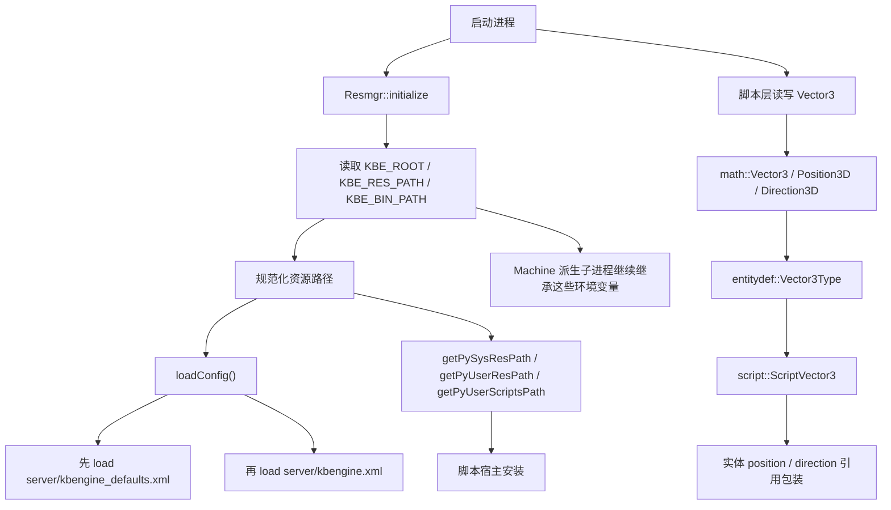
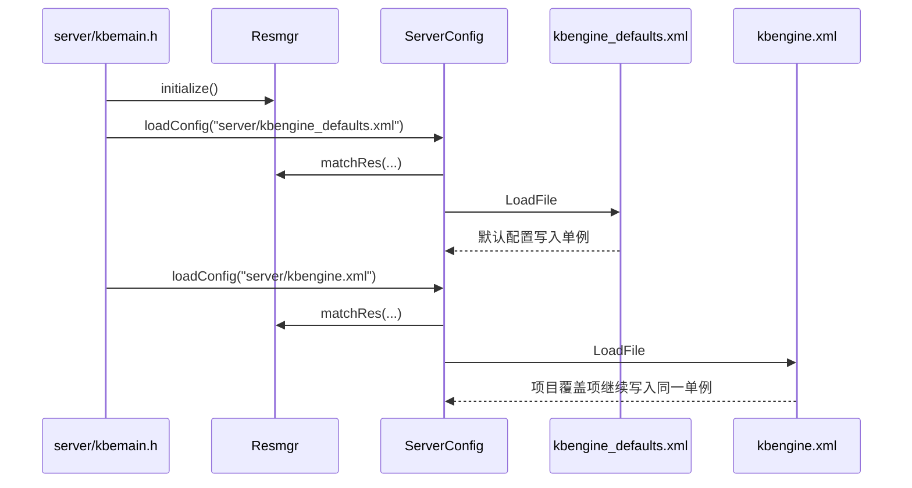
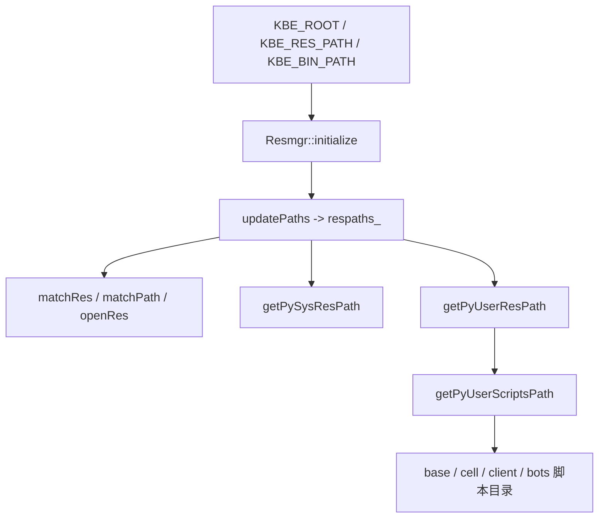
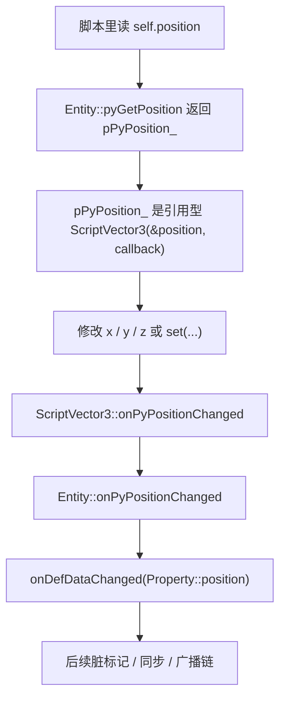

# 运行时配置与基础类型：`kbengine.xml`、环境变量与 `Vector3`

> 这一页我想收束两个经常被混在一起的问题：
>
> - `kbengine_defaults.xml`、`kbengine.xml`、`KBE_ROOT`、`KBE_RES_PATH` 这些配置和环境变量，到底是怎么进入运行时的
> - `vector3` 为什么看起来像一个普通基础类型，但源码里又牵扯到 `math`、`entitydef`、Python 包装对象和实体同步
>
> 这页不改 `api/**` 原文，只按当前源码树把加载链、覆盖关系、运行时边界和典型使用方式串起来。

## 先给结论

我现在更愿意把这一页拆成两条主线来看：



先压成几句结论：

- 服务端配置不是“只读一个 XML”，而是先载入 `kbengine_defaults.xml`，再把 `kbengine.xml` 里出现的节点覆盖到同一个 `ServerConfig` 单例上。
- 路径系统真正贯穿源码主链的是 `KBE_ROOT`、`KBE_RES_PATH`、`KBE_BIN_PATH`。当前源码树里没有查到 `KBE_HYBRID_PATH` 的实现落点。
- `Vector3` 不是“脚本里一个普通三元组”这么简单，它同时是：
  - `math` 层的底层向量类型
  - `entitydef` 层的 `VECTOR3` 数据类型
  - Python 层的 `ScriptVector3` 包装对象
  - `Entity.position / direction` 这类属性的引用桥

## 第一部分：配置文件怎么被找到并覆盖

### 服务端主链：先初始化资源系统，再连续加载两个 XML

`kbe/src/lib/server/kbemain.h` 里的 `loadConfig()` 很直接：

1. `Resmgr::getSingleton().initialize()`
2. `g_kbeSrvConfig.loadConfig("server/kbengine_defaults.xml")`
3. `g_kbeSrvConfig.loadConfig("server/kbengine.xml")`

也就是说，服务端不是把两个 XML 合并成第三个临时文件，而是：

- 先把默认值读进 `ServerConfig`
- 再把项目自己的配置继续写进同一个 `ServerConfig`

`kbe/src/lib/server/serverconfig.cpp` 里的 `ServerConfig::loadConfig()` 会先：

- `Resmgr::getSingleton().matchRes(fileName)`
- 再用 `tinyxml2::XMLDocument::LoadFile()` 去读文件

我现在更愿意把这个覆盖模型理解成：

- `kbengine_defaults.xml` 提供完整基线
- `kbengine.xml` 只覆盖自己显式写出来的节点
- 没写出来的字段，继续沿用默认值

这不是从文档推出来的，而是从 `loadConfig()` 的写法直接能看到的：每一段配置都是“如果这个节点存在，就改对应成员”，并没有“先清空再重建”的动作。



### `kbengine_defaults.xml` 和 `kbengine.xml` 的语义边界

对照 `docs/api/keywords.md` 的描述，再看当前源码，我现在会这样理解：

- `kbengine_defaults.xml`
  - 更接近引擎基线配置
  - 通过 `server/kbengine_defaults.xml` 在资源路径里匹配
- `kbengine.xml`
  - 更接近项目覆盖配置
  - 通过 `server/kbengine.xml` 在资源路径里匹配

`Resmgr::getPySysResPath()` 和 `Resmgr::getPyUserResPath()` 也正好沿着这个约定在算：

- `getPySysResPath()` 以 `server/kbengine_defaults.xml` 为锚点
- `getPyUserResPath()` 以 `server/kbengine.xml` 为锚点

这也是后面脚本路径、资源路径、密钥文件路径为什么会分“系统级资源”和“用户级资源”的原因。

### 客户端和 Bots 有一个分叉

`kbe/src/lib/client_lib/kbemain.h` 里也有自己的 `loadConfig()`：

- 如果当前是 `BOTS_TYPE`
  - 仍然走服务端那套 `server/kbengine_defaults.xml + server/kbengine.xml`
- 如果当前是 `CLIENT_TYPE`
  - 走 `Config::getSingleton().loadConfig("kbengine.xml")`

所以 Bots 更像“套了客户端网络壳的服务端工具进程”，而不是普通客户端。

这点和前面 [组件型脚本 API](/architecture/source-analysis/component-script-api.md) 里看到的现象是能对上的：

- Bots 业务入口像工具组件
- Bots 运行时底座又更像客户端宿主

## 第二部分：环境变量是怎么进入资源系统的

### `Resmgr::initialize()` 真正读取的是三项：`ROOT / RES / BIN`

`kbe/src/lib/resmgr/resmgr.cpp` 的 `Resmgr::initialize()` 开头就把三项环境变量读出来了：

- `KBE_ROOT`
- `KBE_RES_PATH`
- `KBE_BIN_PATH`

然后会做两步：

1. `updatePaths()`
2. 如果 `root_path` 或 `res_path` 为空，再尝试 `autoSetPaths()`

`autoSetPaths()` 的逻辑也很直白：

- 从当前工作目录往上找 `/kbe/bin/`
- 推导出 `root_path`
- 再拼出默认 `res_path`

也就是说，环境变量优先；实在没给，才尝试按当前目录结构兜底。

### `KBE_RES_PATH` 不是单一路径，它会被拆成资源搜索链

`updatePaths()` 会把 `KBE_RES_PATH` 拆成 `respaths_`：

- Windows 先按 `;`
- 非 Windows 如果只拆出一个片段，再尝试按 `:`

拆完之后它还会统一做几件事：

- 把反斜杠转成正斜杠
- 给目录补尾部 `/`
- 回写规范化后的 `kb_env_.res_path`

所以我现在更倾向把 `KBE_RES_PATH` 理解成：

- 资源搜索顺序链
- 不是单个目录常量

而 `Resmgr::matchRes()`、`hasRes()`、`openRes()`、`matchPath()` 都是在这条搜索链上逐个匹配。

### 从环境变量到脚本路径，其实还有一层派生

`Resmgr` 不是只暴露原始环境变量，它还继续派生出：

- `getPySysResPath()`
- `getPyUserResPath()`
- `getPyUserScriptsPath()`
- `getPyUserComponentScriptsPath()`

其中最关键的是：

- `getPyUserScriptsPath()` 从用户资源目录推到 `assets/scripts/`
- `getPyUserComponentScriptsPath()` 再继续推到 `assets/scripts/base/`、`cell/`、`client/`、`bots/`

这就是为什么很多“明明只是路径错了”的问题，最后会表现成：

- 脚本模块装不上
- 组件脚本找不到
- `EntityDef` 加载失败
- `KBEngine.open()`、`matchPath()`、热更新、密钥文件路径全部一起出问题



### 命令行参数和 `machine` 会继续传播这些环境变量

`kbe/src/lib/server/kbemain.h` 的 `parseMainCommandArgs()` 支持：

- `--KBE_ROOT=...`
- `--KBE_RES_PATH=...`
- `--KBE_BIN_PATH=...`

这说明主进程启动时可以用命令行临时覆盖环境变量。

而 `kbe/src/server/machine/machine.cpp` 里，`startLinuxProcess()` 又会在拉起子进程前：

- 如果传入的 `KBE_ROOT / KBE_RES_PATH / KBE_BIN_PATH` 为空，就回退到 `Resmgr::getSingleton().getEnv()`
- 再 `setenv(...)`
- 再 `execv(...)`

所以我现在会把 `machine` 看成一个“环境变量继续向子进程扩散”的节点，而不是一个只负责 `fork/exec` 的简单壳。

### `KBE_HYBRID_PATH` 这页必须单独说清楚

这里有一个当前源码树里很容易误判的点。

`docs/api/keywords.md` 里记录的是：

- `KBE_HYBRID_PATH`

但我在当前仓库里继续往下追时，真正贯穿源码和工具链的名字是：

- `KBE_BIN_PATH`

我已经确认有明确命中的位置包括：

- `Resmgr::initialize()` / `initializeWatcher()`
- `kbemain.h::parseMainCommandArgs()`
- `machine.cpp`
- `loginapp.cpp`
- `kbcmd`
- 安装脚本、启动脚本、WebConsole 文档与模板

而 `KBE_HYBRID_PATH` 在当前源码树里没有命中。

所以这一页我会明确记成：

- `api/**` 关键词页保留 CHM 原样
- 但按当前源码主链阅读时，真正生效的“可执行文件目录”环境变量是 `KBE_BIN_PATH`

这不是要去改 API 文本，而是避免以后再花时间去源码里找一个当前版本根本没有进主链的名字。

## 第三部分：为什么路径错了，脚本宿主会整片失效

这一段其实是从几个报错位置反推出来的。

`kbe/src/lib/server/entity_app.h` 和 `kbe/src/lib/server/python_app.cpp` 里都能看到类似检查：

- `respaths().size()`
- `getPyUserResPath()`
- `getPySysResPath()`
- `getPyUserScriptsPath()`

如果这些路径不成立，就会直接报：

- `KBE_RES_PATH error`

这说明脚本宿主安装并不是“只要 Python 在就行”，而是明确依赖 `Resmgr` 先把这些目录链算对。

客户端 `kbe/src/lib/client_lib/kbemain.h` 里也一样，安装脚本时会继续拼接：

- `common`
- `data`
- `user_type`
- 以及 `client` 或 `bots` 侧目录

所以这里更合适的理解是：

- `KBE_RES_PATH` 不只是给 `open()` 用的
- 它是整个脚本宿主、实体定义、项目脚本目录的前置条件

## 第四部分：`Vector3` 为什么不是一个普通三元组

### 底层 `math` 类型先把向量、位置、方向统一到一起

`kbe/src/lib/math/math.h` 里可以直接看到：

- `typedef G3D::Vector3 Vector3`
- `typedef Vector3 Position3D`
- `struct Direction3D { Vector3 dir; ... }`

也就是说：

- 位置本质上就是 `Vector3`
- 方向本质上也是一个三维向量，只是外面包了一层 `roll / pitch / yaw` 语义

这也是为什么很多接口虽然文档上写的是“位置”或“方向”，源码里最后都落成了 `Vector3` 及其别名。

### `entitydef` 把 `VECTOR3` 注册成正式数据类型

`kbe/src/lib/entitydef/datatypes.cpp` 里初始化基础类型时有：

- `addDataType("VECTOR3", new Vector3Type);`

再往下看 `kbe/src/lib/entitydef/datatype.cpp` 里的 `Vector3Type`，可以确认它负责三件事：

- `parseDefaultStr()`
  - 解析默认值字符串
  - 产出 `ScriptVector3`
- `addToStream()`
  - 把三个分量写进 `MemoryStream`
- `createFromStream()`
  - 从流里读三个分量
  - 重新构造 `ScriptVector3`

所以 `VECTOR3` 在引擎里不是“脚本层约定俗成的 tuple”，而是实体类型系统里一个正式注册的数据类型。

### Python 层真正暴露给脚本的是 `ScriptVector3`

`kbe/src/lib/pyscript/vector3.h/.cpp` 里的 `ScriptVector3`，我现在会把它理解成：

- 一个带 Python 序列语义的 C++ 包装对象
- 底下托着真正的 `Vector3`

它支持的能力比“三元组”多得多：

- 成员访问：`x / y / z`
- 只读属性：`length / lengthSquared`
- 距离计算：`flatDistTo / distTo / distSqrTo`
- 向量运算：`+ - * /`
- 点乘：`dot`
- 归一化：`normalise`
- 转换：`tuple / list / set`
- Pickle：`__reduce_ex__`

还有一个源码层的小边界值得记一下：

- `py_inplace_multiply`
  - 如果右值也是 `Vector3`，这里走的是叉乘
  - 如果右值是标量，才是缩放

所以脚本里看起来同样是 `*=`，底层分支其实不一样。

### `Vector3` 接受的不只是 `Vector3` 对象，任意长度为 3 的序列都行

`ScriptVector3::check()` 只要求：

- `PySequence_Check(value)`
- `PySequence_Size(value) == 3`

`convertPyObjectToVector3()` 也是按序列逐项取值。

所以很多 API 在脚本层其实都同时接受：

- `Vector3(1.0, 2.0, 3.0)`
- `(1.0, 2.0, 3.0)`
- `[1.0, 2.0, 3.0]`

这也解释了为什么像：

- `moveToPoint`
- `navigate`
- `teleport`
- `raycast`

这些接口在文档里常被写成“传一个位置”，源码里却往往只是先调用一次 `convertPyObjectToVector3()`。

### 真正关键的一层：实体属性并不是简单替换对象，而是保留引用包装

这里是我觉得最值得专门记下来的地方。

`kbe/src/lib/entitydef/property.cpp` 对 `VECTOR3` 属性赋值时，如果传进来的不是现成的 `ScriptVector3`，它不会直接粗暴替换成员对象，而是会：

1. 先拿到原来的属性对象
2. 把它转成 `ScriptVector3*`
3. 调用 `v->__py_pySet(v, value)`

也就是说，很多时候脚本看到的是：

- “我给属性重新赋了一个 tuple”

但引擎底层做的是：

- “保留原来的 `ScriptVector3` 包装对象，只把里面的三维值改掉”

我现在会把这个设计理解成：

- 保住 Python 对象身份
- 保住引用关系
- 保住可能挂在这个 `ScriptVector3` 上的变化回调

### `cellapp/Entity.position` 和 `direction` 用的是“带回调的引用型 `ScriptVector3`”

`kbe/src/server/cellapp/entity.cpp` 的构造函数里，能直接看到：

- `pPyPosition_ = new script::ScriptVector3(&position(), &pyPositionChangedCallback_)`
- `pPyDirection_ = new script::ScriptVector3(&direction().dir, &pyDirectionChangedCallback_)`

然后：

- `pyGetPosition()` 只是 `Py_INCREF(pPyPosition_)` 后把同一个对象返回
- `pyGetDirection()` 同理

而 `ScriptVector3::pySetX / pySetY / pySetZ / __py_pySet()` 最后都会走到：

- `onPyPositionChanged()`

如果这个 `ScriptVector3` 是引用型、而且带了回调，就会继续触发：

- `Entity::onPyPositionChanged()`
- `Entity::onPyDirectionChanged()`

再往下就是属性脏标记、消息 ID、`onDefDataChanged(...)` 那条同步链。

所以这里最关键的运行时结论是：

- 在 Cell 实体上，`self.position.x += 1` 不是只改一个 Python 小对象
- 它会沿着引用包装回到实体底层位置成员，并触发属性同步链



### 客户端也有引用包装，但边界不同

`kbe/src/lib/client_lib/entity.cpp` 里：

- `pyGetPosition()` 返回 `new script::ScriptVector3(&position(), NULL)`
- `pyGetDirection()` 返回 `new script::ScriptVector3(&direction().dir, NULL)`

这里同样是引用包装，但没有 Cell 实体那条“属性同步回调”。

所以客户端这边更适合理解成：

- 方便脚本直接按 `Vector3` 方式读写本地实体状态
- 但不等于服务端那条完整的属性脏标记链也存在

## 第五部分：我会怎么用这页

如果我是带着问题回源码，我大概会这么分：

1. 想知道“改 `kbengine.xml` 为什么能覆盖默认值”
   先看 `server/kbemain.h::loadConfig()` 的两次连续加载，再看 `ServerConfig::loadConfig()` 的按节点写入逻辑。
2. 想知道“`KBE_RES_PATH` 到底影响了什么”
   不要只看 `Resmgr::openRes()`，还要顺着 `getPyUserScriptsPath()` 去看脚本宿主安装。
3. 想知道“当前版本到底认不认 `KBE_HYBRID_PATH`”
   先全仓库搜，再和 `KBE_BIN_PATH` 的实际贯穿链对照。
4. 想知道“`vector3` 为什么能改 `position.x` 就联动底层”
   先看 `ScriptVector3` 的引用模式，再看 `cellapp/entity.cpp` 的回调绑定。
5. 想知道“为什么给 `VECTOR3` 属性赋 tuple 也能工作”
   先看 `Vector3Type` 的序列判定，再看 `property.cpp` 里对现有包装对象的原地更新。

## 使用例子

### 例子 1：把序列直接交给 `Vector3` 参数型接口

```python
target = (10.0, 0.0, 5.0)
self.moveToPoint(target, 4.0, 0.5, None)
```

这里脚本给的是 tuple，但底层照样会走 `convertPyObjectToVector3()`。

### 例子 2：直接用 `Vector3` 的方法做几何判断

```python
dist = self.position.distTo(other.position)
flat = self.position.flatDistTo((0.0, 0.0, 0.0))

if dist < 10.0:
    print(self.position.tuple())
```

适合：

- 脚本层几何判断
- 调试日志
- 导航前的距离预判

### 例子 3：修改 `position` 的单个分量

```python
self.position.x += 1.0
self.direction.z += 0.1
```

在 Cell 实体上，这类写法不是“改了一个临时向量”，而是沿着引用包装回到实体成员本身。

### 例子 4：部署和排错时先看哪条链

如果启动时碰到：

- 脚本模块装不上
- `KBE_RES_PATH error`
- `server/kbengine.xml` 找不到

我现在会先按这条顺序查：

1. `KBE_ROOT / KBE_RES_PATH / KBE_BIN_PATH`
2. `Resmgr::initialize()`
3. `getPySysResPath / getPyUserResPath / getPyUserScriptsPath`
4. `loadConfig()`
5. 组件脚本宿主安装

## 与其他专题的关系

- 通用资源路径 API、watcher、定时器、`urlopen` 这些宿主工具，看 [通用运行时工具 API](/architecture/source-analysis/runtime-utility-api.md)
- `raycast`、导航、移动控制器这些大量吃 `Vector3` 的空间接口，看 [CellApp 空间运行时 API](/architecture/source-analysis/cellapp-kbengine-space-runtime-api.md)
- `position / direction` 后续进入实体同步与 AOI 的主线，看 [空间、AOI 与视野同步](/architecture/source-analysis/space-aoi.md)
- `VECTOR3` 作为实体类型系统的一部分，放回总主线看，看 [实体系统](/architecture/source-analysis/entity-system.md)

这一页最后只想把边界收成一句话：

- `kbengine_defaults.xml / kbengine.xml` 负责把默认配置和项目覆盖配置写进同一个运行时配置单例；
- `KBE_ROOT / KBE_RES_PATH / KBE_BIN_PATH` 负责把资源、脚本和可执行文件路径送进运行时；
- `Vector3` 则把底层数学类型、实体类型系统和脚本属性引用桥接成了一条完整链。
