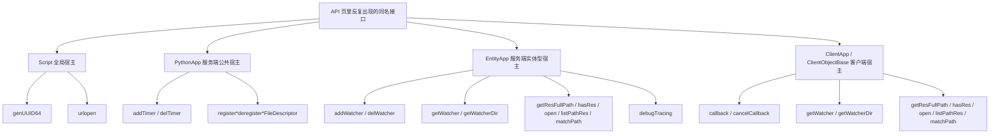
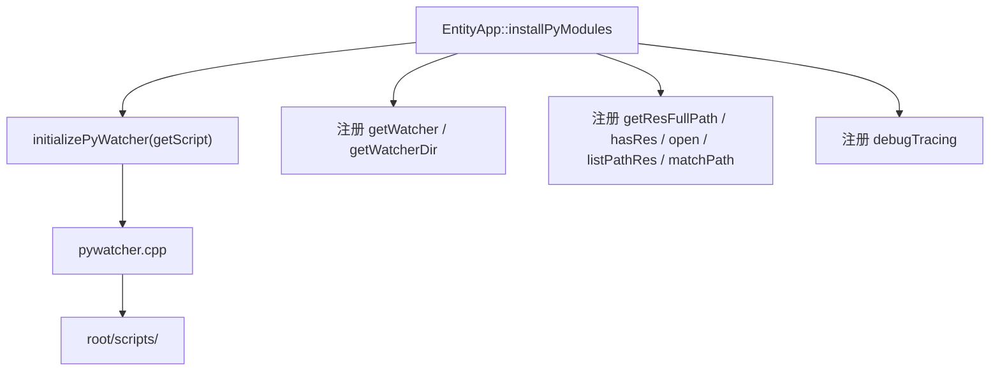
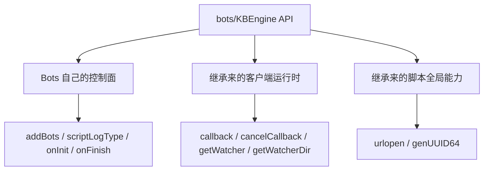

# 通用运行时工具 API：Script、PythonApp、EntityApp 与 ClientApp

> 这一页我想先收束一个很容易把人读乱的问题：为什么 `urlopen`、`genUUID64`、watcher、定时器、文件描述符回调、资源路径、`callback` 这些 API 会同时出现在不同组件的 `KBEngine` 模块里，看起来像“每个组件都各写了一遍”，但源码里又不是这样。
>
> 这页不重写 `api/**` 原文，只回答三件事：
>
> - 这些接口真正挂在哪一层宿主上
> - 哪些是服务端公共能力，哪些是客户端/Bots 公共能力
> - 业务组件页里看到它们时，应该把它们理解成“组件私有接口”，还是“宿主复用能力”

如果借 BigWorld 的眼光去看，这一组更像“进程脚本宿主 + dispatcher/watchers 公共设施”，而不是每个业务组件都复制了一套 HTTP、定时器、watcher 实现。下面仍只按 KBEngine 当前源码落点来展开。

## 先给结论

我现在更倾向把这批接口先拆成四层，而不是按 `baseapp / cellapp / loginapp / bots` 这些 API 目录直接硬读：



先压成一句话：

- `genUUID64`、`urlopen` 是脚本模块全局能力，不属于某个具体组件私有实现。
- `loginapp / interfaces / dbmgr / logger` 里的 `addTimer / delTimer` 和 FD 回调，走的是 `PythonApp` 公共宿主。
- `baseapp / cellapp` 里的 watcher、资源路径、`debugTracing`，走的是 `EntityApp` 这一层服务端实体型宿主。
- `bots` 里的 `callback / cancelCallback / getWatcher / getWatcherDir`，走的是 `ClientApp -> ClientObjectBase` 这一条客户端运行时链，不是服务端定时器。

## 第一层：`Script` 全局宿主只管“所有脚本模块都能看见的公共能力”

### `genUUID64()` 不是某个组件的私有工具

`kbe/src/lib/pyscript/script.cpp` 里可以直接看到：

- `__py_genUUID64`
- `APPEND_SCRIPT_MODULE_METHOD(module_, genUUID64, __py_genUUID64, ...)`

而且 `__py_genUUID64()` 里还会检查：

- `g_componentGlobalOrder` 是否在 `1 ~ 65535`

如果这个值超范围，源码会给出 warning，说明它不是“纯随机数接口”，而是和当前组件全局序号有关的 64 位 ID 生成工具。

所以这里更准确的理解是：

- `genUUID64()` 属于 `Script` 安装阶段统一挂入 `KBEngine` 模块的全局脚本能力
- API 页里在哪个组件目录能看到它，不代表它就是哪个组件单独实现的

### `urlopen()` 也是脚本模块级能力，不是组件自己各写一份

`kbe/src/lib/pyscript/pyurl.cpp` 里：

- `PyUrl::initialize(Script* pScript)`
- `APPEND_SCRIPT_MODULE_METHOD(pScript->getModule(), urlopen, __py_urlopen, ...)`

而 `kbe/src/lib/pyscript/script.cpp` 里又能看到：

- `Script::install()` 调了 `PyUrl::initialize(this)`

这说明 `urlopen()` 也是脚本模块安装时统一挂进去的公共能力。

当前源码下它支持的调用形态可以整理成：

- `KBEngine.urlopen(url)`
- `KBEngine.urlopen(url, callback)`
- `KBEngine.urlopen(url, callback, postDataBytes)`
- `KBEngine.urlopen(url, callback, headersDict)`
- `KBEngine.urlopen(url, callback, postDataBytes, headersDict)`

回调参数固定是：

- `httpcode`
- `data`
- `headers`
- `success`
- `url`

也就是：

```python
def on_http(httpcode, data, headers, success, url):
    if success and httpcode == 200:
        print(url, data)

KBEngine.urlopen(
    "https://example.com/api",
    on_http,
    b'{"ping": 1}',
    {"Content-Type": "application/json"}
)
```

所以这批组件页里看到的 `urlopen()`，更准确的说法应该是：

- 业务组件复用了脚本全局 HTTP 异步接口
- 不是 `loginapp`、`dbmgr`、`logger`、`bots` 各自实现了一套 HTTP 客户端

## 第二层：`PythonApp` 公共宿主提供的是服务端进程级定时器和 FD 回调

### `addTimer()` / `delTimer()` 的真正来源

`kbe/src/lib/server/python_app.cpp` 里统一给服务端宿主注册了：

- `addTimer`
- `delTimer`
- `registerReadFileDescriptor`
- `registerWriteFileDescriptor`
- `deregisterReadFileDescriptor`
- `deregisterWriteFileDescriptor`

也就是说，`loginapp / interfaces / dbmgr / logger` 页面里看到的这组接口，本质上都来自同一个服务端公共宿主。

`__py_addTimer()` 的参数解析是：

- `ffO`
- 也就是 `initialOffset, repeatOffset, callback`

更关键的是它创建的 `ScriptTimerHandler::handleTimeout()` 最终会：

- `PyObject_CallFunction(pyCallback_, "i", id)`

所以服务端这个 `addTimer()` 的 Python 回调签名，不是无参，而是：

- `callback(timerID)`

这点和客户端/Bots 的 `callback()` 很不一样，后面会单独说。

一个更贴近源码语义的用法例子可以写成：

```python
g_timer_id = 0

def _heartbeat(timer_id):
    print("tick from", timer_id)

def onLoginAppReady():
    global g_timer_id
    g_timer_id = KBEngine.addTimer(5.0, 5.0, _heartbeat)

def onLoginAppShutDown():
    if g_timer_id > 0:
        KBEngine.delTimer(g_timer_id)
```

### 文件描述符回调不是轮询 while 循环，而是挂进 dispatcher

`kbe/src/lib/server/py_file_descriptor.cpp` 里：

- 注册读 FD 会 `new PyFileDescriptor(fd, pycallback, false)`
- 注册写 FD 会 `new PyFileDescriptor(fd, pycallback, true)`

`PyFileDescriptor` 构造时会立即：

- `dispatcher().registerReadFileDescriptor(...)`
- 或 `dispatcher().registerWriteFileDescriptor(...)`

真正可读/可写时，最后走到 `PyFileDescriptor::callback()`，再调用：

- `PyObject_CallFunction(pyCallback_.get(), "i", fd_)`

所以这里最准确的理解是：

- 这不是脚本层自己维护的轮询器
- 而是把现成 FD 接进引擎事件循环
- Python 回调拿到的只有一个参数：`fd`

这类接口更适合的场景通常是：

- 接外部 socket / pipe
- 把已有 C/C++ 层文件描述符桥接到引擎 dispatcher
- 让服务端脚本在主事件循环里接管某个外部输入源

## 第三层：`EntityApp` 公共宿主把 watcher、资源路径和调试工具挂进了 BaseApp / CellApp

这里要先区分一个边界：

- `loginapp / interfaces / dbmgr / logger` 主要站在 `PythonApp` 这条线上
- `baseapp / cellapp` 则继续走到了 `EntityApp<E>` 这条实体型宿主线上

### 服务端 `addWatcher()` / `delWatcher()` 是在 `EntityApp<E>` 里装进来的

`kbe/src/lib/pyscript/pywatcher.cpp` 里定义了：

- `addWatcher`
- `delWatcher`
- `initializePyWatcher(Script* pScript)`

而真正的安装点在 `kbe/src/lib/server/entity_app.h`：

- `initializePyWatcher(&this->getScript())`

这说明服务端 watcher 这一套不是 API 文档想象出来的额外挂件，而是 `EntityApp<E>` 在装脚本宿主时明确接进来的。

### `addWatcher()` 实际挂到的是 `root/scripts/...`

`pywatcher.cpp` 里最关键的一行是：

```cpp
path = std::string("root/scripts/") + path;
```

也就是说，在脚本里写：

```python
KBEngine.addWatcher("metrics/onlinePlayers", "UINT32", lambda: online_count)
```

引擎内部真正挂进去的 watcher 路径，其实是：

- `root/scripts/metrics/onlinePlayers`

而且 `addWatcher()` 在注册时会先调用一次你传进来的 Python callable，先验证它是否真的能返回对应类型。

所以这组接口更准确的语义是：

- 不是“加一个普通 Python 变量”
- 而是把一项脚本侧指标挂进引擎 watcher 树

### `getWatcher()` / `getWatcherDir()` 是读 watcher 树，不是组件私有接口

服务端这两个读取接口的实现落在 `kbe/src/lib/server/entity_app.h`：

- `__py_getWatcher`
- `__py_getWatcherDir`

它们最终都是对 `WatcherPaths::root()` 做读取。

所以在 `baseapp / cellapp` 页面里看到它们时，应该优先理解成：

- 读取当前进程 watcher 树的公共能力

而不是：

- BaseApp 专门造了一套 watcher API
- CellApp 又重新造了一套 watcher API

### 资源路径 API 最终都收敛到 `Resmgr`

`EntityApp<E>` 里统一挂了：

- `getResFullPath`
- `hasRes`
- `open`
- `listPathRes`
- `matchPath`

它们最后都落到 `Resmgr::getSingleton()`。

源码语义可以压成这样：

- `getResFullPath()`：先看资源是否存在，再返回匹配到的完整路径
- `hasRes()`：只判断资源是否存在
- `matchPath()`：按资源系统规则解析路径
- `listPathRes()`：列目录
- `open()`：先走资源路径匹配，再调用 Python `io.open`

所以它们真正的边界不是“方便读文件”，而是：

- 只按引擎认可的资源路径体系去访问资源

### `debugTracing()` 更像对象泄漏排查入口

服务端 `debugTracing()` 也是挂在宿主层上的，最后指向：

- `script::PyGC::__py_debugTracing`

它的定位更接近：

- 主动输出当前 KBEngine 封装 Python 对象的跟踪统计
- 排查 `Entity`、`EntityCall`、数组/字典包装对象是否有引用没释放

这类接口不是业务逻辑 API，而是运行时诊断工具。



## 第四层：`address / isShuttingDown / app flags` 更像组件实例态查询，不是全局脚本工具

这组接口和前面那批再有一个区别：

- 它们不是 `Script` 全局模块能力
- 也不是所有组件都共享
- 更像 BaseApp / CellApp 各自对“当前进程自身状态”的薄封装

当前源码里，`baseapp.cpp` 和 `cellapp.cpp` 都各自提供了：

- `address()`
- `isShuttingDown()`
- `getAppFlags()`
- `setAppFlags()`

所以我现在更愿意把它们理解成：

- 当前组件实例态的自我描述接口

其中：

- `address()` 适合做日志、诊断、外部回调定位
- `isShuttingDown()` 适合异步逻辑快速止损
- `getAppFlags() / setAppFlags()` 适合做运行态标志调整

这里还要顺手记一个边界：

- `quantumPassedPercent()` 是 BaseApp 自己的运行时状态接口
- 它不是这一组“所有组件都共享”的公共能力

也就是说，“同样像状态查询”不等于“同样来自同一层宿主”。

## 第五层：`ClientApp / ClientObjectBase` 给客户端和 Bots 提供的是本地回调调度，不是服务端定时器

### `callback()` / `cancelCallback()` 是客户端本地一次性延迟回调

`kbe/src/lib/client_lib/clientapp.cpp` 把这些方法直接挂进了客户端 `KBEngine` 模块：

- `callback`
- `cancelCallback`
- `getWatcher`
- `getWatcherDir`

但真正实现落在 `kbe/src/lib/client_lib/clientobjectbase.cpp`。

`ClientObjectBase::__py_callback()` 的参数解析是：

- `(time, callback)`

然后会把回调交给：

- `scriptCallbacks().addCallback(time, 0.0f, new ScriptCallbackHandler(...))`

再往下看 `kbe/src/lib/client_lib/script_callbacks.cpp`：

- `ScriptCallbackHandler::handleTimeout()` 最终是 `PyObject_CallFunction(pObject, "")`

所以客户端/Bots 这套回调有两个关键边界：

- 回调是无参的
- 当前这条 API 走的是一次性延迟回调，不是服务端那种 `(timerID)` 重复定时器

一个更贴近源码语义的例子是：

```python
g_cb = 0

def _later():
    print("0.5 秒后执行一次")

def onInit(isReload):
    global g_cb
    g_cb = KBEngine.callback(0.5, _later)

def onFinish():
    if g_cb > 0:
        KBEngine.cancelCallback(g_cb)
```

### 客户端/Bots 的 `getWatcher()` / `getWatcherDir()` 是读本地 watcher 树

客户端这两个接口仍然在 `ClientObjectBase` 里实现：

- `__py_getWatcher`
- `__py_getWatcherDir`

`getWatcher()` 会从 `WatcherPaths::root()` 读 watcher，再通过 `MemoryStream` 把不同 watcher 类型解出来，最后返回 Python 值。

所以 Bots 页面里看到这两个接口时，更准确的理解是：

- 这是客户端运行时提供的本地 watcher 读取能力
- 不是 `bots.cpp` 自己专门扩出来的一套 API

## 第六层：Bots 需要单独看边界，因为它只把“控制面”挂出来，运行时能力多数继承自客户端宿主

`kbe/src/server/tools/bots/bots.cpp` 里真正明显属于 Bots 自己控制面的，是：

- `registerPyObjectToScript("bots", pPyBots_)`
- `addBots`
- `scriptLogType`
- `onInit / onFinish` 这一组入口/结束钩子

而下面这些并不是 `bots.cpp` 单独再造的：

- `callback / cancelCallback`
- `getWatcher / getWatcherDir`
- `urlopen`
- `genUUID64`

其中：

- `callback / cancelCallback / getWatcher / getWatcherDir` 来自 `ClientApp -> ClientObjectBase`
- `urlopen / genUUID64` 来自 `Script` 全局宿主

`kbe/src/server/tools/bots/create_and_login_handler.cpp` 里还直接在 C++ 侧用了：

- `KBEngine::genUUID64()`

这反而进一步说明：

- `genUUID64` 的定位就是全局运行时工具
- 不是 Bots 私有接口



## 我现在会怎么用这页

如果我是带着问题往回找源码，我会这样分：

1. 想知道“为什么 `loginapp` 里也有 `addTimer`”
   先看 `PythonApp::installPyModules()`，不要先去找 `loginapp.cpp` 里是不是单独注册了定时器。
2. 想知道“为什么 `bots.callback()` 和服务端 `addTimer()` 行为不一样”
   先区分 `ClientObjectBase::scriptCallbacks()` 和 `PythonApp::scriptTimers()` 是两套不同调度器。
3. 想知道“watcher 到底挂到了哪里”
   先看 `pywatcher.cpp` 的 `root/scripts/` 前缀，再看 `EntityApp<E>` 是怎么装进去的。
4. 想知道“资源路径 API 到底是不是普通文件 IO”
   先看 `Resmgr::getSingleton()`，不要把 `open()` 直接当成本地任意路径访问。
5. 想知道“`genUUID64` 算不算组件私有能力”
   先回到 `script.cpp`，看它是在 `Script::install()` 阶段统一挂进去的。

## 使用场景例子

### 服务端：用 `addTimer()` 做周期心跳

```python
def on_tick(timer_id):
    print("service timer:", timer_id)

tid = KBEngine.addTimer(1.0, 1.0, on_tick)
```

适合：

- loginapp 排队状态巡检
- interfaces 外部请求超时扫描
- logger 周期刷盘/旁路清理

### 服务端：用 watcher 暴露运行指标

```python
online_count = 128

def watcher_online():
    return online_count

KBEngine.addWatcher("metrics/onlinePlayers", "UINT32", watcher_online)
```

适合：

- 在线人数
- 队列长度
- 某类实体数
- 外部缓存命中率

### Bots：用 `callback()` 安排一次延迟动作

```python
def do_login_step():
    print("later step")

cbid = KBEngine.callback(0.2, do_login_step)
```

适合：

- 分阶段压测动作
- 本地状态机的下一拍推进
- 测试脚本里的短延迟调度

### 通用：用 `urlopen()` 接外部 HTTP

```python
def on_http(httpcode, data, headers, success, url):
    if not success:
        print("request failed", url)

KBEngine.urlopen("https://example.com/ping", on_http)
```

适合：

- 第三方登录/支付/风控
- Webhook
- 简单配置中心或旁路接口探测

## 与其他专题的关系

- 组件业务回调怎么走，看 [组件型脚本 API](/architecture/source-analysis/component-script-api.md)
- BaseApp 自己的实体工厂、DBID 恢复和登录闸门，看 [BaseApp 运行时 API](/architecture/source-analysis/baseapp-kbengine-runtime-api.md)
- CellApp 自己的空间几何、SpaceData 和 `raycast()`，看 [CellApp 空间运行时 API](/architecture/source-analysis/cellapp-kbengine-space-runtime-api.md)
- 实体定时器和热重载背景，看 [脚本运行时与热重载](/architecture/source-analysis/scripting.md)

这页最后只想把边界收成一句话：

- 同名工具 API 出现在多个组件页里，不代表这些组件各自实现了一套；更常见的真实情况是，它们共同复用了 `Script / PythonApp / EntityApp / ClientApp` 这几层宿主能力。
