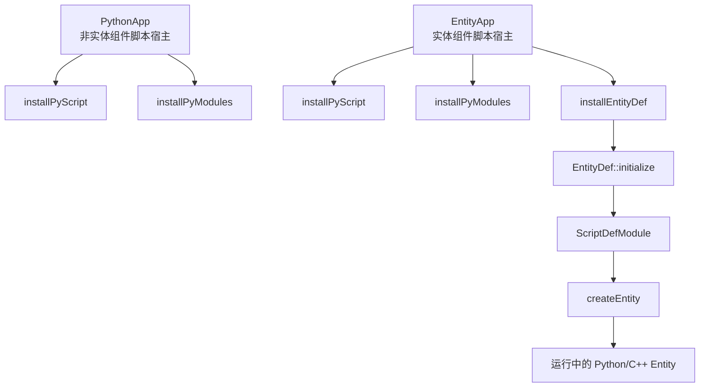
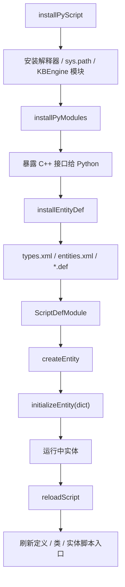
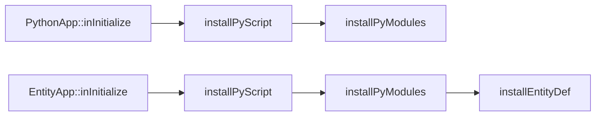
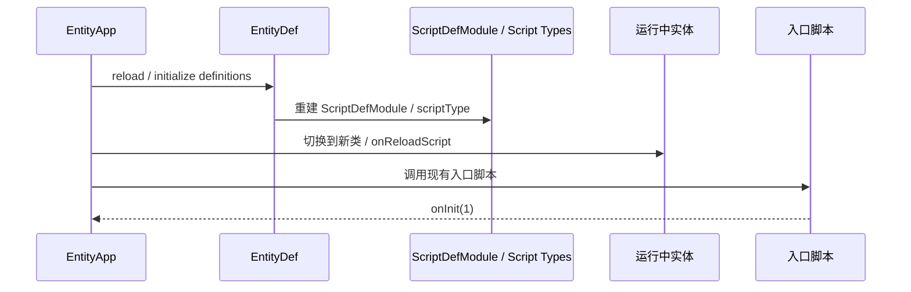

# 脚本运行时与热更新

> 这一页只回答三个问题：KBEngine 的 Python 运行时是谁装起来的，实体脚本对象是怎么从 `EntityDef` 变成运行中实例的，`reloadScript` 到底会热更新什么、不会热更新什么。

## 先给结论

KBEngine 的脚本运行时不是“启动时顺手把 Python 嵌进去”这么简单，而是分成了两条骨架：

- `PythonApp` 负责非实体型组件的脚本宿主，例如 `dbmgr`、`interfaces`、`loginapp`、`logger`
- `EntityApp<E>` 在脚本宿主之上再叠一层实体运行时，负责 `Baseapp`、`Cellapp` 的实体脚本、`EntityDef`、`callbackMgr` 和 `entities`

对应源码入口：

- `kbe/src/lib/server/python_app.h`
- `kbe/src/lib/server/python_app.cpp`
- `kbe/src/lib/server/entity_app.h`
- `kbe/src/lib/entitydef/entitydef.cpp`
- `kbe/src/lib/entitydef/scriptdef_module.cpp`



如果只记一条主线，可以记成：

```text
installPyScript
  → 建 Python 搜索路径并安装 KBEngine 模块
installPyModules
  → 把 C++ 暴露给 Python，导入入口脚本
installEntityDef
  → 读取 entities.xml / *.def，建立 ScriptDefModule
createEntity
  → ScriptDefModule::createObject 分配 PyObject
  → onCreateEntity 构造 C++ Entity 外壳
  → initializeEntity(dict) 建属性命名空间并执行脚本初始化
reloadScript
  → EntityDef 重新加载定义
  → EntityCall / EntityComponent / 已存活实体切到新类
  → 再次调用入口脚本 onInit(1)
```



## 第一层：`PythonApp` 负责把 Python 宿主装起来

`PythonApp::inInitialize()` 的顺序很直接：

```text
installPyScript()
  → installPyModules()
```

这条链定义在 `kbe/src/lib/server/python_app.cpp`。它说明 KBEngine 先搭“解释器和模块环境”，再加载业务入口脚本。

### `installPyScript()` 做的是路径和解释器安装

`PythonApp::installPyScript()` 会先检查 `Resmgr` 是否已经准备好以下目录：

- 用户资源目录
- 系统资源目录
- 用户脚本目录

然后根据组件类型拼出不同的 `sys.path` 风格路径：

- 所有组件都会先加 `common`、`data`、`user_type`
- `baseapp` 再加 `server_common`、`base`、`base/interfaces`、`base/components`
- `cellapp` 再加 `server_common`、`cell`、`cell/interfaces`、`cell/components`
- `dbmgr`、`interfaces`、`loginapp`、`logger` 各自再加自己的脚本子目录

最后它调用：

```cpp
getScript().install(..., "KBEngine", componentType_)
```

也就是说，`KBEngine` 这个 Python 模块并不是纯脚本包，而是 C++ 侧创建的宿主模块。`PythonApp` 成功安装后还会顺手安装 `PyMemoryStream`，这样脚本层才能直接操作引擎的流对象。

### `installPyModules()` 做的是“往 KBEngine 模块里塞能力”

`PythonApp::installPyModules()` 的职责不是扫描实体，而是给所有 Python 组件统一挂载基础能力：

- `MemoryStream`
- `publish`
- `scriptLogType`
- `getResFullPath`
- `hasRes`
- `open`
- `listPathRes`
- `matchPath`
- `addTimer`
- `delTimer`
- 文件描述符注册接口

然后按组件配置取 `entryScriptFile`，最后通过 `PyImport_Import(...)` 导入入口模块。

这里有一个很重要的边界：`PythonApp` 导入的是“组件入口脚本”，不是实体类定义本身。也就是说，`interfaces`、`dbmgr` 这一类组件的脚本生命周期，核心是入口模块，而不是 `EntityDef`。

## 第二层：`EntityApp<E>` 在宿主上叠实体世界

`EntityApp<E>::inInitialize()` 比 `PythonApp` 多一步：

```text
installPyScript()
  → installPyModules()
  → installEntityDef()
```

这意味着 BaseApp / CellApp 的脚本运行时不是单纯“能 import Python 文件”就结束了，它还必须把实体定义系统建起来。



### `installPyModules()` 先暴露容器、全局数据和调试能力

`EntityApp<E>::installPyModules()` 里真正新增的运行时骨架主要有四类：

- `Entities<E>` 和 `EntityGarbages<E>` 的脚本封装
- `entities` 全局对象，直接注册到 `KBEngine` 模块
- `globalData`，通过 `GlobalDataClient` 暴露给脚本
- `PyWatcher` 支持，用于脚本侧查看 watcher 树

同时它还把一批通用接口注册进脚本模块：

- `kbassert`
- `publish`
- `scriptLogType`
- `getWatcher` / `getWatcherDir`
- 资源访问接口
- 调试常量和错误码

只有做完这一步，脚本层才真正有“运行时环境”可用，而不是只有一个空解释器。

### `installEntityDef()` 才是实体脚本系统的真正入口

`EntityApp<E>::installEntityDef()` 先执行：

```cpp
EntityDef::installScript(this->getScript().getModule())
EntityDef::initialize(scriptBaseTypes_, componentType_)
```

这两步的意义不同：

- `installScript` 把实体定义相关的脚本接口挂到当前 `KBEngine` 模块
- `initialize` 才真正读取 `entities.xml`、`entity_defs/*.def`、`types.xml` 并建立运行时元数据

随后它还会检查 `dbmgr` 配置里的账号实体类型是否存在，这说明实体定义加载不是“只要能解析 XML 就算成功”，而是要满足集群运行前提。

## 第三层：`EntityDef` 把静态定义变成运行时元数据

`EntityDef::initialize(...)` 在 `kbe/src/lib/entitydef/entitydef.cpp` 里完成了三件事。

### 1. 先加载类型系统

它先读取：

- `scripts/entity_defs/types.xml`

这一步由 `DataTypes::initialize(...)` 完成。也就是说属性系统、序列化系统需要的类型信息，在实体脚本真正加载前就已经定型。

### 2. 再遍历 `entities.xml` 和每个 `.def`

它会读取：

- `scripts/entities.xml`
- `scripts/entity_defs/<Entity>.def`

每碰到一个实体，就调用 `registerNewScriptDefModule(moduleName)` 建一个 `ScriptDefModule`，随后把属性、方法、alias、组件定义等内容装进去。

这一层的关键不是 XML 解析本身，而是 `ScriptDefModule` 成了运行时唯一可信的实体元数据载体。后面 RPC、属性同步、持久化、脚本实例化，都从这里取定义。

### 3. 最后再加载实体脚本模块

完成 `.def` 解析后，`EntityDef::initialize(...)` 还会继续走：

```cpp
loadAllEntityScriptModules(__entitiesPath, scriptBaseTypes)
```

所以真实顺序不是“先 import Python 类再看 .def”，而是：

```text
types.xml
  → entities.xml / *.def
  → script::entitydef::initialize()
  → loadAllEntityScriptModules(...)
```

这也是为什么本书前面必须先讲 `EntityDef`，再讲 RPC 和脚本回调。因为运行中的 Python 类，实际上是被 `.def` 约束和补完过的。

## 第四层：`ScriptDefModule` 负责把定义变成可实例化脚本类型

`ScriptDefModule` 的核心职责不是保存配置，而是维护一个“可实例化实体类型”：

- `scriptType_`
- 属性描述表
- 方法描述表
- alias 映射
- 组件描述
- 是否有 base / cell / client 部分

最容易被忽视的一点在 `ScriptDefModule::createObject()`：

```cpp
PyObject * pObject = PyType_GenericAlloc(scriptType_, 0);
```

这说明 KBEngine 创建实体脚本对象时，先做的是 Python 对象分配，而不是直接调用业务构造器。也就是说：

- 运行时实体首先是一个 Python 类型实例
- C++ 的 `Entity` 外壳随后通过 placement new 叠到这个对象上

这正是 KBEngine 脚本桥接的关键设计点：实体不是“C++ 对象拥有一个 Python 成员”，而是同一个对象同时承载 C++ 实体壳和 Python 实例语义。

## 第五层：`createEntity()` 才真正把定义落成运行中实体

真正的实例化发生在 `EntityApp<E>::createEntity(...)`。

它的顺序非常固定：

1. 检查 `EntityID` 是否可分配
2. 用 `EntityDef::findScriptModule(entityType)` 找到 `ScriptDefModule`
3. 校验当前组件是否允许创建这个实体部分
4. `sm->createObject()` 分配 Python 对象
5. 分配或接收 `ENTITY_ID`
6. `onCreateEntity(obj, sm, id)` 构造 C++ `Entity`
7. `entity->initProperty()`
8. 把实体放进 `pEntities_`
9. 如果需要，执行 `entity->initializeEntity(params)`

这一段非常关键，因为它把“元数据、对象、容器、脚本初始化”明确拆开了。

### `initializeEntity()` 并不只是调一次 Python 钩子

`initializeEntity()` 的宏实现定义在 `kbe/src/lib/entitydef/entity_macro.h`，真实逻辑是：

```text
createNamespace(dictData, persistentData)
  → initializeScript()
```

其中：

- `createNamespace(...)` 负责把字典数据灌进实体属性空间，必要时处理 `cellData` 和组件属性
- `initializeScript()` 会先做组件挂接，再调用 `onInitializeScript()`

因此“创建实体”不是简单的 `__init__` 调用，而是：

- 先建立底层属性命名空间
- 再让脚本对象进入可运行状态

这也是很多生命周期钩子要放到属性灌装之后的原因。

## 第六层：回调系统不是语法糖，而是跨异步链路的托管层

脚本里看到的很多异步回调，底层并不是直接把 `PyObject*` 绑在线程或网络请求上，而是统一走 `CallbackMgr`。

核心文件：

- `kbe/src/lib/server/callbackmgr.h`

这个管理器本质上是：

- 给回调分配一个 `CALLBACK_ID`
- 把回调对象和超时时间存进 `cbMap_`
- 在结果返回时通过 `take(callbackID)` 取回
- 超时后由 `tick()` 统一清理

对脚本层最重要的含义有两点：

1. 很多跨组件、跨数据库、跨网络的异步 API，在线路上传的其实不是 Python 回调本身，而是 `callbackID`
2. 某些场景下回调还可以序列化到流里，因为 `CallbackMgr<PyObjectPtr>` 提供了 `addToStream()` 和 `createFromStream()`

这也是为什么在 BaseApp、CellApp、Interfaces 这些组件里，会大量看到 `callbackMgr().save(pyCallback)` / `callbackMgr().take(callbackID)`。

## 第七层：脚本定时器和回调管理器是两套东西

`PythonApp` 里还有一条很容易和 `callbackMgr` 混淆的线：`ScriptTimers`。

在 `python_app.cpp` 里：

- `PythonApp` 构造时初始化 `ScriptTimers`
- `addTimer` / `delTimer` 暴露给 `KBEngine` 模块
- `ScriptTimerHandler` 在超时后直接调用 Python 回调

所以两者边界要分清：

- `ScriptTimers` 解决“本地脚本定时执行”
- `CallbackMgr` 解决“异步请求完成后按 ID 取回回调”

这两个机制都会回到 Python，但它们并不是同一个托管层。

<a id="cell-entity-script-timers"></a>
## Cell 实体的 `addTimer()` / `delTimer()` 实际上操作的是 `ScriptID -> TimerHandle` 映射

CellApp API 里的 `Entity.addTimer()` 很容易被读成：

- 直接把一个数字注册到底层时间轮
- `onTimer()` 收到的就是底层原生定时器句柄

源码实际拆成了两层：

- 脚本层看到的是 `ScriptID`
- 底层调度器保存的是 `TimerHandle`

### 第一层：脚本调用 `addTimer()` 时，真正落到底层的是 `ScriptTimers`

`Entity` 的 `addTimer()` / `delTimer()` 不是手写在 `cellapp/entity.cpp` 里，而是通过实体宏展开到 `ScriptTimersUtil`：

```cpp
// 文件：kbe/src/lib/entitydef/entity_macro.h
PyObject* CLASS::pyAddTimer(float interval, float repeat, int32 userArg)
{
    EntityScriptTimerHandler* pHandler = new EntityScriptTimerHandler(this);
    ScriptTimers* pTimers = &scriptTimers_;
    int id = ScriptTimersUtil::addTimer(&pTimers, interval, repeat, userArg, pHandler);
    ...
    return PyLong_FromLong(id);
}
```

这说明脚本层拿到的返回值 `id`，不是底层 `TimerHandle`，而是 `ScriptTimers` 自己分配出来的脚本侧 ID。

### 第二层：`ScriptTimers` 会把秒数换算成 game tick，再生成底层 `TimerHandle`

真正的注册逻辑在：

- `kbe/src/lib/server/script_timers.cpp`

```cpp
// 文件：kbe/src/lib/server/script_timers.cpp
ScriptID ScriptTimers::addTimer(float initialOffset, float repeatOffset, int userArg, TimerHandler* pHandler)
{
    int hertz = g_kbeSrvConfig.gameUpdateHertz();
    int initialTicks = GameTime(g_pApp->time() + initialOffset * hertz);
    int repeatTicks = 0;
    ...

    TimerHandle timerHandle = g_pApp->timers().add(
        initialTicks, repeatTicks, pHandler, (void *)(intptr_t)userArg);

    if (timerHandle.isSet())
    {
        int id = this->getNewID();
        map_[id] = timerHandle;
        return id;
    }
}
```

这里能得到几个很重要的结论：

- 脚本层传入的是秒
- 底层真正调度前会先按 `gameUpdateHertz` 换算成 tick
- `repeatOffset <= 0` 时，底层重复间隔就是 `0`
- 脚本层真正管理的是 `map_[ScriptID] = TimerHandle`

因此 API 文档里更准确的说法应该是：

- `addTimer()` 返回的是**脚本层 timerID**
- 它只是映射到一个底层 `TimerHandle`

### 第三层：`onTimer()` 收到的也是 `ScriptID`，不是底层句柄

Cell 实体真正回调脚本时，走的是：

```cpp
// 文件：kbe/src/server/cellapp/entity.cpp
void Entity::onTimer(ScriptID timerID, int useraAgs)
{
    bufferOrExeCallback("onTimer",
        Py_BuildValue("(Ii)", timerID, useraAgs));
}
```

也就是说，脚本里 `onTimer(self, timerHandle, userData)` 这个第一个参数，语义上更准确地说是：

- **脚本侧 timerID**

它不是底层调度器直接吐出来的 `TimerHandle`。

### 第四层：`delTimer()` 删除的是脚本 ID 映射，不是直接面向时间轮枚举

删除逻辑同样走 `ScriptTimers`：

```cpp
// 文件：kbe/src/lib/server/script_timers.cpp
bool ScriptTimers::delTimer(ScriptID timerID)
{
    Map::iterator iter = map_.find(timerID);
    if (iter != map_.end())
    {
        TimerHandle handle = iter->second;
        handle.cancel();
        return true;
    }
    return false;
}
```

而实体宏还额外支持了一种脚本语义：

```cpp
// 文件：kbe/src/lib/entitydef/entity_macro.h
if (PyUnicode_Check(pyargobj))
{
    if (strcmp(PyUnicode_AsUTF8AndSize(pyargobj, NULL), "All") == 0)
    {
        pobj->scriptTimers().cancelAll();
    }
}
```

所以 `delTimer()` 的真实边界是：

- 传数字：按脚本侧 `timerID` 删除
- 传 `"All"`：取消当前实体全部脚本定时器

### 第五层：为什么实体迁移后 timerID 还能保持不变

Cell 实体这边专门把脚本定时器做了序列化/反序列化：

```cpp
// 文件：kbe/src/server/cellapp/entity.cpp
void Entity::addTimersToStream(KBEngine::MemoryStream& s)
{
    ScriptTimers::Map& map = scriptTimers_.map();
    ...
    s << iter->first; // ScriptID
    ...
    Cellapp::getSingleton().timers().getTimerInfo(iter->second, time, interval, pUser);
    ...
}
```

恢复时：

```cpp
// 文件：kbe/src/server/cellapp/entity.cpp
void Entity::createTimersFromStream(KBEngine::MemoryStream& s)
{
    ...
    s >> tid >> time >> interval >> userData;
    ...
    TimerHandle timerHandle = Cellapp::getSingleton().timers().add(
        time, interval, pEntityScriptTimerHandler, (void *)(intptr_t)userData);

    scriptTimers_.directAddTimer(tid, timerHandle);
}
```

这里最关键的是：

- 流里显式保存了 `tid`
- 恢复时会新建一个新的底层 `TimerHandle`
- 但脚本层继续复用原来的 `tid`

这就是为什么 Cell 实体迁移、恢复后，脚本代码里原来的 `timerID` 还能继续成立。

## 第八层：`reloadScript` 更新的是定义、类型和入口回调，不是整个进程状态

### `EntityApp<E>::reloadScript()` 的真实顺序



`EntityApp<E>::reloadScript(fullReload)` 的源码很短，但语义很重：

```text
EntityDef::reload(fullReload)
  → onReloadScript(fullReload)
  → entryScript.onInit(1)
```

其中 `EntityDef::reload(fullReload)` 会分两种模式：

- `fullReload = true`：把现有 `ScriptDefModule` 转存到 old 容器，`finalise(true)` 后重新 `initialize(...)`
- `fullReload = false`：只重新加载实体脚本模块，不重建整套定义

这说明 `reloadScript` 不是一个“统一热更新开关”，而是分成了“重建定义”和“仅重载模块”两档；入口脚本这里是再次调用 `onInit(1)`，不是重新导入入口脚本模块。

### `onReloadScript()` 只会刷新一部分运行中对象

`EntityApp<E>::onReloadScript(fullReload)` 会遍历：

- `EntityCall::entityCalls`
- `EntityComponent::entity_components`

分别调用它们的 `reload()`。

BaseApp / CellApp 还会额外遍历当前存活实体，逐个执行：

```cpp
entity->reload(fullReload)
```

而实体自己的 `reload()` 在 `entity_macro.h` 里可以看到两件关键事：

- `fullReload` 时重新找新的 `ScriptDefModule`
- 把 `__class__` 切到新的 `scriptType_`

这说明 KBEngine 的热更新核心不是“重跑构造函数”，而是让现有 Python 实例切换到新的类定义，并重新绑定属性描述。

### 热更新的边界

从这条实现可以看出几个明确边界：

- 进程不会因为 `reloadScript` 重建
- 已有实体不会重新分配 `ENTITY_ID`
- 运行中的实体容器不会被整体丢弃
- 真正被刷新的，是 `EntityDef` 元数据、`EntityCall` / `EntityComponent` 包装、实体的 Python 类绑定，以及入口脚本的 `onInit(1)`
- `fullReload=true` 能重建定义，但不保证所有协议、持久化、客户端 SDK 和在线对象状态都自动兼容

换句话说，`reloadScript` 更接近“切换运行时定义并通知现存对象重新挂到新定义上”，而不是完全意义上的状态迁移系统。

还有一个更容易在生产环境踩中的边界：`reloadScript` 不会自动改写已经保存出去的 Python callable。

典型例子是组件级 `KBEngine.addTimer(callback)`。它在 `PythonApp::__py_addTimer()` 里创建 `ScriptTimerHandler`，handler 直接 `Py_INCREF` 并保存传入的 `pyCallback_`，超时时执行：

```cpp
PyObject *pyRet = PyObject_CallFunction(pyCallback_, "i", id);
```

如果传进去的是热更新前的 bound method、模块函数、`@classmethod` 产生的 method、闭包或 `functools.partial`，这个 timer 仍然可能调用旧函数对象。这里不是 timer 本身特殊，也不是因为 timer 一定是闭包；真正的风险是 timer handler 长期保存 callable。旧函数对象的 `__globals__` 可能不是当前 `sys.modules[module].__dict__`，旧 method 的 `__self__` 也可能是旧实例或旧 class object。这会造成一种很迷惑的现象：telnet 当前模块名看到的是新类/新配置，但 timer 触发路径仍读到旧 class object 或旧缓存。

实体级 `Entity.addTimer()` 的风险小一些，因为底层 handler 保存的是实体指针，触发时走 `pEntity_->onTimer(...)`；实体如果已经切到新 `__class__`，通常会分派到新类的 `onTimer`。但只要业务自己把 bound method 保存到事件总线、回调表、命令表或装饰器注册表里，仍然会遇到同类问题。

生产排查时应优先比较：

```python
func.__globals__ is sys.modules[func.__module__].__dict__
```

以及关键类对象的 `id()` 是否和当前模块导出的对象一致。完整发布规范和排查脚本见 `/study/21-hotupdate-fault-tolerance-and-ops.html`。

## 第九层：为什么 `Baseapp` / `Cellapp` 和 `interfaces` / `dbmgr` 的脚本感受完全不同

源码层面的原因很简单：

- `interfaces`、`dbmgr` 这类组件继承的是 `PythonApp`
- `baseapp`、`cellapp` 继承的是 `EntityApp<E>`

所以前者的脚本模型更像“入口模块 + 若干导出接口”，后者则是“入口模块 + 实体定义系统 + 实体容器 + 脚本实例生命周期”。

这也是为什么：

- 在 `interfaces` 里你更多看到回调、数据库、入口函数式逻辑
- 在 `baseapp` / `cellapp` 里你看到的是实体实例、属性空间、实体调用和生命周期钩子

如果不先区分这两层，再去看“为什么某个钩子只在 Base/Cell 世界里成立”，很容易把整个脚本系统理解乱。

## 阅读这页后，下一步应该接哪几页

- 如果你想继续看“实体定义如何约束 RPC 和属性同步”，接着读 `/study/05-entitydef-and-entity-definition.html`
- 如果你想继续看“回调、定时器、事件在脚本层怎么体现”，接着读 `/study/18-hooks-callbacks-timers-and-events.html`
- 如果你想继续看“热更新在运维和故障处理里的边界”，接着读 `/study/21-hotupdate-fault-tolerance-and-ops.html`

## 本页涉及的关键源码

- `kbe/src/lib/server/python_app.h`
- `kbe/src/lib/server/python_app.cpp`
- `kbe/src/lib/server/entity_app.h`
- `kbe/src/lib/entitydef/entitydef.cpp`
- `kbe/src/lib/entitydef/scriptdef_module.cpp`
- `kbe/src/lib/server/callbackmgr.h`
- `kbe/src/lib/entitydef/entity_macro.h`
- `kbe/src/server/baseapp/baseapp.cpp`
- `kbe/src/server/cellapp/cellapp.cpp`
