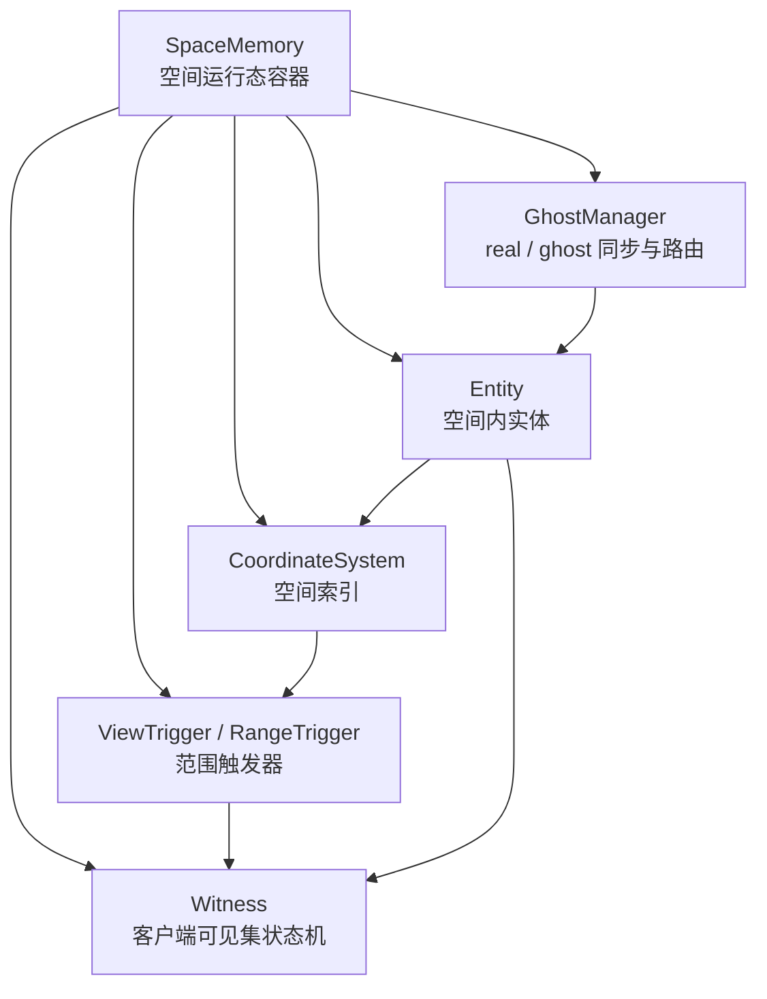
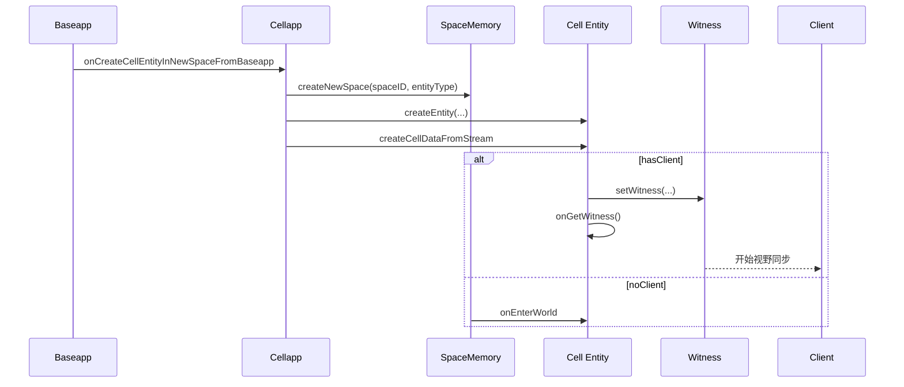
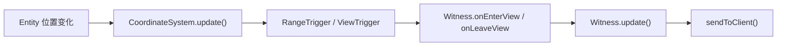
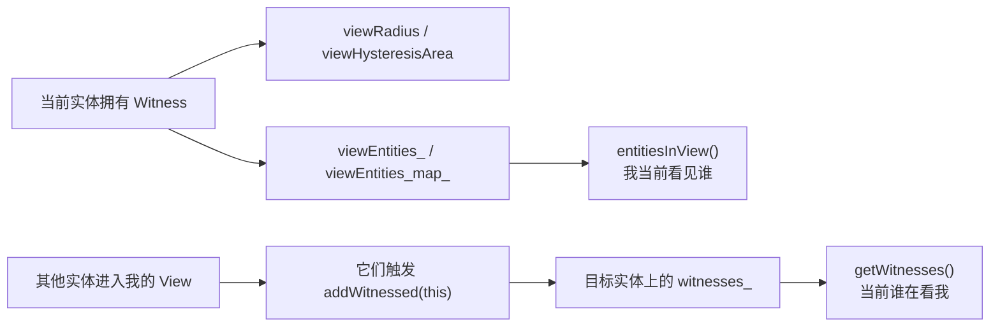
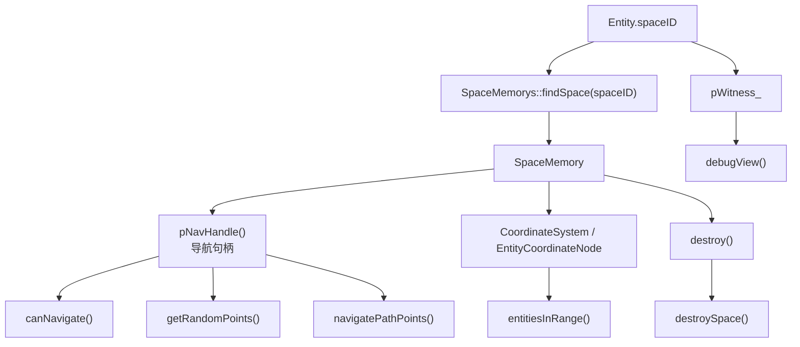
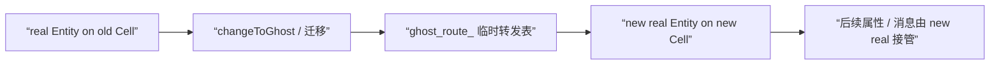
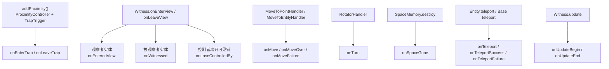
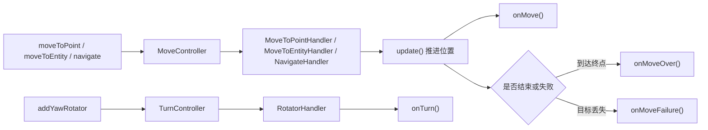

# 空间、AOI 与视野同步

> 这一页聚焦 KBEngine 里最像 BigWorld 的那部分实现：空间权威放在 Cell，客户端可见集由 Witness 决定，跨 Cell 边界靠 ghost 与临时路由把链路缝起来。

## 先建立空间层的骨架

源码里这部分不是一个单类系统，而是几个对象协作：

```text
SpaceMemory
  ├── CoordinateSystem
  ├── Entity
  ├── Witness
  ├── ViewTrigger / RangeTrigger
  └── GhostManager
```

如果只记一个结论，就是：

- `SpaceMemory` 管空间运行态
- `CoordinateSystem` 管空间内节点索引
- `Witness` 管“谁该被客户端看到”
- `GhostManager` 管跨 Cell 的 real / ghost 同步与迁移后路由



## Space 在 KBEngine 里不是抽象概念，而是 Cell 侧实体 + 运行态容器

最容易误解的一点是：`Space` 和 `SpaceMemory` 不是一个东西。

源码里可以看到：

- `kbe/src/server/cellapp/space.h`
- `kbe/src/server/cellapp/spacememory.h`

`Space` 本身继承自 `Entity`，它是脚本可见的空间实体；
而 `SpaceMemory` 才是运行时容器，内部真正持有：

- `CoordinateSystem`
- 空间内实体集合
- 空间几何与地图映射

因此在阅读源码时要区分：

- `Space` 更偏实体语义
- `SpaceMemory` 更偏运行态语义

## 空间创建的真实入口在 Cellapp

最值得直接跟的函数是：

- `kbe/src/server/cellapp/cellapp.cpp`
- `Cellapp::onCreateCellEntityInNewSpaceFromBaseapp`

这条链能把“Base 请求进空间”一次性看清：

1. 从消息流里读出 `entityType / entityID / spaceID / componentID / hasClient`
2. 调 `SpaceMemorys::createNewSpace(spaceID, entityType)`
3. 在该 Cell 上创建对应 `Entity`
4. 解析 Cell 数据流 `createCellDataFromStream`
5. 建立 `baseEntityCall`
6. 如果该实体有客户端，则提前准备 `clientEntityCall` 与 `Witness`
7. `space->addEntity(e)`
8. `e->initializeEntity(cellData, true)`
9. `space->addEntityToNode(e)`
10. 如果有客户端，调用 `e->onGetWitness()`

这条路径说明两个关键点：

- 空间不是先存在一个纯容器，再把实体挂进去；空间实体和空间运行态是联动建立的。
- 有客户端的实体在进入空间时，会提前补齐 Witness 相关结构，确保后续同步链能立即工作。



## CoordinateSystem：AOI 的底层索引不是网格，而是坐标轴链表

最关键的文件：

- `kbe/src/server/cellapp/coordinate_system.h`
- `kbe/src/server/cellapp/coordinate_system.cpp`
- `kbe/src/server/cellapp/coordinate_node.h`

从接口能看出它的设计非常明确：

- `insert()`
- `remove()`
- `update()`
- `moveNodeX() / moveNodeY() / moveNodeZ()`

这说明 KBEngine 的空间索引不是简单哈希桶，而是基于坐标轴排序节点的结构。

与 `RangeTrigger` 搭配使用时，这种结构的优势是：

- 实体移动时只需要在局部调整坐标节点
- 触发器边界经过节点时，可以直接判定“进入 / 离开范围”

所以 AOI 不是一个独立的大模块，而是 `CoordinateNode + CoordinateSystem + RangeTrigger` 的协作结果。

## RangeTrigger 决定“经过边界时发生什么”

关键文件：

- `kbe/src/server/cellapp/range_trigger.h`
- `kbe/src/server/cellapp/range_trigger.cpp`
- `kbe/src/server/cellapp/view_trigger.h`

`RangeTrigger` 做的是最底层的几何判定：

- 边界节点安装
- 节点穿越边界时的进入/离开判定
- X/Y/Z 三轴上的范围检测

你在源码里能看到它并不是每帧暴力扫描，而是利用边界节点与实体节点的相对移动来触发回调。

因此 AOI 触发的本质不是“定期计算一遍可见集”，而是“坐标更新时驱动边界事件”。

## Witness：客户端看到什么，由它决定

最该先读的文件：

- `kbe/src/server/cellapp/witness.h`
- `kbe/src/server/cellapp/witness.cpp`

`Witness` 内部有几组核心状态：

- `viewRadius_`
- `viewHysteresisArea_`
- `pViewTrigger_`
- `pViewHysteresisAreaTrigger_`
- `viewEntities_map_`

这说明它不是“简单可见集容器”，而是完整的观察者状态机。

从接口上看，最值得跟的是：

- `attach()`
- `onEnterSpace()`
- `onEnterView()`
- `onLeaveView()`
- `update()`
- `sendToClient()`

其中 `Witness::update()` 才是“把这一帧需要同步给客户端的东西真正发出去”的总入口。

所以：

- AOI 判定负责知道谁进入/离开范围
- Witness 负责把这些变化变成客户端协议消息和属性更新



## `onGetWitness()` 是空间同步真正开始的节点

在 `kbe/src/server/cellapp/entity.cpp` 中，`Entity::onGetWitness()` 是一个非常关键的转折点。

它不是单纯脚本钩子，而是：

- 创建或激活 Witness
- 让实体开始进入“可被客户端同步”的状态
- 再向脚本层触发 `onGetWitness`

因此“实体有客户端”和“实体已经开始同步给客户端”不是完全同一时刻；
真正切入客户端可见链的是 `onGetWitness()`。

<a id="cell-entity-witness-runtime-apis"></a>
## Cell 实体的 `setViewRadius()` / `entitiesInView()` / `getWitnesses()` 其实在读两套不同方向的状态

`cellapp/Entity` 里和 Witness 相关的几个 API 很容易被一句“查看视野”带过去，但源码里至少有两套方向相反的数据：

- `pWitness_->viewEntities_`：我这个观察者当前看见了谁。
- `Entity::witnesses_`：当前有哪些观察者正在看我。

如果不先把这两个方向拆开，就很容易把：

- `entitiesInView()` 误读成“谁在看我”
- `getWitnesses()` 误读成“我当前能看到谁”

先看总图：



### 第一层：`onGetWitness()` / `onLoseWitness()` 决定这组 API 是否可用

这些 API 不是实体天然就有的稳定能力，而是建立在当前实体已经拿到 `Witness` 之上。

`onGetWitness()` 里会创建或复用 `Witness`：

```cpp
// 文件：kbe/src/server/cellapp/entity.cpp
if(pWitness_ == NULL)
{
    setWitness(Witness::createPoolObject(OBJECTPOOL_POINT));
}
else
{
    pWitness_->onAttach(this);
    pWitness_->resetViewEntities();
}
```

而 `onLoseWitness()` 会把这一整套状态拆掉：

```cpp
// 文件：kbe/src/server/cellapp/entity.cpp
pWitness_->detach(this);
Witness::reclaimPoolObject(pWitness_);
pWitness_ = NULL;
```

所以对这些 Witness 运行态 API，最准确的前提判断是：

- **实体当前必须已经 `onGetWitness()`，且还没有 `onLoseWitness()`**

这也是为什么 `setViewRadius()` / `entitiesInView()` 都直接依赖 `pWitness_`，没有 `Witness` 就要报错或返回空状态。

### 第一层半：`isReal()` / `clientEntity()` / `onGetWitness()` / `onLoseWitness()` 其实是同一条 Witness 绑定链

这几个 API 如果分开看，很容易误解：

- `isReal()` 像是一个普通布尔判断
- `clientEntity()` 像是一个随时可用的客户端代理
- `onGetWitness()` / `onLoseWitness()` 像是两个轻量脚本回调

但源码里它们共同描述的是“当前 Cell 实体有没有建立起可用的客户端观察链”。

先看 `isReal()`：

```cpp
// 文件：kbe/src/server/cellapp/entity.inl
INLINE bool Entity::isReal(void) const
{
    return realCell_ == 0;
}
```

它判断的不是“是不是玩家”，也不是“有没有客户端”，而是：

- **当前这个 Cell 实体是不是本 Cell 上的权威 real**

这也是为什么 `clientEntity()`、`addProximity()`、`teleport()` 这些运行态 API 的 Python 包装层，都会先用 `isReal()` 拦住 ghost。

再看 `onGetWitness(true)` 的关键片段：

```cpp
// 文件：kbe/src/server/cellapp/entity.cpp
if(clientEntityCall() == NULL)
{
    PyObject* clientMB = PyObject_GetAttrString(baseEntityCall(), "client");
    EntityCall* client = static_cast<EntityCall*>(clientMB);
    clientEntityCall(client);
}

if(pWitness_ == NULL)
{
    setWitness(Witness::createPoolObject(OBJECTPOOL_POINT));
}
else
{
    pWitness_->onAttach(this);
    pWitness_->resetViewEntities();
}
```

这说明 `onGetWitness()` 并不只是“通知脚本拿到视野”：

- 它会重新接上 `clientEntityCall`
- 会创建或复用 `Witness`
- 会重置 `viewEntities`
- 最后才进入脚本层 `onGetWitness`

`onLoseWitness()` 则是反向拆链：

```cpp
// 文件：kbe/src/server/cellapp/entity.cpp
clientEntityCall()->addr(Network::Address::NONE);
Py_DECREF(clientEntityCall());
clientEntityCall(NULL);

pWitness_->detach(this);
Witness::reclaimPoolObject(pWitness_);
pWitness_ = NULL;
```

因此更准确的说法是：

- `onGetWitness()`：建立 `real -> clientEntityCall -> Witness -> 客户端同步` 这条链
- `onLoseWitness()`：拆掉这条链

`clientEntity(destID)` 则只是建立在这条链已经成立之后的脚本代理：

```cpp
// 文件：kbe/src/server/cellapp/entity.cpp
if(!isReal())
    PyErr_Format(..., "clientEntity: not is real entity");

if (entityID == id())
    PyErr_Format(..., "call your own method using entity.client");

return new ClientEntity(id(), entityID);
```

而 `ClientEntity::onScriptGetAttribute()` 还会继续验证目标是否真的已经在 view 内：

```cpp
// 文件：kbe/src/server/cellapp/client_entity.cpp
if(srcEntity->pWitness() == NULL)
    PyErr_Format(..., "clientEntity: no client");

EntityRef* pEntityRef = srcEntity->pWitness()->getViewEntityRef(clientEntityID_);
Entity* e = (pEntityRef && ((pEntityRef->flags() & ENTITYREF_FLAG_ENTER_CLIENT_PENDING) <= 0))
    ? pEntityRef->pEntity() : NULL;
```

所以 `clientEntity(entityID)` 的真实边界是：

- 当前实体必须是 real
- 当前实体必须已经有 Witness，也就是当前确实已经挂上客户端同步链
- 目标实体必须已经稳定进入当前 Witness 的 view，不能只是 pending
- 调自己客户端方法不该走 `clientEntity(self.id)`，而该走 `entity.client`

### 第二层：`setViewRadius()` 改的不是一个数字，而是两层 `ViewTrigger`

`Entity.setViewRadius()` 只是薄包装：

```cpp
// 文件：kbe/src/server/cellapp/entity.cpp
int32 Entity::setViewRadius(float radius, float hyst)
{
    if(pWitness_)
    {
        pWitness_->setViewRadius(radius, hyst);
        return 1;
    }

    PyErr_Format(PyExc_AssertionError, "%s::setViewRadius: did not get witness.", scriptName());
    return -1;
}
```

真正的逻辑在 `Witness::setViewRadius()`：

```cpp
// 文件：kbe/src/server/cellapp/witness.cpp
viewRadius_ = radius;
viewHysteresisArea_ = hyst;
...
if (pViewTrigger_ == NULL)
    pViewTrigger_ = new ViewTrigger(..., viewRadius_, viewRadius_);
else
    pViewTrigger_->update(viewRadius_, viewRadius_);

if (pViewHysteresisAreaTrigger_ == NULL)
    pViewHysteresisAreaTrigger_ = new ViewTrigger(..., viewHysteresisArea_ + viewRadius_, ...);
else
    pViewHysteresisAreaTrigger_->update(viewHysteresisArea_ + viewRadius_, ...);
```

这说明：

- `viewRadius` 是主视野半径。
- `viewHysteresisArea` 不是第二个独立视野，而是离开判断的滞后区。
- Witness 内部实际维护了 `pViewTrigger_` 和 `pViewHysteresisAreaTrigger_` 两层 trigger。

因此 `setViewRadius(radius, hyst)` 的真实语义更接近：

- 重新配置“进入视野”的半径
- 同时重新配置“离开视野”的滞后边界

不是只改一个用于脚本展示的 float。

### 第三层：为什么半径不能随便设很大

`Witness::setViewRadius()` 里还有一个很实际的边界：

```cpp
// 文件：kbe/src/server/cellapp/witness.cpp
if(viewRadius_ + viewHysteresisArea_ > 512)
{
    if (g_kbeSrvConfig.getCellApp().entity_posdir_updates_type > 0)
    {
        viewRadius_ = 512 - 5.0f;
        viewHysteresisArea_ = 5.0f;
        ERROR_MSG(...);
    }
}
```

原因不是主观约定，而是位置同步默认用了相对位置压缩编码，可用范围大致在 `-512 ~ 512`。  
所以这组 API 不能只从“AOI 多大”理解，还要同时看客户端位置同步协议的编码边界。

### 第四层：`entitiesInView()` 读的是我的 `viewEntities_`

`entitiesInView()` 要求当前实体是 real、未销毁、并且已经有 Witness：

```cpp
// 文件：kbe/src/server/cellapp/entity.cpp
if (!pWitness_)
{
    PyErr_Format(PyExc_AssertionError, "%s::entitiesInView: %d has no witness!\n", ...);
    return 0;
}
```

然后直接遍历 `pWitness_->viewEntities()`：

```cpp
// 文件：kbe/src/server/cellapp/entity.cpp
for(; iter != pWitness_->viewEntities().end(); ++iter)
{
    Entity* pEntity = (*iter)->pEntity();

    if(pEntity && (pending || (pEntity->flags() & ENTITYREF_FLAG_ENTER_CLIENT_PENDING) <= 0))
    {
        PyList_Append(pyList, pEntity);
    }
}
```

要注意这里的实现语义：

- `pending == false` 时，会过滤掉还没完成 enter-client 流程的对象。
- `pending == true` 时，连进入客户端待发状态的对象也会返回。

所以最准确的读法是：

- `entitiesInView(False)`：当前客户端稳定可见集。
- `entitiesInView(True)`：把还在进入同步流程里的待发送对象也算进来。

它回答的是“**我看见谁**”，不是“谁看见我”。

### 第五层：`getWitnesses()` 读的是别人的 Witness 反向投影

`getWitnesses()` 则完全是另一条方向。

它遍历的是当前实体自己的 `witnesses_` 列表：

```cpp
// 文件：kbe/src/server/cellapp/entity.cpp
std::list<ENTITY_ID>::iterator witer = witnesses_.begin();
for (; witer != witnesses_.end(); ++witer)
{
    Entity* pEntity = Cellapp::getSingleton().findEntity((*witer));
    ...
    if (!pEntity->pWitness()->entityInView(id()))
        continue;

    entities.push_back(pEntity);
}
```

这说明它的语义是：

- 找出那些正在观察当前实体的观察者实体
- 但还要再校验一次，对方的 `Witness.entityInView(id())` 必须确认当前实体已经稳定在对方 view 内

因此 `getWitnesses()` 返回的不是“历史上看过我的人”，也不是简单的 `witnesses_` 原始列表，而是：

- **当前仍然有效、客户端通道正常、且对方 view 中确实稳定包含我的观察者实体集合**

### 第六层：`entitiesInView()` 和 `getWitnesses()` 为什么不能互相替代

很多时候这两个列表会有重叠，但它们不是镜像关系。

例如：

- A 的 `entitiesInView()` 里可能有 B
- 但 B 的 `getWitnesses()` 不一定马上有 A

因为中间还隔着：

- `ENTITYREF_FLAG_ENTER_CLIENT_PENDING`
- `ENTITYREF_FLAG_LEAVE_CLIENT_PENDING`
- 客户端通道是否还有效
- `entityInView(id)` 的稳定状态判断

`Witness::entityInView()` 本身也明确过滤了 pending 状态：

```cpp
// 文件：kbe/src/server/cellapp/witness.inl
if(pEntityRef == NULL || pEntityRef->pEntity() == NULL || pEntityRef->flags() == ENTITYREF_FLAG_UNKONWN ||
    (pEntityRef->flags() & (ENTITYREF_FLAG_ENTER_CLIENT_PENDING | ENTITYREF_FLAG_LEAVE_CLIENT_PENDING)) > 0)
    return false;
```

所以更准确地说：

- `entitiesInView()` 偏“我的观察面”。
- `getWitnesses()` 偏“谁在通过客户端真正观察我”。

### 结论：这组 Witness 运行态 API 应该怎么读

| API | 更准确的语义 |
| --- | --- |
| `setViewRadius(radius, hyst)` | 重新配置当前实体 Witness 的主视野半径与滞后区，并更新两层 `ViewTrigger` |
| `getViewRadius()` | 读取当前 Witness 的主视野半径；没有 Witness 时返回 `0` |
| `getViewHystArea()` | 读取当前 Witness 的滞后区半径；没有 Witness 时返回 `0` |
| `entitiesInView(pending=False)` | 读取当前实体作为观察者时的 view 集；`pending=True` 会把待进入客户端的对象也包含进来 |
| `getWitnesses()` | 返回当前仍在有效观察该实体的观察者实体集合，不等于原始 `witnesses_` 列表 |
| `isReal()` | 判断当前 Cell 实体是不是本 Cell 上的权威 real，不等于“是否有客户端” |
| `onGetWitness()` | 建立 `clientEntityCall + Witness + view reset` 这条客户端观察链，然后才进入脚本回调 |
| `onLoseWitness()` | 拆掉 `clientEntityCall + Witness` 观察链，再进入脚本回调 |
| `clientEntity(entityID)` | 以当前 real 实体的 Witness 为视角，获取某个已稳定进入 view 的实体客户端方法代理 |

<a id="cell-entity-space-runtime-apis"></a>
## Cell 实体的 `entitiesInRange()` / `destroySpace()` / `debugView()` / `getRandomPoints()` / `canNavigate()` 是空间运行态查询，不是通用工具函数

这组 API 看起来都很“工具化”，但源码里它们都强依赖当前实体所在的 `SpaceMemory`、坐标系统或导航句柄。

更准确的分类是：

- `canNavigate()` / `getRandomPoints()`：导航网格能力与采样查询
- `entitiesInRange()`：坐标系统上的范围检索
- `destroySpace()`：当前空间的销毁入口
- `debugView()`：当前 Witness 状态的调试打印

先看整体关系：



### 第一层：`canNavigate()` 只是“当前空间有没有导航句柄”

`canNavigate()` 的实现很短：

```cpp
// 文件：kbe/src/server/cellapp/entity.cpp
bool Entity::canNavigate()
{
    if(spaceID() <= 0)
        return false;

    SpaceMemory* pSpace = SpaceMemorys::findSpace(spaceID());
    if(pSpace == NULL || !pSpace->isGood())
        return false;

    if(pSpace->pNavHandle() == NULL)
        return false;

    return true;
}
```

这说明它回答的问题不是：

- 这次寻路请求参数是否合法
- 当前目标点能不能走通

它只回答：

- **当前实体所在空间是否存在可用导航句柄**

所以 `canNavigate()` 更像一个“导航设施是否就绪”的布尔查询，而不是一次试探性寻路。

### 第二层：`getRandomPoints()` 和 `navigatePathPoints()` 都走同一个 navhandle

`getRandomPoints()` 和 `navigatePathPoints()` 的前置检查几乎一样：都先找当前 `SpaceMemory`，再拿 `pNavHandle()`。

`getRandomPoints()`：

```cpp
// 文件：kbe/src/server/cellapp/entity.cpp
NavigationHandlePtr pNavHandle = pSpace->pNavHandle();
if(!pNavHandle)
    return false;

return pNavHandle->findRandomPointAroundCircle(layer, centerPos, outPoints, maxPoints, maxRadius) > 0;
```

`navigatePathPoints()`：

```cpp
// 文件：kbe/src/server/cellapp/entity.cpp
NavigationHandlePtr pNavHandle = pSpace->pNavHandle();
...
if (pNavHandle->findStraightPath(layer, position_, destination, outPaths) < 0)
    return false;
```

这意味着：

- `getRandomPoints()` 不是纯数学意义上的圆内随机采样。
- 它采样的是**导航系统认为可落点的随机位置**。
- `navigate()` 之前那条“能不能算路径”的判断，和 `getRandomPoints()` 用的是同一层设施。

所以如果 `canNavigate()` 为 `false`，通常这两类 API 都不应被当作有效空间查询来依赖。

### 第三层：`entitiesInRange()` 不是扫整张 Space，而是基于坐标节点做轴向交集

脚本入口最终会落到：

```cpp
// 文件：kbe/src/server/cellapp/entity.cpp
EntityCoordinateNode::entitiesInRange(findentities, pobj->pEntityCoordinateNode(), originpos, radius, entityUType);
```

底层实现不是暴力遍历全部实体，而是分别在多个轴上找范围，再取交集：

```cpp
// 文件：kbe/src/server/cellapp/entity_coordinate_node.cpp
entitiesInAxisRange<CoordinateNodeWrapX>(entities_X, rootNode, originPos, radius, entityUType);
entitiesInAxisRange<CoordinateNodeWrapZ>(entities_Z, rootNode, originPos, radius, entityUType);
...
set_intersection(entities_X.begin(), entities_X.end(), entities_Z.begin(), entities_Z.end(), std::back_inserter(foundEntities));
```

如果启用了 Y 轴坐标系统，还会再加一层 Y 轴交集。

因此 `entitiesInRange()` 的真实语义更接近：

- 以当前实体的坐标节点为支点
- 在坐标系统上按半径做轴向候选裁剪
- 再做交集得到范围内实体

它不是：

- 当前 Witness 的可见集查询
- 当前客户端可见实体列表
- 整个空间上一次无条件全量遍历

### 第四层：`entitiesInRange()` 的中心点和类型过滤都可变

这个 API 还有两个很容易忽略的点：

1. 它不一定以当前实体位置为中心  
如果传了 `position` 参数，就会用外部传入的位置作为中心点。

2. 它可以按 `entityType` 先做类型过滤  
源码会先把字符串类型转成 `entityUType`，然后在范围查询时带进去。

所以它更接近：

- “以某个中心点，在当前实体所在坐标系统附近查一批候选实体”

而不是：

- “获取我周围所有对象”

### 第五层：`destroySpace()` 不是本地删对象，而是请求 `SpaceMemorys` 进入销毁流程

`Entity.destroySpace()` 很短：

```cpp
// 文件：kbe/src/server/cellapp/entity.cpp
void Entity::destroySpace()
{
    if(spaceID() == 0)
        return;

    SpaceMemorys::destroySpace(spaceID(), this->id());
}
```

真正做事的是 `SpaceMemorys::destroySpace()`：

```cpp
// 文件：kbe/src/server/cellapp/spacememorys.cpp
SpaceMemory* pSpace = SpaceMemorys::findSpace(spaceID);
...
if(!pSpace->destroy(entityID))
    return false;
```

再往下是 `SpaceMemory::destroy()`：

- 先把空间状态切到 destroying
- 对还在空间中的 real 实体先触发 `onSpaceGone()`
- 再销毁或移除这些实体
- 最后清理 ghost

所以 `destroySpace()` 的语义不是：

- 立刻把当前脚本对象从内存里删掉
- 只销毁 Space 实体自己

而是：

- **以当前实体所在 `spaceID` 为目标，启动整个 `SpaceMemory` 的销毁流程**

### 第六层：为什么 `destroySpace()` 要求 real 且基本没被销毁

Python 包装层有显式检查：

```cpp
// 文件：kbe/src/server/cellapp/entity.cpp
if(!isReal())
    PyErr_Format(..., "destroySpace: not is real entity");

if (!hasFlags(ENTITY_FLAGS_DESTROYING) && this->isDestroyed())
    PyErr_Format(..., "destroySpace: %d is destroyed!");
```

这说明它不希望被：

- ghost 实体
- 已经完成销毁的悬挂对象

拿来当空间生命周期入口。

本质上它是一个**空间权威侧操作**。

### 第七层：`debugView()` 不是返回数据，而是把 Witness 内部状态打印出来

`debugView()` 的行为很直接：它调用 `pyPrint`，不是返回结构化对象。

```cpp
// 文件：kbe/src/server/cellapp/entity.cpp
Cellapp::getSingleton().getScript().pyPrint(fmt::format("{}::debugView: {} size={}, Seen={}, Pending={}, viewRadius={}, viewHyst={}", ...));
```

随后还会把每个 view entity 的状态逐条打印：

```cpp
// 文件：kbe/src/server/cellapp/entity.cpp
Cellapp::getSingleton().getScript().pyPrint(fmt::format("{7}::debugView: {0} {1}({2}), position({3}.{4}.{5}), dist={6}, Seen={8}", ...));
```

因此它更准确的定位是：

- 当前 Cell 实体 Witness 状态的现场调试输出

不是：

- 用于脚本逻辑消费的数据接口
- `entitiesInView()` 的替代品

### 第八层：`debugView()` 里的 `Seen` 和 `Pending` 正好能解释 `entitiesInView(pending=...)`

`debugView()` 会统计：

- `Seen`：已稳定进入客户端 view 的数量
- `Pending`：仍处于 `ENTITYREF_FLAG_ENTER_CLIENT_PENDING` 的数量

这正好和前面的 `entitiesInView(pending=False/True)` 对上：

- `pending=False` 更接近 `Seen`
- `pending=True` 更接近 `Seen + Pending`

所以如果你在排查“为什么实体还没出现在客户端，但服务端已经知道它会进入 view”，`debugView()` 会比单看 `entitiesInView(False)` 更直观。

### 结论：这组空间运行态 API 应该怎么读

| API | 更准确的语义 |
| --- | --- |
| `canNavigate()` | 当前实体所在空间是否具备可用导航句柄 |
| `getRandomPoints(centerPos, maxRadius, maxPoints, layer)` | 基于当前空间导航句柄，在给定中心附近采样可导航随机点 |
| `entitiesInRange(radius, entityType=None, position=None)` | 基于当前实体坐标节点和坐标系统做的范围查询，可选类型过滤和中心点覆盖 |
| `destroySpace()` | 以当前实体所在 `spaceID` 为目标，启动整个 `SpaceMemory` 的销毁流程 |
| `debugView()` | 把当前 Witness 的 view 集、pending 状态和距离信息打印到脚本输出，不返回结构化查询结果 |

<a id="cell-entity-destroy-lifecycle"></a>
## Cell 实体的 `destroy()` / `onDestroy()` 不是简单删除对象，而是空间摘除、视野拆链和 Base 通知的收束点

这一组接口如果只看 API 页，很容易理解成“调用 `destroy()`，然后脚本收到 `onDestroy()`”。  
源码里实际做的事情更重，因为 Cell 实体销毁时必须同时收束：

- 当前移动/转向控制器
- 当前 `Witness`
- 当前空间中的坐标节点与实体索引
- Base 侧的 Cell 存在状态
- 其他实体仍持有的 witnessed 关系

先看脚本入口：

```cpp
// 文件：kbe/src/server/cellapp/entity.cpp
if(pobj->initing())
    PyErr_Format(..., "destroy(): initing, reject the request!");
else if (pobj->isDestroyed())
    PyErr_Format(..., "destroy: is destroyed!");

pobj->destroyEntity();
```

Python 层本身并没有复杂参数，它只负责：

- 拒绝初始化中的实体
- 拒绝已经销毁的实体
- 把真正的收束工作交给 `destroyEntity()`

真正的关键逻辑在 `onDestroy(bool callScript)`：

```cpp
// 文件：kbe/src/server/cellapp/entity.cpp
if(callScript && isReal())
{
    CALL_ENTITY_AND_COMPONENTS_METHOD(..., "onDestroy", ...);

    if(baseEntityCall_ != NULL)
    {
        this->backupCellData();
        (*pBundle).newMessage(BaseappInterface::onLoseCell);
        (*pBundle) << id_;
        baseEntityCall_->sendCall(pBundle);
    }
}

stopMove();
S_RELEASE(controlledBy_);

if(pWitness_)
{
    pWitness_->detach(this);
    Witness::reclaimPoolObject(pWitness_);
    pWitness_ = NULL;
}

SpaceMemory* space = SpaceMemorys::findSpace(this->spaceID());
if(space)
    space->removeEntity(this);
```

### 第一层：`onDestroy()` 只在 real 且允许脚本通知时进入脚本

这里有两个显式条件：

- `callScript`
- `isReal()`

源码注释已经说明，`callScript=false` 常见于迁移或 teleport 过程中的内部销毁。  
所以不能把 `onDestroy()` 理解成“任何 Cell 实体离开内存都一定会回调脚本”。

### 第二层：有 Base 时，Cell 销毁前会先备份 Cell 数据并通知 `onLoseCell`

```cpp
// 文件：kbe/src/server/cellapp/entity.cpp
this->backupCellData();
(*pBundle).newMessage(BaseappInterface::onLoseCell);
```

这说明 Cell 侧销毁不是纯本地行为。  
如果这个实体还有 Base 部分，销毁前会先把 Cell 权威态收束给 Base，再告诉 Base：

- 这个实体失去 Cell 了

因此 `destroy()` 是 `Base <-> Cell` 生命周期边界的一部分。

### 第三层：销毁时会先停控制器，再拆 Witness，再从空间里摘掉

顺序也很关键：

1. `stopMove()` 清掉移动和转向控制器
2. 释放 `controlledBy_`
3. 如果有 `Witness`，先 `detach` 并回收
4. 再从 `SpaceMemory` 里 `removeEntity(this)`

这说明 `destroy()` 的真实语义不是简单打标记，而是：

- **把这个实体从当前 Cell 运行态结构里完整摘掉**

### 第四层：`witnesses_count_` 非零被视为异常，需要反向清理 view 链

`onDestroy()` 后半段还有一个很重要的兜底：

```cpp
// 文件：kbe/src/server/cellapp/entity.cpp
if (witnesses_count_ > 0)
{
    ...
    ent->pWitness()->_onLeaveView((*view_iter));
    ...
    ent->delWitnessed(this);
}
```

这代表：

- 正常情况下，实体销毁前不应该还被别的 Witness 持续观察
- 如果还有，源码会把它当成 view 链异常，并主动补做 leave 清理

所以 `destroy()` 还承担一个职责：

- 收拾异常残留的 AOI / Witness 关系

### 第五层：迁移成功后的旧 Cell 销毁通常不会再触发脚本 `onDestroy()`

跨 Cell 传送成功回包后，旧 Cell 会：

```cpp
// 文件：kbe/src/server/cellapp/cellapp.cpp
destroyEntity(teleportEntityID, false);
```

这里显式传了 `false`，正好对应 `onDestroy(bool callScript)` 的第一层条件。  
所以迁移成功时，旧 Cell 上那次销毁通常是内部收束，不是业务脚本生命周期事件。

### 结论：这组销毁 API 应该怎么读

| API | 更准确的语义 |
| --- | --- |
| `destroy()` | 发起当前 Cell 实体的完整摘除流程，包含控制器、Witness、空间索引和 Base 通知收束 |
| `onDestroy()` | 只在 real 且允许脚本通知时触发的销毁回调，不覆盖迁移/teleport 等内部销毁场景 |

<a id="cell-entity-controller-component-apis"></a>
## Cell 实体的 `accelerate()` / `getComponent()` 分别属于控制器调速和组件描述系统

这两个 API 看起来不相干，源码里也确实来自两套完全不同的基础设施：

- `accelerate()` 属于移动/转向控制器链的运行态调速接口
- `getComponent()` 属于实体组件系统在脚本层注入的通用查找接口

把它们放在一起讲，只是因为它们是 `cellapp/Entity` 当前最后一批容易被忽略、但又不是独立大专题的运行态接口。

### 第一层：`accelerate()` 不会创建控制器，它只改当前速度

`accelerate()` 的实现很直接：

```cpp
// 文件：kbe/src/server/cellapp/entity.cpp
float Entity::accelerate(const char* type, float acceleration)
{
    acceleration = acceleration / g_kbeSrvConfig.gameUpdateHertz();

    if (strcmp(type, "Movement") == 0)
    {
        MoveController* pMoveController = static_cast<MoveController*>(pMoveController_.get());
        if (pMoveController != NULL)
        {
            float velocity = pMoveController->velocity() + acceleration;
            pMoveController->velocity(velocity);
            return velocity * g_kbeSrvConfig.gameUpdateHertz();
        }
    }
    else if (strcmp(type, "Turn") == 0)
    {
        TurnController* pTurnController = static_cast<TurnController*>(pTurnController_.get());
        ...
    }
}
```

### 第一层半：`addYawRotator()` 返回的是控制器 ID，而且会先打断当前移动链

`addYawRotator()` 不是“附加一个轻量旋转任务”，它和移动控制器共享同一个停止入口：

```cpp
// 文件：kbe/src/server/cellapp/entity.cpp
uint32 Entity::addYawRotator(float yaw, float velocity, PyObject* userData)
{
    stopMove();

    velocity = velocity / g_kbeSrvConfig.gameUpdateHertz();
    KBEShared_ptr<Controller> p(new TurnController(this, NULL));
    ...
    pTurnController_ = p;
    return p->id();
}
```

这里有三个直接可见的边界：

- 它会先 `stopMove()`，所以会打断当前移动控制器
- `velocity` 会先按 `gameUpdateHertz` 折算成每 tick 速度
- 返回值不是布尔，而是新建 `TurnController` 的 `controllerID`

因此 `addYawRotator(targetYaw, velocity, userArg)` 的脚本语义更接近：

- 创建一条新的“朝目标 yaw 转向”的控制器链
- 返回这条链的控制器 ID，供 `cancelController()` 或 `onTurn(controllerID, userArg)` 对应

这说明它做的不是：

- 启动一段新的移动
- 替你创建 `MoveController` / `TurnController`
- 对任意实体速度属性做永久修改

它做的是：

- 把外部传入的加速度先按 `gameUpdateHertz` 转成每 tick 增量
- 如果当前已经存在 `Movement` 或 `Turn` 控制器，就直接改这个控制器的速度
- 返回调整后的速度值（再乘回 `gameUpdateHertz`，也就是脚本层看到的仍是秒级速度）

所以最准确的理解是：

- **`accelerate()` 是对当前活动控制器速度的增量修正接口**

如果当前没有对应控制器，它不会报错，但也不会凭空生效，最后会返回 `0.0f`。

### 第二层：`accelerate()` 只认 `"Movement"` 和 `"Turn"`

源码里支持的类型是写死的：

```cpp
// 文件：kbe/src/server/cellapp/entity.cpp
if (strcmp(type, "Movement") == 0) ...
else if (strcmp(type, "Turn") == 0) ...
else
{
    PyErr_Format(PyExc_AssertionError, "%s::accelerate: %d type error! only support[\"Movement\",\"Turn\"]\n", ...);
}
```

因此它不是：

- 通用控制器调速 API
- 可以对 proximity 等其它 controller 生效的统一入口

它只服务于前面已经讲过的那条移动/转向控制器链。

### 第三层：`getComponent()` 不是 `cellapp/entity.cpp` 手写函数，而是组件系统统一注入的

`cellapp/Entity` 自己的 `SCRIPT_METHOD_DECLARE` 里你看不到 `getComponent()`，因为它不是在这个文件里单独手写的，而是由实体宏统一注入。

关键代码在：

```cpp
// 文件：kbe/src/lib/entitydef/entity_macro.h
PyObject* pyGetComponent(const std::string& componentName, bool all)
{
    std::vector<EntityComponent*> founds =
        EntityComponent::getComponents(componentName, this, pScriptModule_);

    if (!all)
    {
        if(founds.size() > 0)
            return founds[0];

        Py_RETURN_NONE;
    }
    else
    {
        PyObject* pyObj = PyTuple_New(founds.size());
        ...
        return pyObj;
    }
}
```

也就是说：

- `getComponent()` 是实体脚本基类能力的一部分
- 它不是 `CellApp` 独有实现
- Base/Cell/Client 这些面向脚本的实体类型，底层都走同一套组件查找模式，只是过滤条件不同

### 第四层：组件查找的关键不在名字，而在组件描述和运行侧可见性

真正的查找逻辑在 `EntityComponent::getComponents()`：

```cpp
// 文件：kbe/src/lib/entitydef/entity_component.cpp
ScriptDefModule::COMPONENTDESCRIPTION_MAP& componentDescrs = pEntityScriptDescrs->getComponentDescrs();
...
if (name != comps_iter->second->getName())
    continue;

if (g_componentType == BASEAPP_TYPE)
{
    if (!comps_iter->second->hasBase())
        continue;
}
else if (g_componentType == CELLAPP_TYPE)
{
    if (!comps_iter->second->hasCell())
        continue;
}
else
{
    if (!comps_iter->second->hasClient())
        continue;
}

PyObject* pyObj = PyObject_GetAttrString(pEntity, comps_iter->first.c_str());
```

这段代码说明了几个很重要的事实：

1. `componentName` 比较的是组件描述名 `getName()`，不是任意字符串模糊匹配。
2. 同一个组件定义，不一定在 Base/Cell/Client 三侧都可见。
3. 最终返回的不是新建组件，而是从实体现有属性上取出的组件对象。

所以 `getComponent()` 更准确的语义是：

- **按组件描述名，在当前运行侧允许暴露的组件属性里查找已经绑定到实体上的组件对象**

### 第五层：为什么 `all=False` 和 `all=True` 的返回语义不同

宏里的返回规则是：

- `all=False`：返回第一个匹配组件；没有则返回 `None`
- `all=True`：返回一个 tuple，即使为空也返回空 tuple

这意味着脚本层对它的使用姿势应该区分：

- 想拿单个组件时，把它当“可空对象”处理
- 想拿同名组件集合时，把它当“结果列表/元组”处理

这不是一个始终返回 list 的接口。

### 第六层：客户端 SDK 生成代码也沿用了同样的组件查找语义

这条设计不是只存在于服务端脚本层，客户端 SDK 生成器也在做同样的事。

Unity 生成器会生成：

```csharp
// 文件：kbe/src/server/tools/kbcmd/client_sdk_unity.cpp 生成逻辑
public override List<EntityComponent> getComponents(string componentName, bool all)
{
    List<EntityComponent> founds = new List<EntityComponent>();
    ...
}
```

UE4 生成器也会生成对应的 `getComponents` 实现。

这说明组件访问的设计意图是统一的：

- 组件不是通过反射扫描任意对象得来
- 而是通过 `.def` 已声明的组件属性，在各侧生成或注入一致的访问入口

### 结论：这两个 API 应该怎么读

| API | 更准确的语义 |
| --- | --- |
| `accelerate(type, acceleration)` | 对当前已存在的 `Movement` 或 `Turn` 控制器做速度增量调整，不会创建新控制器 |
| `getComponent(componentName, all)` | 按组件描述名，从当前运行侧允许暴露的实体组件属性中查找已绑定组件；`all=False` 返回单个或 `None`，`all=True` 返回 tuple |

<a id="proxy-give-client-to"></a>
## `Proxy.giveClientTo()` 转移的其实是客户端绑定与 Witness 链路

`giveClientTo()` 如果只看名字，很容易被理解成“把客户端控制权字段改到另一个 Proxy”。

源码实际做的事情比这大得多，它切换的是一整条链路：

```text
旧 Proxy
  ├── clientEntityCall / Network::Channel
  ├── Client 上的旧代理实体
  └── Cell 上的 Witness / controlledBy

            ↓ giveClientTo()

新 Proxy
  ├── 接手同一条客户端通道
  ├── 重新向客户端创建新的代理实体
  └── 若已有 cell，再重建 Witness 与控制关系
```

### 第一层：Base 层会先做一轮严格前置校验

直接看 `kbe/src/server/baseapp/proxy.cpp`：

```cpp
// 文件：kbe/src/server/baseapp/proxy.cpp
void Proxy::giveClientTo(Proxy* proxy)
{
    if(isDestroyed()) ...
    if(clientEntityCall_ == NULL || clientEntityCall_->getChannel() == NULL) ...

    if(proxy)
    {
        if(proxy->isDestroyed()) ...
        if(proxy->id() == this->id()) ...
        if(proxy->clientEntityCall() != NULL) ...
        ...
    }
}
```

这里能直接得出几个实际限制：

- 当前 Proxy 必须活着，而且已经绑定客户端通道
- 目标 Proxy 不能销毁、不能是自己、不能已经绑定客户端
- Python 包装层虽然允许把 `None` 传进来，但 `giveClientTo(NULL)` 不会继续执行任何迁移逻辑，实际使用必须传有效目标 Proxy

### 第二层：旧 Proxy 会先拆掉旧的客户端表现链

真正进入迁移分支后，旧 Proxy 首先做的是“拆链”：

```cpp
// 文件：kbe/src/server/baseapp/proxy.cpp
if(cellEntityCall())
{
    (*pBundle).newMessage(CellappInterface::onLoseWitness);
    (*pBundle) << this->id();
    sendToCellapp(pBundle);
}

(*pBundle).newMessage(ClientInterface::onEntityDestroyed);
(*pBundle) << this->id();
sendToClient(ClientInterface::onEntityDestroyed, pBundle);
```

这两步非常关键：

- 如果旧 Proxy 已经有 cell，会先通知 Cell 侧丢失 Witness
- 客户端会先收到 `onEntityDestroyed`，把旧的受控代理实体销毁

也就是说，`giveClientTo()` 不是“让客户端同时拥有两个主 Proxy”，而是明确先清掉旧链路，再接新链路。

### 第三层：客户端通道本身会被交给新 Proxy

后续还是在 `proxy.cpp`：

```cpp
// 文件：kbe/src/server/baseapp/proxy.cpp
Network::Channel* lpChannel = clientEntityCall_->getChannel();

clientEnabled_ = false;
clientEntityCall()->addr(Network::Address::NONE);
Py_DECREF(clientEntityCall());
proxy->setClientType(this->getClientType());
proxy->setLoginDatas(this->getLoginDatas());
this->setClientType(UNKNOWN_CLIENT_COMPONENT_TYPE);
this->setLoginDatas("");
clientEntityCall(NULL);
proxy->onGiveClientTo(lpChannel);
```

这里转移的不是抽象概念，而是同一条真实客户端通道 `lpChannel`。

同时还能看到：

- 客户端类型和登录附带数据会一起迁移到目标 Proxy
- 旧 Proxy 会失去 `clientEntityCall`
- 目标 Proxy 通过 `onGiveClientTo(lpChannel)` 接手这条通道

### 第四层：新 Proxy 会重新创建客户端代理实体

`onGiveClientTo()` 的实现很短，但非常关键：

```cpp
// 文件：kbe/src/server/baseapp/proxy.cpp
void Proxy::onGiveClientTo(Network::Channel* lpChannel)
{
    clientEntityCall(new EntityCall(this->pScriptModule_,
        &lpChannel->addr(), 0, id_, ENTITYCALL_TYPE_CLIENT));

    addr(lpChannel->addr());
    Baseapp::getSingleton().createClientProxies(this);
    onGetWitness();
}
```

而 `createClientProxies()` 会重新把当前 Proxy 注册为该通道的代理实体，并重新下发 `onCreatedProxies`：

```cpp
// 文件：kbe/src/server/baseapp/baseapp.cpp
bool Baseapp::createClientProxies(Proxy* pEntity, bool reload)
{
    Network::Channel* pChannel = pEntity->clientEntityCall()->getChannel();
    pChannel->proxyID(pEntity->id());
    ...
    (*pBundle).newMessage(ClientInterface::onCreatedProxies);
    (*pBundle) << pEntity->rndUUID();
    (*pBundle) << pEntity->id();
    (*pBundle) << pEntity->ob_type->tp_name;
    pEntity->sendToClient(ClientInterface::onCreatedProxies, pBundle);

    pEntity->onClientEnabled();
}
```

所以 `giveClientTo()` 成功后，目标 Proxy 一侧通常会发生两件可见事情：

- 客户端重新收到一条 `onCreatedProxies`
- 目标 Proxy 的 `onClientEnabled()` 也会再次触发

### 第五层：如果目标 Proxy 已经有 cell，Cell 侧还会补一轮 Witness 与控制恢复

`Proxy::onGetWitness()` 并不是无条件成功，它只在目标 Proxy 已经有 `cellEntityCall()` 时继续往 Cell 侧发消息：

```cpp
// 文件：kbe/src/server/baseapp/proxy.cpp
void Proxy::onGetWitness()
{
    if(cellEntityCall())
    {
        (*pBundle).newMessage(CellappInterface::onGetWitnessFromBase);
        (*pBundle) << this->id();
        sendToCellapp(pBundle);
    }
}
```

Cell 侧接到 `onGetWitnessFromBase` 后，会走到 `Entity::onGetWitness(true)`：

```cpp
// 文件：kbe/src/server/cellapp/entity.cpp
void Entity::onGetWitness(bool fromBase)
{
    ...
    if(fromBase)
    {
        if(clientEntityCall() == NULL)
        {
            PyObject* clientMB = PyObject_GetAttrString(baseEntityCall(), "client");
            ...
            clientEntityCall(client);
        }

        ... // 向客户端补发 spaceID 与客户端属性

        if(pWitness_ == NULL)
            setWitness(Witness::createPoolObject(OBJECTPOOL_POINT));
        else
            pWitness_->resetViewEntities();
    }

    controlledBy(baseEntityCall());
}
```

这里说明 `giveClientTo()` 成功后，若目标已经有 cell：

- Cell 会重新把 `clientEntityCall` 接回来
- 会向客户端补发当前空间与客户端属性
- 会新建或复用 Witness，并重置视野同步状态
- 最后把 `controlledBy` 重新绑到目标 Proxy 自己的 `baseEntityCall`

### 结论：应该怎样准确理解 `giveClientTo()`

最准确的说法是：

- **它把一个客户端连接从旧 Proxy 迁移到新 Proxy**
- **迁移过程同时会拆旧的客户端实体/Witness 链路，再重建新的 Base/Cell 同步链路**
- **如果目标 Proxy 还没有 cell，这次迁移先完成的是 Base 侧客户端绑定；Cell 侧视野与控制恢复要等目标后续拿到 cell**

所以它不是“把两个 Proxy 的业务状态合并”，也不是“简单改一下控制者字段”，而是一个完整的客户端归属切换入口。

## 视野同步不是一次性快照，而是持续更新

这也是很多人第一次读会误会的地方。

`Witness` 的职责不是“创建时把周围实体发一遍就结束”，而是持续维护：

- 当前 view 内有哪些实体
- 各实体当前 detailLevel
- 哪些属性发生过变化
- 哪些消息该在这一帧推给客户端

所以视野同步是长期运行的增量机制，而不是“进入场景时的一次初始化包”。

## ghost：跨 Cell 边界时不能直接断链，所以需要副本

> 关于 ghost 系统的详细机制（real/ghost 状态转换、GhostManager 消息缓冲、ghost 路由等），请参阅 [[17-ghost-system]]。
> 这里只从空间/AOI角度补充 ghost 在空间同步中的作用。

关键文件：

- `kbe/src/server/cellapp/ghost_manager.h`
- `kbe/src/server/cellapp/ghost_manager.cpp`
- `kbe/src/server/cellapp/entity.cpp`

从空间同步角度看，`GhostManager` 的核心职责是：

- real 向 ghost 的同步（确保其他 Cell 上的副本能看到本 Cell 实体的最新状态）
- 实体迁移期间的临时消息路由（确保跨 Cell 传送时消息不丢失）

核心成员非常说明问题：

- `realEntities_`：当前 Cell 上所有 real 实体的 ghost 副本列表
- `ghost_route_`：迁移期间的临时转发表
- `messages_`：待同步的消息队列

这意味着 ghost 不只是”远端副本”，还是跨 Cell 迁移时保持消息连续性的缓冲层。



<a id="cell-entity-move-controllers"></a>
## Cell 实体的 `moveToPoint()` / `navigate()` / `cancelController()` 共享同一套控制器链

CellApp API 里的移动接口很容易被看成三个彼此独立的方法：

- `moveToPoint()` 负责直线移动
- `navigate()` 负责寻路移动
- `cancelController()` 负责删某个控制器

源码实际把它们串成了一条统一控制链。

### 第一层：移动前都会先执行 `stopMove()`，所以同一时刻只有一条移动链

入口在：

- `kbe/src/server/cellapp/entity.cpp`

```cpp
// 文件：kbe/src/server/cellapp/entity.cpp
bool Entity::stopMove()
{
    if(pMoveController_)
    {
        cancelController(pMoveController_->id());
        pMoveController_->destroy();
        pMoveController_.reset();
    }

    if(pTurnController_)
    {
        cancelController(pTurnController_->id());
        pTurnController_->destroy();
        pTurnController_.reset();
    }
}
```

而 `moveToPoint()` / `navigate()` 都先调用它：

```cpp
// 文件：kbe/src/server/cellapp/entity.cpp
uint32 Entity::moveToPoint(...)
{
    stopMove();
    ...
}

uint32 Entity::navigate(...)
{
    ...
    stopMove();
    ...
}
```

这说明：

- 新的移动请求会先清掉当前移动控制器
- 同时也会清掉当前转向控制器
- 这不是“允许多个 Movement controller 并存，再按优先级调度”的模型

### 第二层：`moveToPoint()` 和 `navigate()` 共享同一个 `MoveController`

`moveToPoint()` 的创建链：

```cpp
// 文件：kbe/src/server/cellapp/entity.cpp
KBEShared_ptr<Controller> p(new MoveController(this, NULL));
new MoveToPointHandler(p, layer(), destination, velocity, distance, faceMovement, moveVertically, userData);
...
pMoveController_ = p;
```

`navigate()` 的创建链：

```cpp
// 文件：kbe/src/server/cellapp/entity.cpp
KBEShared_ptr<Controller> p(new MoveController(this, NULL));
new NavigateHandler(p, destination, velocity, distance, faceMovement, maxMoveDistance, paths_ptr, userData);
...
pMoveController_ = p;
```

`MoveController` 本身再决定挂的是哪种 handler：

```cpp
// 文件：kbe/src/server/cellapp/move_controller.cpp
if(utype == MoveToPointHandler::MOVE_TYPE_NAV)
    pMoveToPointHandler_ = new NavigateHandler();
else if(utype == MoveToPointHandler::MOVE_TYPE_ENTITY)
    pMoveToPointHandler_ = new MoveToEntityHandler();
else if(utype == MoveToPointHandler::MOVE_TYPE_POINT)
    pMoveToPointHandler_ = new MoveToPointHandler();
```

所以更准确的理解是：

- `MoveController` 是统一的“移动控制器壳”
- `moveToPoint()` / `navigate()` / `moveToEntity()` 的区别，主要落在内部 handler 类型不同

### 第三层：`navigate()` 不是直接开跑，而是先算路径，算不出来就返回 `0`

`navigate()` 先走 `navigatePathPoints()`：

```cpp
// 文件：kbe/src/server/cellapp/entity.cpp
VECTOR_POS3D_PTR paths_ptr(new std::vector<Position3D>());
navigatePathPoints(*paths_ptr, destination, maxSearchDistance, layer);
if (paths_ptr->size() <= 0)
{
    return 0;
}
```

而 `navigatePathPoints()` 会去当前空间的导航句柄上算路径：

```cpp
// 文件：kbe/src/server/cellapp/entity.cpp
NavigationHandlePtr pNavHandle = pSpace->pNavHandle();
...
if (pNavHandle->findStraightPath(layer, position_, destination, outPaths) < 0)
{
    return false;
}
```

这说明 `navigate()` 的真实边界是：

- 当前实体必须已经有有效 `space`
- 该空间必须已经挂上导航句柄
- 路径点为空时，它不会创建任何控制器，而是直接返回 `0`

### 第四层：`NavigateHandler` 本质上是“多段 MoveToPoint”

`NavigateHandler` 直接继承 `MoveToPointHandler`：

```cpp
// 文件：kbe/src/server/cellapp/navigate_handler.cpp
NavigateHandler::NavigateHandler(...)
    : MoveToPointHandler(...),
      destPosIdx_(0),
      paths_(paths_ptr)
{
    destPos_ = (*paths_)[destPosIdx_++];
}
```

走到一个路径点后，它不会立刻结束，而是切到下一个路径点：

```cpp
// 文件：kbe/src/server/cellapp/navigate_handler.cpp
bool NavigateHandler::requestMoveOver(const Position3D& oldPos)
{
    if(destPosIdx_ == ((int)paths_->size()))
        return MoveToPointHandler::requestMoveOver(oldPos);
    else
        destPos_ = (*paths_)[destPosIdx_++];
}
```

所以 `navigate()` 更准确地说是：

- 先算一组路径点
- 再让同一套移动控制器沿这些路径点逐段推进

它不是另一套完全独立于 `moveToPoint()` 的运动系统。

### 第五层：`cancelController()` 对移动控制器有一层特殊语义

脚本入口里有一段很关键的特殊处理：

```cpp
// 文件：kbe/src/server/cellapp/entity.cpp
if(PyUnicode_Check(pyargobj))
{
    if (strcmp(PyUnicode_AsUTF8AndSize(pyargobj, NULL), "Movement") == 0)
    {
        pobj->stopMove();
    }
}
...
if ((pobj->pMoveController_ && pobj->pMoveController_->id() == id) ||
    (pobj->pTurnController_ && pobj->pTurnController_->id() == id))
{
    pobj->stopMove();
}
else
{
    pobj->cancelController(id);
}
```

这说明：

- 传 `"Movement"` 时，不是删某一个对象，而是直接停整条当前移动/转向链
- 就算你传的是当前 `pMoveController_` 或 `pTurnController_` 的数值 ID，底层也会统一走 `stopMove()`
- 只有其它控制器（例如 proximity 一类）才会走通用的 `pControllers_->remove(id)`

所以 API 文档里如果只写“按 ID 删除控制器”，是不够准确的。

### 第六层：移动控制器本身也参与实体迁移/恢复

> 关于实体迁移时的完整序列化/恢复机制（包括事件、timer、callback等），请参阅 [[events#Cell 迁移时为什么事件还能恢复]]。

Cell 实体在序列化时会把控制器一并写入流，这是迁移恢复的一部分：

```cpp
// 文件：kbe/src/server/cellapp/entity.cpp
void Entity::addControllersToStream(KBEngine::MemoryStream& s)
{
    if(pControllers_)
    {
        // 必须先清理移动相关的Controllers
        stopMove();
        pControllers_->addToStream(s);
    }
}
```

恢复时再重建：

```cpp
// 文件：kbe/src/server/cellapp/entity.cpp
void Entity::createControllersFromStream(KBEngine::MemoryStream& s)
{
    ...
    pControllers_->createFromStream(s);
}
```

这说明移动/控制器语义不是一次性的脚本辅助对象，而是 Cell 实体运行时的一部分状态，和 timer、event、callback 一样参与迁移恢复。

<a id="cell-entity-callback-trigger-matrix"></a>
## Cell Entity 回调触发点矩阵

`cellapp/Entity` 里有一组 `onXXX` 回调看起来像“生命周期事件”，但源码里它们不是同一条生命周期链，而是来自几套不同的运行态机制。

最容易混淆的点是：

- `onEnterTrap()` / `onLeaveTrap()` 来自 Proximity 控制器，不来自 Witness 可见集。
- `onEnteredView()` 触发在“观察者”实体上，而 `onWitnessed()` 触发在“被观察者”实体上。
- `onMove()` / `onMoveOver()` / `onMoveFailure()` 来自移动控制器，不是普通坐标赋值回调。
- `onUpdateBegin()` / `onUpdateEnd()` 包住的是 Witness 给客户端同步的一帧，不是 CellApp 全局 tick。
- `onTeleport()` 只在 Base 发起的 teleport 链路前置调用；Cell 侧 `teleport()` 自己不会调用它。

先把来源画出来：



### 总矩阵：每个回调到底由谁触发

| 回调 | 触发源 | 触发对象 | 源码落点 | 关键边界 |
| --- | --- | --- | --- | --- |
| `onEnterTrap(entity, range_xz, range_y, controllerID, userarg)` | `ProximityController::onEnter()` | 安装 `addProximity()` 的实体 | `kbe/src/server/cellapp/proximity_controller.cpp` -> `Entity::onEnterTrap()` | 这是 proximity trap，不是 Witness 视野进入。 |
| `onLeaveTrap(entity, range_xz, range_y, controllerID, userarg)` | `ProximityController::onLeave()` | 安装 `addProximity()` 的实体 | `kbe/src/server/cellapp/proximity_controller.cpp` -> `Entity::onLeaveTrap()` | `teleport` 这种瞬移可能导致先离开再进入 trap。 |
| `onEnteredView(entity)` | `Witness::onEnterView()` | 拥有 Witness 的观察者实体 | `kbe/src/server/cellapp/witness.cpp` -> `Entity::onEnteredView()` | 回调在“看见别人”的实体上触发，不在被看见实体上触发。 |
| `onWitnessed(isWitnessed)` | `Entity::addWitnessed()` / `Entity::onDelWitnessed()` | 被某个 Witness 看见的实体 | `kbe/src/server/cellapp/entity.cpp` | 只有 `witnesses_count_` 从 0 到 1 或最终回到 0 时才触发。 |
| `onLoseControlledBy(entityID)` | `Entity::delWitnessed()` | 原本被某个客户端控制的实体 | `kbe/src/server/cellapp/entity.cpp` | 当控制者对应的 Witness 不再看见该实体时触发，并重置 `controlledBy_`。 |
| `onMove(controllerID, userarg)` | `MoveToPointHandler::update()` | 正在被移动控制器驱动的实体 | `kbe/src/server/cellapp/moveto_point_handler.cpp` -> `Entity::onMove()` | 每次移动 handler 更新并写入新位置后触发。 |
| `onMoveOver(controllerID, userarg)` | `MoveToPointHandler::requestMoveOver()` | 移动控制器到达终点的实体 | `kbe/src/server/cellapp/moveto_point_handler.cpp` -> `Entity::onMoveOver()` | 触发后会销毁并清空当前 `pMoveController_`。 |
| `onMoveFailure(controllerID, userarg)` | `MoveToEntityHandler::update()` 找不到目标 | 追踪目标失败的实体 | `kbe/src/server/cellapp/moveto_entity_handler.cpp` -> `Entity::onMoveFailure()` | 典型失败源是 `moveToEntity()` 的目标实体不存在。 |
| `onTurn(controllerID, userarg)` | `RotatorHandler::requestTurnOver()` | 转向控制器到达目标朝向的实体 | `kbe/src/server/cellapp/rotator_handler.cpp` -> `Entity::onTurn()` | 属于 `addYawRotator()` 这条转向链。 |
| `onSpaceGone()` | `SpaceMemory::destroy()` | 即将被销毁空间中的 real 实体 | `kbe/src/server/cellapp/spacememory.cpp` -> `Entity::onSpaceGone()` | 不是普通离开空间回调，而是空间销毁前通知。 |
| `onTeleport()` | Base 发起 teleport 的 Cell 前置通知 | 被 Base 要求传送的 Cell 实体 | `kbe/src/server/cellapp/entity.cpp` -> `Entity::onTeleport()` | 源码注释明确：Cell 侧 `teleport()` 自己不会调用它。 |
| `onTeleportFailure()` | `teleport()` 参数、空间、迁移链失败 | teleport 失败的实体 | `kbe/src/server/cellapp/entity.cpp` -> `Entity::onTeleportFailure()` | 多个错误分支都会落到这里。 |
| `onTeleportSuccess(nearbyEntity)` | 本地或跨空间 teleport 成功 | teleport 成功后的实体 | `kbe/src/server/cellapp/entity.cpp` -> `Entity::onTeleportSuccess()` | 成功后会 `restoreProximitys()`，并在有 Base 时通知 Base teleport 结果。 |
| `onUpdateBegin()` | `Witness::update()` 同步开始 | 拥有 Witness 且有客户端通道的实体 | `kbe/src/server/cellapp/witness.cpp` | 包住的是该客户端同步帧，不是全局逻辑帧。 |
| `onUpdateEnd()` | `Witness::update()` 同步结束 | 拥有 Witness 且有客户端通道的实体 | `kbe/src/server/cellapp/witness.cpp` | 与 `onUpdateBegin()` 成对围绕 `viewEntities_` 同步和 volatile 数据发送。 |

### Proximity：`onEnterTrap()` / `onLeaveTrap()` 是控制器回调

`addProximity()` 的真实效果是在当前实体的坐标节点上安装一个 `TrapTrigger`：

```cpp
// 文件：kbe/src/server/cellapp/entity.cpp
uint32 Entity::addProximity(float range_xz, float range_y, int32 userarg)
{
    KBEShared_ptr<Controller> p(new ProximityController(this, range_xz, range_y, userarg, pControllers_->freeID()));
    pControllers_->add(p);
    return p->id();
}
```

`TrapTrigger` 判定有实体进入或离开后，回到 `ProximityController`：

```cpp
// 文件：kbe/src/server/cellapp/proximity_controller.cpp
void ProximityController::onEnter(Entity* pEntity, float xz, float y)
{
    pEntity_->onEnterTrap(pEntity, xz, y, id(), userarg());
}

void ProximityController::onLeave(Entity* pEntity, float xz, float y)
{
    pEntity_->onLeaveTrap(pEntity, xz, y, id(), userarg());
}
```

所以这两个回调的心智模型应该是：

- `addProximity()` 创建一个空间范围控制器。
- 坐标系统驱动 trigger 判断进入/离开。
- 回调触发在安装 proximity 的实体上。

它和“客户端是否看见某个实体”没有直接等价关系。

### Witness：`onEnteredView()` 和 `onWitnessed()` 的方向相反

`Witness::onEnterView()` 里同时做了两件事：

```cpp
// 文件：kbe/src/server/cellapp/witness.cpp
pEntity->addWitnessed(pEntity_);
pSelfEntity->onEnteredView(pEntity);
```

这里的方向非常重要：

- `pSelfEntity` 是拥有 Witness 的观察者，触发 `onEnteredView(entity)`。
- `pEntity` 是被观察到的实体，触发 `addWitnessed()`，并可能进一步触发 `onWitnessed(True)`。

被观察者侧还有计数语义：

```cpp
// 文件：kbe/src/server/cellapp/entity.cpp
if(witnesses_count_ == 1)
{
    bufferOrExeCallback("onWitnessed", Py_BuildValue("(O)", PyBool_FromLong(1)));
}
```

这意味着 `onWitnessed(True)` 不是“每多一个玩家看见我就调用一次”，而是从没人看见到至少一人看见的边界通知。离开方向也类似：只有最终没有 Witness 观察该实体时，才会触发 `onWitnessed(False)`。

`onLoseControlledBy()` 也挂在 Witness 离开链路上：

```cpp
// 文件：kbe/src/server/cellapp/entity.cpp
if (controlledBy_ != NULL && entity->id() == controlledBy_->id())
{
    ...
    CALL_ENTITY_AND_COMPONENTS_METHOD(this, SCRIPT_OBJECT_CALL_ARGS1(..., "onLoseControlledBy", "i", entity->id(), GETERR));
}
```

所以它不是“任意控制权字段变化都触发”，而是当前控制者对应的观察链断开时触发。

### 移动与转向：`onMove()` / `onMoveOver()` / `onMoveFailure()` / `onTurn()`

移动链路可以压缩成：



`onMove()` 在 `MoveToPointHandler::update()` 设置新位置后触发：

```cpp
// 文件：kbe/src/server/cellapp/moveto_point_handler.cpp
pEntity->setPositionAndDirection(currpos, direction);
pEntity->isOnGround(isOnGround());
pEntity->onMove(pController_->id(), layer_, currpos_backup, pyuserarg_);
```

到达目的地后，`requestMoveOver()` 调用 `onMoveOver()`；如果是 `moveToEntity()` 且目标实体找不到，则 `MoveToEntityHandler::update()` 调用 `onMoveFailure()`。

转向链是另一套 handler，但仍然属于控制器体系：

```cpp
// 文件：kbe/src/server/cellapp/rotator_handler.cpp
pController_->pEntity()->onTurn(pController_->id(), pyuserarg_);
```

因此这几个回调应该和移动控制器一起读，而不是放进通用事件系统里读。

### 参数走读：`addProximity()` / `addYawRotator()` / `teleport()` 到底收什么、回什么

这三个 API 在 CHM 里都很短，但源码里的参数边界其实非常明确。

#### `addProximity(rangeXZ, rangeY, userArg)`

```cpp
// 文件：kbe/src/server/cellapp/entity.cpp
if(range_xz <= 0.0f || (CoordinateSystem::hasY && range_y <= 0.0f))
    return 0;

if(this->pEntityCoordinateNode() == NULL || this->pEntityCoordinateNode()->pCoordinateSystem() == NULL)
    return 0;

KBEShared_ptr<Controller> p(new ProximityController(this, range_xz, range_y, userarg, pControllers_->freeID()));
return p->id();
```

它的真实边界是：

- `rangeXZ` 必须大于 `0`
- 如果坐标系统启用了 Y 轴，`rangeY` 也必须大于 `0`
- 当前实体必须已经在 world / coordinate system 中
- 返回值是新的 `ProximityController` 的 `controllerID`
- 失败时直接返回 `0`

因此它不是只靠回调识别的黑箱接口，而是一个标准的控制器创建入口。

#### `addYawRotator(targetYaw, velocity, userArg)`

从上一节可以直接提炼出：

- `targetYaw` 是目标朝向
- `velocity` 是脚本层角速度，进入底层前会按 tick 折算
- `userArg` 会原样透传到 `onTurn(controllerID, userArg)`
- 返回值是 `TurnController` 的 `controllerID`

所以它和 `moveToPoint()` 一样，本质上也是“创建控制器并返回 ID”。

#### `teleport(nearbyMBRef, position, direction)`

`pyTeleport()` 的参数检查比看起来严格：

```cpp
// 文件：kbe/src/server/cellapp/entity.cpp
if(!PySequence_Check(pyposition) || PySequence_Size(pyposition) != 3)
    PyErr_Format(..., "position not is Sequence!");

if(!PySequence_Check(pydirection) || PySequence_Size(pydirection) != 3)
    PyErr_Format(..., "direction not is Sequence!");
```

随后它会把参数拆成：

- `position = (x, y, z)`
- `direction = (roll, pitch, yaw)`

不是 `(yaw, pitch, roll)`，也不是任意长度向量。

而 `nearbyMBRef` 在后续 `teleport()` 分发里可以落到三类语义：

- 空引用或 `None`：走本地 teleport 逻辑
- 当前或目标 Cell 上的实体对象：走 `teleportRefEntity()`
- `cellEntityCall`：走跨 Cell `teleportRefEntityCall()`

所以 `teleport()` 的“成功或失败”并不靠返回值表达。  
Python 层返回的是 `None`，真正的反馈路径是：

- 立即抛异常或打印错误
- 后续 `onTeleportSuccess(nearbyEntity)` / `onTeleportFailure()`

### Teleport：`onTeleport()` 不是所有 teleport 的开始回调

Cell 侧源码里 `onTeleport()` 的注释非常关键：

```cpp
// 文件：kbe/src/server/cellapp/entity.cpp
void Entity::onTeleport()
{
    // 这个方法仅在base.teleport跳转之前被调用， cell.teleport是不会被调用的。
    bufferOrExeCallback("onTeleport", NULL);
}
```

所以：

- `Base.teleport` 触发的链路会先通知 Cell 实体 `onTeleport()`。
- `Cell Entity.teleport()` 自己不会先调用 `onTeleport()`。
- 成功与失败最终分别落到 `onTeleportSuccess()` / `onTeleportFailure()`。

成功时还会恢复 proximity：

```cpp
// 文件：kbe/src/server/cellapp/entity.cpp
void Entity::onTeleportSuccess(PyObject* nearbyEntity, SPACE_ID lastSpaceID)
{
    ...
    restoreProximitys();
    bufferOrExeCallback("onTeleportSuccess", Py_BuildValue("(O)", nearbyEntity));
}
```

这说明 teleport 不是简单改坐标。它还要处理空间切换、ghost/real 迁移、Base 映射变更、客户端位置强制刷新，以及范围触发器重装。

### Teleport 参数再往下一层：`nearbyMBRef` 决定的是迁移语义，不只是位置参考

如果继续往 `teleportRefEntity()` / `teleportRefEntityCall()` 看，会更清楚：

```cpp
// 文件：kbe/src/server/cellapp/entity.cpp
if(spaceID == this->spaceID())
{
    teleportLocal(entity, pos, dir);
}
else
{
    currspace->removeEntity(this);
    this->setPositionAndDirection(pos, dir);
    space->addEntityAndEnterWorld(this);
    onTeleportSuccess(entity, lastSpaceID);
}
```

以及：

```cpp
// 文件：kbe/src/server/cellapp/entity.cpp
(*pBundle).newMessage(CellappInterface::reqTeleportToCellApp);
...
changeToGhost(nearbyMBRef->componentID(), *s);
nearbyMBRef->sendCall(pBundle);
```

这说明 `nearbyMBRef` 的作用不是“给一个附近实体方便定位”这么简单，而是：

- 决定目标空间是谁
- 决定这是本 Cell 迁移还是跨 Cell 迁移
- 决定是否要先 `changeToGhost()`，再把实体序列化发往目标 Cell

因此读 `teleport()` 时，最准确的问题不是“坐标会被改成什么”，而是：

- **这次 teleport 以谁为锚点，它最终会落到哪一种迁移语义上**

### Witness update：`onUpdateBegin()` / `onUpdateEnd()` 包住客户端同步帧

`Witness::update()` 只在拥有客户端通道的实体上工作：

```cpp
// 文件：kbe/src/server/cellapp/witness.cpp
if(pEntity_ == NULL || !pEntity_->clientEntityCall())
    return true;

Network::Channel* pChannel = pEntity_->clientEntityCall()->getChannel();
if(!pChannel)
    return true;
```

随后才在同步前后调用脚本：

```cpp
// 文件：kbe/src/server/cellapp/witness.cpp
PyObject_CallMethod(pEntity_, "onUpdateBegin", "");
...
PyObject_CallMethod(pEntity_, "onUpdateEnd", "");
```

所以这两个回调更准确的语义是：

- 当前 Witness 准备向对应客户端发送本帧同步前。
- 当前 Witness 完成可见实体进入/离开、属性、位置和方向更新打包后。

它们不是“CellApp 每帧都会对所有实体调用”的通用 tick。

## 谁决定客户端该看到哪些实体

精确回答这个问题：

- 空间索引层：`CoordinateSystem + RangeTrigger`
- 观察者层：`Witness`
- 最终发送层：`Witness::update()` / `sendToClient()`

所以不是 `SpaceMemory` 单独决定，也不是实体自己决定。

真正的职责分工是：

- `SpaceMemory` 提供空间运行态与节点容器
- `RangeTrigger` 产生“进入 / 离开”事件
- `Witness` 维护每个客户端的可见集和同步状态

## 读源码的最短路径

如果你准备在 IDE 里读一遍空间/AOI 主线，建议顺序是：

1. `kbe/src/server/cellapp/cellapp.cpp` → `onCreateCellEntityInNewSpaceFromBaseapp`
2. `kbe/src/server/cellapp/spacememory.h` / `spacememory.cpp`
3. `kbe/src/server/cellapp/coordinate_system.cpp`
4. `kbe/src/server/cellapp/range_trigger.cpp`
5. `kbe/src/server/cellapp/witness.cpp`
6. `kbe/src/server/cellapp/entity.cpp` → `onGetWitness / onLoseWitness`
7. `kbe/src/server/cellapp/ghost_manager.cpp`
8. `kbe/src/server/cellapp/entity.cpp` → `onUpdateGhostPropertys / changeToGhost / changeToReal`

这样读可以从“实体进空间”一直走到“客户端看到世界”和“跨 Cell 不断链”。

## 与主线章节的关系

这页的作用是给源码阅读做地图。

如果你要看完整叙事版，请回到：

- `/study/14-space-aoi-and-vision-system.html`
- `/study/15-space-topology-and-dynamic-scaling.html`
- `/study/17-ghost-system.html`

主线负责讲机制，这一页负责告诉你这些机制在源码里分别落在哪。 
