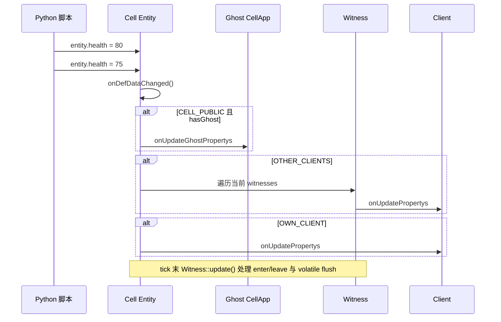
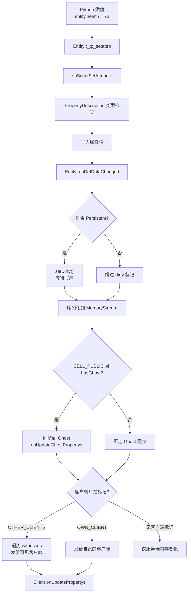
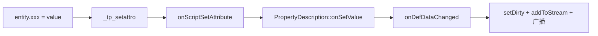
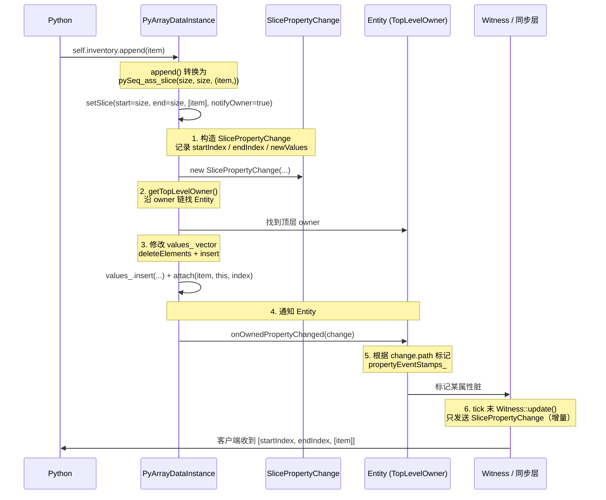

# 12. 属性同步与数据包广播

> 面试高频章节。回答一个核心问题：一个实体属性变更了，怎么高效同步给所有能看到它的客户端？

## 12.1 本章核心问题

- 为什么不是"改了就发"，而是"tick 内收集，tick 末批量发"？
- 一条属性更新的完整链路是怎样的？
- Witness 怎么收集视野内所有实体的变更并广播？
- alias 机制怎么让同步包变小？
- detailLevel（LOD）怎么实现"远处少同步，近处多同步"？
- Volatile 属性是什么？为什么需要独立的更新频率控制？
- 1000 人同屏时，带宽瓶颈在哪？

## 12.2 心智模型：不是"改了就发"，而是"tick 内收集，tick 末批量发"

这是理解属性同步时最容易混淆的地方：KBEngine 里“不是所有客户端相关数据都走同一条节拍”。



**为什么不改了就发**：

1. **一个 tick 内属性可能变化多次**：战斗中血量可能在一帧内扣减 3 次，客户端只需要最终值
2. **Bundle 合并更高效**：即使是立即发送路径，也会优先复用 Channel 当前的 send bundle，减少碎包
3. **视野与位置更新仍然按 tick 收束**：进入视野、离开视野、位置/朝向等高频基础同步，仍然主要由 `Witness::update()` 在 tick 节拍里处理

## 12.3 一条属性更新的完整链路

### KBEngine

先把主链路画出来，后面的源码就是这张图的展开：



```text
Python: entity.health = 75
  │
  ├── Entity::_tp_setattro("health", 75)
  │     → Entity::onScriptSetAttribute("health", 75)
  │
  ├── PropertyDescription::isSameType() 类型检查
  │     → PropertyDescription::onSetValue(...) 写入
  │
  ├── Entity::onDefDataChanged(propertyDescription, pyData)
  │     │
  │     ├── 检查 isReal() && !initing()     ← 只有 real entity 处理
  │     ├── if Persistent → setDirty()       ← 标记需要写库
  │     ├── 序列化属性值到 MemoryStream
  │     ├── if CELL_PUBLIC && hasGhost
  │     │     → 发送给 Ghost：CellappInterface::onUpdateGhostPropertys
  │     ├── if OTHER_CLIENTS
  │     │     → 直接遍历当前 witnesses，立即发给可见客户端
  │     └── if OWN_CLIENT
  │           → 直接发给自己的客户端
  │
  └── Witness::update()
        → 处理 enter/leave view
        → 处理位置/朝向等 volatile 更新
        → flush 当前 tick 的客户端视野消息
```

### 源码：onDefDataChanged

```cpp
// 文件：kbe/src/server/cellapp/entity.cpp:658（简化）
void Entity::onDefDataChanged(EntityComponent* pEntityComponent,
    const PropertyDescription* propertyDescription, PyObject* pyData)
{
    // 只有 real entity 在非初始化状态才处理
    if (!isReal() || initing())
        return;

    // 持久化标记
    if (propertyDescription->isPersistent())
        setDirty();

    // 序列化属性值
    MemoryStream* mstream = MemoryStream::createPoolObject(OBJECTPOOL_POINT);
    propertyDescription->getDataType()->addToStream(mstream, pyData);

    uint32 flags = propertyDescription->getFlags();

    // 广播给 Ghost 实体（跨 CellApp 同步）
    if ((flags & ENTITY_BROADCAST_CELL_FLAGS) > 0 && hasGhost())
    {
        Network::Bundle* pForwardBundle = gm->createSendBundle(ghostCell());
        (*pForwardBundle).newMessage(CellappInterface::onUpdateGhostPropertys);
        (*pForwardBundle) << id();
        (*pForwardBundle) << propertyDescription->getUType();
        // ... 序列化数据
        gm->sendBundle(pForwardBundle);
    }

    // 广播给客户端
    if ((flags & ENTITY_BROADCAST_CLIENT_FLAGS) > 0)
    {
        // 按 witness / own-client 路径直接构造消息并发送
        // Witness::update() 更多负责 enter/leave 与 volatile 数据刷新
        // ...
    }

    MemoryStream::reclaimPoolObject(mstream);
}
```

## 12.4 容器属性的脏标记边界：ARRAY/FIXED_DICT 内部修改不触发同步

### 问题：一个常见的误区

读完 12.3 后容易推断："只要 Python 改了属性，引擎就会自动 `setDirty` + 触发同步"。这个推断对**普通属性**成立，对**容器属性的内部修改不成立**——这是 KBEngine 一个非常容易踩的坑。

```python
class Avatar:
    def addItem(self, item):
        # ❌ 期望：append 后引擎自动同步给客户端
        self.inventory.append(item)

        # ✓ 正确：必须整体重新赋值才能触发同步
        inv = list(self.inventory)
        inv.append(item)
        self.inventory = inv
```

### 脏标记的真实触发粒度

`onDefDataChanged` 只在 `Entity._tp_setattro` 这一层被调用：



`entity.xxx` 必须是**直接赋值**才能命中这条链路。下面这些都不命中：

```
✗ entity.inventory.append(item)        容器方法调用
✗ entity.inventory[i] = newItem        容器下标赋值
✗ entity.inventory.pop()               容器修改
✗ entity.info["name"] = "new"          FIXED_DICT 下标赋值
```

### FixedArray 源码证据：所有修改路径都不回调

`FixedArray` 的所有修改接口（`fixedarray.cpp:219-368`）——`append / extend / insert / pop / remove / clear`——最终都汇聚到基类 `Sequence::seq_ass_slice`（`sequence.cpp:295`）：

```cpp
// kbe/src/lib/pyscript/sequence.cpp:295（简化）
int Sequence::seq_ass_slice(PyObject* self, Py_ssize_t index1,
                            Py_ssize_t index2, PyObject* oterSeq)
{
    // 1. 类型检查
    for (int i = 0; i < osz; ++i) {
        if (!seq->isSameItemType(pyVal)) return -1;
    }

    // 2. erase + insert 修改 values_
    values_.erase(values_.begin() + index1, values_.begin() + index2);
    values_.insert(values_.begin() + index1, osz, nullptr);
    for (int i = 0; i < osz; ++i) {
        values_[index1 + i] = seq->createNewItemFromObj(pyTemp);
    }

    return 0;
    // ★ 没有任何 onDefDataChanged / setDirty / 上层通知
}
```

`clear`（`fixedarray.cpp:356`）甚至直接 `values_.clear()`，连类型检查都不做。

### FixedDict 源码证据：`checkDataChanged` 是个误导名字

`FixedDict::mp_ass_subscript`（`fixeddict.cpp:272`）在写入前会调用 `checkDataChanged`，但这个名字极具误导性：

```cpp
// kbe/src/lib/entitydef/fixeddict.cpp:312（简化）
bool FixedDict::checkDataChanged(const char* keyName, PyObject* value,
                                 bool isDelete)
{
    // 仅检查：key 是否存在、类型是否匹配、是否尝试删除
    for (auto& kv : keyTypes) {
        if (kv.first == keyName) {
            if (isDelete) return false;          // 不允许删除
            if (!dataType->isSameType(value))
                return false;                     // 类型不匹配
            return true;                          // ★ 仅返回"是否允许这次修改"
        }
    }
    return false;   // 未知 key
}
```

它应该被理解为 `checkKeyTypeValid`——纯粹是**键合法性 + 类型校验器**，不触发任何脏标记或同步。`mp_ass_subscript` 拿到 `true` 后直接 `PyDict_SetItem` 写入，没有任何上层通知。

### 数据类型层也没有钩子

`FixedArrayType`（`datatype.h:638`）和 `FixedDictType`（`datatype.h:676`）只提供：

| 接口 | 用途 |
|------|------|
| `isSameType / isSameItemType` | 类型检查 |
| `addToStream / addToStreamEx` | 序列化 |
| `createFromStream / createFromStreamEx` | 反序列化 |
| `createNewItemFromObj` | 元素转换 |

**没有任何 `onChanged / onOwnedPropertyChanged` 之类的变更通知接口。**

### 对比 BigWorld：BigWorld 有细粒度钩子

BigWorld 在 `DataDescription` 层提供了完整的变更通知机制，能区分"属性级赋值"和"容器内部修改"：

| 维度 | KBEngine | BigWorld |
|------|----------|----------|
| 属性级赋值触发同步 | ✓ | ✓ |
| ARRAY `append/pop/[]=` 触发同步 | ✗（需重新赋值） | ✓（DataInstance 事件） |
| FIXED_DICT `[key]=` 触发同步 | ✗（需重新赋值） | ✓（字段级变更通知） |
| 触发链路层 | `Entity::_tp_setattro` | `DataDescription::onOwnedPropertyChanged` 等 |
| 容器层钩子数量 | 0 | 多个（事件戳、pReal_/pGhost_ 区分等） |

### 实际工程中的处理方式

KBEngine 项目里的常见写法：

```python
# 方式 1：修改后整体重新赋值
def add_item(self, item):
    self.inventory.append(item)
    self.inventory = self.inventory       # ← 触发 onDefDataChanged

# 方式 2：构造新容器整体替换
def reset_inventory(self, items):
    new_inv = FixedArray(items)
    self.inventory = new_inv               # ← 整体赋值
```

**代价**：客户端会收到**整个容器**的完整序列化，而不是增量。`alias` 机制（12.7 节）能压缩属性 ID，但容器内容本身仍然是全量重传。

### 设计的权衡

这种"容器内部修改不自动触发同步"是**有意的权衡**：

- **优点**：容器修改极其便宜——纯内存 vector/dict 操作，无 RPC 开销
- **缺点**：脚本层需显式触发同步，容易写出"明明改了但客户端看不到"的 bug
- **架构哲学**：KBEngine 把"何时同步"交给脚本层决策；BigWorld 则倾向于引擎层自动追踪

### 排查指南

遇到"服务端改了 ARRAY/FIXED_DICT 但客户端没收到更新"，按这个顺序排查：

1. **是否整体赋值**：`self.xxx = new_value` 才会触发，`self.xxx.append()/[]=` 不会
2. **`isReal() && !initing()`**：`onDefDataChanged` 第一行就 return 了非 real entity
3. **flags 是否有客户端标记**：`OTHER_CLIENTS / OWN_CLIENT / BASE_AND_CLIENT`
4. **`hasGhost()` 是否成立**：cell 属性需要 ghost 同步时要确认 ghost 是否存在
5. **Witness 是否存在**：客户端必须有 Witness 才会收到 OTHER_CLIENTS 广播

## 12.5 BigWorld 的容器属性变更追踪：PropertyOwner 链机制

> 12.4 节最后留下一个问题：既然 KBEngine 的容器内部修改不触发同步，那 BigWorld 是怎么做到的？这一节专门展开 BigWorld 的实现，重点是 **PropertyOwner 链** + **attach/detach** + **PropertyChange 路径**三件套。

### 12.5.1 三层架构：DataType + DataInstance + PropertyOwner

BigWorld 把"类型描述"、"数据实例"、"所有者"三者拆开，再让数据实例本身承担"属性所有者"的角色：

```
┌─────────────────────────────────────────────────────────────┐
│                    BigWorld 三层架构                          │
├─────────────────────────────────────────────────────────────┤
│                                                              │
│  ArrayDataType         (类型描述，无数据)                     │
│       │                                                      │
│       │  attach() / detach()  ← 把 owner 注入到实例           │
│       ▼                                                      │
│  PyArrayDataInstance   (数据实例，就是 Python 对象本身)       │
│       │                                                      │
│       │  继承自 IntermediatePropertyOwner ← PropertyOwner     │
│       │                                                      │
│       ▼                                                      │
│  onOwnedPropertyChanged(change)  → 冒泡到 Entity             │
│                                                              │
└─────────────────────────────────────────────────────────────┘
```

关键差异：KBEngine 里 `FixedArray` 只是 `Sequence` 的子类，纯粹是个容器；BigWorld 里 `PyArrayDataInstance` **既是容器又是 PropertyOwner**——这是后续一切机制的基础。

类继承关系（`array_data_instance.hpp:19`）：

```cpp
class PyArrayDataInstance : public IntermediatePropertyOwner
{
    Py_Header(PyArrayDataInstance, PropertyOwner)
    // ...
};

// IntermediatePropertyOwner 提供 getTopLevelOwner()，
// 沿 owner 链找到顶层（通常是 Entity）
```

### 12.5.2 attach/detach：让容器知道"我属于哪个 Entity"

`array_data_type.cpp:163` 的 `ArrayDataType::attach`：

```cpp
// BigWorld-Engine-14.4.1/programming/bigworld/lib/entitydef/
// data_types/array_data_type.cpp:163（简化）
ScriptObject ArrayDataType::attach(ScriptObject pObject,
    PropertyOwnerBase * pOwner, int ownerRef)
{
    // ... 构造 PyArrayDataInstance ...
    pInst->setOwner(pOwner, ownerRef);   // ★ 把 owner 保存到容器内部
    return pInst;
}
```

当脚本执行 `entity.inventory = [...]` 时，整个流程是：

1. `entity.inventory` 这条属性被赋值（命中 Entity 的 `_tp_setattro`）
2. 调用 `ArrayDataType::attach(list, owner=entity, ownerRef=inventory_index)`
3. 把原始 list 包装成 `PyArrayDataInstance`，并把 **owner 指针（Entity）+ ownerRef（属性索引）** 存进去
4. 返回包装后的实例替换原始 list

从此，这个 array 就"知道自己属于谁"。`detach` 则在容器被销毁或替换时解除 owner 关系。

### 12.5.3 setSlice：所有修改的统一入口

`PyArrayDataInstance::setSlice` 是整个机制的心脏（`array_data_instance.cpp:584`）：

```cpp
// BigWorld-Engine-14.4.1/programming/bigworld/lib/entitydef/
// data_instances/array_data_instance.cpp:584（简化）
bool PyArrayDataInstance::setSlice(Py_ssize_t startIndex, Py_ssize_t endIndex,
    const BW::vector<ScriptObject>& newValues,
    bool notifyOwner, ScriptObject* ppOldValues)
{
    PropertyOwnerBase* pTopLevelOwner = NULL;
    SlicePropertyChange change(startIndex, endIndex,
        values_.size(), newValues, dataType);

    // 1. 沿 owner 链找到顶层 owner（通常是 Entity）
    if (notifyOwner) {
        this->getTopLevelOwner(change, pTopLevelOwner);
    }

    // 2. 实际修改 values_（deleteElements + insert）
    this->deleteElements(startIndex, endIndex, ppOldValues);
    values_.insert(values_.begin() + startIndex, numToInsert, ScriptObject());
    for (int i = 0; i < numToInsert; ++i) {
        values_[startIndex + i] = dataType.attach(newValues[i], this, ...);
    }

    // 3. ★★ 通知顶层 owner（Entity）有属性变了 ★★
    if (pTopLevelOwner) {
        pTopLevelOwner->onOwnedPropertyChanged(change);
    }
    return true;
}
```

**所有 Python 修改操作都汇聚到这里**，没有一个修改路径会"悄悄发生"：

| Python 操作 | 调用路径 |
|------------|----------|
| `entity.inv[i] = v` | `pySeq_ass_item` → `changeOwnedProperty` → 通知 |
| `entity.inv[i:j] = [...]` | `pySeq_ass_slice` → `setSlice(notifyOwner=true)` |
| `entity.inv.append(x)` | `append()` → `pySeq_ass_slice(size, size, (x,))` |
| `entity.inv.extend(seq)` | `extend()` → `pySeq_ass_slice(size, size, seq)` |
| `entity.inv.insert(i, x)` | `insert()` → `pySeq_ass_slice(i, i, (x,))` |
| `entity.inv.pop()` | `pop()` → `pySeq_ass_slice(i, i+1, ())` |
| `entity.inv.remove(x)` | `remove()` → `pySeq_ass_slice(i, i+1, NULL)` |
| `entity.inv += seq` | `pySeq_inplace_concat` → `pySeq_ass_slice` |
| `entity.inv *= n` | `pySeq_inplace_repeat` → `setSlice(notifyOwner=true)` |

### 12.5.4 PropertyOwner 链：嵌套属性的冒泡

`property_owner.hpp:21` 的核心注释说得很清楚：

```cpp
/**
 *  This method is called by a child PropertyOwnerBase to inform us that
 *  a property has changed. Each PropertyOwner should pass this to their
 *  parent, adding their index to the path, until the Entity is reached.
 */
virtual bool onOwnedPropertyChanged(PropertyChange& change) { ... }
```

对于嵌套结构 `entity.grid[x][y] = v`，整个冒泡过程是：

```
PyArrayDataInstance(外层 grid)
    │
    │  grid[3][4] = value
    │   ↓
    │  内层 PyArrayDataInstance(grid[3]) 触发 onOwnedPropertyChanged
    │   ↓ 把自己 index (3) 加到 path
    │  外层 PyArrayDataInstance(grid) 触发 onOwnedPropertyChanged
    │   ↓ 把自己 index (1, 假设 grid 是 entity 第1个属性) 加到 path
    │  Entity::onOwnedPropertyChanged(change)
    │   ↓ path = [4, 3, 1]，知道是 entity.grid[3][4] 变了
    │
    └──→ 标记 propertyEventStamps_、触发同步
```

`PropertyChange.path_`（`property_change.hpp:66`）的注释：

```cpp
// A sequence of child indexes ordered from the leaf to the root
// (i.e. entity). For example, 3,4,6 would be the 6th property of the
// entity, the 4th "child" of that property and then the 3rd "child".
// E.g. If the 6th property is a list of lists called myList, this refers
// to entity.myList[4][3]
typedef BW::vector<std::pair<int32, int32>> ChangePath;
```

注意路径方向是**从叶子到根**，每层冒泡都把自己的 index 加到 path。Entity 拿到完整路径后，就能精确知道是哪个嵌套属性变了。

### 12.5.5 两种变更粒度：增量同步的关键

BigWorld 区分两种 `PropertyChange`（`property_change.hpp`）：

| 类型 | 触发场景 | 序列化内容 |
|------|----------|----------|
| `SinglePropertyChange` | `entity.info["name"] = "x"` 或 `entity.inv[i] = v` | 仅新值（leafIndex + 值） |
| `SlicePropertyChange` | `entity.inv.append(x)` / `entity.inv[i:j] = ...` | startIndex + endIndex + 新元素列表 |

这导致 BigWorld 的网络同步是**真正增量**的：

```
场景：一个 1000 元素的数组 append 一个新项

KBEngine（必须整体重新赋值）:
    self.inventory = self.inventory
    → 客户端收到整个数组：1001 个元素的全量序列化

BigWorld（自动捕获 append）:
    self.inventory.append(item)
    → 客户端只收到 SlicePropertyChange：
      [startIndex=1000, endIndex=1000, newValues=[item]]
    → 仅 1 个元素 + 索引
```

对于 1000 元素的数组 append 一个，KBEngine 重传 1001 个，BigWorld 只传 1 个——这就是 BigWorld 这套机制最大的带宽价值。

### 12.5.6 完整的"一次 append"流程



### 12.5.7 关键源码对照表

| 概念 | 文件 |
|------|------|
| PropertyOwner 基类 | `lib/entitydef/property_owner.hpp:21` |
| TopLevelPropertyOwner | `lib/entitydef/property_owner.hpp:106` |
| IntermediatePropertyOwner | `lib/entitydef/data_instances/intermediate_property_owner.hpp` |
| PropertyChange 基类 | `lib/entitydef/property_change.hpp:27` |
| SinglePropertyChange | `lib/entitydef/property_change.hpp:92` |
| SlicePropertyChange | `lib/entitydef/property_change.hpp:119` |
| ArrayDataType | `lib/entitydef/data_types/array_data_type.hpp:14` |
| **attach 实现** | `lib/entitydef/data_types/array_data_type.cpp:163` |
| **PyArrayDataInstance** | `lib/entitydef/data_instances/array_data_instance.hpp:19` |
| **setSlice（核心）** | `lib/entitydef/data_instances/array_data_instance.cpp:584` |
| pySeq_ass_item | `lib/entitydef/data_instances/array_data_instance.cpp:402` |
| append / extend / insert / pop / remove | `lib/entitydef/data_instances/array_data_instance.cpp:721-829` |

> 所有路径相对 `BigWorld-Engine-14.4.1/programming/bigworld/`。

### 12.5.8 FIXED_DICT 也是同一套机制

`PyFixedDictDataInstance`（`fixed_dict_data_instance.hpp`）同样继承自 `IntermediatePropertyOwner`，它的 `mp_ass_subscript`（即 `info[key] = value`）也走完整的"构造 PropertyChange → 沿 owner 链冒泡 → 通知 Entity"流程。这与 KBEngine 的 `FixedDict::checkDataChanged`（仅类型检查，无回调）形成鲜明对比。

### 12.5.9 与 KBEngine 的对比：根因总结

KBEngine 没做到容器内部修改自动同步的**根本原因**：

```
KBEngine:
    FixedArray : Sequence          ← 容器只是容器
    Sequence::seq_ass_slice        ← 修改入口无任何回调
    Entity::_tp_setattro           ← 同步决策只挂在这一层

BigWorld:
    PyArrayDataInstance : PropertyOwner   ← 容器是 PropertyOwner
    setSlice(notifyOwner=true)            ← 修改入口必走变更通知
    Entity::onOwnedPropertyChanged        ← 同步决策挂在 Entity 层
    + IntermediatePropertyOwner           ← 中间层负责冒泡和路径累积
```

BigWorld 用 `attach/detach + IntermediatePropertyOwner + ChangePath` 这一套，**把"何时同步"的决策权从顶层 Entity 下沉到了每一个容器实例**。这就是它能做到容器内部修改自动增量同步的本质。

## 12.6 Witness：观察者驱动的广播引擎

### KBEngine Witness

```cpp
// 文件：kbe/src/server/cellapp/witness.h（简化）
struct WitnessInfo
{
    int8 detailLevel;                           // 当前所在详情级别（0/1/2）
    Entity* entity;                             // 被观察的实体
    float range;                                // 与观察者的距离
    bool detailLevelLog[3];                     // 进入过哪些详情级别（优化用）
    std::vector<uint32> changeDefDataLogs[3];   // 各级别的脏属性记录
};

class Witness : public PoolObject, public Updatable
{
public:
    void attach(Entity* pEntity);
    void detach(Entity* pEntity);
    bool update();                              // tick 末主更新函数

    void onEnterView(ViewTrigger* pViewTrigger, Entity* pEntity);
    void onLeaveView(ViewTrigger* pViewTrigger, Entity* pEntity);

    void addUpdateToStream(Network::Bundle* pForwardBundle,
        uint32 flags, EntityRef* pEntityRef);
    void addBaseDataToStream(Network::Bundle* pSendBundle);
    uint32 getEntityVolatileDataUpdateFlags(Entity* otherEntity);

    bool sendToClient(const Network::MessageHandler& msgHandler,
        Network::Bundle* pBundle);

private:
    Entity* pEntity_;                           // 拥有 Witness 的实体
    float viewRadius_;                          // 视野半径
    float viewHysteresisArea_;                  // 滞后区域
    ViewTrigger* pViewTrigger_;                 // AOI 触发器
    VIEW_ENTITIES viewEntities_;                // 可见实体列表
    VIEW_ENTITIES_MAP viewEntities_map_;        // 可见实体映射
    uint32 clientViewSize_;                     // 当前视野内实体数量
    Position3D lastBasePos_;                    // 上次广播的基础位置
};
```

### Witness::update() 的核心逻辑

```
Witness::update() — 每个 tick 末执行
  │
  ├── 1. 处理进入/离开视野事件
  │     onEnterView → 发送 createEntity 到客户端
  │     onLeaveView → 发送 leaveEntity 到客户端
  │
  ├── 2. 更新自身位置（Volatile data）
  │     getEntityVolatileDataUpdateFlags()
  │     → 位置变化超过阈值？方向变化超过阈值？
  │     → addUpdateToStream() 发送位置/朝向
  │
  ├── 3. 广播脏属性
  │     遍历 viewEntities_：
  │       对每个可见实体：
  │         检查 changeDefDataLogs[detailLevel]
  │         → 有脏属性？构造 Bundle 发送
  │
  ├── 4. 处理 entityRef 的进出事件
  │     新进入的实体：发送完整属性初始数据
  │     已存在的实体：只发送变更的属性
  │
  └── 5. flush Bundle → 通过 Channel 发送给客户端
```

### BigWorld Witness

```cpp
// 文件：BigWorld-Engine-14.4.1/programming/bigworld/server/cellapp/witness.hpp（简化）
class Witness : public Updatable
{
private:
    RealEntity& real_;                    // 关联的 real entity
    Entity& entity_;                      // Cell entity
    KnownEntityQueue entityQueue_;        // 优先级队列
    EntityCacheMap aoiMap_;              // AOI 内的实体缓存
    float aoiRadius_;                    // AOI 半径
    RangeListNode* pAoIRoot_;            // AOI 触发器
    int32 bandwidthDeficit_;             // 带宽管理

public:
    void update();
    void addToAoI(Entity* pEntity, bool setManuallyAdded);
    void removeFromAoI(Entity* pEntity, bool clearManuallyAdded);
    bool sendToClient(EntityID entityID, MessageID msgID,
        MemoryOStream& stream, int msgSize);
};
```

**BigWorld 的 Witness::update()** 使用**优先级队列**：

```cpp
// 简化
void Witness::update()
{
    Mercury::Bundle& bundle = this->bundle();

    // 带宽限制
    const int desiredPacketSize =
        int(maxPacketSize_ * throttle) - bandwidthDeficit_ + bundle.size();

    // 优先级队列处理
    while (bundle.size() < desiredPacketSize - 2)
    {
        EntityCache* pCache = entityQueue_.front();  // 取最高优先级
        std::pop_heap(queueBegin, queueEnd--, PriorityCompare());

        if (!pCache->isUpdatable())
            this->handleStateChange(&pCache, queueEnd);
        else
        {
            this->sendQueueElement(pCache);            // 发送更新
            pCache->updatePriority(entity_.position()); // 重算优先级
        }
    }

    this->flushToClient();
}
```

**与 KBEngine 的关键区别**：BigWorld 使用**优先级队列 + 带宽预算**——如果带宽不够，低优先级的实体更新会被推迟到下一个 tick。KBEngine 没有这套优先级预算器；它更偏向“属性变化时直接按当前 witness 集合发送，tick 末再由 Witness 处理视野进出和位置/朝向等基础同步”。

## 12.7 EntityCache：BigWorld 的观察者-被观察者关系管理

```cpp
// 文件：BigWorld-Engine-14.4.1/programming/bigworld/server/cellapp/entity_cache.hpp（简化）
class EntityCache
{
private:
    EntityConstPtr pEntity_;
    Priority priority_;                           // 基于距离的更新优先级
    DetailLevel detailLevel_;                     // 当前 LOD 级别
    IDAlias idAlias_;                             // 客户端侧的实体 ID 别名
    EventNumber lastEventNumber_;                 // 最后发送的事件号
    VolatileNumber lastVolatileUpdateNumber_;     // 最后发送的 volatile 更新号
    EventNumber lodEventNumbers_[MAX_LOD_LEVELS]; // 每个 LOD 级别的事件戳

public:
    // 优先级计算（基于距离）
    void updatePriority(const Vector3& origin)
    {
        float distSQ = this->getDistanceSquared(origin);
        Priority delta = AoIUpdateSchemes::apply(updateSchemeID_, distSQ);
        priority_ += delta;
    }

    // 添加变更属性到流
    bool addChangedProperties(BinaryOStream& stream,
        Mercury::Bundle* pBundleForHeader, bool shouldSelectEntity);

    // 更新 LOD 级别
    bool updateDetailLevel(Mercury::Bundle& bundle,
        float lodPriority, bool hasSelectedEntity);

    static const int MAX_LOD_LEVELS = 4;
};
```

## 12.8 alias 机制：为什么属性同步包这么小

### 问题

属性同步需要在包中标识"哪个属性变了"。如果用完整的 utype（2 字节 uint16），每个属性占 2 字节。一个实体有 50 个属性，光属性 ID 就要 100 字节。

### 解决方案：aliasID

```cpp
// 文件：kbe/src/lib/entitydef/property.h（简化）
class PropertyDescription
{
    /**
     * 别名 ID：当暴露的方法或广播的属性总个数小于 255 时，
     * 使用 1 字节的 aliasID 代替 2 字节的 utype 传输
     */
    INLINE int16 aliasID() const;
    INLINE uint8 aliasIDAsUint8() const;
    INLINE void aliasID(int16 v);

    uint16 utype_;       // 全局唯一类型 ID（2 字节）
    int16 aliasID_;      // 局部别名 ID（可压缩为 1 字节）
};
```

### 使用条件

```cpp
// 在属性同步时
if (pScriptModule_->usePropertyDescrAlias())
{
    // alias 已在定义加载阶段判定可用 → 用 1 字节 aliasID
    (*pSendBundle) << propertyDescription->aliasIDAsUint8();
}
else
{
    // alias 不可用 → 回退到完整 utype
    (*pSendBundle) << propertyDescription->getUType();
}
```

**alias 分配算法**：`usePropertyDescrAlias()` 的启用不只是“数量小于 255”这么简单。源码里客户端属性 alias 还会从保留区间 `ENTITY_BASE_PROPERTY_ALIASID_MAX` 之后开始编号；客户端方法 alias 从 1 开始。也就是说它既受数量约束，也受预留 alias 区间影响。省下来的带宽在 2000 个可见实体 × 50 属性的场景下依然非常可观。

### BigWorld 的对应机制

BigWorld 使用 `IDAlias`（1 字节）压缩实体 ID，以及 `internalIndex()`（方法/属性的内部索引）减少传输开销。

```cpp
// EntityCache 中的 IDAlias
IDAlias idAlias_;    // 0xff = NO_ID_ALIAS，其他为 1 字节实体 ID 别名
```

## 12.9 detailLevel：不是所有属性都实时同步

### 问题

远处实体只需要知道位置和朝向，不需要知道精确的装备详情、buff 列表等。如果所有属性都实时同步，1000 个可见实体 × 全量属性 = 带宽爆炸。

### KBEngine 三级 detailLevel

```cpp
// WitnessInfo 中的 detailLevel：0 / 1 / 2
struct WitnessInfo
{
    int8 detailLevel;                           // 0=近, 1=中, 2=远
    bool detailLevelLog[3];                     // 进入过哪些级别
    std::vector<uint32> changeDefDataLogs[3];   // 每个级别的脏属性记录
};
```

**工作方式**：

1. **属性定义时分配 detailLevel**：每个 CLIENT_VISIBLE 属性属于一个 detailLevel
2. **距离计算**：每 tick 根据与观察者的距离确定 detailLevel
3. **按级别过滤**：只同步当前 detailLevel 及更高级别的属性

```
实体 A 观察实体 B（距离 30 米）：
  detailLevel = 0（近距离）→ 同步全部属性（位置、朝向、装备、buff、名称...）

实体 A 观察实体 C（距离 80 米）：
  detailLevel = 1（中距离）→ 同步部分属性（位置、朝向、名称、装备外观...）

实体 A 观察实体 D（距离 200 米）：
  detailLevel = 2（远距离）→ 只同步位置和朝向
```

**优化**：`detailLevelLog` 记录实体进入过哪些级别。如果实体从 level 2 变到 level 1，只需发送 level 1 的增量——因为 level 2 的属性之前已经同步过了。

### BigWorld DataLoDLevels

```cpp
// 文件：BigWorld-Engine-14.4.1/programming/bigworld/lib/entitydef/data_lod_level.hpp（简化）
class DataLoDLevel
{
    float low() const;      // 优先级下阈值
    float high() const;     // 优先级上阈值
    float start() const;    // 起始距离
    float hyst() const;    // 滞后值（防抖）
};

class DataLoDLevels
{
    bool needsMoreDetail(int level, float priority) const;
    bool needsLessDetail(int level, float priority) const;
};
```

**EntityCache 的 LOD 切换**：

```cpp
bool EntityCache::updateDetailLevel(Mercury::Bundle& bundle,
    float lodPriority, bool hasSelectedEntity)
{
    const DataLoDLevels& lodLevels =
        this->pEntity()->pType()->description().lodLevels();

    // 需要更多细节（实体更近了）
    if (lodLevels.needsMoreDetail(detailLevel_, lodPriority))
    {
        detailLevel_--;    // 数字越小越详细
        this->addChangedProperties(bundle, &bundle, hasSelectedEntity);
        return true;
    }
    // 需要更少细节（实体更远了）
    else if (lodLevels.needsLessDetail(detailLevel_, lodPriority))
    {
        detailLevel_++;
        this->addChangedProperties(bundle, &bundle, hasSelectedEntity);
        return true;
    }

    return false;
}
```

**BigWorld 比 KBEngine 多了**：

1. **滞后值（hysteresis）**：防抖——实体在 LOD 边界来回移动时不会频繁切换
2. **优先级阈值**：不直接用距离，而是经过 `AoIUpdateSchemes` 转换的优先级值
3. **4 级 LOD**（`MAX_LOD_LEVELS = 4`），KBEngine 3 级

## 12.10 Volatile 属性：独立的更新频率控制

位置和朝向是最高频同步的属性。它们不需要每次变化都同步——只要变化量超过阈值才发。

```cpp
// 文件：kbe/src/lib/entitydef/volatileinfo.h（简化）
class VolatileInfo : public script::ScriptObject
{
public:
    static const float ALWAYS;    // = 0.f，总是更新
    static const float NEVER;     // = -1.f，从不更新

    VolatileInfo(float position = VolatileInfo::ALWAYS,
                 float yaw = VolatileInfo::ALWAYS,
                 float roll = VolatileInfo::ALWAYS,
                 float pitch = VolatileInfo::ALWAYS):
        position_(position),
        yaw_(yaw),
        roll_(roll),
        pitch_(pitch),
        optimized_(true)
    {}

    float position() const { return position_; }
    float yaw() const { return yaw_; }
    float roll() const { return roll_; }
    float pitch() const { return pitch_; }

    void updateToNEVER();
    void updateToALWAYS();

private:
    float position_;     // 位置更新阈值
    float yaw_;          // 偏航角更新阈值
    float roll_;         // 翻滚角更新阈值
    float pitch_;        // 俯仰角更新阈值
    bool optimized_;
};
```

**在 Witness::addUpdateToStream 中的使用**：

```cpp
// 文件：kbe/src/server/cellapp/witness.cpp:956（简化）
void Witness::addUpdateToStream(Network::Bundle* pForwardBundle,
    uint32 flags, EntityRef* pEntityRef)
{
    Entity* otherEntity = pEntityRef->pEntity();

    // 根据配置选择优化级别
    static uint8 type = g_kbeSrvConfig.getCellApp().entity_posdir_updates_type;
    static uint16 threshold = g_kbeSrvConfig.getCellApp()
        .entity_posdir_updates_smart_threshold;

    bool isOptimized = true;
    if ((type == 2 && clientViewSize_ <= threshold) || type == 0)
        isOptimized = false;

    if (isOptimized)
    {
        switch (flags)
        {
        case UPDATE_FLAG_XZ:       // 只有 XZ 平面位移
        {
            Position3D relativePos = otherEntity->position()
                - this->pEntity()->position();
            pForwardBundle->appendPackXZ(relativePos.x, relativePos.z);
            // 3 字节编码（Ch10 讲过）
            break;
        }
        case UPDATE_FLAG_XYZ:      // 三维位移
        {
            Position3D relativePos = otherEntity->position()
                - this->pEntity()->position();
            pForwardBundle->appendPackXZ(relativePos.x, relativePos.z);
            pForwardBundle->appendPackY(relativePos.y);
            // 5 字节编码
            break;
        }
        case UPDATE_FLAG_YAW:      // 只有朝向
            (*pForwardBundle) << angle2int8(dir.yaw());  // 1 字节
            break;
        case UPDATE_FLAG_XYZ_YAW:  // 位移 + 朝向
            // PackXZ + PackY + angle2int8 = 6 字节
            break;
        }
    }
}
```

**Volatile 更新标志的计算**：

```cpp
uint32 Witness::getEntityVolatileDataUpdateFlags(Entity* otherEntity)
{
    uint32 flags = UPDATE_FLAG_NULL;

    // 检查位置变化是否超过阈值
    if (positionChanged && changeDistance > volatileInfo.position_)
        flags |= UPDATE_FLAG_XZ;

    // 检查朝向变化是否超过阈值
    if (yawChanged && yawDelta > volatileInfo.yaw_)
        flags |= UPDATE_FLAG_YAW;

    return flags;
}
```

### BigWorld VolatileInfo

BigWorld 的 Volatile 定义在 .def 文件的 `<Volatile>` 块中：

```xml
<ClientAvatar>
    <Volatile>
        <position/>
        <yaw/>
        <pitch>    20    </pitch>    <!-- 超过 20 度才同步 -->
    </Volatile>
</ClientAvatar>
```

## 12.11 BigWorld AoIUpdateSchemes：可插拔的更新策略

```cpp
// BigWorld 使用 AoIUpdateSchemes 抽象 AOI 更新策略
// EntityCache::updatePriority() 中：
Priority delta = AoIUpdateSchemes::apply(updateSchemeID_, distSQ);
```

不同的实体类型可以使用不同的 AOI 更新策略（比如 NPC 的更新频率可以低于玩家）。KBEngine 没有这层抽象——所有实体使用统一的更新逻辑。

## 12.12 广播的效率边界：为什么 MMO 有"最大同屏人数"

### 带宽计算

假设一个场景：
- N 个客户端同屏
- 每个客户端看到 M 个实体
- 每个实体平均 K 个脏属性
- tick 频率 10Hz

**每个客户端每秒接收的数据量**：

```
每 tick = M × K × 属性大小
每秒 = 10 × M × K × 属性大小

假设：
  M = 200（可见实体数）
  K = 5（平均脏属性数）
  属性大小 = 8 bytes（含 aliasID + 值）

每 tick = 200 × 5 × 8 = 8000 bytes = 8 KB
每秒 = 80 KB/s
```

**1000 人同屏**：

```
M = 1000, K = 3（远处实体只同步位置）
每 tick = 1000 × 3 × 5 = 15000 bytes ≈ 15 KB
每秒 = 150 KB/s
```

这已经接近很多玩家的上行带宽上限（注意：是服务器发往客户端的**下行**，但服务器需要给 N 个客户端各发 150KB/s）。

**服务器总带宽**：

```
N = 1000 个客户端
每个客户端 150 KB/s 下行
服务器总下行 = 1000 × 150 KB/s = 150 MB/s ≈ 1.2 Gbps
```

这就是为什么 MMO 有"最大同屏人数"约束——不是 CPU 算力不够，而是**带宽先到天花板**。

### 两套项目的优化手段

| 优化手段 | KBEngine | BigWorld |
|---------|----------|----------|
| alias 压缩 | aliasID（1 字节替代 2 字节） | IDAlias + internalIndex |
| 坐标压缩 | PackXZ(3B) / PackY(2B) / PackXYZ(4B) | 无内置 |
| 朝向压缩 | angle2int8（1 字节） | 类似 |
| LOD | 3 级 detailLevel | 4 级 + 滞后 |
| 带宽预算 | 无 | bandwidthDeficit + 优先级队列 |
| 脏属性合并 | tick 末批量 | tick 末批量 |
| Volatile 阈值 | 有（.def 中配置） | 有（.def 中配置） |
| 距离相关优先级 | 无 | 有（Priority 基于距离递增） |

## 12.13 两套项目的属性同步对比

| 维度 | KBEngine | BigWorld |
|------|----------|----------|
| 同步模型 | tick 末批量 | tick 末批量 + 优先级队列 |
| 观察者管理 | Witness + ViewTrigger | Witness + RangeList |
| 被观察者缓存 | WitnessInfo（3 级） | EntityCache（4 级） |
| LOD 级别 | 3 级 | 4 级 + 滞后 |
| 带宽控制 | 无 | bandwidthDeficit 预算 |
| 优先级调度 | 无（全部同步） | 优先级队列（低优先级可延迟） |
| 脏属性记录 | changeDefDataLogs[3] | propertyEventStamps |
| 实体 ID 压缩 | 无（直接 ENTITY_ID） | IDAlias（1 字节） |
| 属性 ID 压缩 | aliasID（1 字节） | internalIndex |
| 位置编码 | PackXZ/PackY/PackXYZ | 无特殊压缩 |
| 朝向编码 | angle2int8（1 字节） | 类似 |
| Ghost 属性同步 | onUpdateGhostPropertys | DATA_GHOSTED 标记 |
| 更新策略 | 统一 | AoIUpdateSchemes 可插拔 |
| 带宽统计 | NetworkStats | PacketReceiverStats |

## 12.14 关键源码入口

### KBEngine

| 概念 | 文件 |
|------|------|
| Witness | `kbe/src/server/cellapp/witness.h` |
| WitnessInfo | `kbe/src/server/cellapp/witness.h`（内嵌结构体） |
| Witness update | `kbe/src/server/cellapp/witness.cpp` |
| addUpdateToStream | `kbe/src/server/cellapp/witness.cpp:956` |
| onDefDataChanged | `kbe/src/server/cellapp/entity.cpp:658` |
| VolatileInfo | `kbe/src/lib/entitydef/volatileinfo.h` |
| PropertyDescription | `kbe/src/lib/entitydef/property.h` |
| aliasID | `kbe/src/lib/entitydef/property.h` |
| ViewTrigger | `kbe/src/server/cellapp/view_trigger.h` |
| EntityRef | `kbe/src/server/cellapp/entityref.h` |
| onScriptSetAttribute | `kbe/src/lib/entitydef/entity_macro.h:779`（宏展开） |
| FixedArray 容器修改 | `kbe/src/lib/entitydef/fixedarray.cpp` |
| FixedDict 容器修改 | `kbe/src/lib/entitydef/fixeddict.cpp` |
| Sequence::seq_ass_slice | `kbe/src/lib/pyscript/sequence.cpp:295` |
| checkDataChanged（误导名字） | `kbe/src/lib/entitydef/fixeddict.cpp:312` |
| FixedArrayType | `kbe/src/lib/entitydef/datatype.h:638` |
| FixedDictType | `kbe/src/lib/entitydef/datatype.h:676` |

### BigWorld

| 概念 | 文件 |
|------|------|
| Witness | `BigWorld-Engine-14.4.1/programming/bigworld/server/cellapp/witness.hpp` |
| EntityCache | `BigWorld-Engine-14.4.1/programming/bigworld/server/cellapp/entity_cache.hpp` |
| DataDescription | `BigWorld-Engine-14.4.1/programming/bigworld/lib/entitydef/data_description.hpp` |
| DataLoDLevels | `BigWorld-Engine-14.4.1/programming/bigworld/lib/entitydef/data_lod_level.hpp` |
| EntityDataFlags | `BigWorld-Engine-14.4.1/programming/bigworld/lib/entitydef/data_description.hpp` |
| onOwnedPropertyChanged | `BigWorld-Engine-14.4.1/programming/bigworld/server/cellapp/entity.cpp` |
| PropertyOwnerBase | `BigWorld-Engine-14.4.1/programming/bigworld/lib/entitydef/property_owner.hpp:21` |
| TopLevelPropertyOwner | `BigWorld-Engine-14.4.1/programming/bigworld/lib/entitydef/property_owner.hpp:106` |
| IntermediatePropertyOwner | `BigWorld-Engine-14.4.1/programming/bigworld/lib/entitydef/data_instances/intermediate_property_owner.hpp` |
| PropertyChange 基类 | `BigWorld-Engine-14.4.1/programming/bigworld/lib/entitydef/property_change.hpp:27` |
| SinglePropertyChange | `BigWorld-Engine-14.4.1/programming/bigworld/lib/entitydef/property_change.hpp:92` |
| SlicePropertyChange | `BigWorld-Engine-14.4.1/programming/bigworld/lib/entitydef/property_change.hpp:119` |
| ArrayDataType::attach | `BigWorld-Engine-14.4.1/programming/bigworld/lib/entitydef/data_types/array_data_type.cpp:163` |
| PyArrayDataInstance::setSlice | `BigWorld-Engine-14.4.1/programming/bigworld/lib/entitydef/data_instances/array_data_instance.cpp:584` |

## 12.15 源码走读路径

### 路径一：跟踪一次属性变更的完整同步链路

1. `kbe/src/server/cellapp/entity.cpp:658` — `onDefDataChanged()` 属性变更入口
2. `kbe/src/server/cellapp/witness.cpp` — `update()` tick 末批量广播
3. `kbe/src/server/cellapp/witness.cpp:956` — `addUpdateToStream()` 构造同步包

### 路径二：理解 LOD / detailLevel 机制

1. `kbe/src/server/cellapp/witness.h` — `WitnessInfo` 结构体中的 detailLevel 和 detailLevelLog
2. `BigWorld-Engine-14.4.1/programming/bigworld/lib/entitydef/data_lod_level.hpp` — DataLoDLevels
3. `BigWorld-Engine-14.4.1/programming/bigworld/server/cellapp/entity_cache.hpp` — `updateDetailLevel()`

### 路径三：对比带宽优化手段

1. `kbe/src/lib/entitydef/property.h` — aliasID 压缩
2. `kbe/src/lib/common/memorystream.h` — PackXZ/PackY 坐标压缩
3. `kbe/src/lib/entitydef/volatileinfo.h` — Volatile 更新阈值
4. `BigWorld-Engine-14.4.1/programming/bigworld/server/cellapp/witness.cpp` — bandwidthDeficit 带宽预算

### 路径四：理解容器属性的脏标记边界（KBEngine 侧）

1. `kbe/src/lib/entitydef/entity_macro.h:779` — `onScriptSetAttribute` 宏：脏标记的真实入口
2. `kbe/src/lib/pyscript/sequence.cpp:295` — `Sequence::seq_ass_slice`：所有 ARRAY 修改的汇聚点，注意没有任何回调
3. `kbe/src/lib/entitydef/fixeddict.cpp:312` — `checkDataChanged`：误导名字，实际只是键合法性 + 类型校验
4. `kbe/src/lib/entitydef/datatype.h:638` 和 `:676` — `FixedArrayType` / `FixedDictType`：确认没有 `onChanged` 钩子

### 路径五：理解 BigWorld 容器属性变更追踪机制

1. `BigWorld-Engine-14.4.1/programming/bigworld/lib/entitydef/property_owner.hpp:21` — `PropertyOwnerBase` 接口与 `onOwnedPropertyChanged` 注释
2. `BigWorld-Engine-14.4.1/programming/bigworld/lib/entitydef/property_change.hpp:27` — `PropertyChange` 基类、`ChangePath` 含义、`SinglePropertyChange` / `SlicePropertyChange` 区分
3. `BigWorld-Engine-14.4.1/programming/bigworld/lib/entitydef/data_types/array_data_type.cpp:163` — `ArrayDataType::attach`：把 owner 注入到容器实例
4. `BigWorld-Engine-14.4.1/programming/bigworld/lib/entitydef/data_instances/array_data_instance.cpp:584` — `setSlice`：所有修改的统一入口，确认必走 `onOwnedPropertyChanged`
5. `BigWorld-Engine-14.4.1/programming/bigworld/lib/entitydef/data_instances/array_data_instance.cpp:402-829` — `pySeq_ass_item / append / extend / insert / pop / remove` 都汇聚到 `setSlice`

## 12.16 小结

- **属性同步是 tick 末批量发的**：一个 tick 内多次修改只同步最终值，减少网络包数量
- **onDefDataChanged 是变更入口**：判断是否 real、是否持久化、广播给 ghost 和客户端
- **容器属性的脏标记边界**：ARRAY/FIXED_DICT 的内部修改（`append / []=` 等）**不会**自动触发同步，必须整体重新赋值（`self.xxx = self.xxx` 或新容器）；这是 KBEngine 与 BigWorld 的一个关键差异，BigWorld 在 `DataDescription` 层有细粒度钩子
- **BigWorld 用 PropertyOwner 链实现容器内部修改自动追踪**：容器实例本身就是 `PropertyOwner`，通过 `attach/detach` 知道"我属于哪个 Entity"，所有修改都汇聚到 `setSlice(notifyOwner=true)` → `onOwnedPropertyChanged` 冒泡到顶层；变更用 `SinglePropertyChange` / `SlicePropertyChange` 区分粒度，网络同步是真正增量的
- **Witness 是观察者驱动的广播引擎**：每 tick 末收集所有可见实体的脏属性，构造 Bundle 批量发送
- **alias 机制会在满足条件时把属性 ID 从 `utype` 压成 1 字节 alias**：它受 alias 开关、保留区间和客户端可见属性数量共同约束
- **detailLevel/LOD 实现按距离分级同步**：远处实体只同步位置朝向，近处实体同步全部
- **Volatile 属性有独立的更新频率阈值**：位置和朝向变化超过阈值才发
- **BigWorld 有带宽预算和优先级队列**：带宽不够时低优先级更新被延迟
- **1000 人同屏的瓶颈是带宽**：N × M × K × tickFreq 决定了服务器总下行带宽
