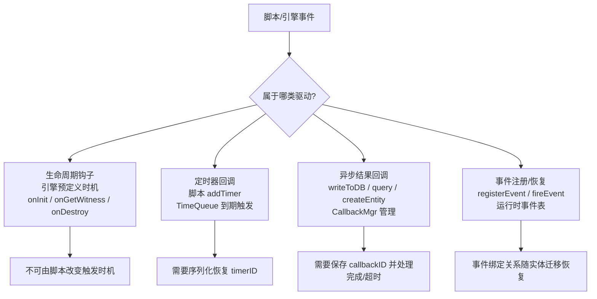
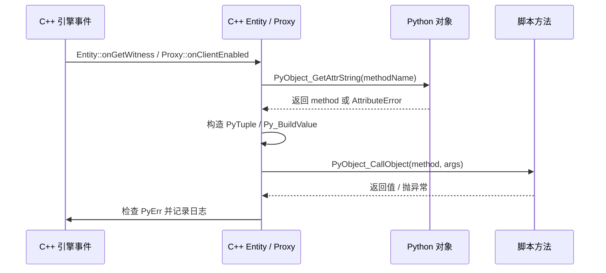

# 18. 钩子、回调、定时器与事件

> 这一章先建立主线理解：引擎怎么驱动脚本行为，`onInit` / `addTimer` / `writeToDB callback` / `registerEvent` 四种机制各有什么不同。涉及某个点需要继续追源码时，再跳到对应的源码学习专题。

## 相关 API 回查

- BaseApp 脚本接口：[KBEngine(baseapp)](/api/kbengine/baseapp/KBEngine.md)、[Entity(baseapp)](/api/kbengine/baseapp/Entity.md)、[Proxy(baseapp)](/api/kbengine/baseapp/Proxy.md)
- CellApp 脚本接口：[KBEngine(cellapp)](/api/kbengine/cellapp/KBEngine.md)、[Entity(cellapp)](/api/kbengine/cellapp/Entity.md)
- 关键词补充：[关键词释义](/api/kbengine/keywords.md)

## 18.1 本章核心问题

- 引擎驱动脚本行为的四大类机制分别是什么？为什么必须严格区分？
- 生命周期钩子怎么从 C++ 进入 Python？onReadyForLogin 为什么是轮询？
- CallbackMgr 的 ID→回调映射模型怎么工作？
- ScriptTimers 的 timerID 和底层 TimerHandle 是什么关系？
- 定时器和事件的恢复语义为什么重要？
- 事件是实体的运行态一部分还是外挂观察者？

## 18.1.1 本章与源码学习专题的分工

- 本章负责主线学习：先把四类机制分开，看清它们各自解决什么问题。
- 事件系统的源码细节、BigWorld 对照和使用场景，放在 [源码学习：事件系统、fireEvent 与事件总线](/architecture/source-analysis/events.md)。
- 其他专题页如果后续继续拆分，也遵循同一规则：主线章节保留学习顺序和摘要，详细调用链集中到专题页。

## 18.2 四大类严格区分

引擎驱动脚本行为的机制有四种，它们的触发方式、生命周期、恢复语义完全不同：

| 类别 | 触发方式 | 典型例子 | 谁注册 | 谁触发 | 可序列化 |
|------|---------|---------|--------|--------|---------|
| **生命周期钩子** | 引擎主动调用 | onInit / onGetWitness / onWriteToDB | 引擎预定义 | 引擎在特定时机 | 否（固定调用） |
| **定时器回调** | 脚本注册，引擎未来触发 | addTimer → onTimer | 脚本 | TimeQueue 到期 | 是 |
| **异步结果回调** | 脚本发起异步操作 | writeToDB callback / createEntityFromDBID callback | 脚本（CallbackMgr） | 操作完成时 | 是 |
| **事件注册/恢复** | 脚本注册事件响应 | registerEvent → fireEvent | 脚本 | fireEvent 调用时 | 是（实体事件表会随流迁移） |



**为什么必须严格区分**：

1. **生命周期钩子是固定协议**：引擎定义了何时调用，脚本不能改变时机
2. **定时器有恢复语义**：实体迁移到另一个进程时，定时器需要被重建
3. **异步回调有超时和取消**：CallbackMgr 需要管理回调的生命周期
4. **事件是动态绑定的**：运行时注册/取消，需要序列化以支持迁移

## 18.3 生命周期钩子：引擎主动调用

### KBEngine 的核心钩子

```cpp
// 文件：kbe/src/server/cellapp/entity.cpp（简化）

// 实体创建完成
void Entity::onInitializeScript()
{
    // C++ → Python: 调用实体脚本的 __init__ 方法
}

// 实体获得 Witness（有客户端连上了）
void Entity::onGetWitness()
{
    CALL_ENTITY_AND_COMPONENTS_METHOD(this,
        SCRIPT_OBJECT_CALL_ARGS0(pyTempObj, "onGetWitness", GETERR));
}

// 实体即将写入数据库
void Entity::onWriteToDB()
{
    CALL_ENTITY_AND_COMPONENTS_METHOD(this,
        SCRIPT_OBJECT_CALL_ARGS0(pyTempObj, "onWriteToDB", GETERR));
}
```

### BaseApp 级别的钩子

```cpp
// 文件：kbe/src/server/baseapp/baseapp.cpp（简化）

// 所有 BaseApp 准备就绪
void Baseapp::onBaseAppReady()
{
    // 通知脚本层
    SCOPED_PROFILE(BAPP_READY_PROFILE);
    // 调用 KBEngine.onBaseAppReady()
}

// 服务器准备接受登录
void Baseapp::onReadyForLogin()
{
    // 轮询调用 KBEngine.onReadyForLogin()
    // 返回 Py_True 表示准备好
    // 返回 float 表示初始化进度，之后继续轮询
}
```

### BigWorld 的对应钩子

```cpp
// 文件：BigWorld-Engine-14.4.1/programming/bigworld/server/baseapp/base.cpp（简化）

// Base 实体登录成功
// Script::call(PyObject_GetAttrString(this, "onLoggedOn"), ...)

// Base 实体销毁
// Script::call(PyObject_GetAttrString(this, "onDestroy"), ...)

// 获得/失去 Cell
// if (haveCell) Script::call(pMethod, PyTuple_New(0), "onGetCell");
// else          Script::call(pMethod, PyTuple_New(0), "onLoseCell");

// 写入数据库
// Script::call(PyObject_GetAttrString(this, "onWriteToDB"), ...)
```

### C++ → Python 调用路径



**onReadyForLogin 的轮询模式**：

```
Baseapp::onReadyForLogin()
  │
  ├── 第 1 次调用
  │     Python: KBEngine.onReadyForLogin() → return 0.0（还没准备好）
  │     → 下次 tick 继续调用
  │
  ├── 第 2 次调用
  │     Python: KBEngine.onReadyForLogin() → return 35.0
  │     → 继续等待
  │
  ├── ...
  │
  └── 第 N 次调用
        Python: KBEngine.onReadyForLogin() → return True（准备好了）
        → 通知 LoginApp 可以接受玩家登录

为什么是轮询：服务器启动时可能需要等待各种条件满足
（数据库连接、配置加载、跨服同步等），
脚本层判断"何时准备好"，引擎反复询问直到确认。
```

## 18.4 ScriptTimers：定时器回调

### 定时器的双层 ID 机制

```
脚本层 timerID  ←→  引擎层 TimerHandle

脚本调用: addTimer(5秒, 0, userArg)
  │
  ├── ScriptTimers::addTimer(initialOffset, repeatOffset, userArg, handler)
  │     → 生成 ScriptID（连续递增的整数）
  │     → 注册到底层 TimeQueue：timers.add(time, interval, handler)
  │     → 返回 TimerHandle
  │     → 保存映射：map_[scriptID] = timerHandle
  │
  ├── 脚本获得 timerID（ScriptID）
  │     → 脚本用 timerID 管理定时器（delTimer(timerID)）
  │
  └── TimeQueue 到期触发
        → TimerHandler::handleTimeout(handle, pUser)
        → EntityScriptTimerHandler::handleTimeout()
        → 调用 Python: entity.onTimer(timerID, userArg)
```

### ScriptTimers 类

```cpp
// 文件：kbe/src/lib/server/script_timers.h（简化）
class ScriptTimers
{
public:
    typedef int32 ScriptID;

    ScriptID addTimer(float initialOffset, float repeatOffset,
        int userArg, TimerHandler* pHandler);
    bool delTimer(ScriptID timerID);
    void releaseTimer(TimerHandle handle);
    void cancelAll();

    typedef std::map<ScriptID, TimerHandle> Map;
    Map& map() { return map_; }

    void directAddTimer(ScriptID tid, TimerHandle handle);

private:
    Map map_;                  // ScriptID → TimerHandle 映射
    ScriptID getNewID();
};
```

### 定时器的恢复语义

实体迁移到另一个 CellApp 时，定时器状态需要完整恢复：

```cpp
// 文件：kbe/src/server/cellapp/entity.cpp（简化）

// 序列化定时器到流
void Entity::addTimersToStream(KBEngine::MemoryStream& s)
{
    ScriptTimers::Map& map = scriptTimers_.map();
    uint32 size = map.size();
    s << size;

    ScriptTimers::Map::const_iterator iter = map.begin();
    while (iter != map.end())
    {
        s << iter->first;    // ScriptID

        uint32 time, interval;
        void* pUser;
        Cellapp::getSingleton().timers().getTimerInfo(
            iter->second, time, interval, pUser);

        int32 userData = int32(uintptr(pUser));
        s << time << interval << userData;
        ++iter;
    }
}

// 从流中恢复定时器
void Entity::createTimersFromStream(KBEngine::MemoryStream& s)
{
    uint32 size;
    s >> size;

    for (uint32 i = 0; i < size; ++i)
    {
        ScriptID tid;
        uint32 time, interval;
        int32 userData;
        s >> tid >> time >> interval >> userData;

        EntityScriptTimerHandler* pHandler = new EntityScriptTimerHandler(this);
        TimerHandle timerHandle = Cellapp::getSingleton().timers().add(
            time, interval, pHandler, (void*)(intptr_t)userData);
        scriptTimers_.directAddTimer(tid, timerHandle);
    }
}
```

**恢复的关键**：ScriptID 保持不变。即使实体迁移到另一个进程，脚本层的 timerID 不变——脚本代码不需要感知迁移。

### BigWorld TimerController 的恢复

```cpp
// 文件：BigWorld-Engine-14.4.1/programming/bigworld/server/cellapp/timer_controller.hpp（简化）
class TimerController : public Controller
{
    DECLARE_CONTROLLER_TYPE(TimerController)

public:
    TimerController(GameTime start = 0, GameTime interval = 0);

    virtual void startReal(bool isInitialStart);
    virtual void stopReal(bool isFinalStop);

    void handleTimeout();
    void onHandlerRelease();

    // Controller 序列化（跨 Cell 迁移时自动调用）
    virtual void writeRealToStream(BinaryOStream& stream);
    virtual bool readRealFromStream(BinaryIStream& stream);

private:
    class Handler : public TimerHandler
    {
        void handleTimeout(TimerHandle handle, void* pUser);
        void onRelease(TimerHandle handle, void* pUser);
    };

    Handler* pHandler_;
    GameTime start_;
    GameTime interval_;
    TimerHandle timerHandle_;
};
```

BigWorld 把定时器封装为 Controller——通过 Controller 的序列化机制（`writeRealToStream` / `readRealFromStream`）自动恢复，无需单独的 addTimersToStream。

## 18.5 CallbackMgr：异步结果回调

### 为什么需要回调管理器

异步操作（如写库、查询）发出后不会立即返回结果。脚本需要注册一个回调函数，等结果回来时执行。

```
writeToDB 流程：
  │
  ├── 脚本: entity.writeToDB(callback)
  │
  ├── CallbackMgr::save(callback)
  │     → 分配 callbackID（全局唯一）
  │     → 保存 callbackID → callback 映射
  │     → 返回 callbackID
  │
  ├── 网络消息带上 callbackID 发送到 DBMgr
  │
  ├── [DBMgr 处理写库]
  │
  ├── DBMgr 回复结果（包含 callbackID）
  │
  └── CallbackMgr::take(callbackID)
        → 取出 callback
        → 执行 callback(result)
        → 删除映射
```

### CallbackMgr 模板类

```cpp
// 文件：kbe/src/lib/server/callbackmgr.h（简化）
template<typename T>
class CallbackMgr
{
public:
    typedef std::map<CALLBACK_ID, std::pair<T, uint64>> CALLBACKS;

    // 保存回调，返回 callbackID
    CALLBACK_ID save(T callback, uint64 timeout = 0)
    {
        CALLBACK_ID cbID = idAlloc_.alloc();
        cbMap_[cbID] = std::make_pair(callback, timeout);
        return cbID;
    }

    // 取出并执行回调
    T take(CALLBACK_ID cbID)
    {
        typename CALLBACKS::iterator iter = cbMap_.find(cbID);
        if (iter == cbMap_.end())
            return NULL;
        T callback = iter->second.first;
        cbMap_.erase(iter);
        return callback;
    }

    // 超时检查（tick 中调用）
    void tick()
    {
        // 检查超时的回调并清理
    }

    // 序列化（用于进程迁移）
    void addToStream(KBEngine::MemoryStream& s);
    void createFromStream(KBEngine::MemoryStream& s);

protected:
    CALLBACKS cbMap_;                        // callbackID → (callback, timeout)
    IDAllocate<CALLBACK_ID> idAlloc_;        // ID 分配器
    uint64 lastTimestamp_;
};
```

### Python 回调的特化

```cpp
// Python 回调管理器
typedef CallbackMgr<PyObjectPtr> PY_CALLBACKMGR;

// Python 回调的序列化（pickle Python 对象）
template<>
inline void CallbackMgr<PyObjectPtr>::addToStream(KBEngine::MemoryStream& s)
{
    uint32 size = (uint32)cbMap_.size();
    s << idAlloc_.lastID() << size;

    CALLBACKS::iterator iter = cbMap_.begin();
    for (; iter != cbMap_.end(); ++iter)
    {
        s << iter->first;
        // 用 pickle 序列化 Python 回调对象
        s.appendBlob(script::Pickler::pickle(iter->second.first.get()));
        s << iter->second.second;
    }
}

template<>
inline void CallbackMgr<PyObjectPtr>::createFromStream(KBEngine::MemoryStream& s)
{
    CALLBACK_ID v;
    s >> v;
    idAlloc_.lastID(v);

    uint32 size;
    s >> size;

    for (uint32 i = 0; i < size; ++i)
    {
        CALLBACK_ID cbID;
        s >> cbID;

        std::string data;
        s.readBlob(data);
        PyObject* pyCallback = script::Pickler::unpickle(data);

        uint64 timeout;
        s >> timeout;

        if (pyCallback && cbID != 0)
        {
            cbMap_[cbID] = std::make_pair(PyObjectPtr(pyCallback), timeout);
            Py_DECREF(pyCallback);
        }
    }
}
```

**关键**：Python 回调对象通过 `pickle` 序列化，所以这里只能安全地依赖那些实际可被 `Pickler` 处理的回调对象。不要把这等同于"任何 Python 可调用对象都能跨迁移恢复"。

### CallbackMgr 的使用场景

| 场景 | 发起方 | 异步操作 | 回调参数 |
|------|--------|---------|---------|
| writeToDB | CellApp → DBMgr | 写入数据库 | (dbid, success) |
| createEntityFromDBID | BaseApp → DBMgr | 从数据库创建实体 | (entity, success) |
| executeRawDatabaseCommand | 任意 → DBMgr | 执行 SQL | (result, error) |
| accountLogin | LoginApp → DBMgr | 账号验证 | (accountInfo, error) |

```
CallbackMgr 的生命周期：

save(callback) → 分配 ID → 发送请求
  │
  ├── 正常流程：收到回复 → take(ID) → 执行回调 → 清理
  │
  ├── 超时流程：tick() 检测超时 → 清理（不执行回调）
  │
  └── 迁移流程：addToStream() → 迁移到新进程 → createFromStream() → 恢复回调表
```

### 与 BigWorld TwoWay + PyDeferred 的对比

```
KBEngine CallbackMgr:
  callbackMgr.save(pyCallback) → callbackID
  → 发送请求(callbackID)
  → 收到回复 → callbackMgr.take(callbackID) → pyCallback(result)

BigWorld TwoWay + PyDeferred:
  bundle.startRequest(ie, pHandler) → replyID
  → RequestManager 注册 replyID → ReturnValuesHandler
  → 收到回复 → ReturnValuesHandler::handleMessage()
  → deferred_.callback(result) 或 deferred_.errback(error)
  → Python 脚本的 Deferred 链式回调
```

**本质相同**：都是 ID→回调映射。BigWorld 多了 errback 链和组合能力（Ch11）。

如果你关心的不是“`CallbackMgr` 在底层怎么工作”，而是“在纯单向消息流里，业务层应该怎么优雅地拿结果、避免回调地狱”，请继续看 [Ch11.11 单向消息流下，如何优雅地“拿结果”](./11-rpc-entitycall-and-communication-patterns.md#1111-单向消息流下如何优雅地拿结果)：

- 那一节讨论的是工程化解法与建模方式
- 这里这一节讨论的是 `CallbackMgr` 这个具体机制本身

## 18.6 事件注册/恢复：运行时的事件响应关系

> 本节只保留主线说明。`fireEvent/registerEvent/deregisterEvent` 的架构边界、源码细节、BigWorld 对照和使用场景，见 [源码解析：事件系统、fireEvent 与事件总线](/architecture/source-analysis/events.md)。

### 问题

事件（如"升级"事件）不是 .def 定义的属性或方法——它是运行时动态注册的响应关系。当实体迁移时，这些动态关系需要被完整恢复。

### KBEngine 事件系统

```cpp
// 文件：kbe/src/server/cellapp/entity.cpp（简化）

// 注册事件
void Entity::registerEvent(const std::string& eventName, PyObject* pyCallback)
{
    ENTITY_EVENTS& eventsMap = events();
    eventsMap[eventName].push_back(PyObjectPtr(pyCallback));
}

// 取消注册
void Entity::deregisterEvent(const std::string& eventName, PyObject* pyCallback)
{
    ENTITY_EVENTS& eventsMap = events();
    // 从 eventsMap[eventName] 中移除 pyCallback
}

// 触发事件
void Entity::fireEvent(const std::string& eventName, PyObject* args)
{
    ENTITY_EVENTS& eventsMap = events();
    ENTITY_EVENTS::iterator iter = eventsMap.find(eventName);
    if (iter == eventsMap.end())
        return;

    std::vector<PyObjectPtr>& callbacks = iter->second;
    for (size_t i = 0; i < callbacks.size(); ++i)
    {
        PyObject_CallObject(callbacks[i].get(), args);
    }
}
```

### 事件的序列化恢复

```cpp
// 序列化事件到流
void Entity::addEventsToStream(KBEngine::MemoryStream& s)
{
    ENTITY_EVENTS& eventsMap = events();
    int eventNameSize = eventsMap.size();
    s << eventNameSize;

    ENTITY_EVENTS::const_iterator mapiter = eventsMap.begin();
    for (; mapiter != eventsMap.end(); ++mapiter)
    {
        int eventSize = mapiter->second.size();
        s << mapiter->first << eventSize;

        // 保存回调的限定名（而非对象本身）
        std::vector<PyObjectPtr>::const_iterator vecIter = mapiter->second.begin();
        for (; vecIter != mapiter->second.end(); ++vecIter)
        {
            PyObject* pyObj = PyObject_GetAttrString(
                (*vecIter).get(), "__qualname__");
            const char* ccattr = PyUnicode_AsUTF8AndSize(pyObj, NULL);
            s << ccattr;
            S_RELEASE(pyObj);
        }
    }
}

// 从流中恢复事件
void Entity::createEventsFromStream(KBEngine::MemoryStream& s)
{
    ENTITY_EVENTS& eventsMap = events();
    eventsMap.clear();

    int eventNameSize;
    s >> eventNameSize;

    while (eventNameSize-- > 0)
    {
        std::string eventName;
        s >> eventName;

        int eventSize;
        s >> eventSize;

        while (eventSize-- > 0)
        {
            std::string callbackName;
            s >> callbackName;

            if (callbackName == "None") continue;

            // 通过限定名恢复回调函数引用
            // "Avatar.onLevelUp" → getattr(self, "onLevelUp")
            std::vector<std::string> callBackNameVec;
            KBEngine::strutil::kbe_split(callbackName, '.', callBackNameVec);

            PyObject* pyCallback = NULL;
            if (callBackNameVec.size() >= 2)
            {
                PyObject* pyObj = PyObject_GetAttrString(
                    this, callBackNameVec[0].c_str());
                pyCallback = PyObject_GetAttrString(
                    pyObj, callBackNameVec[1].c_str());
                Py_DECREF(pyObj);
            }
            else
            {
                pyCallback = PyObject_GetAttrString(
                    this, callBackNameVec[0].c_str());
            }

            registerEvent(eventName, pyCallback);
            Py_DECREF(pyCallback);
        }
    }
}
```

**关键设计**：事件回调不直接序列化 Python 对象（不像 CallbackMgr 用 pickle），而是保存**方法的限定名**（如 `"Avatar.onLevelUp"`）。恢复时通过 `getattr` 重新查找。原因是：

1. 事件回调通常是实体自身的方法（`self.onLevelUp`），不需要序列化闭包
2. 限定名比 pickle 更稳定——实体重建后方法引用仍然有效
3. 限定名更紧凑——一个字符串 vs 序列化的 Python 对象

### BigWorld ScriptEvents

```cpp
// 文件：BigWorld-Engine-14.4.1/programming/bigworld/lib/pyscript/script_events.cpp（简化）
class ScriptEvents
{
public:
    void createEventType(const char* eventName);
    bool triggerEvent(const char* eventName, PyObject* pArgs,
        ScriptList resultsList);
    bool addEventListener(const char* eventName, PyObject* pListener,
        int level = 0);
    bool removeEventListener(const char* eventName, PyObject* pListener);

    static ScriptEvents* instance();
};
```

BigWorld 的 ScriptEvents 是**全局单例**——所有实体共享同一个事件总线。KBEngine 的事件是**实体级**——每个实体维护自己的事件表。

```
KBEngine 事件（实体级）：
  entity.registerEvent("onLevelUp", self.onLevelUp)
  entity.fireEvent("onLevelUp", args)
  → 只有该实体注册的回调被触发

BigWorld ScriptEvents（全局级）：
  BigWorld.addEventListener("onSpaceLoaded", callback)
  BigWorld.triggerEvent("onSpaceLoaded", args)
  → 所有注册了该事件的回调都被触发
```

### 事件是实体的运行态

```
实体迁移（Offload）时需要恢复的内容：

┌─────────────────────────────────┐
│  实体持久状态（写库）              │
│  .def 中 Persistent=true 的属性   │
└─────────────────────────────────┘

┌─────────────────────────────────┐
│  实体运行态（不写库，迁移时恢复）   │
│  1. 定时器（ScriptTimers）        │
│  2. 回调（CallbackMgr）           │
│  3. 事件注册（ENTITY_EVENTS）     │
│  4. Controller 状态               │
│  5. Witness / AOI 关系            │
└─────────────────────────────────┘
```

事件、定时器、回调都是**实体的运行态**——不是持久化数据，但在实体迁移时必须恢复。这就是为什么它们都有 `addToStream` / `createFromStream` 方法。

## 18.7 两套项目的脚本行为机制对比

| 维度 | KBEngine | BigWorld |
|------|----------|----------|
| 生命周期钩子 | CALL_ENTITY_AND_COMPONENTS_METHOD 宏 | Script::call() |
| onReadyForLogin | 轮询直到返回 > 0 | 类似 |
| 定时器管理 | `ScriptTimers`（`Map<ScriptID, TimerHandle>`） | `TimerController`（`Controller` 封装） |
| 定时器序列化 | addTimersToStream / createTimersFromStream | Controller 自带序列化 |
| 回调管理 | `CallbackMgr<PyObjectPtr>` 模板类 | `RequestManager + PyDeferred` |
| 回调序列化 | Pickle Python 对象 | 内置于 TwoWay 机制 |
| 事件作用域 | 实体级（每个实体维护事件表） | 全局级（ScriptEvents 单例） |
| 事件序列化 | 方法限定名字符串 | 无（全局事件不需要迁移） |
| 事件回调恢复 | getattr + 限定名重建引用 | 无需恢复 |

**核心差异**：

1. **定时器封装层级**：KBEngine 用独立的 ScriptTimers 类，BigWorld 把定时器封装为 Controller——利用 Controller 的 Ghost/Real 生命周期和序列化机制统一管理

2. **回调可组合性**：KBEngine 的 CallbackMgr 是简单的 ID→回调映射。BigWorld 的 PyDeferred 支持 `addCallback(f1).addCallback(f2)` 链式组合

3. **事件作用域**：KBEngine 的事件是实体级的，需要序列化恢复。BigWorld 的事件是全局的，不需要迁移

4. **序列化策略**：KBEngine 定时器直接序列化时间参数，事件用方法限定名。BigWorld 通过 Controller 框架统一序列化

## 18.8 关键源码入口

### KBEngine

| 概念 | 文件 |
|------|------|
| ScriptTimers | `kbe/src/lib/server/script_timers.h` |
| 定时器序列化 | `kbe/src/server/cellapp/entity.cpp`（addTimersToStream / createTimersFromStream） |
| CallbackMgr | `kbe/src/lib/server/callbackmgr.h` |
| 事件注册/恢复 | `kbe/src/server/cellapp/entity.cpp`（addEventsToStream / createEventsFromStream） |
| 生命周期钩子 | `kbe/src/server/cellapp/entity.cpp`（onGetWitness / onWriteToDB） |
| BaseApp 钩子 | `kbe/src/server/baseapp/baseapp.cpp`（onBaseAppReady / onReadyForLogin） |

### BigWorld

| 概念 | 文件 |
|------|------|
| ScriptTimers | `BigWorld-Engine-14.4.1/programming/bigworld/lib/server/script_timers.hpp` |
| TimerController | `BigWorld-Engine-14.4.1/programming/bigworld/server/cellapp/timer_controller.hpp` |
| Controller 基类 | `BigWorld-Engine-14.4.1/programming/bigworld/server/cellapp/controller.hpp` |
| ScriptEvents | `BigWorld-Engine-14.4.1/programming/bigworld/lib/pyscript/script_events.cpp` |
| Script::call | `BigWorld-Engine-14.4.1/programming/bigworld/lib/pyscript/py_callback.cpp` |
| Base 生命周期 | `BigWorld-Engine-14.4.1/programming/bigworld/server/baseapp/base.cpp` |

## 18.9 源码走读路径

### 路径一：理解定时器的注册、触发和恢复

1. `kbe/src/lib/server/script_timers.h` — `ScriptTimers` 类，`Map<ScriptID, TimerHandle>`
2. `kbe/src/server/cellapp/entity.cpp` — `addTimersToStream()` / `createTimersFromStream()`
3. `BigWorld-Engine-14.4.1/programming/bigworld/server/cellapp/timer_controller.hpp` — TimerController 作为 Controller

### 路径二：理解 CallbackMgr 的完整流程

1. `kbe/src/lib/server/callbackmgr.h` — `save()` / `take()` / `addToStream()` / `createFromStream()`
2. `kbe/src/server/cellapp/entity.cpp` — writeToDB 如何使用 CallbackMgr

### 路径三：理解事件的序列化恢复

1. `kbe/src/server/cellapp/entity.cpp` — `addEventsToStream()` / `createEventsFromStream()`
2. `BigWorld-Engine-14.4.1/programming/bigworld/lib/pyscript/script_events.cpp` — ScriptEvents 全局事件

## 18.10 小结

- **四大类机制严格区分**：生命周期钩子（引擎调用）、定时器（未来触发）、异步回调（结果回调）、事件（运行时注册）
- **生命周期钩子通过 getattr + PyObject_CallObject 从 C++ 进入 Python**：引擎在特定时机主动调用脚本方法
- **onReadyForLogin 是轮询模式**：引擎反复调用直到脚本返回"准备好了"
- **ScriptTimers 用双层 ID**：脚本层 ScriptID + 引擎层 TimerHandle，迁移时保持 ScriptID 不变
- **定时器的恢复语义**：序列化 time/interval/userArg → 在新进程重建定时器 → 脚本无感知
- **CallbackMgr 是 ID→回调映射**：save 分配 ID，take 取出回调，支持超时清理和序列化恢复
- **Python 回调通过 pickle 序列化**：CallbackMgr 特化版本用 Pickler 保存/恢复 Python 对象
- **事件用方法限定名而非 pickle 恢复**：保存 `"Avatar.onLevelUp"` → 恢复时 `getattr(self, "onLevelUp")`
- **事件是实体的运行态**：不持久化到数据库，但迁移时必须恢复
- **KBEngine 事件是实体级的，BigWorld 是全局级的**：前者需要序列化恢复，后者不需要
