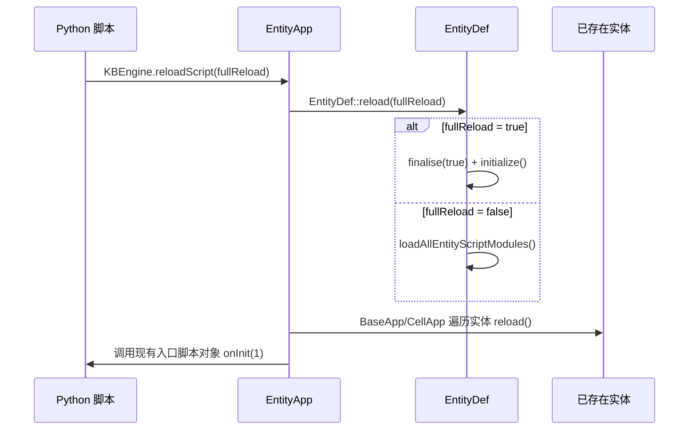
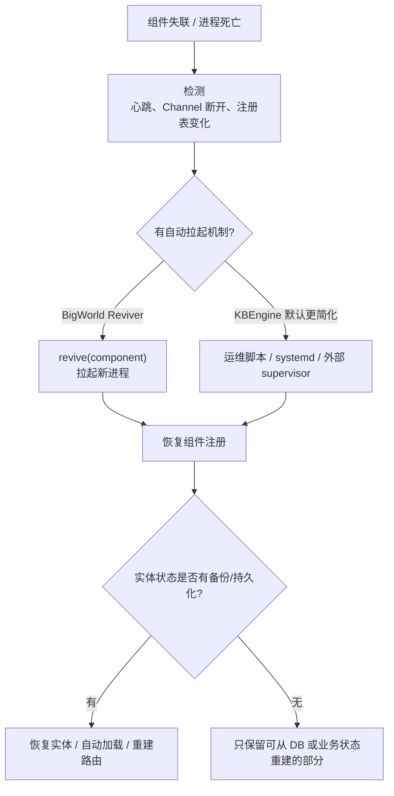
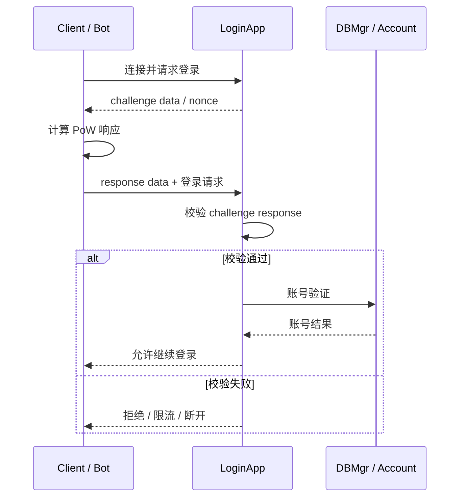

# Ch21 热更新

> **核心问题**：`reloadScript` 到底更新了什么、没有更新什么？为什么热更新后会出现旧函数、旧类、旧全局变量仍然被调用？线上应该怎样发布、排查和兜底？

## 相关 API 回查

- BaseApp 管理接口：[KBEngine(baseapp)](/api/baseapp/KBEngine.md)、[Proxy(baseapp)](/api/baseapp/Proxy.md)
- Login / DB / Interfaces / Logger：[KBEngine(loginapp)](/api/loginapp/KBEngine.md)、[KBEngine(dbmgr)](/api/dbmgr/KBEngine.md)、[KBEngine(interfaces)](/api/interfaces/KBEngine.md)、[KBEngine(logger)](/api/logger/KBEngine.md)
- Bots 压测接口：[KBEngine(bots)](/api/bots/KBEngine.md)、[PyClientApp(bots)](/api/bots/PyClientApp.md)

## 21.1 热更新：不停服修改 Python 行为的主要入口

### 21.1.1 为什么热更新对 MMO 如此重要

MMO 服务器 24×7 运行，一次全服停机维护意味着几十万玩家同时掉线。Python 脚本层的 bug（逻辑错误、数值配置错误、AI 行为异常）占了线上问题的大多数——这些不需要重编译 C++，只需重新加载 Python 模块。

但热更新不是“把进程状态整体替换成新版本”。它只会沿着引擎设计好的路径更新一部分 Python 模块、实体类型和入口回调；所有已经被外部容器保存的 Python 对象引用、闭包、bound method、timer callback、单例缓存，都可能继续指向旧对象。

生产安全规则应该是：**优先改行为，谨慎改结构，显式处理旧引用**。`fullReload=true` 在源码层面可以重建实体定义，但结构性变化会触及协议、持久化和客户端兼容，不能当作普通线上热更新随意使用。

### 21.1.2 热更新必须先懂的 Python 元信息

热更新问题的本质不是“文件是否重新加载”，而是进程里正在被调用的 Python 对象是否仍然是同一个 identity。`id()`、`__dict__`、`__globals__`、`__func__`、`__self__` 这些元信息，正是用来判断对象引用是否已经分叉的证据。

#### 模块对象与 `__dict__`

Python 导入一个模块时，会创建一个 module object，并放进 `sys.modules`：

```python
import sys

mod = sys.modules["interfaces.Interface_FootballGuessMgr"]
print(mod.__dict__ is vars(mod))  # True
```

模块里的顶层变量、函数、类，本质上都是 `mod.__dict__` 里的名字绑定。访问 `mod.FootballGuessRedisConfig`，等价于从当前模块字典里查 `"FootballGuessRedisConfig"`。

`from X import Y` 容易在热更新里制造旧引用：

```python
# a.py
class Config:
    pass

# b.py
from a import Config
```

这不是动态链接，而是把当时的 `a.Config` 对象引用赋给 `b.__dict__["Config"]`。后续 `a.Config` 被新类重绑，`b.Config` 不会自动变成新对象。

#### 函数对象与 `__globals__`

`def` 语句会创建一个 function object。函数对象不是只有一段代码，它还保存一组运行所需的元信息：

| 元信息 | 含义 | 热更新排查价值 |
|--------|------|----------------|
| `__code__` | 字节码、常量表、局部变量表 | 判断当前执行的是哪版代码 |
| `__globals__` | 函数创建时绑定的全局名字空间字典 | `LOAD_GLOBAL` 查这里，不是每次按模块名查 `sys.modules` |
| `__defaults__` / `__kwdefaults__` | 默认参数对象 | 默认参数里也可能藏旧对象 |
| `__closure__` | 闭包 cell | 闭包结构变化时很难原地 patch |
| `__module__` / `__qualname__` | 归属模块名和限定名 | 只能说明来源名字，不能证明对象仍是当前对象 |

关键点是：函数执行 `FootballGuessRedisConfig.get()` 这类全局名字查找时，查的是 `func.__globals__["FootballGuessRedisConfig"]`。如果旧函数对象仍然活着，它的 `__globals__` 可能不是当前 `sys.modules[func.__module__].__dict__`。

所以这个判断非常关键：

```python
f = getattr(cls.do_settle_one_match, "__func__", cls.do_settle_one_match)
print(f.__globals__ is sys.modules[f.__module__].__dict__)
```

如果输出 `False`，说明这个函数已经脱离当前模块名字空间。此时 telnet 里手工查 `sys.modules[module].FootballGuessRedisConfig` 看到的是新类，但旧函数运行时仍可能从旧 `__globals__` 里取到旧类。

#### 类对象、类属性与 `__dict__`

`class` 语句同样会创建一个新的 class object。类属性保存在类对象自己的 `__dict__` 里：

```python
class Config:
    cache = {}
```

如果热更新后旧类和新类同时存在，那么它们是两个不同对象，也就各有一份类属性：

```text
旧 Config.cache
新 Config.cache
```

这就是“用类 + `@classmethod` 当全局单例”的核心风险。`@classmethod` 不会让类变成进程级唯一对象；它只是在访问方法时把“当前拿到的 class object”作为 `cls` 传进去。旧调用路径拿到旧类，`cls.cache` 就读旧缓存；新调用路径拿到新类，`cls.cache` 就读新缓存。

#### 函数、bound method、`__func__` 与 `__self__`

类里的普通函数是 descriptor。通过实例或类访问时，Python 可能返回原始函数，也可能返回 bound method：

| 访问方式 | Python 3 结果 | 关键元信息 |
|----------|---------------|------------|
| `obj.method` | bound method | `m.__func__` 是原始函数，`m.__self__` 是 `obj` |
| `Cls.method` | function object | 没有绑定实例 |
| `Cls.class_method` | bound method | `m.__func__` 是原始函数，`m.__self__` 是 `Cls` |
| `Cls.static_method` | function object | 不绑定 `self` 或 `cls` |

因此排查时常用这句：

```python
real_func = getattr(obj_or_method, "__func__", obj_or_method)
```

它的作用是：如果拿到的是 bound method，就解包成底层 function object；如果本来就是 function object，就原样返回。只有拿到底层 function object，才能稳定检查 `__code__`、`__globals__`、`__closure__`。

`__self__` 则用于判断这个 method 绑定到了谁：

```python
m = FootballGuessRedisConfig.get
print(m.__func__)  # classmethod 底层函数
print(m.__self__)  # 当前绑定的类对象
```

如果同名 `FootballGuessRedisConfig.get` 在不同路径下的 `m.__self__` 不同，就说明进程里已经出现旧类和新类并存。

#### callable 与闭包的关系

`callable` 是“能被 `x(...)` 调用的对象”的总称，闭包只是其中一种。timer、事件表、RPC handler 表保存的通常不是“闭包”这个特殊结构，而是任意 callable。

| callable 形态 | 示例 | 旧引用位置 |
|---------------|------|------------|
| 模块函数 | `module_func` | `func.__globals__` |
| bound method | `self.method` | `method.__func__`、`method.__self__` |
| classmethod bound method | `SomeClass.class_method` | `method.__func__`、`method.__self__`，其中 `__self__` 是 class object |
| lambda / 内部函数 | `lambda tid: cfg.get(tid)` | `func.__globals__` 和可能存在的 `func.__closure__` |
| partial | `functools.partial(func, arg)` | `partial.func`、`partial.args`、`partial.keywords` |
| 可调用实例 | `obj` 且定义了 `obj.__call__` | 实例自身字段和 `obj.__class__` |

闭包的特征是函数引用了外层局部变量，并把这些变量放进 `__closure__`。如果字节码里看到 `LOAD_DEREF`，通常说明在读闭包 cell；如果看到 `LOAD_GLOBAL`，通常说明在读 `__globals__`。

```python
def make_callback(cfg):
    def callback(timer_id):
        return cfg.get(timer_id)  # cfg 在 callback.__closure__ 里
    return callback
```

所以 timer 容易出问题，不是因为 timer 一定是闭包，而是因为 timer 长期保存了某个 callable 的旧对象引用。闭包只是其中一种旧引用形态。

#### descriptor、decorator 与 `xreload`

`classmethod`、`staticmethod`、`property` 都是 descriptor 包装对象，不是普通函数。热更新工具如果只用 `getattr(cls, name)` 比较新旧属性，拿到的可能已经是 descriptor 执行后的结果，而不是类 `__dict__` 里真正保存的对象。

Plone 的 issue #11 说的就是这个边界：Python 3 里访问 `@classmethod` 会返回 method object，不是裸 function。热更新实现如果没有先做：

```python
func = getattr(value, "__func__", value)
```

就可能把 method 当 function 处理，导致 classmethod 没有被正确原地更新。

#### 闭包与 `super()`

闭包变量保存在 `func.__closure__` 里，不在 `func.__globals__` 里。`xreload` 可以替换 `__code__`，但如果新旧函数的闭包 cell 数量或含义变了，通常不能安全原地 patch。

Python 3 的零参数 `super()` 也依赖隐藏的 `__class__` closure：

```python
class Child(Base):
    def run(self):
        return super().run()
```

这类函数内部并不是完全靠名字查找当前类，而是带着创建函数时绑定的 `__class__` cell。热更新后如果旧函数、新类、旧类混在一起，`super()` 的解析链就可能不符合预期。Plone 的 issue #1 讨论的就是这类 `super()` 方法热更新不可靠的问题。

#### 读热更新现场时应该看什么

排查旧对象时，不要只看名字相同。名字相同只说明 `__module__` / `__qualname__` 一样，不能证明对象一样。应该优先看：

| 证据 | 说明 |
|------|------|
| `id(obj)` | 是否同一个 Python 对象 |
| `func.__globals__ is mod.__dict__` | 函数是否仍使用当前模块名字空间 |
| `func.__globals__["Config"] is mod.Config` | 函数看到的全局类是否是当前类 |
| `method.__self__` | bound method 绑定的是哪个实例或类 |
| `method.__func__` | 多个 method 是否共享同一个底层函数 |
| `cls.__dict__` | 类属性缓存是否分裂到旧类和新类上 |

后面的 `xreload` 取舍、timer 风险和线上排查命令，都是围绕这些对象 identity 和名字空间关系展开的。

### 21.1.3 KBEngine 热更新实现

KBEngine 的热更新入口是 `KBEngine.reloadScript(fullReload)`，注册在 BaseApp 和 CellApp 的 Python 模块上：



```cpp
// kbe/src/server/baseapp/baseapp.cpp
// 脚本模块注册
APPEND_SCRIPT_MODULE_METHOD(getScript().getModule(),
    reloadScript, __py_reloadScript, METH_VARARGS, 0);
```

调用链从 Python 到 C++：

```cpp
// kbe/src/lib/server/entity_app.h

template<class E>
void EntityApp<E>::reloadScript(bool fullReload)
{
    EntityDef::reload(fullReload);     // 1. 重新加载实体定义
    onReloadScript(fullReload);         // 2. 子类回调

    // 3. 重新调用入口脚本的 onInit(1)
    PyObject* pyResult = PyObject_CallMethod(getEntryScript().get(),
                                        const_cast<char*>("onInit"),
                                        const_cast<char*>("i"),
                                        1);    // 1 = reload mode
    // ...
}
```

三层执行过程：

1. **`EntityDef::reload(fullReload)`**：重新加载实体定义模块
   - `fullReload = true`：完全重新初始化所有 `ScriptDefModule`（先 `finalise(true)` 再 `initialize()`）
   - `fullReload = false`：仅重新加载 Python 脚本模块（`loadAllEntityScriptModules`）

```cpp
// kbe/src/lib/entitydef/entitydef.cpp

void EntityDef::reload(bool fullReload)
{
    g_isReload = true;
    script::entitydef::reload(fullReload);

    if (fullReload) {
        // 保存旧的脚本模块 UType 映射
        // ...
        bool ret = finalise(true);
        KBE_ASSERT(ret && "EntityDef::reload: finalise error!");
        ret = initialize(EntityDef::__scriptBaseTypes, EntityDef::__loadComponentType);
        KBE_ASSERT(ret && "EntityDef::reload: initialize error!");
    } else {
        loadAllEntityScriptModules(EntityDef::__entitiesPath, EntityDef::__scriptBaseTypes);
    }
}
```

2. **`onReloadScript(fullReload)`**：遍历所有已存在的实体，调用每个实体的 `reload()`

```cpp
// kbe/src/server/baseapp/baseapp.cpp / kbe/src/server/cellapp/cellapp.cpp

void Baseapp::onReloadScript(bool fullReload)
{
    Entities<Entity>::ENTITYS_MAP& entities = pEntities_->getEntities();
    Entities<Entity>::ENTITYS_MAP::iterator eiter = entities.begin();
    for(; eiter != entities.end(); ++eiter)
    {
        static_cast<Entity*>(eiter->second.get())->reload(fullReload);
    }
    EntityApp<Entity>::onReloadScript(fullReload);
}
```

实体自己的 `reload()` 在 `entity_macro.h` 里做的核心动作不是重新构造实体，而是把已有 Python 实例切到新的类对象：

```cpp
// kbe/src/lib/entitydef/entity_macro.h

if(PyObject_SetAttrString(this, "__class__",
        (PyObject*)pScriptModule_->getScriptType()) == -1)
{
    // ...
    return false;
}

initProperty(true);
return _reload(fullReload);
```

3. **入口脚本 `onInit(1)`**：通知 Python 层“热更新完成”

这一步容易误读。`EntityApp<E>::reloadScript()` 里是对 `getEntryScript().get()` 调用 `onInit(1)`，不是重新创建整个入口脚本宿主，更不是扫描所有业务单例重新绑定。

### 21.1.4 `reloadScript` 与 `xreload` 的取舍

项目里常见的疑问是：既然 KBEngine 已经有 `reloadScript`，为什么还要引入 `xreload.py`？核心原因是两者维护的是不同的不变量。

本项目使用的是 [`plone.reload`](https://github.com/plone/plone.reload) 里的 `xreload.py` 路线。这个库原本面向 Zope 2 / Plone，目标是在不重启服务的情况下重新加载配置和代码；它的 README 也明确说，点击 Reload Code 后会重新加载自上次加载以来发生变化的模块，同时提示有些代码结构无法通过这种方式可靠更新，decorator 也不总是能正确工作。

所以在 KBEngine 项目里引用 `plone.reload` 时，要把它理解为“进程内 Python 对象补丁工具”，而不是 KBEngine 官方热更新 API 的一部分。KBEngine 负责引擎知道的实体模块、实体类和存活实体 `__class__` 切换；`plone.reload` / `xreload` 尝试修补业务层已经被外部引用的旧函数和旧类。两者解决的问题不同，也会叠加各自的边界。

KBEngine 官方 `reloadScript` 偏引擎实体系统：它重载实体脚本模块、更新 `ScriptDefModule` 的实体类指针，并把已有实体的 `__class__` 切到新类。它不负责扫描和修复所有业务模块中长期保存的 Python 对象引用。

源码里实体模块加载路径是：

```cpp
// kbe/src/lib/entitydef/entitydef.cpp

PyObject* pyModule =
    PyImport_ImportModule(const_cast<char*>(moduleName.c_str()));

if (g_isReload && pyModule)
    pyModule = PyImport_ReloadModule(pyModule);
```

因此更准确的说法是：KBEngine 重新执行实体模块并重新取模块里的实体类，而不是简单地“替换整个 module 对象”。但即使 module object 没换，`from X import Y` 得到的旧对象引用也不会自动重绑。

例如：

```python
# a.py
class Config:
    pass

# b.py
from a import Config
```

如果热更新后 `a.Config` 被重新定义，`b.Config` 仍然指向旧类，除非业务显式重绑 `b.Config`。这就是很多项目认为“只靠 KBEngine reloadScript 需要重构所有引用”的原因：它要求业务避免长期保存具体函数/类对象，或者在热更新后统一重绑。

`xreload.py` 的目标正好相反：它尽量保持旧对象 identity 不变，通过原地 patch 让外部旧引用继续看到新行为。以 Plone 版本为例，它会在临时 namespace 中执行新代码，再把旧函数/旧类原地更新：

```python
def _update_function(oldfunc, newfunc):
    oldfunc.__code__ = newfunc.__code__
    oldfunc.__defaults__ = newfunc.__defaults__
    _update_scope(oldfunc.__globals__, newfunc.__globals__)
    return oldfunc
```

这对下面这种业务写法更友好：

```python
from a import Config
```

因为 `b.Config` 仍然是旧类对象，但旧类对象自身被 patch 了。

代价是 `xreload` 复杂且容易漏边界：

| 风险 | 说明 |
|------|------|
| 新增方法的 `__globals__` | 如果直接把临时 namespace 里的新函数挂到旧类上，新函数可能指向临时 globals |
| 闭包变化 | 闭包结构变化时通常不能原地 patch，只能整体替换函数 |
| descriptor / decorator | `classmethod`、`staticmethod`、`property`、自定义 descriptor 容易处理不完整 |
| 类属性删除 | 很多实现为了保留框架注入属性，不删除旧类上新版本已移除的属性 |
| 类属性迁移到模块变量 | 旧类属性可能残留，新模块变量也存在，形成双位置状态 |
| `__globals__` 同步 | 新版本可能有 `_update_scope`，老版本可能没有；即使有，也只是同步字典内容，不会替换 `__globals__` 指针 |

#### Python 热更新库和机制对比

Python 生态里常见的“热更新”其实分成两类：一类是在当前进程内重新执行模块或原地 patch 对象；另一类只是监控文件变化，然后重启 worker 进程。后者更可靠，但不满足“不丢当前进程状态”的诉求。

| 方案 | 类型 | 核心机制 | 对 KBEngine 业务的启发 |
|------|------|----------|------------------------|
| [`importlib.reload`](https://docs.python.org/3/library/importlib.html#importlib.reload) | 标准库模块重载 | 复用 module dict 重新执行模块代码，重新绑定模块内名字 | 是 `PyImport_ReloadModule` 的 Python 侧参照；`from X import Y` 和旧实例不会自动更新 |
| [`plone.reload`](https://github.com/plone/plone.reload) / `xreload.py` | 进程内原地 patch | 临时 namespace 执行新代码，再尝试更新旧 module、function、class | 项目当前采用的路线；能缓解旧引用，但要严查闭包、descriptor、类属性和 `__globals__` |
| [IPython `%autoreload`](https://ipython.readthedocs.io/en/stable/config/extensions/autoreload.html) | 交互式进程内自动重载 | 执行用户代码前自动 reload，并替换函数 code object、类的一部分属性 | 证明“from-import 旧对象原地升级”是常见需求；但官方也强调可靠 reload Python 模块很难 |
| [Jurigged](https://github.com/breuleux/jurigged) | 进程内热 patch | 监控源码变化，解析定义，替换函数 `__code__`，必要时用 `gc` 查找引用 | 思路更激进，能说明旧引用修补通常离不开 `gc` 和 code object patch；但它要求较新 Python，且不是 KBEngine 老运行时的直接方案 |
| [hupper](https://docs.pylonsproject.org/projects/hupper/en/latest/) | 文件监控 + worker 重启 | 父进程监控文件，变化后重启子进程 | 更像开发期自动重启，不是进程内热更新；优点是清理旧引用彻底，缺点是丢当前进程状态 |

对线上 MMO 来说，`hupper` 这类“检测变化后重启进程”的方案更接近滚动发布或 supervisor 能力；`plone.reload`、IPython `%autoreload`、Jurigged 才属于“尝试保留进程状态并修改 Python 行为”的范畴。前者主要解决开发效率和发布自动化，后者才会遇到本文讨论的旧函数、旧类、旧 `__globals__`、旧 bound method 问题。

所以更准确的工程结论是：

| 方案 | 主要优势 | 主要风险 |
|------|----------|----------|
| KBEngine `reloadScript` | 引擎知道实体定义和实体实例，能切换存活实体的 `__class__` | 不修复业务层外部引用、timer、事件表、manager 单例 |
| `xreload` | 尽量原地 patch 旧对象，让外部旧引用继续有效 | 实现复杂，容易漏闭包、descriptor、类属性迁移和 `__globals__` 边界 |

生产上如果两者混用，要把它们当成两套机制叠加后的系统，而不是互相替代。常见事故不是单点原因，而是：

```text
KBEngine reloadScript 的实体类切换边界
+ xreload 的原地 patch 边界
+ 业务 timer / event / manager 保存旧 callable
= 同一进程里新旧函数、新旧类、新旧 globals 并存
```

### 21.1.5 KBEngine 两套 timer 的差异

热更新事故里最常见的误判，是把 `KBEngine.addTimer()` 和实体 `Entity.addTimer()` 当成同一类东西。

**实体级 timer：`Entity.addTimer()`**

实体级 timer 只保存实体指针和 timer id，触发时重新走实体当前的 `onTimer(timerID, userArg)`：

```cpp
// kbe/src/lib/entitydef/entity_macro.h

class EntityScriptTimerHandler : public TimerHandler
{
    virtual void handleTimeout(TimerHandle handle, void * pUser)
    {
        ScriptTimers* scriptTimers = &pEntity_->scriptTimers();
        int id = ScriptTimersUtil::getIDForHandle(scriptTimers, handle);
        pEntity_->onTimer(id, intptr(pUser));
    }

    CLASS* pEntity_;
};
```

如果实体实例已经通过热更新切到了新的 `__class__`，后续 `onTimer` 通常会走新类上的方法。这类 timer 更接近“按名字重新分派到实体当前行为”。

**组件级 timer：`KBEngine.addTimer(callback)`**

组件级 timer 则完全不同。`PythonApp::__py_addTimer()` 直接把传入的 Python callable 保存到 `ScriptTimerHandler::pyCallback_`：

```cpp
// kbe/src/lib/server/python_app.cpp

class ScriptTimerHandler : public TimerHandler
{
public:
    ScriptTimerHandler(ScriptTimers* scriptTimers, PyObject * callback) :
        pyCallback_(callback),
        scriptTimers_(scriptTimers)
    {
        Py_INCREF(pyCallback_);
    }

private:
    virtual void handleTimeout(TimerHandle handle, void * pUser)
    {
        int id = ScriptTimersUtil::getIDForHandle(scriptTimers_, handle);
        PyObject *pyRet = PyObject_CallFunction(pyCallback_, "i", id);
        // ...
    }

    PyObject* pyCallback_;
};
```

这意味着：如果业务在热更新前执行过 `KBEngine.addTimer(..., self.some_method)`、`KBEngine.addTimer(..., module_func)` 或把旧函数塞进事件表/回调表，底层 timer 仍然持有旧 callable。热更新不会自动把这些旧 callback 重绑到新函数。

这正是“telnet 手工调用看到新数据，但线上 timer 触发的函数看到旧全局变量”的典型根因。

这里不是说“timer 天然就是闭包”。timer 更准确地说是一个长期保存 callable 的容器，闭包只是 callable 的一种。只要对象在热更新前被保存，热更新后它仍可能带着旧引用继续执行：

| 传入对象 | 保存的旧引用 | 典型风险 |
|----------|--------------|----------|
| `module_func` | function object | `func.__globals__` 仍指向旧名字空间 |
| `self.some_method` | bound method | `method.__func__` 是旧函数，`method.__self__` 是旧实例 |
| `SomeClass.class_method` | classmethod 产生的 bound method | `method.__self__` 可能是旧 class object |
| `lambda` / 内部函数 | function object + `__closure__` | closure cell 里可能保存旧类、旧函数、旧配置 |
| `functools.partial(...)` | partial 包住的函数和参数 | 内层 callable 或参数对象可能是旧对象 |

因此同类风险不仅存在于 timer，也存在于事件总线、命令表、RPC handler 表、装饰器注册表、异步回调表。timer 只是最容易暴露问题，因为它天然跨越“注册时间”和“触发时间”：注册发生在热更新前，触发可能发生在热更新后。

### 21.1.6 BigWorld 的热更新

BigWorld 的服务端热更新入口不是 `lib/moo/reload.hpp`，而是 BaseApp / CellApp 上的 `BigWorld.reloadScript(fullReload)`：

```text
server/baseapp/script_bigworld.cpp
  BigWorld.reloadScript(fullReload)
    -> Script::createInterpreter()
    -> Script::swapInterpreter(newInterpreter)
    -> EntityType::init(true) / EntityType::reloadScript()
    -> Script::swapInterpreter(oldInterpreter)
    -> EntityType::migrate(isFullReload)
    -> ServerEntityMailBox::migrateMailBoxes()
    -> Base::migrate() 遍历当前 Base/Proxy
    -> BWPersonality.onInit(True)

server/cellapp/cellapp.cpp
  BigWorld.reloadScript(fullReload)
    -> Script::createInterpreter()
    -> Script::swapInterpreter(newInterpreter)
    -> EntityType::init(true) / EntityType::reloadScript()
    -> UserDataObjectType::load(...)
    -> EntityType::migrate(isFullReload)
    -> UserDataObjectType::migrate(...)
    -> ServerEntityMailBox::migrateMailBoxes()
    -> Entity::migrate() 遍历当前 Entity
    -> BWPersonality.onInit(True)
```

BigWorld 的实现比 KBEngine 更重：它会在新的 Python interpreter 中加载新脚本，成功后把新 `sys.modules`、`EntityType`、mailbox 和现有实体迁移回旧解释器上下文。这样做可以避免加载失败时直接污染当前解释器，也能显式迁移更多引擎内部对象。

但 BigWorld 源码注释同样明确说明：`reloadScript` 应谨慎使用，且不适合直接作为生产环境热更新机制。它还特别提示：

1. `reloadScript` 只在当前组件生效，调用方要保证所有服务端组件都执行。
2. 客户端脚本没有完全等价的 Python 热更新能力。
3. 自定义数据类型实例不会透明迁移，内存中已有对象可能需要业务手工调整 `__class__`。

`ScriptApp::triggerOnInit(true)` 负责触发 `BWPersonality.onInit(True)`，但它不是热更新入口，只是热更新流程完成后的事件通知。

`lib/moo/reload.hpp` 的 `Reloader` / `ReloadListener` 是另一套资源热更新观察者机制，主要面向模型、视觉、primitive 等资源，不应和服务端 Python 行为热更新混为一谈。

### 21.1.7 BigWorld 也有旧 callback 风险

BigWorld 的实体 `Base.addTimer()` / `Entity.addTimer()` 和 KBEngine 的实体 timer 类似，触发时会走实体对象当前的 `onTimer`。但 BigWorld 也有 App 级 `BigWorld.addTimer(callback, ...)`：

```cpp
// BigWorld-Engine-14.4.1/programming/bigworld/lib/server/app_script_timers.cpp

class ScriptTimerHandler : public TimerHandler
{
    virtual void handleTimeout(TimerHandle handle, void * pUser)
    {
        int id = ScriptTimersUtil::getIDForHandle(g_pTimers, handle);
        PyObject * pObject = pObject_.get();
        Py_INCREF(pObject);
        PyObject * pResult =
            PyObject_CallFunction(pObject, "ik", id, uintptr(pUser));
        // ...
        Py_DECREF(pObject);
    }

    SmartPointer<PyObject> pObject_;
};
```

这个 handler 同样保存了传入 callable 的对象引用。BigWorld 的新解释器加载和 `EntityType::migrate()` 能迁移引擎知道的类型、mailbox 和实体，但不能自动枚举并改写所有业务容器里的旧 Python 函数对象。

所以这类坑不是 KBEngine 独有，而是 CPython 热更新共同边界：**模块名可以重新绑定，类对象可以替换，已有对象引用不会凭空变成新对象。**

### 21.1.8 旧引用的典型来源

热更新后仍可能执行旧代码的对象包括：

| 来源 | 为什么危险 | 典型症状 |
|------|------------|----------|
| `KBEngine.addTimer(callback)` / `BigWorld.addTimer(callback, ...)` | 底层 handler 直接保存 callable | timer 触发走旧函数，telnet 手工调用走新函数 |
| 业务事件总线 / 监听表 | 注册时保存函数对象或 bound method | 事件触发仍进入旧逻辑 |
| 闭包 / lambda / `functools.partial` | 闭包持有旧函数、旧类或旧全局变量 | 局部逻辑热更不生效 |
| 单例对象 / Manager 实例 | 实例类可能没被迁移，或内部字段保存旧对象 | 只有部分管理器行为异常 |
| 模块级缓存 / class variable | 新旧 class object 并存，缓存分叉 | 同名 `Config.get()` 在不同调用路径返回不同数据 |
| 装饰器注册表 | 装饰发生在 import 时，旧注册表未清理 | RPC/命令/活动处理器重复或错版本 |
| 自定义数据类型实例 | 引擎不一定知道如何迁移业务对象内部类型 | 实体已是新类，属性里的对象仍是旧类 |

线上最迷惑的表现通常是：

```text
同一进程内：
  telnet 当前模块名 -> 新类 / 新配置 / 新函数
  timer 或事件回调 -> 旧函数的 __globals__ / 旧类对象 / 旧缓存
```

这不是 Redis、MySQL 或配置中心“读脏数据”的首要证据，而是应该优先怀疑旧 Python 对象引用仍然存活。

### 21.1.9 线上排查方法

Telnet Python 模式、直接运行诊断脚本、`gc`、`dis`、`__code__`、`__globals__` 等工具的完整说明见 [Ch20 的 Telnet 调试控制台](20-observability-monitoring-profiling-and-debugging.md#205-telnet-调试控制台)。本节只保留热更新现场最常用的判断脚本。

如果怀疑热更新后旧代码仍在跑，先不要重启。重启会清掉现场。应在出问题进程的 telnet/Python 控制台里比较对象 identity：

```python
import sys, gc, types

mod = sys.modules["interfaces.Interface_FootballGuessMgr"]
cls = mod.Interface_FootballGuessMgr
f = getattr(cls.do_settle_one_match, "__func__", cls.do_settle_one_match)

print("func id:", id(f))
print("func module:", f.__module__)
print("func globals is module dict:", f.__globals__ is mod.__dict__)

cfg_in_func = f.__globals__["FootballGuessRedisConfig"]
cfg_now = mod.FootballGuessRedisConfig

print("cfg in func:", cfg_in_func, id(cfg_in_func))
print("cfg now:", cfg_now, id(cfg_now))
print("same cfg object:", cfg_in_func is cfg_now)
```

如果 `f.__globals__ is mod.__dict__` 为 `False`，或 `same cfg object` 为 `False`，就说明当前调用路径已经和模块当前名字空间分叉。

继续扫进程里是否有旧 bound method 存活：

```python
hits = []
for o in gc.get_objects():
    try:
        if isinstance(o, types.MethodType):
            func = getattr(o, "__func__", None)
            if func and getattr(func, "__name__", "") == "do_settle_one_match":
                cfg = func.__globals__.get("FootballGuessRedisConfig")
                hits.append((
                    id(o), id(o.__self__), id(func),
                    id(func.__globals__), id(cfg),
                    func.__module__, func.__qualname__,
                ))
    except Exception:
        pass

print("method hits:", len(hits))
for item in hits:
    print(item)
```

如果同名方法出现多个 `func_id`、多个 `globals_id` 或多个 `cfg_id`，基本可以确认旧函数对象仍被某处持有。下一步再回查业务是否在热更新前注册过 timer、事件、回调或装饰器。

### 21.1.10 热更新安全边界

| 操作 | 能否热更 | 风险说明 |
|------|---------|----------|
| 修改实体 Python 方法体 | 通常可以 | 已有实体切 `__class__` 后能走新方法；旧 callback 另算 |
| 新增普通 Python 方法 | 通常可以 | 直接通过新类查找的方法可用；RPC 暴露仍受 `.def` 约束 |
| 修改模块级函数 | 只能影响新查找路径 | 已保存的函数对象不会自动替换 |
| 修改 class variable / 模块级缓存 | 灰区 | 新旧类对象可能并存，缓存容易分叉 |
| 修改 `.def` 属性定义 | 源码有 `fullReload` 路径，但生产慎用 | 协议 ID、持久化结构、客户端 SDK、在线对象状态都要兼容 |
| 修改 `.def` 方法签名 | 源码有 `fullReload` 路径，但生产慎用 | 消息 ID / 参数布局影响网络协议 |
| 修改基类、MRO、slot、C++ 扩展类型布局 | 高风险 | `__class__` 可能切换失败，或实例状态不兼容 |
| 已有实体的 C++ 状态 | 不能靠热更新修改 | C++ 成员变量不受 Python 重载影响 |
| App 级 timer / 事件总线 / callback 表 | 必须手工重绑 | 底层或业务容器可能保存旧 callable |
| 自定义数据类型实例 | 必须手工验证 | BigWorld 文档也明确提示不会透明处理 |

核心规则：**普通热更新只适合改 Python 行为逻辑；凡是涉及结构、协议、持久化、客户端 SDK 或长期保存 callable 的变更，都要按发布流程处理，而不是只调用 `reloadScript`。**

### 21.1.11 推荐的业务写法

为了降低旧引用风险，业务层可以遵守几条简单规则：

1. 优先使用实体级 `Entity.addTimer()`，在 `onTimer()` 里按 `timerID/userArg` 分派，不要把业务 bound method 直接塞进组件级 `KBEngine.addTimer()`。
2. 如果必须用组件级 timer，callback 只写成稳定 trampoline，每次触发时按模块名/函数名动态查找当前实现。
3. 热更新后在 `onInit(1)` 里集中清理并重建 timer、事件监听、命令表和装饰器注册表。
4. 单例 Manager 要提供显式 `reload()` / `rebind()`，刷新内部保存的函数、类、配置对象引用。
5. 配置类和缓存类不要依赖 class object identity 保存关键状态，尤其不要把“类属性 + `@classmethod`”当成热更新安全的全局单例。
6. 关键状态尽量放到外部存储、明确的 Manager 实例，或可在 reload hook 中整体替换的 registry 里。
7. 热更新发布前先在单台 BaseApp/CellApp 上验证 `id()`、`__globals__`、`sys.modules` 是否一致，再扩到全组件。

稳定 trampoline 的形态如下：

```python
def _timer_trampoline(timer_id):
    import importlib
    mod = importlib.import_module("interfaces.Interface_FootballGuessMgr")
    mgr = mod.get_manager()
    mgr.on_timer(timer_id)
```

这个函数本身也可能旧，但它每次触发都会重新从当前模块名字空间取 Manager 和方法，风险比直接保存 `mgr.on_timer` 小很多。

### 21.1.12 发布流程建议

一套可落地的生产热更新流程应该包含：

1. **分类**：确认本次只改 Python 行为，还是涉及 `.def`、协议、持久化、客户端 SDK。
2. **顺序**：先低流量组件，后高流量组件；BaseApp、CellApp、Interfaces、DBMgr 不能漏。
3. **重绑**：在 `onInit(1)` 或统一 reload hook 中清理并重建 timer、事件表、回调表、单例缓存。
4. **验证**：检查关键函数 `__globals__ is sys.modules[module].__dict__`，检查配置类/Manager 类 `id()` 是否一致。
5. **观测**：短时间内打开关键日志，记录版本号、函数 id、配置版本、timer 重建数量。
6. **回滚**：准备旧脚本和重启策略。出现对象 identity 分叉且无法在线修复时，重启是清理旧引用的确定手段。

热更新不是“无需运维”的发布方式，而是把停机成本换成了对象生命周期和一致性管理成本。

---

## 21.2 容错与恢复

### 21.2.1 进程死亡是常态

在 MMO 集群中，进程死亡不是"意外"，而是"必然"。硬件故障、OOM、网络分区都可能导致 CellApp 或 BaseApp 消失。系统必须能：



1. **检测**到进程死亡
2. **恢复**受影响的实体
3. **通知**相关组件

### 21.2.2 BigWorld Reviver：自动进程守护

BigWorld 有专门的 **Reviver** 进程，职责是监控所有组件并在死亡时自动拉起：

```cpp
// BigWorld: server/reviver/reviver.hpp

class Reviver : public ServerApp, public TimerHandler,
    public Singleton< Reviver >
{
public:
    Reviver(Mercury::EventDispatcher & mainDispatcher,
            Mercury::NetworkInterface & interface);

    void shutDown();
    void revive(const char * createComponent);    // 拉起死亡组件
    bool hasEnabledComponents() const;

    virtual void handleTimeout(TimerHandle handle, void * arg);

private:
    virtual bool init(int argc, char * argv[]);
    virtual bool run();

    enum TimeoutType {
        TIMEOUT_REATTACH,
        TIMEOUT_TICK
    };

    TimerHandle      timerHandle_;
    TimerHandle      tickTimer_;
    ComponentRevivers components_;     // 监控的组件列表
    bool             shuttingDown_;
    bool             isDirty_;
};
```

Reviver 的工作机制：

1. **定期心跳**：Reviver 周期性向所有被监控组件发送 ping
2. **被监控端配合**：每个组件内嵌 `ReviverSubject`，响应 ping

```cpp
// BigWorld: lib/server/reviver_subject.hpp

class ReviverSubject : public Mercury::InputMessageHandler
{
public:
    void init(Mercury::NetworkInterface * pInterface,
              const char * componentName);
    void fini();

private:
    virtual void handleMessage(const Mercury::Address & srcAddr,
            Mercury::UnpackedMessageHeader & header,
            BinaryIStream & data);

    Mercury::NetworkInterface *  pInterface_;
    Mercury::Address             reviverAddr_;
    uint64                       lastPingTime_;
    ReviverPriority              priority_;
    int                          msTimeout_;
};
```

3. **超时判定**：如果组件在 `msTimeout_` 内没有响应 ping，Reviver 认为"死亡"
4. **优先级仲裁**：多个 Reviver 可能同时监控同一组件，`ReviverPriority` 用于仲裁由谁负责拉起——优先级最高的 Reviver 获得拉起权

```
Reviver ──ping──→ CellApp1 ──pong──→ Reviver
         ──ping──→ CellApp2 (超时无响应)
         ──revive("cellapp")──→ bwmachined ──→ 启动新 CellApp
```

**关键设计**：Reviver 不是直接 fork 进程，而是通过 `bwmachined` 间接启动——这保证了新进程的注册信息正确。

### 21.2.3 BigWorld Backup/Archive：实体的灾备

Reviver 只负责拉起进程，**实体的恢复**靠 Backup/Archive 机制：

```cpp
// BigWorld: server/baseapp/backup_sender.hpp

class BackupSender
{
public:
    void tick(const Bases & bases,
              Mercury::NetworkInterface & networkInterface);

    bool autoBackupBase(Base & base,
                        Mercury::BundleSendingMap & bundles,
                        Mercury::ReplyMessageHandler * pHandler = NULL);
    bool backupBase(Base & base,
                    Mercury::BundleSendingMap & bundles,
                    Mercury::ReplyMessageHandler * pHandler = NULL);

    void handleBaseAppDeath(const Mercury::Address & addr);

private:
    typedef BW::vector<EntityID> BasesToBackUp;
    BasesToBackUp basesToBackUp_;

    BackupHash entityToAppHash_;       // 实体 → 备份 BaseApp 映射
    BackupHash newEntityToAppHash_;
    bool       isOffloading_;
    BaseApp &  baseApp_;
};
```

```cpp
// BigWorld: server/baseapp/archiver.hpp

class Archiver
{
public:
    void tick(DBApp & dbApp, BaseAppMgrGateway & baseAppMgr,
              Bases & bases, SqliteDatabase * pSecondaryDB);

    void handleBaseAppDeath(const Mercury::Address & addr,
                             Bases & bases, SqliteDatabase * pSecondaryDB);

private:
    void restartArchiveCycle(Bases & bases);

    int                       archiveIndex_;
    BW::vector<EntityID>      basesToArchive_;
    Mercury::Address          deadBaseAppAddr_;
};
```

两级保护机制：

| 机制 | Backup | Archive |
|------|--------|---------|
| 目标 | 将 Base 实体备份到另一个 BaseApp | 将 Base 实体写入数据库 |
| 频率 | 每个 tick 备份一部分实体 | 周期性轮转归档 |
| 用途 | BaseApp 死亡后，备份 BaseApp 可恢复实体 | 持久化保障 |
| 存储位置 | 另一个 BaseApp 的内存 | MySQL / SecondaryDB |

**BaseApp 死亡时的恢复流程**：

```
1. CellAppMgr / BaseAppMgr 检测到 BaseApp 死亡
2. BackupSender::handleBaseAppDeath() 被调用
3. 从备份 BaseApp 恢复 Base 实体
4. Archiver::handleBaseAppDeath() 触发紧急归档
5. 新 BaseApp 启动后，从数据库加载实体
```

### 21.2.4 KBEngine 的容错处理

KBEngine 没有 BigWorld 那种独立的 Reviver 进程，也没有 BigWorld 风格的跨 BaseApp 备份恢复链。源码里能看到的相关机制主要有三类：

**1. EntityLog 检出机制**

DBMgr 维护一张 `EntityLog` 表，记录每个在线实体的检出状态：

```cpp
// kbe/src/server/dbmgr/dbtasks.h

class DBTaskEraseBaseappEntityLog : public DBTask
{
public:
    DBTaskEraseBaseappEntityLog(COMPONENT_ID componentID);
    virtual bool db_thread_process();
    virtual thread::TPTask::TPTaskState presentMainThread();

    virtual std::string name() const {
        return "DBTaskEraseBaseappEntityLog";
    }

protected:
    COMPONENT_ID componentID_;
    bool success_;
};
```

`DBTaskEraseBaseappEntityLog` 本身做的事情很直接：按 `componentID` 清掉这台 BaseApp 的 `_entitylog` 检出记录。它不是“标记可恢复”的复杂状态机，恢复能力主要来自旧检出记录被擦除后，后续登录能重新走分配与加载链路。

**2. Proxy 重连机制**

每个 Proxy 创建时生成一个 `rndUUID`，用于重连时的身份识别：

```cpp
// kbe/src/server/baseapp/proxy.h

class Proxy : public Entity
{
public:
    Proxy(ENTITY_ID id, const ScriptDefModule* pScriptModule);

    // 每个proxy创建之后都会由系统产生一个uuid，
    // 提供前端重登陆时用作身份识别
    INLINE uint64 rndUUID() const;
    INLINE void rndUUID(uint64 uid);

    // 将其自身所关联的客户端转给另一个proxy去关联
    void giveClientTo(Proxy* proxy);
    void onGiveClientTo(Network::Channel* lpChannel);

protected:
    uint64 rndUUID_;
    // ...
};
```

```
重连流程:
Client ──reloginBaseapp(name, password, rndUUID, entityID)──→ BaseApp
  → BaseApp 校验 Proxy 是否存在且 rndUUID 匹配
  → createClientProxies(proxy, true)
  → Proxy::onGetWitness() 重建客户端控制与视野

**3. 周期性写库 / 备份采样**

KBEngine 虽然没有 BigWorld 那种“另一台 BaseApp 保存你的可恢复副本”的 BackupSender，但 BaseApp 里确实有 `Archiver` 和 `Backuper`：

- `Archiver::tick()` 会按 `baseapp/archivePeriod` 分批调用 `entity.writeToDB(NULL, NULL, NULL)`
- `Backuper::tick()` 会按 `baseapp/backupPeriod` 分批调用 `entity.writeBackupData(&s)`

这两者更多是“周期性收束实体状态”和“向 Base 收集备份流”的内部机制，不等同于 BigWorld 完整的跨进程灾备恢复方案。
```

**3. 与 BigWorld 的对比**

| 维度 | KBEngine | BigWorld |
|------|----------|----------|
| 进程守护 | 无内建 Reviver，通常依赖外部进程管理 | Reviver 进程自动拉起 |
| 实体备份 | 有 `Backuper` / `writeBackupData`，但不是 BigWorld 式跨 BaseApp 灾备 | BackupSender 跨 BaseApp 备份 |
| 实体归档 | `writeToDB` + `Archiver` 周期触发 | Archiver 周期归档 + SecondaryDB |
| 重连识别 | rndUUID | 类似机制 |
| EntityLog | DBMgr 维护在线检出记录 | 主要靠 Backup / checkout 链 |

**KBEngine 的弱点**：没有内建 Reviver，进程死亡后的拉起通常要交给 systemd、supervisor 或自研运维脚本；同时它缺少 BigWorld 那种成熟的跨 BaseApp 热备恢复路径，所以 BaseApp 非正常死亡时，更依赖最近一次写库/归档结果。

---

## 21.3 Bots 压测系统

### 21.3.1 为什么需要 Bots

MMO 服务器性能测试不能用真人——需要自动化工具模拟大量玩家行为，包括登录、移动、战斗、交互。两套项目都有内置的 Bots 系统。

### 21.3.2 KBEngine Bots

KBEngine 的 Bots 是一个独立的客户端进程，内部嵌入了完整的客户端 SDK：

```cpp
// kbe/src/server/tools/bots/bots.h

class Bots : public ClientApp
{
public:
    Bots(Network::EventDispatcher& dispatcher,
         Network::NetworkInterface& ninterface,
         COMPONENT_TYPE componentType,
         COMPONENT_ID componentID);

    virtual bool initialize();
    virtual void handleGameTick();

    // 添加bots（由 guiconsole 或 telnet 触发）
    virtual void addBots(Network::Channel * pChannel, MemoryStream& s);

    // 完整的客户端协议处理
    virtual void onLoginSuccessfully(Network::Channel * pChannel, MemoryStream& s);
    virtual void onEntityEnterWorld(Network::Channel * pChannel, MemoryStream& s);
    virtual void onRemoteMethodCall(Network::Channel* pChannel, MemoryStream& s);
    virtual void onUpdatePropertys(Network::Channel* pChannel, MemoryStream& s);
    // ... 更多客户端接口

    static PyObject* __py_addBots(PyObject* self, PyObject* args);

protected:
    PyBots* pPyBots_;                         // Python 控制接口
    CLIENTS clients_;                          // 所有 bot 客户端
    uint32 reqCreateAndLoginTotalCount_;       // 总创建数
    uint32 reqCreateAndLoginTickCount_;        // 每 tick 创建数
    float  reqCreateAndLoginTickTime_;         // tick 时间间隔
    CreateAndLoginHandler* pCreateAndLoginHandler_;  // 创建/登录调度器
};
```

Bots 的创建由 Python 驱动：

```cpp
// kbe/src/server/tools/bots/bots.cpp

void Bots::addBots(Network::Channel * pChannel, MemoryStream& s)
{
    uint32 reqCreateAndLoginTotalCount;
    uint32 reqCreateAndLoginTickCount = 0;
    float reqCreateAndLoginTickTime = 0;

    s >> reqCreateAndLoginTotalCount;
    reqCreateAndLoginTotalCount_ += reqCreateAndLoginTotalCount;
    // ...
}
```

`PyBots` 提供了 Python 字典接口，可以查询所有 bot 的状态：

```cpp
// kbe/src/server/tools/bots/pybots.h

class PyBots : public script::ScriptObject
{
public:
    DECLARE_PY_MOTHOD_ARG1(pyHas_key, ENTITY_ID);
    DECLARE_PY_MOTHOD_ARG0(pyKeys);
    DECLARE_PY_MOTHOD_ARG0(pyValues);
    DECLARE_PY_MOTHOD_ARG0(pyItems);

    static PyObject* __py_pyGet(PyObject * self, PyObject * args, PyObject* kwds);
    static PyMappingMethods mappingMethods;
};
```

KBEngine Bots 的特点：
- **继承 ClientApp**：复用了完整的客户端网络栈
- **Python 可编程**：通过 `PyBots` 和 Python 脚本控制 bot 行为
- **渐进式创建**：`CreateAndLoginHandler` 每个 tick 创建一定数量的 bot，避免瞬间冲击

### 21.3.3 BigWorld Bots

BigWorld 的 Bots 系统更丰富，包含多种行为控制器：

```cpp
// BigWorld: server/tools/bots/bot_entity.cpp

class BotEntity : public Entity
{
public:
    BotEntity(const ClientApp & clientApp, const EntityType & type);
    // ...
};
```

**直线移动控制器**（从 A 点到 B 点）：

```cpp
// BigWorld: server/tools/bots/beeline_controller.cpp

class BeelineController
{
public:
    BeelineController(const Vector3 &destinationPos) :
        destinationPos_(destinationPos) {}

    bool nextStep(float &speed, float dTime,
                  Vector3 &pos, Direction3D &dir)
    {
        float distance = speed * dTime;
        Vector3 destVec = destinationPos_ - pos;

        if (destVec.length() > distance)
        {
            pos += destVec * (distance / destVec.length());
            dir.yaw = destVec.yaw();
        }
        return true;
    }

private:
    Vector3 destinationPos_;
};
```

**锯齿巡逻控制器**（在区域内随机巡逻）：

```cpp
// BigWorld: server/tools/bots/zigzag_patrol_graph.cpp

namespace ZigzagPatrol
{
const int ZigzagGraphTraverser::DEFAULT_CORRIDOR_WIDTH = 50;

ZigzagGraphTraverser::ZigzagGraphTraverser(const Graph &graph,
                                           float &speed,
                                           Vector3 &startPosition,
                                           float corridorWidth) :
    GraphTraverser(graph, speed, startPosition, true, true),
    corridorWidth_(corridorWidth)
{
    sourcePos_ = startPosition;
}
}
```

BigWorld Bots 的特点：
- **多种行为模式**：直线移动、锯齿巡逻、跟随导航图
- **可插拔控制器**：不同的 `Controller` 类实现不同的行为
- **更接近真实玩家**：随机移动路径 + 巡逻区域模拟

### 21.3.4 两套项目的对比

| 维度 | KBEngine Bots | BigWorld Bots |
|------|--------------|---------------|
| 基础架构 | 继承 ClientApp，复用客户端 SDK | 独立 bot_entity |
| 行为控制 | Python 脚本驱动 | 内置多种 Controller |
| 移动模式 | 脚本自定义 | 直线 / 锯齿巡逻 / 导航图 |
| 创建方式 | `addBots(total, tickCount, tickTime)` | 类似 |
| Python 接口 | PyBots 字典操作 | py_bots |

---

## 21.4 安全机制

### 21.4.1 Exposed 方法的信任边界

在 Ch11 中我们提到 EntityCall 有 Exposed 方法。这里从安全角度审视：

- **Exposed 方法**可以被客户端直接调用（通过 Client → BaseApp / CellApp 路径）
- **非 Exposed 方法**只能被服务端组件调用

```
信任边界:

Client ──只能调用──→ Exposed 方法（需验证参数合法性）
Server ──可调用全部──→ 所有方法（内部可信）
```

设计原则：**永远不要信任客户端传来的数据**。Exposed 方法内部必须做参数校验。

### 21.4.2 登录挑战（Login Challenge）：反自动登录

BigWorld 实现了**Proof-of-Work 登录挑战**机制，防止自动化脚本暴力登录：



```cpp
// BigWorld: lib/connection/login_challenge.hpp

class LoginChallenge : public SafeReferenceCount
{
public:
    virtual bool writeChallengeToStream(BinaryOStream & data) = 0;
    virtual bool readChallengeFromStream(BinaryIStream & data) = 0;
    virtual bool writeResponseToStream(BinaryOStream & data) = 0;
    virtual bool readResponseFromStream(BinaryIStream & data) = 0;

protected:
    LoginChallenge() : SafeReferenceCount() {}
};
```

这是一个**挑战-响应**协议：

```
Server                          Client
  │                               │
  │─── challenge data ───────────→│  服务端发送计算难题
  │                               │  客户端执行耗时计算
  │←── response data ────────────│  客户端提交计算结果
  │                               │
  │─── 验证通过，允许登录 ────────→│
```

BigWorld 实现了 **Cuckoo Cycle** 作为具体的 PoW 算法：

```cpp
// BigWorld: lib/connection/cuckoo_cycle_login_challenge_factory.hpp

class CuckooCycleLoginChallengeFactory : public LoginChallengeFactory
{
public:
    bool configure(const LoginChallengeConfig & config) /* override */;
    LoginChallengePtr create() /* override */;

    void easiness(double value) {
        easiness_ = std::max(0.0, std::min(100.0, value));
    }
    double easiness() const { return easiness_; }

private:
    double easiness_;    // 难度参数，0-100
    static const double DEFAULT_EASINESS;
};
```

**Cuckoo Cycle** 是一种内存硬的 PoW 算法——计算需要大量内存访问，GPU 加速效果有限。`easiness` 参数控制难度：值越低，计算越耗时。

**KBEngine 没有内置 PoW 登录挑战**，这部分安全逻辑需要脚本层自行实现。

### 21.4.3 加密通道（EncryptionFilter）

两套项目都实现了网络层加密过滤器。

**KBEngine Blowfish 加密**：

```cpp
// kbe/src/lib/network/encryption_filter.h

class EncryptionFilter : public PacketFilter
{
public:
    virtual void encrypt(Packet * pInPacket, Packet * pOutPacket) = 0;
    virtual void decrypt(Packet * pInPacket, Packet * pOutPacket) = 0;
};

class BlowfishFilter : public EncryptionFilter, public KBEBlowfish
{
public:
    virtual Reason send(Channel * pChannel, PacketSender& sender,
                        Packet * pPacket, int userarg);
    virtual Reason recv(Channel * pChannel, PacketReceiver & receiver,
                        Packet * pPacket);

    void encrypt(Packet * pInPacket, Packet * pOutPacket);
    void decrypt(Packet * pInPacket, Packet * pOutPacket);
};
```

**BigWorld EncryptionFilter**：

```cpp
// BigWorld: lib/network/encryption_filter.hpp

class EncryptionFilter : public PacketFilter
{
public:
    static EncryptionFilterPtr create(BlockCipherPtr pCipher);

    virtual Reason send(PacketSender & packetSender,
                        const Address & addr, Packet * pPacket);
    virtual Reason recv(PacketReceiver & receiver,
                        const Address & addr, Packet * pPacket,
                        ProcessSocketStatsHelper * pStatsHelper);

    void encryptStream(MemoryOStream & clearStream,
                       BinaryOStream & cipherStream);
    bool decryptStream(BinaryIStream & cipherStream,
                       BinaryOStream & clearStream);

private:
    BlockCipherPtr pBlockCipher_;    // 可插拔的加密算法
};
```

两者差异：

| 维度 | KBEngine | BigWorld |
|------|----------|----------|
| 加密算法 | Blowfish（固定） | BlockCipher（可插拔） |
| 架构 | 直接继承加密类 | 组合模式，BlockCipherPtr 注入 |
| 应用场景 | LoginApp → Client 通道 | Mercury 任意 Channel |

加密通道的典型应用场景：

1. **登录阶段**：保护用户名/密码传输
2. **密钥交换**：LoginApp 将 BaseApp 的加密密钥安全传给客户端
3. **敏感数据传输**：充值、交易等操作

### 21.4.4 rndUUID：会话身份识别

KBEngine 的 `Proxy` 使用 `rndUUID` 做重连时的身份识别：

```cpp
// kbe/src/server/baseapp/proxy.h

class Proxy : public Entity
{
    // 每个proxy创建之后都会由系统产生一个uuid，
    // 提供前端重登陆时用作身份识别
    INLINE uint64 rndUUID() const;
    INLINE void rndUUID(uint64 uid);

    void giveClientTo(Proxy* proxy);    // 控制权转移

protected:
    uint64 rndUUID_;                     // 64位随机UUID
};
```

`rndUUID` 的作用：

1. **重连验证**：客户端断线后携带 `rndUUID` 重连，BaseApp 据此找到对应的 Proxy
2. **防伪造**：64 位随机值，暴力猜中概率极低
3. **一次性**：重连成功后 `rndUUID` 会刷新，防止重放攻击

**giveClientTo** 允许将一个 Proxy 的客户端连接转给另一个 Proxy——这是实现"挤号"（同一账号踢掉旧连接）的基础。

---

## 21.5 数据迁移工具

### 21.5.1 BigWorld 数据迁移

BigWorld 提供了三个数据库迁移工具：

**consolidate_dbs**：合并数据库

```
// BigWorld: server/tools/consolidate_dbs/main.cpp
// 将多个 SecondaryDatabase 的数据合并到 PrimaryDatabase
```

典型场景：多台从库数据汇总到主库。

**transfer_db**：数据库迁移

```
// BigWorld: server/tools/transfer_db/transfer_db.cpp
// 将数据从一台数据库服务器迁移到另一台
```

典型场景：硬件升级、机房迁移。

**sync_db**：数据库同步

```
// BigWorld: server/tools/sync_db/main.cpp
// 在主库和从库之间同步数据
```

典型场景：从库数据修复、灾备同步。

这三个工具构成了 BigWorld 的数据库运维工具链，配合 `PrimaryDatabase / SecondaryDatabase` 架构使用。

### 21.5.2 KBEngine 数据迁移

KBEngine 没有独立的数据迁移工具。数据库操作通过以下方式管理：

- **EntityDef 变更**：修改 `.def` 文件中的属性定义，重启时 DBMgr 自动更新表结构
- **脚本层迁移**：通过 `executeRawDatabaseCommand` 执行 SQL
- **备份/恢复**：依赖外部工具（mysqldump / redis-cli）

---

## 21.6 日常运维

### 21.6.1 配置管理

两套项目都使用 XML 配置文件：

- **KBEngine**：`kbengine.xml` + `kbengine_defaults.xml`，分层覆盖
- **BigWorld**：`bw.xml` + `bw.local.xml`，类似分层

关键配置项：

| 类别 | 配置 | 说明 |
|------|------|------|
| 网络端口 | `telnet_port` / `externalTcpPort` | 各组件监听端口 |
| 性能 | `tick_interval` / `io_tick_interval` | tick 频率 |
| 安全 | `telnet_passwd` / `encryption` | Telnet 密码、加密设置 |
| 容错 | `reviver` 配置 | Reviver 心跳超时 |
| 数据库 | `dbMgr` / `database` | 数据库连接参数 |

### 21.6.2 日志轮转

- **KBEngine**：Logger 组件集中收集日志，`buffered_logs_` 缓冲后写入文件
- **BigWorld**：message_logger 双格式存储（binary + text），按组件维度隔离

### 21.6.3 性能基线建立

利用 Ch20 中的可观测性工具：

1. **Watcher 快照**：定期采集关键指标（实体数、tick 耗时、带宽）作为基线
2. **Profile 报告**：在正常负载下运行 Profiler，记录各函数耗时的基准值
3. **Bots 压测**：用 Bots 模拟目标在线人数，验证性能是否达标
4. **回归对比**：每次版本更新后重新跑 Bots 压测，对比性能基线

---

## 21.7 源码入口表

### KBEngine

| 模块 | 文件路径 | 关键类/函数 |
|------|---------|-----------|
| 热更新入口 | `kbe/src/lib/server/entity_app.h` | `EntityApp::reloadScript()`, `EntityApp::onReloadScript()` |
| EntityDef 更新 | `kbe/src/lib/entitydef/entitydef.cpp` | `EntityDef::reload()` |
| CellApp 热更新 | `kbe/src/server/cellapp/cellapp.cpp` | `Cellapp::reloadScript()`, `Cellapp::onReloadScript()` |
| BaseApp 热更新 | `kbe/src/server/baseapp/baseapp.cpp` | `Baseapp::reloadScript()`, `Baseapp::onReloadScript()` |
| 组件级 timer callback | `kbe/src/lib/server/python_app.cpp` | `PythonApp::__py_addTimer()`, `ScriptTimerHandler` |
| 实体级 timer 分派 | `kbe/src/lib/entitydef/entity_macro.h` | `EntityScriptTimerHandler`, `pyAddTimer()` |
| EntityLog | `kbe/src/server/dbmgr/dbtasks.h` | `DBTaskEraseBaseappEntityLog` |
| DBMgr 容错 | `kbe/src/server/dbmgr/dbmgr.cpp` | BaseApp 死亡检测与 EntityLog 清理 |
| Proxy 重连 | `kbe/src/server/baseapp/proxy.h` | `Proxy::rndUUID()`, `Proxy::giveClientTo()` |
| 加密过滤器 | `kbe/src/lib/network/encryption_filter.h` | `EncryptionFilter`, `BlowfishFilter` |
| Bots 主类 | `kbe/src/server/tools/bots/bots.h` | `Bots` (继承 `ClientApp`) |
| Bots Python 接口 | `kbe/src/server/tools/bots/pybots.h` | `PyBots` |
| Bots 创建调度 | `kbe/src/server/tools/bots/create_and_login_handler.h` | `CreateAndLoginHandler` |
| Bots 客户端对象 | `kbe/src/server/tools/bots/clientobject.h` | `ClientObject` |

### BigWorld

| 模块 | 文件路径 | 关键类/函数 |
|------|---------|-----------|
| Reviver 主进程 | `server/reviver/reviver.hpp` | `Reviver` |
| Reviver 被监控端 | `lib/server/reviver_subject.hpp` | `ReviverSubject` |
| Reviver 通用 | `lib/server/reviver_common.hpp` | `ReviverPriority` |
| Backup 发送 | `server/baseapp/backup_sender.hpp` | `BackupSender` |
| Archive 归档 | `server/baseapp/archiver.hpp` | `Archiver` |
| 热更新（BaseApp） | `server/baseapp/script_bigworld.cpp` | `BigWorld.reloadScript()`, `EntityType::reloadScript()` |
| 热更新（CellApp） | `server/cellapp/cellapp.cpp` / `server/cellapp/entity_type.cpp` | `CellApp::reloadScript()`, `EntityType::reloadScript()` |
| App 级 timer callback | `lib/server/app_script_timers.cpp` | `BigWorld.addTimer()`, `ScriptTimerHandler` |
| 脚本事件通知 | `lib/server/script_app.cpp` | `ScriptApp::triggerOnInit()` |
| 资源热更新 | `lib/moo/reload.hpp` | `Reloader`, `ReloadListener` |
| 登录挑战接口 | `lib/connection/login_challenge.hpp` | `LoginChallenge` |
| Cuckoo Cycle PoW | `lib/connection/cuckoo_cycle_login_challenge_factory.hpp` | `CuckooCycleLoginChallengeFactory` |
| 登录挑战工厂 | `lib/connection/login_challenge_factory.hpp` | `LoginChallengeFactory` |
| 加密过滤器 | `lib/network/encryption_filter.hpp` | `EncryptionFilter`, `BlockCipherPtr` |
| Bot 实体 | `server/tools/bots/bot_entity.cpp` | `BotEntity` |
| 直线控制器 | `server/tools/bots/beeline_controller.cpp` | `BeelineController` |
| 锯齿巡逻 | `server/tools/bots/zigzag_patrol_graph.cpp` | `ZigzagGraphTraverser` |
| 数据库合并 | `server/tools/consolidate_dbs/main.cpp` | `consolidate_dbs` |
| 数据库迁移 | `server/tools/transfer_db/transfer_db.cpp` | `transfer_db` |
| 数据库同步 | `server/tools/sync_db/main.cpp` | `sync_db` |

---

## 21.8 源码漫游路径

### 路径 A：从 reloadScript 到实体热更新

```
1. Python 层调用
   → KBEngine.reloadScript(fullReload)

2. kbe/src/server/baseapp/baseapp.cpp
   → Baseapp::__py_reloadScript() → Baseapp::reloadScript()

3. kbe/src/lib/server/entity_app.h
   → EntityApp::reloadScript()
   → EntityDef::reload(fullReload)
     → entitydef.cpp: finalise(true) → initialize()（完全重载）
     → 或 loadAllEntityScriptModules()（仅重载脚本模块）

4. kbe/src/server/baseapp/baseapp.cpp
   → Baseapp::onReloadScript()
   → 遍历所有 Entity，调用 entity->reload()

5. 入口脚本
   → onInit(1) 被 Python 调用，通知重载完成
```

### 路径 B：从 Reviver ping 到进程拉起

```
1. server/reviver/reviver.hpp
   → Reviver::handleTimeout() → 定期 ping 所有组件

2. lib/server/reviver_subject.hpp
   → ReviverSubject::handleMessage() → 响应 ping
   → 如果超时无响应 → 判定死亡

3. server/reviver/reviver.hpp
   → Reviver::revive("cellapp") → 通过 bwmachined 启动新组件

4. 新组件启动后
   → 向 bwmachined 注册 → 向 Mgr 组件注册 → 开始工作

5. server/baseapp/backup_sender.hpp
   → BackupSender::handleBaseAppDeath() → 从备份恢复实体
```

### 路径 C：从客户端加密到安全登录

```
1. kbe/src/lib/network/encryption_filter.h
   → BlowfishFilter 在 Channel 上安装

2. kbe/src/server/loginapp/loginapp.cpp
   → 登录请求经过加密通道传输

3. kbe/src/server/baseapp/proxy.h
   → Proxy 创建 → rndUUID_ = genUUID64()
   → rndUUID 通过加密通道传给客户端

4. 客户端断线重连
   → 携带 rndUUID → LoginApp → BaseApp
   → BaseApp 查找匹配的 Proxy → 恢复会话
```

---

## 21.9 小结

| 子系统 | KBEngine | BigWorld | 业界对比 |
|--------|---------|---------|---------|
| **热更新** | `reloadScript(fullReload)` + `EntityDef::reload()` | `BigWorld.reloadScript(fullReload)` + `EntityType::migrate()` | Kubernetes rolling update（更重） |
| **进程守护** | 无（外部脚本） | Reviver 自动拉起 | systemd / supervisor |
| **实体备份** | 无 | BackupSender 跨 BaseApp 备份 | Raft / Paxos 日志复制 |
| **实体归档** | writeToDB 直写 | Archiver 周期归档 + SecondaryDB | WAL + 定期 checkpoint |
| **EntityLog** | DBMgr 维护检出状态 | 无（靠 Backup 恢复） | 分布式锁 / lease |
| **Bots 压测** | ClientApp 继承 + Python 控制 | 多种行为 Controller | Locust / JMeter |
| **登录挑战** | 无 | Cuckoo Cycle PoW | CAPTCHA / reCAPTCHA |
| **加密通道** | BlowfishFilter（固定算法） | EncryptionFilter（可插拔 BlockCipher） | TLS / mTLS |
| **数据迁移** | 无独立工具 | consolidate_dbs / transfer_db / sync_db | mysqldump / pg_dump |
| **重连识别** | rndUUID（64位随机） | 类似 | JWT / Session Token |

**核心差异**：BigWorld 的容错体系更完整——Reviver 自动拉起 + BackupSender 跨进程备份 + Archiver 周期归档形成三级保障。KBEngine 依赖 DBMgr 的 EntityLog 做检出恢复，粒度更粗。

**共同短板**：两套项目都没有现代的配置中心（如 Consul / etcd）和自动化运维流水线（如 CI/CD + 滚动更新），运维仍以手动操作 + 脚本为主。
