# Ch22 玩家完整生命周期

> **核心问题**：一个玩家从点击"登录"到真正看到游戏世界，中间到底发生了什么？下线、断线、重连时，系统又如何收束？

这一章把前面分散在登录、实体创建、空间、AOI、持久化各章的机制收束成一条完整主线。不是再讲一遍"登录流程"，而是从系统设计角度，把玩家生命周期的每一步还原成组件间协作的精确序列。

## 相关 API 回查

- 登录与会话入口：[KBEngine(loginapp)](/api/loginapp/KBEngine.md)、[KBEngine(baseapp)](/api/baseapp/KBEngine.md)、[Proxy(baseapp)](/api/baseapp/Proxy.md)
- 实体侧接口：[Entity(baseapp)](/api/baseapp/Entity.md)、[Entity(cellapp)](/api/cellapp/Entity.md)
- 客户端视角：[KBEngine(client)](/api/client/KBEngine.md)、[Entity(client)](/api/client/Entity.md)

## 22.1 七阶段主流程总览

一个玩家从客户端发起登录到真正"看到世界"，依次经过七个阶段：

| 阶段 | 触发动作 | 参与组件 | 完成标志 |
|------|---------|---------|---------|
| 1. 接入 | 客户端发送账号密码 | LoginApp | LoginApp 收到登录请求 |
| 2. 状态查询 | 查询账号/实体的在线状态 | LoginApp -> DBMgr | DBMgr 返回账号状态 |
| 3. 分配 | 为会话选择承载进程 | LoginApp -> BaseAppMgr | BaseAppMgr 返回目标 BaseApp 地址 |
| 4. 会话建立 | 客户端连接目标 BaseApp | Client -> BaseApp | BaseApp 找到或创建 Proxy |
| 5. 实体恢复 | 从数据库恢复 Base 实体 | BaseApp -> DBMgr | BaseApp 拿到 Proxy 并初始化 |
| 6. Cell 创建 | 在空间中创建 Cell 实体 | BaseApp -> CellApp | CellApp 上实体创建完成 |
| 7. 视野建立 | Witness 驱动客户端同步 | CellApp -> Client | 客户端开始收到视野内实体流 |

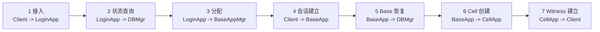

如果只看这一层，设计特点很清楚：

- **接入和会话是分开的**：LoginApp 不持有玩家实体，BaseApp 才是会话锚点。
- **查询和管理是分开的**：DBMgr 管状态，BaseAppMgr 管分配。
- **逻辑和空间是分开的**：Base 管非空间逻辑，Cell 管世界状态。
- **实体和视野是分开的**：Cell 实体存在不等于客户端能看到世界。

下面逐步展开每个阶段，同时对照 KBEngine 和 BigWorld 两套实现的差异。

---

## 22.2 阶段一：LoginApp 接入

### 22.2.1 KBEngine 的实现

客户端的第一站是 LoginApp。LoginApp 的职责非常明确：接收请求、转发查询、回传地址。它不创建实体，不持有会话，不做业务判断。

```cpp
// kbe/src/server/loginapp/loginapp.cpp

void Loginapp::onLoginAccountQueryResultFromDbmgr(
    Network::Channel* pChannel, MemoryStream& s)
```

这个 handler 实际上是从 `MemoryStream` 里依次解出：

- `retcode`
- `loginName / accountName / password / needCheckPassword`
- `componentID / entityID / dbid / flags / deadline`
- `datas`

其中 `componentID > 0` 表示该账号当前仍挂在某个 BaseApp 上；这会把后续分支切到 `registerPendingAccountToBaseappAddr`，而不是重新分配一个新的 BaseApp。

### 22.2.2 BigWorld 的实现

BigWorld 的 LoginApp 做了更多事情：

```cpp
// BigWorld: server/loginapp/client_login_request.cpp

ClientLoginRequest::ClientLoginRequest() :
    creationTime_( 0 ),
    pParams_( NULL ),
    pChannel_( NULL ),
    challengeType_(),
    didFailChallenge_( false ),
    pLoginChallenge_( NULL ),
    replyRecord_()
{}
```

BigWorld 在 LoginApp 层引入了 **Login Challenge** 机制（`LoginChallenge`）：在真正查数据库之前，先给客户端发一个计算挑战（如 Cuckoo Cycle Proof-of-Work），防止暴力登录。KBEngine 没有这层防护。

BigWorld 的 `DatabaseReplyHandler` 处理 DBAppMgr 返回的结果：

```cpp
// BigWorld: server/loginapp/database_reply_handler.cpp

void DatabaseReplyHandler::handleMessage(...)
{
    uint8 status;
    data >> status;

    if (status != LogOnStatus::LOGGED_ON)
    {
        // 处理各种失败：IP封禁、密码错误、过载等
        // ...
        return;
    }

    LoginReplyRecord lrr;
    data >> lrr;
    // lrr 包含 BaseApp 地址、会话密钥等
}
```

### 22.2.3 关键差异

| 维度 | KBEngine | BigWorld |
|------|---------|---------|
| 认证挑战 | 无 | LoginChallenge（Cuckoo Cycle） |
| 数据库查询 | DBMgr 统一处理 | DBApp -> DBAppMgr 两级 |
| 过载保护 | 基本拒绝 | 区分 BaseApp/CellApp/DBApp 过载 |
| IP 封禁 | 无 | LoginApp 层 IP Ban + 超时 |

---

## 22.3 阶段二：DBMgr 状态查询

### 22.3.1 为什么不直接查数据库

LoginApp 不直接查数据库，而是通过 DBMgr。因为 DBMgr 掌握的不是数据库数据，而是**在线状态**。

LoginApp 这一跳真正依赖的不是整张实体持久化表，而是“账号状态 + 在线检出信息”：

- `dbid`：账号或实体对应的数据库 ID
- `componentID`：当前挂载的 BaseApp 组件 ID
- `entityID`：在线实体 ID
- `flags / deadline`：账号级别的锁定、激活、过期信息

如果 `componentID > 0`，说明这个账号当前挂在一个活着的 BaseApp 上——登录不是"查库创建新实体"，而是"判断在线上下文是否存在并决定如何处理"。

### 22.3.2 BigWorld 的 checkout 机制

BigWorld 的 DBApp 把这个过程封装得更精细：

```cpp
// BigWorld: server/dbapp/login_handler.cpp

void LoginHandler::checkOutEntity()
{
    if ((pBaseRef_ == NULL) &&
        DBApp::instance().onStartEntityCheckout( entityKey_ ))
    {
        // 未检出 → 预留 BaseMailbox → 分配 BaseApp
        DBApp::setBaseRefToLoggingOn( baseRef_, entityKey_.typeID );
        DBApp::instance().setBaseEntityLocation( entityKey_, baseRef_,
                reserveBaseMailboxHandler_ );
    }
    else
    {
        // 已检出 → 已在线，走"已登录用户"逻辑
        DBApp::instance().onLogOnLoggedOnUser( entityKey_.typeID,
            entityKey_.dbID, pParams_, clientAddr_, replyAddr_, replyID_,
            pBaseRef_, dataForClient_, dataForBaseEntity_ );
    }
}
```

BigWorld 区分了"实体未检出（离线）"和"实体已检出（在线）"两种情况，对已在线的用户有专门的处理路径。KBEngine 通过 `componentID` 做类似判断，但逻辑更集中在 LoginApp 和 BaseApp 侧。

---

## 22.4 阶段三：BaseAppMgr 分配

当 LoginApp 拿到 DBMgr 的结果后，下一步是通过 BaseAppMgr 获取目标 BaseApp 地址。

### 22.4.1 KBEngine 的两路分支

```cpp
// kbe/src/server/loginapp/loginapp.cpp

// 分支一：componentID > 0，账号已挂在某 BaseApp
//   → registerPendingAccountToBaseappAddr
//   → 直接定位到已有 BaseApp

// 分支二：componentID == 0，没有在线上下文
//   → registerPendingAccountToBaseapp
//   → BaseAppMgr 分配一个新 BaseApp
```

之后 LoginApp 回给客户端的不是"你已经登录完成"，而是"去连这个 BaseApp"。这就是**两跳接入**的设计：

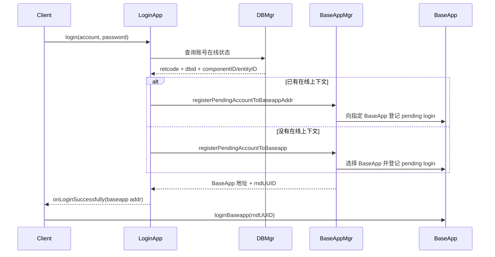

### 22.4.2 BigWorld 的 PendingLogins

BigWorld 的 BaseApp 有 `PendingLogins` 系统：

```cpp
// BigWorld: server/baseapp/pending_logins.cpp

SessionKey PendingLogins::add( Proxy * pProxy,
        const Mercury::Address & loginAppAddr )
{
    SessionKey loginKey = pProxy->sessionKey();
    pProxy->regenerateSessionKey();

    // 确保同一个 Proxy 不在 pending 列表中出现两次
    for (iterator iter = container_.begin(); iter != container_.end(); ++iter)
    {
        if (iter->second.pProxy() == pProxy)
        {
            container_.erase( iter );
            break;
        }
    }

    container_.insert( Container::value_type( loginKey,
        PendingLogin( pProxy, loginAppAddr ) ) );

    // 30 秒超时
    const int PENDING_LOGINS_TIMEOUT = 30;
    queue_.push_back( QueueElement(
            BaseApp::instance().time() +
                PENDING_LOGINS_TIMEOUT * BaseAppConfig::updateHertz(),
            pProxy->id(), loginKey ) );

    return loginKey;
}
```

BigWorld 用 `SessionKey` 做登录凭证（KBEngine 用 `rndUUID`），并且有明确的 30 秒超时——如果客户端在 30 秒内没有连到 BaseApp，`PendingLogins::tick()` 会触发 `Proxy::onClientDeath`。

---

## 22.5 阶段四：BaseApp 会话建立

### 22.5.1 KBEngine：loginBaseapp 不是盲目接收

```cpp
// kbe/src/server/baseapp/baseapp.cpp

// BaseApp::loginBaseapp 检查：
// 1. 账号名长度与密码长度
// 2. DBMgr 是否就绪
// 3. PendingLoginMgr 中是否存在对应待登录记录
// 4. 请求来源地址是否与待登录记录一致
// 5. 密码是否匹配
// 6. 账号标记是否允许登录
```

BaseApp 只接管经过 LoginApp 预分配和登记的会话。这防止了客户端绕过 LoginApp 直接伪造登录。

如果 `ptinfos->entityID > 0`（已在线），BaseApp 会调用 `Proxy::onLogOnAttempt()`，把"是否允许新客户端挤掉旧客户端"交给脚本层决定。当脚本返回 `LOG_ON_ACCEPT` 时，底层动作是：

1. 若旧 `clientEntityCall` 仍在，踢掉旧客户端通道
2. 把 Proxy 重新绑定到新客户端地址
3. 重新执行 `createClientProxies()`
4. 调用 `Proxy::onGetWitness()`，把客户端控制权恢复推到 Cell 侧

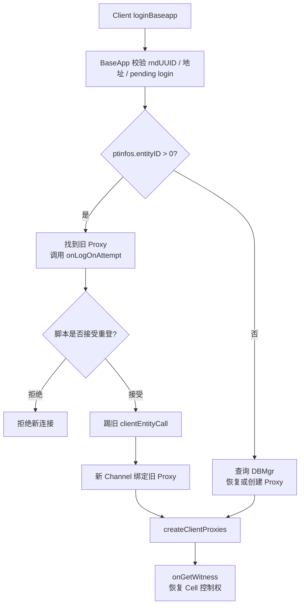

### 22.5.2 BigWorld：LoginHandler + attachToClient

BigWorld 的对应流程更分散，但有明确的超时和统计：

```cpp
// BigWorld: server/baseapp/login_handler.cpp

void LoginHandler::login( ... )
{
    PendingLogins::iterator pendingIter = pPendingLogins_->find( args.key );

    if (pendingIter == pPendingLogins_->end())
    {
        // 没有对应的 pending login → 拒绝
        return;
    }

    const PendingLogin & pending = pendingIter->second;
    SmartPointer<Proxy> pProxy = pending.pProxy();

    // 更新统计（NAT 检测、重试次数）
    this->updateStatistics( srcAddr, pending.addrFromLoginApp(), args.numAttempts );

    pPendingLogins_->erase( pendingIter );

    // 关键：attachToClient
    if (pProxy->attachToClient( srcAddr, header.replyID, header.pChannel.get() ))
    {
        // 成功绑定
    }
}
```

BigWorld 的 `attachToClient` 比 KBEngine 的 `loginBaseapp` 多做了 NAT 检测和多次重试统计——这对于真实的公网部署很重要。

---

## 22.6 阶段五：Base 实体恢复

如果账号还没有在线实体，BaseApp 会向 DBMgr 发送 `queryAccount`，然后在 `onQueryAccountCBFromDbmgr()` 里创建或恢复 Proxy。

### 22.6.1 KBEngine 的恢复链路

```
BaseApp::loginBaseapp
  → DBMgrInterface::queryAccount
  → BaseApp::onQueryAccountCBFromDbmgr
  → createEntity(...)
  → initializeEntity(pyDict)
  → createClientProxies(...)
```

`onQueryAccountCBFromDbmgr` 是关键落点：

1. `createEntity()` 创建账号实体类型对应的 Proxy
2. 安装 `dbid`、客户端类型、登录附加数据和 `createDatas`
3. `createDictDataFromPersistentStream()` 从持久化流恢复脚本属性
4. 注入 `__ACCOUNT_NAME__` 与 `__ACCOUNT_PASSWORD__`
5. `initializeEntity(pyDict)` 完成脚本对象初始化
6. 若客户端连接还在，构造 `clientEntityCall` 并执行 `createClientProxies()`

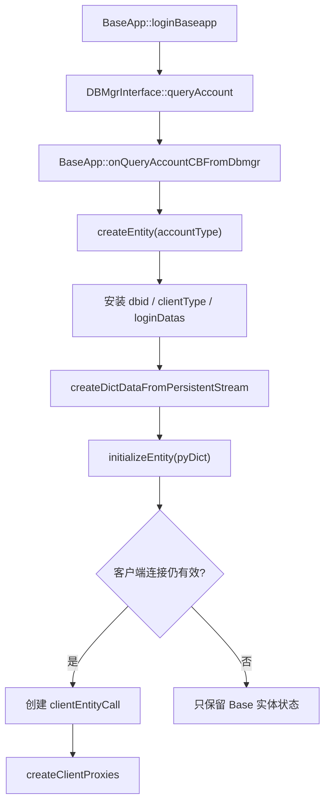

### 22.6.2 BigWorld 的恢复链路

BigWorld 的恢复发生在 `Base::restoreTo()` 中，它从 backup 数据流中恢复整个 Base 实体：

```cpp
// BigWorld: server/baseapp/base.cpp

// Base::restoreTo 从备份流中恢复：
// 1. cellAddr → 设置 Cell 通道
// 2. hasChannel → 是否有客户端连接
// 3. isCreateCellPending / isGetCellPending / isDestroyCellPending
// 4. spaceID / shouldAutoBackup / shouldAutoArchive
// 5. cellBackupData_ → Cell 备份数据
// 6. Proxy 的 readBackupData → 恢复客户端相关状态
// 7. restoreTimers → 恢复定时器
// 8. restoreAttributes → 恢复属性
// 9. restoreCellData → 恢复 Cell 数据
```

恢复完成后调用脚本钩子：

```cpp
// 如果有客户端连接 → 调用 onOnload
// 如果没有客户端连接 → 调用 onRestore
// 两种情况最后都调用 Proxy::onRestored()
```

BigWorld 的恢复粒度更细——它不是从数据库恢复，而是从**备份流**恢复（由 BackupSender 周期性跨 BaseApp 备份）。这意味着恢复速度更快（不需要查数据库），但需要额外的备份基础设施。

---

## 22.7 阶段六：Cell 实体创建

### 22.7.1 从 Base 到 Cell 的数据交接

玩家有了 Base 实体不代表已经进入世界。进入空间发生在 Base 侧触发 Cell 实体创建之后。

KBEngine 的关键入口：

```
Entity::createCellEntity
Entity::createCellEntityInNewSpace
Entity::restoreCell
```

`BaseApp::createCellEntity` 的核心动作：

```cpp
// 构造 CellappInterface::onCreateCellEntityFromBaseapp 消息
// 包含：
//   - entityType
//   - entity id
//   - base componentID
//   - addCellDataToStream() 序列化的 Cell 初始数据
```

这说明了 Base/Cell 分离的本质——不是概念分离，而是真有一次跨组件的数据交接。Base 把 Cell 所需的初始状态序列化后交给 CellApp。

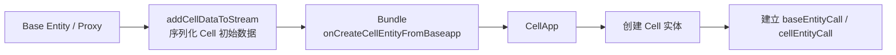

### 22.7.2 进入世界的三小步

把"进入世界"拆开来看：

1. **Base 上先存在一个已与客户端绑定的 Proxy**
2. **`Entity::createCellEntity` 把 Cell 初始状态序列化后交给目标 CellApp**
3. **Cell 创建完成后，通过 `Proxy::onGetWitness()` 把"客户端控制权"绑定到 Cell 侧**

所以进入世界不是一次构造动作，而是三步接力。

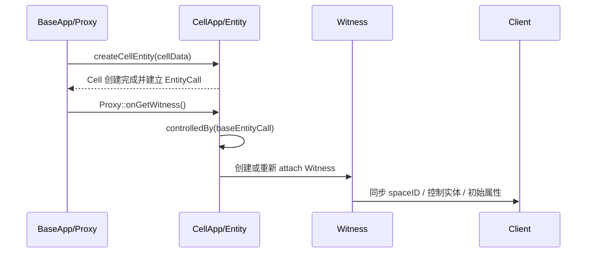

### 22.7.3 BigWorld 的 restoreTo + createEntity

BigWorld 在恢复场景下走 `Base::restoreTo()`，它直接发送 `restoreEntity` 消息给 CellApp：

```cpp
// BigWorld: server/baseapp/base.cpp

// restoreTo → 发送 restoreEntity 到 CellApp
bundle.startMessage( *pToCall );  // createEntity 或 restoreEntity
bundle << spaceID;
bundle << pChannel_->version();
bundle << true /*isRestore*/;
bundle.addBlob( cellBackupData_.data(), cellBackupData_.length() - footerSize );
```

BigWorld 区分了 `createEntity`（全新创建）和 `restoreEntity`（从备份恢复）两种消息，后者附带备份数据，CellApp 可以直接从中恢复 Cell 实体。

---

## 22.8 阶段七：Witness 建立

### 22.8.1 KBEngine 的 Witness 建立

```cpp
// kbe/src/server/baseapp/proxy.cpp

void Proxy::onGetWitness()
{
    if(cellEntityCall())
    {
        // 通知 CellApp 获得客户端
        Network::Bundle* pBundle = Network::Bundle::createPoolObject(OBJECTPOOL_POINT);
        (*pBundle).newMessage(CellappInterface::onGetWitnessFromBase);
        (*pBundle) << this->id();
        sendToCellapp(pBundle);
    }
}
```

在 CellApp 侧，`Entity::onGetWitness(bool fromBase)` 被调用时：

- 如果 `fromBase == true`，通过 `controlledBy(baseEntityCall())` 把客户端控制关系重新绑回当前 Cell 实体
- 主动把 `spaceID` 和客户端属性打包发给客户端
- 如果还没有 Witness 就创建；如果已有，执行 `onAttach()` + `resetViewEntities()` 重建视野

这意味着"重连恢复"不是简单补一个 socket，而是：

1. 重新绑定客户端控制对象
2. 重新同步关键客户端属性
3. 重新建立视野状态

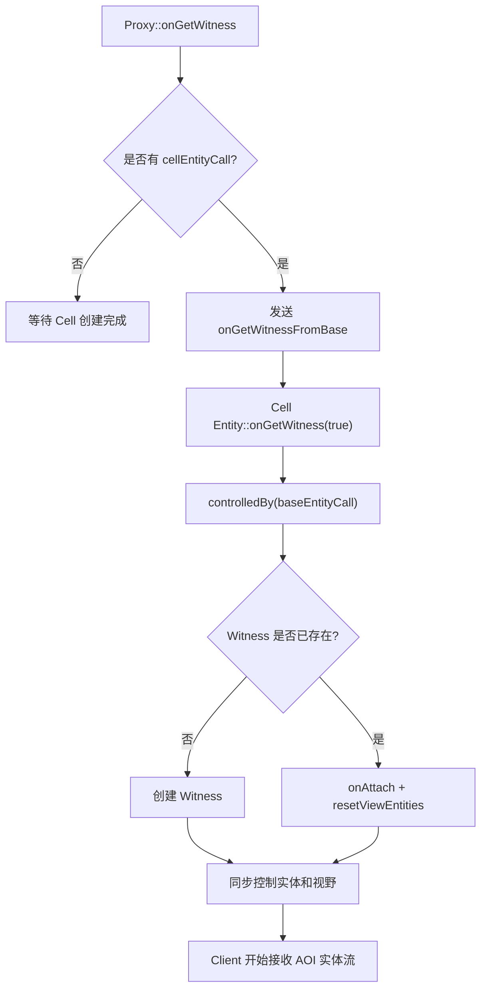

### 22.8.2 BigWorld 的 Witness 构建

BigWorld 的 Witness 构造更复杂，包含 alias 预分配和 AOI 初始化：

```cpp
// BigWorld: server/cellapp/witness.cpp

Witness::Witness( RealEntity & owner, BinaryIStream & data,
        CreateRealInfo createRealInfo, bool hasChangedSpace ) :
    real_( owner ),
    entity_( owner.entity() ),
    aoiHyst_( 5.0 ),
    aoiRadius_( CellAppConfig::defaultAoIRadius() ),
    pAoIRoot_( entity_.pRangeListNode() ),
    bandwidthDeficit_( 0 ),
    numFreeAliases_( 0 )
{
    ++g_numWitnesses;
    ++g_numWitnessesEver;

    // 初始化 alias 池
    memset( freeAliases_, 1, sizeof( freeAliases_ ) );
    // ... alias 分配逻辑
}
```

BigWorld 的 Witness 内部维护了 `entityQueue_`（优先级队列）和 `aoiMap_`（AOI 实体映射），这些在 KBEngine 中由更简单的 `viewEntities_` 替代。

### 22.8.3 从 AOI 事件到客户端消息

```
空间索引判断实体进入 AOI
  → Witness::addToAoI()
  → 标记 ENTER_PENDING
  → Witness::update() 在 tick 末统一执行
  → 构造客户端消息（实体创建 + 初始属性）
  → 发送给客户端
```

`Witness::update()` 是整条链的收束点——它把进入/离开/属性变化 pending 统一处理，避免在单次 tick 内频繁发送消息。

---

## 22.9 三条主线

把七个阶段压缩成三条数据流主线：

### 会话主线：LoginApp -> BaseApp

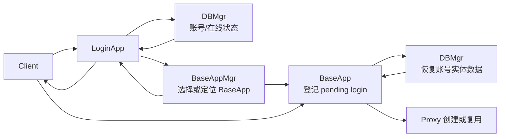

### 世界主线：Base -> Cell -> Witness -> Client

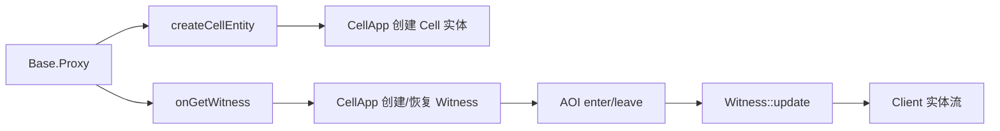

### 数据主线：Cell -> Base -> DBMgr

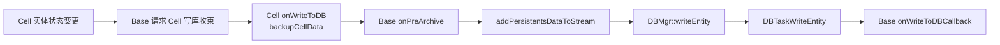

---

## 22.10 下线、重连与恢复

### 22.10.1 普通下线

KBEngine 的 `BaseApp::logoutBaseapp`：

1. 找到目标 Proxy
2. 校验 `rndUUID`
3. 把客户端通道 condemn
4. 连接关系收束，不一定意味着实体立即销毁

BigWorld 的 `Proxy::onClientDeath`：

```cpp
// BigWorld: server/baseapp/proxy.cpp

void Proxy::onClientDeath( ClientDisconnectReason reason,
        bool shouldExpectClient /* = true */ )
{
    // 1. 如果已经 dead 了就忽略
    if (!this->hasClient() && shouldExpectClient)
        return;

    // 2. 踢掉客户端通道
    if (shouldExpectClient || this->hasClient())
        this->logOffClient( shouldCondemnClient );

    // 3. 调用 Python 脚本 onClientDeath
    PyObject * pFunc = PyObject_GetAttrString( this, "onClientDeath" );
    // ... 执行脚本回调
}
```

BigWorld 的 `onClientDeath` 有精细的断线原因分类（`CLIENT_DISCONNECT_TIMEOUT`、`CLIENT_DISCONNECT_RATE_LIMITS_EXCEEDED`、`CLIENT_DISCONNECT_SHUTDOWN` 等），KBEngine 的分类更粗。

### 22.10.2 重连

KBEngine 的 `BaseApp::reloginBaseapp`：

1. 校验 `entityID` 与 `rndUUID`
2. 若旧 `clientEntityCall` 还在，踢掉旧通道
3. 把客户端地址改成新地址
4. 重新执行 `createClientProxies(proxy, true)`
5. 通过 `proxy->onGetWitness()` 通知 Cell 侧恢复控制权
6. 回给客户端 `onReloginBaseappSuccessfully`

这条链路最适合看成“同一个 `Proxy` 复用，客户端连接切到新的 `Channel`”。  
更精确地说，重连阶段做的不是“替换 `Proxy` 对象”，而是：

1. 先 `findEntity(entityID)` 找到已有 `Proxy`
2. 让旧 `Channel` 退场：`proxyID(0) + condemn("", true)`
3. 更新已有 `Proxy` 的 `addr`
4. 更新已有 `clientEntityCall` 的 `addr`（已有旧连接分支下通常复用这个对象，不重建）
5. 把新 `Channel` 的 `proxyID` 绑定到这个已有 `Proxy`
6. 再通过 `createClientProxies(proxy, true)` 和 `proxy->onGetWitness()` 恢复客户端状态与世界表现

也就是说，**长期业务对象是旧 `Proxy`，变化的是连接映射和地址映射**。

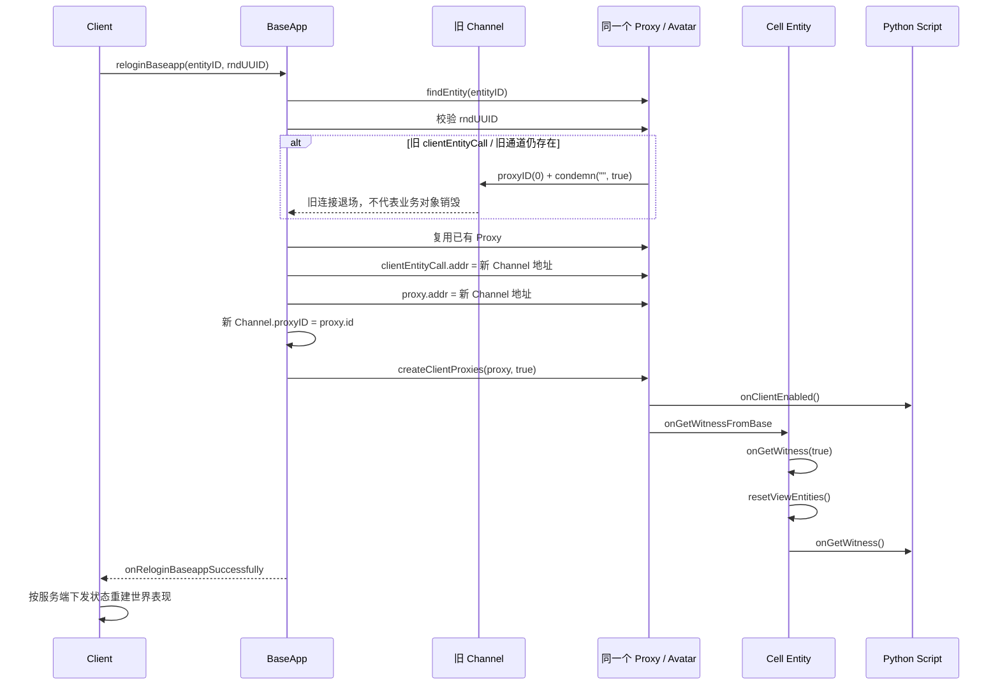

对应源码关键点是：

```cpp
Entity* pEntity = findEntity(entityID);
Proxy* proxy = static_cast<Proxy*>(pEntity);

// 旧连接退场，但不销毁 Proxy
pMBChannel->proxyID(0);
pMBChannel->condemn("", true);

// 复用已有 clientEntityCall，更新地址
entityClientEntityCall->addr(pChannel->addr());
proxy->addr(pChannel->addr());
pChannel->proxyID(proxy->id());

createClientProxies(proxy, true);
proxy->onGetWitness();
```

源码核对点可以直接对照下面几处：

- `findEntity(entityID)` 找已有实体，而不是创建新 `Proxy`
  `kbe/src/server/baseapp/baseapp.cpp:3981`
- 旧 `Channel` 先 `proxyID(0)` 再 `condemn("", true)`
  `kbe/src/server/baseapp/baseapp.cpp:4008`
- 已有 `clientEntityCall` 分支下只是更新 `addr`
  `kbe/src/server/baseapp/baseapp.cpp:4016`
- `proxy.addr` 和新 `Channel.proxyID` 被写回
  `kbe/src/server/baseapp/baseapp.cpp:4028`
- 随后用已有 `Proxy` 调 `createClientProxies(proxy, true)`
  `kbe/src/server/baseapp/baseapp.cpp:4035`
- `createClientProxies` 内部再从 `clientEntityCall()->getChannel()` 取当前通道，并执行 `onClientEnabled()`
  `kbe/src/server/baseapp/baseapp.cpp:3142`
- `Proxy::onClientEnabled()` 只是把 `clientEnabled_ = true`
  `kbe/src/server/baseapp/proxy.cpp:174`

还要再区分一层：

- `Proxy` 对象本体没有换
- `clientEntityCall` 在“已有旧连接”的分支下通常也不重建，而是只更新 `addr`
- `EntityCallAbstract` 自身持有的是 `addr_`；`getChannel()` 通过注册的 `FindChannelFunc` 解析当前通道
  `kbe/src/lib/entitydef/entitycallabstract.h:52`
  `kbe/src/lib/entitydef/entitycallabstract.cpp:178`
- `Proxy` 自己在 `kick()/disconnect()` 里也是按 `addr_` 去 `networkInterface().findChannel(addr_)` 找当前连接
  `kbe/src/server/baseapp/proxy.cpp:72`

如果只看对象关系，重连前后真正变化的是 `Channel` 绑定和 `addr` 映射，不是 `Proxy / Avatar` 本体：

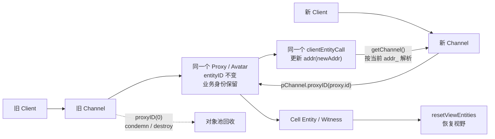

重连成功包含两层恢复：

- **Base 层**：恢复会话（Proxy 绑定新客户端）
- **Cell 层**：恢复世界表现（Witness 重建视野）

这里还要特别强调一个容易混淆的事实：

- **重连不是重新创建一个新的玩家业务对象**
- **重连的本质是把新的客户端会话重新绑定回已有 `Proxy`**

也就是说，真正被替换的是网络连接和客户端引用，不是玩家在服务端的业务身份。

### 22.10.3 断线重连的分层模型

如果把断线重连抽象成分层模型，至少要区分下面四层：

| 层 | 典型对象 | 断线时怎么处理 | 重连时怎么处理 |
|------|---------|--------------|--------------|
| **网络连接层** | `Channel` / socket | 断开、回收 | 建立新连接 |
| **客户端绑定层** | `clientEntityCall` / `proxy.addr` / `clientEnabled_` | 清理或失效 | 重新绑定到新连接 |
| **玩家业务身份层** | `Proxy` / `Avatar` / `Account` | 通常保留 | 继续复用同一业务对象 |
| **玩法业务状态层** | 队伍、匹配、房间、战斗、惩罚状态 | 不应因断线直接丢弃 | 由服务端状态机决定恢复或清理 |

可以把它压缩成一句话：

```text
断线 = 会话层失效
重连 = 新会话重新绑定旧业务身份
```

这也是为什么 `BaseApp::reloginBaseapp` 主要做的是：

1. 校验 `entityID + rndUUID`
2. 处理旧 `clientEntityCall` / 旧通道
3. 把新地址重新绑定到原 `Proxy`
4. 重新执行 `createClientProxies(proxy, true)`
5. 通过 `Proxy::onGetWitness()` 让 Cell 侧恢复控制权和视野

从设计上看，这意味着下面几条规则必须单独成立：

- **断线 != 登出**
- **断线 != 取消匹配**
- **断线 != 逃跑处罚**
- **断线 != 销毁玩家业务对象**

<a id="connection-events-to-player-lifecycle"></a>

### 22.10.4 从 Channel 生命周期延伸出来的 hook 链

如果继续往下问一个更工程化的问题，其实就是：

```text
Channel 死了以后，到底还会触发哪些后续 hook？
重连成功以后，又会按什么顺序恢复？
```

这里最重要的不是单个函数，而是**一条分层链**：

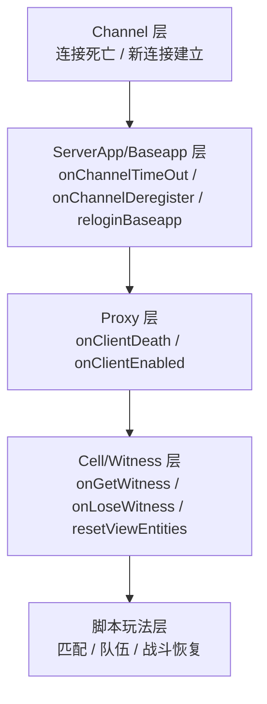

也就是说：

- `Channel` 自己只负责连接状态
- `Baseapp` 把连接事件翻译成“哪个实体受影响”
- `Proxy` 再把它翻译成“玩家客户端死了/恢复了”
- `Cell/Witness` 最后把世界表现恢复到客户端

这里建议和第 8 章配合着看：

- 连接对象本身的创建、失效、`condemn / deregister / destroy`，见 [8.4.1 Channel 的完整生命周期](08-network-infrastructure.md#channel-complete-lifecycle)
- 本章更关注这些连接事件最终如何翻译成玩家层 hook 和恢复链
- 特别是“为什么 `kick / relogin` 的旧连接退场未必会转成 `Proxy::onClientDeath()`”，第 8 章已经从 `proxyID(0)` 和 `deregister` 边界把源码链讲清楚

#### 先看总矩阵：不同连接事件最终会触发什么

如果不先把事件矩阵列出来，后面很容易把三件事混为一谈：

1. 连接对象是不是失效了
2. 玩家层会不会收到 `onClientDeath`
3. 后面会不会进入重连恢复链

把它们压成一张表会更清楚：

| 场景 | 典型入口 | `onClientDeath` | `onClientEnabled` | `onGetWitness / resetViewEntities` | 说明 |
|------|----------|-----------------|-------------------|------------------------------------|------|
| inactivity 超时 | `onChannelTimeOut` | 通常会 | 不会立刻触发 | 不会立刻触发 | 标准断线，后续可再走重连 |
| 对端主动断开 / recv EOF | `TCPPacketReceiver::onGetError` | 通常会 | 不会立刻触发 | 不会立刻触发 | 本质仍是连接死亡 |
| 协议错误 / 非法包 | `PacketReader::condemn` | 通常会 | 不会 | 不会 | 一般不是正常恢复场景 |
| 主动 logout | `logoutBaseapp` | 通常会 | 不会 | 不会 | 语义更接近正常下线 |
| kick / 顶号 | `kickChannel` | **旧连接未必会触发** | 新连接接管后会 | 新连接接管后会 | 旧连接通常先 `proxyID(0)` |
| relogin 接管 | `reloginBaseapp` | **旧连接未必会触发** | 会 | 会 | 这是最典型的恢复链 |

这张表最重要的结论是：

- **不是所有连接死亡都会被翻译成玩家层 `onClientDeath`**
- **不是所有 `deregister` 都等价于“玩家离线”**
- **接管型流程里，旧连接退场和新连接恢复是两段不同的语义**

#### KBEngine 默认接口能区分断线原因吗

严格说：**脚本层默认不能可靠区分。**

源码里其实存在两层信息：

1. **网络层有一部分原因信息**
   - `Channel` 有 `condemnReason()`，见 [channel.h](D:/workspaces/kbengine/kbe/src/lib/network/channel.h#L185)
   - `Network::Reason` 里有 `REASON_INACTIVITY`、`REASON_CLIENT_DISCONNECTED`、`REASON_GENERAL_NETWORK`、`REASON_WEBSOCKET_ERROR` 等枚举，见 [common.h](D:/workspaces/kbengine/kbe/src/lib/network/common.h#L140)
   - 例如超时会写入 `pChannel->condemn("timedout")`，见 [serverapp.cpp](D:/workspaces/kbengine/kbe/src/lib/server/serverapp.cpp#L286)
   - 例如 TCP 对端关闭会写入 `onGetError(pChannel, "disconnected")`，见 [tcp_packet_receiver.cpp](D:/workspaces/kbengine/kbe/src/lib/network/tcp_packet_receiver.cpp#L105)
   - 例如未知消息号会写入 `PacketReader::processMessages: not found msgID`，见 [packet_reader.cpp](D:/workspaces/kbengine/kbe/src/lib/network/packet_reader.cpp#L85)

2. **但这些原因默认没有传到玩家脚本层**
   - `Baseapp::onChannelDeregister()` 只拿 `pChannel->proxyID()` 找 `Proxy`，然后调用 `proxy->onClientDeath()`，见 [baseapp.cpp](D:/workspaces/kbengine/kbe/src/server/baseapp/baseapp.cpp#L797)
   - `Proxy::onClientDeath(void)` 没有参数，内部调用脚本 `onClientDeath` 也是 `SCRIPT_OBJECT_CALL_ARGS0`，见 [proxy.cpp](D:/workspaces/kbengine/kbe/src/server/baseapp/proxy.cpp#L217)
   - `Entity::onClientDeath()` 同样是无参脚本回调，见 [entity.cpp](D:/workspaces/kbengine/kbe/src/server/baseapp/entity.cpp#L1045)

所以从默认脚本接口看：

```python
def onClientDeath(self):
    ...
```

你只能知道：

```text
这个 Proxy 的客户端绑定消失了
```

但不能直接知道：

```text
是玩家主动断网？
是客户端进程崩了？
是 NAT / 网络抖动？
是协议非法？
是服务端踢线？
是发包错误？
```

这也是 KBEngine 和 BigWorld 一个明显差异。BigWorld 的 `Proxy::onClientDeath(ClientDisconnectReason reason, ...)` 保留了更精细的断线原因，而 KBEngine 这里简化成了无参 hook。

#### 这对匹配/PvP 惩罚策略意味着什么

在我们前面那个“PVP 匹配成功后断线”的例子里，如果只依赖 KBEngine 默认脚本接口，确实无法做到下面这种精细判断：

```text
玩家真实断网：不处罚
客户端协议错误：处罚
网络异常：不处罚
主动取消：处罚
```

因为 `onClientDeath()` 给不到原因。

因此更合理的玩法层策略应该是：

1. **把被动连接丢失统一视为 `CONNECTION_LOST`**
   - 只进入离线宽限期
   - 不立即处罚
   - 等宽限期超时后再按 `NO_SHOW / FORFEIT` 处理

2. **把主动业务行为单独建模**
   - 玩家点击取消匹配：`CANCEL_MATCH`
   - 玩家点击退出房间：`LEAVE_ROOM`
   - 玩家主动登出：`LOGOUT`
   - 服务端踢线：`KICKED`
   - 这些不要依赖 `onClientDeath()` 反推，而应在对应业务入口直接记录原因

3. **协议错误、作弊嫌疑、异常包不要在玩法脚本里靠 `onClientDeath()` 判断**
   - 默认链路下脚本拿不到精确原因
   - 应该在 C++ 网络/消息处理层记录安全事件
   - 或扩展引擎，把断线原因传到 `Proxy::onClientDeath(reason)`

换成状态机就是：

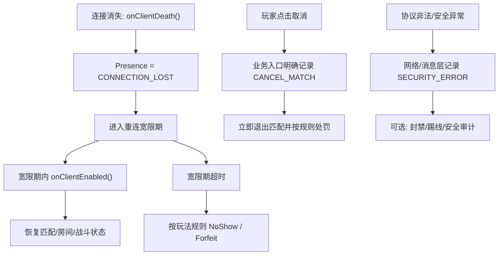

这比在脚本 `onClientDeath()` 里猜原因更可靠。

#### 如果确实要做细粒度原因控制，应该改哪里

如果项目真的需要区分 `TIMEOUT / DISCONNECTED / PROTOCOL_ERROR / KICKED / RELOGIN_REPLACED`，最佳改法不是在 Python 侧猜，而是扩展 C++ 链路。

一个合理的改造方向是：

1. 在 `Baseapp::onChannelDeregister()` 中读取 `pChannel->condemnReason()`
2. 在 `Proxy` 上新增 `lastClientDisconnectReason_` 或直接改 `onClientDeath(reason)`
3. 调脚本时从 `SCRIPT_OBJECT_CALL_ARGS0` 改成带参数的 `SCRIPT_OBJECT_CALL_ARGS1`
4. Python 层新增兼容处理，例如 `onClientDeath(reason=None)`
5. 对 `kick / relogin` 这种接管型流程，继续通过 `proxyID(0)` 避免旧连接误触发玩家离线

但这属于引擎接口变更，需要考虑兼容性。默认文档和业务设计里，更稳妥的建议仍然是：

```text
默认 onClientDeath 只表示客户端绑定消失，
不要把它当作精确断线原因。
```

#### 断线时会触发哪些点

典型链路如下：

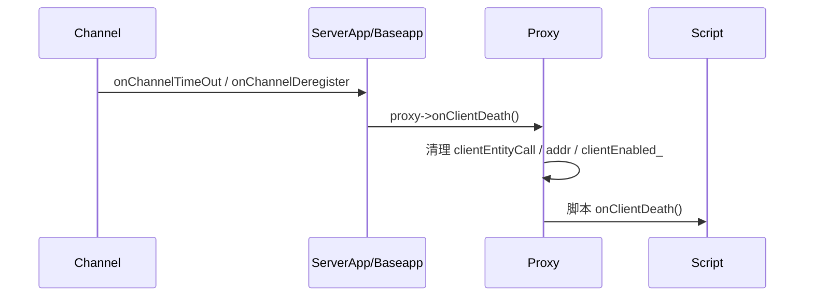

把源码入口对起来看，会更清楚：

1. **连接层**
   - `ServerApp::onChannelTimeOut()`：超时后直接 `condemn -> deregister -> destroy`
   - 见 [serverapp.cpp](D:/workspaces/kbengine/kbe/src/lib/server/serverapp.cpp#L286)

2. **服务器层**
   - `Baseapp::onChannelDeregister()`：当连接真正注销时，开始做“它关联了哪个实体”的翻译
   - 见 [baseapp.cpp](D:/workspaces/kbengine/kbe/src/server/baseapp/baseapp.cpp#L797)

3. **Proxy 层**
   - 如果 `proxyID > 0`，找到对应 `Proxy`
   - 调用 `proxy->onClientDeath()`
   - 见 [baseapp.cpp](D:/workspaces/kbengine/kbe/src/server/baseapp/baseapp.cpp#L816)

4. **脚本层**
   - `Proxy::onClientDeath()` 会：
     - `Py_DECREF(clientEntityCall())`
     - `clientEntityCall(NULL)`
     - `addr = NONE`
     - `clientEnabled_ = false`
     - 调脚本 `onClientDeath`
   - 见 [proxy.cpp](D:/workspaces/kbengine/kbe/src/server/baseapp/proxy.cpp#L217)

所以断线后的直接 hook，最值得记住的是：

| 层 | 入口 | 作用 |
|------|------|------|
| 连接层 | `onChannelTimeOut` / `onChannelDeregister` | 连接死亡与回收 |
| Base 层 | `Baseapp::onChannelDeregister` | 把连接事件翻译成实体事件 |
| Proxy 层 | `Proxy::onClientDeath` | 清理客户端绑定 |
| 脚本层 | `onClientDeath` | 业务收束，例如掉线标记、宽限期计时 |

#### 重连成功时会触发哪些点

重连链比断线链更长，因为它不仅要恢复连接，还要恢复控制权和世界表现：

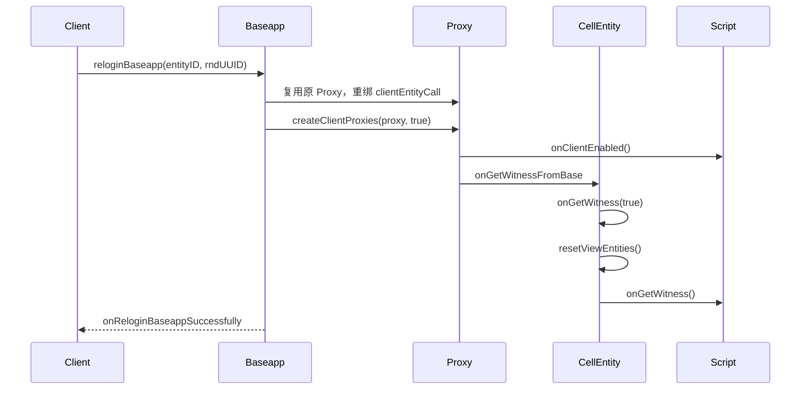

把它拆开看：

1. **Baseapp 入口**
   - `Baseapp::reloginBaseapp()`
   - 校验 `entityID + rndUUID`
   - 旧连接如仍存在，则 `condemn("", true)`
   - 新连接绑定到原 `Proxy`
   - 见 [baseapp.cpp](D:/workspaces/kbengine/kbe/src/server/baseapp/baseapp.cpp#L3974)

2. **客户端重新启用**
   - `createClientProxies(proxy, true)`
   - 会重发 `onCreatedProxies`
   - 并在内部调用 `pEntity->onClientEnabled()`
   - 见 [baseapp.cpp](D:/workspaces/kbengine/kbe/src/server/baseapp/baseapp.cpp#L3142)

3. **Proxy 层 hook**
   - `Proxy::onClientEnabled()`
   - 设置 `clientEnabled_ = true`
   - 调脚本层 `onClientEnabled`
   - 见 [proxy.cpp](D:/workspaces/kbengine/kbe/src/server/baseapp/proxy.cpp#L174)

4. **Cell/Witness 层恢复**
   - `Proxy::onGetWitness()` 通知 Cell 侧
   - 见 [proxy.cpp](D:/workspaces/kbengine/kbe/src/server/baseapp/proxy.cpp#L423)
   - Cell 侧进入 `Entity::onGetWitness(true)`
   - 若已有 witness，则执行 `pWitness_->onAttach(this)` 和 `resetViewEntities()`
   - 见 [entity.cpp](D:/workspaces/kbengine/kbe/src/server/cellapp/entity.cpp#L2092)

5. **Cell 脚本 hook**
   - `Entity::onGetWitness()` 最后会调脚本 `onGetWitness`
   - 见 [entity.cpp](D:/workspaces/kbengine/kbe/src/server/cellapp/entity.cpp#L2175)

所以重连成功后，最关键的 hook 序列是：

| 层 | hook / 入口 | 作用 |
|------|-------------|------|
| Base 层 | `reloginBaseapp` | 重绑新连接到旧 `Proxy` |
| Proxy 层 | `onClientEnabled` | 脚本知道“客户端又可用了” |
| Proxy -> Cell | `onGetWitness` | 恢复客户端控制权 |
| Cell/Witness | `resetViewEntities` | 重新同步视野实体 |
| Cell 脚本 | `onGetWitness` | 脚本知道“世界表现恢复了” |

#### 为什么断线 hook 和重连 hook 不对称

这里还有一个很值得说明的细节：

- 断线时最核心的脚本 hook 是 `onClientDeath`
- 重连时最核心的脚本 hook 不是 `onReloginBaseappSuccessfully`
- 而是 `onClientEnabled` + `onGetWitness`

原因很简单：

- `onClientDeath` 对应的是“客户端绑定消失了”
- `onClientEnabled` 对应的是“客户端绑定重新可用了”
- `onGetWitness` 对应的是“世界表现和控制权重新恢复了”

也就是说，**重连恢复被拆成了两层**：

```text
第一层：客户端会话恢复
    -> onClientEnabled

第二层：Cell 控制权 / 视野恢复
    -> onGetWitness
```

这也是为什么脚本最佳实践通常不是只实现一个“重连成功回调”，而是要分开处理：

- `onClientDeath`
  - 标记离线
  - 启动宽限期
  - 不直接做处罚
- `onClientEnabled`
  - 重推 UI / 房间 / 匹配状态
  - 恢复可交互状态
- `onGetWitness`
  - 恢复 Cell 相关的世界表现
  - 处理需要依赖空间/视野的逻辑

#### 一个更实用的记忆方式

如果要把这些 hook 压缩成一句最容易记的口诀，可以这样记：

```text
Channel 死亡 -> Baseapp 收到连接事件
Baseapp 翻译 -> Proxy.onClientDeath
重连成功 -> Proxy.onClientEnabled
世界恢复 -> Cell.onGetWitness / resetViewEntities
```

所以你前面那个问题的最终答案是：

- **是的，所有这些 hook 都是从 Channel 生命周期“延伸出来”的**
- **但真正暴露给业务层的 hook，不是在 Channel 本身，而是在 Proxy / Cell 这一层**
- **因为玩家掉线重连不是纯连接问题，而是连接、实体、控制权、视野、脚本状态共同参与的恢复链**

### 22.10.5 玩法设计建议：匹配、队伍与跨服

把上面的分层模型放到 PvP、组队、跨服场景里，最重要的结论是：

- **不要把玩法状态绑在客户端连接上**
- **要把玩法状态绑在服务端身份对象或独立玩法服务上**

这里还要把"玩家 ID"说准确：

- **`entityID` / `Entity.id`**：当前激活实体的运行时 ID，只在当前在线实体生命周期内稳定
- **`databaseID` / `dbid`**：实体的持久化 ID，才更适合做玩家长期身份标识

所以如果讨论：

- **本服进程内对象引用**，`entityID` 可以用
- **跨服队伍、跨服匹配、战斗结算、惩罚记录、离线恢复**，应优先使用 `databaseID`

换句话说，前面这里说的"业务身份"在 KBEngine 的玩家场景下，更准确地应该理解为：

- **运行时载体**：`Proxy / Avatar`
- **长期身份键**：`Avatar.databaseID`

以"玩家已经匹配成功，但此时断线"为例，更合理的策略通常不是立即取消，而是进入一个**重连宽限期**：

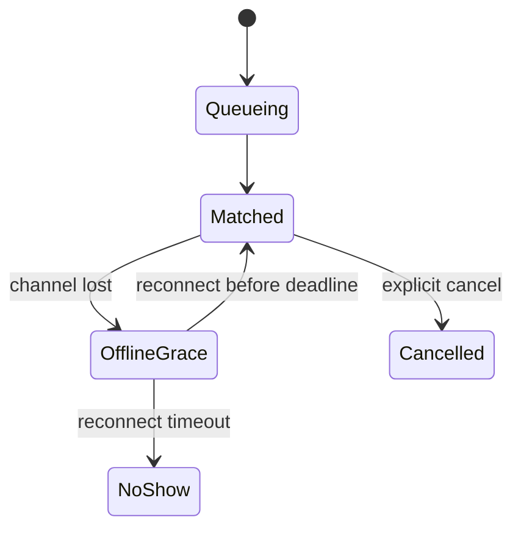

这背后的状态机约束是：

- 玩家主动点击取消，才进入 `Cancelled`，可以处罚
- 玩家只是断线，则进入 `OfflineGrace`，应先清理连接态，不应立即处罚
- 宽限期内重连成功，则恢复原有 `matchId / roomId / battleId`
- 只有宽限期超时未归，才进入 `NoShow` 或战斗内的 `Forfeit`

一个典型的脚本层伪代码如下：

```python
def onClientDeath(self):
    self.online = False

    if self.pvp.phase == "MATCHED":
        self.pvp.reconnectDeadline = self.serviceNow() + 30
        self.startReconnectGraceTimer(30)
    elif self.pvp.phase == "IN_BATTLE":
        # 跨服/跨进程场景优先传 databaseID，而不是当前 entityID
        self.battle.markOffline(self.databaseID, graceSeconds=120)


def onClientEnabled(self):
    self.online = True
    self.cancelReconnectGraceTimer()
    self.pushPvpStateToClient()

    if self.pvp.phase == "MATCHED":
        self.sendEnterMatch(self.pvp.matchId, self.pvp.roomId)
    elif self.pvp.phase == "IN_BATTLE":
        self.battle.resyncPlayer(self.databaseID)
```

#### 以"匹配成功后断线，重连继续进入"为例

假设流程是：

1. 玩家 `Avatar.databaseID = 10086`，当前在线 `entityID = 2049`
2. 匹配服务为其分配 `matchId = M9001`、`roomId = R77`
3. 客户端在"已匹配，等待进入"阶段断线

这时更合理的服务端处理不是：

```python
# 错误示例：把断线等同于取消匹配
def onClientDeath(self):
    matchService.cancel(self.databaseID)
    penaltyService.punish(self.databaseID, "cancel_match")
```

而应该是：

```python
def onClientDeath(self):
    self.online = False

    if self.pvp.phase == "MATCHED":
        self.pvp.reconnectDeadline = self.serviceNow() + 30
        matchService.markOffline(self.databaseID, self.pvp.matchId, 30)


def onClientEnabled(self):
    self.online = True

    if self.pvp.phase == "MATCHED":
        matchState = matchService.query(self.databaseID)
        if matchState and matchState.phase == "MATCHED":
            self.client.onMatchRecovered(matchState.matchId, matchState.roomId)
```

这个例子里，几个标识分别承担不同职责：

- `databaseID = 10086`
  - 作为跨服匹配服务里的玩家主键
  - 用于重连后找回原有匹配记录
- `entityID = 2049`
  - 只是当前这次在线实体的运行时句柄
  - 可以用于本地 `BaseApp` 查找实体，不适合做跨服长期身份键
- `matchId / roomId`
  - 属于玩法状态层
  - 不应因一次断线立即删除

因此，"重连继续进入"真正依赖的不是旧 `entityID` 还在不在，而是：

- 原 `Proxy/Avatar` 业务对象仍然存活
- 匹配服务仍保留 `databaseID -> matchId / roomId` 的映射
- 宽限期尚未超时
- 重连后由服务端重新把当前玩法状态推回客户端

这里有两个实践点非常关键：

1. **惩罚绑定玩法规则，不绑定 socket 断开**
   - 主动取消、拒绝确认、宽限期超时未归，才是处罚依据
   - 单次掉线、网络抖动、本地切网，不应直接等价为"逃跑"

2. **倒计时和截止时间必须由服务端统一维护**
   - 应优先使用引擎的逻辑时间和脚本定时器
   - 不要用客户端本地时间决定处罚、匹配失效、战斗判负
   - 关于时间分层，可对照[附录 G 服务器时间管理与世界时钟](appendix-server-time-management-and-world-clock.md)

再往前走一步，本服和跨服还要区分"真实状态拥有者"与"成员状态投影"：

- **本服队伍/匹配**
  - 队伍逻辑和 `Avatar/Proxy` 在同一个 `BaseApp`
  - 可以直接读取实体状态，但最好仍维护一份本地 `MemberState`
- **跨服队伍/匹配**
  - 队伍或匹配服务运行在其他进程/其他服
  - 不能依赖远端 `Avatar` 的进程内对象
  - 必须维护一份 `MemberSnapshot` 或 `TeamMemberState`

跨服成员状态至少应该包含：

| 字段 | 用途 |
|------|------|
| `avatarDBID` | 玩家长期身份键，通常对应 `Avatar.databaseID` |
| `online` | 当前在线/离线 |
| `entityID` | 当前在线实体的运行时句柄，可选 |
| `sessionVersion` | 防止旧离线消息覆盖新连接 |
| `homeBaseappID` / `zoneID` | 确认玩家当前归属服与路由 |
| `matchState` / `readyState` | 玩法进度 |
| `reconnectDeadline` | 重连宽限截止时间 |

如果跨服服务只保存一个 `online = true/false`，通常是不够的，因为会很快遇到两个问题：

- 玩家已经重连成功，但旧离线消息把他再次标成离线
- 玩家已经切服或切进程，但队伍服务仍按旧路由给他发消息

所以更稳妥的抽象应该是：

```text
Avatar / Proxy：玩家真实状态拥有者
databaseID：玩家长期身份键
entityID：当前在线实体的运行时句柄
Team / Match / Battle：玩法协作状态拥有者
MemberSnapshot：玩法服务对玩家状态的局部镜像
```

#### 本服匹配的重连时序

如果队伍和匹配逻辑都在玩家所在的 `BaseApp`，链路可以比较直接：

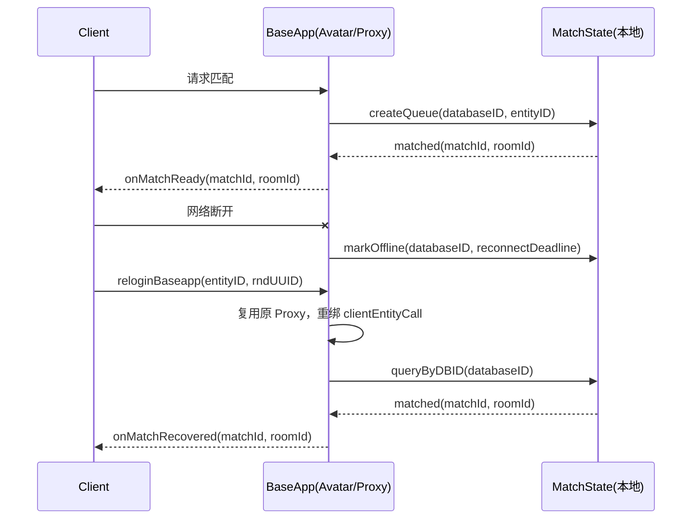

这个模型里：

- `entityID` 用于 `BaseApp` 本地重新找到活着的实体
- `databaseID` 用于在匹配状态表里稳定索引这个玩家
- 匹配状态本身可以直接挂在 `Avatar` 上，也可以挂在 `BaseApp` 的玩法模块上

如果是单服设计，推荐最小可用的数据结构是：

```python
class LocalMatchState(object):
    avatarDBID: int
    entityID: int
    phase: str
    matchId: str
    roomId: str
    online: bool
    reconnectDeadline: int
```

#### 跨服匹配的重连时序

跨服时，最关键的变化是：匹配状态不能再依赖某个 `BaseApp` 里的内存对象。

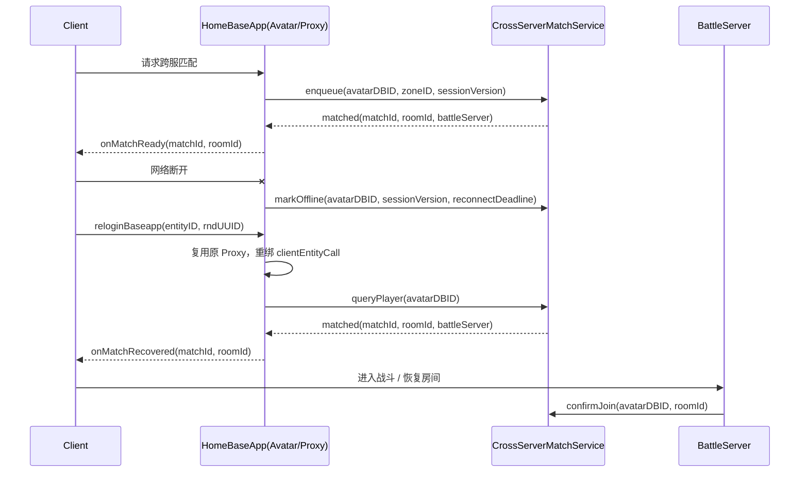

跨服场景里，几个约束必须更严格：

- 匹配中心或战斗服务必须用 `databaseID` 做主键
- `entityID` 只能作为 HomeBaseApp 当前在线实体的局部引用
- 每次重连都最好推进 `sessionVersion`
- 跨服服务处理离线/重连消息时，必须校验 `sessionVersion`，避免旧消息回写新状态

一个更稳妥的跨服成员镜像可以写成：

```python
class MemberSnapshot(object):
    avatarDBID: int
    entityID: int
    zoneID: int
    homeBaseappID: int
    matchId: str
    roomId: str
    phase: str
    online: bool
    sessionVersion: int
    reconnectDeadline: int
```

字段职责分别是：

- `avatarDBID`
  - 跨服长期主键
  - 用于结算、惩罚、恢复匹配记录
- `entityID`
  - 当前在线实体句柄
  - 只在 HomeBaseApp 当前激活期间有效
- `sessionVersion`
  - 一次会话对应一个版本
  - 新重连成功后，旧离线通知就不能再覆盖新状态

#### 什么时候应该处罚，什么时候不应该

还是用"匹配成功后掉线"这个场景，可以把策略压缩成一个判断表：

| 场景 | 是否处罚 | 说明 |
|------|---------|------|
| 玩家主动点击取消匹配 | 是 | 明确业务动作 |
| 已匹配后拒绝确认进入 | 是 | 明确 no-show |
| 已匹配后断线，但在宽限期内重连 | 否 | 只丢会话，不丢玩法资格 |
| 已匹配后断线，宽限期超时未归 | 视规则而定 | 可记 no-show 或失败 |
| 战斗中断线，但宽限期内回到战斗 | 否 | 应恢复状态而不是处罚 |
| 战斗中断线且超时未归 | 通常是 | 可判负或记逃跑 |

所以最关键的设计不是"如何检测断线"，而是：

- **把断线先落成 Presence 变化**
- **再由玩法状态机决定是否取消、失败或处罚**

如果把这层关系画成更抽象的依赖顺序，就是：

```text
socket/channel 断开
  -> Proxy.onClientDeath()
  -> online/presence 变为 false
  -> Match/Battle 状态机收到离线事件
  -> 根据 phase + deadline 决定恢复、清理或处罚
```

#### 一套更接近实战的代码骨架

上面这些规则如果要真正落地，建议拆成三块职责：

- `Avatar`：持有玩家在线态与当前玩法引用
- `LocalMatchService`：本服匹配状态拥有者
- `CrossServerMatchService`：跨服匹配状态拥有者

先定义一个最小状态对象：

```python
class MatchPhase:
    IDLE = "IDLE"
    QUEUEING = "QUEUEING"
    MATCHED = "MATCHED"
    IN_ROOM = "IN_ROOM"
    IN_BATTLE = "IN_BATTLE"
    FINISHED = "FINISHED"


class MatchState(object):
    def __init__(self):
        self.phase = MatchPhase.IDLE
        self.matchId = ""
        self.roomId = ""
        self.battleServer = 0
        self.online = True
        self.sessionVersion = 0
        self.reconnectDeadline = 0
```

`Avatar` 侧只负责两件事：把连接变化翻译成 Presence 变化，以及把当前状态重推给客户端。

```python
class Avatar(KBEngine.Proxy):
    def __init__(self):
        KBEngine.Proxy.__init__(self)
        self.matchState = MatchState()

    def getLogicNow(self):
        # 实际项目里应统一封装，不要直接混用本地 wall clock
        return int(KBEngine.time())

    def onClientDeath(self):
        self.matchState.online = False

        if self.matchState.phase == MatchPhase.MATCHED:
            self.matchState.reconnectDeadline = self.getLogicNow() + 30
            LocalMatchService.getInstance().markOffline(
                self.databaseID,
                self.matchState.sessionVersion,
                self.matchState.reconnectDeadline
            )

        elif self.matchState.phase == MatchPhase.IN_BATTLE:
            CrossServerMatchService.getInstance().markOffline(
                self.databaseID,
                self.matchState.sessionVersion,
                self.getLogicNow() + 120
            )

    def onClientEnabled(self):
        self.matchState.online = True
        self.matchState.sessionVersion += 1

        state = LocalMatchService.getInstance().query(self.databaseID)
        if state is None:
            state = CrossServerMatchService.getInstance().query(self.databaseID)

        if state is None:
            return

        self.matchState = state
        self.client.onMatchStateSync(
            state.phase,
            state.matchId,
            state.roomId,
            state.reconnectDeadline
        )
```

本服匹配服务的关键不是复杂算法，而是把"断线"和"取消"分开：

```python
class LocalMatchService(object):
    _instance = None

    @classmethod
    def getInstance(cls):
        if cls._instance is None:
            cls._instance = cls()
        return cls._instance

    def __init__(self):
        self.states = {}   # avatarDBID -> MatchState

    def enqueue(self, avatar):
        state = self.states.setdefault(avatar.databaseID, MatchState())
        state.phase = MatchPhase.QUEUEING
        state.online = True
        state.sessionVersion = avatar.matchState.sessionVersion

    def onMatched(self, avatarDBID, matchId, roomId):
        state = self.states[avatarDBID]
        state.phase = MatchPhase.MATCHED
        state.matchId = matchId
        state.roomId = roomId

    def markOffline(self, avatarDBID, sessionVersion, reconnectDeadline):
        state = self.states.get(avatarDBID)
        if state is None:
            return

        if sessionVersion != state.sessionVersion:
            return

        state.online = False
        state.reconnectDeadline = reconnectDeadline

    def cancelByPlayer(self, avatarDBID):
        state = self.states.get(avatarDBID)
        if state is None:
            return

        state.phase = MatchPhase.IDLE
        PenaltyService.getInstance().punishNoShow(avatarDBID)

    def query(self, avatarDBID):
        return self.states.get(avatarDBID)

    def tick(self, now):
        for avatarDBID, state in list(self.states.items()):
            if state.phase == MatchPhase.MATCHED and not state.online:
                if now >= state.reconnectDeadline:
                    state.phase = MatchPhase.FINISHED
                    PenaltyService.getInstance().punishNoShow(avatarDBID)
```

跨服匹配服务相比本服，多出来的不是业务规则，而是**远程状态镜像**与**版本保护**：

```python
class CrossServerMatchService(object):
    _instance = None

    @classmethod
    def getInstance(cls):
        if cls._instance is None:
            cls._instance = cls()
        return cls._instance

    def __init__(self):
        self.snapshots = {}   # avatarDBID -> MatchState

    def enqueue(self, avatarDBID, zoneID, sessionVersion):
        state = self.snapshots.setdefault(avatarDBID, MatchState())
        state.phase = MatchPhase.QUEUEING
        state.online = True
        state.sessionVersion = sessionVersion

    def onMatched(self, avatarDBID, matchId, roomId, battleServer):
        state = self.snapshots[avatarDBID]
        state.phase = MatchPhase.MATCHED
        state.matchId = matchId
        state.roomId = roomId
        state.battleServer = battleServer

    def markOffline(self, avatarDBID, sessionVersion, reconnectDeadline):
        state = self.snapshots.get(avatarDBID)
        if state is None:
            return

        if sessionVersion != state.sessionVersion:
            return

        state.online = False
        state.reconnectDeadline = reconnectDeadline

    def onReconnect(self, avatarDBID, newSessionVersion):
        state = self.snapshots.get(avatarDBID)
        if state is None:
            return None

        state.online = True
        state.sessionVersion = newSessionVersion
        return state

    def query(self, avatarDBID):
        return self.snapshots.get(avatarDBID)
```

这一套骨架有三个设计点最值得保留：

1. `Avatar` 不直接决定处罚，只上报连接态变化
2. 匹配服务永远用 `databaseID` 作为长期主键
3. 所有离线/重连消息都经过 `sessionVersion` 过滤，避免旧消息覆盖新状态

如果再压缩成一句实现原则，就是：

```text
Proxy 负责连接恢复
Match/Battle 负责玩法恢复
Penalty 只对明确的玩法违规负责
```

### 22.10.6 控制权转移

`Proxy::giveClientTo` 更进一步——"客户端控制哪个 Proxy"本身可以切换。

KBEngine 实现：

```cpp
// kbe/src/server/baseapp/proxy.cpp

void Proxy::giveClientTo(Proxy* proxy)
{
    // 校验：自身不能 destroyed，必须有 clientEntityCall
    // 校验：目标不能 destroyed，不能是自身，不能已有 clientEntityCall

    Network::Channel* lpChannel = clientEntityCall_->getChannel();
    // ... 把客户端通道转移给新 Proxy
}
```

这条链里会发生：

1. 旧 Proxy 如有 Cell，向 Cell 发送 `onLoseWitness`
2. 客户端收到 `onEntityDestroyed`，删除旧控制实体
3. 新 Proxy 创建自己的 `clientEntityCall`
4. `BaseApp::createClientProxies()` 把新控制实体同步给客户端
5. `Proxy::onGetWitness()` 再次驱动 Cell 侧建立 Witness/视野

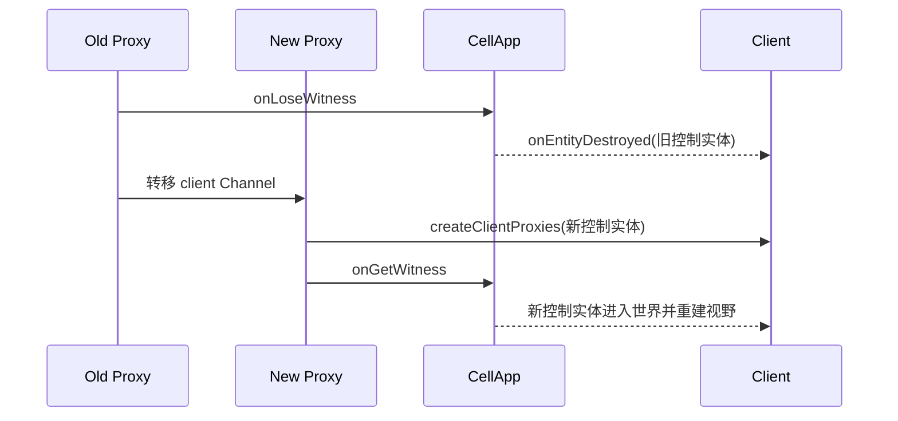

### 22.10.7 恢复主线

```mermaid
flowchart TD
    P["Proxy<br/>Base 层逻辑身份"] --- E["clientEntityCall<br/>客户端连接引用"]
    P --- C["Cell 实体<br/>空间状态"]
    C --- W["Witness<br/>视野同步通道"]
    E --- CL["Client Channel<br/>当前网络会话"]
```

这四个对象彼此关联但不是同一个对象。正因为拆开了，系统才有能力支持重连、挤号和控制权迁移。

---

## 22.11 属性/方法/持久化三类数据的流向

### 属性更新

```mermaid
flowchart LR
    A["脚本 setattr"] --> B["属性描述检查"]
    B --> C["标记脏数据"]
    C --> D["权威侧 Cell/Base 判断"]
    D --> E["Witness 收集可见对象变化"]
    E --> F["Bundle 构造"]
    F --> G["Client 接收属性更新"]
```

"属性更新"不是简单广播，而是被实体位置和视野约束。

### 远程方法调用

```mermaid
flowchart LR
    A["脚本发起 EntityCall"] --> B["查 MethodDescription"]
    B --> C["参数类型检查"]
    C --> D["序列化到 MemoryStream"]
    D --> E["Bundle 发送"]
    E --> F["目标组件解包"]
    F --> G["调用目标脚本方法"]
```

EntityCall 在玩家生命周期里扮演"跨 Base/Cell/Client 协作的动作通道"。

### 持久化

```mermaid
sequenceDiagram
    participant B as Base Entity
    participant C as Cell Entity
    participant D as DBMgr
    participant DB as Database

    B->>C: reqWriteToDBFromBaseapp(如果 Cell 存在)
    C-->>B: onCellWriteToDBCompleted(cellData)
    B->>B: onPreArchive + addPersistentsDataToStream
    B->>D: writeEntity(stream)
    D->>DB: DBTaskWriteEntity
    DB-->>D: 写库结果
    D-->>B: onWriteToDBCallback
```

这完全不是"本地对象直接写数据库"，而是一条跨 Base/Cell/DBMgr 的状态收束流水线。

---

## 22.12 KBEngine 与 BigWorld 对照

| 维度 | KBEngine | BigWorld |
|------|---------|---------|
| **接入层安全** | 无登录挑战 | LoginChallenge（Cuckoo Cycle PoW） |
| **会话凭证** | `rndUUID`（64位随机数） | `SessionKey`（每次重新生成） |
| **数据库层** | 单一 DBMgr | DBApp + DBAppMgr 两级 |
| **在线状态** | KBEEntityLogTable（DBMgr 维护） | bigworldLogOns（DBApp 维护） |
| **PendingLogin** | PendingLoginMgr（简单映射） | PendingLogins（超时队列 + NAT 检测） |
| **实体恢复** | 从数据库恢复（`createEntityFromDBID`） | 从备份流恢复（`restoreTo`） |
| **恢复速度** | 需查数据库，较慢 | 从备份恢复，较快 |
| **Cell 创建** | `createCellEntity` | `createEntity` / `restoreEntity`（区分新创建和恢复） |
| **Witness 初始化** | 简单 viewEntities_ | 复杂（alias 池 + 优先级队列 + AOI 映射） |
| **断线原因** | 粗粒度 | 精细分类（TIMEOUT/RATE_LIMIT/SHUTDOWN/...） |
| **重连恢复** | 重新绑定 Proxy + 重建 Witness | 类似 + onRestored 钩子 |
| **备份基础设施** | 无跨进程备份 | BackupSender 跨 BaseApp 备份 |

---

## 22.13 源码入口表

| 源码模块 | 文件路径 | 关键类/函数 |
|---------|---------|------------|
| **阶段 1-2：登录接入** | | |
| KBEngine LoginApp | `kbe/src/server/loginapp/loginapp.cpp` | `onLoginAccountQueryResultFromDbmgr` |
| KBEngine LoginApp 接口 | `kbe/src/server/loginapp/loginapp_interface.h` | LoginAppInterface 消息定义 |
| BigWorld LoginApp | `BigWorld-Engine-14.4.1/server/loginapp/loginapp.cpp` | LoginApp 主循环 |
| BigWorld 登录请求 | `BigWorld-Engine-14.4.1/server/loginapp/client_login_request.cpp` | `ClientLoginRequest` |
| BigWorld 数据库回复 | `BigWorld-Engine-14.4.1/server/loginapp/database_reply_handler.cpp` | `DatabaseReplyHandler::handleMessage` |
| **阶段 2-3：状态查询** | | |
| KBEngine DBMgr | `kbe/src/server/dbmgr/dbtasks.cpp` | 登录相关 Task |
| BigWorld DBApp Login | `BigWorld-Engine-14.4.1/server/dbapp/login_handler.cpp` | `checkOutEntity` |
| **阶段 3-4：分配与会话** | | |
| KBEngine BaseAppMgr | `kbe/src/server/baseappmgr/baseappmgr.cpp` | 分配 BaseApp |
| BigWorld PendingLogins | `BigWorld-Engine-14.4.1/server/baseapp/pending_logins.cpp` | `PendingLogins::add` / `tick` |
| BigWorld LoginHandler | `BigWorld-Engine-14.4.1/server/baseapp/login_handler.cpp` | `LoginHandler::login` |
| **阶段 4-5：会话建立与实体恢复** | | |
| KBEngine BaseApp | `kbe/src/server/baseapp/baseapp.cpp` | `loginBaseapp` / `reloginBaseapp` / `logoutBaseapp` |
| KBEngine Proxy | `kbe/src/server/baseapp/proxy.cpp` | `giveClientTo` / `onGetWitness` |
| BigWorld Proxy | `BigWorld-Engine-14.4.1/server/baseapp/proxy.cpp` | `onClientDeath` / `onRestored` / `attachToClient` |
| BigWorld Base 恢复 | `BigWorld-Engine-14.4.1/server/baseapp/base.cpp` | `restoreTo` / `restoreCellData` |
| **阶段 6：Cell 创建** | | |
| KBEngine Entity | `kbe/src/server/baseapp/entity.cpp` | `createCellEntity` / `createCellEntityInNewSpace` |
| KBEngine CellApp | `kbe/src/server/cellapp/entity.cpp` | `onGetWitness` |
| **阶段 7：Witness 建立** | | |
| KBEngine Witness | `kbe/src/server/cellapp/witness.cpp` | `onEnterSpace` / `installViewTrigger` / `update` |
| BigWorld Witness | `BigWorld-Engine-14.4.1/server/cellapp/witness.cpp` | `Witness()` 构造 / `update` / `addToAoI` |

---

## 22.14 源码漫游路径

### 路径 A：跟随一次完整登录

```
1. kbe/src/server/loginapp/loginapp.cpp
   → 找到 login 方法，看客户端请求如何进入系统

2. kbe/src/server/dbmgr/dbtasks.cpp
   → 找到登录查询 Task，看 DBMgr 如何处理账号查询

3. kbe/src/server/loginapp/loginapp.cpp
   → 找到 onLoginAccountQueryBaseappAddrFromBaseappmgr
   → 看 BaseApp 地址如何回传给客户端

4. kbe/src/server/baseapp/baseapp.cpp
   → 找到 loginBaseapp
   → 看 PendingLoginMgr 如何匹配待登录记录
   → 跟踪 onQueryAccountCBFromDbmgr → createEntity → initializeEntity

5. kbe/src/server/baseapp/proxy.cpp
   → 找到 onGetWitness()
   → 看如何通知 CellApp 获得客户端

6. kbe/src/server/cellapp/entity.cpp
   → 找到 onGetWitness(bool fromBase)
   → 看客户端引用如何恢复、Witness 如何建立

7. kbe/src/server/cellapp/witness.cpp
   → 找到 update()
   → 看进入/离开/属性变更如何统一发给客户端
```

### 路径 B：跟随一次写库

```
1. kbe/src/server/baseapp/entity.cpp
   → Entity::writeToDB

2. kbe/src/server/cellapp/entity.cpp
   → Entity::writeToDB（Cell 侧）
   → backupCellData

3. kbe/src/server/baseapp/entity.cpp
   → Entity::onCellWriteToDBCompleted
   → onPreArchive + addPersistentsDataToStream

4. kbe/src/server/dbmgr/dbtasks.cpp
   → DBTaskWriteEntity

5. kbe/src/server/baseapp/entity.cpp
   → Entity::onWriteToDBCallback
```

### 路径 C：跟随一次重连

```
1. kbe/src/server/baseapp/baseapp.cpp
   → reloginBaseapp
   → 校验 entityID + rndUUID

2. kbe/src/server/baseapp/proxy.cpp
   → createClientProxies
   → onGetWitness()

3. kbe/src/server/cellapp/entity.cpp
   → onGetWitness(true)  // fromBase = true
   → 恢复 clientEntityCall
   → 重建 Witness / resetViewEntities
```

---

## 22.15 小结

玩家生命周期不是几个组件名字的串联，而是四条主线的交织：

| 主线 | 路径 | 承载的内容 |
|------|------|-----------|
| **会话主线** | LoginApp -> BaseApp | 认证、分配、会话绑定 |
| **世界主线** | Base -> Cell -> Witness -> Client | 实体创建、空间状态、视野同步 |
| **数据主线** | Cell -> Base -> DBMgr | 状态收束、持久化落库 |
| **恢复主线** | Proxy / clientEntityCall / Witness | 重连、挤号、控制权迁移 |

理解这四条主线的关键在于：**客户端连接、Base Proxy、Cell 实体、Witness 是四个独立对象**。它们彼此关联但不是同一个东西。正因为拆开了，系统才能支持：

- **重连**：客户端换通道，Proxy 不变，Witness 重建
- **挤号**：旧客户端被踢，Proxy 转绑新客户端
- **控制权迁移**：`giveClientTo` 把客户端从一个 Proxy 切到另一个
- **离线写库**：客户端断开后，Base 仍可完成写库流程

BigWorld 在每个阶段都做了更精细的处理（LoginChallenge、PendingLogins 超时、BackupSender 跨进程备份、精细断线分类），但核心模型是一样的——这就是 BigWorld 定义的 Login/Base/Cell/DB 架构的力量：它把问题分解得足够清晰，以至于后续实现者（如 KBEngine）即使在简化细节时，骨架仍然适用。
